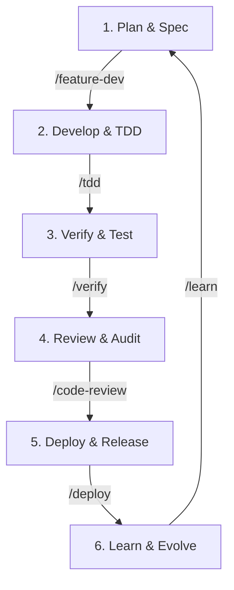

# Intelligent Development Closed Loop

This document defines the standard closed-loop workflow for the AI Agent Testing Platform, utilizing the installed Claude Code plugins and tools.

## The 6-Stage Loop

### 1. Plan & Spec (`/plan`, `/feature-dev`)
*   **Goal**: Turn requirements into a structured plan.
*   **Tools**:
    *   `/feature-dev`: End-to-end feature planning and execution.
    *   `planner` agent: Breaks down complex tasks.
*   **Output**: `task_plan.md`, Architecture Docs.

### 2. Develop & TDD (`/tdd`, `tdd-guide`)
*   **Goal**: Implement features with test-first methodology.
*   **Tools**:
    *   `/tdd`: Red-Green-Refactor cycle.
    *   `security-guidance`: Real-time security checks during editing.
*   **Output**: Code implementation, Unit Tests.

### 3. Verify & Test (`/verify`, `/run-ci`)
*   **Goal**: Ensure system stability and correctness.
*   **Tools**:
    *   `/verify`: Comprehensive check (Lint, Type, Test).
    *   `/e2e`: End-to-end testing.
*   **Output**: Passing Test Suite, Coverage Report.

### 4. Review & Audit (`/code-review`, `/pr-review-toolkit`)
*   **Goal**: High-quality code standards and security assurance.
*   **Tools**:
    *   `/code-review`: Automated multi-agent review.
    *   `/pr-review-toolkit`: Deep dive into PR specifics.
*   **Output**: Review Comments, Approved PR.

### 5. Deploy & Release (`/commit-push-pr`, `/deploy`)
*   **Goal**: Deliver value to production.
*   **Tools**:
    *   `/commit-push-pr`: Streamlined git flow.
    *   `/deploy`: Deployment automation.
*   **Output**: Deployed Application.

### 6. Learn & Evolve (`/learn`, `continuous-learning`)
*   **Goal**: Improve the system and the AI's own context.
*   **Tools**:
    *   `/learn`: Extract patterns and update memory.
    *   `continuous-learning` skill: Save reusable knowledge.
*   **Output**: Updated Core Memory, New Skills, Refined Rules.
