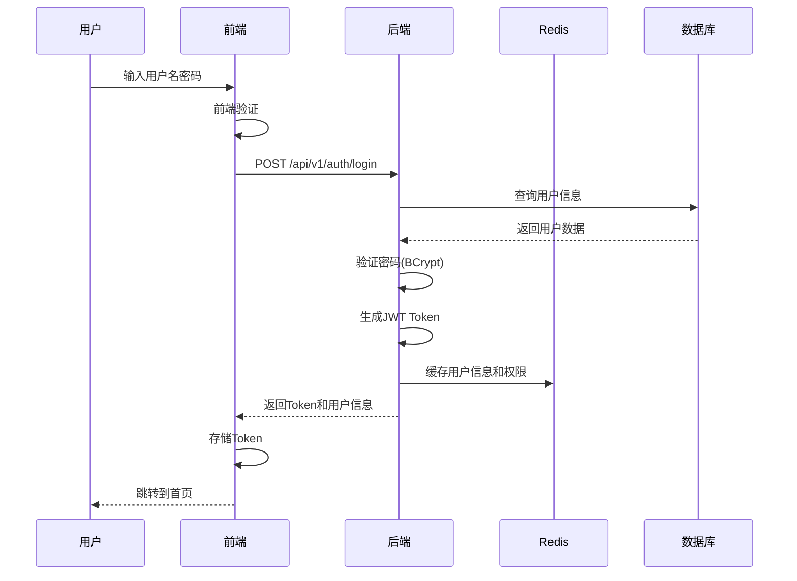

# 命令：generate-sequence-diagram

## 功能描述

根据需求分析和接口设计，生成关键业务流程的时序图（Sequence Diagram），包括用户交互流程、前后端交互流程、微服务交互流程等。

## 使用方式

```
/generate-sequence-diagram
```

或

```
/generate-sequence-diagram <流程类型>
```

## 参数说明

- `--type=user` - 生成用户交互时序图
- `--type=api` - 生成API接口交互时序图
- `--type=auth` - 生成认证授权时序图
- `--type=database` - 生成数据库操作时序图
- `--type=all` - 生成所有时序图（默认）
- `--format=mermaid` - 生成Mermaid格式（默认）
- `--format=plantuml` - 生成PlantUML格式
- `--output=docs/sequence-diagrams/` - 输出目录

## 执行流程

1. **需求分析**：
   - 阅读需求文档和接口设计
   - 识别关键业务流程
   - 分析前后端交互

2. **流程梳理**：
   - 用户登录流程
   - 用户管理流程
   - 权限验证流程
   - 数据查询流程

3. **时序图生成**：
   - 使用Mermaid语法绘制时序图
   - 标注关键步骤和时间点
   - 标注数据流向

4. **文档输出**：
   - 生成Markdown格式文档
   - 保存到 `docs/sequence-diagrams/` 目录

## 时序图类型

### 1. 用户登录认证时序图

展示用户登录、JWT生成、权限获取的完整流程

### 2. 用户管理CRUD时序图

展示用户列表查询、新增、编辑、删除的前后端交互

### 3. 权限验证时序图

展示请求拦截、JWT验证、RBAC权限判断的流程

### 4. 数据库操作时序图

展示从Controller到Mapper层的完整调用链

## 输出格式

### Mermaid格式示例



### Markdown文档结构

```markdown
# 系统时序图

## 1. 用户登录认证时序图

### 流程描述
用户通过输入用户名和密码进行登录，后端验证后生成JWT Token。

### 时序图
```mermaid
...
```

### 关键步骤
1. 用户提交登录表单
2. 后端查询用户信息
3. 密码验证（BCrypt加密）
4. 生成JWT Token
5. 缓存用户权限信息
6. 返回Token给前端

### 涉及接口
- POST `/api/v1/auth/login`

### 注意事项
- 密码使用BCrypt加密存储
- JWT Token有效期2小时
- 用户权限缓存30分钟
```

## 常见时序图场景

### 用户登录流程
```
用户 → 前端登录页 → 后端登录接口 → 数据库查询 → 密码验证 → JWT生成 → Redis缓存 → 返回Token
```

### 用户列表查询流程
```
用户 → 前端列表页 → 后端列表接口 → Redis缓存检查 → 数据库查询 → 数据返回 → 前端渲染
```

### 权限验证流程
```
用户请求 → 拦截器 → Token验证 → Redis获取权限 → 权限比对 → 允许/拒绝访问
```

### 角色权限配置流程
```
用户 → 前端权限配置页 → 后端接口 → 删除旧权限 → 插入新权限 → 更新Redis缓存
```

## 输出目录结构

```
docs/sequence-diagrams/
├── README.md                # 时序图总览
├── auth-sequence.md         # 认证授权时序图
├── user-sequence.md         # 用户管理时序图
├── role-sequence.md         # 角色管理时序图
├── permission-sequence.md    # 权限管理时序图
└── data-sequence.md         # 数据操作时序图
```

## 使用Mermaid渲染时序图

### 在Markdown中预览

支持的Markdown编辑器：
- VS Code + Mermaid插件
- Typora
- Obsidian
- GitHub/GitLab（原生支持）

### 导出为图片

```bash
# 使用 mmdc 命令行工具
npm install -g @mermaid-js/mermaid-cli
mmdc -i input.mmd -o output.png

# 或使用在线工具
# https://mermaid.live/
```

## 示例

```
/generate-sequence-diagram --type=all --format=mermaid
```

生成所有时序图到 `docs/sequence-diagrams/` 目录。

## 相关命令

- `/analyze-requirement` - 需求分析
- `/generate-api-doc` - 接口文档生成
- `/design-prototype` - 原型设计
