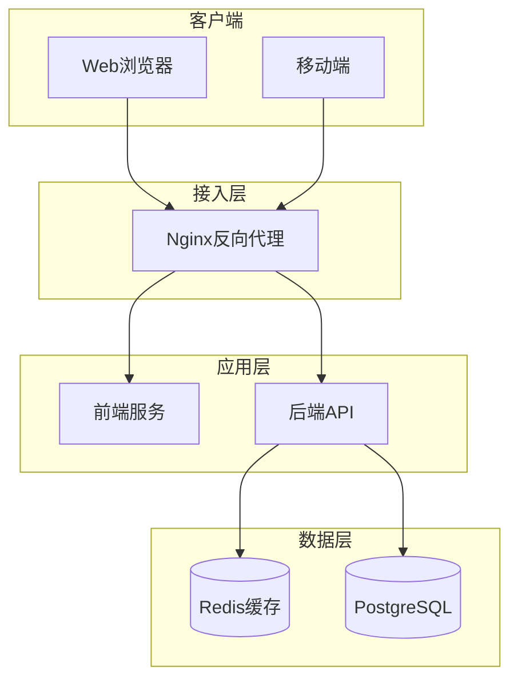

# Skill: Architecture Design（架构设计）

## 技能描述

本技能用于设计系统架构，包括系统架构图、技术架构、部署架构、模块划分、安全设计和缓存策略。

## 适用场景

- 新项目架构设计
- 系统重构架构评估
- 技术方案评审

## 核心能力

### 1. 系统架构设计
- 分层架构设计
- 微服务/单体架构选择
- 系统边界定义

### 2. 技术架构设计
- 前后端技术栈整合
- 中间件选型
- 第三方服务集成

### 3. 部署架构设计
- 容器化方案
- 负载均衡
- 高可用设计

### 4. 安全架构设计
- 认证授权机制
- 数据安全
- 网络安全

## 执行流程

```
1. 阅读需求文档和技术选型
   ↓
2. 设计系统架构图
   ↓
3. 定义技术架构分层
   ↓
4. 设计部署架构
   ↓
5. 划分模块职责
   ↓
6. 设计安全机制
   ↓
7. 制定缓存策略
   ↓
8. 输出架构文档
```

## 输出模板

```markdown
# 架构设计文档

## 1. 系统架构图



## 2. 技术架构

### 2.1 前端架构
| 层级 | 技术 | 说明 |
|------|------|------|
| 框架 | Vue3 + TypeScript | 渐进式框架 |
| 状态管理 | Pinia | 轻量级状态管理 |
| UI组件 | Element Plus | 企业级组件库 |
| HTTP客户端 | Axios | 请求封装 |
| 路由 | Vue Router | 路由管理 |

### 2.2 后端架构
| 层级 | 技术 | 说明 |
|------|------|------|
| 框架 | Spring Boot 3.x | 企业级框架 |
| ORM | MyBatis-Plus | 数据访问 |
| 认证 | JWT | 无状态认证 |
| 缓存 | Redis | 分布式缓存 |
| 文档 | Swagger | API文档 |

### 2.3 分层架构
```
┌─────────────────────────────────┐
│ Controller层（接口层）          │
├─────────────────────────────────┤
│ Service层（业务逻辑层）          │
├─────────────────────────────────┤
│ Repository层（数据访问层）       │
├─────────────────────────────────┤
│ Entity层（实体层）               │
└─────────────────────────────────┘
```

## 3. 部署架构

### 3.1 容器化部署
```yaml
# docker-compose.yml 概览
services:
  nginx:      # 反向代理
  frontend:   # 前端服务
  backend:    # 后端服务
  postgres:   # 数据库
  redis:      # 缓存
```

### 3.2 环境规划
| 环境 | 用途 | 配置 |
|------|------|------|
| dev | 开发环境 | 单节点 |
| test | 测试环境 | 单节点 |
| prod | 生产环境 | 多节点+负载均衡 |

## 4. 模块划分

| 模块 | 职责 | 依赖 |
|------|------|------|
| auth | 认证授权 | - |
| user | 用户管理 | auth |
| {业务模块} | {业务描述} | user |

## 5. 安全设计

### 5.1 认证授权
- **认证方式**：JWT Token
- **Token有效期**：Access Token 2小时，Refresh Token 7天
- **权限模型**：RBAC（基于角色的访问控制）

### 5.2 数据安全
- **传输加密**：HTTPS
- **密码存储**：BCrypt加密
- **敏感数据**：AES加密存储

### 5.3 接口安全
- **防重放**：请求签名 + 时间戳
- **防注入**：参数校验 + ORM
- **限流**：令牌桶算法

## 6. 缓存策略

| 缓存项 | Key格式 | TTL | 更新策略 |
|--------|---------|-----|----------|
| 用户信息 | user:{id} | 30min | 更新时删除 |
| 权限列表 | perm:{userId} | 30min | 角色变更时删除 |
| 配置数据 | config:{key} | 1h | 配置变更时删除 |
```

## 架构图类型

### 1. 系统架构图
展示系统整体结构和组件关系

### 2. 部署架构图
展示服务部署位置和网络拓扑

### 3. 数据流图
展示数据在系统中的流转路径

### 4. 时序图
展示组件间的交互时序（在时序图设计阶段完成）

## 质量检查清单

- [ ] 架构图清晰完整
- [ ] 技术选型合理
- [ ] 分层职责明确
- [ ] 部署方案可行
- [ ] 安全措施完善
- [ ] 缓存策略合理

## 注意事项

1. **简洁实用**：架构设计要符合项目规模，避免过度设计
2. **可扩展性**：预留扩展空间，但不提前实现
3. **安全优先**：安全设计是必选项，不是可选项
4. **运维友好**：考虑监控、日志、故障排查
