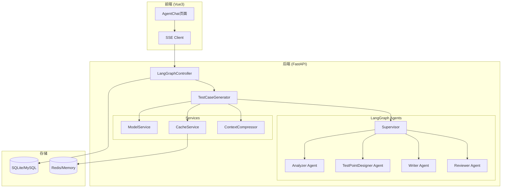

# Design Document: LangGraph TestCase Generator

## Overview

本设计将基于LangGraph的多智能体协作架构集成到测试平台中。系统采用Supervisor模式协调四个专家智能体（Analyzer、TestPointDesigner、Writer、Reviewer），通过SSE实现实时进度推送，支持国产大模型，并通过并行执行和上下文压缩优化性能。

### Key Design Goals

1. **高性能**: 并行执行、上下文压缩、结果缓存
2. **可扩展**: 模块化智能体架构，易于添加新智能体
3. **国产化**: 原生支持DeepSeek、通义千问等国产模型
4. **实时反馈**: SSE流式推送生成进度和结果

## Architecture




## Components and Interfaces

### 1. Backend Components

#### 1.1 LangGraphController (FastAPI Router)

```python
# platform-fastapi-server/aiassistant/api/LangGraphController.py

@router.post("/generate/stream")
async def generate_stream(req: GenerateRequest) -> EventSourceResponse:
    """流式生成测试用例，通过SSE推送进度"""
    
@router.post("/generate/batch")
async def generate_batch(req: BatchGenerateRequest) -> dict:
    """批量生成测试用例"""
    
@router.post("/swagger/parse")
async def parse_swagger(req: SwaggerParseRequest) -> dict:
    """解析Swagger文档，返回API列表"""
    
@router.get("/statistics")
async def get_statistics() -> dict:
    """获取生成统计数据"""
```

#### 1.2 TestCaseGenerator (Core Engine)

```python
# platform-fastapi-server/aiassistant/langgraph/generator.py

class TestCaseGenerator:
    def __init__(self, config: GeneratorConfig):
        self.supervisor = TestCaseSupervisor(...)
        self.cache = CacheService()
        self.compressor = ContextCompressor()
    
    async def generate(
        self, 
        requirement: str,
        test_type: str,
        progress_callback: Callable
    ) -> TestCaseState:
        """生成测试用例，支持进度回调"""
    
    async def batch_generate(
        self,
        requirements: List[str],
        max_concurrent: int = 5
    ) -> List[TestCaseState]:
        """并行批量生成"""
```

#### 1.3 Agent Definitions

```python
# platform-fastapi-server/aiassistant/langgraph/agents/

class AnalyzerAgent:
    """需求分析专家 - 提取测试要素"""
    temperature: float = 0.3
    
class TestPointDesignerAgent:
    """测试点设计专家 - 设计测试覆盖点"""
    temperature: float = 0.5
    
class WriterAgent:
    """用例编写专家 - 生成结构化用例"""
    temperature: float = 0.7
    
class ReviewerAgent:
    """用例评审专家 - 质量评分"""
    temperature: float = 0.1
```


#### 1.4 ModelService (国产模型支持)

```python
# platform-fastapi-server/aiassistant/langgraph/services/model_service.py

PROVIDER_CONFIGS = {
    "deepseek": {"base_url": "https://api.deepseek.com", "default_model": "deepseek-chat"},
    "siliconflow": {"base_url": "https://api.siliconflow.cn/v1", "default_model": "deepseek-ai/DeepSeek-V3"},
    "qwen": {"base_url": "https://dashscope.aliyuncs.com/compatible-mode/v1", "default_model": "qwen-plus"},
    "zhipu": {"base_url": "https://open.bigmodel.cn/api/paas/v4", "default_model": "glm-4"},
    "moonshot": {"base_url": "https://api.moonshot.cn/v1", "default_model": "moonshot-v1-8k"},
}

class ModelService:
    @staticmethod
    def create_chat_model(provider: str, model_code: str, api_key: str, **kwargs) -> ChatOpenAI:
        """创建LangChain ChatOpenAI实例，支持国产模型"""
        config = PROVIDER_CONFIGS.get(provider, {})
        return ChatOpenAI(
            model=model_code,
            api_key=api_key,
            base_url=config.get("base_url"),
            **kwargs
        )
    
    @staticmethod
    async def test_connection(provider: str, api_key: str, model_code: str) -> bool:
        """测试模型连接，5秒超时"""
```

#### 1.5 ContextCompressor (性能优化)

```python
# platform-fastapi-server/aiassistant/langgraph/services/context_compressor.py

class ContextCompressor:
    def __init__(self, summarization_model: ChatOpenAI):
        self.model = summarization_model
    
    def compress(self, messages: List[dict], max_tokens: int = 4000) -> List[dict]:
        """压缩上下文，保留关键信息"""
    
    def estimate_tokens(self, text: str) -> int:
        """估算Token数量"""
```

### 2. Frontend Components

#### 2.1 AgentChatEnhanced.vue

```vue
<!-- platform-vue-web/src/views/aiassistant/agentchat/AgentChatEnhanced.vue -->
<template>
  <div class="agent-chat">
    <ConversationSidebar />
    <ChatMain>
      <MessageList :messages="messages" />
      <ProgressIndicator :stage="currentStage" :progress="progress" />
      <TestCaseCards :cases="testCases" @edit="handleEdit" />
      <InputArea @send="handleSend" />
    </ChatMain>
  </div>
</template>
```

#### 2.2 ProgressIndicator.vue

```vue
<!-- 显示当前智能体执行阶段 -->
<template>
  <div class="progress-indicator" v-if="isGenerating">
    <div class="stage-item" v-for="stage in stages" :class="{ active: stage.name === currentStage }">
      <el-icon><component :is="stage.icon" /></el-icon>
      <span>{{ stage.label }}</span>
      <el-progress v-if="stage.name === currentStage" :percentage="progress" />
    </div>
  </div>
</template>
```


## Data Models

### 1. TestCaseState (LangGraph State)

```python
@dataclass
class TestCaseState:
    """智能体间传递的状态对象"""
    requirement: str                    # 原始需求
    test_type: str = "API"              # 测试类型: API/Web/App
    analysis: Optional[str] = None      # 需求分析结果
    test_points: Optional[str] = None   # 测试点设计
    testcases: Optional[str] = None     # 生成的测试用例JSON
    review: Optional[str] = None        # 评审结果
    quality_score: float = 0.0          # 质量评分 0-100
    iteration: int = 0                  # 当前迭代次数
    max_iterations: int = 3             # 最大迭代次数
    completed: bool = False             # 是否完成
    error: Optional[str] = None         # 错误信息
```

### 2. GenerateRequest (API Request)

```python
class GenerateRequest(BaseModel):
    requirement: str                    # 需求描述
    test_type: str = "API"              # 测试类型
    conversation_id: Optional[int]      # 关联对话ID
    model_config: Optional[ModelConfig] # 模型配置
    max_iterations: int = 2             # 最大迭代次数

class ModelConfig(BaseModel):
    analyzer_model_id: Optional[int]    # 分析器模型ID
    writer_model_id: Optional[int]      # 编写器模型ID
    reviewer_model_id: Optional[int]    # 评审器模型ID
```

### 3. SSE Event Types

```python
class SSEEventType(str, Enum):
    STAGE_START = "stage_start"         # 阶段开始
    STAGE_PROGRESS = "stage_progress"   # 阶段进度
    STAGE_COMPLETE = "stage_complete"   # 阶段完成
    TEXT_CHUNK = "text_chunk"           # 文本片段
    TESTCASE = "testcase"               # 测试用例
    ERROR = "error"                     # 错误
    DONE = "done"                       # 完成

# SSE Event Format
{
    "type": "stage_start",
    "data": {
        "stage": "analyzer",
        "message": "正在分析需求..."
    }
}
```

### 4. GenerationHistory (Database Model)

```python
class GenerationHistory(SQLModel, table=True):
    __tablename__ = "ai_generation_history"
    
    id: Optional[int] = Field(default=None, primary_key=True)
    conversation_id: Optional[int]      # 关联对话
    requirement: str                    # 原始需求
    test_type: str                      # 测试类型
    testcases_json: Optional[str]       # 生成的用例JSON
    quality_score: float = 0.0          # 质量评分
    iteration_count: int = 1            # 迭代次数
    total_tokens: int = 0               # 总Token消耗
    duration_seconds: float = 0.0       # 生成耗时
    model_used: str                     # 使用的模型
    status: str = "completed"           # 状态: completed/failed
    error_message: Optional[str]        # 错误信息
    create_time: datetime               # 创建时间
```


## Correctness Properties

*A property is a characteristic or behavior that should hold true across all valid executions of a system-essentially, a formal statement about what the system should do. Properties serve as the bridge between human-readable specifications and machine-verifiable correctness guarantees.*

### Property 1: Generation Pipeline Completeness
*For any* valid requirement input, the TestCaseGenerator SHALL produce a TestCaseState with non-null analysis, test_points, testcases, and review fields, and the quality_score SHALL be between 0 and 100.
**Validates: Requirements 1.1, 1.2, 1.3, 1.4**

### Property 2: Iteration Control
*For any* generation where quality_score is below 80, the system SHALL re-generate, and *for any* generation, the iteration count SHALL never exceed max_iterations (default 3).
**Validates: Requirements 1.5**

### Property 3: SSE Event Sequence
*For any* generation request, the system SHALL emit events in the order: stage_start(analyzer) → stage_complete(analyzer) → stage_start(designer) → ... → done, and each stage_complete event SHALL contain agent name and duration_seconds > 0.
**Validates: Requirements 2.1, 2.2, 2.3, 2.4, 2.5**

### Property 4: Model Configuration Isolation
*For any* generator configuration with distinct model IDs for analyzer, writer, and reviewer, each agent SHALL use its configured model, and *for any* agent without explicit configuration, it SHALL use the default enabled model.
**Validates: Requirements 3.1, 3.3, 3.4**

### Property 5: Model Validation Timeout
*For any* model connectivity test, the system SHALL return a result (success or failure) within 5 seconds, and invalid API keys SHALL result in failure.
**Validates: Requirements 3.2, 10.4**

### Property 6: Persistence After Generation
*For any* completed generation, the system SHALL create a GenerationHistory record with non-null requirement, testcases_json, quality_score, total_tokens, duration_seconds, and model_used fields.
**Validates: Requirements 4.1, 7.1**

### Property 7: Test Case JSON Structure
*For any* generated testcases string, parsing it as JSON SHALL succeed, and the result SHALL contain an array of objects with required fields: case_name, priority, test_steps, expected_result.
**Validates: Requirements 1.3, 4.4**

### Property 8: Export Format Validity
*For any* test case export to YAML format, the exported string SHALL be valid YAML that can be parsed back to the original test case structure.
**Validates: Requirements 4.4**

### Property 9: Swagger Parsing Completeness
*For any* valid Swagger/OpenAPI document, the parser SHALL extract all paths and operations, and each extracted API SHALL have method, path, and parameters fields.
**Validates: Requirements 5.1**

### Property 10: Batch Generation Concurrency
*For any* batch generation request with N requirements and max_concurrent=M, at most M generations SHALL execute simultaneously, and all N results SHALL be returned.
**Validates: Requirements 5.3, 9.4**

### Property 11: Error Isolation
*For any* agent failure during generation, the error SHALL be captured in TestCaseState.error, and the failure SHALL not affect subsequent generation requests.
**Validates: Requirements 7.3, 8.3**

### Property 12: Context Compression Effectiveness
*For any* context exceeding 4000 tokens, compression SHALL reduce token count by at least 30%, and the compressed context SHALL preserve key information (requirement, test_type, previous analysis).
**Validates: Requirements 9.3**

### Property 13: Provider URL Auto-fill
*For any* supported provider (deepseek, siliconflow, qwen, zhipu, moonshot), selecting the provider SHALL auto-fill the correct default API URL from PROVIDER_CONFIGS.
**Validates: Requirements 10.3, 10.5**


## Error Handling

### 1. LLM API Errors

```python
class LLMError(Exception):
    """LLM调用错误基类"""
    pass

class LLMTimeoutError(LLMError):
    """LLM调用超时"""
    pass

class LLMRateLimitError(LLMError):
    """API限流错误"""
    pass

# 错误处理策略
ERROR_HANDLERS = {
    LLMTimeoutError: {"retry": 3, "backoff": 2.0},
    LLMRateLimitError: {"retry": 5, "backoff": 5.0},
}
```

### 2. Agent Failure Recovery

```python
async def run_with_recovery(agent: BaseAgent, state: TestCaseState) -> TestCaseState:
    """带错误恢复的智能体执行"""
    try:
        return await agent.run(state)
    except LLMError as e:
        state.error = str(e)
        # 记录错误但不中断流程
        logger.error(f"Agent {agent.name} failed: {e}")
        return state
```

### 3. SSE Error Events

```python
# 错误事件格式
{
    "type": "error",
    "data": {
        "stage": "writer",
        "error": "LLM timeout after 120s",
        "recoverable": True
    }
}
```

## Testing Strategy

### 1. Unit Tests

- **ModelService Tests**: 验证各提供商模型创建和连接测试
- **ContextCompressor Tests**: 验证压缩效果和信息保留
- **Agent Tests**: 验证各智能体的输入输出格式

### 2. Property-Based Tests

使用 `hypothesis` 库进行属性测试：

```python
# 测试框架: pytest + hypothesis

from hypothesis import given, strategies as st

@given(st.text(min_size=10, max_size=1000))
def test_generation_pipeline_completeness(requirement: str):
    """Property 1: 生成管道完整性"""
    # Feature: langgraph-testcase-generator, Property 1: Generation Pipeline Completeness
    state = await generator.generate(requirement, "API")
    assert state.analysis is not None
    assert state.test_points is not None
    assert state.testcases is not None
    assert 0 <= state.quality_score <= 100

@given(st.integers(min_value=1, max_value=10))
def test_batch_concurrency(batch_size: int):
    """Property 10: 批量生成并发控制"""
    # Feature: langgraph-testcase-generator, Property 10: Batch Generation Concurrency
    requirements = [f"Requirement {i}" for i in range(batch_size)]
    results = await generator.batch_generate(requirements, max_concurrent=3)
    assert len(results) == batch_size
```

### 3. Integration Tests

- **End-to-End Generation**: 完整流程测试
- **SSE Streaming**: 验证事件流正确性
- **Database Persistence**: 验证数据持久化


## File Structure

```
platform-fastapi-server/
└── aiassistant/
    ├── api/
    │   ├── LangGraphController.py      # 新增: LangGraph生成接口
    │   └── ... (existing)
    ├── langgraph/                       # 新增: LangGraph模块
    │   ├── __init__.py
    │   ├── generator.py                 # 核心生成器
    │   ├── supervisor.py                # Supervisor协调者
    │   ├── state.py                     # 状态定义
    │   ├── agents/
    │   │   ├── __init__.py
    │   │   ├── base.py                  # 智能体基类
    │   │   ├── analyzer.py              # 需求分析专家
    │   │   ├── designer.py              # 测试点设计专家
    │   │   ├── writer.py                # 用例编写专家
    │   │   └── reviewer.py              # 用例评审专家
    │   ├── services/
    │   │   ├── __init__.py
    │   │   ├── model_service.py         # 模型服务(国产模型支持)
    │   │   ├── cache_service.py         # 缓存服务
    │   │   └── context_compressor.py    # 上下文压缩
    │   └── prompts/
    │       ├── analyzer.txt
    │       ├── designer.txt
    │       ├── writer.txt
    │       └── reviewer.txt
    ├── model/
    │   └── GenerationHistory.py         # 新增: 生成历史模型
    └── schemas/
        └── langgraph_schema.py          # 新增: LangGraph相关Schema

platform-vue-web/
└── src/
    └── views/
        └── aiassistant/
            └── agentchat/
                ├── AgentChatEnhanced.vue    # 增强版对话页面
                ├── components/
                │   ├── ProgressIndicator.vue # 进度指示器
                │   ├── TestCaseCard.vue      # 测试用例卡片
                │   └── ModelSelector.vue     # 模型选择器
                └── composables/
                    └── useLangGraph.js       # LangGraph相关逻辑
```

## API Endpoints Summary

| Method | Endpoint | Description |
|--------|----------|-------------|
| POST | `/LangGraph/generate/stream` | 流式生成测试用例 |
| POST | `/LangGraph/generate/batch` | 批量生成测试用例 |
| POST | `/LangGraph/swagger/parse` | 解析Swagger文档 |
| GET | `/LangGraph/statistics` | 获取生成统计 |
| GET | `/LangGraph/history` | 获取生成历史 |
| POST | `/LangGraph/model/test` | 测试模型连接 |

## Performance Targets

| Metric | Target | Measurement |
|--------|--------|-------------|
| Single requirement analysis | < 15s | End-to-end time |
| Full generation (with review) | < 60s | End-to-end time |
| Token reduction (compression) | 30-50% | Before/after comparison |
| Batch concurrency | Up to 10 | Simultaneous requests |
| SSE latency | < 100ms | Event delivery time |
