# AI代理测试平台功能完善及单元测试设计

## 1. 概述

本设计文档旨在完善现有AI代理测试平台的功能，并为后端API服务建立完整的单元测试体系。项目采用前后端分离架构，后端基于FastAPI的五层架构设计，前端使用Vue 3 + TypeScript技术栈。

### 1.1 功能完善目标

- 完善AI代理管理功能的后端API实现
- 实现基于AI的智能测试用例生成功能
- 完善测试报告管理功能的后端API实现
- 建立AI模型配置和对话界面
- 建立完整的单元测试覆盖体系

### 1.2 技术架构

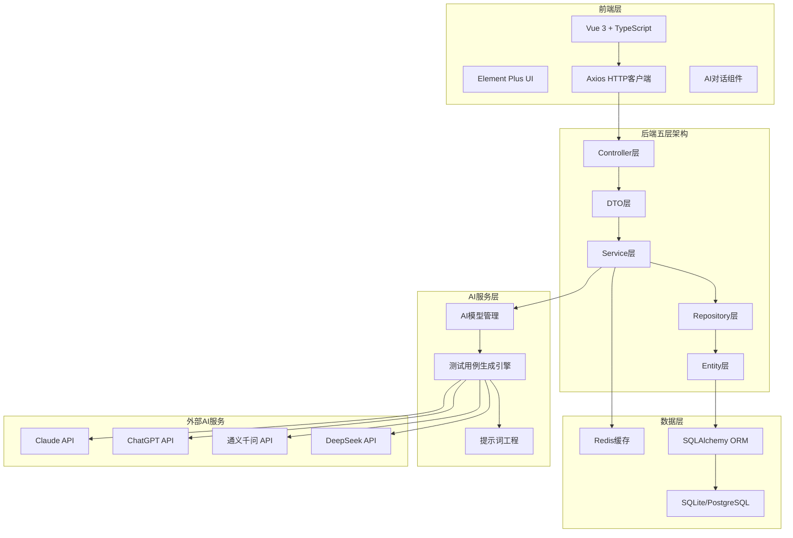

## 2. AI代理管理功能完善

### 2.1 数据模型设计

#### AI代理实体模型

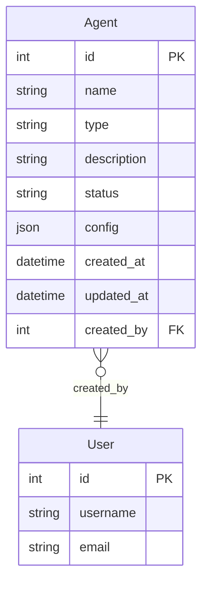

#### 代理配置参数模型

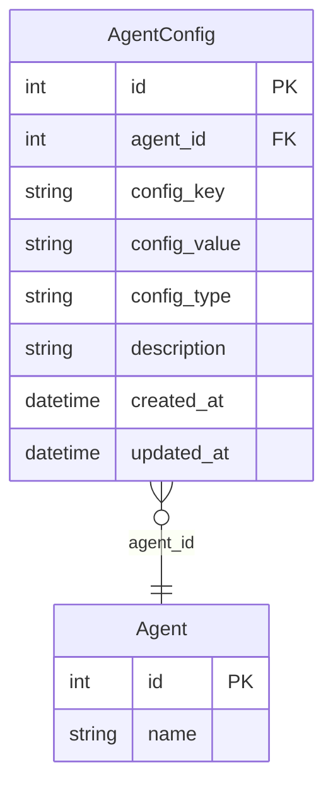

### 2.2 API接口设计

#### 代理管理接口

| 接口路径 | HTTP方法 | 功能描述 | 请求参数 | 响应数据 |
|---------|----------|----------|----------|----------|
| `/api/v1/agents` | GET | 获取代理列表 | page, page_size, status, name | 分页代理列表 |
| `/api/v1/agents` | POST | 创建新代理 | name, type, description, config | 代理详情 |
| `/api/v1/agents/{id}` | GET | 获取代理详情 | id | 代理详情 |
| `/api/v1/agents/{id}` | PUT | 更新代理信息 | id, name, type, description, config | 代理详情 |
| `/api/v1/agents/{id}` | DELETE | 删除代理 | id | 删除结果 |
| `/api/v1/agents/{id}/start` | POST | 启动代理 | id | 操作结果 |
| `/api/v1/agents/{id}/stop` | POST | 停止代理 | id | 操作结果 |
| `/api/v1/agents/{id}/status` | GET | 获取代理状态 | id | 状态信息 |

## 3. AI智能测试用例生成功能

### 3.1 多智能体协作架构设计

#### 3.1.1 核心设计理念

基于AutoGen框架构建多智能体协作的测试用例生成系统，完全模拟企业级测试团队的专业分工模式，通过角色化专业分工实现高质量测试用例的自动化生成。

##### 设计原则

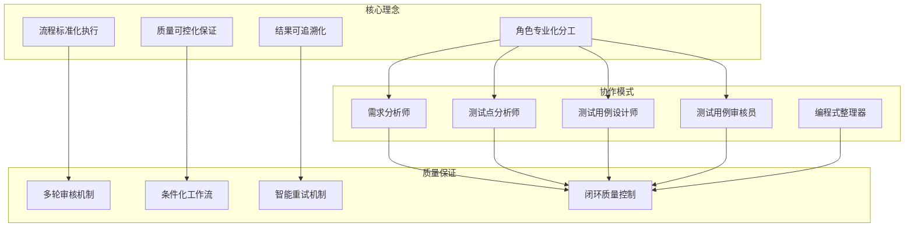

#### 3.1.2 智能体角色定义

##### 需求分析师（Requirements_Analyst）

**核心职责**：深度分析需求文档，提供全面的测试点指导清单

**专业能力**：
- 深度阅读需求文档，理解业务功能、操作流程、界面交互
- 识别功能模块，按业务逻辑进行合理划分
- 提取测试点，为每个功能模块识别关键测试点
- 分析测试场景，考虑正常、异常、边界等各种情况

**工作策略**：
```python
REQUIREMENTS_ANALYST_PROMPT = """
🔥 **重要说明**：
- 你提供的测试点将作为**测试用例的标题和覆盖范围指导**
- 测试用例设计师会基于你的测试点来确定测试范围
- 因此你需要提供**完整、准确、结构化**的测试点清单

你的职责：
1. **深度阅读需求文档**：全面理解业务功能、操作流程、界面交互、数据处理等
2. **识别功能模块**：按业务逻辑划分功能模块，确保模块划分合理清晰
3. **提取测试点**：为每个功能模块识别所有需要测试的关键点
4. **分析测试场景**：考虑正常、异常、边界等各种测试场景
5. **整理测试清单**：输出结构化的测试点清单

🔥 **测试点识别策略**：

**正常流程测试点**（必须覆盖）：
- 核心业务功能的主流程测试点
- 用户操作的标准路径测试点
- 界面交互的基本功能测试点

**异常&边界值测试点**（根据需求复杂度决定）：
⚠️ **仅在以下情况下才包含异常&边界值测试点**：
- 需求文档中明确提到了输入数据的限制条件
- 需求文档中描述了异常情况的处理方式
- 业务功能涉及关键数据处理或安全敏感操作
- 需求文档较为复杂，包含多种业务规则和约束条件

**专项验证测试点**（根据需求文档的具体要求决定）：
⚠️ **仅在需求文档中明确提及相关要求时才包含专项验证测试点**：
- **UI验证**：仅当需求文档明确提到界面显示、交互体验要求时
- **权限验证**：仅当需求文档明确涉及用户权限、操作权限控制时
- **性能验证**：仅当需求文档明确提到响应时间、并发处理要求时
- **兼容性验证**：仅当需求文档明确要求支持多浏览器、设备兼容时
- **安全性验证**：仅当需求文档明确涉及数据安全、访问安全时

输出格式：
## 功能模块1：[模块名称]
### 正常流程测试点：
- [编号]、[测试点名称]：[简要说明]

### 异常&边界值测试点：（仅在需求文档明确涉及时才包含此部分）
- [编号]、[测试点名称]：[简要说明]

### 专项验证测试点：（仅在需求文档明确提及相关要求时才包含此部分）
- [编号]、[测试点名称]：[简要说明]
"""
```

##### 测试用例设计师（Test_Case_Designer）

**核心职责**：基于需求文档和测试点，设计具体可执行的测试用例

**工作流程**：
1. 仔细阅读原始需求文档 - 深入理解功能细节
2. 逐一列出需求分析师的所有测试点 - 确保无遗漏
3. 按照测试点顺序逐一编写测试用例 - 一对一对应
4. 基于需求文档编写具体测试步骤 - 确保可追溯性
5. 最终检查数量和顺序 - 确保完整性

**设计原则**：
```python
TEST_CASE_DESIGNER_PROMPT = """
🔥 **核心工作流程（必须严格遵循）**：
1. **第一步：仔细阅读原始需求文档** - 深入理解业务功能、操作流程、界面交互、数据处理等细节
2. **第二步：逐一列出需求分析师的所有测试点** - 确保没有遗漏任何一个测试点
3. **第三步：按照测试点顺序逐一编写测试用例** - 每个测试点对应一个测试用例，不能跳过
4. **第四步：基于需求文档编写具体的测试步骤** - 测试步骤必须来源于需求文档的实际功能描述
5. **第五步：最终检查数量和顺序** - 确保测试用例数量=测试点数量，顺序完全一致

⚠️ **重要原则**：
- **需求分析师的测试点** = 用例标题和测试范围指导
- **需求文档的功能描述** = 测试步骤的具体内容来源
- **绝不能**仅仅基于测试点名称就编写测试步骤，必须回到需求文档找到对应的功能细节

🔥 **设计原则**：
- **严格按照测试点顺序编写**：必须按照需求分析师提供的测试点顺序，逐一编写测试用例
- **一个测试点 → 一个测试用例**：每个测试点都必须有对应的测试用例，不能遗漏任何一个
- **测试点作标题，需求文档作内容**：用例名称直接使用测试点名称，但测试步骤必须基于需求文档
- **步骤具体可操作**：每个测试步骤都要包含具体的操作描述（点击什么按钮、输入什么数据、在哪个页面等）
- **预期结果可验证**：明确说明期望看到什么结果、什么状态变化、什么数据展示

输出要求：
**开始编写前，必须先统计测试点数量**：
测试点统计：
功能模块X：
- 正常流程测试点：[测试点1]、[测试点2]...（共X个）
- 异常&边界值测试点：[测试点1]、[测试点2]...（共X个）
- 专项验证测试点：[测试点1]、[测试点2]...（共X个）
总计：X个测试点，需要编写X个测试用例

**然后按照以下JSON格式生成测试用例**：
{
"业务模块名称": [
    {
      "ID": "用例编号",
      "用例名称": "[测试点名称]（直接使用需求分析师的测试点名称，不要修改）",
      "所属模块": "业务模块名称",
      "前置条件": "前置条件描述（基于需求文档的具体要求）",
      "备注": "测试用例相关备注说明",
      "步骤描述": "具体操作步骤1（基于需求文档的功能描述）\n具体操作步骤2\n具体操作步骤3",
      "预期结果": "具体预期结果1（基于需求文档的功能要求）\n具体预期结果2\n具体预期结果3",
      "编辑模式": "创建",
      "标签": "功能测试",
      "用例等级": "P1/P2/P3/P4/P5",
      "用例状态": "待执行"
    }
  ]
}
"""
```

##### 测试用例审核员（Test_Reviewer）

**核心职责**：审核和优化测试用例质量，确保符合专业标准

**审核维度**：
```python
TEST_REVIEWER_PROMPT = """
🔥 **核心审核原则**：
- **需求文档是测试用例的根本依据** - 每个测试步骤都应该能在需求文档中找到对应的功能描述
- **测试点是覆盖范围的指导** - 确保需求分析师的测试点都有对应的测试用例
- **测试步骤必须具体可执行** - 基于需求文档的真实功能，而不是抽象的概念

🔥 **重点审查内容**：

**1. 需求文档依据性检查**：
- ✅ 每个测试步骤是否能在需求文档中找到对应的功能描述？
- ✅ 操作路径是否符合需求文档中的业务流程？
- ✅ 数据输入输出是否与需求文档的规格一致？
- ✅ 界面交互是否反映需求文档的UI设计？
- ❌ 是否存在脱离需求文档、仅基于测试点名称想象的步骤？

**2. 测试点覆盖度检查**：
- **数量检查**：测试用例数量是否等于测试点数量？
- **顺序检查**：测试用例顺序是否与测试点顺序完全一致？
- **正常流程测试点**：需求分析师提到的每个正常流程测试点是否都有对应用例？
- **异常&边界值测试点**：每个异常和边界值场景是否都有专门的测试用例？
- **专项验证点**：数据、UI、权限、性能、兼容性、安全性等专项测试是否覆盖？
- **名称一致性**：测试用例名称是否直接使用了测试点名称？

**3. 测试质量标准审查**：
- **步骤具体性**：测试步骤是否包含具体的操作描述（点击什么、输入什么、在哪里操作）？
- **结果可验证性**：预期结果是否明确具体，能够清晰判断通过/失败？
- **前置条件完整性**：是否明确了测试执行前需要满足的所有条件？
- **数据准备充分性**：是否明确了测试需要的具体数据和参数？

审核决策：
- **审核通过**：测试用例完全基于需求文档，覆盖所有测试点
- **需要重新设计**：存在脱离需求、遗漏测试点等问题
"""
```

##### 编程式整理器（TestCaseOrganizer）

**核心职责**：使用确定性算法进行去重和规范化整理

```python
class TestCaseOrganizer:
    """测试用例编程式整理器"""
    
    def __init__(self, 
                 case_similarity_threshold: float = 0.8,
                 module_similarity_threshold: float = 0.8):
        self.case_similarity_threshold = case_similarity_threshold
        self.module_similarity_threshold = module_similarity_threshold
    
    async def organize_test_cases(self, test_cases_json, progress_callback=None):
        """完整的测试用例整理流程"""
        # 1. 提取所有测试用例
        all_cases = self._extract_all_cases(test_cases_json)
        
        # 2. 智能去重
        unique_cases = await self._deduplicate_test_cases(all_cases, progress_callback)
        
        # 3. 模块重组
        organized_result = await self._reorganize_by_modules(unique_cases)
        
        # 4. 质量检查
        validated_result = self._validate_final_result(organized_result)
        
        return validated_result
    
    def _deduplicate_test_cases(self, cases, progress_callback=None):
        """智能去重算法"""
        unique_cases = []
        duplicate_count = 0
        
        for i, case in enumerate(cases):
            is_duplicate = False
            
            for existing_case in unique_cases:
                similarity = self._calculate_case_similarity(case, existing_case)
                
                if similarity >= self.case_similarity_threshold:
                    # 合并重复用例，保留更完整的版本
                    merged_case = self._merge_cases(case, existing_case)
                    # 替换现有用例
                    idx = unique_cases.index(existing_case)
                    unique_cases[idx] = merged_case
                    is_duplicate = True
                    duplicate_count += 1
                    break
            
            if not is_duplicate:
                unique_cases.append(case)
            
            if progress_callback:
                progress_callback(f"去重进度: {i+1}/{len(cases)}, 发现重复: {duplicate_count}")
        
        return unique_cases
```

#### 3.1.3 智能体协作流程

##### 工作流程设计

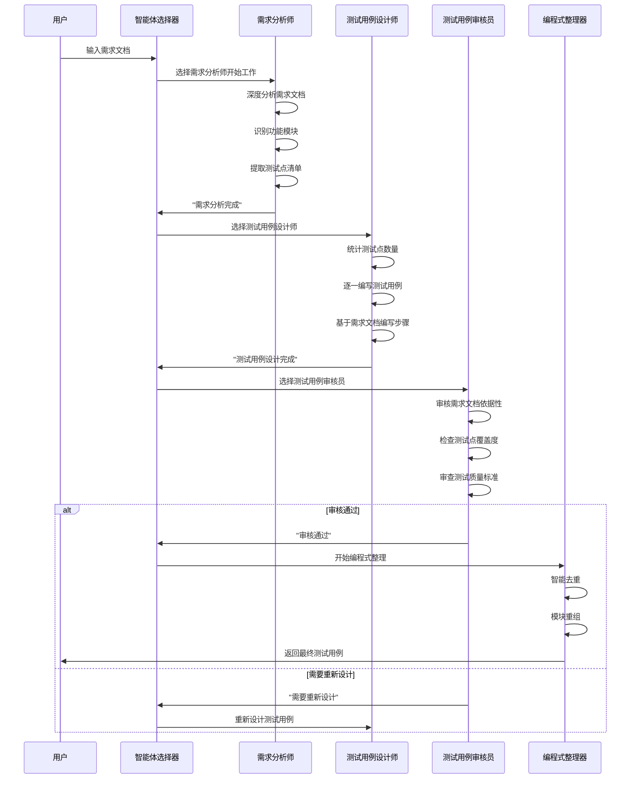

##### 智能体选择机制

```python
def selector_func(messages):
    """根据对话历史和条件逻辑选择下一个发言者"""
    if not messages:
        return "Requirements_Analyst"  # 工作流开始
    
    last_message = messages[-1]
    last_speaker = getattr(last_message, 'source', '')
    last_content = getattr(last_message, 'content', '')
    
    # 条件分支逻辑
    if last_speaker == "Requirements_Analyst":
        if "需求分析完成" in last_content:
            return "Test_Case_Designer"  # 进入设计阶段
        else:
            return "Requirements_Analyst"  # 继续分析
    
    elif last_speaker == "Test_Case_Designer":
        if "测试用例设计完成" in last_content or "测试用例优化完成" in last_content:
            return "Test_Reviewer"  # 进入审核阶段
        else:
            return "Test_Case_Designer"  # 继续设计
    
    elif last_speaker == "Test_Reviewer":
        if "需要重新设计" in last_content:
            return "Test_Case_Designer"  # 重新设计
        elif "审核通过" in last_content:
            return None  # 工作流结束，进入编程式整理
    
    return None
```

#### 3.1.4 流程控制机制

##### 阶段划分

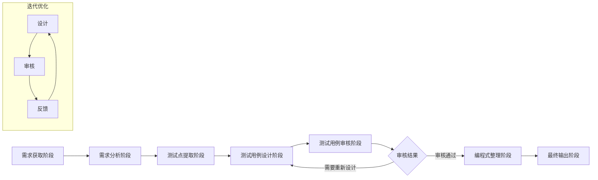

##### 终止条件

- **正常终止**：审核员确认"审核通过"
- **重试限制**：达到最大重试次数（3次）
- **消息限制**：超过最大消息数量（20条）
- **异常终止**：出现系统错误或用户取消

### 3.2 AI模型管理系统

#### 3.2.1 文档获取工具（Requirements_Utils）

**核心职责**：智能获取和预处理各种格式的需求文档

**技术能力**：
- 多源获取：支持URL链接、本地文件、文本内容等多种输入方式
- 格式解析：支持Markdown、HTML、Word、PDF等多种文档格式
- 内容清洗：自动去除无关信息，提取核心需求内容
- 结构化处理：将非结构化文档转换为结构化的需求信息

```python
class RequirementsUtils:
    """需求文档获取和处理工具"""
    
    async def get_requirements_from_url(self, input_source: str) -> str:
        """
        智能获取需求文档内容
        
        Args:
            input_source: 可以是URL、文件路径或直接的文本内容
        
        Returns:
            处理后的结构化需求文档内容
        """
        # 1. 判断输入类型（URL、文件、文本）
        input_type = self._detect_input_type(input_source)
        
        # 2. 根据类型获取原始内容
        if input_type == "url":
            raw_content = await self._fetch_from_url(input_source)
        elif input_type == "file":
            raw_content = self._read_from_file(input_source)
        else:
            raw_content = input_source
        
        # 3. 内容清洗和结构化
        cleaned_content = self._clean_and_structure(raw_content)
        
        # 4. 质量检查和优化
        optimized_content = self._optimize_for_analysis(cleaned_content)
        
        return optimized_content
```

#### 3.2.2 支持的AI模型

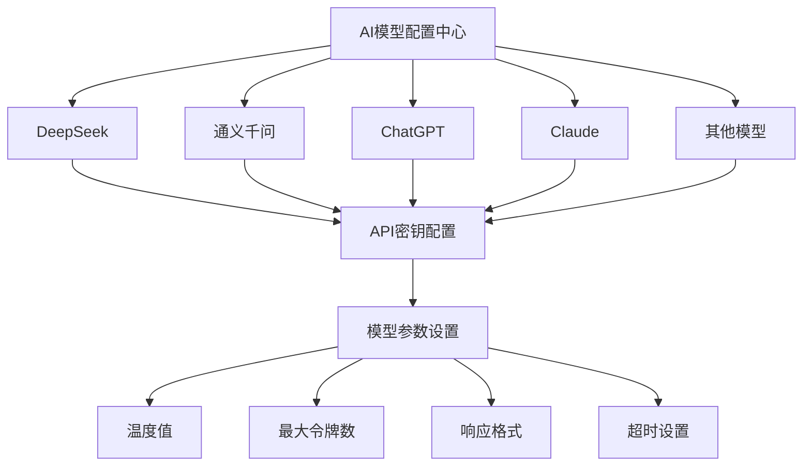

#### 3.2.3 AI模型配置数据结构

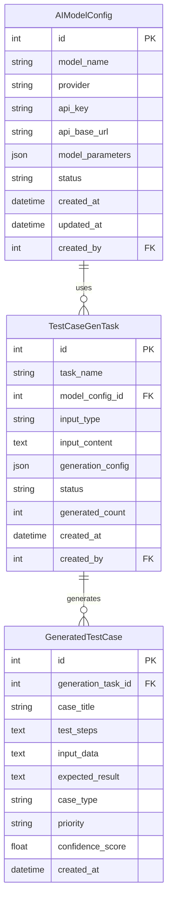

### 3.3 智能体协作系统实现

#### 3.3.1 AutoGen 框架集成

```python
class AutoGenTestCaseAgent(BaseAutoGenAgent):
    """基于AutoGen框架的测试用例生成智能体"""
    
    def __init__(self, model_config: dict):
        super().__init__()
        self.model_config = model_config
        
        # 初始化工具组件
        self.requirements_utils = RequirementsUtils()
        self.test_case_organizer = TestCaseOrganizer()
        self.excel_converter = TestCaseExcelConverter()
        
        # 初始化生成配置
        self.generation_config = GenerationConfig()
        
        # 设置智能体团队
        self._setup_team()
    
    def _setup_team(self):
        """创建智能体团队"""
        # 创建专业角色
        self.requirements_analyst = AssistantAgent(
            name="Requirements_Analyst",
            model_client=self.model_client,
            system_message=self._get_requirements_analyst_prompt()
        )
        
        self.test_case_designer = AssistantAgent(
            name="Test_Case_Designer",
            model_client=self.model_client,
            system_message=self._get_test_case_designer_prompt()
        )
        
        self.test_reviewer = AssistantAgent(
            name="Test_Reviewer",
            model_client=self.model_client,
            system_message=self._get_test_reviewer_prompt()
        )
        
        # 创建团队（包含所有专业角色）
        self.team = SelectorGroupChat(
            participants=[
                self.requirements_analyst,
                self.test_case_designer,
                self.test_reviewer
            ],
            selector_func=self._selector_func,
            termination_condition=self._termination_condition
        )
    
    async def generate_test_cases(self, input_source: str, config: dict = None):
        """完整的测试用例生成流程"""
        try:
            # 1. 使用文档获取工具处理输入
            processed_requirements = await self.requirements_utils.get_requirements_from_url(input_source)
            
            yield {
                "type": "agent_start",
                "message": "测试用例生成智能体启动",
                "agent_id": "autogen_test_case_agent"
            }
            
            # 2. 运行多智能体协作工作流
            async for result in self._run_autogen_workflow(processed_requirements, config or {}):
                yield result
            
            # 3. 编程式整理和Excel转换
            final_test_cases = await self._extract_final_test_cases()
            organized_cases = await self.test_case_organizer.organize_test_cases(final_test_cases)
            excel_file = await self.excel_converter.convert_to_excel(organized_cases)
            
            yield {
                "type": "workflow_complete",
                "result": {
                    "organized_cases": organized_cases,
                    "excel_file": excel_file,
                    "summary": {
                        "total_cases": len(organized_cases.get('test_cases', [])),
                        "modules_count": len(organized_cases.get('modules', [])),
                        "duplicates_removed": organized_cases.get('duplicates_removed', 0)
                    }
                }
            }
            
        except Exception as e:
            yield {
                "type": "error",
                "message": f"测试用例生成失败: {str(e)}",
                "error_type": type(e).__name__
            }
```

#### 3.3.2 质量保证机制

##### 多层质量控制

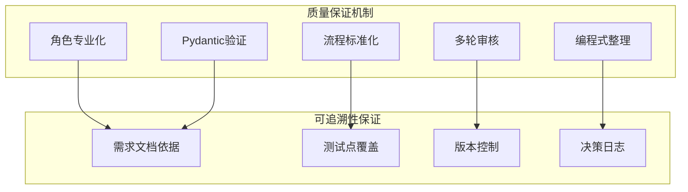

##### 质量检查清单

```python
class QualityAssurance:
    """测试用例质量保证"""
    
    def __init__(self):
        self.quality_checklist = {
            "需求文档依据性": [
                "每个测试步骤是否能在需求文档中找到对应的功能描述",
                "操作路径是否符合需求文档中的业务流程",
                "数据输入输出是否与需求文档的规格一致",
                "界面交互是否反映需求文档的UI设计"
            ],
            "测试点覆盖度": [
                "测试用例数量是否等于测试点数量",
                "测试用例顺序是否与测试点顺序完全一致",
                "测试用例名称是否直接使用了测试点名称",
                "是否覆盖了需求分析师提到的所有测试点"
            ],
            "测试质量标准": [
                "测试步骤是否包含具体的操作描述",
                "预期结果是否明确具体，能够清晰判断通过/失败",
                "是否明确了测试执行前需要满足的所有条件",
                "是否明确了测试需要的具体数据和参数"
            ]
        }
    
    def validate_test_cases(self, test_cases: list, requirements: str, test_points: list) -> dict:
        """验证测试用例质量"""
        validation_result = {
            "is_valid": True,
            "issues": [],
            "score": 0,
            "details": {}
        }
        
        # 1. 需求文档依据性检查
        requirements_score = self._check_requirements_dependency(test_cases, requirements)
        validation_result["details"]["requirements_dependency"] = requirements_score
        
        # 2. 测试点覆盖度检查
        coverage_score = self._check_test_point_coverage(test_cases, test_points)
        validation_result["details"]["test_point_coverage"] = coverage_score
        
        # 3. 测试质量标准检查
        quality_score = self._check_quality_standards(test_cases)
        validation_result["details"]["quality_standards"] = quality_score
        
        # 计算总分
        total_score = (requirements_score + coverage_score + quality_score) / 3
        validation_result["score"] = total_score
        validation_result["is_valid"] = total_score >= 0.8  # 80分以上通过
        
        return validation_result
```

### 3.4 流式输出与用户体验

#### 3.4.1 轮次机制设计

系统采用轮次机制进行流式输出，每轮包含：
- 轮次开始 → 选择发言者
- 智能体思考 → 流式输出思考过程
- 智能体输出 → 完成当前阶段工作
- 轮次结束 → 准备下一轮

#### 3.4.2 SSE 事件类型

```python
class SSEEventTypes:
    """流式事件类型定义"""
    
    # 工作流开始
    AGENT_START = "agent_start"
    
    # 智能体思考
    THINKING = "thinking"
    
    # 工具执行
    TOOL_START = "tool_start"
    TOOL_STREAMING = "tool_streaming"
    TOOL_RESULT = "tool_result"
    
    # 轮次控制
    TURN_START = "turn_start"
    TURN_END = "turn_end"
    
    # 错误处理
    ERROR = "error"
    WARNING = "warning"
    
    # 工作流结束
    WORKFLOW_COMPLETE = "workflow_complete"
```

#### 3.2.1 用例生成流程

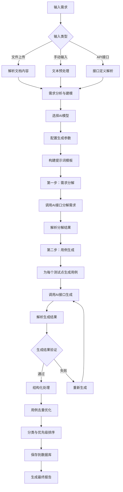

#### 3.2.2 提示词工程设计

##### 需求分解提示词模板

```python
REQUIREMENT_DECOMPOSE_PROMPT = """
# 角色：需求分解专家
# 任务：将用户提供的原始需求分解成具体的测试点
# 输出要求：
- 使用JSON数组格式输出
- 每个测试点简洁明确，不超过20字
- 按功能模块分组
- 覆盖正常、边界、异常场景

## 输入需求：
{requirement_text}

## 分析维度：
1. 功能性需求分析
2. 非功能性需求分析
3. 边界条件识别
4. 异常场景识别
5. 接口参数分析

## 输出格式：
[
  {
    "module": "模块名称",
    "test_points": ["测试点1", "测试点2", "测试点3"]
  }
]

## 要求：
- 确保测试点覆盖完整
- 避免重复和冗余
- 考虑用户使用场景
- 包含边界值和异常情况
"""

TEST_CASE_GENERATE_PROMPT = """
# 角色：测试用例生成专家
# 任务：根据测试点和指定方法生成详细测试用例
# 生成方法：{generation_method}
# 用例类型：{case_type}

## 测试点：
{test_point}

## 上下文信息：
{context_info}

## 生成策略：
基于{generation_method}方法，生成{case_type}类型的测试用例：
- 等价类划分：正常值、边界值、无效值
- 边界值分析：最小值、最大值、边界值±1
- 判定表法：多条件组合测试
- 因果图法：输入条件与输出结果的逻辑关系

## 输出格式：
[
  {
    "case_title": "测试用例标题",
    "test_steps": "详细测试步骤",
    "input_data": "输入数据",
    "expected_result": "预期结果",
    "case_type": "用例类型",
    "priority": "优先级(P0/P1/P2/P3)",
    "test_method": "测试方法",
    "preconditions": "前置条件"
  }
]

## 质量要求：
- 每条用例包含完整的测试信息
- 测试步骤清晰可执行
- 输入数据具体明确
- 预期结果可验证
- 单条用例描述不超过150字
- 考虑实际业务场景
"""
```

#### 3.2.3 用例生成配置

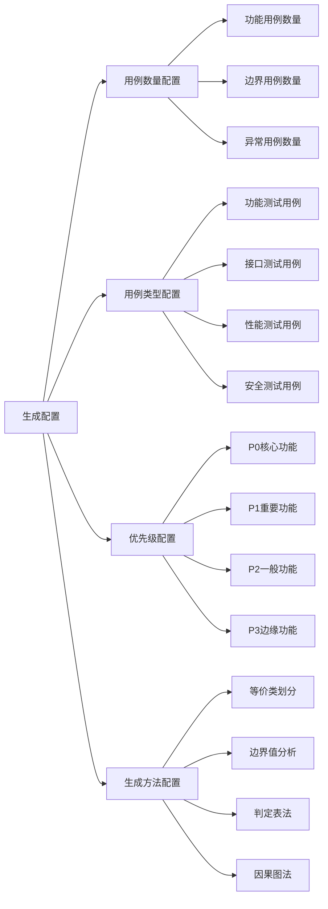

### 3.3 AI对话界面设计

参考ruoyi-element-ai项目的对话界面设计，实现智能测试用例生成的交互体验。

#### 3.3.1 对话界面组件架构

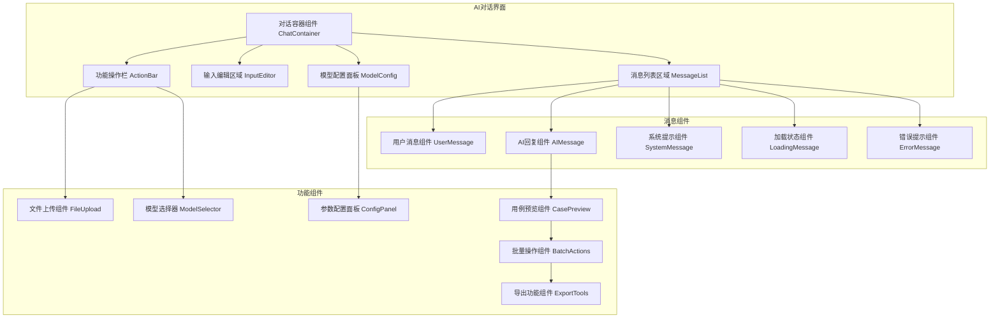

#### 3.3.2 界面交互流程

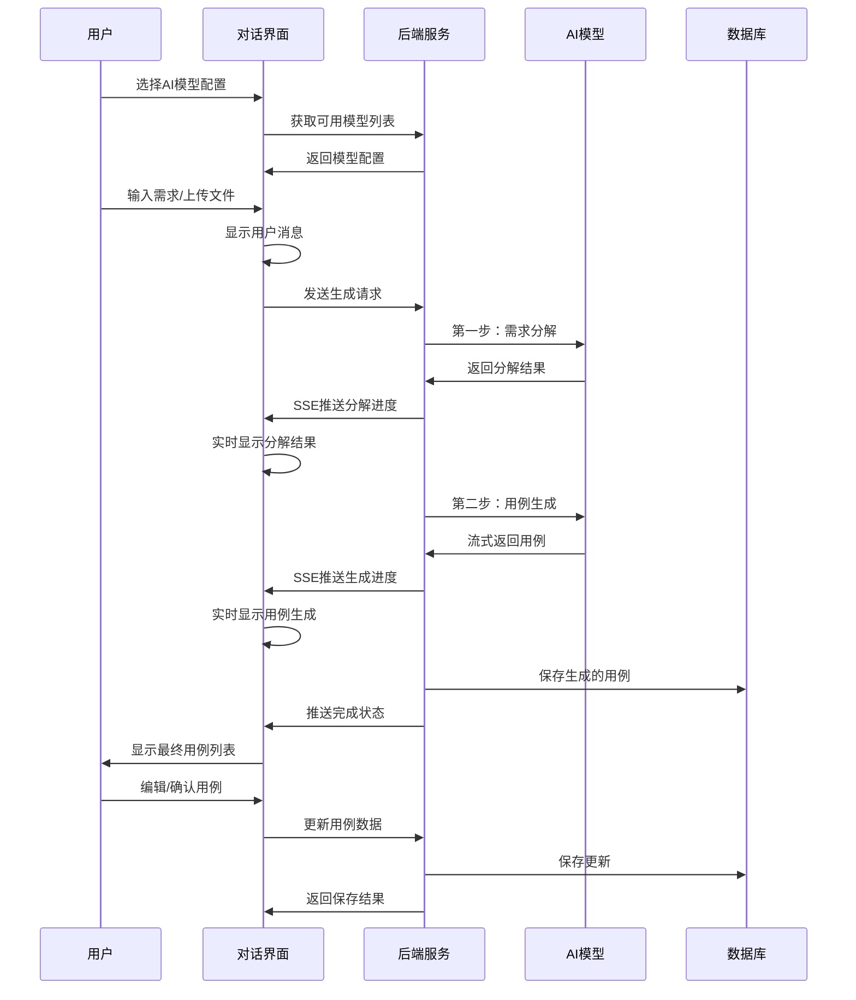

#### 3.3.3 对话界面功能特性

##### 流式对话体验

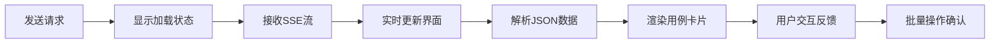

##### 界面布局设计

```vue
<template>
  <div class="ai-testcase-chat">
    <!-- 头部工具栏 -->
    <div class="chat-header">
      <div class="model-selector">
        <el-select v-model="selectedModel" placeholder="选择AI模型">
          <el-option 
            v-for="model in modelList" 
            :key="model.id"
            :label="model.name"
            :value="model.id"
          />
        </el-select>
      </div>
      <div class="config-actions">
        <el-button @click="showModelConfig = true">模型配置</el-button>
        <el-button @click="showGenerationConfig = true">生成配置</el-button>
      </div>
    </div>

    <!-- 对话内容区域 -->
    <div class="chat-content" ref="chatContent">
      <div 
        v-for="message in messageList" 
        :key="message.id"
        :class="['message-item', message.type]"
      >
        <!-- 用户消息 -->
        <div v-if="message.type === 'user'" class="user-message">
          <div class="message-content">{{ message.content }}</div>
          <div class="message-time">{{ message.time }}</div>
        </div>

        <!-- AI回复消息 -->
        <div v-else-if="message.type === 'ai'" class="ai-message">
          <div class="ai-avatar">🤖</div>
          <div class="message-body">
            <!-- 需求分解结果 -->
            <div v-if="message.step === 'decompose'" class="decompose-result">
              <h4>需求分解结果：</h4>
              <div v-for="module in message.data" :key="module.module" class="module-item">
                <h5>{{ module.module }}</h5>
                <el-tag 
                  v-for="point in module.test_points" 
                  :key="point"
                  class="test-point-tag"
                >
                  {{ point }}
                </el-tag>
              </div>
            </div>

            <!-- 测试用例生成结果 -->
            <div v-else-if="message.step === 'generate'" class="testcase-result">
              <h4>生成的测试用例：</h4>
              <div class="testcase-list">
                <el-card 
                  v-for="testcase in message.data" 
                  :key="testcase.id"
                  class="testcase-card"
                  shadow="hover"
                >
                  <template #header>
                    <div class="card-header">
                      <span class="case-title">{{ testcase.case_title }}</span>
                      <el-tag :type="getPriorityType(testcase.priority)">
                        {{ testcase.priority }}
                      </el-tag>
                    </div>
                  </template>
                  
                  <div class="case-content">
                    <div class="case-field">
                      <label>测试步骤：</label>
                      <p>{{ testcase.test_steps }}</p>
                    </div>
                    <div class="case-field">
                      <label>输入数据：</label>
                      <p>{{ testcase.input_data }}</p>
                    </div>
                    <div class="case-field">
                      <label>预期结果：</label>
                      <p>{{ testcase.expected_result }}</p>
                    </div>
                  </div>
                  
                  <div class="case-actions">
                    <el-button size="small" @click="editTestCase(testcase)">编辑</el-button>
                    <el-button size="small" type="success" @click="approveTestCase(testcase)">
                      采用
                    </el-button>
                    <el-button size="small" type="danger" @click="rejectTestCase(testcase)">
                      删除
                    </el-button>
                  </div>
                </el-card>
              </div>
            </div>
          </div>
        </div>

        <!-- 加载状态 -->
        <div v-else-if="message.type === 'loading'" class="loading-message">
          <div class="ai-avatar">🤖</div>
          <div class="loading-content">
            <el-icon class="is-loading"><Loading /></el-icon>
            <span>{{ message.content }}</span>
          </div>
        </div>
      </div>
    </div>

    <!-- 输入区域 -->
    <div class="chat-input">
      <div class="input-toolbar">
        <el-upload
          :before-upload="handleFileUpload"
          :show-file-list="false"
          accept=".txt,.md,.doc,.docx,.pdf"
        >
          <el-button size="small" :icon="Document">上传文档</el-button>
        </el-upload>
        
        <el-button size="small" @click="showTemplates = true">
          使用模板
        </el-button>
      </div>
      
      <div class="input-area">
        <el-input
          v-model="inputText"
          type="textarea"
          :rows="4"
          placeholder="请输入需求描述，或上传需求文档..."
          @keydown.ctrl.enter="sendMessage"
        />
        <div class="input-actions">
          <el-button 
            type="primary" 
            :loading="isGenerating"
            @click="sendMessage"
          >
            {{ isGenerating ? '生成中...' : '生成测试用例' }}
          </el-button>
        </div>
      </div>
    </div>

    <!-- 批量操作栏 -->
    <div v-if="selectedTestCases.length > 0" class="batch-actions">
      <span>已选择 {{ selectedTestCases.length }} 个用例</span>
      <el-button type="success" @click="batchApprove">批量采用</el-button>
      <el-button @click="batchExport">导出用例</el-button>
      <el-button type="danger" @click="batchDelete">批量删除</el-button>
    </div>
  </div>
</template>
```

### 3.4 用例生成API接口

#### 3.4.1 AI模型配置接口

| 接口路径 | HTTP方法 | 功能描述 | 请求参数 | 响应数据 |
|---------|----------|----------|----------|----------|
| `/api/v1/ai-models` | GET | 获取AI模型列表 | page, page_size | 分页模型列表 |
| `/api/v1/ai-models` | POST | 创建模型配置 | model_name, provider, api_key | 模型配置详情 |
| `/api/v1/ai-models/{id}` | PUT | 更新模型配置 | id, 配置参数 | 更新结果 |
| `/api/v1/ai-models/{id}` | DELETE | 删除模型配置 | id | 删除结果 |
| `/api/v1/ai-models/{id}/test` | POST | 测试模型连接 | id | 连接测试结果 |

#### 3.4.2 智能用例生成接口

| 接口路径 | HTTP方法 | 功能描述 | 请求参数 | 响应数据 |
|---------|----------|----------|----------|----------|
| `/api/v1/ai-testcase/generate` | POST | 生成测试用例 | model_id, input_content, config | SSE流式响应 |
| `/api/v1/ai-testcase/tasks` | GET | 获取生成任务列表 | page, page_size, status | 分页任务列表 |
| `/api/v1/ai-testcase/tasks/{id}` | GET | 获取任务详情 | id | 任务详情和用例 |
| `/api/v1/ai-testcase/tasks/{id}/retry` | POST | 重新生成 | id | 重新生成结果 |
| `/api/v1/ai-testcase/approve` | POST | 批量采用用例 | case_ids | 采用结果 |
| `/api/v1/ai-testcase/export` | POST | 导出用例 | case_ids, format | 文件下载 |

#### 3.4.3 生成配置接口

| 接口路径 | HTTP方法 | 功能描述 | 请求参数 | 响应数据 |
|---------|----------|----------|----------|----------|
| `/api/v1/generation-configs` | GET | 获取生成配置 | - | 配置列表 |
| `/api/v1/generation-configs` | POST | 保存生成配置 | 配置参数 | 保存结果 |
| `/api/v1/generation-templates` | GET | 获取提示词模板 | type | 模板列表 |
| `/api/v1/generation-templates` | POST | 保存自定义模板 | 模板内容 | 保存结果 |

## 4. 传统测试管理功能完善

### 4.1 测试用例管理增强

#### 4.1.1 测试用例数据模型增强

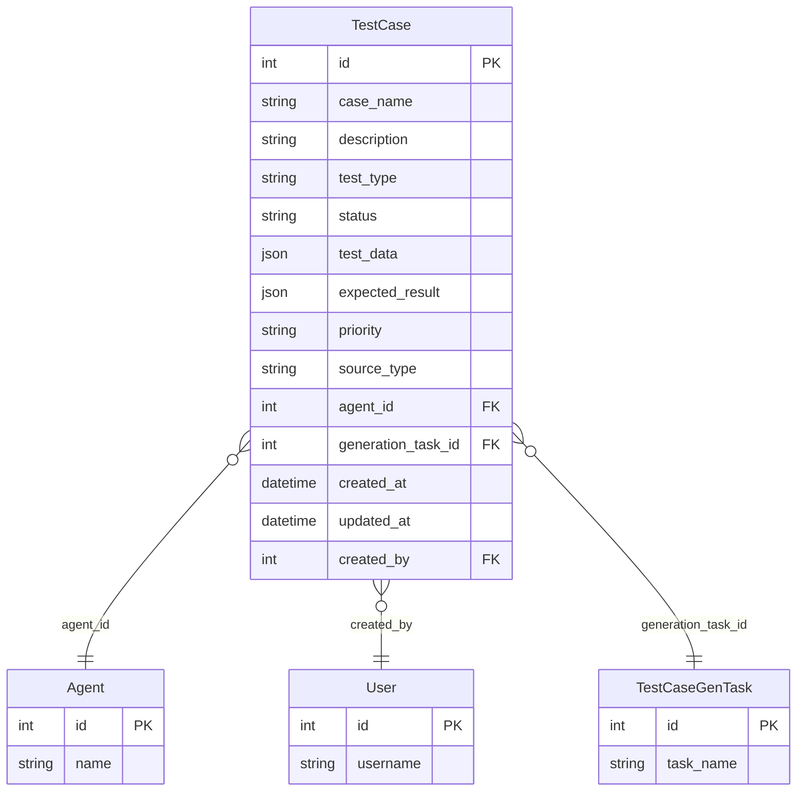

#### 4.1.2 测试用例类型支持

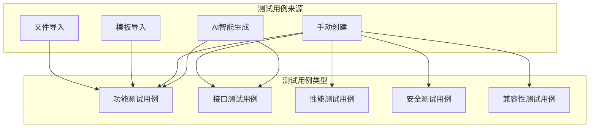

### 4.2 测试报告管理

#### 4.2.1 测试报告数据模型

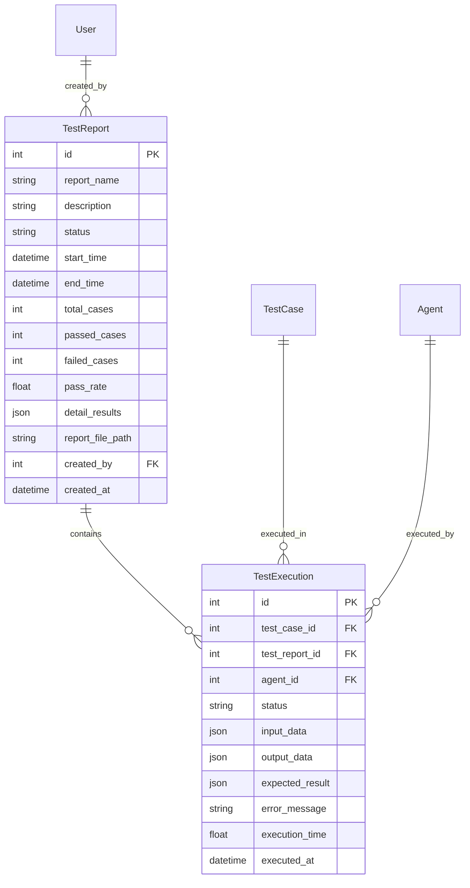

#### 4.2.2 测试报告API接口

| 接口路径 | HTTP方法 | 功能描述 | 请求参数 | 响应数据 |
|---------|----------|----------|----------|----------|
| `/api/v1/test-reports` | GET | 获取报告列表 | page, page_size, status | 分页报告列表 |
| `/api/v1/test-reports` | POST | 生成测试报告 | report_name, case_ids, agent_id | 报告详情 |
| `/api/v1/test-reports/{id}` | GET | 获取报告详情 | id | 报告详情 |
| `/api/v1/test-reports/{id}` | DELETE | 删除测试报告 | id | 删除结果 |
| `/api/v1/test-reports/{id}/export` | GET | 导出测试报告 | id, format | 文件下载 |
| `/api/v1/test-reports/{id}/executions` | GET | 获取执行详情 | id, page, page_size | 执行记录 |

#### 测试用例数据模型


### 4.3 测试执行引擎设计

#### 4.3.1 测试执行流程

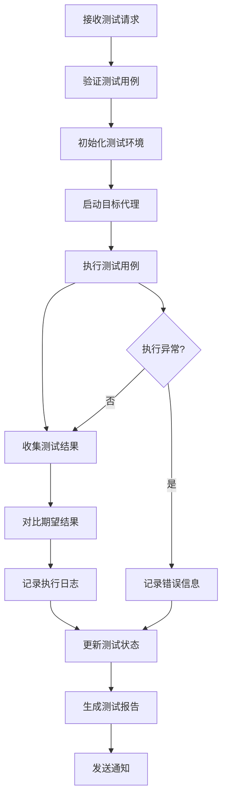

#### 4.3.2 测试执行服务

```python
class TestExecutionService:
    """测试执行服务"""
    
    def __init__(self, db_session, agent_service, report_service):
        self.db = db_session
        self.agent_service = agent_service
        self.report_service = report_service
        self.execution_queue = asyncio.Queue()
    
    async def execute_single_case(self, test_case: TestCase, agent_id: int) -> TestExecution:
        """执行单个测试用例"""
        execution = TestExecution(
            test_case_id=test_case.id,
            agent_id=agent_id,
            status="running",
            executed_at=datetime.now()
        )
        
        try:
            # 1. 启动AI代理
            agent = await self.agent_service.get_agent_by_id(agent_id)
            if not agent or agent.status != "running":
                raise Exception(f"Agent {agent_id} is not available")
            
            # 2. 准备测试数据
            execution.input_data = test_case.test_data
            execution.expected_result = test_case.expected_result
            
            # 3. 执行测试步骤
            start_time = time.time()
            actual_result = await self._execute_test_steps(
                test_case.test_data.get("steps", []), 
                agent
            )
            execution.execution_time = time.time() - start_time
            
            # 4. 验证结果
            execution.output_data = actual_result
            is_passed = self._validate_result(
                actual_result, 
                test_case.expected_result
            )
            
            execution.status = "passed" if is_passed else "failed"
            
            if not is_passed:
                execution.error_message = self._generate_failure_message(
                    actual_result, 
                    test_case.expected_result
                )
            
        except Exception as e:
            execution.status = "error"
            execution.error_message = str(e)
            execution.execution_time = time.time() - start_time if 'start_time' in locals() else 0
        
        # 5. 保存执行结果
        await self._save_execution_result(execution)
        
        return execution
    
    async def execute_batch_cases(self, case_ids: List[int], agent_id: int) -> List[TestExecution]:
        """批量执行测试用例"""
        executions = []
        
        # 获取测试用例
        test_cases = await self._get_test_cases_by_ids(case_ids)
        
        # 并发执行（控制并发数）
        semaphore = asyncio.Semaphore(5)  # 最多5个并发
        
        async def execute_with_semaphore(test_case):
            async with semaphore:
                return await self.execute_single_case(test_case, agent_id)
        
        tasks = [execute_with_semaphore(case) for case in test_cases]
        executions = await asyncio.gather(*tasks, return_exceptions=True)
        
        # 处理异常结果
        valid_executions = []
        for i, result in enumerate(executions):
            if isinstance(result, Exception):
                # 创建失败执行记录
                error_execution = TestExecution(
                    test_case_id=test_cases[i].id,
                    agent_id=agent_id,
                    status="error",
                    error_message=str(result),
                    executed_at=datetime.now()
                )
                await self._save_execution_result(error_execution)
                valid_executions.append(error_execution)
            else:
                valid_executions.append(result)
        
        return valid_executions
    
    def _validate_result(self, actual: dict, expected: dict) -> bool:
        """验证测试结果"""
        if not expected:
            return True  # 没有期望结果，认为通过
        
        # 根据不同类型的期望结果进行验证
        if "exact_match" in expected:
            return actual == expected["exact_match"]
        
        if "contains" in expected:
            return all(
                key in actual and actual[key] == value 
                for key, value in expected["contains"].items()
            )
        
        if "status_code" in expected:
            return actual.get("status_code") == expected["status_code"]
        
        if "response_time" in expected:
            return actual.get("response_time", 0) <= expected["response_time"]
        
        # 默认验证逻辑
        return self._deep_compare(actual, expected)
    
    def _deep_compare(self, actual: dict, expected: dict) -> bool:
        """深度对比两个字典"""
        for key, expected_value in expected.items():
            if key not in actual:
                return False
            
            actual_value = actual[key]
            
            if isinstance(expected_value, dict) and isinstance(actual_value, dict):
                if not self._deep_compare(actual_value, expected_value):
                    return False
            elif actual_value != expected_value:
                return False
        
        return True
```

## 5. AI对话界面设计

### 5.1 对话界面组件架构

参考ruoyi-element-ai项目的对话界面设计，实现智能测试用例生成的交互体验。

#### 5.1.1 组件架构设计


#### 5.1.2 界面交互流程

```mermaid
sequenceDiagram
    participant User as 用户
    participant UI as 对话界面
    participant Backend as 后端服务
    participant AI as AI模型
    
    User->>UI: 选择AI模型配置
    UI->>Backend: 获取可用模型列表
    Backend->>UI: 返回模型配置
    
    User->>UI: 输入需求/上传文件
    UI->>UI: 显示用户消息
    UI->>Backend: 发送生成请求
    
    Backend->>AI: 第一步：需求分解
    AI->>Backend: 返回分解结果
    Backend->>UI: SSE推送分解进度
    UI->>UI: 实时显示分解结果
    
    Backend->>AI: 第二步：用例生成
    AI->>Backend: 流式返回用例
    Backend->>UI: SSE推送生成进度
    UI->>UI: 实时显示用例生成
    
    Backend->>Backend: 编程式整理和验证
    Backend->>UI: 推送完成状态
    UI->>User: 显示最终用例列表
    
    User->>UI: 编辑/确认用例
    UI->>Backend: 更新用例数据
    Backend->>UI: 返回保存结果
```

### 4.2 测试报告管理

#### 测试报告数据模型

```mermaid
erDiagram
    TestReport {
        int id PK
        string report_name
        string description
        string status
        datetime start_time
        datetime end_time
        int total_cases
        int passed_cases
        int failed_cases
        float pass_rate
        json detail_results
        string report_file_path
        int created_by FK
        datetime created_at
    }
    
    TestExecution {
        int id PK
        int test_case_id FK
        int test_report_id FK
        int agent_id FK
        string status
        json input_data
        json output_data
        json expected_result
        string error_message
        float execution_time
        datetime executed_at
    }
    
    TestReport ||--o{ TestExecution : contains
    TestCase ||--o{ TestExecution : executed_in
    Agent ||--o{ TestExecution : executed_by
    User ||--o{ TestReport : created_by
```

#### 测试报告API接口

| 接口路径 | HTTP方法 | 功能描述 | 请求参数 | 响应数据 |
|---------|----------|----------|----------|----------|
| `/api/v1/test-reports` | GET | 获取报告列表 | page, page_size, status | 分页报告列表 |
| `/api/v1/test-reports` | POST | 生成测试报告 | report_name, case_ids, agent_id | 报告详情 |
| `/api/v1/test-reports/{id}` | GET | 获取报告详情 | id | 报告详情 |
| `/api/v1/test-reports/{id}` | DELETE | 删除测试报告 | id | 删除结果 |
| `/api/v1/test-reports/{id}/export` | GET | 导出测试报告 | id, format | 文件下载 |
| `/api/v1/test-reports/{id}/executions` | GET | 获取执行详情 | id, page, page_size | 执行记录 |

## 5. 后端架构实现

### 5.1 Controller层实现

#### AI相关控制器结构

```mermaid
classDiagram
    class AIModelController {
        +get_models(page, page_size, filters)
        +create_model(model_data)
        +update_model(model_id, model_data)
        +delete_model(model_id)
        +test_connection(model_id)
        +get_model_usage_stats(model_id)
    }
    
    class AITestCaseController {
        +generate_testcases(generation_request)
        +get_generation_tasks(page, page_size, filters)
        +get_task_detail(task_id)
        +retry_generation(task_id)
        +approve_testcases(case_ids)
        +export_testcases(case_ids, format)
        +get_generation_templates(type)
        +save_custom_template(template_data)
    }
    
    class ChatController {
        +create_chat_session()
        +send_message(session_id, message)
        +get_chat_history(session_id)
        +clear_chat_history(session_id)
        +stream_response(session_id)
    }
    
    class AgentController {
        +get_agents(page, page_size, filters)
        +create_agent(agent_data)
        +get_agent(agent_id)
        +update_agent(agent_id, agent_data)
        +delete_agent(agent_id)
        +start_agent(agent_id)
        +stop_agent(agent_id)
        +get_agent_status(agent_id)
    }
    
    class BaseController {
        +handle_request()
        +create_success_response()
        +create_error_response()
        +validate_pagination()
    }
    
    AIModelController --|> BaseController
    AITestCaseController --|> BaseController
    ChatController --|> BaseController
    AgentController --|> BaseController
```

### 5.2 Service层实现

#### AI服务层架构

```mermaid
classDiagram
    class AIModelService {
        +list_models(filters, pagination)
        +create_model_config(model_data)
        +update_model_config(model_id, model_data)
        +delete_model_config(model_id)
        +test_model_connection(model_id)
        +encrypt_api_key(api_key)
        +decrypt_api_key(encrypted_key)
    }
    
    class TestCaseGenerationService {
        +generate_testcases(input_content, model_id, config)
        +decompose_requirements(content, model_id)
        +generate_cases_for_points(test_points, model_id, config)
        +validate_generated_cases(cases)
        +optimize_and_deduplicate(cases)
        +calculate_confidence_score(case)
    }
    
    class PromptEngineeringService {
        +build_decompose_prompt(content, context)
        +build_generation_prompt(test_point, method, type)
        +validate_prompt_template(template)
        +customize_prompt_template(template, params)
        +get_prompt_templates(type)
    }
    
    class AIModelClientService {
        +call_deepseek_api(prompt, config)
        +call_qianwen_api(prompt, config)
        +call_openai_api(prompt, config)
        +call_claude_api(prompt, config)
        +handle_streaming_response(response)
        +parse_structured_response(response)
    }
    
    class ChatService {
        +create_session()
        +process_message(session_id, message)
        +generate_stream_response(session_id, message)
        +save_chat_history(session_id, message, response)
        +get_session_context(session_id)
    }
    
    class BaseService {
        +get_repository()
        +validate_entity()
        +handle_business_exception()
    }
    
    AIModelService --|> BaseService
    TestCaseGenerationService --|> BaseService
    PromptEngineeringService --|> BaseService
    AIModelClientService --|> BaseService
    ChatService --|> BaseService
    
    TestCaseGenerationService --> AIModelClientService
    TestCaseGenerationService --> PromptEngineeringService
    ChatService --> TestCaseGenerationService
```

### 5.3 Repository层实现

#### AI相关数据访问层

```mermaid
classDiagram
    class AIModelRepository {
        +find_all(filters, pagination)
        +find_by_id(model_id)
        +find_by_provider(provider)
        +save(model_config)
        +update(model_id, data)
        +delete(model_id)
        +find_active_models()
        +count_by_filters(filters)
    }
    
    class TestCaseGenTaskRepository {
        +find_all(filters, pagination)
        +find_by_id(task_id)
        +find_by_user(user_id)
        +save(task)
        +update_status(task_id, status)
        +delete(task_id)
        +find_recent_tasks(user_id, limit)
    }
    
    class GeneratedTestCaseRepository {
        +find_by_task_id(task_id, pagination)
        +find_by_ids(case_ids)
        +save(test_case)
        +batch_save(test_cases)
        +update(case_id, data)
        +delete(case_id)
        +batch_delete(case_ids)
        +find_approved_cases(task_id)
        +count_by_task(task_id)
    }
    
    class ChatSessionRepository {
        +find_by_id(session_id)
        +find_by_user(user_id)
        +save(session)
        +update_last_activity(session_id)
        +delete(session_id)
        +find_recent_sessions(user_id, limit)
    }
    
    class BaseRepository {
        +get_session()
        +execute_query()
        +handle_database_exception()
        +apply_filters()
        +apply_pagination()
    }
    
    AIModelRepository --|> BaseRepository
    TestCaseGenTaskRepository --|> BaseRepository
    GeneratedTestCaseRepository --|> BaseRepository
    ChatSessionRepository --|> BaseRepository
```

## 6. 单元测试设计

### 6.1 测试架构设计

#### 测试分层结构

```mermaid
graph TB
    subgraph "测试层次"
        A[单元测试 - Unit Tests]
        B[集成测试 - Integration Tests]
        C[端到端测试 - E2E Tests]
    end
    
    subgraph "AI功能测试"
        D[AI模型服务测试]
        E[用例生成服务测试]
        F[提示词工程测试]
        G[对话服务测试]
    end
    
    subgraph "传统功能测试"
        H[Controller Tests]
        I[Service Tests]
        J[Repository Tests]
        K[Entity Tests]
        L[Utility Tests]
    end
    
    subgraph "测试工具"
        M[Pytest框架]
        N[Mock对象]
        O[数据库Fixtures]
        P[HTTP客户端测试]
        Q[覆盖率检测]
        R[AI Mock服务]
    end
    
    A --> D
    A --> E
    A --> F
    A --> G
    A --> H
    A --> I
    A --> J
    A --> K
    A --> L
    
    B --> P
    C --> P
    
    M --> A
    M --> B
    N --> A
    O --> B
    Q --> A
    Q --> B
    R --> D
    R --> E
```

### 6.2 AI功能测试用例设计

#### AI模型服务测试

| 测试类 | 测试方法 | 测试场景 | 预期结果 |
|--------|----------|----------|----------|
| TestAIModelService | test_create_model_config_success | 创建有效模型配置 | 配置创建成功，API密钥加密存储 |
| | test_create_model_duplicate_name | 创建重复名称模型 | 抛出业务异常 |
| | test_test_connection_success | 测试有效模型连接 | 连接测试成功 |
| | test_test_connection_invalid_key | 测试无效API密钥 | 返回连接失败信息 |
| | test_encrypt_decrypt_api_key | API密钥加密解密 | 加密解密正确 |

#### 测试用例生成服务测试

| 测试类 | 测试方法 | 测试场景 | 预期结果 |
|--------|----------|----------|----------|
| TestTestCaseGenerationService | test_decompose_requirements_success | 正常需求分解 | 返回结构化测试点 |
| | test_decompose_empty_content | 空内容需求分解 | 抛出验证异常 |
| | test_generate_cases_success | 正常用例生成 | 返回结构化测试用例 |
| | test_generate_cases_api_error | AI接口调用失败 | 处理异常并重试 |
| | test_validate_generated_cases | 验证生成用例格式 | 验证通过或返回错误信息 |
| | test_optimize_and_deduplicate | 用例去重优化 | 去除重复用例，保留最优 |

#### 提示词工程测试

| 测试类 | 测试方法 | 测试场景 | 预期结果 |
|--------|----------|----------|----------|
| TestPromptEngineeringService | test_build_decompose_prompt | 构建需求分解提示词 | 返回格式化提示词 |
| | test_build_generation_prompt | 构建用例生成提示词 | 返回包含上下文的提示词 |
| | test_validate_prompt_template | 验证提示词模板 | 模板格式验证通过 |
| | test_customize_prompt_template | 自定义提示词模板 | 模板参数正确替换 |

### 6.3 Mock服务设计

#### AI模型Mock服务

```python
class MockAIModelClient:
    """AI模型客户端Mock类"""
    
    def __init__(self):
        self.call_count = 0
        self.responses = {}
    
    def setup_response(self, prompt_key: str, response_data: dict):
        """设置Mock响应数据"""
        self.responses[prompt_key] = response_data
    
    async def call_api(self, prompt: str, config: dict) -> dict:
        """模拟AI API调用"""
        self.call_count += 1
        
        # 根据提示词内容返回预设响应
        if "需求分解" in prompt:
            return {
                "choices": [{
                    "message": {
                        "content": json.dumps([
                            {
                                "module": "用户登录",
                                "test_points": ["用户名输入验证", "密码输入验证", "登录按钮功能"]
                            }
                        ], ensure_ascii=False)
                    }
                }]
            }
        elif "测试用例生成" in prompt:
            return {
                "choices": [{
                    "message": {
                        "content": json.dumps([
                            {
                                "case_title": "用户名为空的边界值测试",
                                "test_steps": "1. 输入空用户名 2. 输入有效密码 3. 点击登录",
                                "input_data": "用户名: '', 密码: 'valid123'",
                                "expected_result": "显示'用户名不能为空'提示",
                                "case_type": "边界值测试",
                                "priority": "P1"
                            }
                        ], ensure_ascii=False)
                    }
                }]
            }
        
        return {"error": "Unsupported prompt"}
    
    def get_call_count(self) -> int:
        """获取API调用次数"""
        return self.call_count
```

### 6.4 测试数据管理

#### AI功能测试数据

```python
# AI模型配置测试数据
AI_MODEL_TEST_DATA = {
    "valid_deepseek_config": {
        "model_name": "DeepSeek-V2",
        "provider": "deepseek",
        "api_key": "sk-test123456789",
        "api_base_url": "https://api.deepseek.com/v1",
        "model_parameters": {
            "temperature": 0.7,
            "max_tokens": 2000,
            "top_p": 0.9
        }
    },
    "valid_qianwen_config": {
        "model_name": "通义千问-Turbo",
        "provider": "qianwen",
        "api_key": "sk-qw123456789",
        "api_base_url": "https://dashscope.aliyuncs.com/api/v1",
        "model_parameters": {
            "temperature": 0.8,
            "max_tokens": 1500
        }
    }
}

# 需求分解测试数据
REQUIREMENT_TEST_DATA = {
    "login_requirement": """
    用户登录功能需求：
    1. 用户可以使用用户名和密码登录系统
    2. 用户名长度限制为3-20个字符
    3. 密码长度限制为6-20个字符
    4. 登录失败次数超过5次后锁定账户30分钟
    5. 支持记住密码功能
    """,
    "expected_decompose_result": [
        {
            "module": "用户登录",
            "test_points": [
                "用户名输入验证",
                "密码输入验证", 
                "登录按钮功能",
                "登录失败处理",
                "账户锁定机制",
                "记住密码功能"
            ]
        }
    ]
}

# 测试用例生成数据
TESTCASE_GENERATION_DATA = {
    "test_point": "用户名输入验证",
    "context": "用户名长度限制为3-20个字符",
    "generation_method": "边界值分析",
    "case_type": "功能测试",
    "expected_cases": [
        {
            "case_title": "用户名最小长度边界值测试",
            "test_steps": "输入2个字符的用户名，输入有效密码，点击登录",
            "input_data": "用户名: 'ab', 密码: 'valid123'",
            "expected_result": "显示'用户名长度不能少于3个字符'提示",
            "case_type": "边界值测试",
            "priority": "P1"
        }
    ]
}
```

### 6.5 测试覆盖率要求

#### 覆盖率目标

| 代码层级 | 行覆盖率 | 分支覆盖率 | 函数覆盖率 |
|----------|----------|------------|------------|
| AI Controller层 | ≥85% | ≥80% | ≥90% |
| AI Service层 | ≥90% | ≥85% | ≥95% |
| 传统Controller层 | ≥85% | ≥80% | ≥90% |
| 传统Service层 | ≥90% | ≥85% | ≥95% |
| Repository层 | ≥85% | ≥80% | ≥90% |
| Entity层 | ≥80% | ≥75% | ≥85% |
| Utility层 | ≥90% | ≥85% | ≥95% |
| 总体覆盖率 | ≥85% | ≥80% | ≥90% |

## 7. 实施计划

### 7.1 开发阶段规划

```mermaid
gantt
    title AI测试平台功能完善与单元测试实施计划
    dateFormat  YYYY-MM-DD
    section 第一阶段：AI功能基础
    AI模型管理数据模型          :done, ai-model, 2025-01-01, 3d
    AI模型配置API实现          :done, ai-api, after ai-model, 4d
    提示词工程设计             :active, prompt, after ai-api, 3d
    
    section 第二阶段：核心AI功能
    测试用例生成引擎           :generate-engine, after prompt, 6d
    AI客户端集成              :ai-client, after generate-engine, 4d
    流式响应处理              :streaming, after ai-client, 3d
    
    section 第三阶段：用户界面
    AI对话界面组件            :chat-ui, after streaming, 5d
    模型配置界面              :config-ui, after chat-ui, 3d
    用例预览和编辑            :preview-ui, after config-ui, 4d
    
    section 第四阶段：传统功能
    代理管理API完善           :agent-api, after preview-ui, 4d
    测试报告功能              :report-api, after agent-api, 5d
    批量操作功能              :batch-ops, after report-api, 3d
    
    section 第五阶段：测试开发
    AI功能单元测试            :ai-test, after batch-ops, 8d
    传统功能单元测试          :unit-test, after ai-test, 6d
    集成测试                 :int-test, after unit-test, 5d
    
    section 第六阶段：质量保证
    代码覆盖率检测            :coverage, after int-test, 2d
    性能测试                 :perf-test, after coverage, 3d
    文档完善                 :docs, after perf-test, 3d
```

### 7.2 验收标准

#### AI功能验收标准

- [ ] AI模型配置管理功能完整可用
- [ ] 支持DeepSeek、通义千问、ChatGPT等主流模型
- [ ] 智能测试用例生成功能正常运行
- [ ] 对话界面流畅，支持流式响应
- [ ] 生成的测试用例质量符合要求
- [ ] 提示词工程可配置和优化
- [ ] API密钥安全存储和管理

#### 传统功能验收标准

- [ ] AI代理管理功能完整可用
- [ ] 测试用例管理功能完整可用  
- [ ] 测试报告管理功能完整可用
- [ ] 所有API接口符合设计规范
- [ ] 前后端数据交互正常
- [ ] 错误处理机制完善
- [ ] 日志记录完整

#### 单元测试验收标准

- [ ] 单元测试覆盖率达到85%以上
- [ ] AI功能模块测试用例完整
- [ ] Mock服务工作正常
- [ ] 所有关键业务逻辑有对应测试用例
- [ ] 测试用例命名规范清晰
- [ ] 测试数据管理规范
- [ ] 测试执行稳定可靠
- [ ] 测试报告生成完整
- [ ] CI/CD集成测试流程正常运行

#### 代码质量验收标准

- [ ] 代码符合PEP8规范
- [ ] 函数和类文档注释完整
- [ ] 异常处理机制完善
-[ ] AI接口调用性能满足要求
- [ ] 安全性检查通过（API密钥加密等）
- [ ] 代码审查通过