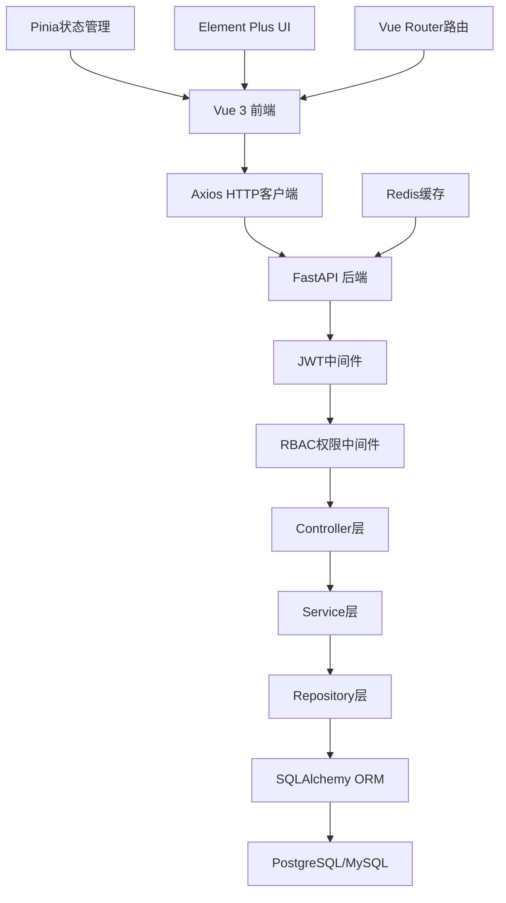
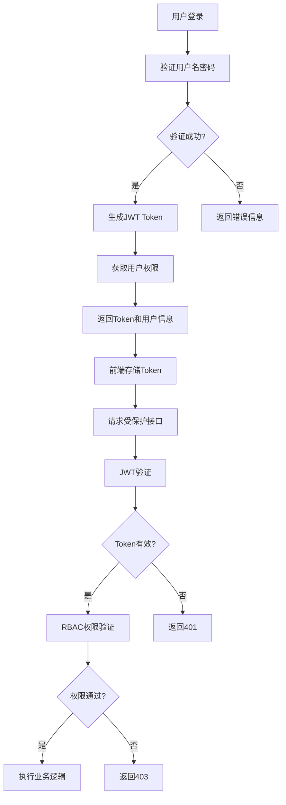
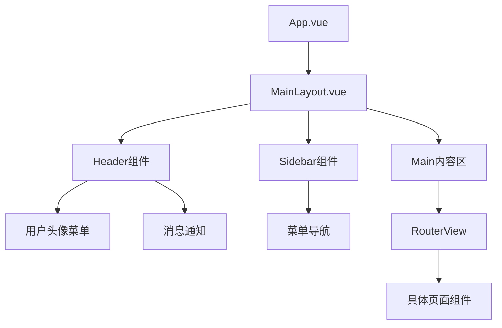
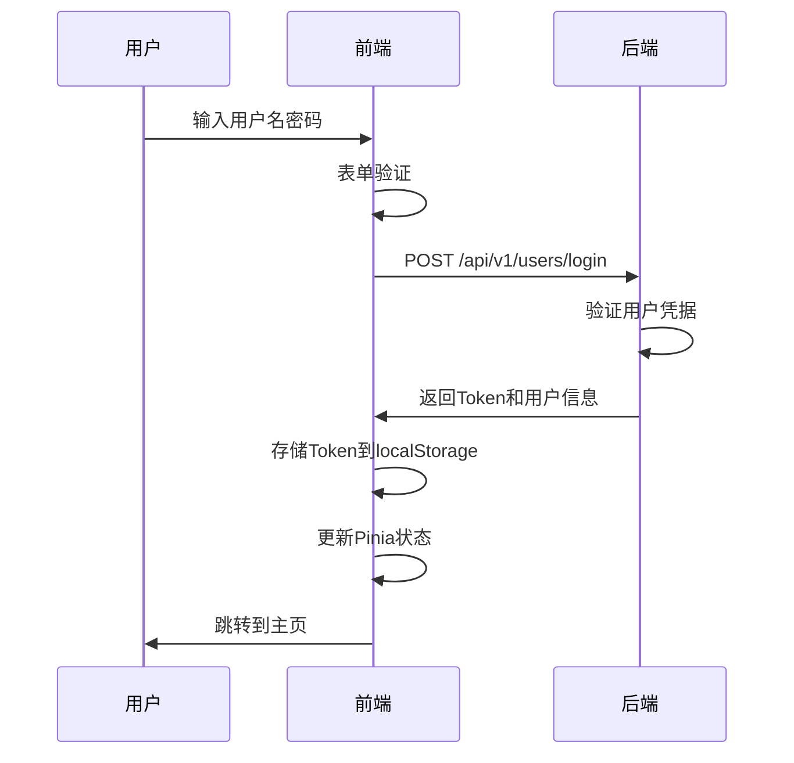
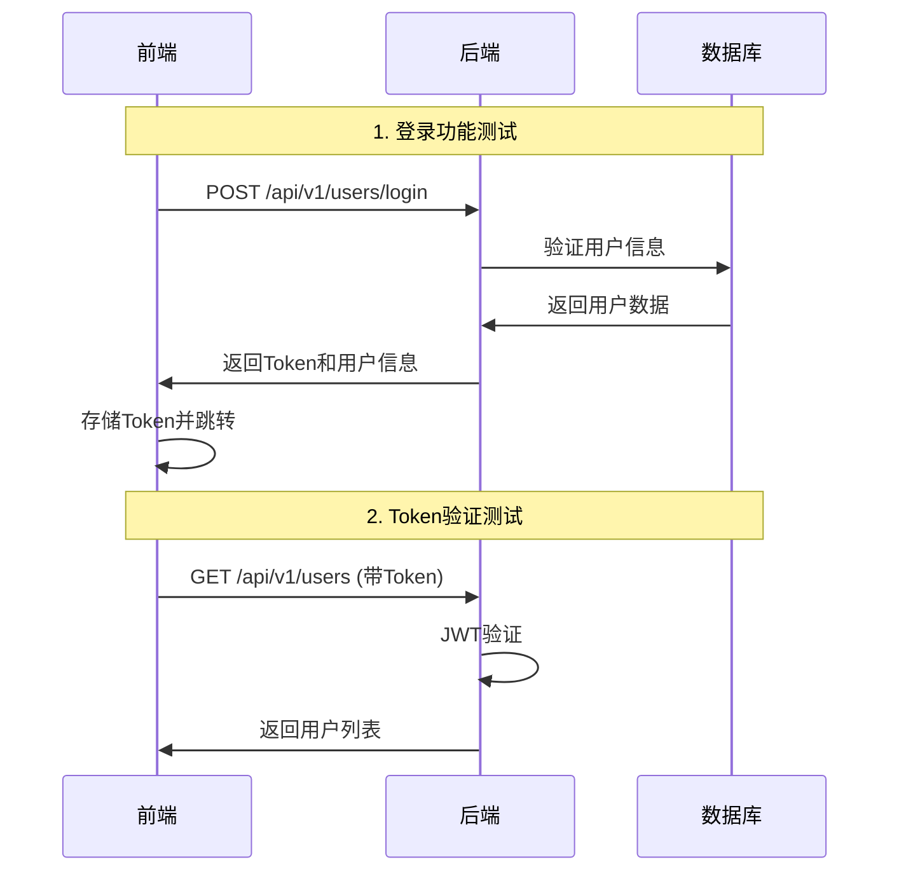

# AI智能代理测试平台前后端集成设计文档

## 1. 概述

本设计文档基于现有的FastAPI后端架构，完善Vue 3前端页面并实现前后端联调。系统采用RBAC权限控制，提供用户管理、角色管理、菜单管理和部门管理等核心功能。

### 1.1 技术栈
- **后端**: FastAPI + SQLAlchemy + PostgreSQL/MySQL + Redis
- **前端**: Vue 3 + TypeScript + Element Plus + Pinia + Vite
- **认证**: JWT Token
- **架构**: 企业级五层架构 (Controller→DTO→Service→Repository→Entity)

### 1.2 核心功能
- 用户认证与授权
- RBAC权限管理系统
- 用户、角色、菜单、部门管理
- 前后端分离架构
- 响应式管理界面

## 2. 架构设计

### 2.1 前后端交互架构



### 2.2 权限控制流程



## 3. API接口设计

### 3.1 接口规范

#### 请求格式
```typescript
// 请求头
Authorization: Bearer <JWT_TOKEN>
Content-Type: application/json

// 响应格式
interface ApiResponse<T> {
  success: boolean
  data?: T
  message: string
  error_code?: string
  timestamp: string
}
```

#### 状态码规范
- `200`: 成功
- `400`: 参数错误
- `401`: 未认证
- `403`: 权限不足
- `404`: 资源不存在
- `500`: 服务器错误

### 3.2 核心API端点

#### 用户管理接口
| 方法 | 路径 | 描述 | 权限要求 |
|------|------|------|----------|
| POST | `/api/v1/users/login` | 用户登录 | 无 |
| GET | `/api/v1/users/` | 获取用户列表 | user:view |
| POST | `/api/v1/users/` | 创建用户 | user:add |
| GET | `/api/v1/users/{id}` | 获取用户详情 | user:view |
| PUT | `/api/v1/users/{id}` | 更新用户信息 | user:update |
| PUT | `/api/v1/users/{id}/password` | 修改密码 | user:update |
| DELETE | `/api/v1/users/{id}` | 删除用户 | user:delete |

#### 角色管理接口
| 方法 | 路径 | 描述 | 权限要求 |
|------|------|------|----------|
| GET | `/api/v1/roles/` | 获取角色列表 | role:view |
| POST | `/api/v1/roles/` | 创建角色 | role:add |
| GET | `/api/v1/roles/{id}` | 获取角色详情 | role:view |
| PUT | `/api/v1/roles/{id}` | 更新角色 | role:update |
| DELETE | `/api/v1/roles/{id}` | 删除角色 | role:delete |
| GET | `/api/v1/roles/{id}/permissions` | 获取角色权限 | role:view |
| POST | `/api/v1/roles/{id}/menus` | 分配菜单权限 | role:update |

#### 菜单管理接口
| 方法 | 路径 | 描述 | 权限要求 |
|------|------|------|----------|
| GET | `/api/v1/menus/` | 获取菜单列表 | menu:view |
| POST | `/api/v1/menus/` | 创建菜单 | menu:add |
| GET | `/api/v1/menus/tree` | 获取菜单树 | menu:view |
| PUT | `/api/v1/menus/{id}` | 更新菜单 | menu:update |
| DELETE | `/api/v1/menus/{id}` | 删除菜单 | menu:delete |

#### 部门管理接口
| 方法 | 路径 | 描述 | 权限要求 |
|------|------|------|----------|
| GET | `/api/v1/departments/` | 获取部门列表 | dept:view |
| POST | `/api/v1/departments/` | 创建部门 | dept:add |
| GET | `/api/v1/departments/tree` | 获取部门树 | dept:view |
| PUT | `/api/v1/departments/{id}` | 更新部门 | dept:update |
| DELETE | `/api/v1/departments/{id}` | 删除部门 | dept:delete |

## 4. 前端组件架构

### 4.1 项目目录结构

```
src/
├── api/                    # API接口定义
│   ├── modules/           # 按模块分类的API
│   │   ├── auth.ts       # 认证相关
│   │   ├── user.ts       # 用户管理
│   │   ├── role.ts       # 角色管理
│   │   ├── menu.ts       # 菜单管理
│   │   └── department.ts # 部门管理
│   ├── http.ts           # HTTP客户端配置
│   └── types.ts          # 通用类型定义
├── components/            # 通用组件
│   ├── Layout/           # 布局组件
│   ├── Table/            # 表格组件
│   ├── Form/             # 表单组件
│   └── Permission/       # 权限控制组件
├── views/                # 页面组件
│   ├── auth/             # 认证页面
│   ├── system/           # 系统管理
│   │   ├── user/         # 用户管理
│   │   ├── role/         # 角色管理
│   │   ├── menu/         # 菜单管理
│   │   └── department/   # 部门管理
│   └── dashboard/        # 仪表板
├── store/                # 状态管理
│   ├── modules/          # 按模块分类的store
│   └── index.ts          # store入口
├── router/               # 路由配置
├── utils/                # 工具函数
├── styles/               # 样式文件
└── types/                # TypeScript类型定义
```

### 4.2 核心组件设计

#### 布局组件层次



#### 权限控制组件

```typescript
// PermissionWrapper.vue - 权限包装组件
interface PermissionProps {
  permission?: string
  role?: string
  fallback?: string
}

// 使用示例
<PermissionWrapper permission="user:add">
  <el-button type="primary">新增用户</el-button>
</PermissionWrapper>
```

## 5. 页面功能设计

### 5.1 登录页面 (Login.vue)

#### 功能特性
- 用户名/密码登录
- 表单验证
- 登录状态提示
- 记住密码功能
- 响应式设计

#### 交互流程


### 5.2 用户管理页面

#### 主要功能
- 用户列表展示(表格)
- 用户搜索和过滤
- 新增/编辑用户
- 用户角色分配
- 用户状态管理
- 批量操作

#### 页面布局
```
┌─────────────────────────────────────────┐
│ 用户管理                                │
├─────────────────────────────────────────┤
│ [搜索框] [状态筛选] [部门筛选] [新增用户] │
├─────────────────────────────────────────┤
│ ┌─ 用户列表表格 ─────────────────────┐ │
│ │ ID │用户名│邮箱│部门│状态│操作    │ │
│ │ 1  │admin│... │... │活跃│编辑|删除│ │
│ │ 2  │user │... │... │锁定│编辑|删除│ │
│ └─────────────────────────────────────┘ │
├─────────────────────────────────────────┤
│           [分页组件]                    │
└─────────────────────────────────────────┘
```

#### 表格列定义
```typescript
const columns = [
  { prop: 'user_id', label: 'ID', width: 80 },
  { prop: 'username', label: '用户名', minWidth: 120 },
  { prop: 'email', label: '邮箱', minWidth: 150 },
  { prop: 'mobile', label: '手机号', width: 120 },
  { prop: 'dept_name', label: '部门', width: 100 },
  { prop: 'status', label: '状态', width: 80 },
  { prop: 'create_time', label: '创建时间', width: 150 },
  { prop: 'actions', label: '操作', width: 200, fixed: 'right' }
]
```

### 5.3 角色管理页面

#### 核心功能
- 角色列表管理
- 角色权限配置
- 菜单权限分配
- 角色用户关联

#### 权限配置界面
```
┌─────────────────────────────────────┐
│ 角色权限配置                        │
├─────────────────────────────────────┤
│ 角色名称: [管理员]                  │
├─────────────────────────────────────┤
│ 菜单权限:                           │
│ □ 系统管理                          │
│   □ 用户管理 (查看|新增|编辑|删除)   │
│   □ 角色管理 (查看|新增|编辑|删除)   │
│   □ 菜单管理 (查看|新增|编辑|删除)   │
│   □ 部门管理 (查看|新增|编辑|删除)   │
├─────────────────────────────────────┤
│ [保存] [取消]                       │
└─────────────────────────────────────┘
```

### 5.4 菜单管理页面

#### 功能特性
- 树形菜单结构
- 拖拽排序
- 菜单层级管理
- 图标选择器
- 路由配置

#### 树形表格设计
```typescript
interface MenuNode {
  menu_id: number
  parent_id: number
  menu_name: string
  menu_type: '0' | '1' // 0:菜单 1:按钮
  path?: string
  component?: string
  icon?: string
  order_num: number
  children?: MenuNode[]
}
```

### 5.5 部门管理页面

#### 组织架构树
```
公司总部
├── 技术部
│   ├── 前端组
│   ├── 后端组
│   └── 测试组
├── 产品部
│   ├── 产品组
│   └── 设计组
└── 运营部
    ├── 市场组
    └── 客服组
```

## 6. 状态管理设计

### 6.1 Pinia Store结构

```typescript
// store/modules/auth.ts - 认证状态
interface AuthState {
  token: string | null
  user: UserInfo | null
  permissions: string[]
  roles: string[]
}

// store/modules/user.ts - 用户管理状态  
interface UserState {
  userList: UserInfo[]
  currentUser: UserInfo | null
  loading: boolean
  total: number
}

// store/modules/system.ts - 系统状态
interface SystemState {
  menuList: MenuTree[]
  roleList: RoleInfo[]
  deptList: DeptTree[]
  collapsed: boolean
}
```

### 6.2 状态持久化

```typescript
// 使用 pinia-plugin-persistedstate
const authStore = defineStore('auth', {
  state: () => ({...}),
  persist: {
    key: 'auth_info',
    storage: localStorage,
    paths: ['token', 'user', 'permissions']
  }
})
```

## 7. 路由设计

### 7.1 路由结构

```typescript
const routes = [
  {
    path: '/login',
    name: 'Login',
    component: () => import('@/views/auth/Login.vue'),
    meta: { requiresAuth: false }
  },
  {
    path: '/',
    name: 'Layout',
    component: () => import('@/components/Layout/MainLayout.vue'),
    meta: { requiresAuth: true },
    children: [
      {
        path: '/dashboard',
        name: 'Dashboard',
        component: () => import('@/views/dashboard/Index.vue'),
        meta: { title: '仪表板', icon: 'dashboard' }
      },
      {
        path: '/system',
        name: 'System',
        meta: { title: '系统管理', icon: 'setting' },
        children: [
          {
            path: '/system/user',
            name: 'UserManagement',
            component: () => import('@/views/system/user/Index.vue'),
            meta: { 
              title: '用户管理', 
              permission: 'user:view' 
            }
          },
          {
            path: '/system/role',
            name: 'RoleManagement', 
            component: () => import('@/views/system/role/Index.vue'),
            meta: { 
              title: '角色管理', 
              permission: 'role:view' 
            }
          }
        ]
      }
    ]
  }
]
```

### 7.2 路由守卫

```typescript
// 权限验证
router.beforeEach((to, from, next) => {
  const authStore = useAuthStore()
  
  if (to.meta.requiresAuth && !authStore.token) {
    next('/login')
    return
  }
  
  if (to.meta.permission && !authStore.hasPermission(to.meta.permission)) {
    next('/403')
    return
  }
  
  next()
})
```

## 8. 通用组件设计

### 8.1 数据表格组件

```vue
<!-- CommonTable.vue -->
<template>
  <div class="table-container">
    <el-table 
      :data="data" 
      :loading="loading"
      @selection-change="handleSelectionChange"
    >
      <el-table-column 
        v-for="column in columns"
        :key="column.prop"
        v-bind="column"
      >
        <template v-if="column.slot" #default="scope">
          <slot :name="column.slot" :row="scope.row" :index="scope.$index" />
        </template>
      </el-table-column>
    </el-table>
    
    <el-pagination
      v-if="showPagination"
      :total="total"
      :page-size="pageSize"
      :current-page="currentPage"
      @current-change="handlePageChange"
    />
  </div>
</template>
```

### 8.2 搜索表单组件

```vue
<!-- SearchForm.vue -->
<template>
  <el-form :model="searchForm" inline>
    <el-form-item 
      v-for="field in fields"
      :key="field.prop"
      :label="field.label"
    >
      <component 
        :is="field.component"
        v-model="searchForm[field.prop]"
        v-bind="field.props"
      />
    </el-form-item>
    <el-form-item>
      <el-button type="primary" @click="handleSearch">搜索</el-button>
      <el-button @click="handleReset">重置</el-button>
    </el-form-item>
  </el-form>
</template>
```

### 8.3 对话框表单组件

```vue
<!-- FormDialog.vue -->
<template>
  <el-dialog
    :title="title"
    :visible="visible"
    @close="handleClose"
  >
    <el-form
      ref="formRef"
      :model="form"
      :rules="rules"
      label-width="100px"
    >
      <slot :form="form" />
    </el-form>
    
    <template #footer>
      <el-button @click="handleClose">取消</el-button>
      <el-button type="primary" @click="handleSubmit" :loading="loading">
        确定
      </el-button>
    </template>
  </el-dialog>
</template>

## 9. API集成实现

### 9.1 HTTP客户端优化

```typescript
// api/http.ts - 优化后的HTTP客户端
import axios, { AxiosResponse, InternalAxiosRequestConfig } from 'axios'
import { ElMessage, ElMessageBox } from 'element-plus'
import { useAuthStore } from '@/store/modules/auth'
import router from '@/router'

// 响应数据类型
interface ApiResponse<T = any> {
  success: boolean
  data?: T
  message: string
  error_code?: string
  timestamp: string
}

// 创建axios实例
const http = axios.create({
  baseURL: import.meta.env.VITE_API_BASE_URL || 'http://localhost:8000/api/v1',
  timeout: 10000,
  headers: {
    'Content-Type': 'application/json'
  }
})

// 请求拦截器
http.interceptors.request.use(
  (config: InternalAxiosRequestConfig) => {
    const authStore = useAuthStore()
    if (authStore.token) {
      config.headers.Authorization = `Bearer ${authStore.token}`
    }
    return config
  },
  (error) => {
    return Promise.reject(error)
  }
)

// 响应拦截器
http.interceptors.response.use(
  (response: AxiosResponse<ApiResponse>) => {
    const { data } = response
    
    // 检查业务状态码
    if (!data.success) {
      ElMessage.error(data.message || '操作失败')
      return Promise.reject(new Error(data.message))
    }
    
    return data
  },
  (error) => {
    const { response } = error
    
    if (response?.status === 401) {
      ElMessageBox.confirm('登录已过期，请重新登录', '提示', {
        confirmButtonText: '重新登录',
        cancelButtonText: '取消',
        type: 'warning'
      }).then(() => {
        const authStore = useAuthStore()
        authStore.logout()
        router.push('/login')
      })
    } else if (response?.status === 403) {
      ElMessage.error('权限不足')
    } else {
      ElMessage.error(response?.data?.message || '网络错误')
    }
    
    return Promise.reject(error)
  }
)

export default http
```

### 9.2 API模块化设计

#### 认证相关API
```typescript
// api/modules/auth.ts
import http from '@/api/http'

interface LoginParams {
  username: string
  password: string
}

interface LoginResponse {
  access_token: string
  token_type: string
  user_info: UserInfo
  permissions: string[]
}

export const authApi = {
  // 用户登录
  login(params: LoginParams): Promise<LoginResponse> {
    return http.post('/users/login', params)
  },
  
  // 获取用户信息
  getUserInfo(): Promise<UserInfo> {
    return http.get('/users/me')
  },
  
  // 刷新Token
  refreshToken(): Promise<{ access_token: string }> {
    return http.post('/auth/refresh')
  },
  
  // 登出
  logout(): Promise<void> {
    return http.post('/auth/logout')
  }
}
```

#### 用户管理API
```typescript
// api/modules/user.ts
import http from '@/api/http'

interface UserParams {
  page?: number
  size?: number
  username?: string
  status?: string
  dept_id?: number
}

interface CreateUserParams {
  username: string
  password: string
  email?: string
  mobile?: string
  dept_id?: number
  ssex?: string
}

export const userApi = {
  // 获取用户列表
  getUsers(params?: UserParams): Promise<{
    users: UserInfo[]
    total: number
  }> {
    return http.get('/users', { params })
  },
  
  // 创建用户
  createUser(data: CreateUserParams): Promise<UserInfo> {
    return http.post('/users', data)
  },
  
  // 获取用户详情
  getUserById(id: number): Promise<UserInfo> {
    return http.get(`/users/${id}`)
  },
  
  // 更新用户
  updateUser(id: number, data: Partial<CreateUserParams>): Promise<UserInfo> {
    return http.put(`/users/${id}`, data)
  },
  
  // 删除用户
  deleteUser(id: number): Promise<void> {
    return http.delete(`/users/${id}`)
  },
  
  // 修改密码
  changePassword(id: number, data: {
    old_password: string
    new_password: string
  }): Promise<void> {
    return http.put(`/users/${id}/password`, data)
  }
}
```

## 10. 前后端联调流程

### 10.1 开发环境配置

#### 后端启动
```bash
# 1. 进入后端目录
cd AI-agent-backend

# 2. 安装依赖
pip install -r requirements.txt

# 3. 配置环境变量
cp .env.example .env
# 编辑.env文件配置数据库连接

# 4. 初始化数据库
python scripts/init_db.py

# 5. 启动服务
uvicorn main:app --reload --host 0.0.0.0 --port 8000
```

#### 前端启动
```bash
# 1. 进入前端目录
cd AI-agent-frontend

# 2. 安装依赖
pnpm install

# 3. 配置环境变量
cp .env.example .env.development
# 编辑环境变量
VITE_API_BASE_URL=http://localhost:8000/api/v1

# 4. 启动开发服务器
pnpm dev
```

### 10.2 联调测试步骤

#### 第一阶段：基础认证联调


#### 第二阶段：CRUD功能联调
1. **用户管理CRUD**
   - 创建用户表单提交
   - 用户列表获取和显示
   - 用户信息编辑
   - 用户删除确认

2. **权限控制验证**
   - 不同角色用户登录
   - 权限按钮显示/隐藏
   - 接口权限验证

#### 第三阶段：复杂功能联调
1. **角色权限分配**
2. **菜单动态加载**
3. **部门树形结构**
4. **批量操作功能**

### 10.3 数据格式对齐

#### 前端类型定义
```typescript
// types/user.ts
export interface UserInfo {
  user_id: number
  username: string
  email?: string
  mobile?: string
  dept_id?: number
  status: '0' | '1' // 0:锁定 1:有效
  ssex?: '0' | '1' | '2' // 0:男 1:女 2:保密
  avatar?: string
  description?: string
  create_time?: string
  modify_time?: string
  last_login_time?: string
}

export interface RoleInfo {
  role_id: number
  role_name: string
  remark?: string
  create_time?: string
  modify_time?: string
}

export interface MenuInfo {
  menu_id: number
  parent_id: number
  menu_name: string
  menu_type: '0' | '1' // 0:菜单 1:按钮
  path?: string
  component?: string
  perms?: string
  icon?: string
  order_num: number
  children?: MenuInfo[]
}
```

#### 数据转换适配
```typescript
// utils/transform.ts
// 时间格式转换
export const formatDateTime = (dateStr: string) => {
  return dayjs(dateStr).format('YYYY-MM-DD HH:mm:ss')
}

// 状态文本转换
export const getStatusText = (status: string) => {
  const statusMap = {
    '0': '锁定',
    '1': '正常'
  }
  return statusMap[status] || '未知'
}

// 性别文本转换
export const getSexText = (sex: string) => {
  const sexMap = {
    '0': '男',
    '1': '女', 
    '2': '保密'
  }
  return sexMap[sex] || '未知'
}
```

## 11. 错误处理机制

### 11.1 前端错误处理

#### 全局错误捕获
```typescript
// main.ts
app.config.errorHandler = (err, instance, info) => {
  console.error('全局错误:', err)
  ElMessage.error('系统发生错误，请刷新页面重试')
}

// 异步错误处理
window.addEventListener('unhandledrejection', (event) => {
  console.error('未处理的Promise拒绝:', event.reason)
  ElMessage.error('网络请求失败，请检查网络连接')
})
```

#### 接口错误处理
```typescript
// composables/useApi.ts
export const useApi = () => {
  const loading = ref(false)
  const error = ref<string | null>(null)
  
  const execute = async <T>(apiCall: () => Promise<T>) => {
    try {
      loading.value = true
      error.value = null
      const result = await apiCall()
      return result
    } catch (err: any) {
      error.value = err.message || '操作失败'
      throw err
    } finally {
      loading.value = false
    }
  }
  
  return { loading, error, execute }
}
```

### 11.2 后端错误处理

#### 统一异常响应格式
```python
# 后端已实现的异常处理器
@app.exception_handler(BaseAPIException)
async def api_exception_handler(request: Request, exc: BaseAPIException):
    return JSONResponse(
        status_code=exc.status_code,
        content={
            "success": False,
            "message": exc.detail,
            "error_code": getattr(exc, 'error_code', None),
            "timestamp": datetime.now().isoformat()
        }
    )
```

### 11.3 常见错误场景处理

| 错误类型 | 前端处理 | 后端响应 | 用户提示 |
|----------|----------|----------|----------|
| 网络超时 | 重试机制 | 503 | 网络连接超时，请稍后重试 |
| 参数验证失败 | 表单高亮 | 400 | 请检查输入信息 |
| 权限不足 | 隐藏按钮 | 403 | 您没有执行此操作的权限 |
| 资源不存在 | 刷新列表 | 404 | 请求的资源不存在 |
| 登录过期 | 跳转登录 | 401 | 登录已过期，请重新登录 |
| 服务器错误 | 错误上报 | 500 | 系统异常，请联系管理员 |
```
