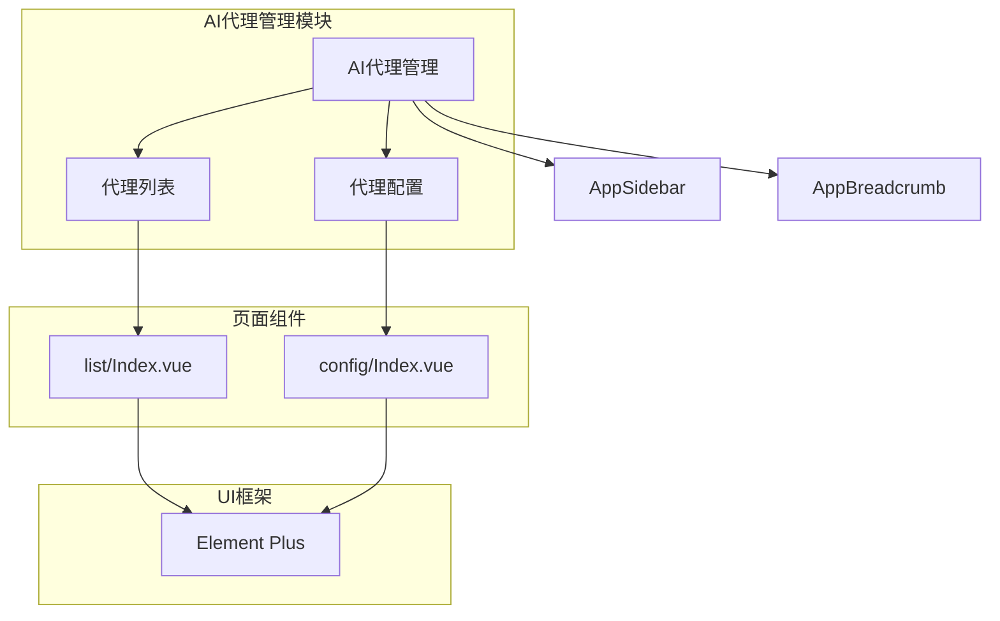
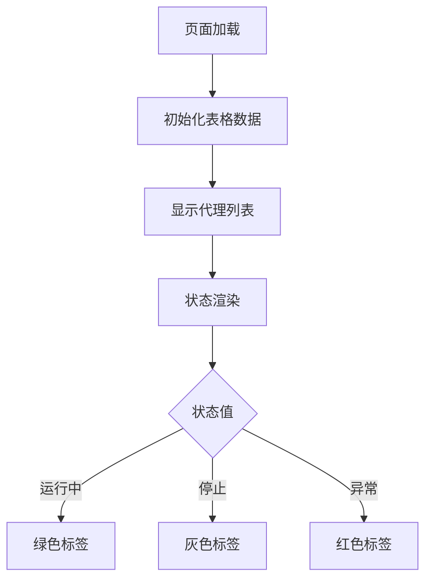
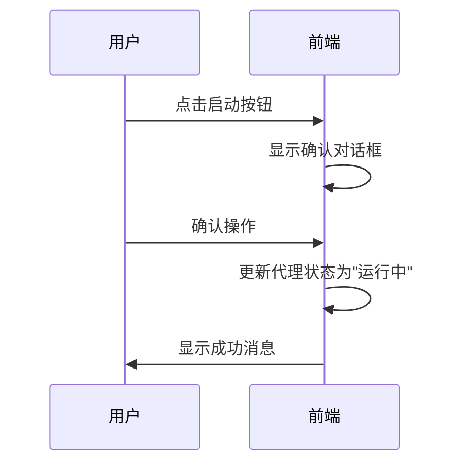
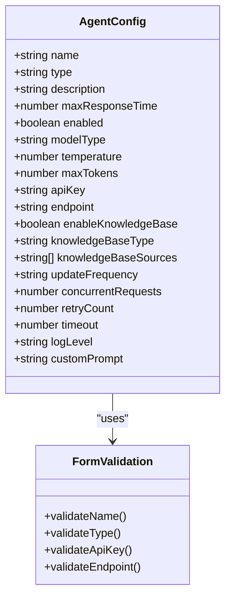
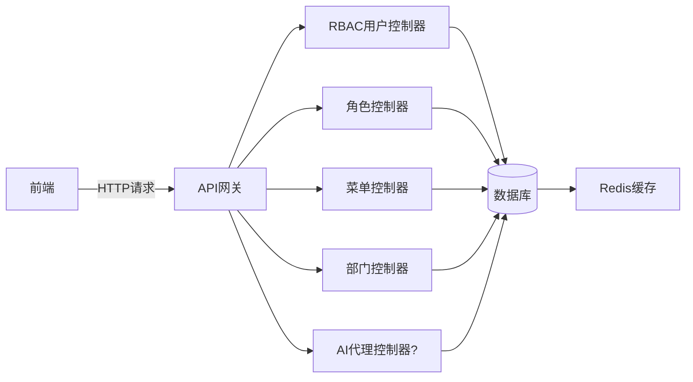
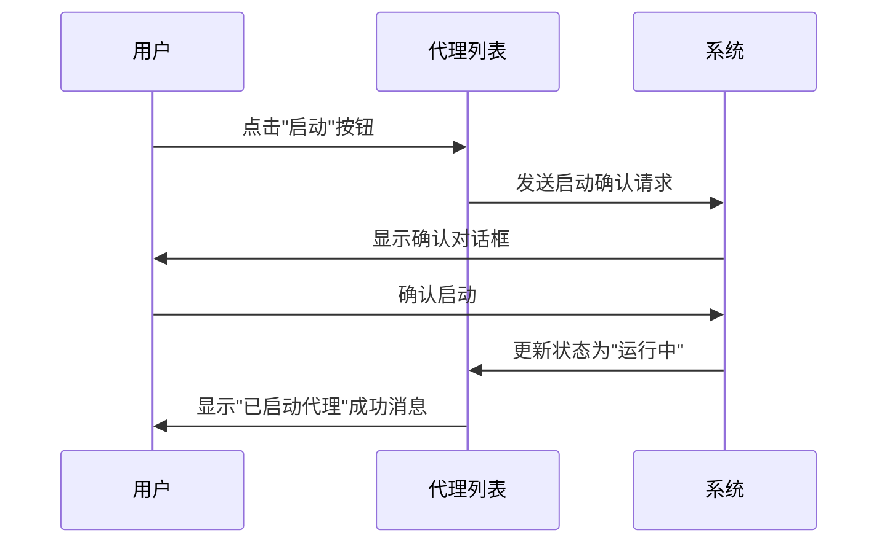
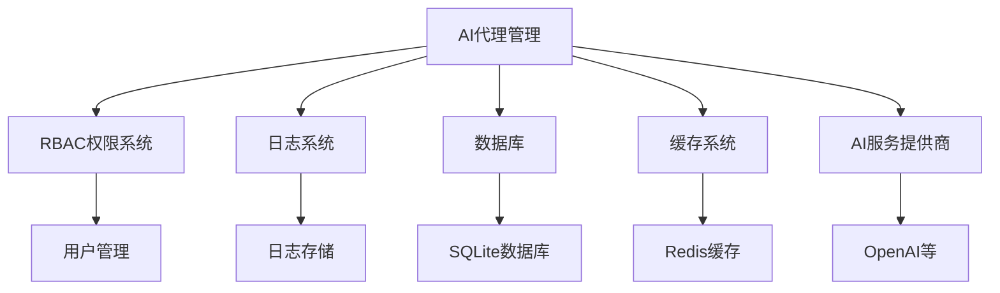

# AI代理管理功能

<cite>
**本文档引用文件**   
- [Index.vue](file://AI-agent-frontend\src\views\agent\list\Index.vue)
- [Index.vue](file://AI-agent-frontend\src\views\agent\config\Index.vue)
- [main.py](file://AI-agent-backend\main.py)
- [config.py](file://AI-agent-backend\app\core\config.py)
- [RBAC_GUIDE.md](file://AI-agent-backend\docs\RBAC_GUIDE.md)
</cite>

## 目录
1. [功能概述](#功能概述)
2. [前端页面结构](#前端页面结构)
3. [代理列表功能](#代理列表功能)
4. [代理配置功能](#代理配置功能)
5. [后端API与配置](#后端api与配置)
6. [操作示例](#操作示例)
7. [模块交互](#模块交互)

## 功能概述

AI代理管理功能模块为用户提供了一个完整的AI代理生命周期管理界面，包括代理的列表展示、状态监控、配置编辑、启停控制等功能。该模块分为两个主要部分：代理列表和代理配置。

代理列表页面提供所有AI代理的概览，包括代理名称、类型、状态等关键信息，并支持对代理进行启动、停止、编辑和删除等操作。代理配置页面则提供了详细的配置选项，允许用户对代理的各项参数进行精细化设置。

系统通过前端Vue组件与后端FastAPI服务的协同工作，实现了对AI代理的全面管理。前端负责用户界面展示和交互，后端提供数据存储和业务逻辑处理。尽管在代码搜索中未找到明确的代理相关API控制器，但从配置文件和前端代码可以推断出系统具备AI代理管理的基础架构。

**Section sources**
- [Index.vue](file://AI-agent-frontend\src\views\agent\list\Index.vue)
- [Index.vue](file://AI-agent-frontend\src\views\agent\config\Index.vue)

## 前端页面结构

AI代理管理模块的前端页面采用Vue 3组合式API架构，基于Element Plus组件库构建。系统通过Vue Router实现页面路由管理，在路由配置中定义了AI代理管理的主菜单及其子页面。



**Diagram sources**
- [index.ts](file://AI-agent-frontend\src\router\index.ts)
- [AppSidebar.vue](file://AI-agent-frontend\src\components\Layout\AppSidebar.vue)
- [AppBreadcrumb.vue](file://AI-agent-frontend\src\components\Layout\AppBreadcrumb.vue)

**Section sources**
- [index.ts](file://AI-agent-frontend\src\router\index.ts)
- [AppSidebar.vue](file://AI-agent-frontend\src\components\Layout\AppSidebar.vue)

## 代理列表功能

代理列表页面实现了AI代理的展示和基本操作功能，采用Element Plus的表格组件(el-table)来呈现代理数据。

### 数据绑定与展示

页面通过ref定义响应式数据，包括代理列表数据(tableData)、分页信息(currentPage, pageSize, total)和加载状态(loading)。表格列展示了代理的ID、名称、类型、描述、状态和创建时间等信息。

状态列使用自定义模板，通过getStatusType函数将状态值转换为对应的标签类型：
- "运行中" → success(绿色)
- "停止" → info(灰色)
- "异常" → danger(红色)



### 操作功能

列表页面提供了多项操作功能：
- **新增代理**: 点击"新增代理"按钮触发handleAddAgent方法
- **编辑代理**: 点击"编辑"按钮触发handleEdit方法
- **启动代理**: 当代理状态为"停止"时显示"启动"按钮
- **停止代理**: 当代理状态为"运行中"时显示"停止"按钮
- **删除代理**: 点击"删除"按钮触发handleDelete方法

所有操作均通过Element Plus的消息框(ElMessageBox)进行确认，确保操作的安全性。



**Section sources**
- [Index.vue](file://AI-agent-frontend\src\views\agent\list\Index.vue#L0-L182)

## 代理配置功能

代理配置页面提供了AI代理的详细参数设置，采用多标签页(tab)布局，将配置项分为基础配置、模型配置、知识库配置和高级设置四个类别。

### 配置参数详解

#### 基础配置
- **代理名称**: 代理的标识名称，必填项，长度限制2-50字符
- **代理类型**: 选择代理的类型，包括对话型、分析型、开发型
- **描述**: 代理功能的简要描述，最多200字符
- **最大响应时间**: 代理响应的最长时间限制(秒)
- **启用状态**: 开关控制代理是否启用

#### 模型配置
- **模型类型**: 选择使用的AI模型，如GPT-4、GPT-3.5、Claude或自定义模型
- **温度**: 控制生成文本的随机性(0-1)
- **最大输出长度**: 限制模型输出的token数量
- **API密钥**: 访问AI服务的认证密钥
- **自定义端点**: 自定义模型服务的URL地址

#### 知识库配置
- **启用知识库**: 开关控制是否使用知识库
- **知识库类型**: 选择知识库的存储类型
- **知识库来源**: 选择知识库的数据来源，支持多选
- **更新频率**: 设置知识库的更新周期

#### 高级设置
- **并发请求数**: 同时处理的请求数量
- **重试次数**: 请求失败后的重试次数
- **超时时间**: 请求超时时间(秒)
- **日志级别**: 设置日志记录的详细程度
- **自定义提示词**: 定义代理的行为准则和响应风格



**Diagram sources**
- [Index.vue](file://AI-agent-frontend\src\views\agent\config\Index.vue#L0-L245)

**Section sources**
- [Index.vue](file://AI-agent-frontend\src\views\agent\config\Index.vue#L0-L245)

## 后端API与配置

### API路由结构

根据主应用文件main.py的分析，系统使用FastAPI框架构建RESTful API服务。虽然未找到专门的AI代理控制器，但系统已注册了多个功能模块的路由：

```python
app.include_router(role_router, prefix=settings.API_V1_PREFIX)
app.include_router(menu_router, prefix=settings.API_V1_PREFIX)
app.include_router(department_router, prefix=settings.API_V1_PREFIX)
app.include_router(rbac_user_router, prefix=settings.API_V1_PREFIX)
```

可以推断，AI代理相关的API应遵循相同的路由模式，位于`/api/v1`前缀下。

### 系统配置

后端配置文件config.py中包含与AI代理相关的配置项：

- **数据库配置**: `DATABASE_URL: str = "sqlite:///./ai_agent.db"` - 使用SQLite数据库存储AI代理数据
- **缓存配置**: `CACHE_PREFIX: str = "ai_agent:"` - Redis缓存的键前缀
- **第三方API**: `OPENAI_API_KEY`和`OPENAI_BASE_URL` - 用于连接AI服务提供商



**Diagram sources**
- [main.py](file://AI-agent-backend\main.py#L0-L199)
- [config.py](file://AI-agent-backend\app\core\config.py#L0-L196)

**Section sources**
- [main.py](file://AI-agent-backend\main.py#L0-L199)
- [config.py](file://AI-agent-backend\app\core\config.py#L0-L196)

## 操作示例

### 代理启停操作



### 配置更新操作

```mermaid
flowchart TD
A[打开代理配置页面] --> B[修改配置参数]
B --> C[点击"保存配置"按钮]
C --> D{表单验证}
D --> |通过| E[显示保存确认对话框]
D --> |失败| F[显示验证错误信息]
E --> G{用户确认}
G --> |确定| H[执行保存操作]
G --> |取消| I[取消保存]
H --> J[显示"配置保存成功"消息]
```

### 状态同步机制

系统采用前端本地状态管理的方式实现状态同步。当用户执行启停操作时，前端直接更新表格数据中的状态字段，无需等待后端响应。这种方式提高了用户体验，但需要确保后端实际状态与前端显示状态的一致性。

```javascript
// 启动代理操作
const handleStart = (row) => {
  ElMessageBox.confirm(`确定要启动代理 "${row.name}" 吗?`, '提示', {
    confirmButtonText: '确定',
    cancelButtonText: '取消',
    type: 'info'
  }).then(() => {
    row.status = '运行中'  // 直接更新前端状态
    ElMessage.success(`已启动代理: ${row.name}`)
  })
}
```

**Section sources**
- [Index.vue](file://AI-agent-frontend\src\views\agent\list\Index.vue#L124-L150)
- [Index.vue](file://AI-agent-frontend\src\views\agent\config\Index.vue#L211-L245)

## 模块交互

AI代理管理模块与其他系统模块存在以下交互关系：

### 与测试管理模块的交互

从日志管理页面的代码可以看出，AI代理与测试功能密切相关：

```javascript
// 日志条目示例
{
  module: 'agent',
  path: '/api/v1/agents/init',
  stack: 'Error: Connection refused\n  at AgentService.initialize (/app/service/agent_service.js:45:23)'
}
```

这表明AI代理可能用于执行自动化测试任务，代理的初始化过程可能涉及测试环境的设置。

### 与RBAC权限系统的集成

系统采用基于角色的访问控制(RBAC)机制，AI代理管理功能的访问权限由RBAC系统控制。用户需要具备相应的角色和权限才能访问代理管理页面和执行相关操作。

### 与日志系统的集成

所有AI代理的操作都会被记录到系统日志中，包括代理的启动、停止、配置更新等操作。日志系统可以帮助管理员追踪代理的使用情况和排查问题。



**Diagram sources**
- [RBAC_GUIDE.md](file://AI-agent-backend\docs\RBAC_GUIDE.md)
- [Index.vue](file://AI-agent-frontend\src\views\logs\Index.vue#L29-L61)

**Section sources**
- [RBAC_GUIDE.md](file://AI-agent-backend\docs\RBAC_GUIDE.md)
- [Index.vue](file://AI-agent-frontend\src\views\logs\Index.vue#L29-L61)