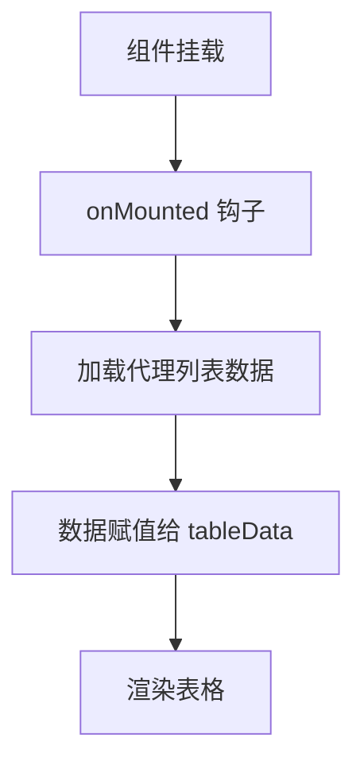
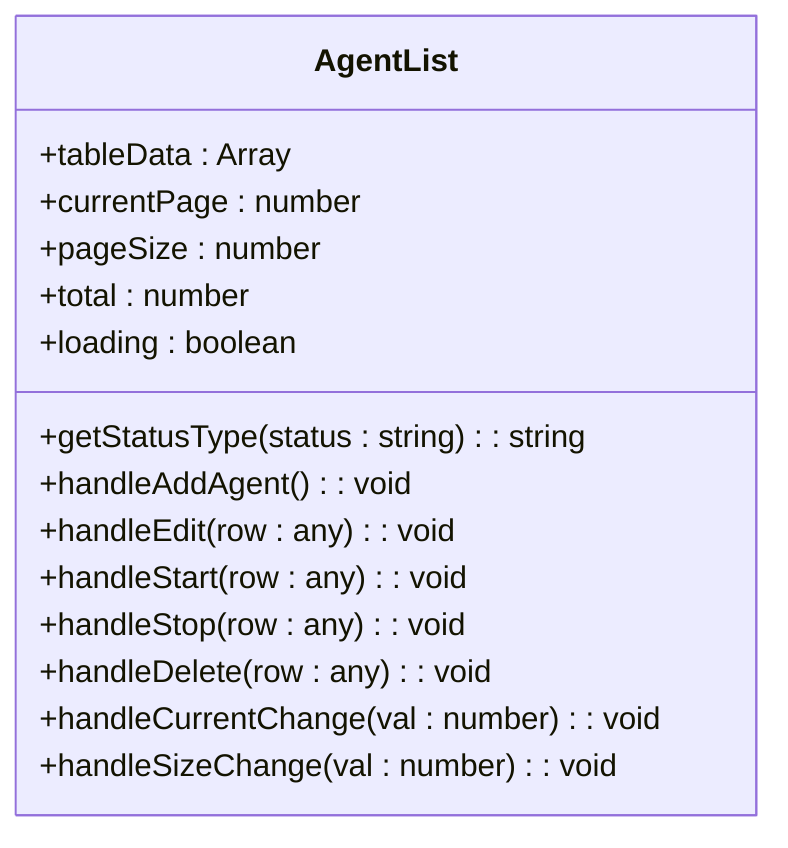
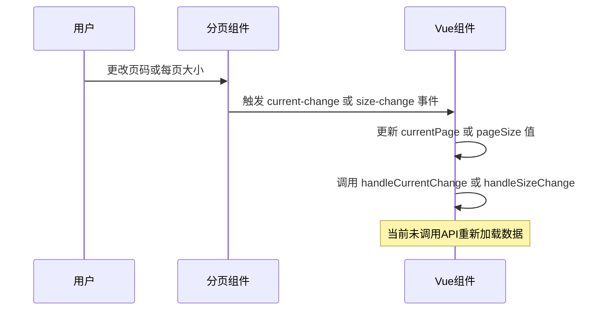
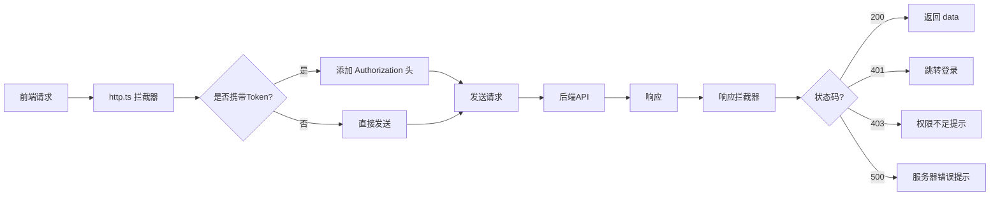
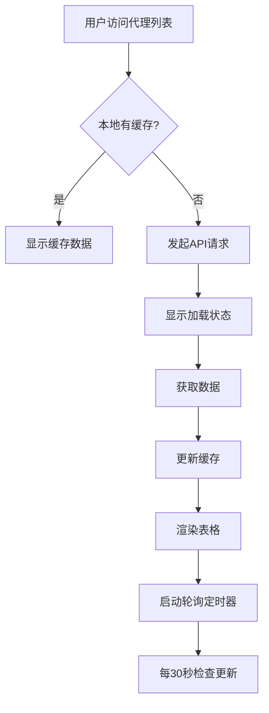

# 代理列表管理

<cite>
**本文档引用文件**  
- [Index.vue](file://AI-agent-frontend\src\views\agent\list\Index.vue)
- [http.ts](file://AI-agent-frontend\src\api\http.ts)
- [baseUrl.ts](file://AI-agent-frontend\src\api\baseUrl.ts)
- [agent.d.ts](file://AI-agent-frontend\node_modules\undici-types\agent.d.ts)
</cite>

## 目录
1. [项目结构分析](#项目结构分析)
2. [前端代理列表页面实现](#前端代理列表页面实现)
3. [表格组件与数据渲染](#表格组件与数据渲染)
4. [分页逻辑与交互处理](#分页逻辑与交互处理)
5. [状态标签渲染机制](#状态标签渲染机制)
6. [前端API请求配置](#前端api请求配置)
7. [后端接口支持分析](#后端接口支持分析)
8. [前后端数据对接示例](#前后端数据对接示例)
9. [性能优化建议](#性能优化建议)

## 项目结构分析

通过项目目录结构分析，前端代理功能模块位于 `AI-agent-frontend/src/views/agent` 目录下，包含 `list`（列表）和 `config`（配置）两个子模块。后端项目 `AI-agent-backend` 中尚未发现与代理相关的控制器、服务或实体文件，表明代理功能的后端接口尚未实现。

**Section sources**
- [Index.vue](file://AI-agent-frontend\src\views\agent\list\Index.vue)
- [agent.d.ts](file://AI-agent-frontend\node_modules\undici-types\agent.d.ts)

## 前端代理列表页面实现

代理列表页面由 `AI-agent-frontend/src/views/agent/list/Index.vue` 文件实现，使用 Vue 3 的 `<script setup>` 语法，结合 Element Plus 组件库构建用户界面。页面主要功能包括展示代理列表、支持分页、提供新增、编辑、启动、停止、删除等操作。

页面通过 `onMounted` 钩子在组件挂载后加载数据，但当前代码中数据为静态模拟数据，未实现实际的 API 调用。



**Diagram sources**
- [Index.vue](file://AI-agent-frontend\src\views\agent\list\Index.vue#L175-L182)

**Section sources**
- [Index.vue](file://AI-agent-frontend\src\views\agent\list\Index.vue)

## 表格组件与数据渲染

页面使用 Element Plus 的 `el-table` 组件展示代理数据，通过 `:data="tableData"` 绑定数据源。表格包含以下列：
- ID：代理唯一标识
- 代理名称：代理的名称
- 代理类型：代理的功能类型（如对话型、分析型）
- 描述：代理的功能说明
- 状态：代理的运行状态，使用 `el-tag` 组件渲染
- 创建时间：代理的创建时间戳
- 操作：提供编辑、启动/停止、删除按钮

状态列使用 `template #default` 插槽，调用 `getStatusType` 方法根据状态值返回对应的标签类型（success、info、danger）。



**Diagram sources**
- [Index.vue](file://AI-agent-frontend\src\views\agent\list\Index.vue#L25-L65)

**Section sources**
- [Index.vue](file://AI-agent-frontend\src\views\agent\list\Index.vue)

## 分页逻辑与交互处理

分页功能由 `el-pagination` 组件实现，使用 `v-model:current-page` 和 `v-model:page-size` 双向绑定当前页码和每页大小。分页器支持每页 10、20、50、100 条数据的选择。

当用户更改页码或每页大小时，会触发 `@current-change` 和 `@size-change` 事件，分别调用 `handleCurrentChange` 和 `handleSizeChange` 方法。这两个方法目前仅更新本地变量，未触发数据重新加载。



**Diagram sources**
- [Index.vue](file://AI-agent-frontend\src\views\agent\list\Index.vue#L145-L162)

**Section sources**
- [Index.vue](file://AI-agent-frontend\src\views\agent\list\Index.vue)

## 状态标签渲染机制

状态标签的渲染通过 `getStatusType` 方法实现，该方法根据代理的 `status` 字段返回 Element Plus `el-tag` 组件所需的类型值：
- "运行中" → "success"（绿色）
- "停止" → "info"（蓝色）
- "异常" → "danger"（红色）
- 其他 → 空字符串（默认颜色）

该机制确保了状态的可视化区分，提升了用户体验。

```typescript
const getStatusType = (status: string) => {
  switch (status) {
    case '运行中':
      return 'success'
    case '停止':
      return 'info'
    case '异常':
      return 'danger'
    default:
      return ''
  }
}
```

**Section sources**
- [Index.vue](file://AI-agent-frontend\src\views\agent\list\Index.vue#L85-L95)

## 前端API请求配置

前端通过 `http.ts` 文件封装了 Axios 请求，定义了统一的请求拦截器、响应拦截器和错误处理逻辑。API 基础地址由 `baseUrl.ts` 文件配置，开发环境使用 `/api/v1` 作为代理前缀。



**Diagram sources**
- [http.ts](file://AI-agent-frontend\src\api\http.ts)
- [baseUrl.ts](file://AI-agent-frontend\src\api\baseUrl.ts)

**Section sources**
- [http.ts](file://AI-agent-frontend\src\api\http.ts)
- [baseUrl.ts](file://AI-agent-frontend\src\api\baseUrl.ts)

## 后端接口支持分析

通过代码库搜索，后端项目中未发现与代理相关的控制器（controller）、服务（service）、实体（entity）或数据传输对象（dto）文件。`app/controller` 目录下仅有部门、菜单、用户、角色等基础管理模块。

这表明代理数据查询接口尚未在后端实现。需要在后端创建相应的实体、仓库、服务和控制器，并暴露 RESTful API 供前端调用。

**扩展点建议：**
1. 创建 `agent_entity.py` 定义代理数据模型
2. 创建 `agent_repository.py` 实现数据访问
3. 创建 `agent_service.py` 封装业务逻辑
4. 创建 `agent_controller.py` 提供 `/api/v1/agents` 接口
5. 在 `main.py` 中注册路由

**Section sources**
- [department_controller.py](file://AI-agent-backend\app\controller\department_controller.py)

## 前后端数据对接示例

为实现前后端对接，需在前端 `Index.vue` 中引入 HTTP 服务并调用代理列表 API。以下为实际代码示例：

```typescript
import http from '@/api/http'

// 替换原有的静态数据
const tableData = ref([])
const total = ref(0)
const loading = ref(false)

// 加载代理列表数据
const loadAgentList = async () => {
  loading.value = true
  try {
    const response = await http.get('/agents', {
      params: {
        page: currentPage.value,
        page_size: pageSize.value
      }
    })
    tableData.value = response.data.items
    total.value = response.data.total
  } catch (error) {
    ElMessage.error('加载代理列表失败')
  } finally {
    loading.value = false
  }
}

// 在 onMounted 中调用
onMounted(() => {
  loadAgentList()
})

// 分页变化时重新加载
const handleCurrentChange = (val: number) => {
  currentPage.value = val
  loadAgentList()
}

const handleSizeChange = (val: number) => {
  pageSize.value = val
  loadAgentList()
}
```

**Section sources**
- [Index.vue](file://AI-agent-frontend\src\views\agent\list\Index.vue)
- [http.ts](file://AI-agent-frontend\src\api\http.ts)

## 性能优化建议

1. **懒加载（Lazy Loading）**：对于大型列表，可实现滚动懒加载，仅加载可视区域的数据，减少初始请求的数据量。
2. **轮询策略（Polling Strategy）**：对于需要实时更新状态的场景（如代理运行状态），可设置定时轮询（如每 30 秒），通过 `setInterval` 调用 `loadAgentList` 方法。
3. **缓存机制**：利用浏览器的 `localStorage` 或 `sessionStorage` 缓存代理列表数据，减少重复请求。
4. **防抖处理**：对分页操作进行防抖处理，避免用户快速翻页时产生过多请求。
5. **服务端分页**：确保后端支持分页查询，避免一次性返回所有数据。



**Section sources**
- [Index.vue](file://AI-agent-frontend\src\views\agent\list\Index.vue)