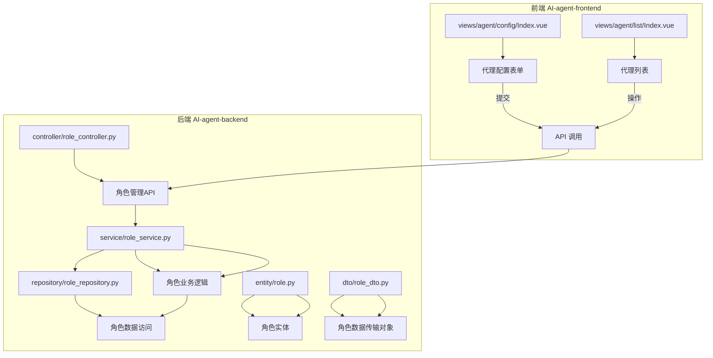
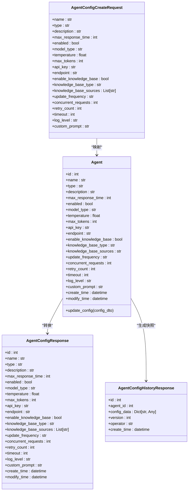

# 代理配置管理

<cite>
**本文档引用的文件**  
- [Index.vue](file://AI-agent-frontend/src/views/agent/config/Index.vue)
- [role_service.py](file://AI-agent-backend/app/service/role_service.py)
- [role_dto.py](file://AI-agent-backend/app/dto/role_dto.py)
- [role.py](file://AI-agent-backend/app/entity/role.py)
- [role_controller.py](file://AI-agent-backend/app/controller/role_controller.py)
- [base.py](file://AI-agent-backend/app/dto/base.py)
</cite>

## 目录
1. [项目结构分析](#项目结构分析)
2. [前端配置表单实现](#前端配置表单实现)
3. [配置参数数据结构与行为影响](#配置参数数据结构与行为影响)
4. [后端服务层设计建议](#后端服务层设计建议)
5. [DTO与实体模型设计](#dto与实体模型设计)
6. [配置操作使用示例](#配置操作使用示例)
7. [未来扩展方向](#未来扩展方向)

## 项目结构分析

项目由前后端分离架构组成，包含 `AI-agent-backend` 和 `AI-agent-frontend` 两个主要模块。后端采用 FastAPI 框架，遵循五层架构（Controller、Service、Repository、Entity、DTO），前端基于 Vue 3 和 Element Plus 构建。

代理相关功能集中在前端 `views/agent` 目录下，其中 `config/Index.vue` 为配置界面，`list/Index.vue` 为代理列表。后端目前尚无专门的代理配置服务，但具备完整的角色管理模块，可作为新功能开发的参考模板。



**图示来源**  
- [Index.vue](file://AI-agent-frontend/src/views/agent/config/Index.vue)
- [role_controller.py](file://AI-agent-backend/app/controller/role_controller.py)
- [role_service.py](file://AI-agent-backend/app/service/role_service.py)
- [role.py](file://AI-agent-backend/app/entity/role.py)
- [role_dto.py](file://AI-agent-backend/app/dto/role_dto.py)

## 前端配置表单实现

前端代理配置功能通过 `Index.vue` 组件实现，采用 `el-form` 构建多标签页表单，支持基础、模型、知识库和高级设置四类配置。

### 表单设计与字段验证

表单使用 `reactive` 定义 `configForm` 数据模型，并通过 `rules` 定义验证规则。关键字段包括：

- **代理名称**：必填，长度 2-50 字符
- **代理类型**：从“对话型”、“分析型”、“开发型”中选择
- **最大响应时间**：1-60 秒的数值输入
- **模型类型**：支持 GPT-4、GPT-3.5、Claude 和自定义模型
- **API密钥**：当模型类型非自定义时必填
- **自定义端点**：当模型类型为自定义时必填
- **知识库来源**：可多选，包括产品文档、API文档等
- **更新频率**：支持实时、每小时、每天、每周或手动

```vue
<el-form :model="configForm" :rules="rules" ref="configFormRef">
  <el-tabs v-model="activeTab">
    <el-tab-pane label="基础配置" name="basic">
      <el-form-item label="代理名称" prop="name">
        <el-input v-model="configForm.name" />
      </el-form-item>
      <!-- 其他字段 -->
    </el-tab-pane>
  </el-tabs>
</el-form>
```

### 提交流程

点击“保存配置”按钮触发 `handleSaveConfig` 方法，该方法首先调用 `configFormRef.value.validate()` 进行表单验证。验证通过后，弹出确认对话框，用户确认后显示“配置保存成功”提示。

```typescript
const handleSaveConfig = async () => {
  if (!configFormRef.value) return;
  await configFormRef.value.validate((valid, fields) => {
    if (valid) {
      ElMessageBox.confirm('确定要保存配置吗?', '提示').then(() => {
        ElMessage.success('配置保存成功');
      }).catch(() => {
        ElMessage.info('已取消保存');
      });
    } else {
      console.log('表单验证失败', fields);
    }
  });
};
```

当前实现仅为前端模拟，尚未连接后端 API。

**本节来源**  
- [Index.vue](file://AI-agent-frontend/src/views/agent/config/Index.vue)

## 配置参数数据结构与行为影响

配置参数通过 `configForm` 对象组织，其结构直接影响代理的运行行为。

### 数据结构定义

```typescript
const configForm = reactive({
  // 基础配置
  name: '客服助手',
  type: 'conversation',
  description: '处理客户咨询的智能客服',
  maxResponseTime: 10,
  enabled: true,
  
  // 模型配置
  modelType: 'gpt4',
  temperature: 0.7,
  maxTokens: 2000,
  apiKey: '',
  endpoint: '',
  
  // 知识库配置
  enableKnowledgeBase: true,
  knowledgeBaseType: 'document',
  knowledgeBaseSources: ['product_docs', 'faq'],
  updateFrequency: 'daily',
  
  // 高级设置
  concurrentRequests: 5,
  retryCount: 3,
  timeout: 30,
  logLevel: 'info',
  customPrompt: '你是一个专业的客服助手...'
})
```

### 参数对代理行为的影响机制

| 参数类别 | 参数名称 | 影响机制 |
|--------|--------|--------|
| **基础配置** | `maxResponseTime` | 限制代理响应的最大等待时间，超时将触发重试或返回错误 |
| | `enabled` | 控制代理是否处于激活状态，禁用时代理不处理任何请求 |
| **模型配置** | `modelType` | 决定调用的AI模型服务，影响响应质量与成本 |
| | `temperature` | 控制生成文本的随机性，值越高输出越具创造性 |
| | `maxTokens` | 限制模型输出的最大token数，防止响应过长 |
| | `apiKey` | 用于认证模型API调用，缺失将导致调用失败 |
| | `endpoint` | 自定义模型的访问地址，允许集成私有模型服务 |
| **知识库配置** | `enableKnowledgeBase` | 开启后代理将从知识库检索信息以增强回答准确性 |
| | `updateFrequency` | 决定知识库的同步频率，影响信息的时效性 |
| **高级设置** | `concurrentRequests` | 限制同时处理的请求数，防止系统过载 |
| | `retryCount` | 定义失败请求的重试次数，提高服务可靠性 |
| | `timeout` | 设置单个请求的超时时间，避免长时间阻塞 |
| | `logLevel` | 控制日志输出级别，便于问题排查与性能监控 |
| | `customPrompt` | 定义代理的系统提示词，塑造其行为风格与专业领域 |

## 后端服务层设计建议

尽管当前 `role_service.py` 并非专用于代理配置，但其服务模式可作为 `AgentService` 的设计参考。

### 应新增 AgentService 类

建议在 `app/service` 目录下创建 `agent_service.py`，封装代理配置相关的业务逻辑。该服务应继承通用的 `BaseService`，并注入数据库会话。

```python
class AgentService:
    def __init__(self, db: Session):
        self.db = db
        self.agent_repository = AgentRepository(db)
        self.config_history_repository = ConfigHistoryRepository(db)
    
    def create_agent(self, agent_dto: AgentCreateRequest) -> Agent:
        """创建新代理"""
        if self.agent_repository.exists_by_name(agent_dto.name):
            raise ValueError(f"代理名称 '{agent_dto.name}' 已存在")
        
        agent = Agent(**agent_dto.dict())
        created_agent = self.agent_repository.create(agent)
        
        # 保存初始配置到历史
        self._save_config_snapshot(created_agent, agent_dto)
        
        return created_agent
    
    def update_agent_config(self, agent_id: int, config_dto: AgentConfigUpdateRequest) -> Optional[Agent]:
        """更新代理配置"""
        agent = self.agent_repository.get_by_id(agent_id)
        if not agent:
            return None
        
        # 更新配置
        agent.update_config(config_dto)
        updated_agent = self.agent_repository.update(agent)
        
        # 保存新配置到历史
        self._save_config_snapshot(updated_agent, config_dto)
        
        return updated_agent
    
    def get_agent_config_history(self, agent_id: int, page: int, size: int) -> Dict[str, Any]:
        """获取配置历史，支持版本回滚"""
        return self.config_history_repository.get_history_with_pagination(agent_id, page, size)
    
    def rollback_agent_config(self, history_id: int) -> bool:
        """回滚到指定历史版本"""
        history = self.config_history_repository.get_by_id(history_id)
        if not history:
            return False
        
        agent = self.agent_repository.get_by_id(history.agent_id)
        if not agent:
            return False
        
        # 将历史配置应用到当前代理
        agent.apply_config_snapshot(history.config_data)
        self.agent_repository.update(agent)
        
        return True
```

**本节来源**  
- [role_service.py](file://AI-agent-backend/app/service/role_service.py)

## DTO与实体模型设计

参考 `role_dto.py` 和 `role.py` 的模式，设计代理配置相关的 DTO 与实体类。

### DTO 模型设计

在 `app/dto` 目录下创建 `agent_dto.py`，定义数据传输对象。

```python
class AgentConfigCreateRequest(BaseModel):
    """创建代理配置请求DTO"""
    name: str = Field(..., min_length=2, max_length=50, description="代理名称")
    type: str = Field(..., description="代理类型")
    description: Optional[str] = Field(None, max_length=200, description="描述")
    max_response_time: int = Field(..., ge=1, le=60, description="最大响应时间(秒)")
    enabled: bool = Field(True, description="启用状态")
    
    # 模型配置
    model_type: str = Field(..., description="模型类型")
    temperature: float = Field(0.7, ge=0.0, le=1.0, description="温度")
    max_tokens: int = Field(2000, ge=100, le=10000, description="最大输出长度")
    api_key: Optional[str] = Field(None, description="API密钥")
    endpoint: Optional[str] = Field(None, description="自定义端点")
    
    # 知识库配置
    enable_knowledge_base: bool = Field(False, description="启用知识库")
    knowledge_base_type: Optional[str] = Field(None, description="知识库类型")
    knowledge_base_sources: List[str] = Field(default_factory=list, description="知识库来源")
    update_frequency: Optional[str] = Field(None, description="更新频率")
    
    # 高级设置
    concurrent_requests: int = Field(5, ge=1, le=100, description="并发请求数")
    retry_count: int = Field(3, ge=0, le=5, description="重试次数")
    timeout: int = Field(30, ge=1, le=60, description="超时时间(秒)")
    log_level: str = Field("info", description="日志级别")
    custom_prompt: Optional[str] = Field(None, description="自定义提示词")

class AgentConfigResponse(BaseModel):
    """代理配置响应DTO"""
    id: int = Field(..., description="代理ID")
    name: str = Field(..., description="代理名称")
    # ... 其他字段
    create_time: datetime = Field(..., description="创建时间")
    modify_time: Optional[datetime] = Field(None, description="修改时间")

class AgentConfigHistoryResponse(BaseModel):
    """代理配置历史响应DTO"""
    id: int = Field(..., description="历史ID")
    agent_id: int = Field(..., description="代理ID")
    config_data: Dict[str, Any] = Field(..., description="配置快照")
    version: int = Field(..., description="版本号")
    operator: str = Field(..., description="操作人")
    create_time: datetime = Field(..., description="创建时间")
```

### 实体模型设计

在 `app/entity` 目录下创建 `agent.py`，定义数据库实体。

```python
class Agent(Base):
    """代理实体类 - 对应 t_agent 表"""
    __tablename__ = "t_agent"

    id = Column(Integer, primary_key=True, comment="代理ID")
    name = Column(String(50), nullable=False, unique=True, comment="代理名称")
    type = Column(String(20), nullable=False, comment="代理类型")
    description = Column(String(200), nullable=True, comment="描述")
    max_response_time = Column(Integer, nullable=False, comment="最大响应时间(秒)")
    enabled = Column(Boolean, default=True, comment="启用状态")
    
    # 模型配置
    model_type = Column(String(20), nullable=False, comment="模型类型")
    temperature = Column(Float, default=0.7, comment="温度")
    max_tokens = Column(Integer, default=2000, comment="最大输出长度")
    api_key = Column(String(255), nullable=True, comment="API密钥")
    endpoint = Column(String(255), nullable=True, comment="自定义端点")
    
    # 知识库配置
    enable_knowledge_base = Column(Boolean, default=False, comment="启用知识库")
    knowledge_base_type = Column(String(20), nullable=True, comment="知识库类型")
    knowledge_base_sources = Column(String(255), nullable=True, comment="知识库来源(JSON)")
    update_frequency = Column(String(20), nullable=True, comment="更新频率")
    
    # 高级设置
    concurrent_requests = Column(Integer, default=5, comment="并发请求数")
    retry_count = Column(Integer, default=3, comment="重试次数")
    timeout = Column(Integer, default=30, comment="超时时间(秒)")
    log_level = Column(String(10), default="info", comment="日志级别")
    custom_prompt = Column(Text, nullable=True, comment="自定义提示词")
    
    create_time = Column(DateTime, nullable=False, default=datetime.utcnow, comment="创建时间")
    modify_time = Column(DateTime, nullable=True, onupdate=datetime.utcnow, comment="修改时间")

    def update_config(self, config_dto: AgentConfigUpdateRequest):
        """更新代理配置"""
        for field, value in config_dto.dict(exclude_unset=True).items():
            setattr(self, field, value)
        self.modify_time = datetime.utcnow()
```



**图示来源**  
- [role_dto.py](file://AI-agent-backend/app/dto/role_dto.py)
- [role.py](file://AI-agent-backend/app/entity/role.py)

## 配置操作使用示例

### 配置保存

```python
# 创建服务实例
agent_service = AgentService(db)

# 创建新代理
try:
    new_agent = agent_service.create_agent(AgentConfigCreateRequest(
        name="技术支持助手",
        type="conversation",
        description="解答用户技术问题",
        max_response_time=15,
        model_type="gpt4",
        temperature=0.5,
        max_tokens=1500,
        api_key="sk-xxx",
        enable_knowledge_base=True,
        knowledge_base_sources=["product_docs", "faq"],
        update_frequency="daily",
        timeout=30
    ))
    print("代理创建成功:", new_agent.id)
except ValueError as e:
    print("创建失败:", str(e))
```

### 默认值处理

当创建代理时，未提供的字段将使用 DTO 中定义的默认值：

- `enabled`: `True`
- `temperature`: `0.7`
- `max_tokens`: `2000`
- `concurrent_requests`: `5`
- `retry_count`: `3`
- `timeout`: `30`
- `log_level`: `"info"`

这确保了即使用户未填写所有高级选项，代理也能以合理配置运行。

### 版本回滚

```python
# 获取配置历史
history = agent_service.get_agent_config_history(agent_id=1, page=1, size=10)

# 回滚到指定版本
success = agent_service.rollback_agent_config(history_id=5)
if success:
    print("配置回滚成功")
else:
    print("配置回滚失败")
```

**本节来源**  
- [role_service.py](file://AI-agent-backend/app/service/role_service.py)

## 未来扩展方向

### 支持YAML配置导入

为提升配置效率，建议支持 YAML 格式的配置导入功能。

1. **前端**：在配置页面添加“导入YAML”按钮，允许用户上传或粘贴 YAML 配置。
2. **后端**：在 `AgentService` 中添加 `import_from_yaml(yaml_content: str)` 方法，使用 `PyYAML` 解析内容并转换为 `AgentConfigCreateRequest`。
3. **验证**：导入前进行 YAML 结构验证，确保符合预定义 schema。
4. **合并**：提供“覆盖现有”或“合并更新”两种模式。

```python
import yaml
from pydantic import ValidationError

def import_from_yaml(self, yaml_content: str) -> Agent:
    try:
        config_dict = yaml.safe_load(yaml_content)
        config_dto = AgentConfigCreateRequest(**config_dict)
        return self.create_agent(config_dto)
    except yaml.YAMLError as e:
        raise ValueError(f"YAML解析失败: {str(e)}")
    except ValidationError as e:
        raise ValueError(f"配置验证失败: {str(e)}")
```

此功能将极大方便批量部署和配置迁移。