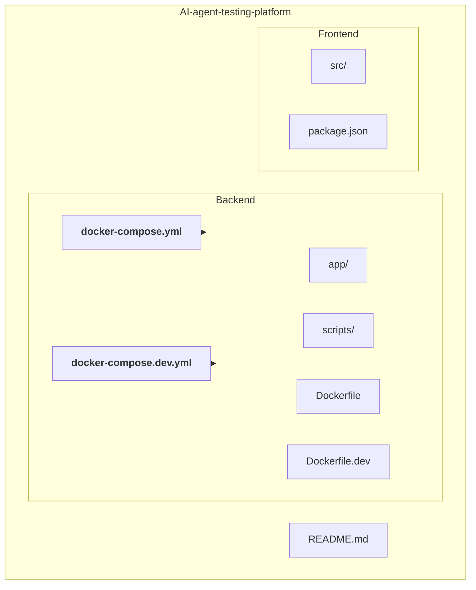
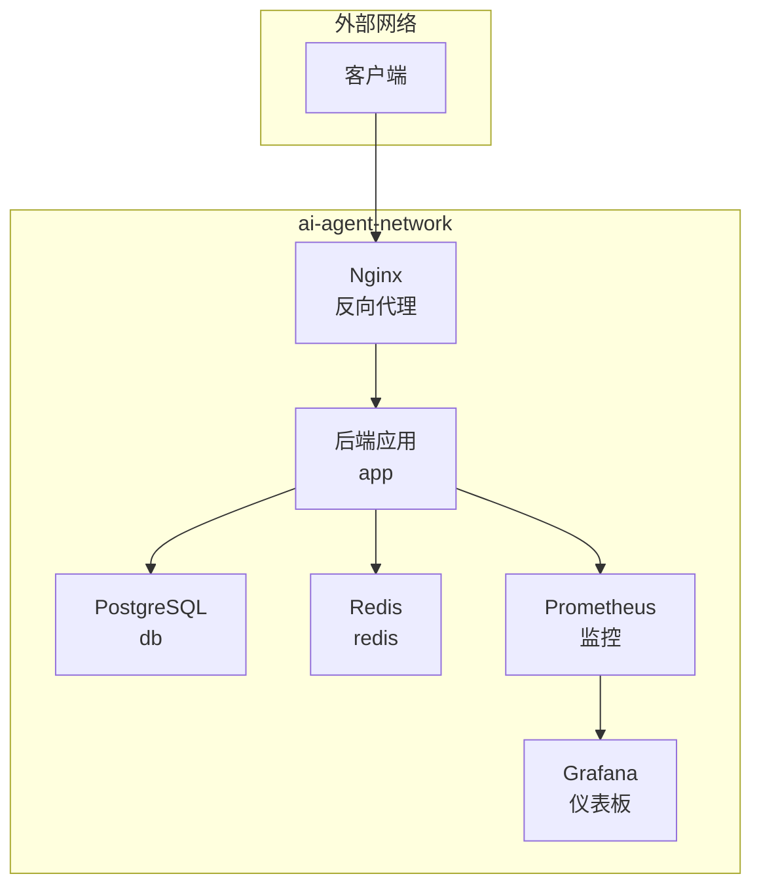
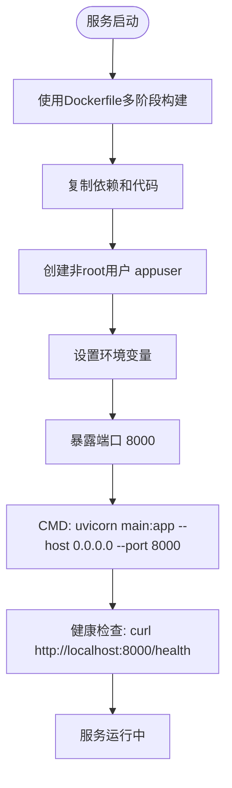
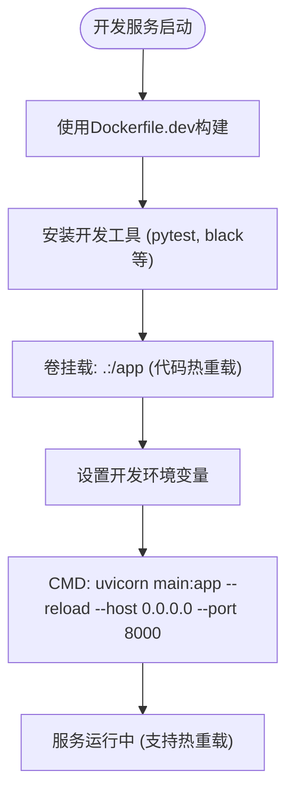
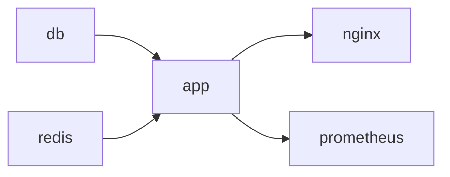

# Docker配置

<cite>
**本文档引用文件**  
- [docker-compose.yml](file://AI-agent-backend/docker-compose.yml)
- [docker-compose.dev.yml](file://AI-agent-backend/docker-compose.dev.yml)
- [Dockerfile](file://AI-agent-backend/Dockerfile)
- [Dockerfile.dev](file://AI-agent-backend/Dockerfile.dev)
- [config.py](file://AI-agent-backend/app/core/config.py)
- [main.py](file://AI-agent-backend/main.py)
- [init_db.py](file://AI-agent-backend/scripts/init_db.py)
- [redis_client.py](file://AI-agent-backend/app/utils/redis_client.py)
</cite>

## 目录
1. [简介](#简介)
2. [项目结构](#项目结构)
3. [核心组件](#核心组件)
4. [架构概览](#架构概览)
5. [详细组件分析](#详细组件分析)
6. [依赖分析](#依赖分析)
7. [性能考量](#性能考量)
8. [故障排除指南](#故障排除指南)
9. [结论](#结论)

## 简介
本文档旨在全面分析AI代理测试平台的Docker容器编排配置，重点对比生产环境（`docker-compose.yml`）与开发环境（`docker-compose.dev.yml`）的差异。文档详细说明了各服务（后端、前端、数据库、Redis）的镜像、构建上下文、端口映射、环境变量、依赖关系和卷挂载配置。同时，解释了开发环境如何通过卷挂载实现代码热重载，以及生产环境如何优化镜像构建和资源限制。此外，还提供了网络配置、健康检查及服务间通信的最佳实践，并指导用户根据部署需求自定义Compose文件。

## 项目结构
项目采用分层架构，主要分为后端（AI-agent-backend）和前端（AI-agent-frontend）两个独立的模块。后端基于FastAPI框架，实现了企业级五层架构（Controller、Service、Repository、Entity、DTO），并使用Alembic进行数据库迁移。前端基于Vue3和Vite构建，采用模块化设计。两个模块通过Docker Compose进行容器化编排。

**图示来源**
- [docker-compose.yml](file://AI-agent-backend/docker-compose.yml#L1-L144)
- [docker-compose.dev.yml](file://AI-agent-backend/docker-compose.dev.yml#L1-L58)

**本节来源**
- [docker-compose.yml](file://AI-agent-backend/docker-compose.yml#L1-L144)
- [docker-compose.dev.yml](file://AI-agent-backend/docker-compose.dev.yml#L1-L58)

## 核心组件
本项目的核心组件包括后端应用服务（app）、PostgreSQL数据库（db）、Redis缓存（redis）以及可选的Nginx反向代理和监控服务（Prometheus、Grafana）。后端应用通过FastAPI框架提供RESTful API，使用SQLAlchemy进行数据库操作，并利用Redis实现缓存和会话管理。开发环境通过卷挂载实现代码热重载，而生产环境则通过多阶段构建优化镜像大小和安全性。

**本节来源**
- [docker-compose.yml](file://AI-agent-backend/docker-compose.yml#L1-L144)
- [docker-compose.dev.yml](file://AI-agent-backend/docker-compose.dev.yml#L1-L58)
- [Dockerfile](file://AI-agent-backend/Dockerfile#L1-L66)
- [Dockerfile.dev](file://AI-agent-backend/Dockerfile.dev#L1-L53)

## 架构概览
系统采用微服务架构，通过Docker Compose将多个服务（后端、数据库、缓存、反向代理、监控）编排在一个网络中。后端服务是核心，负责处理业务逻辑和API请求。数据库服务存储持久化数据，缓存服务提升性能。Nginx作为反向代理，将外部请求转发到后端服务。Prometheus和Grafana构成监控系统，用于收集和可视化应用指标。

**图示来源**
- [docker-compose.yml](file://AI-agent-backend/docker-compose.yml#L1-L144)

## 详细组件分析

### 后端应用服务 (app) 分析
后端应用服务是整个系统的核心，负责处理所有业务逻辑和API请求。其配置在生产环境和开发环境中存在显著差异。

#### 生产环境配置 (docker-compose.yml)
在生产环境中，`app`服务的配置注重安全性和性能优化。
- **镜像构建**: 使用`Dockerfile`进行多阶段构建，首先在`builder`阶段安装所有依赖，然后在运行阶段仅复制已安装的包和应用代码，从而生成一个精简、安全的镜像。
- **环境变量**: 设置`ENVIRONMENT=production`，使用PostgreSQL数据库（`DATABASE_URL=postgresql://postgres:password@db:5432/ai_agent_db`），并要求提供强密钥（`SECRET_KEY`）。
- **卷挂载**: 仅挂载`logs`和`uploads`目录，确保日志和上传文件的持久化，但不挂载源代码，防止代码被意外修改。
- **依赖关系**: 依赖`db`和`redis`服务，确保数据库和缓存服务启动后再启动应用。
- **健康检查**: 配置了健康检查，通过`curl`命令访问`/health`端点来确认服务是否正常运行。

**图示来源**
- [Dockerfile](file://AI-agent-backend/Dockerfile#L1-L66)
- [docker-compose.yml](file://AI-agent-backend/docker-compose.yml#L10-L35)

#### 开发环境配置 (docker-compose.dev.yml)
在开发环境中，`app`服务的配置侧重于开发效率和调试便利性。
- **镜像构建**: 使用`Dockerfile.dev`，该文件安装了`pytest`、`black`、`flake8`等开发和测试工具，便于在容器内进行开发和调试。
- **环境变量**: 设置`ENVIRONMENT=development`，使用轻量级的SQLite数据库（`DATABASE_URL=sqlite:///./ai_agent_dev.db`），并启用调试模式（`DEBUG=True`）。
- **卷挂载**: 使用`- .:/app`将本地项目根目录完整挂载到容器的`/app`目录，实现代码热重载。当本地代码修改时，容器内的应用会自动重启。
- **启动命令**: 在`command`中明确添加`--reload`参数，启用Uvicorn的自动重载功能。
- **依赖关系**: 仅依赖`redis`，因为SQLite数据库是文件型数据库，无需单独的服务。

**图示来源**
- [Dockerfile.dev](file://AI-agent-backend/Dockerfile.dev#L1-L53)
- [docker-compose.dev.yml](file://AI-agent-backend/docker-compose.dev.yml#L10-L33)

**本节来源**
- [Dockerfile](file://AI-agent-backend/Dockerfile#L1-L66)
- [Dockerfile.dev](file://AI-agent-backend/Dockerfile.dev#L1-L53)
- [docker-compose.yml](file://AI-agent-backend/docker-compose.yml#L10-L35)
- [docker-compose.dev.yml](file://AI-agent-backend/docker-compose.dev.yml#L10-L33)

### 数据库服务 (db) 分析
数据库服务在生产环境中使用PostgreSQL，在开发环境中则使用SQLite。

#### 生产环境 - PostgreSQL (db)
- **镜像**: 使用`postgres:15-alpine`镜像，这是一个轻量级的PostgreSQL发行版。
- **环境变量**: 定义了数据库名、用户名和密码。
- **卷挂载**: 使用命名卷`postgres_data`来持久化数据库文件，确保数据在容器重启后不丢失。同时，挂载`init_db.sql`脚本，在数据库首次初始化时执行，用于创建表和初始数据。
- **端口映射**: 将容器的5432端口映射到宿主机的5432端口，方便外部工具（如Adminer）连接。
- **健康检查**: 使用`pg_isready`命令检查数据库是否准备好接受连接。

**本节来源**
- [docker-compose.yml](file://AI-agent-backend/docker-compose.yml#L37-L67)
- [scripts/init_db.py](file://AI-agent-backend/scripts/init_db.py#L1-L378)

### Redis缓存服务 (redis) 分析
Redis服务在生产环境和开发环境中都存在，但配置略有不同。
- **镜像**: 均使用`redis:7-alpine`镜像。
- **生产环境**: 通过`command`参数设置了`--appendonly yes`（开启AOF持久化）和`--requirepass redispassword`（设置密码），增强了数据安全性和持久性。
- **开发环境**: 未设置密码和持久化，配置更简单，适合开发调试。
- **卷挂载**: 生产环境使用`redis_data`命名卷来持久化数据，开发环境则没有挂载，数据在容器删除后会丢失。
- **端口映射**: 两者都将6379端口映射到宿主机，便于连接。

**本节来源**
- [docker-compose.yml](file://AI-agent-backend/docker-compose.yml#L69-L90)
- [docker-compose.dev.yml](file://AI-agent-backend/docker-compose.dev.yml#L35-L43)
- [redis_client.py](file://AI-agent-backend/app/utils/redis_client.py#L1-L258)

### 可选服务分析
生产环境的Compose文件还定义了Nginx、Prometheus和Grafana等可选服务。
- **Nginx**: 作为反向代理，将外部HTTP请求（端口80/443）转发到后端应用（端口8000）。通过挂载自定义的`nginx.conf`和SSL证书来配置。
- **Prometheus**: 用于监控，通过`prometheus.yml`配置文件定义了抓取目标（如后端应用的指标端点）。
- **Grafana**: 提供可视化仪表板，通过挂载数据源和仪表板配置文件进行预配置。

**本节来源**
- [docker-compose.yml](file://AI-agent-backend/docker-compose.yml#L92-L143)

## 依赖分析
服务间的依赖关系清晰，确保了正确的启动顺序。
- `app`服务依赖`db`和`redis`，通过`depends_on`指令实现。这意味着Docker Compose会先尝试启动`db`和`redis`，然后再启动`app`。但需注意，`depends_on`只确保容器启动，不保证服务内部已就绪。因此，应用代码中应包含重试逻辑或使用健康检查来等待依赖服务。
- `nginx`服务依赖`app`，确保应用服务启动后再启动Nginx，避免反向代理失败。
- 数据库和缓存服务是独立的，不依赖其他应用服务。

**图示来源**
- [docker-compose.yml](file://AI-agent-backend/docker-compose.yml#L32-L34)
- [docker-compose.yml](file://AI-agent-backend/docker-compose.yml#L119-L121)

**本节来源**
- [docker-compose.yml](file://AI-agent-backend/docker-compose.yml#L32-L34)
- [docker-compose.yml](file://AI-agent-backend/docker-compose.yml#L119-L121)

## 性能考量
- **镜像优化**: 生产环境的`Dockerfile`采用多阶段构建，显著减小了最终镜像的大小，减少了攻击面，并加快了部署速度。
- **资源限制**: 虽然当前配置未显式设置CPU和内存限制，但在生产环境中，应在`docker-compose.yml`中为每个服务添加`deploy.resources`来限制资源使用，防止某个服务耗尽主机资源。
- **健康检查**: 所有关键服务都配置了健康检查，Docker可以据此判断容器状态，并在服务不健康时进行重启，提高了系统的自愈能力。
- **缓存策略**: 应用通过`redis_client.py`实现了优雅的缓存降级策略。当Redis不可用时，会自动切换到内存缓存，保证了服务的可用性。

## 故障排除指南
- **应用无法连接数据库**: 检查`DATABASE_URL`环境变量是否正确，特别是主机名（生产环境应为`db`，而非`localhost`）。确认`db`服务已正常启动，并检查其日志。
- **代码修改未生效（开发环境）**: 确认`docker-compose.dev.yml`中的卷挂载`- .:/app`配置正确，并且`command`中包含`--reload`。检查文件权限。
- **Redis连接失败**: 检查`REDIS_URL`环境变量和Redis服务的密码配置。确认`redis`服务正在运行。
- **健康检查失败**: 检查`/health`端点是否返回200状态码。查看应用日志，确认应用是否因异常而无法启动。
- **数据库初始化失败**: 确保`init_db.sql`脚本存在且语法正确。检查数据库容器的日志。

**本节来源**
- [config.py](file://AI-agent-backend/app/core/config.py#L1-L197)
- [main.py](file://AI-agent-backend/main.py#L17-L216)
- [redis_client.py](file://AI-agent-backend/app/utils/redis_client.py#L1-L258)

## 结论
本文档详细分析了AI代理测试平台的Docker容器编排配置。生产环境的`docker-compose.yml`配置全面，注重安全、性能和监控，适合部署上线。开发环境的`docker-compose.dev.yml`配置简洁，通过代码热重载极大提升了开发效率。通过理解这些配置的差异和最佳实践，用户可以根据实际需求（如添加前端服务、调整资源限制、配置HTTPS）灵活地自定义和扩展Compose文件，以满足不同的部署场景。