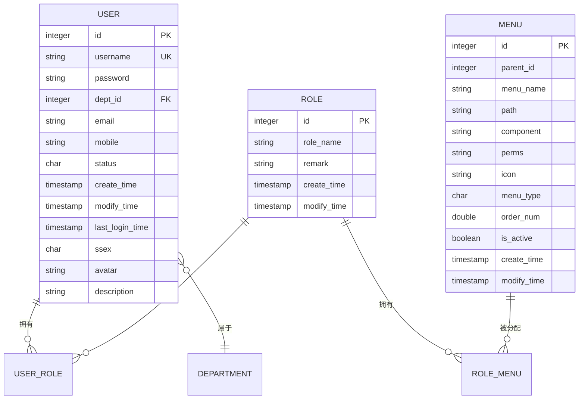

# RBAC数据模型

<cite>
**本文档引用的文件**
- [user.py](file://AI-agent-backend\app\entity\user.py) - *更新了用户管理权限配置*
- [role.py](file://AI-agent-backend\app\entity\role.py) - *权限命名规范统一*
- [menu.py](file://AI-agent-backend\app\entity\menu.py) - *新增用户管理相关权限*
- [user_role.py](file://AI-agent-backend\app\entity\user_role.py) - *关联表结构保持稳定*
- [role_menu.py](file://AI-agent-backend\app\entity\role_menu.py) - *权限分配逻辑更新*
- [rbac_base.py](file://AI-agent-backend\app\entity\rbac_base.py) - *基类功能无变更*
- [init_db.py](file://AI-agent-backend\scripts\init_db.py) - *重构权限系统并初始化数据*
</cite>

## 更新摘要
**变更内容**   
- 更新了用户管理相关的权限配置，新增了多个权限标识
- 统一了权限命名规范，确保权限标识的一致性
- 在`init_db.py`中重构了权限系统的初始化逻辑
- 新增了用户状态管理、密码重置、批量删除等权限按钮
- 保持了核心数据模型结构的稳定性

## 目录
1. [用户实体模型](#用户实体模型)
2. [角色实体模型](#角色实体模型)
3. [菜单实体模型](#菜单实体模型)
4. [用户角色关联表](#用户角色关联表)
5. [角色菜单关联表](#角色菜单关联表)
6. [RBAC基类](#rbac基类)
7. [数据库ER图](#数据库er图)
8. [典型数据关联场景](#典型数据关联场景)

## 用户实体模型

用户实体（User）是RBAC系统中的核心实体之一，对应数据库中的`user`表。该实体定义了用户的基本信息和行为，通过`user_roles`关系与角色建立多对多关联。

**字段定义：**
- **user_id**: 主键，自增整数，唯一标识用户
- **username**: 字符串（50字符），必填，唯一且带索引，表示用户名
- **password**: 字符串（128字符），必填，存储加密后的密码
- **dept_id**: 整数，外键关联部门表`department.id`，可为空
- **email**: 字符串（128字符），可为空，表示邮箱
- **mobile**: 字符串（20字符），可为空，表示联系电话
- **status**: 字符（1字符），必填，默认值'1'，'0'表示锁定，'1'表示有效
- **create_time**: 日期时间，必填，默认为当前UTC时间，记录创建时间
- **modify_time**: 日期时间，可为空，更新时自动设置为当前UTC时间
- **last_login_time**: 日期时间，可为空，记录最近登录时间
- **ssex**: 字符（1字符），可为空，'0'男 '1'女 '2'保密
- **avatar**: 字符串（100字符），可为空，表示头像路径
- **description**: 字符串（100字符），可为空，表示用户描述

**索引设置：**
- `username`字段设置了唯一索引，确保用户名的唯一性

**关联关系：**
- `user_roles`: 与`UserRole`实体建立一对多关系，通过`back_populates="user"`反向关联
- `department`: 与`Department`实体建立一对多关系，表示用户所属部门

**公共方法：**
- `is_active()`: 判断用户是否有效
- `is_locked()`: 判断用户是否被锁定
- `lock_user()`: 锁定用户
- `unlock_user()`: 解锁用户
- `update_last_login()`: 更新最后登录时间
- `change_password(new_password)`: 修改密码
- `update_info(...)`: 更新用户基本信息
- `get_gender_display()`: 获取性别的中文显示文本
- `to_dict()`: 转换为包含所有信息的字典
- `to_dict_safe()`: 转换为不包含密码的安全字典

**Section sources**
- [user.py](file://AI-agent-backend\app\entity\user.py#L14-L214)

## 角色实体模型

角色实体（Role）用于存储系统中的角色信息，对应数据库中的`role`表。该实体通过`user_roles`和`role_menus`关系分别与用户和菜单建立多对多关联。

**字段定义：**
- **role_id**: 主键，自增整数，唯一标识角色
- **role_name**: 字符串（10字符），必填，表示角色名称
- **remark**: 字符串（100字符），可为空，表示角色描述
- **create_time**: 日期时间，必填，默认为当前UTC时间，记录创建时间
- **modify_time**: 日期时间，可为空，更新时自动设置为当前UTC时间

**关联关系：**
- `user_roles`: 与`UserRole`实体建立一对多关系，通过`back_populates="role"`反向关联，表示一个角色可以分配给多个用户
- `role_menus`: 与`RoleMenu`实体建立一对多关系，通过`back_populates="role"`反向关联，表示一个角色可以拥有多个菜单权限

**公共方法：**
- `__init__(role_name, remark)`: 初始化角色，设置角色名称和描述
- `update_info(role_name, remark)`: 更新角色信息
- `to_dict()`: 转换为角色信息字典
- `__repr__()`: 返回角色的字符串表示

**Section sources**
- [role.py](file://AI-agent-backend\app\entity\role.py#L14-L89)

## 菜单实体模型

菜单实体（Menu）用于存储系统中的菜单项和按钮权限，对应数据库中的`menu`表。该实体通过`role_menus`关系与角色建立多对多关联。

**字段定义：**
- **menu_id**: 主键，自增整数，唯一标识菜单/按钮
- **parent_id**: 整数，必填，表示上级菜单ID，0表示顶级菜单
- **menu_name**: 字符串（50字符），必填，表示菜单/按钮名称
- **path**: 字符串（255字符），可为空，表示对应路由路径
- **component**: 字符串（255字符），可为空，表示对应路由组件
- **perms**: 字符串（50字符），可为空，表示权限标识（如：user:view, user:add）
- **icon**: 字符串（50字符），可为空，表示图标
- **menu_type**: 字符（2字符），必填，'0'表示菜单，'1'表示按钮
- **order_num**: 浮点数，可为空，用于菜单排序
- **is_active**: 布尔值，必填，默认启用，表示是否启用
- **create_time**: 日期时间，必填，默认为当前UTC时间，记录创建时间
- **modify_time**: 日期时间，可为空，更新时自动设置为当前UTC时间

**关联关系：**
- `role_menus`: 与`RoleMenu`实体建立一对多关系，通过`back_populates="menu"`反向关联，表示一个菜单可以分配给多个角色

**公共方法：**
- `__init__(...)`: 初始化菜单，设置各项属性
- `is_menu()`: 判断是否为菜单类型
- `is_button()`: 判断是否为按钮类型
- `is_top_level()`: 判断是否为顶级菜单
- `update_info(...)`: 更新菜单信息
- `to_dict()`: 转换为菜单信息字典
- `__repr__()`: 返回菜单的字符串表示

**Section sources**
- [menu.py](file://AI-agent-backend\app\entity\menu.py#L14-L165)

## 用户角色关联表

用户角色关联实体（UserRole）是实现用户与角色多对多关系的关联表，对应数据库中的`user_role`表。该表通过复合主键（user_id, role_id）确保每个用户-角色组合的唯一性。

**字段定义：**
- **id**: 主键，自增整数，唯一标识关联记录
- **user_id**: 外键，关联`user.id`，作为复合主键的一部分
- **role_id**: 外键，关联`role.id`，作为复合主键的一部分

**外键约束：**
- `user_id`字段外键约束指向`user`表的`id`字段，确保引用的用户存在
- `role_id`字段外键约束指向`role`表的`id`字段，确保引用的角色存在

**关联关系：**
- `user`: 与`User`实体建立关系，通过`back_populates="user_roles"`反向关联
- `role`: 与`Role`实体建立关系，通过`back_populates="user_roles"`反向关联

**实现方式：**
通过在`User`和`Role`实体中定义`relationship`，并指定`back_populates`参数，SQLAlchemy自动处理多对多关系的映射。`UserRole`作为中间表，存储用户和角色的ID组合，实现灵活的权限分配。

**公共方法：**
- `__init__(user_id, role_id)`: 初始化用户角色关联
- `to_dict()`: 转换为用户角色关联信息字典
- `__repr__()`: 返回用户角色关联的字符串表示

**Section sources**
- [user_role.py](file://AI-agent-backend\app\entity\user_role.py#L12-L60)

## 角色菜单关联表

角色菜单关联实体（RoleMenu）是实现角色与菜单多对多关系的关联表，对应数据库中的`role_menu`表。该表通过复合主键（role_id, menu_id）确保每个角色-菜单组合的唯一性。

**字段定义：**
- **id**: 主键，自增整数，唯一标识关联记录
- **role_id**: 外键，关联`role.id`，作为复合主键的一部分
- **menu_id**: 外键，关联`menu.id`，作为复合主键的一部分

**外键约束：**
- `role_id`字段外键约束指向`role`表的`id`字段，确保引用的角色存在
- `menu_id`字段外键约束指向`menu`表的`id`字段，确保引用的菜单存在

**关联关系：**
- `role`: 与`Role`实体建立关系，通过`back_populates="role_menus"`反向关联
- `menu`: 与`Menu`实体建立关系，通过`back_populates="role_menus"`反向关联

**实现方式：**
与用户角色关联类似，通过在`Role`和`Menu`实体中定义`relationship`，并指定`back_populates`参数，SQLAlchemy自动处理多对多关系的映射。`RoleMenu`作为中间表，存储角色和菜单的ID组合，实现灵活的权限控制。

**公共方法：**
- `__init__(role_id, menu_id)`: 初始化角色菜单关联
- `to_dict()`: 转换为角色菜单关联信息字典
- `__repr__()`: 返回角色菜单关联的字符串表示

**Section sources**
- [role_menu.py](file://AI-agent-backend\app\entity\role_menu.py#L12-L60)

## RBAC基类

RBAC基类（BaseEntity）为所有权限相关实体提供统一的基类，位于`base.py`文件中。该基类继承自SQLAlchemy的`Base`类，并实现了`ABC`抽象基类，为所有实体提供通用功能。

**实现方式：**
```python
from sqlalchemy.ext.declarative import DeclarativeMeta
from abc import ABC, ABCMeta

class CombinedMeta(DeclarativeMeta, ABCMeta):
    """
    组合SQLAlchemy和ABC的元类
    """
    pass

class BaseEntity(Base, ABC, metaclass=CombinedMeta):
    """
    实体基类
    所有业务实体都应该继承此类
    提供通用的实体操作方法
    """
    __abstract__ = True  # 标记为抽象类，不会创建对应的数据库表
    __allow_unmapped__ = True  # 允许未映射的注解
```

**作用：**
- **统一基类**: 为`User`、`Role`、`Menu`、`UserRole`、`RoleMenu`等所有RBAC相关实体提供统一的基类
- **ORM功能**: 继承SQLAlchemy的声明式映射功能，包括表映射、查询接口等
- **代码复用**: 提供通用方法，避免重复代码
- **抽象设计**: 通过`__abstract__ = True`标记为抽象类，防止创建对应的数据库表

**通用方法：**
- `validate()`: 验证实实体数据的有效性
- `before_save()`: 保存前的钩子方法
- `after_save()`: 保存后的钩子方法
- `before_update()`: 更新前的钩子方法
- `after_update()`: 更新后的钩子方法
- `before_delete()`: 删除前的钩子方法
- `after_delete()`: 删除后的钩子方法
- `soft_delete()`: 软删除实体
- `restore()`: 恢复软删除的实体
- `is_soft_deleted()`: 检查实体是否被软删除
- `to_dict_with_relations()`: 将实体转换为字典，可选择是否包含关联对象
- `get_table_name()`: 获取表名
- `get_primary_key_name()`: 获取主键字段名
- `get_primary_key_value()`: 获取主键值
- `__eq__()`: 实体相等性比较
- `__hash__()`: 实体哈希值

**Section sources**
- [base.py](file://AI-agent-backend\app\entity\base.py#L9-L149)

## 数据库ER图



**Diagram sources**
- [user.py](file://AI-agent-backend\app\entity\user.py#L14-L214)
- [role.py](file://AI-agent-backend\app\entity\role.py#L14-L89)
- [menu.py](file://AI-agent-backend\app\entity\menu.py#L14-L165)
- [user_role.py](file://AI-agent-backend\app\entity\user_role.py#L12-L60)
- [role_menu.py](file://AI-agent-backend\app\entity\role_menu.py#L12-L60)

## 典型数据关联场景

### 场景一：用户拥有多个角色

假设系统中存在用户"张三"（user_id=1），该用户同时拥有"系统管理员"（role_id=1）和"部门主管"（role_id=2）两个角色。

**数据记录：**
- `user`表：`{id: 1, username: "张三", ...}`
- `role`表：`{id: 1, role_name: "系统管理员", ...}` 和 `{id: 2, role_name: "部门主管", ...}`
- `user_role`表：`{user_id: 1, role_id: 1}` 和 `{user_id: 1, role_id: 2}`

**查询逻辑：**
当验证用户权限时，系统会先通过`user_id`在`user_role`表中查找所有关联的角色ID，然后根据这些角色ID获取相应的菜单权限。

### 场景二：角色可访问多个菜单项

假设"系统管理员"角色（role_id=1）可以访问"用户管理"、"角色管理"、"菜单管理"等多个菜单项。

**数据记录：**
- `role`表：`{id: 1, role_name: "系统管理员", ...}`
- `menu`表：包含"用户管理"（id=10）、"角色管理"（id=20）、"菜单管理"（id=30）等菜单记录
- `role_menu`表：`{role_id: 1, menu_id: 10}`、`{role_id: 1, menu_id: 20}`、`{role_id: 1, menu_id: 30}`

**权限验证流程：**
1. 用户登录后，系统根据用户ID查询其所有角色
2. 根据角色ID列表，查询`role_menu`表获取该用户可访问的所有菜单ID
3. 根据菜单ID列表，查询`menu`表获取具体的菜单信息和权限标识
4. 前端根据菜单信息渲染导航菜单，后端根据权限标识验证API访问权限

### 场景三：复杂权限组合

考虑一个更复杂的场景：用户"李四"（user_id=2）是"普通员工"（role_id=3），但被特别授予了"报表查看"（menu_id=100）权限。

**数据记录：**
- `user`表：`{id: 2, username: "李四", ...}`
- `role`表：`{id: 3, role_name: "普通员工", ...}`
- `menu`表：`{id: 100, menu_name: "报表查看", perms: "report:view", ...}`
- `user_role`表：`{user_id: 2, role_id: 3}`
- `role_menu`表：`{role_id: 3, menu_id: 1}`（假设普通员工默认只能访问首页）
- `role_menu`表：`{role_id: 1, menu_id: 100}`（系统管理员角色有报表查看权限）

**特殊处理：**
虽然"普通员工"角色默认没有报表查看权限，但可以通过直接在`role_menu`表中添加记录 `{role_id: 3, menu_id: 100}` 来为该角色添加特定权限，或者通过其他机制（如用户特定权限表）实现。这体现了RBAC模型的灵活性，允许通过角色继承和权限组合实现复杂的访问控制策略。

**Section sources**
- [user.py](file://AI-agent-backend\app\entity\user.py#L14-L214)
- [role.py](file://AI-agent-backend\app\entity\role.py#L14-L89)
- [menu.py](file://AI-agent-backend\app\entity\menu.py#L14-L165)
- [user_role.py](file://AI-agent-backend\app\entity\user_role.py#L12-L60)
- [role_menu.py](file://AI-agent-backend\app\entity\role_menu.py#L12-L60)