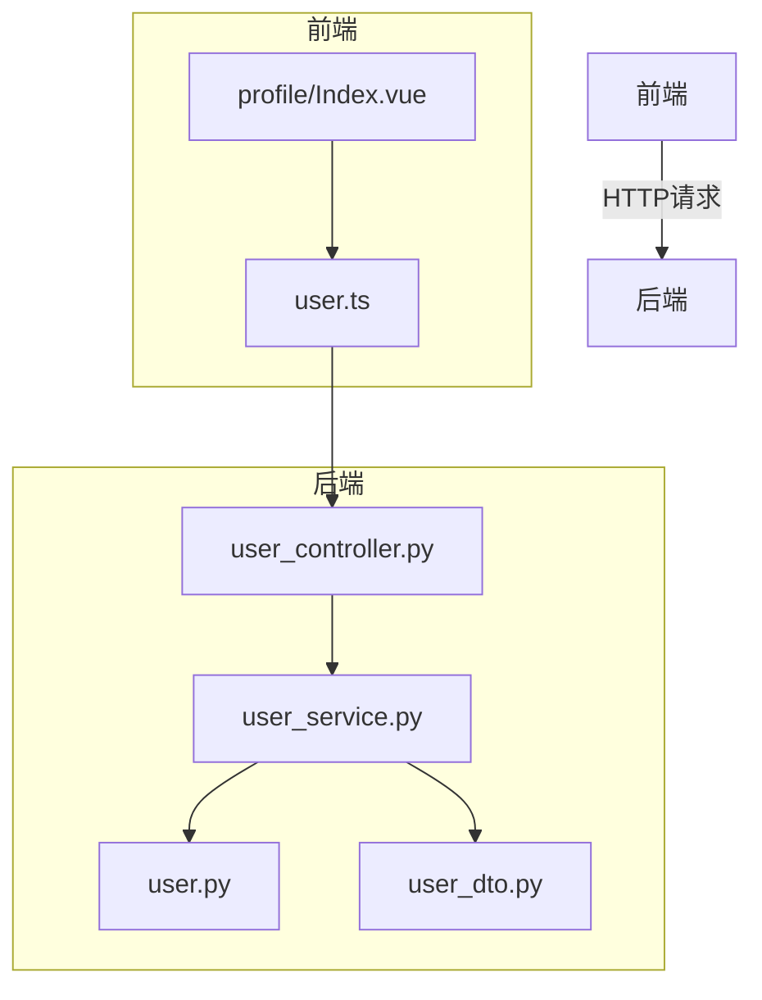
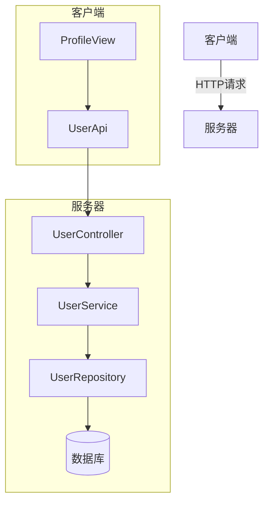
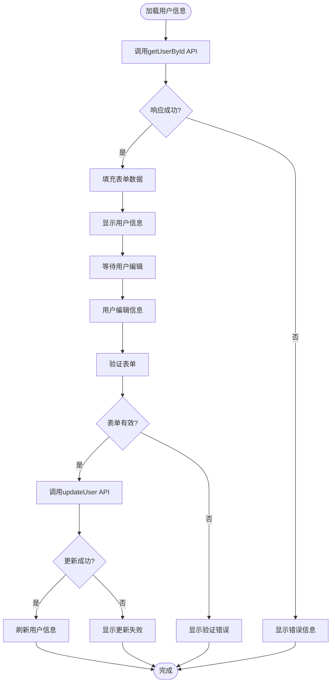
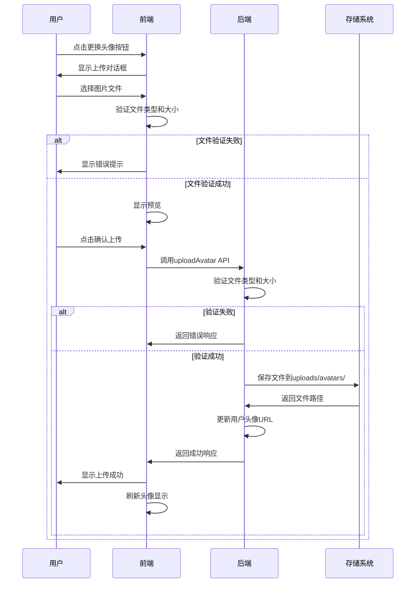
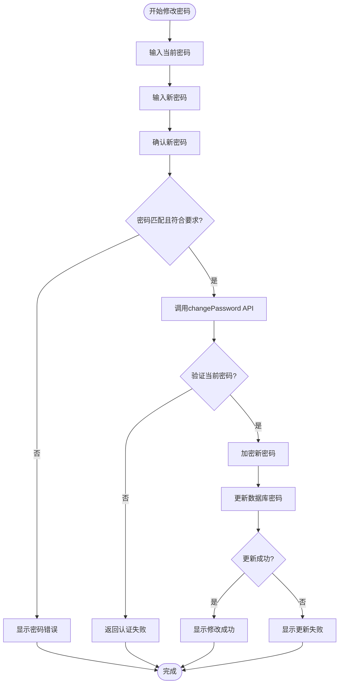
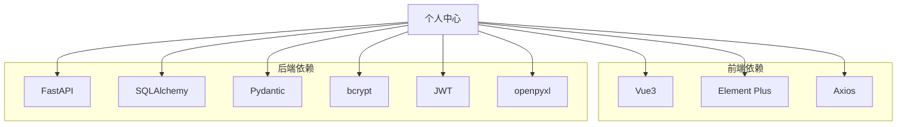

# 个人中心功能

<cite>
**本文档引用文件**  
- [user_controller.py](file://AI-agent-backend/app/controller/user_controller.py)
- [user_service.py](file://AI-agent-backend/app/service/user_service.py)
- [user.py](file://AI-agent-backend/app/entity/user.py)
- [user_dto.py](file://AI-agent-backend/app/dto/user_dto.py)
- [security.py](file://AI-agent-backend/app/core/security.py)
- [config.py](file://AI-agent-backend/app/core/config.py)
- [user.ts](file://AI-agent-frontend/src/api/modules/user.ts)
- [Index.vue](file://AI-agent-frontend/src/views/profile/Index.vue)
</cite>

## 目录
1. [简介](#简介)
2. [项目结构](#项目结构)
3. [核心组件](#核心组件)
4. [架构概览](#架构概览)
5. [详细组件分析](#详细组件分析)
6. [依赖分析](#依赖分析)
7. [性能考虑](#性能考虑)
8. [故障排除指南](#故障排除指南)
9. [结论](#结论)

## 简介
个人中心功能是AI代理测试平台中的核心用户管理模块，提供用户信息查看、编辑、头像上传和密码修改等功能。该功能通过前后端分离架构实现，前端使用Vue3和Element Plus构建用户界面，后端采用FastAPI框架提供RESTful API服务。系统支持完整的用户生命周期管理，包括信息更新、头像上传、密码安全设置等操作，确保用户能够方便地维护个人账户信息。

## 项目结构
个人中心功能涉及前后端多个模块的协同工作。前端位于`AI-agent-frontend/src/views/profile/`目录下，主要由`Index.vue`单文件组件构成，负责用户界面的展示和交互。后端逻辑分布在`AI-agent-backend/app/controller/`、`service/`、`entity/`和`dto/`等多个目录中，形成清晰的分层架构。API接口通过`user_controller.py`暴露，业务逻辑由`user_service.py`处理，数据模型定义在`user.py`实体类中，数据传输对象则在`user_dto.py`中声明。

**图表来源**  
- [Index.vue](file://AI-agent-frontend/src/views/profile/Index.vue)
- [user.ts](file://AI-agent-frontend/src/api/modules/user.ts)
- [user_controller.py](file://AI-agent-backend/app/controller/user_controller.py)
- [user_service.py](file://AI-agent-backend/app/service/user_service.py)
- [user.py](file://AI-agent-backend/app/entity/user.py)
- [user_dto.py](file://AI-agent-backend/app/dto/user_dto.py)

**章节来源**  
- [user_controller.py](file://AI-agent-backend/app/controller/user_controller.py)
- [user_service.py](file://AI-agent-backend/app/service/user_service.py)
- [user.py](file://AI-agent-backend/app/entity/user.py)
- [user_dto.py](file://AI-agent-backend/app/dto/user_dto.py)
- [Index.vue](file://AI-agent-frontend/src/views/profile/Index.vue)

## 核心组件
个人中心功能的核心组件包括用户信息管理、头像上传和密码修改三大模块。用户信息管理模块允许用户查看和编辑基本信息，如邮箱、手机号、性别和个人描述；头像上传模块提供直观的文件选择和预览功能，支持JPG、PNG格式图片，最大2MB；密码修改模块包含当前密码验证和新密码确认，确保账户安全。这些功能通过前后端紧密协作实现，前端负责用户交互和数据验证，后端处理业务逻辑和数据持久化。

**章节来源**  
- [Index.vue](file://AI-agent-frontend/src/views/profile/Index.vue)
- [user_controller.py](file://AI-agent-backend/app/controller/user_controller.py)
- [user_service.py](file://AI-agent-backend/app/service/user_service.py)

## 架构概览
个人中心功能采用典型的前后端分离架构，前端通过Vue3框架构建响应式用户界面，利用Element Plus组件库实现现代化UI设计。后端基于FastAPI框架提供RESTful API服务，遵循分层架构设计原则，包括控制器层、服务层、数据访问层和实体层。系统通过JWT进行身份认证，所有敏感操作都需要有效的访问令牌。前后端通过HTTP协议通信，数据格式采用JSON，确保跨平台兼容性和良好的可维护性。

**图表来源**  
- [user_controller.py](file://AI-agent-backend/app/controller/user_controller.py)
- [user_service.py](file://AI-agent-backend/app/service/user_service.py)
- [Index.vue](file://AI-agent-frontend/src/views/profile/Index.vue)

## 详细组件分析
个人中心功能的实现涉及多个关键组件的协同工作，从前端用户界面到后端业务逻辑，再到数据持久化层，形成完整的功能闭环。

### 用户信息管理分析
用户信息管理功能允许用户查看和编辑个人资料，包括邮箱、手机号、性别和个人描述等字段。该功能通过表单验证确保数据完整性，支持实时反馈和错误提示。

**图表来源**  
- [Index.vue](file://AI-agent-frontend/src/views/profile/Index.vue)
- [user_controller.py](file://AI-agent-backend/app/controller/user_controller.py)

### 头像上传分析
头像上传功能提供直观的文件选择和预览界面，支持拖拽上传和点击选择两种方式。系统对上传文件进行严格验证，包括文件类型和大小限制，确保系统安全和用户体验。

**图表来源**  
- [Index.vue](file://AI-agent-frontend/src/views/profile/Index.vue)
- [user_controller.py](file://AI-agent-backend/app/controller/user_controller.py)
- [user_service.py](file://AI-agent-backend/app/service/user_service.py)

### 密码修改分析
密码修改功能采用严格的安全策略，要求用户提供当前密码进行验证，并对新密码进行强度检查。系统通过加密存储确保密码安全，防止未经授权的访问。

**图表来源**  
- [Index.vue](file://AI-agent-frontend/src/views/profile/Index.vue)
- [user_controller.py](file://AI-agent-backend/app/controller/user_controller.py)
- [security.py](file://AI-agent-backend/app/core/security.py)

**章节来源**  
- [Index.vue](file://AI-agent-frontend/src/views/profile/Index.vue)
- [user_controller.py](file://AI-agent-backend/app/controller/user_controller.py)
- [user_service.py](file://AI-agent-backend/app/service/user_service.py)
- [security.py](file://AI-agent-backend/app/core/security.py)

## 依赖分析
个人中心功能依赖于多个核心模块和外部库，形成复杂的依赖关系网络。前端依赖Vue3框架和Element Plus组件库，通过Axios进行HTTP通信；后端依赖FastAPI框架、SQLAlchemy ORM和Pydantic数据验证库。系统还使用JWT进行身份认证，bcrypt进行密码加密，openpyxl处理Excel文件导入导出。这些依赖项通过清晰的接口定义和分层架构，确保系统的可维护性和扩展性。

**图表来源**  
- [user_controller.py](file://AI-agent-backend/app/controller/user_controller.py)
- [user_service.py](file://AI-agent-backend/app/service/user_service.py)
- [user.ts](file://AI-agent-frontend/src/api/modules/user.ts)
- [Index.vue](file://AI-agent-frontend/src/views/profile/Index.vue)

## 性能考虑
个人中心功能在设计时充分考虑了性能优化。前端采用响应式设计，确保在不同设备上都有良好的用户体验；后端通过数据库索引和缓存机制提高查询效率。头像上传功能限制文件大小为2MB，避免大文件传输影响系统性能。密码加密使用bcrypt算法，平衡安全性和计算开销。系统还实现了分页查询，避免一次性加载大量数据，确保在用户量增长时仍能保持良好性能。

## 故障排除指南
当个人中心功能出现问题时，可以按照以下步骤进行排查：

1. **头像上传失败**：检查文件类型是否为JPG或PNG，文件大小是否超过2MB，服务器上传目录是否有写权限。
2. **密码修改失败**：确认当前密码输入正确，新密码是否符合长度要求（至少6位），网络连接是否正常。
3. **信息更新无反应**：检查浏览器控制台是否有JavaScript错误，确认API端点是否可达，查看服务器日志获取详细错误信息。
4. **页面加载缓慢**：检查网络连接质量，确认服务器资源使用情况，查看数据库查询是否需要优化。
5. **身份认证失效**：确认访问令牌是否过期，尝试重新登录获取新的令牌对。

**章节来源**  
- [user_controller.py](file://AI-agent-backend/app/controller/user_controller.py)
- [user_service.py](file://AI-agent-backend/app/service/user_service.py)
- [Index.vue](file://AI-agent-frontend/src/views/profile/Index.vue)

## 结论
个人中心功能作为AI代理测试平台的核心用户管理模块，通过前后端分离架构实现了高效、安全的用户信息管理。系统采用现代化的技术栈，包括Vue3、FastAPI和JWT，确保了良好的用户体验和系统性能。功能设计充分考虑了用户需求和安全要求，提供了完整的个人信息管理解决方案。通过清晰的分层架构和模块化设计，系统具有良好的可维护性和扩展性，为未来的功能迭代奠定了坚实基础。