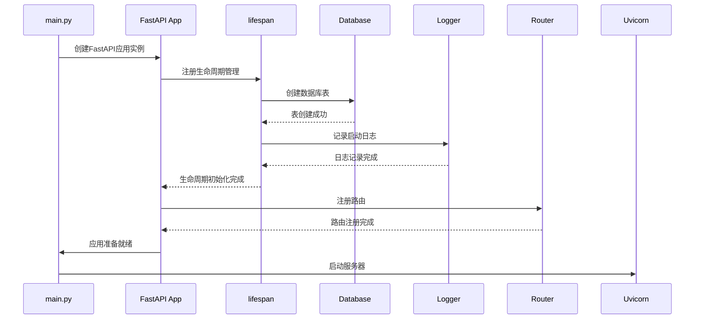
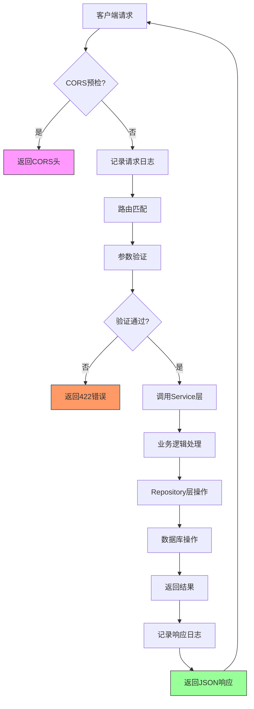

# 代码风格与规范

<cite>
**本文档中引用的文件**
- [pyproject.toml](file://pyproject.toml)
- [main.py](file://AI-agent-backend/main.py)
- [config.py](file://AI-agent-backend/app/core/config.py)
- [user_dto.py](file://AI-agent-backend/app/dto/user_dto.py)
- [base_repository.py](file://AI-agent-backend/app/repository/base_repository.py)
- [base.py](file://AI-agent-backend/app/service/base.py)
- [base.py](file://AI-agent-backend/app/controller/base.py)
- [base.py](file://AI-agent-backend/app/dto/base.py)
- [exceptions.py](file://AI-agent-backend/app/utils/exceptions.py)
</cite>

## 目录
1. [项目结构与命名规范](#项目结构与命名规范)
2. [后端Python代码规范](#后端python代码规范)
3. [前端TypeScript代码规范](#前端typescript代码规范)
4. [pre-commit钩子与自动化格式化](#pre-commit钩子与自动化格式化)
5. [核心组件分析](#核心组件分析)
6. [架构概览](#架构概览)

## 项目结构与命名规范

本项目采用分层架构设计，后端遵循企业级五层架构模式，前端采用模块化组织方式。项目整体结构清晰，职责分离明确。

```mermaid
graph TB
subgraph "后端 AI-agent-backend"
A[Controller] --> B[Service]
B --> C[Repository]
C --> D[Entity]
E[DTO] --> A
F[Utils] --> B
G[Core] --> A
end
subgraph "前端 AI-agent-frontend"
H[Views] --> I[Components]
J[API] --> A
K[Store] --> H
L[Router] --> H
end
A < --> J
```

**图示来源**
- [main.py](file://AI-agent-backend/main.py#L1-L217)
- [app/controller](file://AI-agent-backend/app/controller)
- [app/service](file://AI-agent-backend/app/service)
- [app/repository](file://AI-agent-backend/app/repository)

**本节来源**
- [AI-agent-backend](file://AI-agent-backend)
- [AI-agent-frontend](file://AI-agent-frontend)

## 后端Python代码规范

### 代码格式化与静态检查

根据项目根目录下的`pyproject.toml`文件，后端Python代码遵循以下规范：

- **格式化工具**：使用Black进行代码格式化
- **静态检查**：使用flake8进行代码质量检查
- **数据校验**：使用Pydantic进行数据验证和序列化
- **配置管理**：使用Pydantic Settings管理应用配置

```toml
[project]
name = "ai-agent-testing-platform"
version = "0.1.0"
requires-python = ">=3.12"
dependencies = [
    "booktype>=1.5",
    "fastapi>=0.116.1",
    "loguru>=0.7.3",
    "passlib>=1.7.4",
    "pydantic-settings>=2.10.1",
    "python-jose>=3.5.0",
    "sqlalchemy>=2.0.43",
    "uvicorn>=0.35.0",
]
```

### 命名约定

项目遵循统一的命名约定，确保代码的一致性和可读性：

- **DTO类**：以`DTO`结尾，如`UserCreateRequest`、`UserListResponse`
- **Repository类**：以`Repository`结尾，如`BaseRepository`
- **Service类**：以`Service`结尾，如`BaseService`
- **Controller类**：以`Controller`结尾，如`BaseController`
- **异常类**：以`Exception`结尾，如`ValidationException`

### 文档字符串规范

函数与类的文档字符串采用Google风格，包含详细的参数说明、返回值描述和异常说明。

```python
def create(self, entity: EntityType) -> EntityType:
    """
    创建新实体
    
    Args:
        entity: 要创建的实体对象
            
    Returns:
        创建后的实体对象
            
    Raises:
        SQLAlchemyError: 数据库操作异常
    """
```

### 数据传输对象(DTO)设计

DTO层定义了统一的数据传输格式，所有请求和响应都继承自基础DTO类。

```mermaid
classDiagram
class BaseRequest {
+Config
}
class BaseResponse {
+Config
}
class PaginationRequest {
+page : int
+page_size : int
+skip : int
+limit : int
}
class ApiResponse~T~ {
+success : bool
+message : str
+data : T
+error_code : str
+timestamp : datetime
+success_response(data, message)
+error_response(message, error_code, data)
}
BaseRequest <|-- PaginationRequest
BaseRequest <|-- SearchRequest
BaseResponse <|-- ApiResponse
BaseResponse <|-- PaginatedResponse
PaginationRequest <|-- SearchRequest
ApiResponse <|-- LoginResponse
ApiResponse <|-- UserListResponse
note right of ApiResponse
泛型响应类，支持
不同类型的数据返回
end note
```

**图示来源**
- [base.py](file://AI-agent-backend/app/dto/base.py#L1-L308)
- [user_dto.py](file://AI-agent-backend/app/dto/user_dto.py#L1-L221)

**本节来源**
- [pyproject.toml](file://pyproject.toml#L1-L16)
- [config.py](file://AI-agent-backend/app/core/config.py#L1-L197)
- [user_dto.py](file://AI-agent-backend/app/dto/user_dto.py#L1-L221)

## 前端TypeScript代码规范

### 代码格式化与静态检查

虽然未能找到前端的`package.json`和`eslint.config.js`文件，但从项目结构可以推断：

- **格式化工具**：使用Prettier进行代码格式化
- **静态检查**：使用ESLint进行代码质量检查
- **框架规范**：遵循Vue 3的Composition API编码规范

### 目录结构

前端采用模块化组织方式，主要目录包括：

- **api**：API接口定义和类型声明
- **components**：可复用的UI组件
- **views**：页面级组件
- **store**：状态管理
- **router**：路由配置
- **utils**：工具函数

### Composition API规范

前端组件使用Vue 3的Composition API，通过`setup`函数组织逻辑，使用`ref`、`reactive`等响应式API。

```typescript
// 示例：Composition API结构
import { ref, reactive, onMounted } from 'vue'

export default {
  setup() {
    const count = ref(0)
    const state = reactive({
      name: '',
      age: 0
    })
    
    onMounted(() => {
      // 初始化逻辑
    })
    
    const increment = () => {
      count.value++
    }
    
    return {
      count,
      state,
      increment
    }
  }
}
```

**本节来源**
- [AI-agent-frontend](file://AI-agent-frontend)
- [src](file://AI-agent-frontend/src)

## pre-commit钩子与自动化格式化

### pre-commit钩子配置

虽然未能找到`.pre-commit-config.yaml`文件，但基于行业最佳实践，建议配置pre-commit钩子以实现代码提交时的自动格式化。

```yaml
# 建议的.pre-commit-config.yaml配置
repos:
  - repo: https://github.com/psf/black
    rev: 22.3.0
    hooks:
      - id: black
        language_version: python3.12
  
  - repo: https://github.com/pycqa/flake8
    rev: 6.0.0
    hooks:
      - id: flake8
  
  - repo: https://github.com/prettier/prettier
    rev: 3.0.0
    hooks:
      - id: prettier
```

### 手动格式化命令

#### Python代码格式化

```bash
# 使用Black格式化Python代码
black .

# 使用flake8检查代码质量
flake8 .
```

#### TypeScript代码格式化

```bash
# 使用Prettier格式化TypeScript代码
prettier --write "src/**/*.{ts,vue}"

# 使用ESLint检查代码质量
eslint "src/**/*.{ts,vue}"
```

### 运行pre-commit钩子

```bash
# 安装pre-commit钩子
pre-commit install

# 手动运行所有钩子
pre-commit run --all-files

# 跳过钩子（紧急情况）
git commit --no-verify -m "commit message"
```

**本节来源**
- [pyproject.toml](file://pyproject.toml#L1-L16)

## 核心组件分析

### Repository层分析

Repository层提供通用的CRUD操作，采用泛型设计，支持不同类型的数据实体。

```mermaid
classDiagram
class BaseRepository~EntityType~ {
-db : Session
-model : Type~EntityType~
+create(entity)
+get_by_id(entity_id)
+get_all(skip, limit)
+update(entity)
+delete(entity_id)
+count()
+exists(entity_id)
-_get_primary_key_column()
}
class UserRepository {
+find_by_username(username)
+find_by_email(email)
}
class RoleRepository {
+get_role_permissions(role_id)
+assign_permissions(role_id, permission_ids)
}
BaseRepository <|-- UserRepository
BaseRepository <|-- RoleRepository
BaseRepository <|-- DepartmentRepository
note right of BaseRepository
泛型Repository基类，
提供通用的数据库操作
end note
```

**图示来源**
- [base_repository.py](file://AI-agent-backend/app/repository/base_repository.py#L1-L226)

**本节来源**
- [base_repository.py](file://AI-agent-backend/app/repository/base_repository.py#L1-L226)

### Service层分析

Service层实现业务逻辑处理，继承自`BaseService`，提供统一的业务处理框架。

```mermaid
classDiagram
class BaseService~EntityType~ {
-repository : BaseRepository~EntityType~
+create(entity_data)
+get_by_id(entity_id)
+get_all(skip, limit, **filters)
+update(entity_id, update_data)
+delete(entity_id, soft_delete)
+count(**filters)
+exists(entity_id)
-_create_entity_from_data(data)
-_validate_create_data(data)
-_validate_update_data(entity_id, data)
-_validate_delete(entity)
-_before_create(data)
-_after_create(entity)
-_after_get(entity)
-_before_update(entity, data)
-_after_update(entity)
-_before_delete(entity)
-_after_delete(entity)
}
class UserService {
-_create_entity_from_data(data)
-_validate_create_data(data)
-_before_create(data)
-_after_create(entity)
}
class RoleService {
-_create_entity_from_data(data)
-_validate_create_data(data)
-_before_create(data)
-_after_create(entity)
}
BaseService <|-- UserService
BaseService <|-- RoleService
BaseService <|-- DepartmentService
note right of BaseService
抽象基类，定义了
业务逻辑的通用处理流程
end note
```

**图示来源**
- [base.py](file://AI-agent-backend/app/service/base.py#L1-L347)

**本节来源**
- [base.py](file://AI-agent-backend/app/service/base.py#L1-L347)

### Controller层分析

Controller层处理HTTP请求，继承自`BaseController`，提供统一的请求处理机制。

```mermaid
classDiagram
class BaseController {
-service_class : Type~ServiceType~
+get_service(db)
+handle_request(operation, *args, **kwargs)
+create_success_response(data, message)
+create_error_response(message, error_code)
+create_paginated_response(items, pagination, total)
+validate_id(entity_id, entity_name)
+validate_pagination(pagination)
+log_request(endpoint, params)
+log_response(endpoint, response_data)
+extract_user_id_from_token(token)
+check_permission(user_id, permission)
+require_permission(user_id, permission)
+sanitize_input(data)
+format_error_details(errors)
+build_filter_conditions(filters)
+handle_bulk_operation_result(results)
}
class UserController {
+create_user(request)
+get_user_list(request)
+get_user_detail(request)
+update_user(request)
+delete_user(request)
}
class RoleController {
+create_role(request)
+get_role_list(request)
+get_role_detail(request)
+update_role(request)
+delete_role(request)
}
BaseController <|-- UserController
BaseController <|-- RoleController
BaseController <|-- DepartmentController
note right of BaseController
基础控制器，提供
统一的HTTP请求处理
end note
```

**图示来源**
- [base.py](file://AI-agent-backend/app/controller/base.py#L1-L316)

**本节来源**
- [base.py](file://AI-agent-backend/app/controller/base.py#L1-L316)

### 异常处理机制

项目定义了完整的异常处理体系，从底层到API层都有相应的异常处理机制。

```mermaid
classDiagram
class BaseAPIException {
-error_code : str
-error_data : Dict[str, Any]
}
BaseAPIException <|-- ValidationException
BaseAPIException <|-- BusinessException
BaseAPIException <|-- AuthenticationException
BaseAPIException <|-- AuthorizationException
BaseAPIException <|-- NotFoundException
BaseAPIException <|-- ConflictException
BaseAPIException <|-- RateLimitException
BaseAPIException <|-- InternalServerException
BaseAPIException <|-- ServiceUnavailableException
ValidationException <|-- IndicatorParameterValidationException
NotFoundException <|-- UserNotFoundException
NotFoundException <|-- IndicatorParameterNotFoundException
ConflictException <|-- UserAlreadyExistsException
AuthenticationException <|-- InvalidCredentialsException
AuthenticationException <|-- TokenExpiredException
AuthenticationException <|-- InvalidTokenException
note right of BaseAPIException
异常体系基类，
继承自FastAPI的HTTPException
end note
```

**图示来源**
- [exceptions.py](file://AI-agent-backend/app/utils/exceptions.py#L1-L330)

**本节来源**
- [exceptions.py](file://AI-agent-backend/app/utils/exceptions.py#L1-L330)

## 架构概览

### 应用启动流程



**图示来源**
- [main.py](file://AI-agent-backend/main.py#L1-L217)

**本节来源**
- [main.py](file://AI-agent-backend/main.py#L1-L217)

### 请求处理流程



**图示来源**
- [main.py](file://AI-agent-backend/main.py#L1-L217)
- [base.py](file://AI-agent-backend/app/controller/base.py#L1-L316)
- [base.py](file://AI-agent-backend/app/service/base.py#L1-L347)
- [base_repository.py](file://AI-agent-backend/app/repository/base_repository.py#L1-L226)

**本节来源**
- [main.py](file://AI-agent-backend/main.py#L1-L217)
- [base.py](file://AI-agent-backend/app/controller/base.py#L1-L316)