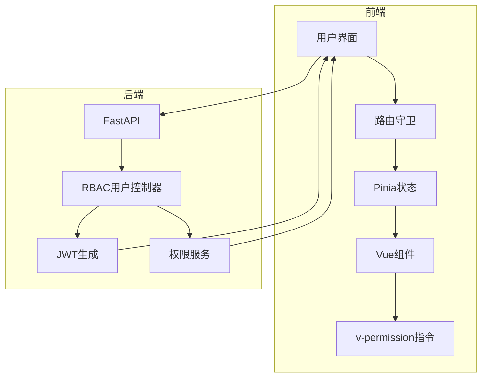
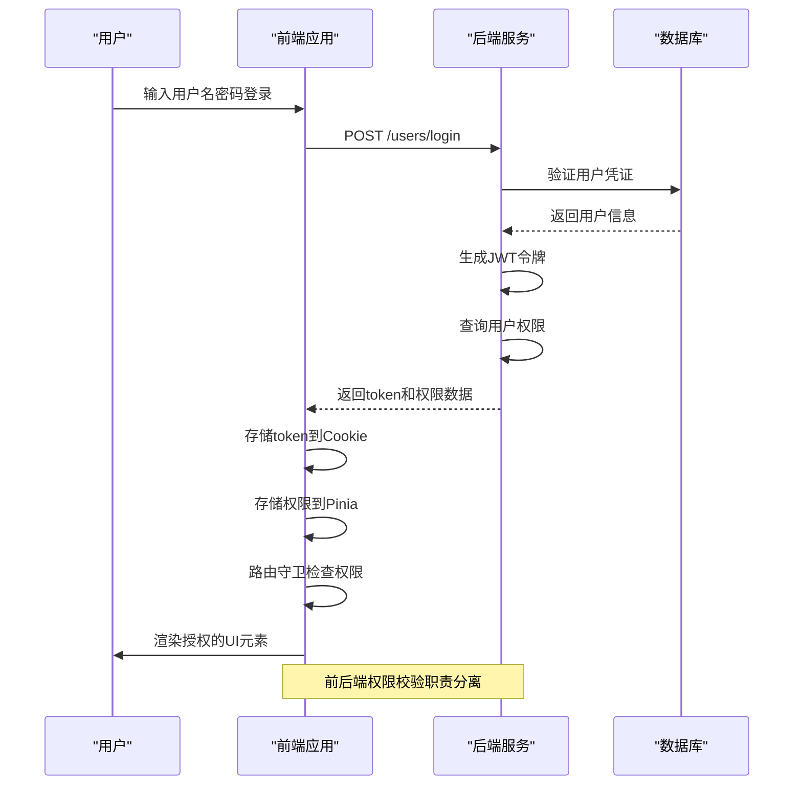
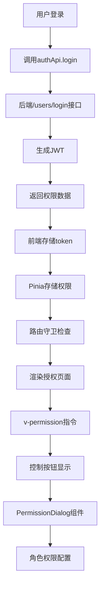

# 前后端权限集成

<cite>
**本文档引用的文件**  
- [rbac_user_controller.py](file://AI-agent-backend/app/controller/rbac_user_controller.py#L153-L200)
- [security.py](file://AI-agent-backend/app/core/security.py#L50-L100)
- [login.ts](file://AI-agent-frontend/src/api/login/login.ts#L0-L16)
- [auth.ts](file://AI-agent-frontend/src/api/modules/auth.ts#L15-L30)
- [types.ts](file://AI-agent-frontend/src/api/types.ts#L200-L220)
- [auth.ts](file://AI-agent-frontend/src/utils/auth.ts#L0-L15)
- [user.ts](file://AI-agent-frontend/src/store/user.ts#L85-L132)
- [index.ts](file://AI-agent-frontend/src/router/index.ts#L140-L203)
- [permission.ts](file://AI-agent-frontend/src/directives/permission.ts#L143-L206)
- [main.ts](file://AI-agent-frontend/src/main.ts#L15-L21)
- [AppSidebar.vue](file://AI-agent-frontend/src/components/Layout/AppSidebar.vue#L50-L100)
- [Index.vue](file://AI-agent-frontend/src/views/system/user/Index.vue#L200-L250)
- [PermissionDialog.vue](file://AI-agent-frontend/src/components/Permission/PermissionDialog.vue#L1-L578) - *新增于最近提交*
</cite>

## 更新摘要
**变更内容**  
- 更新了用户管理界面中的权限指令使用方式，支持权限数组
- 新增了权限配置对话框组件的文档说明
- 更新了相关代码示例以反映最新实现
- 增加了对新权限功能的描述

## 目录
1. [引言](#引言)
2. [项目结构](#项目结构)
3. [核心组件](#核心组件)
4. [架构概览](#架构概览)
5. [详细组件分析](#详细组件分析)
6. [依赖分析](#依赖分析)
7. [性能考虑](#性能考虑)
8. [故障排除指南](#故障排除指南)
9. [结论](#结论)

## 引言
本文档全面阐述了前端如何与后端RBAC系统协同工作，重点说明用户登录后，前端如何解析JWT并存储权限数据到Pinia状态管理中；描述`permission.ts`工具函数如何根据用户权限动态控制路由访问（路由守卫）和菜单渲染；详细说明`v-permission`指令的实现原理及其在按钮级权限控制中的应用方式。同时指出前后端权限校验的职责边界，强调前端校验仅用于体验优化，后端校验才是安全关键。

## 项目结构
本项目采用前后端分离架构，包含两个主要模块：`AI-agent-backend`（后端服务）和`AI-agent-frontend`（前端应用）。后端基于FastAPI构建，实现RBAC权限控制；前端基于Vue 3 + TypeScript + Vite构建，使用Pinia进行状态管理。



**图示来源**  
- [rbac_user_controller.py](file://AI-agent-backend/app/controller/rbac_user_controller.py#L153-L200)
- [index.ts](file://AI-agent-frontend/src/router/index.ts#L140-L203)

**本节来源**  
- [rbac_user_controller.py](file://AI-agent-backend/app/controller/rbac_user_controller.py#L1-L50)
- [index.ts](file://AI-agent-frontend/src/router/index.ts#L1-L50)

## 核心组件
系统的核心权限组件包括：
- **后端**：`rbac_user_controller.py`中的登录接口、`security.py`中的JWT处理
- **前端**：`user.ts`中的Pinia用户状态、`router/index.ts`中的路由守卫、`directives/permission.ts`中的权限指令

这些组件共同实现了完整的权限控制流程：用户登录 → JWT生成 → 权限解析 → 状态存储 → 路由控制 → UI渲染。

**本节来源**  
- [rbac_user_controller.py](file://AI-agent-backend/app/controller/rbac_user_controller.py#L153-L200)
- [user.ts](file://AI-agent-frontend/src/store/user.ts#L85-L132)
- [permission.ts](file://AI-agent-frontend/src/directives/permission.ts#L143-L206)

## 架构概览
系统权限架构遵循标准的JWT认证流程，结合RBAC模型实现细粒度权限控制。



**图示来源**  
- [rbac_user_controller.py](file://AI-agent-backend/app/controller/rbac_user_controller.py#L153-L200)
- [auth.ts](file://AI-agent-frontend/src/utils/auth.ts#L0-L15)
- [user.ts](file://AI-agent-frontend/src/store/user.ts#L85-L132)

## 详细组件分析

### 用户登录与JWT生成
后端在用户成功认证后生成JWT令牌，并返回用户信息和权限列表。

```python
# rbac_user_controller.py
@router.post("/login", response_model=ApiResponse[LoginResponse], summary="用户登录")
async def login(
    request: LoginRequest,
    db: Session = Depends(get_db)
):
    # ... 认证逻辑
    access_token = create_access_token(data={"sub": str(user.USER_ID)})
    permissions = user_service.get_user_permissions(user.USER_ID)
    
    login_response = LoginResponse(
        access_token=access_token,
        token_type="bearer",
        user_info=user_info,
        permissions=permissions
    )
    return ApiResponse.success_response(data=login_response, message="登录成功")
```

**图示来源**  
- [rbac_user_controller.py](file://AI-agent-backend/app/controller/rbac_user_controller.py#L153-L200)

**本节来源**  
- [rbac_user_controller.py](file://AI-agent-backend/app/controller/rbac_user_controller.py#L153-L200)
- [security.py](file://AI-agent-backend/app/core/security.py#L50-L100)

### JWT解析与权限存储
前端在登录成功后解析JWT并存储权限数据到Pinia状态管理中。

```typescript
// user.ts
async login(loginParams: LoginRequest): Promise<boolean> {
  try {
    const response = await authApi.login(loginParams)
    
    if (response.success && response.data) {
      const { access_token, user_info, permissions } = response.data
      
      this.setToken(access_token)
      this.setUserInfo(user_info)
      this.setPermissions(permissions)
      
      return true
    }
    return false
  } catch (error) {
    console.error('登录失败:', error)
    return false
  } finally {
    this.loading = false
  }
}
```

**图示来源**  
- [user.ts](file://AI-agent-frontend/src/store/user.ts#L85-L132)
- [types.ts](file://AI-agent-frontend/src/api/types.ts#L200-L220)

**本节来源**  
- [user.ts](file://AI-agent-frontend/src/store/user.ts#L85-L132)
- [auth.ts](file://AI-agent-frontend/src/api/modules/auth.ts#L15-L30)

### 路由守卫实现
前端通过路由守卫实现页面级权限控制。

```typescript
// router/index.ts
router.beforeEach(async (to, from, next) => {
  const userStore = useUserStore()
  
  // 检查是否需要认证
  if (to.meta.requiresAuth !== false) {
    if (!userStore.isLoggedIn) {
      ElMessage.warning('请先登录')
      next('/login')
      return
    }
    
    // 检查权限
    if (to.meta.permission && !userStore.hasPermission(to.meta.permission as string)) {
      ElMessage.error('权限不足')
      next('/403')
      return
    }
  }
  
  next()
})
```

**图示来源**  
- [index.ts](file://AI-agent-frontend/src/router/index.ts#L140-L203)

**本节来源**  
- [index.ts](file://AI-agent-frontend/src/router/index.ts#L140-L203)

### 权限指令实现
前端实现`v-permission`指令用于按钮级权限控制。

```typescript
// permission.ts
const permissionDirective = {
  mounted(el: PermissionElement, binding: DirectiveBinding) {
    const { value, arg, modifiers } = binding
    const mode = arg === 'every' ? 'every' : 'some'
    
    if (!value) {
      console.warn('v-permission directive requires a value')
      return
    }

    const hasPermission = checkPermission(value, mode)
    
    if (!hasPermission) {
      if (modifiers.hidden) {
        if (!el._originalVisibility) {
          el._originalVisibility = el.style.visibility || ''
        }
        el.style.visibility = 'hidden'
      } else {
        hideElement(el)
      }
    } else {
      showElement(el)
      if (el._originalVisibility !== undefined) {
        el.style.visibility = el._originalVisibility
      }
    }
  },
  // ... updated方法
}

export function setupPermissionDirectives(app: App) {
  app.directive('permission', permissionDirective)
  app.directive('role', roleDirective)
}
```

**图示来源**  
- [permission.ts](file://AI-agent-frontend/src/directives/permission.ts#L143-L206)

**本节来源**  
- [permission.ts](file://AI-agent-frontend/src/directives/permission.ts#L143-L206)
- [main.ts](file://AI-agent-frontend/src/main.ts#L15-L21)

### 权限指令在UI中的应用
在Vue组件中使用`v-permission`指令控制UI元素的显示。

```vue
<!-- Index.vue -->
<template>
  <div class="action-bar">
    <el-button
      type="primary"
      :icon="Plus"
      v-permission="['user:create']"
      @click="handleAdd"
    >
      新增用户
    </el-button>
    <el-button
      type="danger"
      :icon="Delete"
      :disabled="!selectedUsers.length"
      v-permission="['user:batch:delete']"
      @click="handleBatchDelete"
    >
      批量删除
    </el-button>
  </div>
</template>
```

**图示来源**  
- [Index.vue](file://AI-agent-frontend/src/views/system/user/Index.vue#L200-L250)

**本节来源**  
- [Index.vue](file://AI-agent-frontend/src/views/system/user/Index.vue#L200-L250)
- [AppSidebar.vue](file://AI-agent-frontend/src/components/Layout/AppSidebar.vue#L50-L100)

### 权限配置对话框
系统新增了独立的权限配置对话框组件，用于角色权限的可视化配置。

```vue
<!-- PermissionDialog.vue -->
<template>
  <el-dialog
    v-model="visible"
    title="权限配置"
    width="70%"
    :close-on-click-modal="false"
    :destroy-on-close="true"
    @close="handleClose"
  >
    <div class="permission-dialog" v-loading="loading">
      <!-- 角色信息 -->
      <div class="role-info">
        <el-tag type="primary" size="large">
          <el-icon><UserFilled /></el-icon>
          <span>{{ roleInfo?.role_name || '未知角色' }}</span>
        </el-tag>
        <span class="role-desc">{{ roleInfo?.remark || '暂无描述' }}</span>
      </div>

      <!-- 权限配置标签页 -->
      <el-tabs v-model="activeTab" class="permission-tabs">
        <el-tab-pane label="菜单权限" name="menu">
          <div class="menu-permission-container">
            <!-- 操作工具栏 -->
            <div class="toolbar">
              <div class="left-actions">
                <el-checkbox
                  v-model="menuCheckAll"
                  :indeterminate="menuIndeterminate"
                  @change="handleMenuCheckAll"
                  :disabled="loading || treeLoading"
                >
                  全选/反选
                </el-checkbox>
                <el-divider direction="vertical" />
                <el-button
                  type="primary"
                  size="small"
                  :icon="Expand"
                  @click="expandAllMenus"
                  :disabled="loading || treeLoading"
                >
                  展开全部
                </el-button>
                <el-button
                  size="small"
                  :icon="Fold"
                  @click="collapseAllMenus"
                  :disabled="loading || treeLoading"
                >
                  折叠全部
                </el-button>
              </div>
              <div class="right-info">
                <el-text type="info" size="small">
                  已选择 {{ checkedCount }} / {{ totalCount }} 项权限
                </el-text>
              </div>
            </div>

            <!-- 菜单权限树 -->
            <div class="menu-tree-wrapper">
              <el-tree
                ref="menuTreeRef"
                :data="menuTreeData"
                :props="treeProps"
                show-checkbox
                node-key="menu_id"
                :default-expand-all="false"
                :check-strictly="false"
                :expand-on-click-node="false"
                @check="handleMenuCheck"
                class="permission-tree"
                v-loading="treeLoading"
                element-loading-text="加载菜单数据中..."
                empty-text="暂无菜单数据"
              >
                <template #default="{ node, data }">
                  <div class="tree-node">
                    <el-icon v-if="data.icon" class="node-icon">
                      <component :is="data.icon" />
                    </el-icon>
                    <span class="node-label">{{ data.menu_name }}</span>
                    <el-tag
                      v-if="data.menu_type === '1'"
                      size="small"
                      type="warning"
                      class="node-tag"
                    >
                      按钮
                    </el-tag>
                    <el-tag
                      v-else-if="data.menu_type === '0'"
                      size="small"
                      type="success"
                      class="node-tag"
                    >
                      菜单
                    </el-tag>
                  </div>
                </template>
              </el-tree>
            </div>
          </div>
        </el-tab-pane>
      </el-tabs>
    </div>

    <!-- 对话框底部操作按钮 -->
    <template #footer>
      <div class="dialog-footer">
        <el-button @click="handleClose" :disabled="saving">
          取 消
        </el-button>
        <el-button
          type="primary"
          @click="handleSave"
          :loading="saving"
          :disabled="loading || treeLoading"
        >
          保 存
        </el-button>
      </div>
    </template>
  </el-dialog>
</template>
```

**图示来源**  
- [PermissionDialog.vue](file://AI-agent-frontend/src/components/Permission/PermissionDialog.vue#L1-L578)

**本节来源**  
- [PermissionDialog.vue](file://AI-agent-frontend/src/components/Permission/PermissionDialog.vue#L1-L578)
- [role_controller.py](file://AI-agent-backend/app/controller/role_controller.py#L150-L200)

## 依赖分析
系统权限相关组件的依赖关系如下：



**图示来源**  
- [auth.ts](file://AI-agent-frontend/src/api/modules/auth.ts#L15-L30)
- [user.ts](file://AI-agent-frontend/src/store/user.ts#L85-L132)
- [index.ts](file://AI-agent-frontend/src/router/index.ts#L140-L203)

**本节来源**  
- [auth.ts](file://AI-agent-frontend/src/api/modules/auth.ts#L1-L50)
- [user.ts](file://AI-agent-frontend/src/store/user.ts#L1-L150)

## 性能考虑
- **JWT验证**：后端使用`jose`库进行JWT验证，性能高效
- **权限缓存**：用户权限在登录时一次性获取，减少后续请求
- **前端检查**：权限检查使用简单数组操作，性能开销小
- **路由守卫**：异步守卫可能影响路由跳转速度，建议优化
- **权限树渲染**：大型权限树采用懒加载和虚拟滚动优化性能

## 故障排除指南
常见权限问题及解决方案：

1. **登录后无法访问页面**
   - 检查JWT是否正确存储
   - 确认权限数据是否成功加载到Pinia
   - 检查路由meta中的permission配置

2. **权限指令不生效**
   - 确认`setupPermissionDirectives`已在main.ts中调用
   - 检查指令语法是否正确：`v-permission="['permission:action']"`
   - 确认用户确实没有对应权限

3. **JWT过期问题**
   - 检查`ACCESS_TOKEN_EXPIRE_MINUTES`配置
   - 实现刷新令牌机制
   - 前端添加token过期监听

4. **权限配置对话框无法加载数据**
   - 检查菜单API接口是否正常
   - 确认角色信息是否正确传递
   - 查看网络请求是否有错误

**本节来源**  
- [security.py](file://AI-agent-backend/app/core/security.py#L50-L100)
- [user.ts](file://AI-agent-frontend/src/store/user.ts#L85-L132)
- [index.ts](file://AI-agent-frontend/src/router/index.ts#L140-L203)
- [PermissionDialog.vue](file://AI-agent-frontend/src/components/Permission/PermissionDialog.vue#L1-L578)

## 结论
本系统实现了完整的前后端权限集成方案：
- 后端通过JWT和RBAC模型提供安全的权限校验
- 前端通过Pinia状态管理和路由守卫实现用户体验优化
- `v-permission`指令提供了细粒度的按钮级权限控制
- 新增的`PermissionDialog`组件实现了权限的可视化配置
- 前后端职责清晰：后端负责安全校验，前端负责体验优化

关键安全原则：**前端权限校验仅为用户体验优化，所有关键操作必须在后端进行权限验证**。