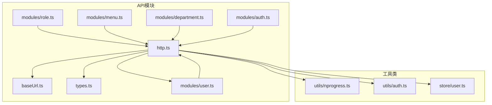
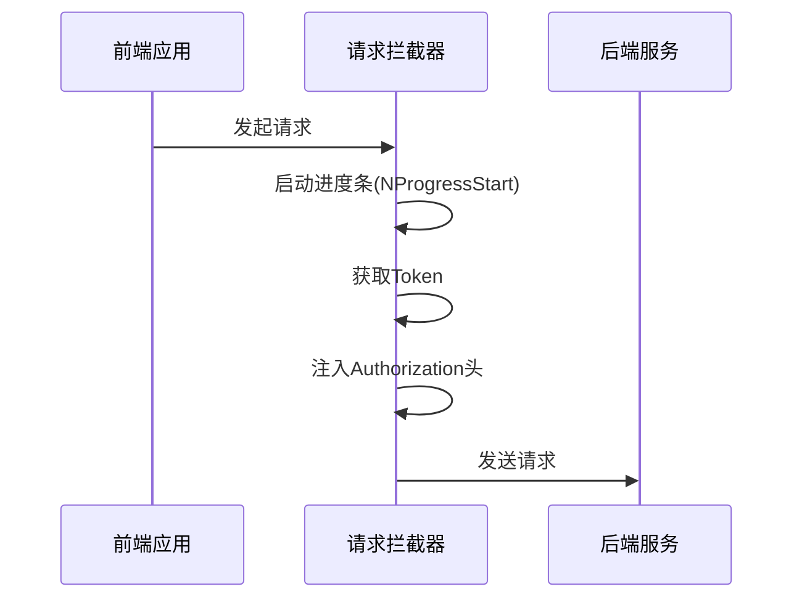
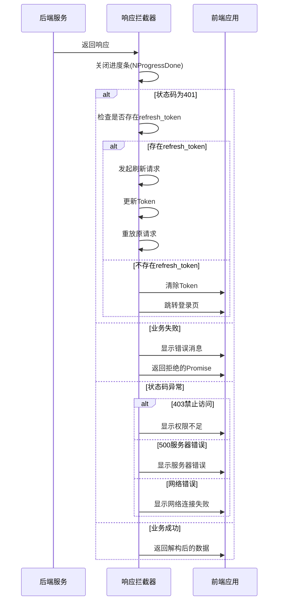
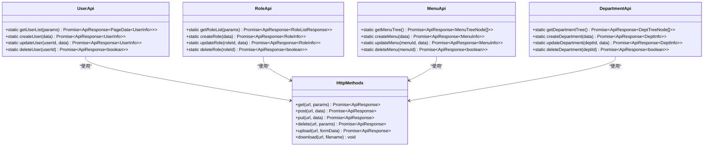
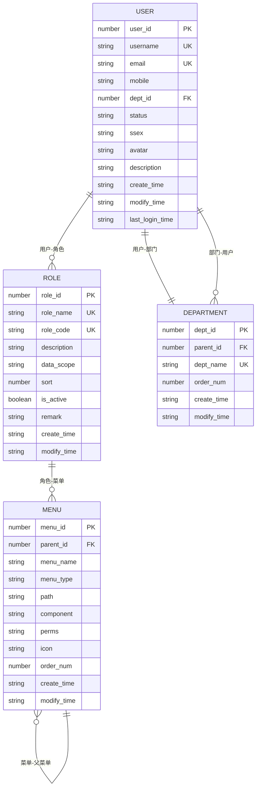
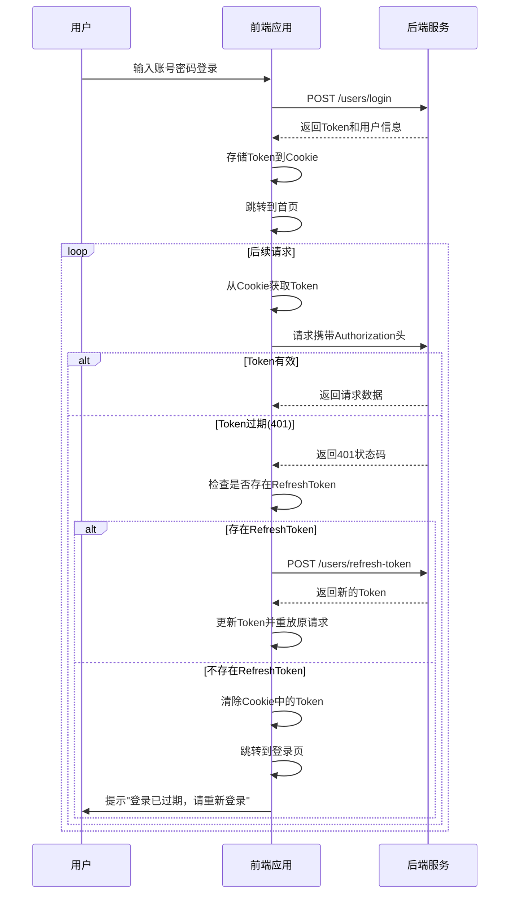

# API集成与请求管理

<cite>
**本文档引用文件**  
- [http.ts](file://AI-agent-frontend/src/api/http.ts) - *已更新：实现JWT无感刷新与请求去重*
- [baseUrl.ts](file://AI-agent-frontend/src/api/baseUrl.ts)
- [types.ts](file://AI-agent-frontend/src/api/types.ts)
- [user.ts](file://AI-agent-frontend/src/api/modules/user.ts)
- [role.ts](file://AI-agent-frontend/src/api/modules/role.ts)
- [menu.ts](file://AI-agent-frontend/src/api/modules/menu.ts)
- [department.ts](file://AI-agent-frontend/src/api/modules/department.ts)
- [auth.ts](file://AI-agent-frontend/src/api/modules/auth.ts)
- [nprogress.ts](file://AI-agent-frontend/src/utils/nprogress.ts)
- [auth.ts](file://AI-agent-frontend/src/utils/auth.ts)
- [user.ts](file://AI-agent-frontend/src/store/user.ts) - *新增：支持refresh_token管理*
- [network.ts](file://AI-agent-frontend/src/config/network.ts) - *新增：网络配置中心*
</cite>

## 更新摘要
**变更内容**  
- 新增JWT无感刷新机制说明
- 新增请求去重与短期缓存功能说明
- 新增自动重试机制说明
- 更新响应拦截器处理逻辑
- 新增网络配置中心说明
- 更新错误处理与调试章节
- 更新核心请求封装机制章节

## 目录
1. [项目结构分析](#项目结构分析)
2. [核心请求封装机制](#核心请求封装机制)
3. [模块化API组织方式](#模块化api组织方式)
4. [类型安全与数据结构](#类型安全与数据结构)
5. [典型操作调用示例](#典型操作调用示例)
6. [特殊场景处理](#特殊场景处理)
7. [错误处理与调试](#错误处理与调试)

## 项目结构分析

前端API相关代码位于`AI-agent-frontend/src/api`目录下，采用模块化设计。主要包含以下部分：
- `http.ts`：基于Axios的HTTP请求封装核心文件，新增JWT无感刷新、请求去重功能
- `baseUrl.ts`：API基础URL配置文件
- `types.ts`：全局类型定义文件
- `modules/`：业务模块API定义目录，包含用户、角色、菜单、部门等模块
- `config/network.ts`：网络请求配置中心，统一管理超时、重试、去重等参数



**图示来源**
- [http.ts](file://AI-agent-frontend/src/api/http.ts)
- [baseUrl.ts](file://AI-agent-frontend/src/api/baseUrl.ts)
- [types.ts](file://AI-agent-frontend/src/api/types.ts)
- [network.ts](file://AI-agent-frontend/src/config/network.ts)

**本节来源**
- [http.ts](file://AI-agent-frontend/src/api/http.ts)
- [baseUrl.ts](file://AI-agent-frontend/src/api/baseUrl.ts)
- [network.ts](file://AI-agent-frontend/src/config/network.ts)

## 核心请求封装机制

### Axios实例配置

`http.ts`文件中创建了Axios实例，配置了基础请求参数：

```typescript
const http = axios.create({
  baseURL: BASE_URL,
  timeout: NETWORK_CONFIG.DEFAULT_TIMEOUT, // 使用配置中心的超时时间
  headers: {
    'Content-Type': 'application/json'
  }
})
```

- **baseURL**：通过`baseUrl.ts`文件配置，支持不同环境的API地址
- **超时设置**：默认30秒超时，通过`network.ts`配置中心统一管理
- **默认请求头**：设置`Content-Type`为`application/json`

### 请求拦截器

请求拦截器负责在请求发送前添加认证信息和显示加载状态：



**图示来源**
- [http.ts](file://AI-agent-frontend/src/api/http.ts#L130-L150)
- [nprogress.ts](file://AI-agent-frontend/src/utils/nprogress.ts)
- [auth.ts](file://AI-agent-frontend/src/utils/auth.ts)

**本节来源**
- [http.ts](file://AI-agent-frontend/src/api/http.ts#L130-L150)

### 响应拦截器

响应拦截器处理服务器响应，统一进行错误处理和状态管理，并新增了JWT无感刷新机制：



**图示来源**
- [http.ts](file://AI-agent-frontend/src/api/http.ts#L152-L240)

**本节来源**
- [http.ts](file://AI-agent-frontend/src/api/http.ts#L152-L240)

### JWT无感刷新机制

当收到401未授权响应时，系统会自动尝试使用refresh_token刷新访问令牌，实现用户无感知的会话续期：

```typescript
// 刷新token状态，避免并发风暴
let isRefreshing = false
let refreshPromise: Promise<any> | null = null
const requestQueue: Array<(token: string | null) => void> = []

// 响应拦截器中处理401状态
if (status === 401) {
  const originalRequest = config
  
  // 如果已经在刷新中，挂起当前请求
  if (isRefreshing && refreshPromise) {
    return new Promise((resolve, reject) => {
      subscribeTokenRefresh((newToken) => {
        if (!newToken) {
          reject(error)
          return
        }
        originalRequest.headers.Authorization = `Bearer ${newToken}`
        resolve(http(originalRequest))
      })
    })
  }
  
  // 发起刷新请求
  isRefreshing = true
  const currentRefreshToken = getRefreshToken()
  
  refreshPromise = (async () => {
    try {
      const res = await http.post('/users/refresh-token', { refresh_token: currentRefreshToken })
      if ((res as any)?.success && (res as any)?.data?.access_token) {
        const newAccessToken = (res as any).data.access_token as string
        const newRefreshToken = (res as any).data.refresh_token as string | undefined
        setToken(newAccessToken)
        if (newRefreshToken) {
          setRefreshToken(newRefreshToken)
        }
        return newAccessToken
      }
      throw new Error('刷新令牌失败')
    } catch (e) {
      removeToken()
      removeRefreshToken()
      router.push('/login')
      throw e
    } finally {
      isRefreshing = false
      refreshPromise = null
    }
  })()
  
  try {
    const token = await refreshPromise
    originalRequest.headers.Authorization = `Bearer ${token}`
    return http(originalRequest)
  } catch (e) {
    return Promise.reject(e)
  }
}
```

**本节来源**
- [http.ts](file://AI-agent-frontend/src/api/http.ts#L164-L202)
- [user.ts](file://AI-agent-frontend/src/store/user.ts#L242-L267)
- [user_controller.py](file://AI-agent-backend/app/controller/user_controller.py#L181-L214)

### 请求去重与短期缓存

为防止重复请求和提升用户体验，系统实现了请求去重与短期缓存机制：

```typescript
// 请求去重/缓存容器
const inFlightMap = new Map<string, Promise<any>>()
const cacheMap = new Map<string, { expire: number; data: any }>()

// 包装方法以支持请求去重与短缓存
function wrap<T>(method: 'get'|'post'|'put'|'delete', url: string, payload?: any, config?: any): Promise<T> {
  const ttl = getDedupeTTL(url)
  const key = buildKey(method, url, method === 'get' ? config?.params : payload)
  const now = Date.now()
  
  // 检查缓存
  if (ttl > 0) {
    const cached = cacheMap.get(key)
    if (cached && cached.expire > now) {
      return Promise.resolve(cached.data)
    }
    
    // 检查进行中的请求
    const inflight = inFlightMap.get(key)
    if (inflight) return inflight as any
  }
  
  // 发起新请求
  const p = (http as any)[method](url, payload, config)
  if (ttl > 0) inFlightMap.set(key, p)
  
  return p.then((res: any) => {
    if (ttl > 0) {
      cacheMap.set(key, { expire: Date.now() + ttl, data: res })
      inFlightMap.delete(key)
    }
    return res
  }).catch((err: any) => {
    if (ttl > 0) inFlightMap.delete(key)
    throw err
  })
}
```

**本节来源**
- [http.ts](file://AI-agent-frontend/src/api/http.ts#L38-L81)
- [network.ts](file://AI-agent-frontend/src/config/network.ts#L40-L50)

### 自动重试机制

系统实现了智能重试机制，针对网络错误和超时自动重试：

```typescript
// 判断是否应该重试
export function shouldRetry(error: any, retryCount: number): boolean {
  if (retryCount >= NETWORK_CONFIG.MAX_RETRIES) {
    return false
  }

  const { code, response } = error

  // 网络错误或超时错误重试
  if (code === 'ECONNABORTED' || code === 'NETWORK_ERROR' || !response) {
    return NETWORK_CONFIG.RETRY_CONDITIONS.NETWORK_ERROR || NETWORK_CONFIG.RETRY_CONDITIONS.TIMEOUT
  }

  // 服务器错误不重试
  if (response && response.status >= 500) {
    return NETWORK_CONFIG.RETRY_CONDITIONS.SERVER_ERROR
  }

  return false
}

// 响应拦截器中处理重试
if (shouldRetry(error, retryCount)) {
  ;(config as any).__retryCount = retryCount + 1
  await new Promise(resolve => setTimeout(resolve, getRetryDelay(retryCount)))
  return http(config)
}
```

**本节来源**
- [http.ts](file://AI-agent-frontend/src/api/http.ts#L240-L260)
- [network.ts](file://AI-agent-frontend/src/config/network.ts#L75-L93)

## 模块化API组织方式

API采用模块化组织，每个业务模块独立定义，通过类静态方法提供接口。

### 用户模块

```typescript
export class UserApi {
  static async getUserList(params?: PageQuery): Promise<ApiResponse<PageData<UserInfo>>> {
    return http.get<PageData<UserInfo>>('/users', params)
  }
  
  static async createUser(data: UserCreateRequest): Promise<ApiResponse<UserInfo>> {
    return http.post<UserInfo>('/users', data)
  }
}
```

### 角色模块

```typescript
export class RoleApi {
  static async getRoleList(params?: PageQuery): Promise<ApiResponse<RoleListResponse>> {
    return http.get<RoleListResponse>('/roles', params)
  }
  
  static async createRole(data: RoleCreateRequest): Promise<ApiResponse<RoleInfo>> {
    return http.post<RoleInfo>('/roles', data)
  }
}
```

### 菜单模块

```typescript
export class MenuApi {
  static async getMenuTree(): Promise<ApiResponse<MenuTreeNode[]>> {
    return http.get<MenuTreeNode[]>('/menus/tree')
  }
  
  static async createMenu(data: MenuCreateRequest): Promise<ApiResponse<MenuInfo>> {
    return http.post<MenuInfo>('/menus', data)
  }
}
```

### 部门模块

```typescript
export class DepartmentApi {
  static async getDepartmentTree(): Promise<ApiResponse<DeptTreeNode[]>> {
    return http.get<DeptTreeNode[]>('/departments/tree')
  }
  
  static async createDepartment(data: DeptCreateRequest): Promise<ApiResponse<DeptInfo>> {
    return http.post<DeptInfo>('/departments', data)
  }
}
```



**图示来源**
- [user.ts](file://AI-agent-frontend/src/api/modules/user.ts)
- [role.ts](file://AI-agent-frontend/src/api/modules/role.ts)
- [menu.ts](file://AI-agent-frontend/src/api/modules/menu.ts)
- [department.ts](file://AI-agent-frontend/src/api/modules/department.ts)
- [http.ts](file://AI-agent-frontend/src/api/http.ts)

**本节来源**
- [user.ts](file://AI-agent-frontend/src/api/modules/user.ts)
- [role.ts](file://AI-agent-frontend/src/api/modules/role.ts)
- [menu.ts](file://AI-agent-frontend/src/api/modules/menu.ts)
- [department.ts](file://AI-agent-frontend/src/api/modules/department.ts)

## 类型安全与数据结构

### 响应格式定义

前后端约定统一的响应格式，确保类型安全：

```typescript
interface ApiResponse<T = any> {
  success: boolean
  data?: T
  message: string
  error_code?: string
  timestamp: string
}
```

### 分页数据结构

```typescript
interface PageQuery {
  page?: number
  size?: number
  keyword?: string
}

interface PageData<T> {
  items: T[]
  total: number
  page: number
  size: number
  pages: number
}
```

### 业务数据类型

#### 用户信息
```typescript
interface UserInfo {
  user_id: number
  username: string
  email?: string
  mobile?: string
  dept_id?: number
  dept_name?: string
  status: '0' | '1' // 0:启用 1:禁用
  ssex?: '0' | '1' | '2' // 0:男 1:女 2:保密
  avatar?: string
  description?: string
  create_time: string
  modify_time?: string
  last_login_time?: string
}
```

#### 角色信息
```typescript
interface RoleInfo {
  role_id: number
  role_name: string
  role_code: string
  description?: string
  data_scope: string
  data_scope_name?: string
  sort: number
  is_active: boolean
  remark?: string
  create_time: string
  modify_time?: string
}
```

#### 菜单信息
```typescript
interface MenuInfo {
  menu_id: number
  parent_id: number
  menu_name: string
  menu_type: '0' | '1' // 0: 菜单, 1: 按钮
  path?: string
  component?: string
  perms?: string
  icon?: string
  order_num?: number
  create_time: string
  modify_time?: string
  children?: MenuInfo[]
}
```



**图示来源**
- [types.ts](file://AI-agent-frontend/src/api/types.ts)

**本节来源**
- [types.ts](file://AI-agent-frontend/src/api/types.ts)

## 典型操作调用示例

### 查询操作（GET）

```typescript
// 获取用户列表（分页）
const getUserList = async () => {
  try {
    const response = await UserApi.getUserList({
      page: 1,
      size: 10,
      keyword: 'admin'
    })
    
    if (response.success) {
      console.log('用户列表:', response.data.items)
      console.log('总记录数:', response.data.total)
    }
  } catch (error) {
    console.error('获取用户列表失败:', error)
  }
}

// 获取角色详情
const getRoleDetail = async (roleId: number) => {
  try {
    const response = await RoleApi.getRoleById(roleId)
    if (response.success) {
      console.log('角色详情:', response.data)
    }
  } catch (error) {
    console.error('获取角色详情失败:', error)
  }
}
```

### 创建操作（POST）

```typescript
// 创建新用户
const createUser = async () => {
  const userData: UserCreateRequest = {
    username: 'newuser',
    password: 'password123',
    email: 'newuser@example.com',
    dept_id: 1
  }
  
  try {
    const response = await UserApi.createUser(userData)
    if (response.success) {
      console.log('用户创建成功:', response.data)
      ElMessage.success('用户创建成功')
    }
  } catch (error) {
    console.error('用户创建失败:', error)
  }
}

// 创建新角色
const createRole = async () => {
  const roleData: RoleCreateRequest = {
    role_name: '新角色',
    remark: '这是一个新角色'
  }
  
  try {
    const response = await RoleApi.createRole(roleData)
    if (response.success) {
      console.log('角色创建成功:', response.data)
      ElMessage.success('角色创建成功')
    }
  } catch (error) {
    console.error('角色创建失败:', error)
  }
}
```

### 更新操作（PUT）

```typescript
// 更新用户信息
const updateUser = async (userId: number) => {
  const updateData: UserUpdateRequest = {
    email: 'updated@example.com',
    mobile: '13800138000',
    ssex: '1'
  }
  
  try {
    const response = await UserApi.updateUser(userId, updateData)
    if (response.success) {
      console.log('用户更新成功:', response.data)
      ElMessage.success('用户信息更新成功')
    }
  } catch (error) {
    console.error('用户更新失败:', error)
  }
}

// 更新菜单信息
const updateMenu = async (menuId: number) => {
  const updateData: MenuUpdateRequest = {
    menu_name: '更新后的菜单名',
    path: '/updated/path',
    icon: 'updated-icon'
  }
  
  try {
    const response = await MenuApi.updateMenu(menuId, updateData)
    if (response.success) {
      console.log('菜单更新成功:', response.data)
      ElMessage.success('菜单更新成功')
    }
  } catch (error) {
    console.error('菜单更新失败:', error)
  }
}
```

### 删除操作（DELETE）

```typescript
// 删除单个用户
const deleteUser = async (userId: number) => {
  try {
    const response = await UserApi.deleteUser(userId)
    if (response.success) {
      console.log('用户删除成功')
      ElMessage.success('用户删除成功')
    }
  } catch (error) {
    console.error('用户删除失败:', error)
  }
}

// 批量删除角色
const batchDeleteRoles = async (roleIds: number[]) => {
  try {
    const response = await RoleApi.batchDeleteRoles(roleIds)
    if (response.success) {
      console.log('角色批量删除成功')
      ElMessage.success('角色批量删除成功')
    }
  } catch (error) {
    console.error('角色批量删除失败:', error)
  }
}
```

**本节来源**
- [user.ts](file://AI-agent-frontend/src/api/modules/user.ts)
- [role.ts](file://AI-agent-frontend/src/api/modules/role.ts)
- [menu.ts](file://AI-agent-frontend/src/api/modules/menu.ts)

## 特殊场景处理

### 分页处理

```typescript
// 分页查询用户
const queryUsersWithPagination = async (currentPage: number = 1, pageSize: number = 10) => {
  try {
    const params: PageQuery = {
      page: currentPage,
      size: pageSize,
      keyword: searchKeyword.value
    }
    
    const response = await UserApi.getUserList(params)
    
    if (response.success) {
      userList.value = response.data.items
      total.value = response.data.total
      currentPage.value = response.data.page
      pageSize.value = response.data.size
    }
  } catch (error) {
    console.error('分页查询失败:', error)
  }
}
```

### 文件上传

```typescript
// 文件上传方法
const uploadFile = async (file: File) => {
  const formData = new FormData()
  formData.append('file', file)
  
  try {
    const response = await http.upload('/upload', formData)
    if (response.success) {
      console.log('文件上传成功:', response.data)
      return response.data
    }
  } catch (error) {
    console.error('文件上传失败:', error)
    throw error
  }
}

// 导入用户数据
const importUsers = async (file: File) => {
  try {
    const response = await UserApi.importUsers(file)
    if (response.success) {
      console.log('用户数据导入成功')
      ElMessage.success('用户数据导入成功')
    }
  } catch (error) {
    console.error('用户数据导入失败:', error)
  }
}
```

### 文件下载

```typescript
// 下载文件
const downloadFile = (url: string, filename?: string) => {
  http.download(url, filename)
}

// 导出用户数据
const exportUsers = async () => {
  try {
    // 先获取导出文件的URL
    const response = await http.get('/users/export-url')
    if (response.success) {
      const exportUrl = response.data.url
      // 使用下载方法
      http.download(exportUrl, '用户数据导出.xlsx')
    }
  } catch (error) {
    console.error('导出失败:', error)
  }
}
```

### 树形结构处理

```typescript
// 获取部门树
const getDepartmentTree = async () => {
  try {
    const response = await DepartmentApi.getDepartmentTree()
    if (response.success) {
      departmentTree.value = response.data
      console.log('部门树:', response.data)
    }
  } catch (error) {
    console.error('获取部门树失败:', error)
  }
}

// 获取菜单树
const getMenuTree = async () => {
  try {
    const response = await MenuApi.getMenuTree()
    if (response.success) {
      menuTree.value = response.data
      console.log('菜单树:', response.data)
    }
  } catch (error) {
    console.error('获取菜单树失败:', error)
  }
}
```

**本节来源**
- [http.ts](file://AI-agent-frontend/src/api/http.ts#L260-L300)
- [user.ts](file://AI-agent-frontend/src/api/modules/user.ts#L150-L170)
- [department.ts](file://AI-agent-frontend/src/api/modules/department.ts#L60-L70)
- [menu.ts](file://AI-agent-frontend/src/api/modules/menu.ts#L60-L70)

## 错误处理与调试

### 常见网络错误

| 错误类型 | 状态码 | 处理方式 |
|--------|-------|--------|
| 未授权 | 401 | 尝试使用refresh_token刷新，失败则清除Token并跳转登录页 |
| 权限不足 | 403 | 显示"权限不足"提示 |
| 服务器错误 | 500 | 显示"服务器错误，请稍后重试" |
| 网络超时 | - | 显示"请求超时，请检查网络" |
| 网络中断 | - | 显示"网络连接失败" |

### 错误调试方法

```typescript
// 1. 检查网络请求
// 在浏览器开发者工具中查看Network标签页
// 检查请求URL、请求头、请求参数是否正确

// 2. 检查Token有效性
const checkToken = () => {
  const token = getToken()
  const refreshToken = getRefreshToken()
  console.log('当前Token:', token)
  console.log('当前RefreshToken:', refreshToken)
  if (!token) {
    console.log('Token不存在，请重新登录')
  }
  if (!refreshToken) {
    console.log('RefreshToken不存在，无法自动刷新')
  }
}

// 3. 检查API响应
const debugApiCall = async () => {
  try {
    const response = await UserApi.getUserList()
    console.log('API响应:', response)
    console.log('响应状态:', response.success)
    console.log('响应消息:', response.message)
    if (!response.success) {
      console.log('错误代码:', response.error_code)
    }
  } catch (error) {
    console.error('请求异常:', error)
    console.error('错误堆栈:', error.stack)
  }
}

// 4. 检查基础URL配置
const checkBaseUrl = () => {
  console.log('当前环境:', import.meta.env.VITE_ENV)
  console.log('基础URL:', BASE_URL)
}

// 5. 检查请求拦截器
// 在http.ts中添加调试日志
http.interceptors.request.use(
  (config) => {
    console.log('请求配置:', config)
    console.log('请求URL:', config.baseURL + config.url)
    console.log('请求头:', config.headers)
    NProgressStart()
    return config
  },
  (error) => {
    console.error('请求拦截器错误:', error)
    NProgressDone()
    return Promise.reject(error)
  }
)
```

### 认证流程调试



**图示来源**
- [http.ts](file://AI-agent-frontend/src/api/http.ts#L152-L240)
- [auth.ts](file://AI-agent-frontend/src/utils/auth.ts)
- [auth.ts](file://AI-agent-frontend/src/api/modules/auth.ts)
- [user_controller.py](file://AI-agent-backend/app/controller/user_controller.py#L181-L214)

**本节来源**
- [http.ts](file://AI-agent-frontend/src/api/http.ts#L152-L240)
- [auth.ts](file://AI-agent-frontend/src/utils/auth.ts)
- [auth.ts](file://AI-agent-frontend/src/api/modules/auth.ts)
- [user.ts](file://AI-agent-frontend/src/store/user.ts)