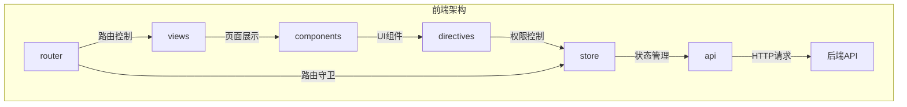
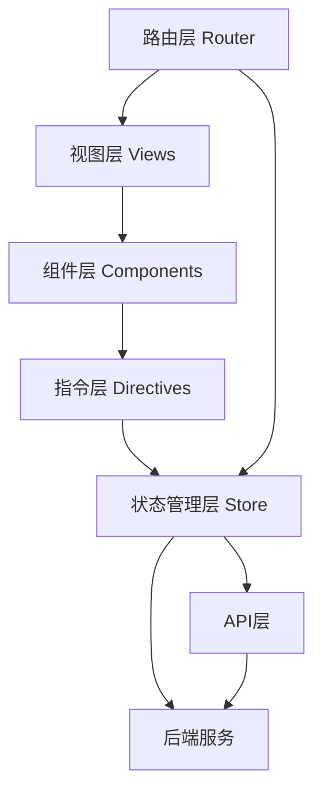
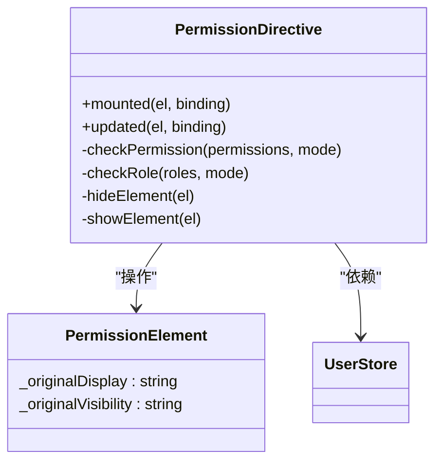
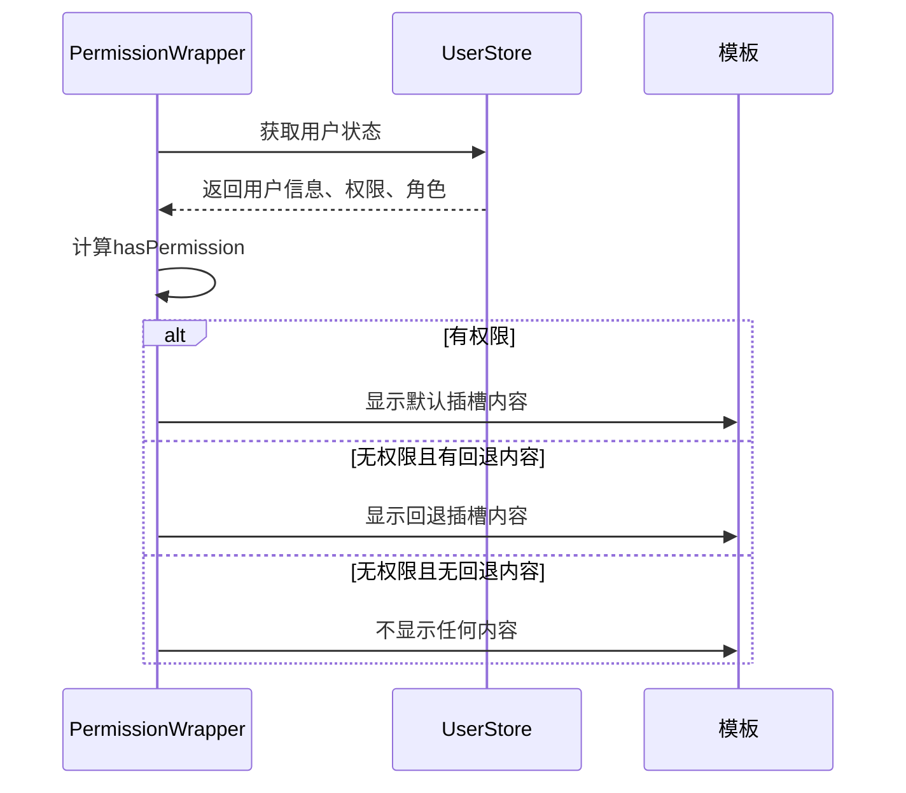
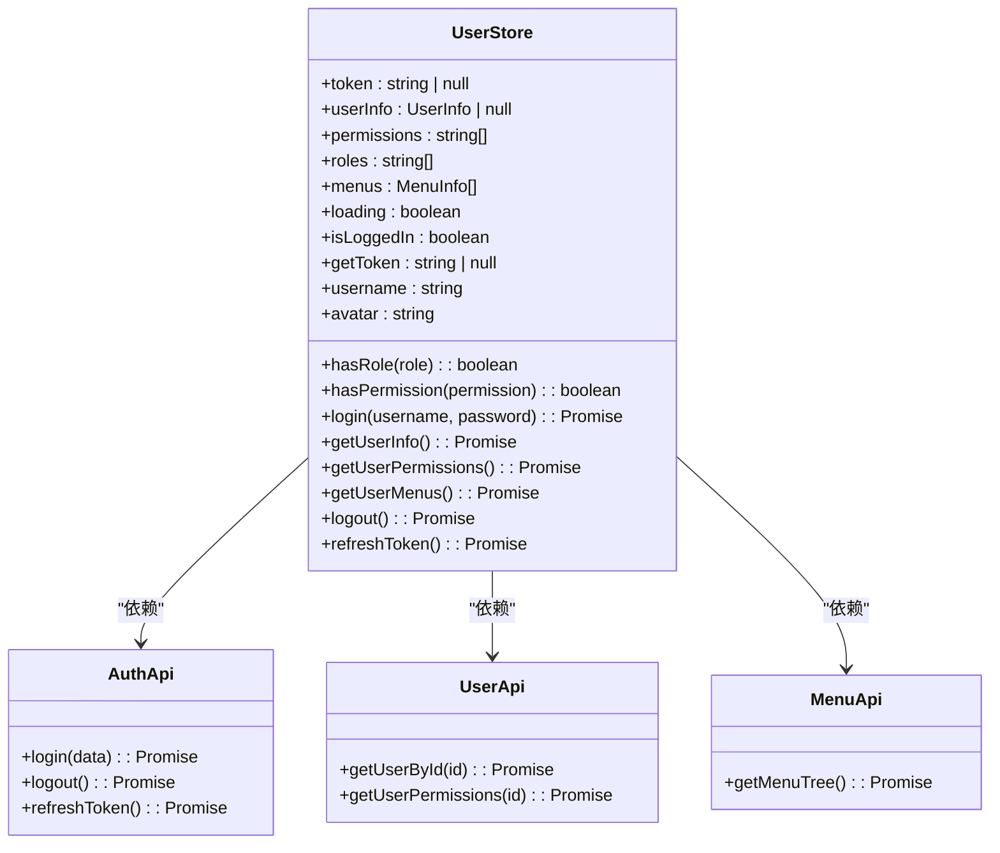
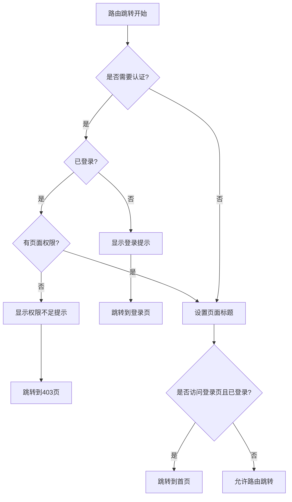
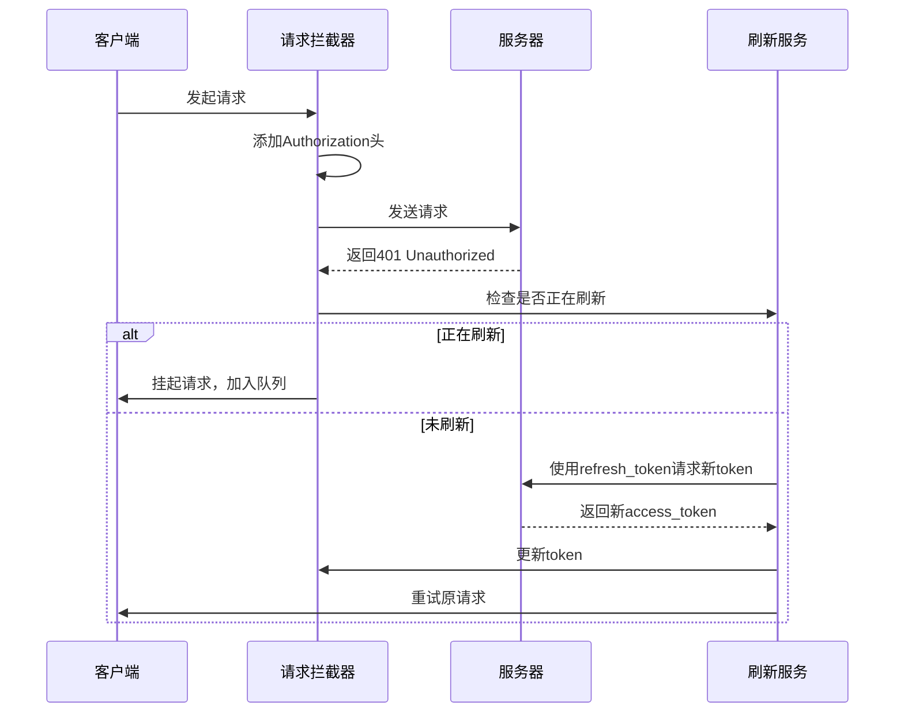
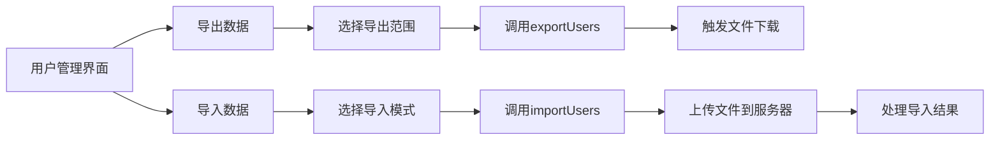
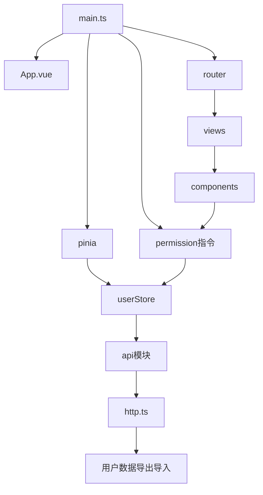

# 前端架构

<cite>
**本文档引用的文件**  
- [main.ts](file://AI-agent-frontend/src/main.ts) - *已更新*
- [permission.ts](file://AI-agent-frontend/src/directives/permission.ts) - *权限控制逻辑*
- [permission.ts](file://AI-agent-frontend/src/utils/permission.ts) - *权限辅助工具*
- [PermissionWrapper.vue](file://AI-agent-frontend/src/components/Permission/PermissionWrapper.vue) - *权限包装组件*
- [user.ts](file://AI-agent-frontend/src/store/user.ts) - *用户状态管理*
- [index.ts](file://AI-agent-frontend/src/router/index.ts) - *路由配置与守卫*
- [http.ts](file://AI-agent-frontend/src/api/http.ts) - *HTTP请求封装与无感刷新实现*
- [user.ts](file://AI-agent-frontend/src/api/modules/user.ts) - *用户模块API定义*
- [Index.vue](file://AI-agent-frontend/src/views/system/user/Index.vue) - *用户管理界面实现*
</cite>

## 更新摘要
**变更内容**  
- 新增JWT无感刷新与请求去重机制说明
- 增加用户数据导出导入功能文档
- 更新API响应格式适配说明
- 修正侧边栏菜单与路由同步问题
- 补充文件下载与上传逻辑细节

## 目录
1. [项目结构](#项目结构)
2. [核心组件](#核心组件)
3. [架构概览](#架构概览)
4. [详细组件分析](#详细组件分析)
5. [依赖分析](#依赖分析)

## 项目结构

AI代理测试平台前端采用基于Vue 3的现代化前端架构，遵循模块化、组件化的设计原则。项目结构清晰，职责分明，主要分为以下几个核心模块：

- **api**：统一管理所有HTTP请求，包含模块化API接口定义和基础请求封装
- **components**：可复用UI组件库，分为通用组件（Common）、布局组件（Layout）和权限组件（Permission）
- **directives**：自定义指令，实现权限控制等高级功能
- **router**：路由配置，管理页面导航和路由守卫
- **store**：状态管理，使用Pinia实现全局状态管理
- **utils**：工具函数库，包含权限处理、认证等通用工具
- **views**：页面视图，按功能模块组织

这种结构实现了关注点分离，提高了代码的可维护性和可扩展性。



**图示来源**  
- [main.ts](file://AI-agent-frontend/src/main.ts)
- [router/index.ts](file://AI-agent-frontend/src/router/index.ts)

**本节来源**  
- [main.ts](file://AI-agent-frontend/src/main.ts)

## 核心组件

前端架构的核心组件包括Vue 3组合式API、Pinia状态管理、Vue Router路由系统和自定义权限控制系统。这些组件协同工作，构建了一个现代化、可维护的前端应用。

应用入口文件`main.ts`负责初始化Vue应用，注册全局依赖，包括路由、状态管理、UI组件库和自定义指令。特别值得注意的是权限指令的注册，通过`setupPermissionDirectives(app)`将权限控制能力注入到Vue应用实例中。

```typescript
import { createApp } from 'vue'
import App from './App.vue'
import router from './router/index'
import pinia from "@/store/store"
import { setupPermissionDirectives } from '@/directives/permission'
import ElementPlus from 'element-plus'

const app = createApp(App)
app.use(router)
app.use(pinia)
app.use(ElementPlus, { locale: zhCn })
setupPermissionDirectives(app)
app.mount('#app')
```

**本节来源**  
- [main.ts](file://AI-agent-frontend/src/main.ts)

## 架构概览

整个前端架构采用分层设计模式，从上到下分为视图层、组件层、指令层、状态管理层和API层。各层之间通过清晰的接口进行通信，确保了系统的松耦合和高内聚。



**图示来源**  
- [main.ts](file://AI-agent-frontend/src/main.ts)
- [store/user.ts](file://AI-agent-frontend/src/store/user.ts)
- [router/index.ts](file://AI-agent-frontend/src/router/index.ts)

## 详细组件分析

### 权限指令分析

权限指令是前端权限控制系统的核心，通过Vue的自定义指令机制实现声明式的权限控制。`v-permission`和`v-role`指令允许开发者在模板中直接声明元素的访问权限。



**图示来源**  
- [directives/permission.ts](file://AI-agent-frontend/src/directives/permission.ts)
- [store/user.ts](file://AI-agent-frontend/src/store/user.ts)

**本节来源**  
- [directives/permission.ts](file://AI-agent-frontend/src/directives/permission.ts)

### 权限包装组件分析

`PermissionWrapper.vue`是一个基于组件的权限控制方案，提供了比指令更灵活的权限控制能力。它通过插槽机制，允许开发者自定义有权限和无权限时的显示内容。



**图示来源**  
- [components/Permission/PermissionWrapper.vue](file://AI-agent-frontend/src/components/Permission/PermissionWrapper.vue)
- [store/user.ts](file://AI-agent-frontend/src/store/user.ts)

**本节来源**  
- [components/Permission/PermissionWrapper.vue](file://AI-agent-frontend/src/components/Permission/PermissionWrapper.vue)

### 用户状态管理分析

用户状态管理使用Pinia实现，`useUserStore`是核心的状态管理模块，负责管理用户认证状态、权限、角色和菜单等关键信息。该模块通过getter提供计算属性，通过actions提供异步操作方法。



**图示来源**  
- [store/user.ts](file://AI-agent-frontend/src/store/user.ts)
- [api/modules/auth.ts](file://AI-agent-frontend/src/api/modules/auth.ts)
- [api/modules/user.ts](file://AI-agent-frontend/src/api/modules/user.ts)
- [api/modules/menu.ts](file://AI-agent-frontend/src/api/modules/menu.ts)

**本节来源**  
- [store/user.ts](file://AI-agent-frontend/src/store/user.ts)

### 路由守卫分析

路由守卫是前端权限控制的第一道防线，通过Vue Router的`beforeEach`全局前置守卫实现。它在每次路由跳转前进行权限检查，确保用户只能访问其有权限的页面。



**图示来源**  
- [router/index.ts](file://AI-agent-frontend/src/router/index.ts)
- [store/user.ts](file://AI-agent-frontend/src/store/user.ts)

**本节来源**  
- [router/index.ts](file://AI-agent-frontend/src/router/index.ts)

### HTTP请求封装与无感刷新分析

`http.ts`文件实现了统一的HTTP请求封装，包含请求拦截、响应处理、错误处理、请求去重、短期缓存和JWT无感刷新机制。该模块通过axios拦截器实现自动的token刷新，当检测到401错误时，自动使用refresh_token获取新的access_token，并重试原请求。



**图示来源**  
- [api/http.ts](file://AI-agent-frontend/src/api/http.ts)
- [store/user.ts](file://AI-agent-frontend/src/store/user.ts)

**本节来源**  
- [api/http.ts](file://AI-agent-frontend/src/api/http.ts)

### 用户管理功能分析

用户管理模块实现了完整的用户数据导出导入功能，支持Excel格式。前端通过`exportUsers`和`importUsers`方法分别处理文件下载和上传逻辑。导出功能支持选择导出选中数据或全部数据，导入功能支持新用户导入和已有用户更新两种模式。



**图示来源**  
- [views/system/user/Index.vue](file://AI-agent-frontend/src/views/system/user/Index.vue)
- [api/modules/user.ts](file://AI-agent-frontend/src/api/modules/user.ts)

**本节来源**  
- [views/system/user/Index.vue](file://AI-agent-frontend/src/views/system/user/Index.vue)

## 依赖分析

前端各组件之间存在清晰的依赖关系，形成了一个层次分明的依赖树。核心依赖关系如下：



这种依赖结构确保了应用的可维护性和可测试性。每个模块都有明确的职责和依赖，降低了模块间的耦合度。

**图示来源**  
- [main.ts](file://AI-agent-frontend/src/main.ts)
- [router/index.ts](file://AI-agent-frontend/src/router/index.ts)
- [store/index.ts](file://AI-agent-frontend/src/store/index.ts)

**本节来源**  
- [main.ts](file://AI-agent-frontend/src/main.ts)
- [router/index.ts](file://AI-agent-frontend/src/router/index.ts)
- [store/index.ts](file://AI-agent-frontend/src/store/index.ts)