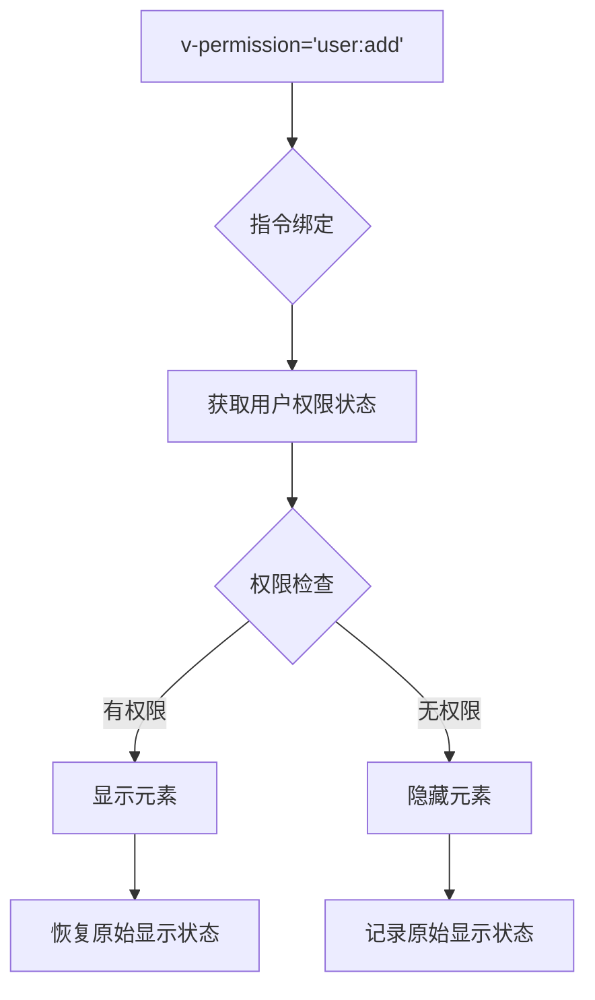
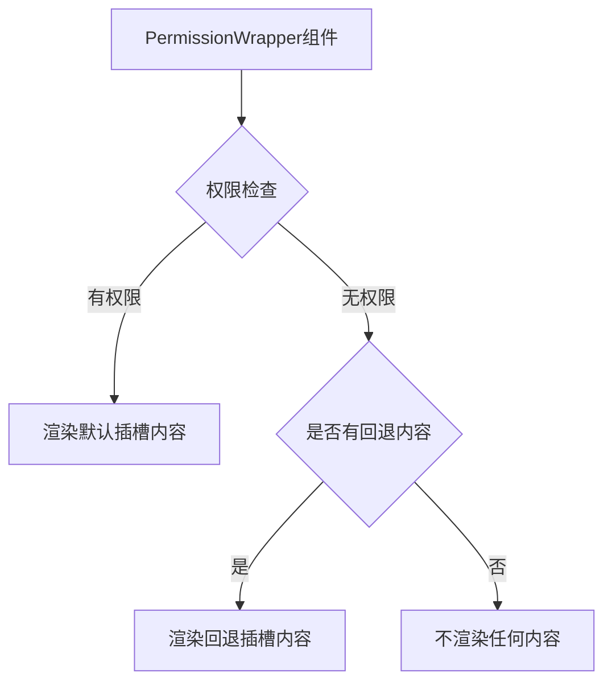
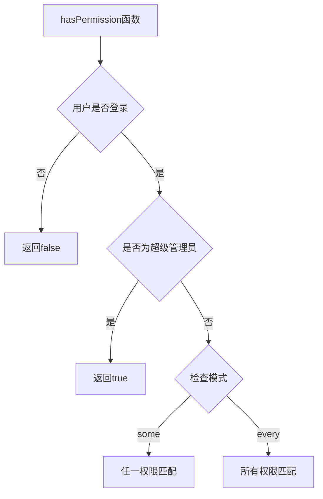
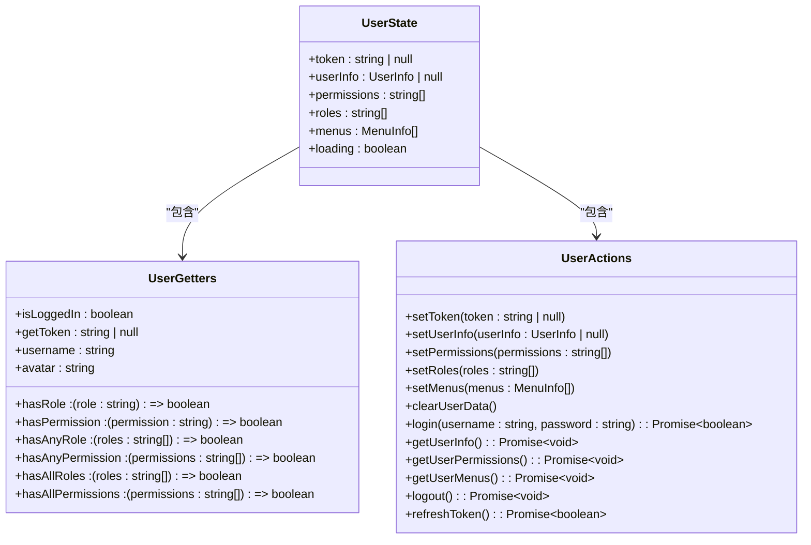
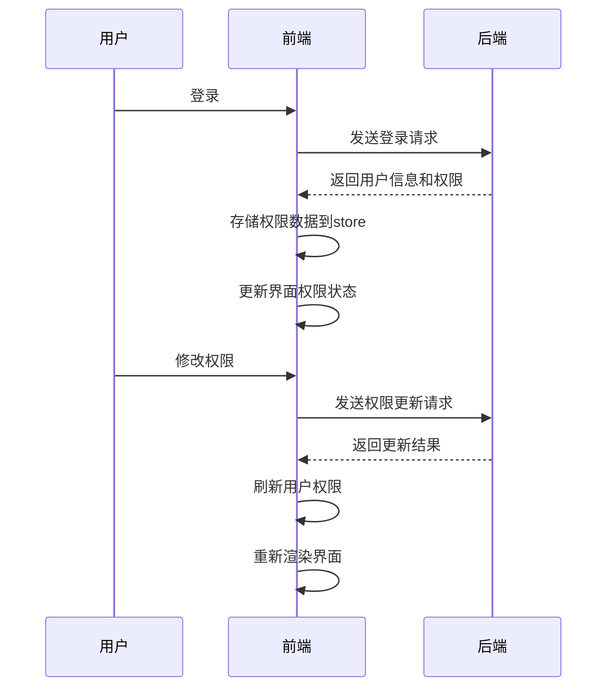

# 权限控制实现

<cite>
**本文档引用的文件**  
- [permission.ts](file://AI-agent-frontend/src/directives/permission.ts)
- [PermissionWrapper.vue](file://AI-agent-frontend/src/components/Permission/PermissionWrapper.vue)
- [user.ts](file://AI-agent-frontend/src/store/user.ts)
- [permission.ts](file://AI-agent-frontend/src/utils/permission.ts)
- [Index.vue](file://AI-agent-frontend/src/views/system/department/Index.vue)
- [Index.vue](file://AI-agent-frontend/src/views/system/menu/Index.vue)
- [Index.vue](file://AI-agent-frontend/src/views/system/role/Index.vue)
</cite>

## 目录
1. [权限控制实现](#权限控制实现)
2. [指令式权限控制](#指令式权限控制)
3. [组件级权限包装器](#组件级权限包装器)
4. [函数式权限校验工具](#函数式权限校验工具)
5. [用户权限状态管理](#用户权限状态管理)
6. [权限控制实际应用示例](#权限控制实际应用示例)
7. [权限更新与同步机制](#权限更新与同步机制)
8. [常见问题与解决方案](#常见问题与解决方案)

## 指令式权限控制

深入分析 `v-permission` 指令的实现原理与使用场景。该指令通过 Vue 的自定义指令系统实现，允许开发者在模板中直接声明元素的权限要求。



**指令使用方法：**
- `v-permission="'user:add'"` - 单个权限
- `v-permission="['user:add', 'user:edit']"` - 多个权限（任一匹配）
- `v-permission:every="['user:add', 'user:edit']"` - 多个权限（全部匹配）
- `v-role="'admin'"` - 单个角色
- `v-role="['admin', 'user']"` - 多个角色

指令通过 `mounted` 和 `updated` 钩子函数在元素挂载和更新时进行权限检查，根据检查结果决定元素的显示或隐藏。隐藏方式支持两种模式：
- 默认使用 `display: none`（不占位）
- 使用 `hidden` 修饰符时，使用 `visibility: hidden`（占位）

**Section sources**
- [permission.ts](file://AI-agent-frontend/src/directives/permission.ts#L0-L206)

## 组件级权限包装器

分析 `PermissionWrapper` 组件的条件渲染策略。该组件提供了一种声明式的权限控制方式，通过插槽机制实现内容的有条件渲染。



组件支持以下属性：
- **permission**: 权限标识或权限数组
- **role**: 角色标识或角色数组
- **mode**: 权限检查模式（'some' 任一匹配 | 'every' 全部匹配）
- **fallback**: 回退内容

当同时指定权限和角色时，需要同时满足权限和角色要求；当只指定权限或角色时，满足其一即可。

```vue
<template>
  <div v-if="hasPermission" class="permission-wrapper">
    <slot />
  </div>
  <div v-else-if="fallback" class="permission-fallback">
    <slot name="fallback">
      {{ fallback }}
    </slot>
  </div>
</template>
```

**Section sources**
- [PermissionWrapper.vue](file://AI-agent-frontend/src/components/Permission/PermissionWrapper.vue#L0-L89)

## 函数式权限校验工具

分析 `permission.ts` 工具文件中的权限校验逻辑判断机制。该文件提供了一系列函数式 API，用于在 JavaScript/TypeScript 代码中进行权限检查。



提供的主要函数包括：
- `hasPermission`: 检查是否有指定权限
- `hasRole`: 检查是否有指定角色
- `hasAnyPermission`: 检查是否有任一权限
- `hasAllPermissions`: 检查是否有所有权限
- `hasAnyRole`: 检查是否有任一角色
- `hasAllRoles`: 检查是否有所有角色
- `isSuperAdmin`: 检查是否是超级管理员

这些函数在非模板场景下非常有用，例如在路由守卫、API 调用前的权限检查等。

**Section sources**
- [permission.ts](file://AI-agent-frontend/src/utils/permission.ts#L0-L102)

## 用户权限状态管理

说明如何从用户 store 中获取权限标识并与菜单、按钮的权限字段进行匹配。权限数据存储在 Pinia store 中，通过 `useUserStore` 进行管理。



用户登录后，系统会调用后端 API 获取用户的权限、角色和菜单信息，并存储在 store 中。store 提供了 `hasPermission` 和 `hasRole` 等 getter 函数，用于快速检查权限。

权限数据的获取流程：
1. 用户登录成功
2. 调用 `getUserPermissions` 获取用户权限
3. 调用 `getUserMenus` 获取用户菜单
4. 将权限数据存储在 store 中

**Section sources**
- [user.ts](file://AI-agent-frontend/src/store/user.ts#L0-L188)

## 权限控制实际应用示例

提供按钮级权限控制的实际代码示例，展示权限控制在业务组件中的具体应用。

```vue
<!-- 部门管理页面 -->
<template>
  <div>
    <!-- 添加按钮，需要 dept:create 权限 -->
    <el-button type="primary" @click="handleAdd" v-permission="['dept:create']">
      添加部门
    </el-button>
    
    <!-- 编辑按钮，需要 dept:update 权限 -->
    <el-button @click="handleEdit" v-permission="['dept:update']">
      编辑
    </el-button>
    
    <!-- 删除按钮，需要 dept:delete 权限 -->
    <el-button type="danger" @click="handleDelete" v-permission="['dept:delete']">
      删除
    </el-button>
    
    <!-- 使用组件包装器的示例 -->
    <PermissionWrapper permission="dept:export" fallback="无导出权限">
      <el-button @click="handleExport">
        导出
      </el-button>
    </PermissionWrapper>
  </div>
</template>
```

在菜单管理页面中的应用：

```vue
<!-- 菜单管理页面 -->
<template>
  <div>
    <!-- 添加菜单 -->
    <el-button type="primary" @click="handleAdd" v-permission="['menu:create']">
      添加菜单
    </el-button>
    
    <!-- 编辑菜单 -->
    <el-button @click="handleEdit" v-permission="['menu:update']">
      编辑
    </el-button>
    
    <!-- 删除菜单 -->
    <el-button type="danger" @click="handleDelete" v-permission="['menu:delete']">
      删除
    </el-button>
  </div>
</template>
```

在角色管理页面中的应用：

```vue
<!-- 角色管理页面 -->
<template>
  <div>
    <!-- 添加角色 -->
    <el-button type="primary" @click="handleAdd" v-permission="['role:create']">
      添加角色
    </el-button>
    
    <!-- 分配权限 -->
    <el-button @click="handlePermission" v-permission="['role:permission']">
      分配权限
    </el-button>
    
    <!-- 编辑角色 -->
    <el-button @click="handleEdit" v-permission="['role:update']">
      编辑
    </el-button>
    
    <!-- 删除角色 -->
    <el-button type="danger" @click="handleDelete" v-permission="['role:delete']">
      删除
    </el-button>
  </div>
</template>
```

**Section sources**
- [Index.vue](file://AI-agent-frontend/src/views/system/department/Index.vue#L47)
- [Index.vue](file://AI-agent-frontend/src/views/system/menu/Index.vue#L47)
- [Index.vue](file://AI-agent-frontend/src/views/system/role/Index.vue#L36)

## 权限更新与同步机制

分析权限更新后的同步机制。当用户权限发生变化时，系统需要及时更新 store 中的权限数据，以确保权限控制的准确性。

权限更新的主要场景：
1. 用户登录时获取初始权限
2. 用户切换角色时重新获取权限
3. 管理员修改用户权限后刷新权限

权限同步机制：
- 使用 Pinia store 的持久化功能，将权限数据存储在 localStorage 中
- 在应用启动时从 localStorage 恢复权限数据
- 提供 `clearUserData` 方法清除所有用户数据
- 通过 `refreshToken` 机制保持登录状态



**Section sources**
- [user.ts](file://AI-agent-frontend/src/store/user.ts#L128-L188)

## 常见问题与解决方案

指出权限缓存导致的常见问题及解决方案。

### 常见问题

1. **权限变更后界面未及时更新**
   - 问题描述：管理员修改用户权限后，用户需要重新登录才能看到权限变化
   - 原因：权限数据被缓存在 store 和 localStorage 中

2. **超级管理员权限失效**
   - 问题描述：超级管理员无法访问某些功能
   - 原因：权限检查逻辑未正确处理超级管理员的特殊情况

3. **权限指令不生效**
   - 问题描述：`v-permission` 指令未正确隐藏元素
   - 原因：权限数据未正确加载或指令使用不当

### 解决方案

1. **实现权限刷新机制**
   ```typescript
   // 在关键操作后刷新权限
   async function refreshPermissions() {
     const userStore = useUserStore()
     await userStore.getUserPermissions()
     await userStore.getUserMenus()
   }
   ```

2. **确保超级管理员权限正确处理**
   ```typescript
   // 在权限检查中优先处理超级管理员
   if (userStore.hasRole('admin') || userStore.hasRole('super_admin')) {
     return true
   }
   ```

3. **提供手动清除缓存功能**
   ```typescript
   // 在用户设置中提供清除缓存选项
   function clearPermissionCache() {
     const userStore = useUserStore()
     userStore.clearUserData()
     // 重新登录
   }
   ```

4. **实现权限变更通知机制**
   ```typescript
   // 使用事件总线通知权限变更
   import { useEventBus } from '@/utils/eventBus'
   
   const permissionBus = useEventBus('permission-change')
   
   // 当权限变更时发送通知
   permissionBus.emit('refresh')
   ```

**Section sources**
- [user.ts](file://AI-agent-frontend/src/store/user.ts#L128-L188)
- [permission.ts](file://AI-agent-frontend/src/directives/permission.ts#L0-L206)