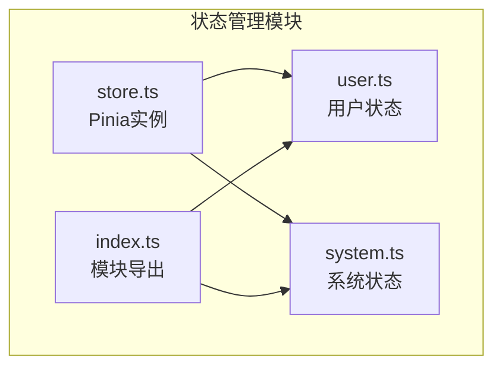
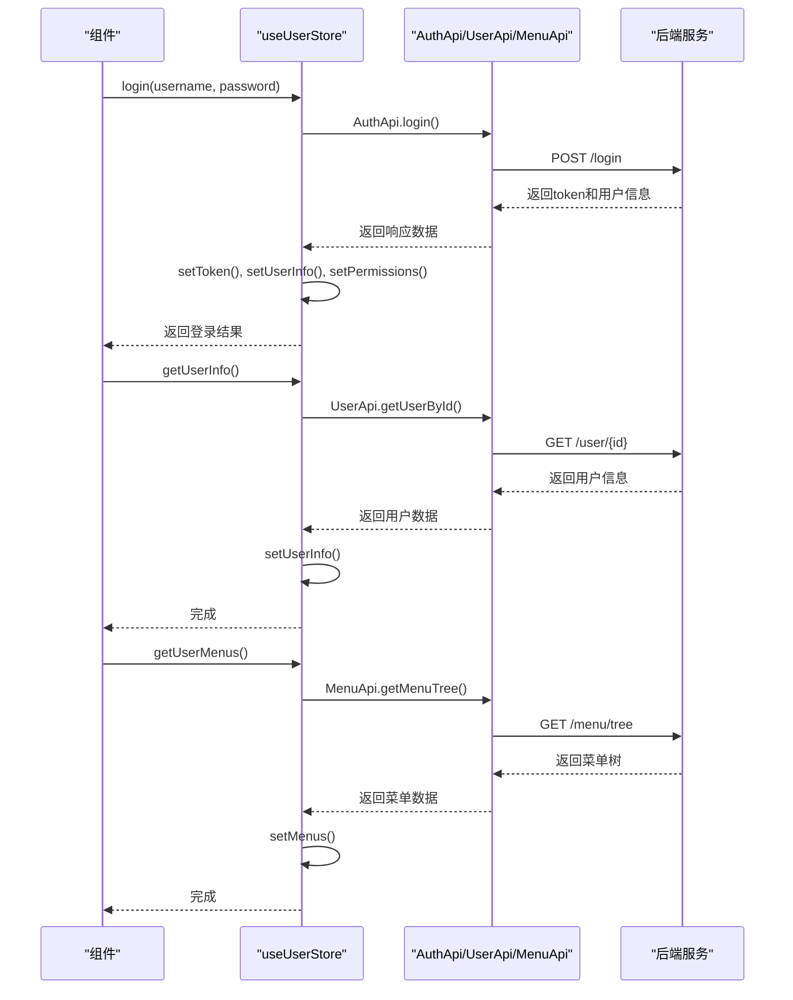
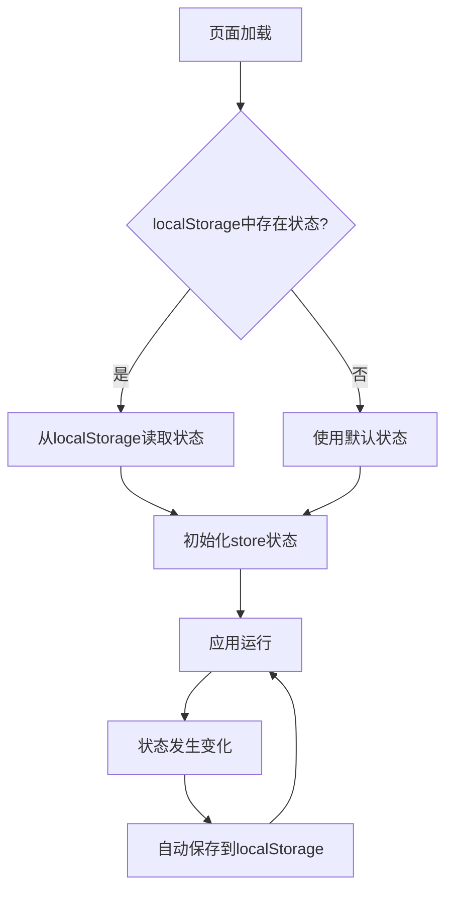

# 状态管理机制

<cite>
**本文档引用的文件**  
- [user.ts](file://AI-agent-frontend/src/store/user.ts)
- [system.ts](file://AI-agent-frontend/src/store/modules/system.ts)
- [auth.ts](file://AI-agent-frontend/src/utils/auth.ts)
- [store.ts](file://AI-agent-frontend/src/store/store.ts)
- [index.ts](file://AI-agent-frontend/src/store/index.ts)
- [security.py](file://AI-agent-backend/app/core/security.py)
- [user_controller_new.py](file://AI-agent-backend/app/controller/user_controller_new.py)
</cite>

## 目录
1. [项目结构](#项目结构)
2. [核心状态模块分析](#核心状态模块分析)
3. [用户状态管理机制](#用户状态管理机制)
4. [系统状态管理机制](#系统状态管理机制)
5. [Token管理与自动刷新策略](#token管理与自动刷新策略)
6. [状态持久化方案](#状态持久化方案)
7. [跨组件状态共享示例](#跨组件状态共享示例)
8. [常见状态不一致问题排查](#常见状态不一致问题排查)

## 项目结构

前端状态管理模块采用模块化设计，位于 `src/store` 目录下，主要包含以下文件：

- `user.ts`：用户相关状态管理，包括登录状态、权限、菜单等
- `modules/system.ts`：系统管理模块状态，包括菜单、角色、部门、用户列表等
- `store.ts`：Pinia实例创建与插件注册
- `index.ts`：统一导出所有store模块



**图示来源**  
- [user.ts](file://AI-agent-frontend/src/store/user.ts)
- [system.ts](file://AI-agent-frontend/src/store/modules/system.ts)
- [store.ts](file://AI-agent-frontend/src/store/store.ts)
- [index.ts](file://AI-agent-frontend/src/store/index.ts)

## 核心状态模块分析

### Pinia初始化与配置

Pinia作为Vue应用的状态管理库，在`store.ts`中完成初始化并注册持久化插件：

```typescript
import { createPinia } from 'pinia'
import piniaPluginPersistedstate from 'pinia-plugin-persistedstate'

const pinia = createPinia()
pinia.use(piniaPluginPersistedstate)

export default pinia
```

通过引入`pinia-plugin-persistedstate`插件，实现了状态的本地持久化存储，避免页面刷新后状态丢失。

**模块来源**  
- [store.ts](file://AI-agent-frontend/src/store/store.ts)

### 模块统一导出机制

`index.ts`文件采用统一导出模式，便于在应用其他部分按需引入：

```typescript
export { useUserStore } from '@/store/user'
export { useSystemStore } from '@/store/modules/system'
export { default as pinia } from '@/store/store'
```

这种设计提高了代码的可维护性和可读性，所有状态模块的访问入口集中管理。

**模块来源**  
- [index.ts](file://AI-agent-frontend/src/store/index.ts)

## 用户状态管理机制

### State定义与响应式处理

`user.ts`中定义了`UserState`接口，明确描述了用户状态的数据结构：

```typescript
export interface UserState {
  token: string | null
  userInfo: UserInfo | null
  permissions: string[]
  roles: string[]
  menus: MenuInfo[]
  loading: boolean
}
```

通过`defineStore`创建名为`user`的store，初始状态从本地存储中读取token：

```typescript
state: (): UserState => ({
  token: getToken() || null,
  userInfo: null,
  permissions: [],
  roles: [],
  menus: [],
  loading: false
})
```

所有状态属性均为响应式，当其值发生变化时，依赖这些状态的组件会自动更新。

**状态来源**  
- [user.ts](file://AI-agent-frontend/src/store/user.ts#L16-L25)

### Getters计算逻辑

Getters用于派生状态，提供便捷的数据访问方式：

```typescript
getters: {
  isLoggedIn: (state) => !!state.token,
  getToken: (state) => state.token,
  username: (state) => state.userInfo?.username || '',
  avatar: (state) => state.userInfo?.avatar || '',
  hasRole: (state) => (role: string) => state.roles.includes(role),
  hasPermission: (state) => (permission: string) => state.permissions.includes(permission),
  hasAnyRole: (state) => (roles: string[]) => roles.some(role => state.roles.includes(role)),
  hasAnyPermission: (state) => (permissions: string[]) => permissions.some(perm => state.permissions.includes(perm)),
  hasAllRoles: (state) => (roles: string[]) => roles.every(role => state.roles.includes(role)),
  hasAllPermissions: (state) => (permissions: string[]) => permissions.every(perm => state.permissions.includes(perm))
}
```

这些getters提供了：
- 基础信息获取：`isLoggedIn`、`getToken`、`username`、`avatar`
- 权限判断：`hasRole`、`hasPermission`
- 复合判断：`hasAnyRole`、`hasAnyPermission`、`hasAllRoles`、`hasAllPermissions`

**计算逻辑来源**  
- [user.ts](file://AI-agent-frontend/src/store/user.ts#L27-L45)

### Actions异步操作封装

Actions封装了所有与用户相关的异步操作：



**图示来源**  
- [user.ts](file://AI-agent-frontend/src/store/user.ts)

#### 登录操作

```typescript
async login(username: string, password: string): Promise<boolean> {
  try {
    this.loading = true
    const response = await AuthApi.login({ username, password })
    
    if (response.success && response.data) {
      const { access_token, user_info, permissions } = response.data
      
      this.setToken(access_token)
      this.setUserInfo(user_info)
      this.setPermissions(permissions)
      
      return true
    }
    return false
  } catch (error) {
    console.error('登录失败:', error)
    return false
  } finally {
    this.loading = false
  }
}
```

登录成功后，将token、用户信息和权限信息分别存储到state中。

#### 获取用户信息

```typescript
async getUserInfo(): Promise<void> {
  if (!this.token || !this.userInfo?.user_id) return
  
  try {
    this.loading = true
    const response = await UserApi.getUserById(this.userInfo.user_id)
    
    if (response.success && response.data) {
      this.setUserInfo(response.data)
    }
  } catch (error) {
    console.error('获取用户信息失败:', error)
  } finally {
    this.loading = false
  }
}
```

#### 登出操作

```typescript
async logout(): Promise<void> {
  try {
    await AuthApi.logout()
  } catch (error) {
    console.error('登出失败:', error)
  } finally {
    this.clearUserData()
  }
}
```

登出时先调用登出接口，然后清除所有用户相关数据。

**操作封装来源**  
- [user.ts](file://AI-agent-frontend/src/store/user.ts#L78-L188)

## 系统状态管理机制

### State定义

`system.ts`中定义了系统管理模块的状态：

```typescript
export interface SystemState {
  menuList: MenuInfo[]
  roleList: RoleInfo[]
  deptList: DeptInfo[]
  userList: UserInfo[]
  collapsed: boolean
  pagination: {
    page: number
    size: number
    total: number
  }
}
```

### Getters计算属性

```typescript
getters: {
  topMenus: (state) => {
    return state.menuList.filter(menu => menu.parent_id === 0)
  },
  menuMap: (state) => {
    const map = new Map()
    state.menuList.forEach(menu => {
      map.set(menu.menu_id, menu)
    })
    return map
  },
  roleMap: (state) => {
    const map = new Map()
    state.roleList.forEach(role => {
      map.set(role.role_id, role)
    })
    return map
  },
  deptMap: (state) => {
    const map = new Map()
    state.deptList.forEach(dept => {
      map.set(dept.dept_id, dept)
    })
    return map
  },
  userMap: (state) => {
    const map = new Map()
    state.userList.forEach(user => {
      map.set(user.user_id, user)
    })
    return map
  }
}
```

这些getters提供了：
- `topMenus`：获取顶级菜单
- `menuMap`、`roleMap`、`deptMap`、`userMap`：将列表转换为Map，便于通过ID快速查找

### Actions操作方法

```typescript
actions: {
  toggleCollapsed() {
    this.collapsed = !this.collapsed
  },
  setCollapsed(collapsed: boolean) {
    this.collapsed = collapsed
  },
  setMenuList(menuList: MenuInfo[]) {
    this.menuList = menuList
  },
  setRoleList(roleList: RoleInfo[]) {
    this.roleList = roleList
  },
  setDeptList(deptList: DeptInfo[]) {
    this.deptList = deptList
  },
  setUserList(userList: UserInfo[]) {
    this.userList = userList
  },
  setPagination(pagination: Partial<SystemState['pagination']>) {
    this.pagination = { ...this.pagination, ...pagination }
  },
  resetPagination() {
    this.pagination = {
      page: 1,
      size: 10,
      total: 0
    }
  }
}
```

这些actions主要用于管理侧边栏折叠状态、设置各类列表数据和分页信息。

**系统状态来源**  
- [system.ts](file://AI-agent-frontend/src/store/modules/system.ts)

## Token管理与自动刷新策略

### Token存储工具类

`auth.ts`文件封装了token的存储操作，使用Cookies进行持久化：

```typescript
import Cookies from "js-cookie";
const TokenKey = "vite-vue3-ts-token";

export const getToken = () => {
  return Cookies.get(TokenKey);
}

export const setToken = (token: string, cookieExpires?: number) => {
  return Cookies.set(TokenKey, token, { expires: cookieExpires || 1 });
}

export const removeToken = () => {
  return Cookies.remove(TokenKey);
}
```

Token默认有效期为1天，可通过`cookieExpires`参数自定义。

**工具类来源**  
- [auth.ts](file://AI-agent-frontend/src/utils/auth.ts)

### Token刷新机制

前端通过调用`refreshToken` action实现token自动刷新：

```typescript
async refreshToken(): Promise<boolean> {
  if (!this.token) return false
  
  try {
    const response = await AuthApi.refreshToken()
    
    if (response.success && response.data) {
      this.setToken(response.data.access_token)
      return true
    }
    return false
  } catch (error) {
    console.error('刷新token失败:', error)
    this.clearUserData()
    return false
  }
}
```

后端实现逻辑在`security.py`中：

```python
def refresh_access_token(refresh_token: str) -> Optional[str]:
    payload = verify_token(refresh_token, token_type="refresh")
    if not payload:
        return None
    
    user_id = payload.get("sub")
    if not user_id:
        return None
    
    new_access_token = create_access_token({"sub": user_id})
    return new_access_token
```

同时在`user_controller_new.py`中提供了刷新接口：

```python
@router.post("/refresh", response_model=ApiResponse[dict], summary="刷新Token")
async def refresh_token(
    request: RefreshTokenRequest,
    current_user: User = Depends(get_current_user)
):
    try:
        access_token = create_access_token(data={"sub": str(current_user.user_id)})
        response_data = {
            "access_token": access_token,
            "token_type": "bearer"
        }
        return ApiResponse.success_response(data=response_data, message="Token刷新成功")
    except Exception as e:
        raise HTTPException(
            status_code=status.HTTP_500_INTERNAL_SERVER_ERROR,
            detail="Token刷新失败"
        )
```

**刷新策略来源**  
- [auth.ts](file://AI-agent-frontend/src/utils/auth.ts)
- [user.ts](file://AI-agent-frontend/src/store/user.ts#L176-L188)
- [security.py](file://AI-agent-backend/app/core/security.py#L184-L238)
- [user_controller_new.py](file://AI-agent-backend/app/controller/user_controller_new.py#L552-L578)

## 状态持久化方案

Pinia通过`pinia-plugin-persistedstate`插件实现状态持久化，配置如下：

```typescript
persist: {
  key: 'user-store',
  storage: localStorage
}
```

```typescript
persist: {
  key: 'system-store',
  storage: localStorage
}
```

该方案特点：
- 使用localStorage作为存储介质，数据在页面刷新后依然存在
- 为每个store设置独立的key，避免命名冲突
- 自动同步state变化到存储中
- 页面加载时自动从存储中恢复状态

持久化流程：



**持久化方案来源**  
- [user.ts](file://AI-agent-frontend/src/store/user.ts#L189-L191)
- [system.ts](file://AI-agent-frontend/src/store/modules/system.ts#L112-L114)
- [store.ts](file://AI-agent-frontend/src/store/store.ts)

## 跨组件状态共享示例

### 在组件中使用用户状态

```typescript
import { useUserStore } from '@/store/user'

// 在组件中
const userStore = useUserStore()

// 访问状态
console.log(userStore.isLoggedIn)
console.log(userStore.username)

// 调用actions
await userStore.login('admin', '123456')

// 监听状态变化
watch(() => userStore.token, (newToken) => {
  console.log('Token已更新:', newToken)
})
```

### 在组件中使用系统状态

```typescript
import { useSystemStore } from '@/store/modules/system'

const systemStore = useSystemStore()

// 控制侧边栏折叠
systemStore.toggleCollapsed()

// 设置菜单列表
systemStore.setMenuList(menuData)

// 获取分页信息
console.log(systemStore.pagination)
```

### 在路由守卫中使用状态

```typescript
import { useUserStore } from '@/store/user'

// 路由守卫中检查登录状态
router.beforeEach(async (to, from, next) => {
  const userStore = useUserStore()
  
  if (to.meta.requiresAuth && !userStore.isLoggedIn) {
    next('/login')
  } else {
    next()
  }
})
```

### 在权限指令中使用状态

```typescript
// permission.ts
import { useUserStore } from '@/store/user'

export default {
  mounted(el, binding) {
    const userStore = useUserStore()
    const { value } = binding
    
    if (value && !userStore.hasPermission(value)) {
      el.parentNode?.removeChild(el)
    }
  }
}
```

**共享示例来源**  
- [user.ts](file://AI-agent-frontend/src/store/user.ts)
- [system.ts](file://AI-agent-frontend/src/store/modules/system.ts)

## 常见状态不一致问题排查

### 问题1：页面刷新后登录状态丢失

**可能原因**：
- localStorage中没有保存token
- 持久化插件未正确注册
- token存储key不匹配

**排查方法**：
1. 检查浏览器开发者工具的Application面板，查看localStorage中是否存在`user-store`键
2. 确认`store.ts`中已正确注册`pinia-plugin-persistedstate`插件
3. 检查`user.ts`中`persist.key`是否为`user-store`

### 问题2：权限判断失效

**可能原因**：
- 用户权限数据未正确加载
- 权限数组格式不正确
- getters计算逻辑错误

**排查方法**：
1. 检查`getUserPermissions` action是否被正确调用
2. 查看网络请求，确认后端返回的权限数据格式是否正确
3. 在控制台打印`userStore.permissions`，确认数据内容

### 问题3：菜单显示异常

**可能原因**：
- 菜单数据未正确加载
- 菜单数据结构与组件期望不符
- 路由与菜单映射关系错误

**排查方法**：
1. 检查`getUserMenus` action执行情况
2. 查看`userStore.menus`中的数据结构是否符合预期
3. 确认菜单项的`path`字段与路由配置一致

### 问题4：Token自动刷新失败

**可能原因**：
- 刷新接口返回错误
- 刷新后未正确更新token
- 刷新频率过高被后端限制

**排查方法**：
1. 检查`refreshToken` action的网络请求状态
2. 查看控制台错误信息
3. 确认后端`refresh_token`接口是否正常工作

### 通用排查工具

```typescript
// 在控制台中快速检查状态
const userStore = useUserStore()
console.log('当前状态:', {
  isLoggedIn: userStore.isLoggedIn,
  token: userStore.token,
  userInfo: userStore.userInfo,
  permissions: userStore.permissions,
  menus: userStore.menus
})

// 检查持久化数据
console.log('localStorage数据:', localStorage.getItem('user-store'))
```

**问题排查来源**  
- [user.ts](file://AI-agent-frontend/src/store/user.ts)
- [auth.ts](file://AI-agent-frontend/src/utils/auth.ts)
- [system.ts](file://AI-agent-frontend/src/store/modules/system.ts)