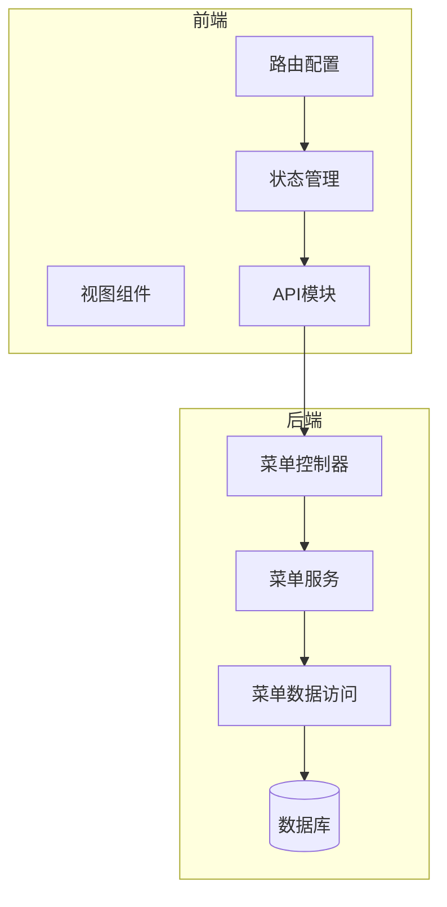
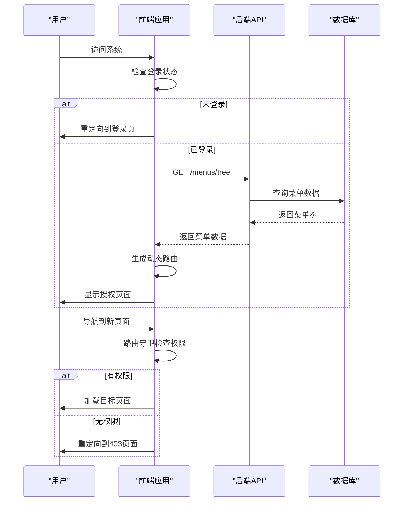
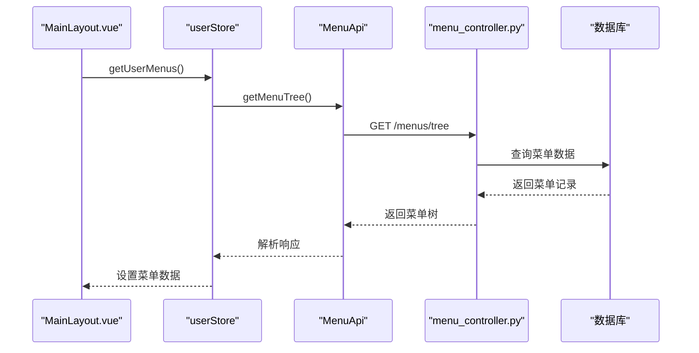
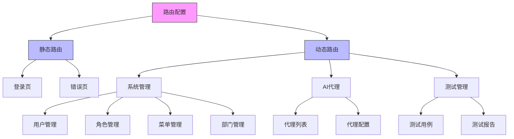
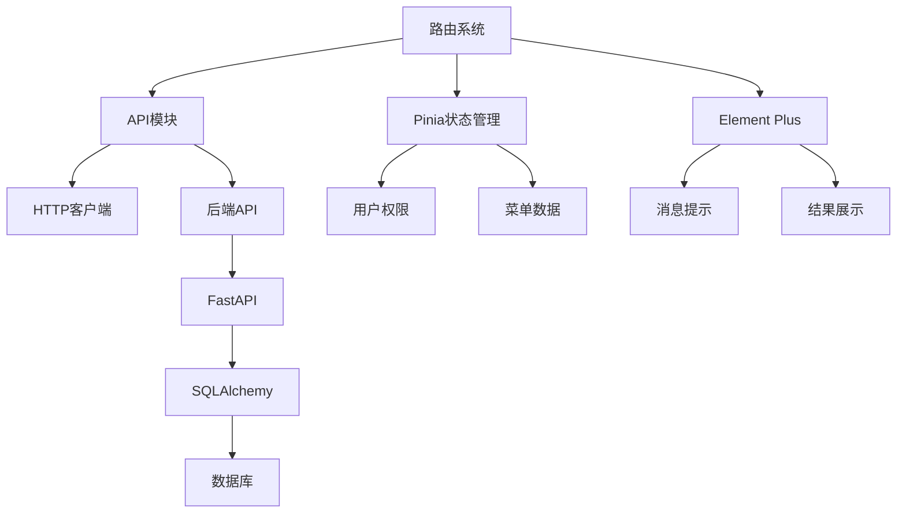

# 路由系统

<cite>
**本文档中引用的文件**  
- [index.ts](file://AI-agent-frontend/src/router/index.ts)
- [user.ts](file://AI-agent-frontend/src/store/user.ts)
- [menu.ts](file://AI-agent-frontend/src/api/modules/menu.ts)
- [menu_controller.py](file://AI-agent-backend/app/controller/menu_controller.py)
- [menu_service.py](file://AI-agent-backend/app/service/menu_service.py)
- [menu_repository.py](file://AI-agent-backend/app/repository/menu_repository.py)
- [permission.ts](file://AI-agent-frontend/src/utils/permission.ts)
- [permission.ts](file://AI-agent-frontend/src/directives/permission.ts)
- [main.ts](file://AI-agent-frontend/src/main.ts)
- [403.vue](file://AI-agent-frontend/src/views/error/403.vue)
- [404.vue](file://AI-agent-frontend/src/views/error/404.vue)
</cite>

## 目录
1. [项目结构](#项目结构)
2. [核心组件](#核心组件)
3. [架构概览](#架构概览)
4. [详细组件分析](#详细组件分析)
5. [依赖分析](#依赖分析)
6. [性能考虑](#性能考虑)
7. [故障排除指南](#故障排除指南)
8. [结论](#结论)

## 项目结构
本项目采用前后端分离架构，前端使用Vue 3 + TypeScript + Vite构建，后端使用FastAPI + SQLAlchemy + PostgreSQL。前端路由系统位于`src/router/index.ts`，通过Vue Router实现静态与动态路由配置。前端视图组件按功能模块组织在`src/views`目录下，包括系统管理、AI代理、测试模块等。状态管理使用Pinia，用户权限和菜单数据存储在`src/store/user.ts`中。后端权限系统基于RBAC模型，菜单数据通过`menu_controller.py`提供RESTful API接口。



**图示来源**  
- [index.ts](file://AI-agent-frontend/src/router/index.ts)
- [user.ts](file://AI-agent-frontend/src/store/user.ts)
- [menu_controller.py](file://AI-agent-backend/app/controller/menu_controller.py)

**本节来源**  
- [index.ts](file://AI-agent-frontend/src/router/index.ts)
- [menu_controller.py](file://AI-agent-backend/app/controller/menu_controller.py)

## 核心组件
路由系统的核心组件包括：静态路由配置、动态路由生成、路由守卫、权限校验和错误页面处理。静态路由如登录页和错误页在`index.ts`中直接定义。动态路由基于用户权限从后端获取菜单数据生成，通过`userStore.getUserMenus()`调用`MenuApi.getMenuTree()`获取菜单树。路由守卫`beforeEach`实现全局权限校验，结合`userStore.hasPermission()`方法进行页面级访问控制。403/404错误页面提供友好的用户提示和导航。

**本节来源**  
- [index.ts](file://AI-agent-frontend/src/router/index.ts)
- [user.ts](file://AI-agent-frontend/src/store/user.ts)
- [menu.ts](file://AI-agent-frontend/src/api/modules/menu.ts)

## 架构概览
系统采用前后端分离架构，前端通过Vue Router管理路由，后端通过FastAPI提供RESTful API。用户登录后，前端从后端获取菜单和权限数据，动态生成路由表。路由守卫在每次导航前进行权限校验，确保用户只能访问授权页面。整个流程涉及多个组件协同工作，从前端路由配置到后端数据库查询，形成完整的权限控制闭环。



**图示来源**  
- [index.ts](file://AI-agent-frontend/src/router/index.ts)
- [menu_controller.py](file://AI-agent-backend/app/controller/menu_controller.py)
- [menu_repository.py](file://AI-agent-backend/app/repository/menu_repository.py)

## 详细组件分析

### 静态路由与动态路由配置
系统路由分为静态路由和动态路由。静态路由在`index.ts`中直接定义，包括登录页、403/404错误页等。动态路由基于用户权限生成，主要模块包括系统管理、AI代理、测试管理等。路由配置使用嵌套路由实现层级结构，通过`children`属性定义子路由。路由元信息包含页面标题、图标和权限标识，用于页面展示和权限控制。

```typescript
const routes: RouteRecordRaw[] = [
  {
    path: '/login',
    name: 'Login',
    component: () => import('@/views/login/Login.vue'),
    meta: {
      title: '登录',
      requiresAuth: false
    }
  },
  {
    path: '/',
    name: 'Layout',
    component: () => import('@/components/Layout/MainLayout.vue'),
    meta: {
      requiresAuth: true
    },
    redirect: '/dashboard',
    children: [
      {
        path: '/system',
        name: 'System',
        meta: {
          title: '系统管理',
          icon: 'Setting'
        },
        children: [
          {
            path: '/system/user',
            name: 'UserManagement',
            component: () => import('@/views/system/user/Index.vue'),
            meta: {
              title: '用户管理',
              permission: 'user:view'
            }
          }
        ]
      }
    ]
  }
]
```

**本节来源**  
- [index.ts](file://AI-agent-frontend/src/router/index.ts)

### 动态路由生成机制
动态路由的生成基于用户权限，通过后端API获取菜单数据。当用户登录后，`MainLayout.vue`的`onMounted`钩子调用`userStore.getUserMenus()`方法，该方法通过`MenuApi.getMenuTree()`获取菜单树数据。菜单数据存储在Pinia状态中，前端根据这些数据动态生成路由表。后端`menu_controller.py`中的`get_menu_tree`接口返回完整的菜单树结构，包括菜单名称、路径、组件和权限标识。



**图示来源**  
- [user.ts](file://AI-agent-frontend/src/store/user.ts)
- [menu.ts](file://AI-agent-frontend/src/api/modules/menu.ts)
- [menu_controller.py](file://AI-agent-backend/app/controller/menu_controller.py)

**本节来源**  
- [user.ts](file://AI-agent-frontend/src/store/user.ts)
- [menu.ts](file://AI-agent-frontend/src/api/modules/menu.ts)
- [menu_controller.py](file://AI-agent-backend/app/controller/menu_controller.py)

### 路由守卫与权限校验
路由守卫是权限控制的核心，通过`router.beforeEach`全局前置守卫实现。守卫逻辑首先检查目标路由是否需要认证（`requiresAuth`），若需要且用户未登录则重定向到登录页。然后检查路由的权限标识（`permission`），通过`userStore.hasPermission()`方法校验用户权限。若权限不足则重定向到403页面。超级管理员拥有所有权限，不受此限制。

```typescript
router.beforeEach(async (to, from, next) => {
  const userStore = useUserStore()
  
  // 设置页面标题
  if (to.meta.title) {
    document.title = `${to.meta.title} - AI智能代理测试平台`
  }
  
  // 检查是否需要认证
  if (to.meta.requiresAuth !== false) {
    if (!userStore.isLoggedIn) {
      ElMessage.warning('请先登录')
      next('/login')
      return
    }
    
    // 检查权限
    if (to.meta.permission && !userStore.hasPermission(to.meta.permission as string)) {
      ElMessage.error('权限不足')
      next('/403')
      return
    }
  }
  
  // 如果已登录，访问登录页面则跳转到首页
  if (to.path === '/login' && userStore.isLoggedIn) {
    next('/')
    return
  }
  
  next()
})
```

**本节来源**  
- [index.ts](file://AI-agent-frontend/src/router/index.ts)

### 路由懒加载与嵌套路由
系统采用路由懒加载优化性能，所有路由组件都使用`import()`函数动态导入。这使得每个页面的代码被分割成独立的chunk，只在需要时加载，减少初始加载时间。嵌套路由通过`children`属性实现，形成多级菜单结构。例如系统管理模块包含用户、角色、菜单、部门四个子模块，每个子模块又有自己的页面组件。



**图示来源**  
- [index.ts](file://AI-agent-frontend/src/router/index.ts)

**本节来源**  
- [index.ts](file://AI-agent-frontend/src/router/index.ts)

### 403/404页面拦截与展示
403和404页面用于处理权限不足和页面不存在的情况。当路由守卫检测到权限不足时，使用`next('/403')`重定向到403页面。当访问不存在的路由时，通配符路由`/:pathMatch(.*)*`会匹配并重定向到404页面。两个页面都使用Element Plus的`el-result`组件展示友好的错误信息，并提供返回首页的按钮。

```vue
<template>
  <div class="error-page">
    <el-result
      icon="warning"
      title="403 权限不足"
      sub-title="很抱歉，您没有权限访问此页面"
    >
      <template #extra>
        <el-button type="primary" @click="goHome">返回首页</el-button>
      </template>
    </el-result>
  </div>
</template>

<script setup lang="ts">
import { useRouter } from 'vue-router'

const router = useRouter()

const goHome = () => {
  router.push('/')
}
</script>
```

**本节来源**  
- [403.vue](file://AI-agent-frontend/src/views/error/403.vue)
- [404.vue](file://AI-agent-frontend/src/views/error/404.vue)

## 依赖分析
路由系统依赖多个组件协同工作。前端依赖Pinia进行状态管理，存储用户权限和菜单数据。依赖Element Plus提供UI组件和消息提示。API模块依赖`http.ts`封装的HTTP客户端与后端通信。后端依赖SQLAlchemy进行数据库操作，通过Repository模式封装数据访问逻辑。整个系统通过清晰的依赖关系实现高内聚低耦合的设计。



**图示来源**  
- [index.ts](file://AI-agent-frontend/src/router/index.ts)
- [user.ts](file://AI-agent-frontend/src/store/user.ts)
- [menu_controller.py](file://AI-agent-backend/app/controller/menu_controller.py)

**本节来源**  
- [index.ts](file://AI-agent-frontend/src/router/index.ts)
- [user.ts](file://AI-agent-frontend/src/store/user.ts)
- [menu_controller.py](file://AI-agent-backend/app/controller/menu_controller.py)

## 性能考虑
路由系统在性能方面做了多项优化。首先采用路由懒加载，将代码分割成多个chunk，减少初始加载时间。其次使用Pinia持久化存储用户权限和菜单数据，避免每次刷新都重新请求。路由守卫中使用`hasPermission`方法进行快速权限校验，避免重复计算。后端使用Redis缓存菜单数据，减少数据库查询压力。这些优化措施共同提升了系统的响应速度和用户体验。

## 故障排除指南
常见问题包括：用户登录后菜单不显示、权限校验失效、403页面无法访问等。对于菜单不显示问题，检查`userStore.menus`是否正确设置，确认`MenuApi.getMenuTree()`返回数据格式是否正确。对于权限校验失效，检查`userStore.permissions`数组是否包含正确的权限标识，确认路由元信息中的`permission`字段是否匹配。对于403页面无法访问，检查通配符路由配置和重定向逻辑是否正确。

**本节来源**  
- [index.ts](file://AI-agent-frontend/src/router/index.ts)
- [user.ts](file://AI-agent-frontend/src/store/user.ts)
- [403.vue](file://AI-agent-frontend/src/views/error/403.vue)

## 结论
本路由系统实现了完整的权限控制机制，结合静态路由配置和动态路由生成，提供了灵活的页面访问控制。通过路由守卫和权限校验，确保了系统的安全性。路由懒加载和嵌套路由优化了性能和用户体验。403/404页面提供了友好的错误处理。整个系统设计合理，代码结构清晰，易于维护和扩展。