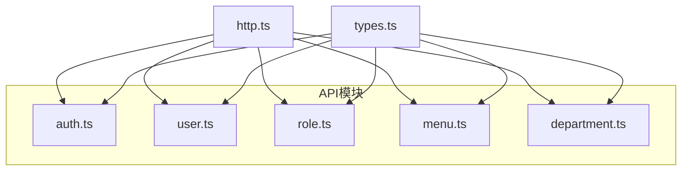
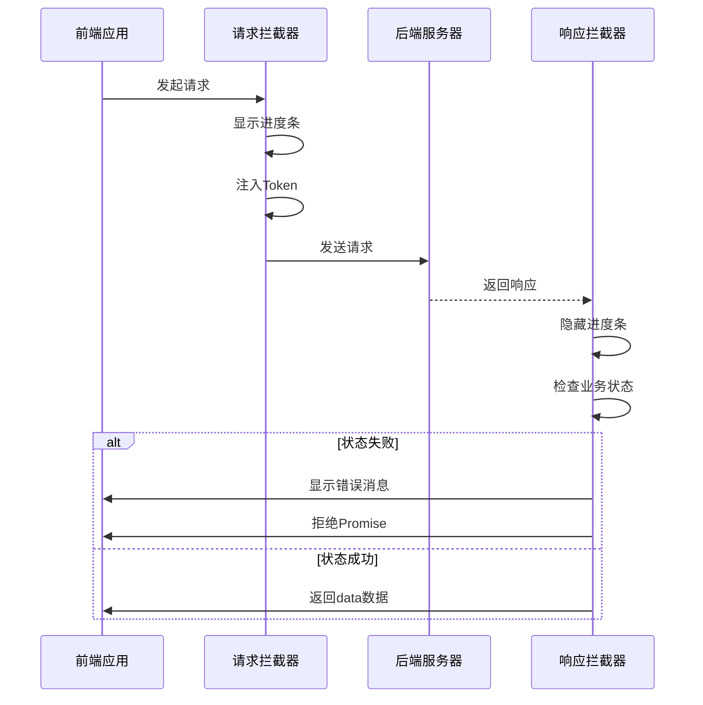
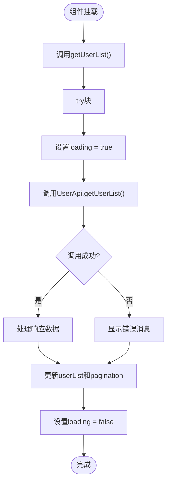

# API模块集成与请求管理

<cite>
**本文档引用的文件**  
- [http.ts](file://AI-agent-frontend\src\api\http.ts)
- [baseUrl.ts](file://AI-agent-frontend\src\api\baseUrl.ts)
- [types.ts](file://AI-agent-frontend\src\api\types.ts)
- [user.ts](file://AI-agent-frontend\src\api\modules\user.ts)
- [role.ts](file://AI-agent-frontend\src\api\modules\role.ts)
- [department.ts](file://AI-agent-frontend\src\api\modules\department.ts)
- [auth.ts](file://AI-agent-frontend\src\api\modules\auth.ts)
- [Index.vue](file://AI-agent-frontend\src\views\system\user\Index.vue)
</cite>

## 目录

1. [API模块组织结构](#api模块组织结构)  
2. [Axios实例封装机制](#axios实例封装机制)  
3. [基础路径配置](#基础路径配置)  
4. [类型安全与DTO定义](#类型安全与dto定义)  
5. [具体API接口定义示例](#具体api接口定义示例)  
6. [组件中的API调用最佳实践](#组件中的api调用最佳实践)  
7. [错误处理与统一响应](#错误处理与统一响应)  
8. [完整示例：带参数请求与文件上传](#完整示例带参数请求与文件上传)

## API模块组织结构

前端项目的API模块位于 `src/api/modules` 目录下，采用模块化方式组织不同功能域的接口。每个模块对应一个独立的TypeScript文件，遵循单一职责原则。

模块文件命名清晰，按功能划分：
- `auth.ts`：认证相关接口
- `user.ts`：用户管理接口
- `role.ts`：角色管理接口
- `menu.ts`：菜单管理接口
- `department.ts`：部门管理接口

每个模块使用静态类（如 `UserApi`）封装相关接口方法，并导出兼容的函数对象（如 `userApi`），兼顾面向对象与函数式调用风格。



**图示来源**  
- [user.ts](file://AI-agent-frontend\src\api\modules\user.ts)
- [role.ts](file://AI-agent-frontend\src\api\modules\role.ts)
- [department.ts](file://AI-agent-frontend\src\api\modules\department.ts)

**本节来源**  
- [user.ts](file://AI-agent-frontend\src\api\modules\user.ts)
- [role.ts](file://AI-agent-frontend\src\api\modules\role.ts)
- [department.ts](file://AI-agent-frontend\src\api\modules\department.ts)

## Axios实例封装机制

`http.ts` 文件对 Axios 进行了统一封装，创建了具有完整拦截器链的实例，实现了请求生命周期的自动化管理。

### 核心配置
```typescript
const http = axios.create({
  baseURL: BASE_URL || 'http://localhost:8000/api/v1',
  timeout: 10000,
  headers: {
    'Content-Type': 'application/json'
  }
})
```

### 请求拦截器
在请求发出前自动注入认证Token，并启动加载进度条：
```typescript
http.interceptors.request.use(
  (config: InternalAxiosRequestConfig) => {
    NProgressStart()
    const token = getToken()
    if (token) {
      config.headers.Authorization = `Bearer ${token}`
    }
    return config
  },
  (error) => {
    NProgressDone()
    return Promise.reject(error)
  }
)
```

### 响应拦截器
统一处理响应数据与错误，根据状态码自动提示用户并执行相应操作：
```typescript
http.interceptors.response.use(
  (response: AxiosResponse<ApiResponse>) => {
    NProgressDone()
    if (!data.success) {
      ElMessage.error(data.message || '操作失败')
      return Promise.reject(new Error(data.message))
    }
    return data as any
  },
  (error) => {
    NProgressDone()
    const { status } = error.response || {}
    if (status === 401) {
      ElMessage.error('登录已过期，请重新登录')
      removeToken()
      router.push('/login')
    } else if (status === 403) {
      ElMessage.error('权限不足')
    } else if (status >= 500) {
      ElMessage.error('服务器错误，请稍后重试')
    }
    return Promise.reject(error)
  }
)
```



**图示来源**  
- [http.ts](file://AI-agent-frontend\src\api\http.ts#L20-L90)

**本节来源**  
- [http.ts](file://AI-agent-frontend\src\api\http.ts)

## 基础路径配置

`baseUrl.ts` 文件定义了不同环境下的基础API路径，支持开发与生产环境的无缝切换。

```typescript
const baseUrl: any = {
  development: '/api/v1',
  production: 'https://your-production-api.com/api/v1',
}

export const BASE_URL = baseUrl[import.meta.env.VITE_ENV] || baseUrl.development;
```

该配置通过环境变量 `VITE_ENV` 动态选择基础路径，确保：
- 开发环境使用代理路径 `/api/v1`
- 生产环境使用完整的生产域名
- 默认回退到开发环境配置

**本节来源**  
- [baseUrl.ts](file://AI-agent-frontend\src\api\baseUrl.ts)

## 类型安全与DTO定义

`types.ts` 文件定义了完整的TypeScript接口，确保前后端数据交互的类型安全。

### 核心类型定义
```typescript
// 统一响应格式
export interface ApiResponse<T = any> {
  success: boolean
  data?: T
  message: string
  error_code?: string
  timestamp: string
}

// 分页数据
export interface PageData<T> {
  items: T[]
  total: number
  page: number
  size: number
  pages: number
}

// 用户信息
export interface UserInfo {
  user_id: number
  username: string
  email?: string
  status: '0' | '1'
  ssex?: '0' | '1' | '2'
}
```

### 请求参数类型
```typescript
export interface UserCreateRequest {
  username: string
  password: string
  email?: string
  mobile?: string
  dept_id?: number
}

export interface PageQuery {
  page?: number
  size?: number
  keyword?: string
}
```

这些类型在API调用中被泛型化使用，如 `http.get<UserInfo[]>`，提供编译时类型检查和IDE智能提示。

```mermaid
classDiagram
class ApiResponse~T~ {
+success : boolean
+data? : T
+message : string
+error_code? : string
+timestamp : string
}
class PageData~T~ {
+items : T[]
+total : number
+page : number
+size : number
+pages : number
}
class UserInfo {
+user_id : number
+username : string
+email? : string
+mobile? : string
+dept_id? : number
+status : '0' | '1'
+ssex? : '0' | '1' | '2'
}
class UserCreateRequest {
+username : string
+password : string
+email? : string
+mobile? : string
+dept_id? : number
}
ApiResponse~PageData~UserInfo~~ --> PageData~UserInfo~
PageData~UserInfo~ --> UserInfo
ApiResponse~UserInfo[]~ --> UserInfo
```

**图示来源**  
- [types.ts](file://AI-agent-frontend\src\api\types.ts#L10-L150)

**本节来源**  
- [types.ts](file://AI-agent-frontend\src\api\types.ts)

## 具体API接口定义示例

以 `user.ts` 模块为例，展示如何使用封装的请求方法定义具体接口。

### 基本CRUD操作
```typescript
export class UserApi {
  // 获取用户列表（分页）
  static async getUserList(params?: PageQuery & {
    dept_id?: number
    status?: '0' | '1'
  }): Promise<ApiResponse<PageData<UserInfo>>> {
    return http.get<PageData<UserInfo>>('/users', params)
  }

  // 创建用户
  static async createUser(data: UserCreateRequest): Promise<ApiResponse<UserInfo>> {
    return http.post<UserInfo>('/users', data)
  }

  // 更新用户
  static async updateUser(userId: number, data: UserUpdateRequest): Promise<ApiResponse<UserInfo>> {
    return http.put<UserInfo>(`/users/${userId}`, data)
  }

  // 删除用户
  static async deleteUser(userId: number): Promise<ApiResponse<boolean>> {
    return http.delete<boolean>(`/users/${userId}`)
  }
}
```

### 带参数请求
```typescript
// 检查用户名是否可用
static async checkUsername(username: string, excludeUserId?: number): Promise<ApiResponse<boolean>> {
  const params = excludeUserId ? { username, exclude_user_id: excludeUserId } : { username }
  return http.get<boolean>('/users/check-username', params)
}
```

### 文件上传
```typescript
// 导入用户数据
static async importUsers(file: File): Promise<ApiResponse<any>> {
  const formData = new FormData()
  formData.append('file', file)
  return http.upload<any>('/users/import', formData)
}
```

**本节来源**  
- [user.ts](file://AI-agent-frontend\src\api\modules\user.ts)
- [http.ts](file://AI-agent-frontend\src\api\http.ts#L100-L115)

## 组件中的API调用最佳实践

在Vue组件中调用API时，应遵循以下最佳实践以避免内存泄漏和重复请求。

### 正确的调用模式
```typescript
const getUserList = async () => {
  try {
    loading.value = true
    const params = {
      ...searchParams,
      page: pagination.page,
      size: pagination.size
    }
    
    const response = await UserApi.getUserList(params)
    if (response.success && response.data) {
      userList.value = response.data.items
      pagination.total = response.data.total
    }
  } catch (error) {
    ElMessage.error('获取用户列表失败')
  } finally {
    loading.value = false
  }
}
```

### 关键实践要点
1. **使用加载状态**：通过 `loading.value` 控制UI状态，防止重复提交
2. **错误处理**：使用 `try-catch` 捕获异步错误，提供用户反馈
3. **finally块**：确保无论成功或失败都清除加载状态
4. **页面初始化**：在 `onMounted` 钩子中调用初始化数据加载



**图示来源**  
- [Index.vue](file://AI-agent-frontend\src\views\system\user\Index.vue#L200-L400)

**本节来源**  
- [Index.vue](file://AI-agent-frontend\src\views\system\user\Index.vue)

## 错误处理与统一响应

系统实现了多层次的错误处理机制：

### 前端响应拦截器处理
- **401状态码**：自动跳转登录页，清除Token
- **403状态码**：提示"权限不足"
- **5xx状态码**：提示"服务器错误"
- **业务失败**：根据 `success: false` 显示 `message`

### 后端异常统一格式
```json
{
  "success": false,
  "message": "资源未找到",
  "error_code": "NOT_FOUND_ERROR",
  "timestamp": "2023-01-01T00:00:00Z"
}
```

### 前端调用时的错误处理
```typescript
try {
  const response = await UserApi.deleteUser(userId)
  if (response.success) {
    ElMessage.success('删除成功')
    getUserList()
  }
} catch (error: any) {
  if (error !== 'cancel') {
    ElMessage.error('删除失败')
  }
}
```

**本节来源**  
- [http.ts](file://AI-agent-frontend\src\api\http.ts#L50-L90)
- [Index.vue](file://AI-agent-frontend\src\views\system\user\Index.vue#L400-L600)

## 完整示例：带参数请求与文件上传

### 带查询参数的GET请求
```typescript
// 在user.ts中定义
static async getUserList(params?: PageQuery & {
  dept_id?: number
  status?: '0' | '1'
}): Promise<ApiResponse<PageData<UserInfo>>> {
  return http.get<PageData<UserInfo>>('/users', params)
}

// 在组件中调用
const params = {
  page: 1,
  size: 10,
  dept_id: 1,
  status: '0'
}
const response = await UserApi.getUserList(params)
```

### 文件上传实现
```typescript
// 1. 定义上传方法
static async importUsers(file: File): Promise<ApiResponse<any>> {
  const formData = new FormData()
  formData.append('file', file)
  return http.upload<any>('/users/import', formData)
}

// 2. 在组件中使用el-upload
<el-upload
  :action="uploadAction"
  :before-upload="beforeUpload"
  :on-success="handleImportSuccess"
  :on-error="handleImportError"
>
  <el-button type="warning" :icon="Upload">导入数据</el-button>
</el-upload>

// 3. 处理上传逻辑
const beforeUpload = (file: File) => {
  const isExcel = file.type === 'application/vnd.ms-excel' || 
                  file.type === 'application/vnd.openxmlformats-officedocument.spreadsheetml.sheet'
  if (!isExcel) {
    ElMessage.error('只能上传Excel文件！')
    return false
  }
  return true
}
```

### 鉴权头自动注入
无需手动处理，由请求拦截器自动完成：
```typescript
// 请求拦截器自动添加
config.headers.Authorization = `Bearer ${token}`
```

**本节来源**  
- [user.ts](file://AI-agent-frontend\src\api\modules\user.ts#L150-L180)
- [http.ts](file://AI-agent-frontend\src\api\http.ts#L100-L115)
- [Index.vue](file://AI-agent-frontend\src\views\system\user\Index.vue#L595-L795)