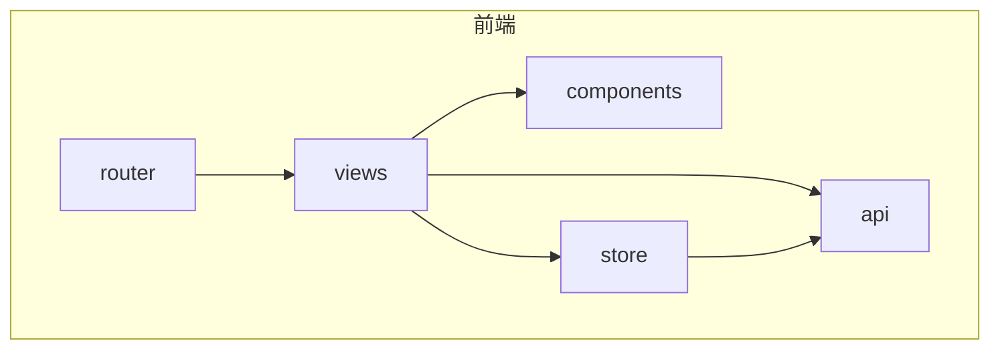
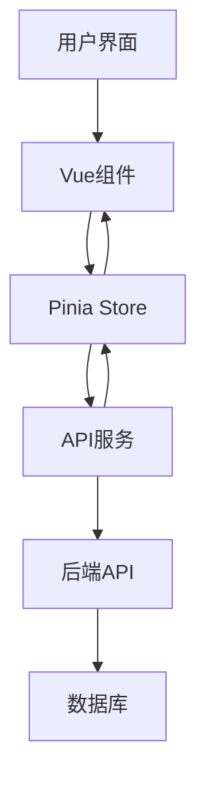
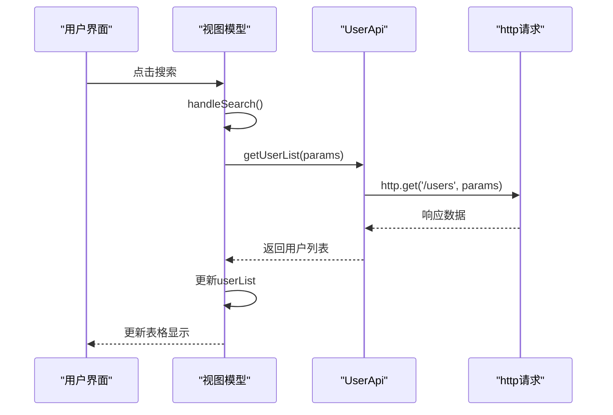
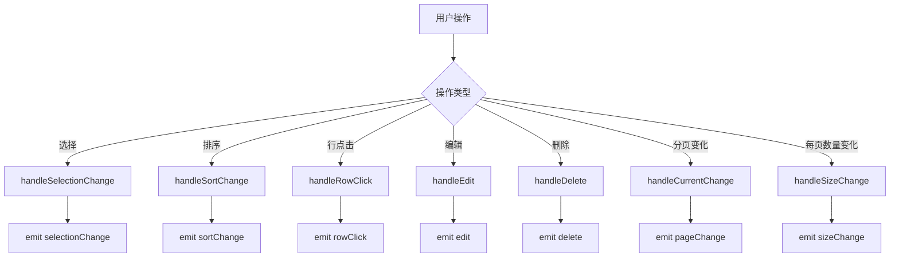
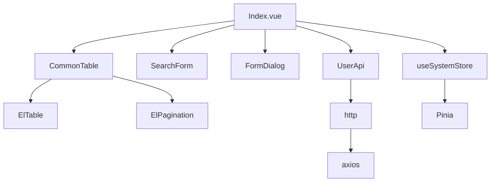

# 前端组件开发规范

<cite>
**本文档引用文件**  
- [UserApi](file://AI-agent-frontend/src/api/modules/user.ts)
- [CommonTable.vue](file://AI-agent-frontend/src/components/Common/CommonTable.vue)
- [Index.vue](file://AI-agent-frontend/src/views/system/user/Index.vue)
- [system.ts](file://AI-agent-frontend/src/store/modules/system.ts)
- [types.ts](file://AI-agent-frontend/src/api/types.ts)
- [http.ts](file://AI-agent-frontend/src/api/http.ts)
</cite>

## 目录
1. [项目结构](#项目结构)
2. [核心组件](#核心组件)
3. [架构概览](#架构概览)
4. [详细组件分析](#详细组件分析)
5. [依赖分析](#依赖分析)
6. [性能考虑](#性能考虑)
7. [故障排除指南](#故障排除指南)
8. [结论](#结论)

## 项目结构
本项目采用前后端分离架构，前端基于Vue 3 + TypeScript + Vite构建，遵循模块化、组件化的开发模式。前端代码位于`AI-agent-frontend`目录下，主要结构如下：

- `src/api`：API接口定义，包含与后端交互的所有请求
- `src/components`：通用组件库，支持UI复用
- `src/store`：状态管理，使用Pinia实现
- `src/views`：页面视图组件，按功能模块组织
- `src/utils`：工具函数
- `src/router`：路由配置



**图示来源**
- [Index.vue](file://AI-agent-frontend/src/views/system/user/Index.vue)
- [CommonTable.vue](file://AI-agent-frontend/src/components/Common/CommonTable.vue)

**本节来源**
- [Index.vue](file://AI-agent-frontend/src/views/system/user/Index.vue)
- [CommonTable.vue](file://AI-agent-frontend/src/components/Common/CommonTable.vue)

## 核心组件
项目的核心组件包括：
- **CommonTable**：通用表格组件，支持分页、排序、选择等通用功能
- **SearchForm**：通用搜索表单组件
- **FormDialog**：通用表单对话框组件
- **Pinia Store**：全局状态管理
- **Axios封装**：统一的HTTP请求处理

这些组件通过组合式API（Composition API）实现，提高了代码的可维护性和复用性。

**本节来源**
- [CommonTable.vue](file://AI-agent-frontend/src/components/Common/CommonTable.vue)
- [system.ts](file://AI-agent-frontend/src/store/modules/system.ts)

## 架构概览
系统采用典型的MVVM架构，前端通过Vue 3的响应式系统管理视图，通过Pinia管理应用状态，通过Axios与后端API交互。



**图示来源**
- [Index.vue](file://AI-agent-frontend/src/views/system/user/Index.vue)
- [system.ts](file://AI-agent-frontend/src/store/modules/system.ts)
- [user.ts](file://AI-agent-frontend/src/api/modules/user.ts)

## 详细组件分析

### 用户管理页面分析
用户管理页面（User Management）是系统中典型的CRUD操作页面，展示了如何使用现有架构开发新功能。

#### 组件结构
```mermaid
classDiagram
class UserManagement {
+loading : Ref<boolean>
+formLoading : Ref<boolean>
+userList : Ref<UserInfo[]>
+selectedUsers : Ref<UserInfo[]>
+userDialogVisible : Ref<boolean>
+roleDialogVisible : Ref<boolean>
+isEdit : Ref<boolean>
+currentUser : Ref<Partial<UserInfo>>
+selectedRoles : Ref<number[]>
+roleList : Ref<any[]>
+searchParams : Reactive<{}>
+pagination : Reactive<{}>
+getUserList() : Promise<void>
+handleSearch() : void
+handleReset() : void
+handleAdd() : void
+handleEdit() : void
+handleDelete() : void
+handleBatchDelete() : void
+handleToggleStatus() : void
+handleAssignRole() : void
+handleRoleAssignConfirm() : void
+handleUserFormConfirm() : void
+handleUserFormCancel() : void
}
UserManagement --> CommonTable : "使用"
UserManagement --> SearchForm : "使用"
UserManagement --> FormDialog : "使用"
UserManagement --> UserApi : "调用"
```

**图示来源**
- [Index.vue](file://AI-agent-frontend/src/views/system/user/Index.vue)

**本节来源**
- [Index.vue](file://AI-agent-frontend/src/views/system/user/Index.vue)

#### API调用流程


**图示来源**
- [Index.vue](file://AI-agent-frontend/src/views/system/user/Index.vue)
- [user.ts](file://AI-agent-frontend/src/api/modules/user.ts)

### 通用表格组件分析
CommonTable是一个高度可配置的通用表格组件，支持多种功能。

#### 组件属性
```mermaid
classDiagram
class CommonTable {
+data : any[]
+columns : TableColumn[]
+loading : boolean
+showSelection : boolean
+showIndex : boolean
+showActions : boolean
+actionWidth : number|string
+hideEdit : boolean
+hideDelete : boolean
+stripe : boolean
+border : boolean
+height : number|string
+maxHeight : number|string
+emptyText : string
+rowKey : string
+treeProps : object
+expandRowKeys : any[]
+defaultExpandAll : boolean
+showPagination : boolean
+pagination : {page : number, size : number, total : number}
+pageSizes : number[]
+paginationLayout : string
+selectable : (row : any, index : number) => boolean
}
CommonTable --> ElTable : "封装"
CommonTable --> ElPagination : "封装"
```

**图示来源**
- [CommonTable.vue](file://AI-agent-frontend/src/components/Common/CommonTable.vue)

**本节来源**
- [CommonTable.vue](file://AI-agent-frontend/src/components/Common/CommonTable.vue)

#### 事件处理流程


**图示来源**
- [CommonTable.vue](file://AI-agent-frontend/src/components/Common/CommonTable.vue)

### API模块分析
API模块采用静态类的方式组织，每个API方法都返回Promise，便于异步处理。

#### 用户API类结构
```mermaid
classDiagram
class UserApi {
+getUserList(params) : Promise<ApiResponse<PageData<UserInfo>>>
+getAllUsers() : Promise<ApiResponse<UserInfo[]>>
+getUserById(userId) : Promise<ApiResponse<UserInfo>>
+createUser(data) : Promise<ApiResponse<UserInfo>>
+updateUser(userId, data) : Promise<ApiResponse<UserInfo>>
+deleteUser(userId) : Promise<ApiResponse<boolean>>
+batchDeleteUsers(userIds) : Promise<ApiResponse<boolean>>
+changePassword(userId, data) : Promise<ApiResponse<boolean>>
+resetPassword(userId, newPassword) : Promise<ApiResponse<boolean>>
+toggleUserStatus(userId, status) : Promise<ApiResponse<boolean>>
+getUserRoles(userId) : Promise<ApiResponse<any[]>>
+assignUserRoles(userId, data) : Promise<ApiResponse<boolean>>
+getUserPermissions(userId) : Promise<ApiResponse<string[]>>
+getUserMenus(userId) : Promise<ApiResponse<any[]>>
+exportUsers(params) : Promise<void>
+importUsers(file) : Promise<ApiResponse<any>>
+checkUsername(username, excludeUserId) : Promise<ApiResponse<boolean>>
+checkEmail(email, excludeUserId) : Promise<ApiResponse<boolean>>
+getUserStats() : Promise<ApiResponse<{total : number, active : number, inactive : number, today_register : number}>>
}
UserApi --> http : "依赖"
```

**图示来源**
- [user.ts](file://AI-agent-frontend/src/api/modules/user.ts)

**本节来源**
- [user.ts](file://AI-agent-frontend/src/api/modules/user.ts)

### 状态管理分析
系统使用Pinia进行状态管理，`system.ts`模块管理了系统相关的全局状态。

#### 状态存储结构
```mermaid
classDiagram
class SystemState {
+menuList : MenuInfo[]
+roleList : RoleInfo[]
+deptList : DeptInfo[]
+userList : UserInfo[]
+collapsed : boolean
+pagination : {page : number, size : number, total : number}
}
class useSystemStore {
+state : SystemState
+getters : {topMenus, menuMap, roleMap, deptMap, userMap}
+actions : {toggleCollapsed, setCollapsed, setMenuList, setRoleList, setDeptList, setUserList, setPagination, resetPagination}
+persist : {key : 'system-store', storage : localStorage}
}
useSystemStore --> SystemState : "定义"
```

**图示来源**
- [system.ts](file://AI-agent-frontend/src/store/modules/system.ts)

**本节来源**
- [system.ts](file://AI-agent-frontend/src/store/modules/system.ts)

## 依赖分析
项目各组件之间的依赖关系清晰，遵循单一职责原则。



**图示来源**
- [Index.vue](file://AI-agent-frontend/src/views/system/user/Index.vue)
- [CommonTable.vue](file://AI-agent-frontend/src/components/Common/CommonTable.vue)
- [user.ts](file://AI-agent-frontend/src/api/modules/user.ts)
- [system.ts](file://AI-agent-frontend/src/store/modules/system.ts)

**本节来源**
- [Index.vue](file://AI-agent-frontend/src/views/system/user/Index.vue)
- [CommonTable.vue](file://AI-agent-frontend/src/components/Common/CommonTable.vue)
- [user.ts](file://AI-agent-frontend/src/api/modules/user.ts)
- [system.ts](file://AI-agent-frontend/src/store/modules/system.ts)

## 性能考虑
- **响应式数据**：合理使用`ref`和`reactive`，避免过度响应式
- **组件复用**：通过通用组件减少重复代码
- **懒加载**：路由支持懒加载，减少初始加载时间
- **分页处理**：大数据量使用分页，避免一次性加载过多数据
- **事件优化**：使用防抖、节流优化频繁触发的事件

## 故障排除指南
### 常见问题
1. **API请求失败**：检查网络连接，确认后端服务正常运行
2. **数据不更新**：确认响应式数据正确使用`ref`或`reactive`
3. **样式问题**：检查CSS作用域，避免样式冲突
4. **类型错误**：检查TypeScript类型定义，确保类型匹配

### 调试技巧
- 使用浏览器开发者工具检查网络请求
- 使用Vue DevTools检查组件状态
- 在关键位置添加`console.log`调试
- 使用`try-catch`捕获异步错误

**本节来源**
- [Index.vue](file://AI-agent-frontend/src/views/system/user/Index.vue)
- [user.ts](file://AI-agent-frontend/src/api/modules/user.ts)

## 结论
本文档详细介绍了基于Vue 3 + Composition API的前端组件开发规范。通过分析用户管理页面的实现，展示了如何：
- 使用`defineComponent`和`setup`语法编写组件
- 在`views`目录下创建新页面组件
- 使用Element Plus构建表单和表格
- 通过`CommonTable`等通用组件实现UI复用
- 在`api/modules`中定义新的API请求函数
- 在`store`中扩展模块状态并通过Pinia进行状态管理
- 正确使用响应式数据（`ref`、`reactive`）和生命周期钩子

遵循这些规范可以确保新功能页面与现有架构保持一致，提高代码质量和开发效率。