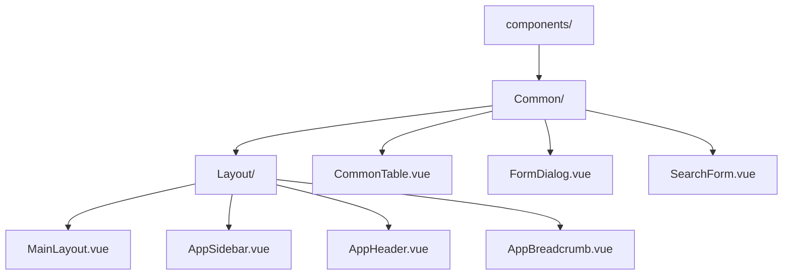

# 前端组件结构与复用规范

<cite>
**本文档引用文件**  
- [CommonTable.vue](file://AI-agent-frontend/src/components/Common/CommonTable.vue)
- [FormDialog.vue](file://AI-agent-frontend/src/components/Common/FormDialog.vue)
- [SearchForm.vue](file://AI-agent-frontend/src/components/Common/SearchForm.vue)
- [MainLayout.vue](file://AI-agent-frontend/src/components/Layout/MainLayout.vue)
- [AppSidebar.vue](file://AI-agent-frontend/src/components/Layout/AppSidebar.vue)
- [system.ts](file://AI-agent-frontend/src/store/modules/system.ts)
- [Index.vue](file://AI-agent-frontend/src/views/system/user/Index.vue)
</cite>

## 目录

1. [通用组件目录结构设计](#通用组件目录结构设计)  
2. [可复用组件实现机制](#可复用组件实现机制)  
   2.1 [CommonTable 组件](#commontable-组件)  
   2.2 [FormDialog 组件](#formdialog-组件)  
   2.3 [SearchForm 组件](#searchform-组件)  
3. [布局与内容分离设计](#布局与内容分离设计)  
   3.1 [MainLayout 与 AppSidebar 集成](#mainlayout-与-appsidebar-集成)  
4. [组件使用与扩展示例](#组件使用与扩展示例)  
5. [常见误用与性能优化](#常见误用与性能优化)

## 通用组件目录结构设计

前端通用组件采用功能模块化组织方式，位于 `src/components` 目录下，按功能划分为 `Common` 和 `Layout` 两个核心目录：

- **Common**：存放可复用的业务组件，如表格、表单、对话框等
- **Layout**：存放全局布局组件，如主布局、侧边栏、面包屑等

该设计遵循单一职责原则，将通用功能与页面布局分离，提升组件复用性和维护性。



**图示来源**  
- [CommonTable.vue](file://AI-agent-frontend/src/components/Common/CommonTable.vue)
- [FormDialog.vue](file://AI-agent-frontend/src/components/Common/FormDialog.vue)
- [SearchForm.vue](file://AI-agent-frontend/src/components/Common/SearchForm.vue)
- [MainLayout.vue](file://AI-agent-frontend/src/components/Layout/MainLayout.vue)
- [AppSidebar.vue](file://AI-agent-frontend/src/components/Layout/AppSidebar.vue)

## 可复用组件实现机制

### CommonTable 组件

`CommonTable` 是基于 Element Plus `el-table` 封装的通用表格组件，支持数据展示、分页、排序、选择等核心功能。

#### Props 定义

```typescript
export interface TableProps {
  data: any[]                    // 表格数据
  columns: TableColumn[]         // 列配置
  loading?: boolean              // 加载状态
  showSelection?: boolean        // 显示多选
  showIndex?: boolean            // 显示序号
  showActions?: boolean          // 显示操作列
  hideEdit?: boolean             // 隐藏编辑按钮
  hideDelete?: boolean           // 隐藏删除按钮
  pagination?: {                 // 分页配置
    page: number
    size: number
    total: number
  }
  // ...其他配置项
}
```

#### 事件通信机制

通过 `defineEmits` 定义事件接口，实现父子组件通信：

```typescript
defineEmits<{
  selectionChange: [selection: any[]]  // 多选变化
  sortChange: [sort: { prop: string; order: string }] // 排序变化
  edit: [row: any, index: number]      // 编辑事件
  delete: [row: any, index: number]    // 删除事件
  pageChange: [page: number]           // 页码变化
  sizeChange: [size: number]           // 每页数量变化
}>()
```

#### 插槽使用规范

支持灵活的插槽机制，用于自定义列和操作：

- **列插槽**：通过 `column.slot` 指定插槽名，实现复杂列渲染
- **操作列插槽**：`actions` 插槽允许自定义操作按钮

```vue
<CommonTable :columns="columns" :data="tableData">
  <!-- 自定义状态列 -->
  <template #status="{ row }">
    <el-tag :type="row.status === '0' ? 'success' : 'danger'">
      {{ row.status === '0' ? '启用' : '禁用' }}
    </el-tag>
  </template>

  <!-- 自定义操作列 -->
  <template #actions="{ row }">
    <el-button @click="handleAssignRole(row)">分配角色</el-button>
    <el-button @click="handleResetPassword(row)">重置密码</el-button>
  </template>
</CommonTable>
```

**组件来源**  
- [CommonTable.vue](file://AI-agent-frontend/src/components/Common/CommonTable.vue#L127-L184)

### FormDialog 组件

`FormDialog` 是通用表单对话框组件，封装了表单验证、数据绑定、对话框控制等逻辑。

#### 表单字段配置

通过 `fields` 属性配置表单字段，支持多种组件类型：

```typescript
export interface FormField {
  prop: string                    // 字段名
  label: string                   // 标签
  component: 'input' | 'select' | 'number' | 'date' | 'switch' | 'upload' | 'slot' // 组件类型
  rules?: FormRule[]              // 验证规则
  defaultValue?: any              // 默认值
  options?: Array<{ label: string; value: any }> // 选择器选项
  // ...其他配置
}
```

#### 对话框控制

使用 `v-model` 双向绑定控制显示状态，通过 `confirm` 事件提交数据：

```vue
<FormDialog
  v-model="dialogVisible"
  :title="isEdit ? '编辑用户' : '新增用户'"
  :fields="formFields"
  :form-data="currentData"
  @confirm="handleConfirm"
/>
```

#### 事件与方法暴露

通过 `defineExpose` 暴露表单操作方法，便于外部调用：

```typescript
defineExpose({
  validate,
  validateField,
  resetFields,
  clearValidate,
  formData
})
```

**组件来源**  
- [FormDialog.vue](file://AI-agent-frontend/src/components/Common/FormDialog.vue#L232-L291)

### SearchForm 组件

`SearchForm` 是通用搜索表单组件，支持字段配置、展开/收起、快捷搜索等功能。

#### 布局与字段配置

支持内联布局，自动处理常见搜索字段类型：

```typescript
export interface SearchField {
  prop: string
  label: string
  component: 'input' | 'select' | 'daterange' | 'tree-select' | 'cascader' | 'slot'
  placeholder?: string
  defaultValue?: any
  options?: Array<{ label: string; value: any }>
}
```

#### 事件处理机制

内置搜索和重置逻辑，通过事件与父组件通信：

```typescript
const handleSearch = () => {
  emit('search', { ...formData })
}

const handleReset = () => {
  formRef.value?.resetFields()
  emit('reset')
  emit('search', { ...formData })
}
```

支持回车触发搜索，提升用户体验。

**组件来源**  
- [SearchForm.vue](file://AI-agent-frontend/src/components/Common/SearchForm.vue#L146-L203)

## 布局与内容分离设计

### MainLayout 与 AppSidebar 集成

采用布局组件与业务页面分离的设计理念，`MainLayout` 作为主容器，集成 `AppSidebar` 实现全局布局。

#### 布局结构

```vue
<template>
  <div class="main-layout">
    <AppHeader />
    <div class="layout-container">
      <AppSidebar />
      <div class="main-content" :class="{ 'collapsed': systemStore.collapsed }">
        <AppBreadcrumb />
        <div class="page-content">
          <router-view />
        </div>
      </div>
    </div>
  </div>
</template>
```

#### 状态管理

通过 Pinia store 管理侧边栏折叠状态，实现组件间状态共享：

```typescript
// system.ts
export const useSystemStore = defineStore('system', {
  state: (): SystemState => ({
    collapsed: false
  }),
  actions: {
    toggleCollapsed() {
      this.collapsed = !this.collapsed
    }
  }
})
```

`AppSidebar` 监听 `systemStore.collapsed` 状态，动态调整宽度：

```vue
<el-menu :collapse="systemStore.collapsed" />
```

`MainLayout` 根据同一状态调整内容区域的 `margin-left`，实现联动效果。

#### 响应式设计

支持移动端适配，在小屏幕下侧边栏默认隐藏，通过手势或按钮控制显示。

```scss
@media (max-width: 768px) {
  .app-sidebar {
    transform: translateX(-100%);
    &.mobile-open {
      transform: translateX(0);
    }
  }
}
```

**布局来源**  
- [MainLayout.vue](file://AI-agent-frontend/src/components/Layout/MainLayout.vue#L0-L56)
- [AppSidebar.vue](file://AI-agent-frontend/src/components/Layout/AppSidebar.vue#L0-L40)
- [system.ts](file://AI-agent-frontend/src/store/modules/system.ts#L0-L114)

## 组件使用与扩展示例

### 在新页面中引入组件

以用户管理页面为例，展示通用组件的集成方式：

```vue
<template>
  <!-- 搜索表单 -->
  <SearchForm
    :fields="searchFields"
    v-model="searchData"
    @search="handleSearch"
    @reset="handleReset"
  />

  <!-- 数据表格 -->
  <CommonTable
    :data="tableData"
    :columns="tableColumns"
    :loading="loading"
    :pagination="pagination"
    @page-change="handlePageChange"
    @edit="handleEdit"
    @delete="handleDelete"
  >
    <!-- 自定义操作列 -->
    <template #actions="{ row }">
      <el-button @click="handleAssignRole(row)">分配角色</el-button>
      <el-button @click="handleResetPassword(row)">重置密码</el-button>
    </template>
  </CommonTable>

  <!-- 编辑对话框 -->
  <FormDialog
    v-model="dialogVisible"
    :title="isEdit ? '编辑用户' : '新增用户'"
    :fields="formFields"
    :form-data="currentData"
    @confirm="handleSubmit"
  />
</template>
```

### 扩展通用组件

在不破坏原有封装的前提下，可通过以下方式扩展功能：

1. **属性覆盖**：通过 Props 覆盖默认行为
2. **插槽定制**：使用插槽实现个性化渲染
3. **事件监听**：监听事件并添加额外逻辑
4. **方法调用**：调用暴露的方法进行表单操作

```typescript
// 扩展搜索功能，添加高级搜索
const advancedSearchFields = [
  ...baseFields,
  { prop: 'createTime', label: '创建时间', component: 'daterange' }
]

// 扩展表格，添加自定义工具栏
const customToolbar = () => {
  return (
    <div class="toolbar">
      <el-button type="primary" @click="handleExport">导出</el-button>
      <el-button @click="handleImport">导入</el-button>
    </div>
  )
}
```

## 常见误用与性能优化

### 常见误用场景

1. **过度使用 v-if**：在表格列中频繁使用 `v-if` 可能导致渲染性能下降，建议使用 `v-show` 或条件渲染列配置
2. **未正确销毁组件**：未设置 `destroy-on-close` 可能导致内存泄漏
3. **滥用插槽**：过度使用插槽会增加组件复杂度，建议简单逻辑通过 `formatter` 实现
4. **忽略分页**：大数据量未启用分页会导致页面卡顿

### 性能优化建议

1. **虚拟滚动**：对于大量数据，建议启用 `el-table` 的 `height` 或 `max-height` 属性，启用虚拟滚动
2. **懒加载**：树形表格使用 `lazy` 模式，按需加载子节点
3. **防抖搜索**：对搜索操作添加防抖处理，避免频繁请求
4. **合理使用 watch**：避免在 `watch` 中执行复杂操作，使用 `immediate` 和 `deep` 时需谨慎
5. **组件缓存**：使用 `keep-alive` 缓存频繁切换的页面组件

```typescript
// 搜索防抖示例
import { debounce } from 'lodash-es'

const handleSearch = debounce(() => {
  // 执行搜索逻辑
}, 300)
```

合理使用通用组件，遵循封装规范，可显著提升开发效率和系统性能。

**示例来源**  
- [Index.vue](file://AI-agent-frontend/src/views/system/user/Index.vue#L99-L151)