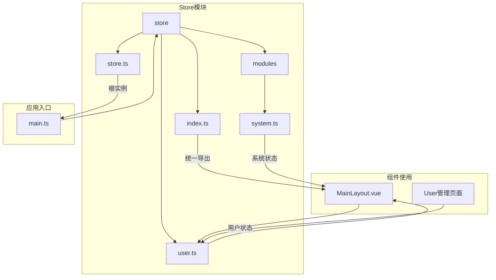

# 基于Pinia的状态管理规范

<cite>
**本文档引用的文件**  
- [index.ts](file://AI-agent-frontend\src\store\index.ts)
- [store.ts](file://AI-agent-frontend\src\store\store.ts)
- [system.ts](file://AI-agent-frontend\src\store\modules\system.ts)
- [user.ts](file://AI-agent-frontend\src\store\user.ts)
- [main.ts](file://AI-agent-frontend\src\main.ts)
- [MainLayout.vue](file://AI-agent-frontend\src\components\Layout\MainLayout.vue)
- [Index.vue](file://AI-agent-frontend\src\views\system\user\Index.vue)
</cite>

## 目录
1. [项目结构](#项目结构)
2. [根Store创建与模块注册](#根store创建与模块注册)
3. [系统状态模块分析](#系统状态模块分析)
4. [用户状态模块分析](#用户状态模块分析)
5. [组件中访问Store的正确方式](#组件中访问store的正确方式)
6. [高级用法与最佳实践](#高级用法与最佳实践)

## 项目结构

前端项目采用模块化状态管理架构，Pinia相关文件集中存放在`src/store`目录下，通过清晰的分层设计实现状态的高效管理。



**图示来源**  
- [index.ts](file://AI-agent-frontend\src\store\index.ts)
- [store.ts](file://AI-agent-frontend\src\store\store.ts)
- [system.ts](file://AI-agent-frontend\src\store\modules\system.ts)
- [user.ts](file://AI-agent-frontend\src\store\user.ts)
- [main.ts](file://AI-agent-frontend\src\main.ts)
- [MainLayout.vue](file://AI-agent-frontend\src\components\Layout\MainLayout.vue)

**本节来源**  
- [index.ts](file://AI-agent-frontend\src\store\index.ts)
- [store.ts](file://AI-agent-frontend\src\store\store.ts)

## 根Store创建与模块注册

### 根实例创建

Pinia根实例在`store.ts`文件中创建，并集成持久化插件，确保关键状态在页面刷新后仍能保持。

```typescript
import { createPinia } from 'pinia'
import piniaPluginPersistedstate from 'pinia-plugin-persistedstate'

const pinia = createPinia()
pinia.use(piniaPluginPersistedstate)

export default pinia
```

**关键点：**
- 使用`createPinia()`创建根实例
- 通过`pinia.use()`注册`pinia-plugin-persistedstate`插件实现状态持久化
- 导出默认实例供应用挂载使用

### 应用挂载

在`main.ts`中，将Pinia实例通过`app.use()`方法挂载到Vue应用上。

```typescript
import { createApp } from 'vue'
import App from './App.vue'
import router from './router/index'
import pinia from "@/store/store"

const app = createApp(App)
app.use(router)
app.use(pinia)
app.mount('#app')
```

### 模块注册与导出

`index.ts`文件作为Store模块的统一入口，负责导出各个功能模块的Store实例。

```typescript
/**
 * Store模块统一导出
 */
export { useUserStore } from '@/store/user'
export { useSystemStore } from '@/store/modules/system'

// 导出store实例
export { default as pinia } from '@/store/store'
```

**模块注册机制：**
1. 每个功能模块独立创建Store（如user.ts、system.ts）
2. 在`index.ts`中统一导入并导出，形成统一的API接口
3. 组件通过`@/store`路径即可访问所有Store模块，无需关心具体文件路径

**本节来源**  
- [store.ts](file://AI-agent-frontend\src\store\store.ts#L0-L6)
- [main.ts](file://AI-agent-frontend\src\main.ts#L0-L21)
- [index.ts](file://AI-agent-frontend\src\store\index.ts#L0-L7)

## 系统状态模块分析

`system.ts`文件定义了系统管理相关的全局状态，包括菜单、角色、部门、用户等数据。

### 状态定义

通过`SystemState`接口明确定义了系统模块的状态结构：

```typescript
export interface SystemState {
  menuList: MenuInfo[]
  roleList: RoleInfo[]
  deptList: DeptInfo[]
  userList: UserInfo[]
  collapsed: boolean
  pagination: {
    page: number
    size: number
    total: number
  }
}
```

### State初始化

```typescript
state: (): SystemState => ({
  menuList: [],
  roleList: [],
  deptList: [],
  userList: [],
  collapsed: false,
  pagination: {
    page: 1,
    size: 10,
    total: 0
  }
}),
```

### Getters计算属性

定义了多个计算属性，用于从原始数据中派生出常用数据结构：

```typescript
getters: {
  topMenus: (state) => {
    return state.menuList.filter(menu => menu.parent_id === 0)
  },
  menuMap: (state) => {
    const map = new Map()
    state.menuList.forEach(menu => {
      map.set(menu.menu_id, menu)
    })
    return map
  },
  roleMap: (state) => {
    const map = new Map()
    state.roleList.forEach(role => {
      map.set(role.role_id, role)
    })
    return map
  },
  deptMap: (state) => {
    const map = new Map()
    state.deptList.forEach(dept => {
      map.set(dept.dept_id, dept)
    })
    return map
  },
  userMap: (state) => {
    const map = new Map()
    state.userList.forEach(user => {
      map.set(user.user_id, user)
    })
    return map
  }
}
```

**Getters用途：**
- `topMenus`：获取顶级菜单项
- `menuMap`、`roleMap`等：创建ID到对象的映射，便于快速查找

### Actions操作方法

提供了操作状态的公共方法：

```typescript
actions: {
  toggleCollapsed() {
    this.collapsed = !this.collapsed
  },
  setCollapsed(collapsed: boolean) {
    this.collapsed = collapsed
  },
  setMenuList(menuList: MenuInfo[]) {
    this.menuList = menuList
  },
  // ...其他set方法
  setPagination(pagination: Partial<SystemState['pagination']>) {
    this.pagination = { ...this.pagination, ...pagination }
  },
  resetPagination() {
    this.pagination = {
      page: 1,
      size: 10,
      total: 0
    }
  }
}
```

### 状态持久化

通过`persist`配置实现状态持久化：

```typescript
persist: {
  key: 'system-store',
  storage: localStorage
}
```

**本节来源**  
- [system.ts](file://AI-agent-frontend\src\store\modules\system.ts#L0-L114)

## 用户状态模块分析

`user.ts`文件定义了用户相关的状态管理，是创建新Store模块的优秀参考。

### 状态定义与初始化

```typescript
export interface UserState {
  token: string | null
  userInfo: UserInfo | null
  permissions: string[]
  roles: string[]
  menus: MenuInfo[]
  loading: boolean
}

state: (): UserState => ({
  token: getToken() || null,
  userInfo: null,
  permissions: [],
  roles: [],
  menus: [],
  loading: false
}),
```

### Getters计算属性

提供了丰富的用户状态判断方法：

```typescript
getters: {
  isLoggedIn: (state) => !!state.token,
  getToken: (state) => state.token,
  username: (state) => state.userInfo?.username || '',
  avatar: (state) => state.userInfo?.avatar || '',
  hasRole: (state) => (role: string) => state.roles.includes(role),
  hasPermission: (state) => (permission: string) => state.permissions.includes(permission),
  // ...其他权限判断方法
}
```

### Actions异步操作

包含完整的用户认证流程：

```typescript
actions: {
  async login(username: string, password: string): Promise<boolean> {
    try {
      this.loading = true
      const response = await AuthApi.login({ username, password })
      
      if (response.success && response.data) {
        const { access_token, user_info, permissions } = response.data
        
        this.setToken(access_token)
        this.setUserInfo(user_info)
        this.setPermissions(permissions)
        
        return true
      }
      return false
    } catch (error) {
      console.error('登录失败:', error)
      return false
    } finally {
      this.loading = false
    }
  },
  
  async getUserInfo(): Promise<void> {
    if (!this.token || !this.userInfo?.user_id) return
    
    try {
      this.loading = true
      const response = await UserApi.getUserById(this.userInfo.user_id)
      
      if (response.success && response.data) {
        this.setUserInfo(response.data)
      }
    } catch (error) {
      console.error('获取用户信息失败:', error)
    } finally {
      this.loading = false
    }
  },
  // ...其他异步操作
}
```

**异步操作特点：**
- 使用`async/await`处理异步请求
- 包含完整的错误处理和加载状态管理
- 通过调用内部action方法更新状态

### 状态持久化

```typescript
persist: {
  key: 'user-store',
  storage: localStorage
}
```

**本节来源**  
- [user.ts](file://AI-agent-frontend\src\store\user.ts#L0-L188)

## 组件中访问Store的正确方式

### Setup语法中的使用

在`MainLayout.vue`中展示了在`<script setup>`语法中正确使用Store的方式：

```vue
<script setup lang="ts">
import { onMounted } from 'vue'
import { useUserStore, useSystemStore } from '@/store'

const userStore = useUserStore()
const systemStore = useSystemStore()

onMounted(async () => {
  if (userStore.token) {
    await userStore.getUserInfo()
    await userStore.getUserPermissions()
    await userStore.getUserMenus()
  }
})
</script>
```

### 解构响应性问题及解决方案

当直接解构Store的state时，会失去响应性：

```typescript
// ❌ 错误：失去响应性
const { token, userInfo } = useUserStore()

// ✅ 正确：保持响应性
const userStore = useUserStore()
// 或使用storeToRefs
const { token, userInfo } = storeToRefs(useUserStore())
```

虽然代码库中未直接使用`storeToRefs`，但`auto-import.d.ts`文件已自动导入该函数，可在需要时使用。

### 组件生命周期协同

在`onMounted`钩子中调用Store的异步方法，实现组件初始化时的数据加载：

```typescript
onMounted(async () => {
  if (userStore.token) {
    await userStore.getUserInfo()
    await userStore.getUserPermissions()
    await userStore.getUserMenus()
  }
})
```

**本节来源**  
- [MainLayout.vue](file://AI-agent-frontend\src\components\Layout\MainLayout.vue#L0-L56)
- [user.ts](file://AI-agent-frontend\src\store\user.ts#L85-L132)

## 高级用法与最佳实践

### 创建新的Store模块

以`jobStore`为例，创建新的Store模块：

```typescript
// store/modules/job.ts
import { defineStore } from 'pinia'
import type { JobInfo, JobStatus } from '@/api/types'

export interface JobState {
  jobList: JobInfo[]
  currentJob: JobInfo | null
  filterStatus: JobStatus | null
  pagination: {
    page: number
    size: number
    total: number
  }
}

export const useJobStore = defineStore('job', {
  state: (): JobState => ({
    jobList: [],
    currentJob: null,
    filterStatus: null,
    pagination: {
      page: 1,
      size: 10,
      total: 0
    }
  }),

  getters: {
    activeJobs: (state) => {
      return state.jobList.filter(job => job.status === 'active')
    },
    jobMap: (state) => {
      const map = new Map()
      state.jobList.forEach(job => {
        map.set(job.job_id, job)
      })
      return map
    }
  },

  actions: {
    async fetchJobs() {
      try {
        const response = await JobApi.getJobList({
          page: this.pagination.page,
          size: this.pagination.size,
          status: this.filterStatus
        })
        
        if (response.success && response.data) {
          this.jobList = response.data.items
          this.pagination.total = response.data.total
        }
      } catch (error) {
        console.error('获取任务列表失败:', error)
      }
    },
    
    async createJob(data: JobCreateRequest) {
      try {
        const response = await JobApi.createJob(data)
        if (response.success && response.data) {
          this.jobList.unshift(response.data)
          return true
        }
        return false
      } catch (error) {
        console.error('创建任务失败:', error)
        return false
      }
    },
    
    updateFilterStatus(status: JobStatus | null) {
      this.filterStatus = status
      this.pagination.page = 1
      this.fetchJobs()
    },
    
    resetPagination() {
      this.pagination = {
        page: 1,
        size: 10,
        total: 0
      }
    }
  },

  persist: {
    key: 'job-store',
    storage: localStorage
  }
})
```

然后在`index.ts`中导出：

```typescript
export { useJobStore } from '@/store/modules/job'
```

### 异步数据加载与缓存策略

结合后端的缓存机制，前端Store可实现智能缓存：

```typescript
// 在actions中实现缓存逻辑
actions: {
  async getUserInfo(userId: number): Promise<void> {
    // 检查内存中是否已有数据
    if (this.userMap.has(userId)) {
      return
    }
    
    try {
      this.loading = true
      const response = await UserApi.getUserById(userId)
      
      if (response.success && response.data) {
        this.setUserList([...this.userList, response.data])
      }
    } catch (error) {
      console.error('获取用户信息失败:', error)
    } finally {
      this.loading = false
    }
  }
}
```

### 状态持久化配置

通过`persist`选项配置持久化策略：

```typescript
persist: {
  key: 'custom-store-key',
  storage: localStorage,
  // 可配置持久化的路径
  paths: ['token', 'userInfo', 'menus'],
  // 或排除某些状态
  // exclude: ['loading']
}
```

### 类型推导优势

使用`defineStore`配合TypeScript接口，获得完整的类型推导：

```typescript
// 定义接口
export interface SystemState { /* ... */ }

// defineStore自动推导类型
export const useSystemStore = defineStore('system', {
  state: (): SystemState => ({ /* ... */ }),
  // getters和actions中的this自动具有SystemState类型
  getters: {
    topMenus: (state) => { /* state类型为SystemState */ }
  },
  actions: {
    toggleCollapsed() {
      // this自动具有SystemState的所有属性和方法
      this.collapsed = !this.collapsed
    }
  }
})
```

**最佳实践总结：**
1. **模块化设计**：按功能划分Store模块
2. **统一导出**：通过`index.ts`统一管理模块导出
3. **类型安全**：使用TypeScript接口定义状态结构
4. **合理划分**：state存放数据，getters处理派生数据，actions处理业务逻辑
5. **持久化**：对需要跨会话保持的状态启用持久化
6. **异步处理**：在actions中处理异步操作，包含完整的错误处理
7. **响应性保持**：避免直接解构state，使用`storeToRefs`保持响应性

**本节来源**  
- [user.ts](file://AI-agent-frontend\src\store\user.ts)
- [system.ts](file://AI-agent-frontend\src\store\modules\system.ts)
- [store.ts](file://AI-agent-frontend\src\store\store.ts)
- [AI-agent-backend\app\utils\memory_cache.py](file://AI-agent-backend\app\utils\memory_cache.py)
- [AI-agent-backend\app\utils\redis_client.py](file://AI-agent-backend\app\utils\redis_client.py)