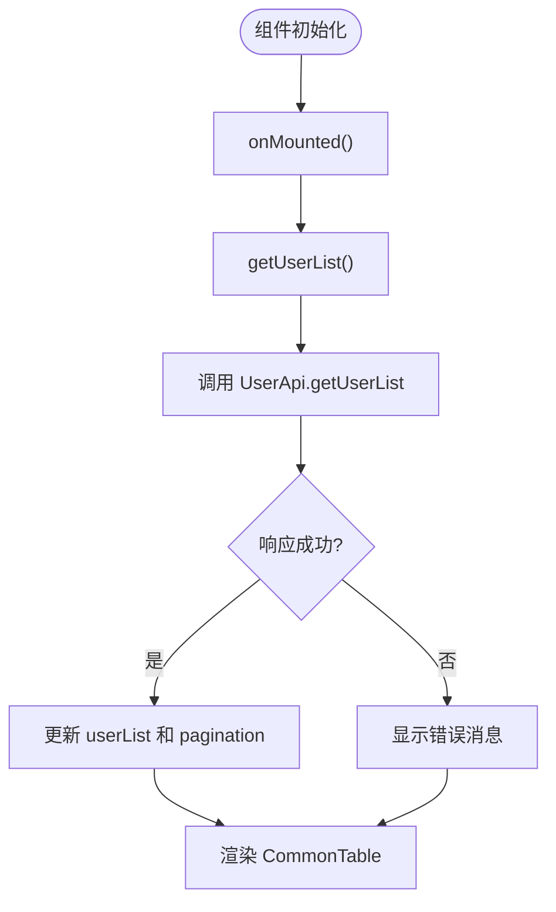
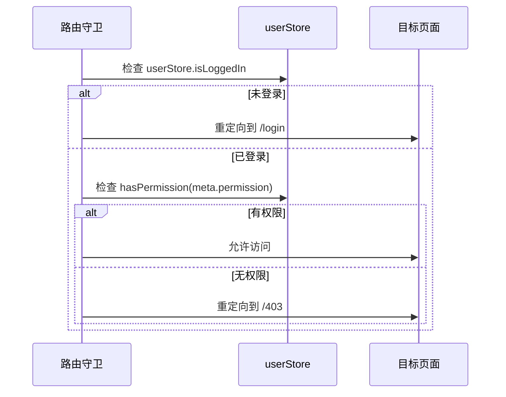

# 新功能页面开发流程

<cite>
**本文档引用的文件**  
- [user/Index.vue](file://AI-agent-frontend/src/views/system/user/Index.vue)
- [index.ts](file://AI-agent-frontend/src/router/index.ts)
- [permission.ts](file://AI-agent-frontend/src/utils/permission.ts)
- [permission.ts](file://AI-agent-frontend/src/directives/permission.ts)
- [user.ts](file://AI-agent-frontend/src/store/user.ts)
- [CommonTable.vue](file://AI-agent-frontend/src/components/Common/CommonTable.vue)
- [FormDialog.vue](file://AI-agent-frontend/src/components/Common/FormDialog.vue)
</cite>

## 目录

1. [新功能页面开发流程](#新功能页面开发流程)
2. [项目结构分析](#项目结构分析)
3. [用户管理页面组件分析](#用户管理页面组件分析)
4. [路由注册与权限配置](#路由注册与权限配置)
5. [动态路由与按钮级权限控制](#动态路由与按钮级权限控制)
6. [通用组件集成与响应式数据管理](#通用组件集成与响应式数据管理)
7. [类型定义与错误处理](#类型定义与错误处理)

## 项目结构分析

本项目采用前后端分离架构，前端基于 Vue 3 + TypeScript + Vite 构建，后端为 Python FastAPI 服务。前端代码位于 `AI-agent-frontend` 目录，核心结构如下：

```mermaid
graph TB
subgraph "前端(src)"
Views[views目录<br>页面组件]
Components[components目录<br>通用组件]
Api[api目录<br>接口模块]
Router[router目录<br>路由配置]
Store[store目录<br>状态管理]
Utils[utils目录<br>工具函数]
end
Views --> Components : 使用
Views --> Api : 调用
Views --> Store : 依赖
Router --> Views : 导入
Store --> Api : 调用
```

**Diagram sources**  
- [user/Index.vue](file://AI-agent-frontend/src/views/system/user/Index.vue)
- [index.ts](file://AI-agent-frontend/src/router/index.ts)

**Section sources**  
- [user/Index.vue](file://AI-agent-frontend/src/views/system/user/Index.vue)
- [index.ts](file://AI-agent-frontend/src/router/index.ts)

## 用户管理页面组件分析

以 `views/system/user/Index.vue` 为例，展示 Vue 3 组件的标准开发模式。该组件采用 `defineComponent` 和 `setup` 语法糖，实现用户管理功能。

### 组件结构与响应式数据

```vue
<script setup lang="ts">
import { ref, reactive, computed, onMounted } from 'vue'
// 响应式数据
const loading = ref(false)
const userList = ref<UserInfo[]>([])
const searchParams = reactive({ keyword: '', status: '' })
</script>
```

组件使用 `ref` 和 `reactive` 创建响应式数据，`onMounted` 钩子在挂载后自动加载用户列表。

### 集成 CommonTable 实现数据展示

通过 `CommonTable` 组件实现表格数据展示，支持分页、搜索、多选等特性。



**Diagram sources**  
- [user/Index.vue](file://AI-agent-frontend/src/views/system/user/Index.vue)

**Section sources**  
- [user/Index.vue](file://AI-agent-frontend/src/views/system/user/Index.vue)

## 路由注册与权限配置

### 路由注册流程

在 `router/index.ts` 中注册新路由，采用嵌套路由结构组织页面。

```typescript
{
  path: '/system',
  name: 'System',
  meta: { title: '系统管理', icon: 'Setting' },
  children: [
    {
      path: '/system/user',
      name: 'UserManagement',
      component: () => import('@/views/system/user/Index.vue'),
      meta: { title: '用户管理', permission: 'user:view' }
    }
  ]
}
```

### Meta 字段配置说明

| 字段 | 类型 | 说明 |
|------|------|------|
| `title` | string | 页面标题，用于浏览器标签和面包屑 |
| `icon` | string | 菜单图标，对应 Element Plus 图标 |
| `permission` | string | 页面级权限标识，用于 RBAC 控制 |
| `requiresAuth` | boolean | 是否需要认证访问 |

**Section sources**  
- [index.ts](file://AI-agent-frontend/src/router/index.ts)

## 动态路由与按钮级权限控制

### 权限控制实现机制

系统通过 `store/user.ts` 管理用户权限状态，结合路由守卫实现动态权限控制。



**Diagram sources**  
- [index.ts](file://AI-agent-frontend/src/router/index.ts)
- [user.ts](file://AI-agent-frontend/src/store/user.ts)

### 按钮级权限指令

通过自定义指令 `v-permission` 实现按钮级权限控制。

```vue
<el-button v-permission="'user:add'" @click="handleAdd">新增用户</el-button>
<el-button v-permission:every="['user:edit', 'user:delete']" @click="handleBatchDelete">批量删除</el-button>
```

指令支持以下语法：
- `v-permission="'perm:code'"`：单权限检查
- `v-permission="['a', 'b']"`：任一权限匹配（some）
- `v-permission:every="['a', 'b']"`：所有权限匹配（every）
- `v-role="'admin'"`：角色检查

**Section sources**  
- [permission.ts](file://AI-agent-frontend/src/directives/permission.ts)
- [permission.ts](file://AI-agent-frontend/src/utils/permission.ts)

## 通用组件集成与响应式数据管理

### CommonTable 组件集成

`CommonTable` 是封装的通用表格组件，支持灵活配置。

```vue
<CommonTable
  v-model:loading="loading"
  :data="userList"
  :columns="tableColumns"
  :pagination="pagination"
  @selection-change="handleSelectionChange"
  @page-change="handlePageChange"
/>
```

#### 表格列配置示例

```typescript
const tableColumns: TableColumn[] = [
  { prop: 'username', label: '用户名', minWidth: 120 },
  { prop: 'status', label: '状态', width: 80, slot: 'status' }
]
```

### FormDialog 表单交互

使用 `FormDialog` 组件统一管理表单弹窗。

```vue
<FormDialog
  v-model="userDialogVisible"
  :title="isEdit ? '编辑用户' : '新增用户'"
  :fields="userFormFields"
  :form-data="currentUser"
  :rules="userFormRules"
  @confirm="handleUserFormConfirm"
/>
```

支持动态表单字段、验证规则和异步提交。

**Section sources**  
- [CommonTable.vue](file://AI-agent-frontend/src/components/Common/CommonTable.vue)
- [FormDialog.vue](file://AI-agent-frontend/src/components/Common/FormDialog.vue)

## 类型定义与错误处理

### TypeScript 类型定义

系统在 `api/types.ts` 中定义统一类型接口。

```typescript
interface UserInfo {
  user_id: number
  username: string
  email: string
  status: '0' | '1'
}

interface TableColumn {
  prop: string
  label: string
  width?: number
  slot?: string
}
```

### 错误边界处理

采用 try-catch 捕获异步操作异常，结合 Element Plus 消息组件反馈用户。

```typescript
const getUserList = async () => {
  try {
    loading.value = true
    // API 调用
  } catch (error) {
    ElMessage.error('获取用户列表失败')
  } finally {
    loading.value = false
  }
}
```

同时在路由守卫中处理权限异常，确保系统稳定性。

**Section sources**  
- [user/Index.vue](file://AI-agent-frontend/src/views/system/user/Index.vue)
- [user.ts](file://AI-agent-frontend/src/store/user.ts)