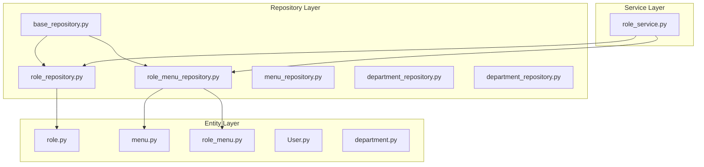
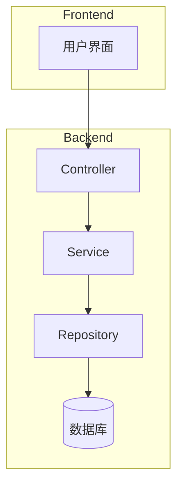
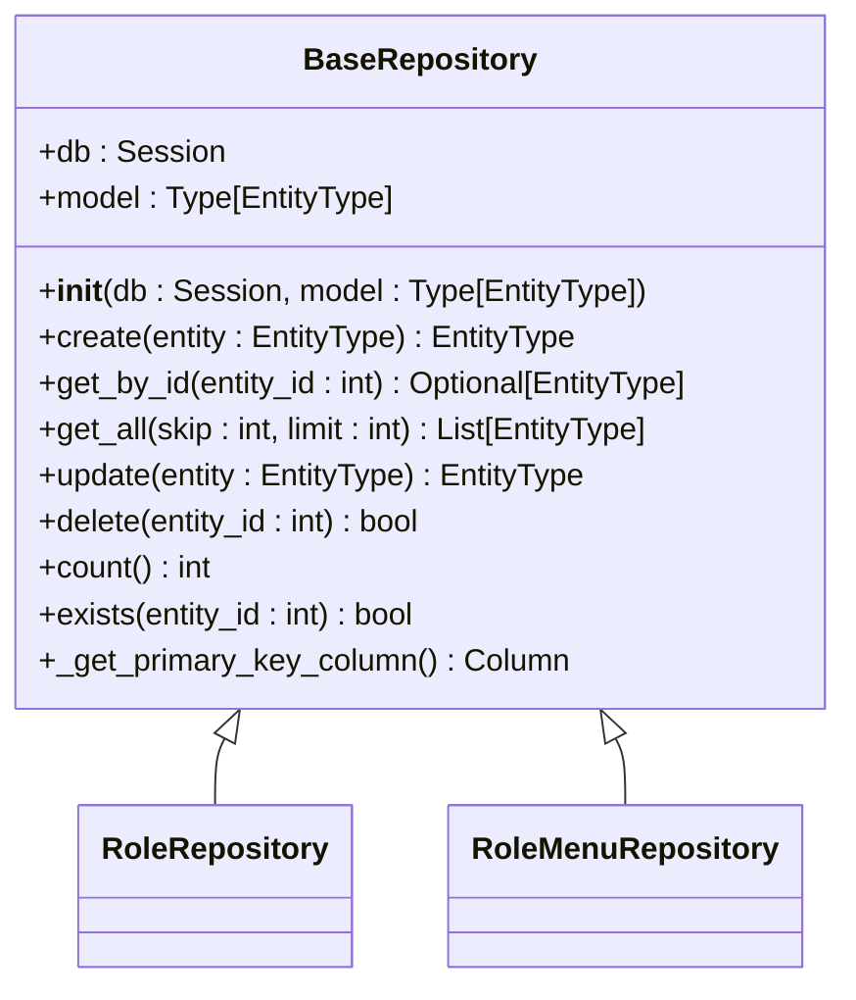
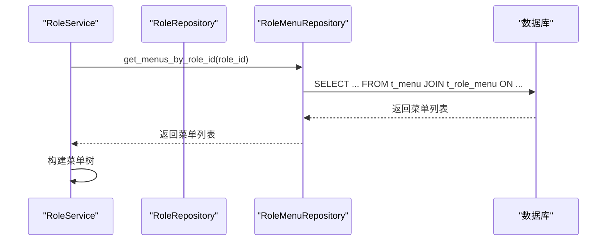
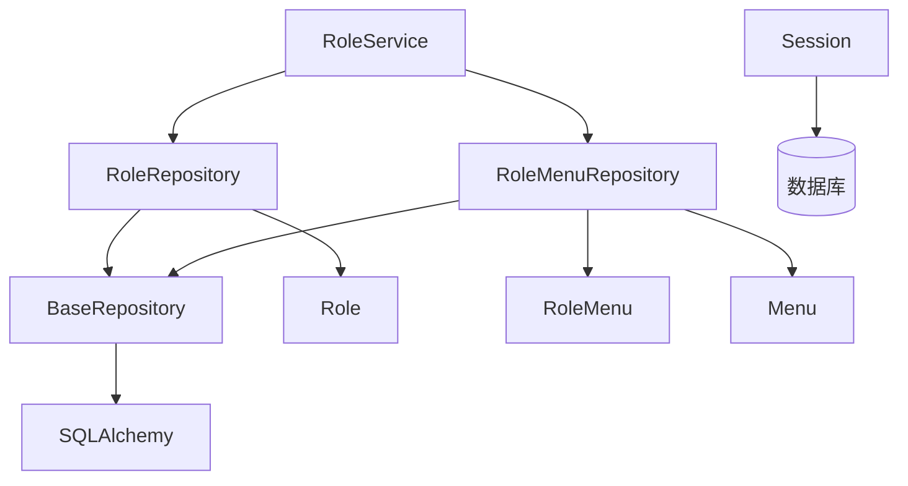

# 仓库层（Repository）

<cite>
**本文档中引用的文件**  
- [base_repository.py](file://AI-agent-backend\app\repository\base_repository.py)
- [role_repository.py](file://AI-agent-backend\app\repository\role_repository.py)
- [role.py](file://AI-agent-backend\app\entity\role.py)
- [role_menu.py](file://AI-agent-backend\app\entity\role_menu.py)
- [menu.py](file://AI-agent-backend\app\entity\menu.py)
- [role_menu_repository.py](file://AI-agent-backend\app\repository\role_menu_repository.py)
- [role_service.py](file://AI-agent-backend\app\service\role_service.py)
- [session.py](file://AI-agent-backend\app\db\session.py)
- [menu_repository.py](file://AI-agent-backend\app\repository\menu_repository.py) - *在提交622cc54487990eaf5bb4db0862537e42e1934e8c中更新*
- [menu_service.py](file://AI-agent-backend\app\service\menu_service.py) - *在提交d78cc4521c690a69b2a45b64ab3341eb8fdc5437中更新*
- [menu_controller.py](file://AI-agent-backend\app\controller\menu_controller.py) - *在提交d78cc4521c690a69b2a45b64ab3341eb8fdc5437中更新*
- [menu_dto.py](file://AI-agent-backend\app\dto\menu_dto.py) - *在提交d78cc4521c690a69b2a45b64ab3341eb8fdc5437中更新*
</cite>

## 更新摘要
**变更内容**  
- 更新了引言、核心组件、详细组件分析和性能考虑部分，以反映菜单实体和仓库的最新变更
- 新增了关于菜单创建和修改时间字段的说明
- 扩展了关于动态用户路由和菜单树构建的分析
- 更新了相关文件引用以包含新修改的文件
- 增强了对`get_user_menu_tree`方法的说明

## 目录
1. [引言](#引言)
2. [项目结构](#项目结构)
3. [核心组件](#核心组件)
4. [架构概述](#架构概述)
5. [详细组件分析](#详细组件分析)
6. [依赖分析](#依赖分析)
7. [性能考虑](#性能考虑)
8. [故障排除指南](#故障排除指南)
9. [结论](#结论)

## 引言
本文档全面记录了基于SQLAlchemy的仓库层（Repository）实现机制，重点阐述了Repository模式如何有效解耦业务逻辑与数据库操作。通过分析`base_repository.py`中的通用CRUD方法抽象设计，结合`role_repository.py`展示复杂查询（如角色关联菜单）的具体实现。同时，阐明了会话管理、事务边界、懒加载与急加载策略的应用场景，并提供性能优化建议，如使用JOIN优化N+1查询问题，结合实际代码说明数据持久化流程。根据最新代码变更，本文档已更新以反映菜单实体新增的创建和修改时间字段，以及支持动态用户路由的菜单树构建功能。

## 项目结构
仓库层位于`AI-agent-backend/app/repository`目录下，是数据访问的核心模块。该层通过Repository模式封装了对数据库的直接操作，为上层服务（Service）提供统一的数据访问接口。其主要职责包括执行CRUD操作、构建复杂查询以及管理数据持久化过程。

**图示来源**  
- [base_repository.py](file://AI-agent-backend\app\repository\base_repository.py)
- [role_repository.py](file://AI-agent-backend\app\repository\role_repository.py)
- [role_menu_repository.py](file://AI-agent-backend\app\repository\role_menu_repository.py)
- [role.py](file://AI-agent-backend\app\entity\role.py)
- [role_menu.py](file://AI-agent-backend\app\entity\role_menu.py)
- [menu.py](file://AI-agent-backend\app\entity\menu.py)
- [role_service.py](file://AI-agent-backend\app\service\role_service.py)

## 核心组件
仓库层的核心是`BaseRepository`基类，它定义了所有Repository的通用CRUD操作。具体的业务实体（如角色、菜单）通过继承此基类来获得基本的数据访问能力。`RoleRepository`和`RoleMenuRepository`是两个关键的具体实现，分别负责角色主数据和角色-菜单关联数据的访问。根据最新变更，`MenuRepository`已更新以支持创建和修改时间字段的存储与查询，并优化了查询逻辑以支持构建用户菜单树。

**组件来源**  
- [base_repository.py](file://AI-agent-backend\app\repository\base_repository.py#L1-L225)
- [role_repository.py](file://AI-agent-backend\app\repository\role_repository.py#L1-L100)
- [role_menu_repository.py](file://AI-agent-backend\app\repository\role_menu_repository.py#L1-L195)
- [menu_repository.py](file://AI-agent-backend\app\repository\menu_repository.py#L1-L161) - *在提交622cc54487990eaf5bb4db0862537e42e1934e8c中更新*

## 架构概述
系统采用分层架构，仓库层位于数据访问层，其上是服务层，其下是数据库。`BaseRepository`作为所有具体仓库的父类，提供了`create`、`get_by_id`、`update`、`delete`等通用方法。具体仓库类（如`RoleRepository`）则在此基础上扩展特定于业务的查询方法。

**图示来源**  
- [role_service.py](file://AI-agent-backend\app\service\role_service.py)
- [role_repository.py](file://AI-agent-backend\app\repository\role_repository.py)
- [session.py](file://AI-agent-backend\app\db\session.py)

## 详细组件分析
### BaseRepository 分析
`BaseRepository`是一个泛型基类，通过SQLAlchemy的ORM功能实现了对任意实体的通用CRUD操作。它通过构造函数接收`Session`和`model`参数，将数据库会话和实体模型绑定到实例上。

#### 类图

**图示来源**  
- [base_repository.py](file://AI-agent-backend\app\repository\base_repository.py#L1-L225)

**组件来源**  
- [base_repository.py](file://AI-agent-backend\app\repository\base_repository.py#L1-L225)

### RoleRepository 分析
`RoleRepository`继承自`BaseRepository`，专门用于处理`Role`实体。它在通用CRUD的基础上，增加了与角色业务相关的查询方法。

#### 方法分析
- **get_by_name**: 根据角色名称精确查询，用于检查名称唯一性。
- **get_all_active**: 获取所有有效角色，目前未实现软删除过滤。
- **exists_by_name**: 检查角色名称是否存在，支持在更新时排除自身ID。
- **search_by_name**: 根据关键词模糊搜索角色。
- **get_roles_with_pagination**: 分页查询角色，返回数据列表和总数。

**组件来源**  
- [role_repository.py](file://AI-agent-backend\app\repository\role_repository.py#L1-L100)
- [role.py](file://AI-agent-backend\app\entity\role.py#L1-L90)

### RoleMenuRepository 分析
`RoleMenuRepository`是分析复杂查询和性能优化的关键。它处理`RoleMenu`关联实体，实现了角色与菜单之间的多对多关系操作。

#### 复杂查询实现
该仓库通过SQLAlchemy的`join`操作实现了高效的关联查询，有效避免了N+1查询问题。

**图示来源**  
- [role_menu_repository.py](file://AI-agent-backend\app\repository\role_menu_repository.py#L45-L91)
- [menu_repository.py](file://AI-agent-backend\app\repository\menu_repository.py#L135-L152)

#### 关键方法
- **get_menus_by_role_id**: 使用`join`直接从`Menu`表和`RoleMenu`表中查询指定角色拥有的所有菜单，并按`ORDER_NUM`排序。这是解决N+1问题的典范。
- **get_menu_ids_by_role_id**: 仅查询`MENU_ID`，减少数据传输量，适用于只需要ID的场景。
- **get_permissions_by_role_id**: 查询角色拥有的所有权限标识（`perms`），用于权限校验。
- **assign_menus_to_role**: 实现“先删除后插入”的权限分配策略，确保权限的原子性更新。

**组件来源**  
- [role_menu_repository.py](file://AI-agent-backend\app\repository\role_menu_repository.py#L1-L195)
- [role_menu.py](file://AI-agent-backend\app\entity\role_menu.py#L1-L61)
- [menu.py](file://AI-agent-backend\app\entity\menu.py#L1-L166)

### MenuRepository 分析
`MenuRepository`继承自`BaseRepository`，专门用于处理`Menu`实体。根据最新变更，该仓库已更新以支持创建和修改时间字段的存储与查询，并优化了查询逻辑以支持构建用户菜单树。

#### 新增字段支持
`Menu`实体新增了`create_time`和`modify_time`两个时间戳字段，分别记录菜单的创建时间和最后修改时间。这些字段在数据库层面自动维护，确保了数据的完整性和可追溯性。

**组件来源**  
- [menu.py](file://AI-agent-backend\app\entity\menu.py#L110-L155) - *在提交622cc54487990eaf5bb4db0862537e42e1934e8c中更新*

#### 动态路由支持
`MenuRepository`的查询方法为`MenuService.get_user_menu_tree`提供了基础支持，该方法用于构建用户的动态路由结构，满足前端动态加载路由的需求。

**组件来源**  
- [menu_service.py](file://AI-agent-backend\app\service\menu_service.py#L354-L399) - *在提交d78cc4521c690a69b2a45b64ab3341eb8fdc5437中更新*
- [menu_controller.py](file://AI-agent-backend\app\controller\menu_controller.py#L350-L384) - *在提交d78cc4521c690a69b2a45b64ab3341eb8fdc5437中更新*
- [menu_dto.py](file://AI-agent-backend\app\dto\menu_dto.py#L250-L341) - *在提交d78cc4521c690a69b2a45b64ab3341eb8fdc5437中更新*

## 依赖分析
仓库层的依赖关系清晰，体现了良好的分层设计。

**图示来源**  
- [base_repository.py](file://AI-agent-backend\app\repository\base_repository.py)
- [role_repository.py](file://AI-agent-backend\app\repository\role_repository.py)
- [role_menu_repository.py](file://AI-agent-backend\app\repository\role_menu_repository.py)
- [role_service.py](file://AI-agent-backend\app\service\role_service.py)

## 性能考虑
### N+1 查询问题优化
在未使用`join`的情况下，获取一个角色的所有菜单需要先查询角色，再根据角色ID查询关联表，最后对每个菜单ID查询菜单详情，形成N+1次查询。`RoleMenuRepository.get_menus_by_role_id`通过一次`JOIN`查询解决了此问题，极大提升了性能。

### 懒加载与急加载
当前代码库中未显式使用SQLAlchemy的`joinedload`、`selectinload`等急加载策略。所有关联关系（如`Role`中的`role_menus`）默认为懒加载（lazy loading），即在访问关联属性时才会触发数据库查询。对于需要频繁访问关联数据的场景，建议在查询时使用急加载策略以减少查询次数。

### 会话管理与事务
会话管理由`app/db/session.py`中的`get_db`函数提供，它通过FastAPI的依赖注入机制为每个请求创建一个数据库会话。`BaseRepository`中的`create`、`update`、`delete`方法在操作后会立即调用`commit`，这实现了细粒度的事务控制。但在`RoleService.assign_menus_to_role`中，多个数据库操作被包裹在同一个事务中，通过手动`commit`和`rollback`来保证数据一致性。

### 动态路由性能优化
`MenuService.get_user_menu_tree`方法通过缓存机制优化了用户权限查询性能。用户的权限标识列表会被缓存一小时，避免了频繁的数据库查询，显著提升了系统响应速度。

**组件来源**  
- [session.py](file://AI-agent-backend\app\db\session.py#L1-L99)
- [role_menu_repository.py](file://AI-agent-backend\app\repository\role_menu_repository.py#L145-L165)
- [role_service.py](file://AI-agent-backend\app\service\role_service.py#L210-L241)
- [menu_service.py](file://AI-agent-backend\app\service\menu_service.py#L319-L359) - *在提交d78cc4521c690a69b2a45b64ab3341eb8fdc5437中更新*

## 故障排除指南
### 常见错误
- **数据库会话已关闭**: 确保在FastAPI的依赖注入生命周期内使用仓库。
- **外键约束失败**: 在删除角色或菜单前，必须先删除`t_role_menu`中的关联记录。
- **唯一性约束失败**: 创建或更新角色时，需先调用`exists_by_name`检查名称是否已存在。

### 调试建议
- 启用SQLAlchemy的`echo=True`配置，查看生成的SQL语句。
- 检查日志中的`logger.error`输出，定位数据库操作异常。

**组件来源**  
- [base_repository.py](file://AI-agent-backend\app\repository\base_repository.py#L65-L75)
- [role_repository.py](file://AI-agent-backend\app\repository\role_repository.py#L45-L55)
- [role_service.py](file://AI-agent-backend\app\service\role_service.py#L35-L45)

## 结论
仓库层通过`BaseRepository`实现了对数据库操作的优雅抽象，成功解耦了业务逻辑与数据访问。`RoleRepository`和`RoleMenuRepository`展示了如何在通用CRUD基础上构建复杂的业务查询。通过使用`JOIN`操作，系统有效避免了N+1查询问题，保证了性能。会话管理清晰，事务边界明确。根据最新代码变更，系统已支持菜单的创建和修改时间追踪，并实现了动态用户路由功能，提升了系统的灵活性和用户体验。未来可考虑在需要时引入急加载策略，并完善软删除功能，以进一步提升系统的健壮性和性能。