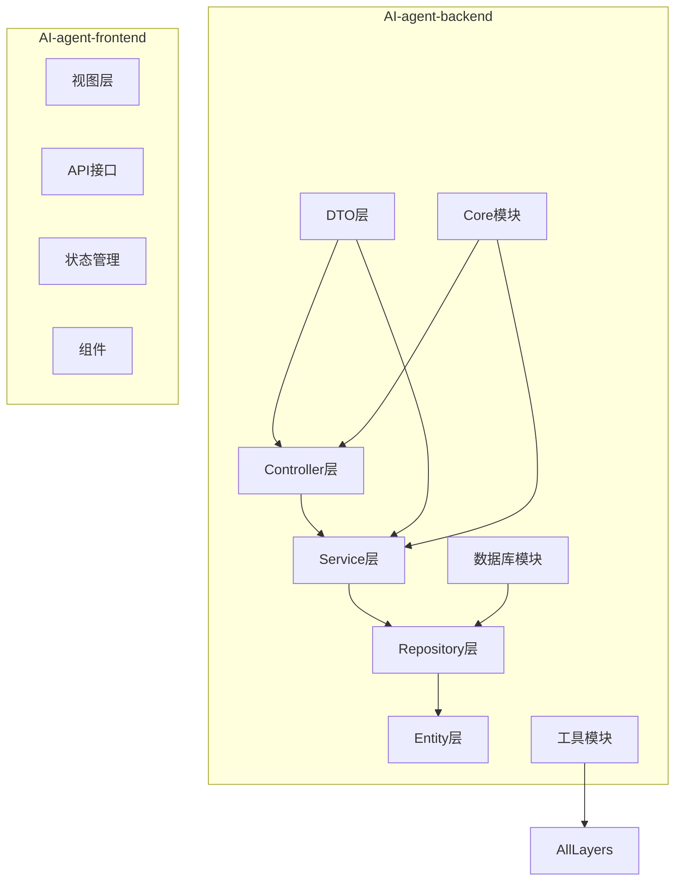
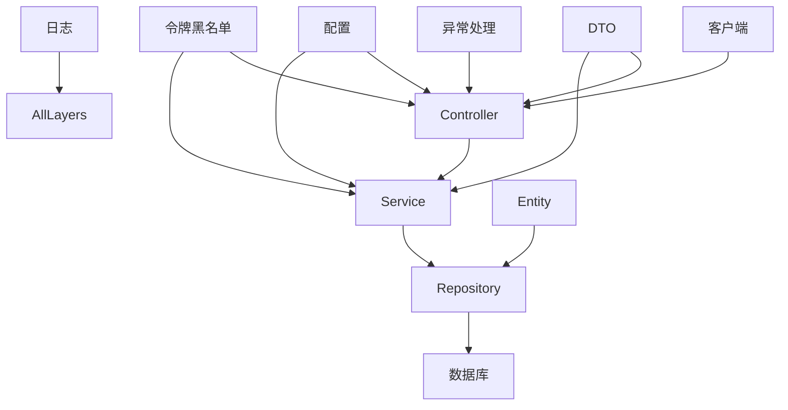
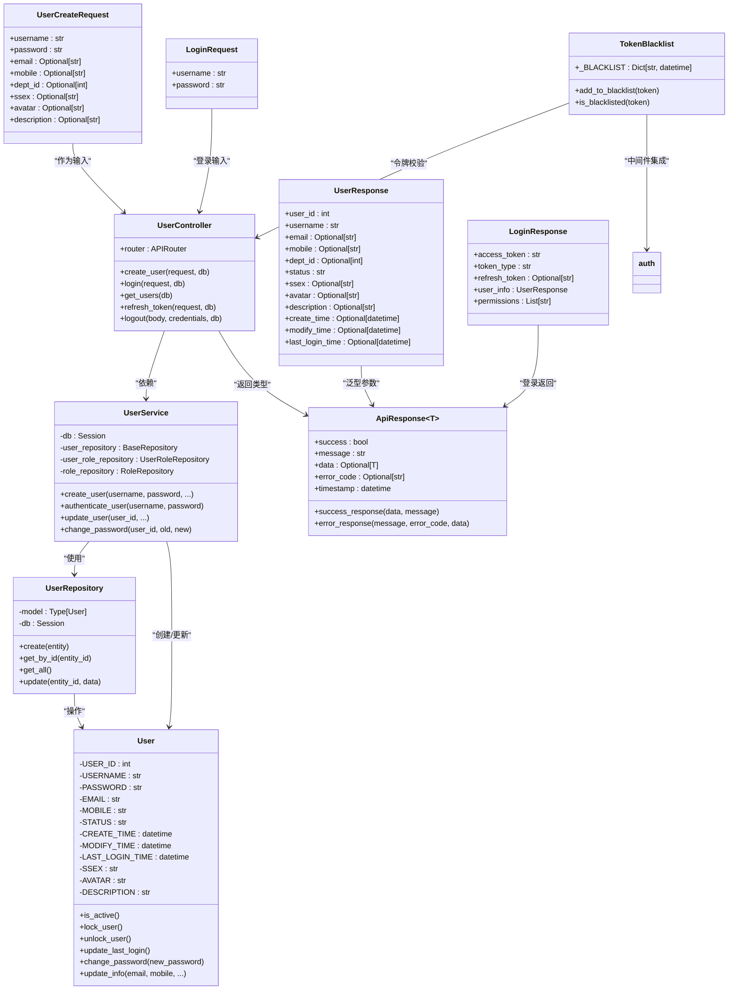
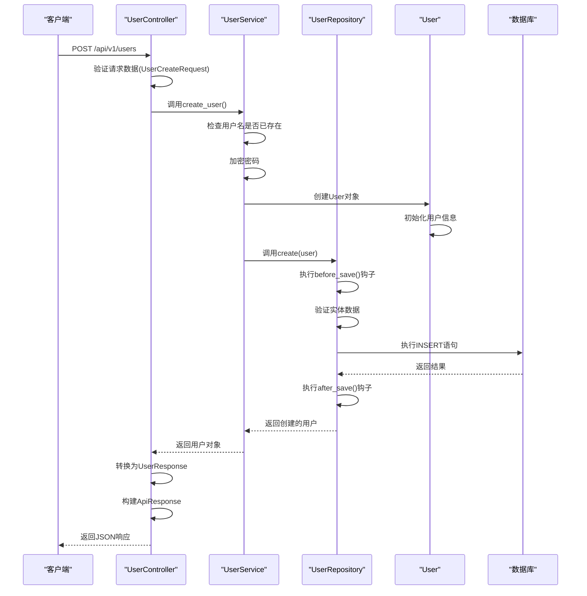
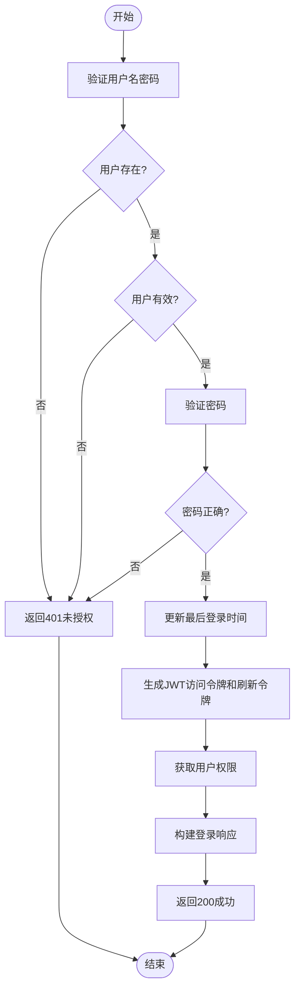
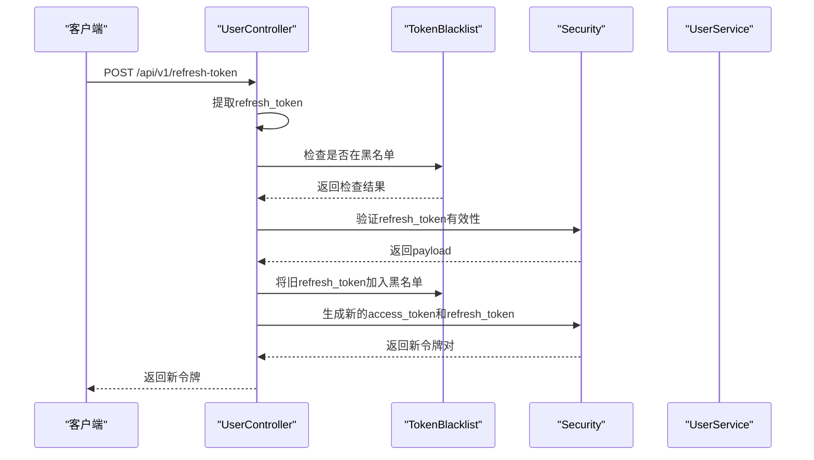
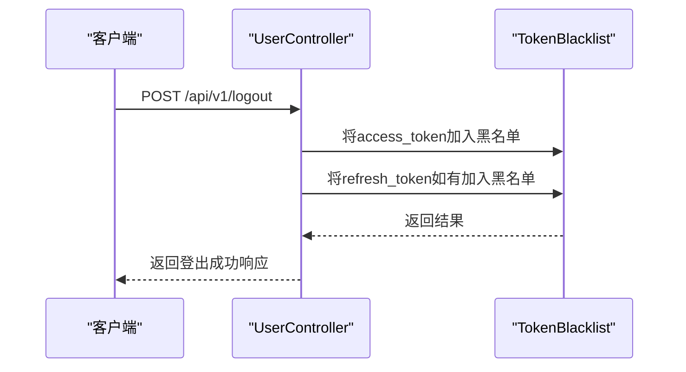
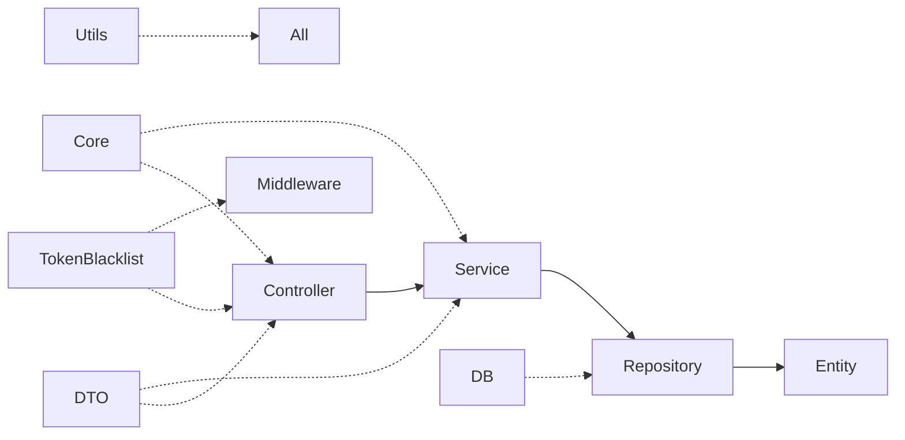

# 后端架构

<cite>
**本文档中引用的文件**  
- [main.py](file://AI-agent-backend/main.py)
- [config.py](file://AI-agent-backend/app/core/config.py)
- [base.py](file://AI-agent-backend/app/controller/base.py)
- [user_controller.py](file://AI-agent-backend/app/controller/user_controller.py) - *更新：实现JWT无感刷新与黑名单机制*
- [base.py](file://AI-agent-backend/app/service/base.py)
- [rbac_user_service.py](file://AI-agent-backend/app/service/rbac_user_service.py)
- [base.py](file://AI-agent-backend/app/entity/base.py)
- [user.py](file://AI-agent-backend/app/entity/user.py)
- [base.py](file://AI-agent-backend/app/repository/base.py)
- [base_repository.py](file://AI-agent-backend/app/repository/base_repository.py)
- [base.py](file://AI-agent-backend/app/dto/base.py)
- [user_dto.py](file://AI-agent-backend/app/dto/user_dto.py) - *更新：支持刷新令牌响应结构*
- [token_blacklist.py](file://AI-agent-backend/app/core/token_blacklist.py) - *新增：令牌黑名单管理*
- [auth.py](file://AI-agent-backend/app/middleware/auth.py) - *更新：集成令牌黑名单检查*
</cite>

## 更新摘要
**变更内容**  
- 更新用户认证流程，新增JWT无感刷新和令牌黑名单机制
- 新增 `refresh-token` 接口用于刷新访问令牌
- 在登录、登出及认证中间件中集成令牌黑名单校验
- 更新 `LoginResponse` DTO 以包含 `refresh_token`
- 新增 `token_blacklist.py` 模块实现内存级令牌黑名单

## 目录

1. [项目结构](#项目结构)  
2. [核心组件](#核心组件)  
3. [架构概述](#架构概述)  
4. [详细组件分析](#详细组件分析)  
5. [依赖分析](#依赖分析)  
6. [性能考虑](#性能考虑)  
7. [故障排除指南](#故障排除指南)  
8. [结论](#结论)

## 项目结构

项目采用分层架构设计，主要分为后端（AI-agent-backend）和前端（AI-agent-frontend）两个部分。后端采用五层架构模式：Controller（控制器）、Service（服务）、Repository（仓库）、Entity（实体）、DTO（数据传输对象），确保职责清晰、代码可维护。

**图示来源**  
- [main.py](file://AI-agent-backend/main.py)
- [config.py](file://AI-agent-backend/app/core/config.py)

## 核心组件

后端系统基于FastAPI构建，采用五层架构模式，各层职责明确：

- **Controller层**：处理HTTP请求与响应，负责参数解析、调用服务层、返回标准化响应。
- **Service层**：封装核心业务逻辑，协调多个仓库操作，实现复杂业务规则。
- **Repository层**：负责数据持久化操作，封装对数据库的CRUD操作。
- **Entity层**：定义ORM模型，映射数据库表结构，包含数据验证和业务方法。
- **DTO层**：定义接口数据传输结构，实现请求/响应数据的序列化与反序列化。

系统通过依赖注入机制实现各层之间的松耦合，并通过全局异常处理器统一处理各类异常。新增JWT令牌刷新与黑名单机制，提升系统安全性。

**组件来源**  
- [main.py](file://AI-agent-backend/main.py#L1-L50)
- [base.py](file://AI-agent-backend/app/controller/base.py#L1-L52)
- [base.py](file://AI-agent-backend/app/service/base.py#L1-L52)

## 架构概述

系统采用典型的五层分层架构，各层之间通过接口或依赖注入进行通信，确保高内聚、低耦合。

**图示来源**  
- [main.py](file://AI-agent-backend/main.py)
- [config.py](file://AI-agent-backend/app/core/config.py)
- [token_blacklist.py](file://AI-agent-backend/app/core/token_blacklist.py#L1-L59)

## 详细组件分析

### 用户管理模块分析

用户管理模块是系统的核心功能之一，完整展示了五层架构的协作流程。以“创建用户”为例，展示跨层调用链路。

#### 类图：用户模块核心类关系

**图示来源**  
- [user_controller.py](file://AI-agent-backend/app/controller/user_controller.py)
- [rbac_user_service.py](file://AI-agent-backend/app/service/rbac_user_service.py)
- [user.py](file://AI-agent-backend/app/entity/user.py)
- [user_dto.py](file://AI-agent-backend/app/dto/user_dto.py)
- [base.py](file://AI-agent-backend/app/dto/base.py)
- [token_blacklist.py](file://AI-agent-backend/app/core/token_blacklist.py)

#### 序列图：用户创建流程

**图示来源**  
- [user_controller.py](file://AI-agent-backend/app/controller/user_controller.py#L50-L100)
- [rbac_user_service.py](file://AI-agent-backend/app/service/rbac_user_service.py#L50-L100)
- [base_repository.py](file://AI-agent-backend/app/repository/base_repository.py#L50-L100)

#### 流程图：用户登录认证流程

**图示来源**  
- [user_controller.py](file://AI-agent-backend/app/controller/user_controller.py#L100-L150)
- [rbac_user_service.py](file://AI-agent-backend/app/service/rbac_user_service.py#L100-L150)

#### 序列图：JWT无感刷新流程

**图示来源**  
- [user_controller.py](file://AI-agent-backend/app/controller/user_controller.py#L200-L250)
- [token_blacklist.py](file://AI-agent-backend/app/core/token_blacklist.py#L1-L59)
- [security.py](file://AI-agent-backend/app/core/security.py)

#### 序列图：用户登出流程

**图示来源**  
- [user_controller.py](file://AI-agent-backend/app/controller/user_controller.py#L250-L300)
- [token_blacklist.py](file://AI-agent-backend/app/core/token_blacklist.py#L1-L59)

## 依赖分析

系统各层之间通过明确的依赖关系进行协作，形成清晰的调用链。

**图示来源**  
- [main.py](file://AI-agent-backend/main.py)
- [user_controller.py](file://AI-agent-backend/app/controller/user_controller.py)
- [auth.py](file://AI-agent-backend/app/middleware/auth.py)

## 性能考虑

系统在设计时考虑了以下性能优化点：

1. **数据库操作**：Repository层提供批量创建、分页查询等高效操作。
2. **缓存机制**：配置中启用Redis缓存，可缓存用户权限等频繁访问的数据。
3. **连接池**：数据库连接通过Session管理，支持连接复用。
4. **异步支持**：基于FastAPI和异步数据库驱动，支持高并发请求处理。
5. **日志级别控制**：可通过配置调整日志级别，减少生产环境日志开销。
6. **令牌黑名单清理**：`token_blacklist.py` 中的 `_cleanup` 方法定期清除过期令牌，防止内存无限增长。

## 故障排除指南

### 常见问题

1. **用户创建失败**
   - 检查用户名是否已存在
   - 检查密码长度是否符合要求（6-20字符）
   - 检查数据库连接是否正常

2. **登录失败**
   - 确认用户名密码正确
   - 检查用户状态是否为“有效”（STATUS='1'）
   - 查看日志中的认证失败原因

3. **接口返回500错误**
   - 检查后端服务日志（logs/app.log）
   - 确认数据库服务是否正常运行
   - 检查配置文件中的数据库连接字符串

4. **CORS错误**
   - 检查前端请求域名是否在ALLOWED_ORIGINS配置中
   - 确认后端CORS中间件已正确配置

5. **令牌刷新失败**
   - 检查 `refresh_token` 是否有效且未过期
   - 确认 `refresh_token` 未被加入黑名单
   - 查看日志中令牌验证失败的具体原因

6. **登出后仍可使用旧令牌**
   - 确认 `access_token` 已成功加入黑名单
   - 检查中间件 `auth.py` 是否正确调用 `is_blacklisted` 方法

**问题来源**  
- [main.py](file://AI-agent-backend/main.py#L100-L150)
- [user_controller.py](file://AI-agent-backend/app/controller/user_controller.py#L50-L100)
- [rbac_user_service.py](file://AI-agent-backend/app/service/rbac_user_service.py#L50-L100)
- [token_blacklist.py](file://AI-agent-backend/app/core/token_blacklist.py#L1-L59)

## 结论

本系统采用标准的五层架构设计，结构清晰、职责分明。通过泛型基类实现代码复用，通过依赖注入实现松耦合，通过统一响应格式和异常处理提升API一致性。新增JWT无感刷新与令牌黑名单机制，显著增强了系统的安全性和用户体验。系统具备良好的可扩展性和可维护性，为后续功能开发提供了坚实的基础。