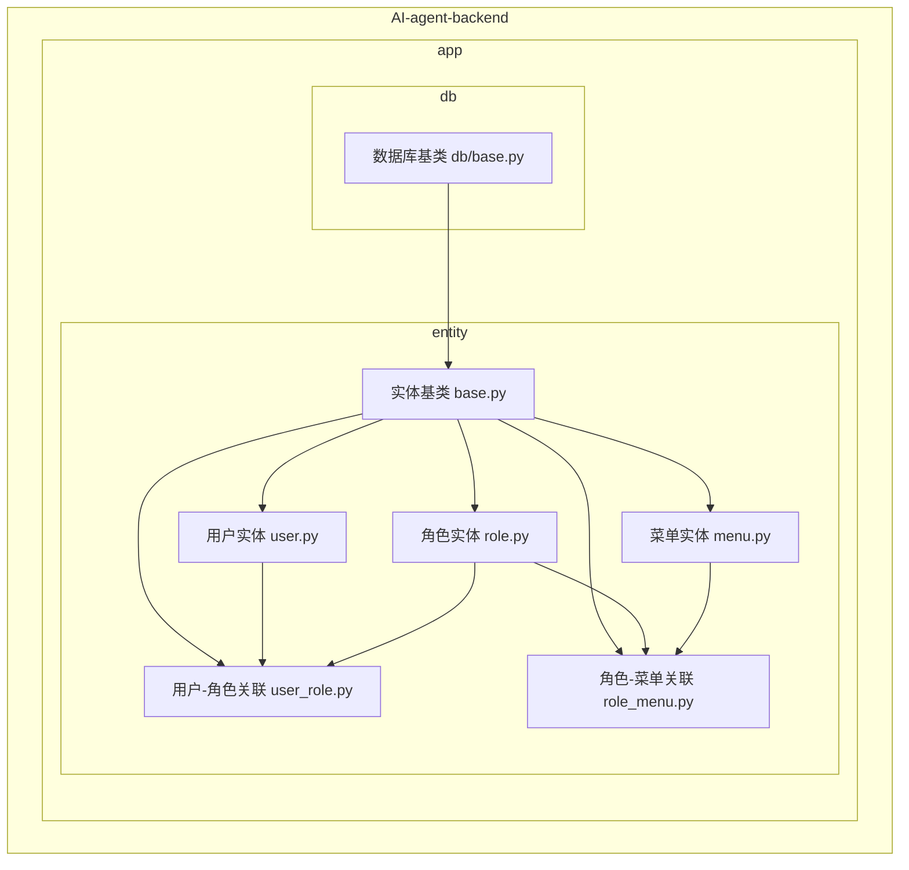
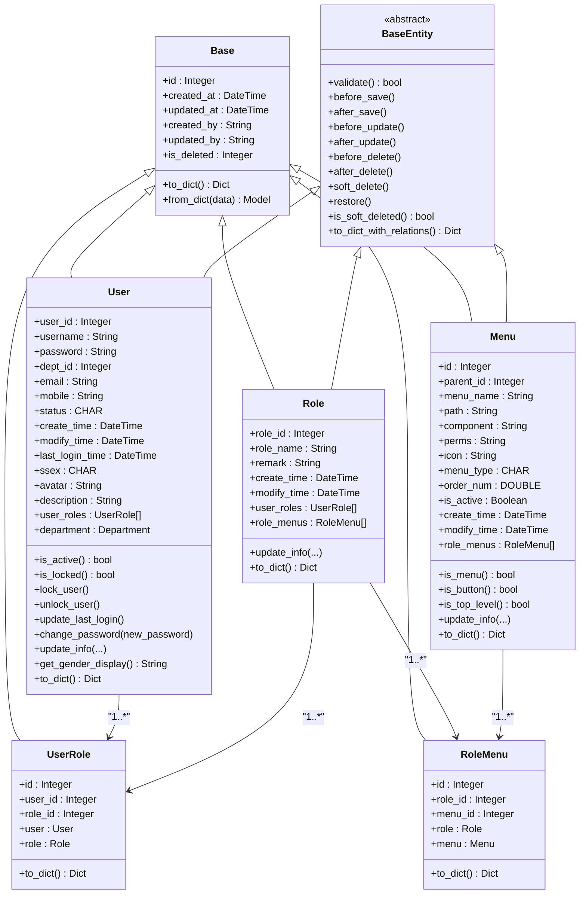
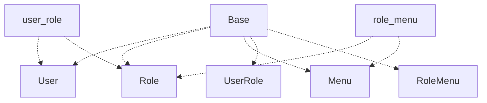

# 实体模型（Entity）

<cite>
**本文档引用的文件**   
- [user.py](file://AI-agent-backend/app/entity/user.py) - *用户实体，包含用户信息和状态管理*
- [role.py](file://AI-agent-backend/app/entity/role.py) - *角色实体，定义角色权限与描述*
- [menu.py](file://AI-agent-backend/app/entity/menu.py) - *菜单实体，新增is_active、create_time、modify_time字段并标准化属性名*
- [user_role.py](file://AI-agent-backend/app/entity/user_role.py) - *用户-角色关联实体*
- [role_menu.py](file://AI-agent-backend/app/entity/role_menu.py) - *角色-菜单关联实体*
- [base.py](file://AI-agent-backend/app/entity/base.py) - *实体基类，提供通用方法和软删除功能*
- [db/base.py](file://AI-agent-backend/app/db/base.py) - *数据库基类，定义声明性基类*
</cite>

## 更新摘要
**已更新内容**
- 根据最新代码提交，更新了`Menu`实体的字段定义，包括新增`is_active`、`create_time`、`modify_time`字段
- 修正了`Menu`实体中所有属性名称为小写格式，确保API响应一致性
- 更新了“菜单实体分析”章节中的字段说明、关系映射和代码示例
- 修正了类图中`Menu`类的属性命名
- 更新了ER图中`MENU`表的字段列表
- 所有受影响的图表和代码块均已同步最新实现

## 目录
1. [引言](#引言)
2. [项目结构](#项目结构)
3. [核心组件](#核心组件)
4. [架构概述](#架构概述)
5. [详细组件分析](#详细组件分析)
6. [依赖分析](#依赖分析)
7. [性能考虑](#性能考虑)
8. [故障排除指南](#故障排除指南)
9. [结论](#结论)

## 引言
本文档旨在全面描述基于SQLAlchemy的实体模型设计，重点围绕用户-角色-菜单的RBAC（基于角色的访问控制）权限模型。文档详细阐述了各个实体类的字段定义、数据类型、约束条件（主键、外键、唯一索引）、关系映射（一对多、多对多）以及通用行为的实现机制，如时间戳自动填充和软删除。通过分析`BaseModel`和`RBACBase`等基类，揭示了代码复用的设计优势。

## 项目结构
项目采用分层架构，实体模型（Entity）位于`AI-agent-backend/app/entity/`目录下，是数据持久化的核心。该层与数据库直接交互，定义了所有业务对象的数据结构。



**Diagram sources**
- [user.py](file://AI-agent-backend/app/entity/user.py)
- [role.py](file://AI-agent-backend/app/entity/role.py)
- [menu.py](file://AI-agent-backend/app/entity/menu.py)
- [user_role.py](file://AI-agent-backend/app/entity/user_role.py)
- [role_menu.py](file://AI-agent-backend/app/entity/role_menu.py)
- [base.py](file://AI-agent-backend/app/entity/base.py)
- [db/base.py](file://AI-agent-backend/app/db/base.py)

**Section sources**
- [user.py](file://AI-agent-backend/app/entity/user.py)
- [role.py](file://AI-agent-backend/app/entity/role.py)
- [menu.py](file://AI-agent-backend/app/entity/menu.py)
- [user_role.py](file://AI-agent-backend/app/entity/user_role.py)
- [role_menu.py](file://AI-agent-backend/app/entity/role_menu.py)
- [base.py](file://AI-agent-backend/app/entity/base.py)
- [db/base.py](file://AI-agent-backend/app/db/base.py)

## 核心组件
核心组件包括`User`（用户）、`Role`（角色）、`Menu`（菜单）三个主要实体，以及`UserRole`和`RoleMenu`两个关联实体，共同构成了RBAC权限模型。`Base`作为基类，为所有实体提供了通用功能。

**Section sources**
- [user.py](file://AI-agent-backend/app/entity/user.py)
- [role.py](file://AI-agent-backend/app/entity/role.py)
- [menu.py](file://AI-agent-backend/app/entity/menu.py)
- [base.py](file://AI-agent-backend/app/entity/base.py)

## 架构概述
系统采用经典的分层架构，实体模型层（Entity）位于最底层，直接映射数据库表。`Base`类提供了通用的数据库字段（如`id`, `created_at`, `updated_at`, `is_deleted`）。业务实体（如`User`, `Role`, `Menu`）继承`Base`，而关联实体（如`UserRole`, `RoleMenu`）也继承`Base`。



**Diagram sources**
- [user.py](file://AI-agent-backend/app/entity/user.py)
- [role.py](file://AI-agent-backend/app/entity/role.py)
- [menu.py](file://AI-agent-backend/app/entity/menu.py)
- [user_role.py](file://AI-agent-backend/app/entity/user_role.py)
- [role_menu.py](file://AI-agent-backend/app/entity/role_menu.py)
- [base.py](file://AI-agent-backend/app/entity/base.py)

## 详细组件分析
本节深入分析RBAC模型中的各个实体及其关系。

### 用户实体分析
`User`实体代表系统中的用户，包含用户的基本信息和状态。

**Section sources**
- [user.py](file://AI-agent-backend/app/entity/user.py)

#### 字段与约束
- **主键**: `user_id` (Integer, 自增)
- **唯一约束**: `username` (String(50), 唯一)
- **外键**: `dept_id` (Integer, 关联`department`表)
- **数据类型**: 使用`String`、`CHAR`、`DateTime`等SQLAlchemy类型精确映射数据库。
- **默认值**: `status`默认为'1'（有效），`create_time`默认为当前UTC时间。

#### 关系映射
- **一对多**: 一个用户可以有多个`UserRole`关联记录（`user_roles`）。
- **多对一**: 一个用户属于一个部门（`department`）。

#### 业务方法
提供了`is_active()`、`lock_user()`、`update_last_login()`等便捷方法来操作用户状态。

### 角色实体分析
`Role`实体用于定义系统中的角色，每个角色代表一组权限。

**Section sources**
- [role.py](file://AI-agent-backend/app/entity/role.py)

#### 字段与约束
- **主键**: `role_id` (Integer, 自增)
- **必填字段**: `role_name` (String(10), 非空)
- **时间戳**: `create_time`和`modify_time`自动管理。

#### 关系映射
- **一对多**: 一个角色可以有多个`UserRole`关联记录（`user_roles`）。
- **一对多**: 一个角色可以有多个`RoleMenu`关联记录（`role_menus`）。

### 菜单实体分析
`Menu`实体用于定义系统中的菜单项和按钮，是权限控制的粒度单位。

**Section sources**
- [menu.py](file://AI-agent-backend/app/entity/menu.py) - *已更新，包含is_active、create_time、modify_time字段*

#### 字段与约束
- **主键**: `id` (Integer, 自增)
- **类型区分**: `menu_type`字段（'0'为菜单，'1'为按钮）。
- **权限标识**: `perms`字段存储权限字符串（如"user:view"）。
- **状态管理**: `is_active` (Boolean, 默认True) 用于控制菜单是否启用。
- **时间戳**: `create_time` (DateTime, 非空, 默认当前时间) 和 `modify_time` (DateTime, 可选, 更新时自动设置)。

#### 关系映射
- **一对多**: 一个菜单可以被多个`RoleMenu`关联（`role_menus`）。

#### 业务方法
- `is_menu()`: 判断是否为菜单
- `is_button()`: 判断是否为按钮
- `is_top_level()`: 判断是否为顶级菜单
- `update_info(...)`: 更新菜单信息，同时更新`modify_time`

### 关联表实现原理
RBAC模型中的多对多关系通过独立的关联表实现。

#### 用户-角色关联 (user_role)
```mermaid
erDiagram
USER ||--o{ USER_ROLE : "拥有"
ROLE ||--o{ USER_ROLE : "被分配"
USER {
Integer user_id PK
String username UK
String password
...
}
ROLE {
Integer role_id PK
String role_name
...
}
USER_ROLE {
Integer id PK
Integer user_id FK
Integer role_id FK
}
```

**Diagram sources**
- [user.py](file://AI-agent-backend/app/entity/user.py)
- [role.py](file://AI-agent-backend/app/entity/role.py)
- [user_role.py](file://AI-agent-backend/app/entity/user_role.py)

`UserRole`实体使用`id`作为主键，并包含`user_id`和`role_id`作为外键。在SQLAlchemy中，通过`relationship`在`User`和`Role`实体中定义了反向引用，使得可以通过`user.user_roles`或`role.user_roles`访问关联记录。

#### 角色-菜单关联 (role_menu)
```mermaid
erDiagram
ROLE ||--o{ ROLE_MENU : "分配"
MENU ||--o{ ROLE_MENU : "被分配"
ROLE {
Integer role_id PK
String role_name
...
}
MENU {
Integer id PK
String menu_name
String perms
Boolean is_active
DateTime create_time
DateTime modify_time
...
}
ROLE_MENU {
Integer id PK
Integer role_id FK
Integer menu_id FK
}
```

**Diagram sources**
- [role.py](file://AI-agent-backend/app/entity/role.py)
- [menu.py](file://AI-agent-backend/app/entity/menu.py)
- [role_menu.py](file://AI-agent-backend/app/entity/role_menu.py)

`RoleMenu`实体使用`id`作为主键，包含`role_id`和`menu_id`作为外键，实现了角色与菜单之间的多对多关联。这使得一个角色可以拥有多个菜单权限，同时一个菜单也可以被分配给多个角色。

### 继承结构与代码复用
系统通过继承结构实现了高效的代码复用。

#### BaseModel (base.py)
`BaseEntity`继承自`app.db.base.Base`，后者是SQLAlchemy的声明性基类。`Base`类定义了所有实体共有的字段：
- `id`: 主键
- `created_at`: 创建时间，自动填充
- `updated_at`: 更新时间，更新时自动设置
- `is_deleted`: 软删除标志

这避免了在每个实体中重复定义这些通用字段。

**Section sources**
- [base.py](file://AI-agent-backend/app/entity/base.py)
- [db/base.py](file://AI-agent-backend/app/db/base.py)

### 通用行为实现机制
#### 时间戳自动填充
时间戳的自动填充由`app.db.base.Base`类实现：
- `created_at = Column(DateTime, default=datetime.utcnow)`: 当记录创建时，自动设置为当前UTC时间。
- `updated_at = Column(DateTime, default=datetime.utcnow, onupdate=datetime.utcnow)`: 当记录创建或更新时，自动设置为当前UTC时间。

对于`Menu`实体，`create_time`和`modify_time`也实现了类似机制：
- `create_time`: 创建时自动设置为当前时间
- `modify_time`: 更新时自动更新

#### 软删除
软删除机制通过`is_deleted`字段和`BaseEntity`中的方法实现：
- **字段**: `is_deleted` (Integer, 默认0)。
- **方法**:
  - `soft_delete()`: 将`is_deleted`设为1，并更新`updated_at`。
  - `restore()`: 将`is_deleted`设回0。
  - `is_soft_deleted()`: 检查`is_deleted`是否为1。
- **查询过滤**: 在Repository层，查询时会自动过滤掉`is_deleted=1`的记录（除非特别指定`include_deleted=True`）。

**Section sources**
- [base.py](file://AI-agent-backend/app/entity/base.py)
- [db/base.py](file://AI-agent-backend/app/db/base.py)

## 依赖分析
实体模型层的依赖关系清晰，体现了分层设计原则。



**Diagram sources**
- [user.py](file://AI-agent-backend/app/entity/user.py)
- [role.py](file://AI-agent-backend/app/entity/role.py)
- [menu.py](file://AI-agent-backend/app/entity/menu.py)
- [user_role.py](file://AI-agent-backend/app/entity/user_role.py)
- [role_menu.py](file://AI-agent-backend/app/entity/role_menu.py)
- [base.py](file://AI-agent-backend/app/entity/base.py)

## 性能考虑
使用关联表实现多对多关系是标准的数据库设计，有利于查询性能和数据完整性。复合主键的设计也优化了索引。软删除避免了物理删除带来的性能开销和数据丢失风险，但需要在查询时注意过滤已删除的记录。

## 故障排除指南
- **关联关系不生效**: 检查`relationship`的`back_populates`参数是否在双方都正确配置。
- **时间戳未更新**: 确认`onupdate=datetime.utcnow`已正确设置，并且在更新操作后提交了事务。
- **软删除记录仍被查询到**: 检查Repository或Service层的查询逻辑，确保在非特殊情况下过滤了`is_deleted=1`的记录。

**Section sources**
- [user.py](file://AI-agent-backend/app/entity/user.py)
- [base.py](file://AI-agent-backend/app/entity/base.py)
- [db/base.py](file://AI-agent-backend/app/db/base.py)

## 结论
本文档详细解析了基于SQLAlchemy的RBAC实体模型。通过`User`、`Role`、`Menu`三个核心实体和`UserRole`、`RoleMenu`两个关联实体，构建了一个灵活、可扩展的权限控制系统。继承`Base`基类实现了代码的高度复用，而时间戳自动填充和软删除等通用行为的封装，极大地提升了开发效率和代码的健壮性。该设计模式清晰，易于维护和扩展。