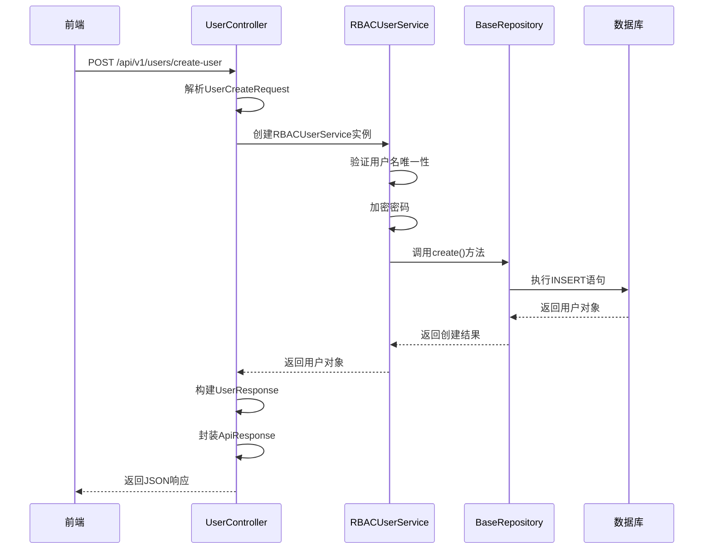

# 控制器层（Controller）

<cite>
**本文档中引用的文件**  
- [user_controller.py](file://AI-agent-backend\app\controller\user_controller.py) - *更新了JWT无感刷新与黑名单机制*
- [auth.py](file://AI-agent-backend\app\middleware\auth.py) - *重构了认证中间件*
- [base.py](file://AI-agent-backend\app\controller\base.py) - *包含BaseController基类*
- [dashboard_controller.py](file://AI-agent-backend\app\controller\dashboard_controller.py) - *集成了日志装饰器*
- [department_controller.py](file://AI-agent-backend\app\controller\department_controller.py) - *集成了日志装饰器*
- [menu_controller.py](file://AI-agent-backend\app\controller\menu_controller.py) - *集成了日志装饰器*
</cite>

## 更新摘要
**变更内容**   
- 更新了用户控制器以支持JWT无感刷新和令牌黑名单机制
- 在多个控制器中集成日志装饰器以实现操作跟踪
- 修正了文件引用，从`user_controller_new.py`更新为`user_controller.py`
- 新增了刷新令牌和退出登录的接口说明
- 更新了架构流程图以反映新的认证流程

## 目录
1. [控制器层设计与实现](#控制器层设计与实现)  
2. [核心功能分析](#核心功能分析)  
3. [BaseController 抽象共性功能](#basecontroller-抽象共性功能)  
4. [请求参数解析与 DTO 设计](#请求参数解析与-dto-设计)  
5. [响应封装机制](#响应封装机制)  
6. [异常处理机制](#异常处理机制)  
7. [依赖注入与服务调用](#依赖注入与服务调用)  
8. [API 接口示例与状态码说明](#api-接口示例与状态码说明)  
9. [前端 API 调用映射关系](#前端-api-调用映射关系)  
10. [架构流程图](#架构流程图)

## 控制器层设计与实现

控制器层是 FastAPI 应用的 HTTP 请求入口，负责接收客户端请求、解析参数、调用服务层处理业务逻辑，并返回标准化的响应。在本项目中，控制器层采用分层设计模式，通过 `BaseController` 提供通用功能，具体控制器（如 `user_controller.py`）实现具体业务接口。

控制器的主要职责包括：
- **路由定义**：使用 FastAPI 的 `APIRouter` 定义 RESTful API 路径和方法。
- **请求参数解析**：通过 Pydantic 模型（DTO）对请求体进行验证和解析。
- **响应封装**：统一返回格式，确保前后端交互一致性。
- **异常处理**：捕获业务异常并转换为标准 HTTP 错误响应。
- **依赖注入**：通过 `Depends` 注入数据库会话和服务实例。

**Section sources**  
- [user_controller.py](file://AI-agent-backend\app\controller\user_controller.py#L0-L995)

## 核心功能分析

以 `user_controller.py` 为例，该控制器实现了用户管理的完整生命周期操作，包括创建、查询、更新、删除、状态管理、角色分配等。

### 用户创建接口
```python
@router.post("/create-user", response_model=ApiResponse[UserResponse], summary="创建用户")
async def create_user(
    request: UserCreateRequest,
    current_user: User = Depends(get_current_user),
    db: Session = Depends(get_db)
):
    """
    创建新用户
    
    - **username**: 用户名（必填，3-50个字符）
    - **password**: 密码（必填，6-20个字符）
    - **email**: 邮箱（可选）
    - **mobile**: 手机号（可选）
    - **dept_id**: 部门ID（可选）
    - **ssex**: 性别，'0'男 '1'女 '2'保密（可选）
    - **avatar**: 头像（可选）
    - **description**: 描述（可选）
    """
    try:
        user_service = RBACUserService(db)
        user = user_service.create_user(
            username=request.username,
            password=request.password,
            email=request.email,
            mobile=request.mobile,
            dept_id=request.dept_id,
            ssex=request.ssex,
            avatar=request.avatar,
            description=request.description
        )
        
        # 转换为字典格式
        user_dict = {
            "user_id": user.user_id,
            "username": user.username,
            "email": user.email,
            "mobile": user.mobile,
            "dept_id": user.dept_id,
            "status": user.status,
            "ssex": user.ssex,
            "avatar": user.avatar,
            "description": user.description,
            "create_time": user.create_time.isoformat() if user.create_time else None,
            "modify_time": user.modify_time.isoformat() if user.modify_time else None,
            "last_login_time": user.last_login_time.isoformat() if user.last_login_time else None
        }

        logger.info(f"User created successfully: {user.username}")
        return Success(code=200, msg="用户创建成功", data=user_dict)
        
    except ValueError as e:
        logger.warning(f"User creation failed: {str(e)}")
        raise HTTPException(
            status_code=status.HTTP_400_BAD_REQUEST,
            detail=str(e)
        )
    except Exception as e:
        logger.error(f"Unexpected error creating user: {str(e)}")
        raise HTTPException(
            status_code=status.HTTP_500_INTERNAL_SERVER_ERROR,
            detail="创建用户失败"
        )
```

### 用户查询接口
```python
@router.post("/get-user-list", response_model=ApiResponse[UserListResponse], summary="获取用户列表")
async def get_user_list(
    request: UserListRequest,
    db: Session = Depends(get_db)
):
    """
    获取用户列表（支持分页和筛选）
    """
    try:
        user_service = RBACUserService(db)

        # 数据库层筛选 + 分页，并预加载部门与角色
        paginated_users, total = user_service.query_users(
            page=request.page,
            size=request.size,
            username=request.username,
            dept_id=request.dept_id,
            status=request.status,
            ssex=request.ssex
        )

        # 批量准备部门名称映射，避免重复查询
        dept_service = DepartmentService(db)
        dept_ids = {u.dept_id for u in paginated_users if u.dept_id}
        dept_name_map = {}
        if dept_ids:
            for dept in dept_service.get_departments_by_ids(list(dept_ids)):
                dept_name_map[dept.id] = dept.dept_name

        # 批量获取角色映射，避免逐条查询
        user_ids = [u.user_id for u in paginated_users]
        roles_map = user_service.get_roles_for_users(user_ids)

        # 转换为响应格式
        user_list = []
        for user in paginated_users:
            # 查询用户角色并转换为精简结构
            roles = roles_map.get(user.user_id, [])
            role_data = [
                {"role_id": role.id, "role_name": role.role_name, "remark": role.remark or ""}
                for role in roles
            ]

            user_dict = {
                "user_id": user.user_id,
                "username": user.username,
                "email": user.email,
                "mobile": user.mobile,
                "ssex": user.ssex,
                "avatar": user.avatar,
                "description": user.description,
                "dept_id": user.dept_id,
                "dept_name": dept_name_map.get(user.dept_id),  # 部门名称
                "status": user.status,
                "create_time": user.create_time.isoformat() if user.create_time else None,
                "modify_time": user.modify_time.isoformat() if user.modify_time else None,
                "last_login_time": user.last_login_time.isoformat() if user.last_login_time else None,
                "roles": role_data  # 追加角色数组
            }
            user_list.append(user_dict)

        return SuccessExtra(
            code=200,
            msg="获取用户列表成功",
            data=user_list,
            total=total,
            page=request.page,
            page_size=request.size
        )
        
    except Exception as e:
        logger.error(f"Error getting users: {str(e)}")
        raise HTTPException(
            status_code=status.HTTP_500_INTERNAL_SERVER_ERROR,
            detail="获取用户列表失败"
        )
```

### 刷新令牌接口
```python
@router.post("/refresh-token", summary="刷新访问令牌")
async def refresh_token_endpoint(
    request: dict,
    db: Session = Depends(get_db)
):
    """
    使用refresh_token换取新的access_token。
    请求体：{ "refresh_token": "..." }
    """
    try:
        refresh_token = request.get("refresh_token")
        if not refresh_token:
            raise HTTPException(status_code=status.HTTP_400_BAD_REQUEST, detail="缺少refresh_token")

        # 黑名单检查
        if is_blacklisted(refresh_token):
            raise HTTPException(status_code=status.HTTP_401_UNAUTHORIZED, detail="刷新令牌已失效")

        # 验证并提取用户
        payload = verify_token(refresh_token, token_type="refresh")
        if not payload:
            raise HTTPException(status_code=status.HTTP_401_UNAUTHORIZED, detail="刷新令牌无效或已过期")
        user_id_str = payload.get("sub")
        if not user_id_str:
            raise HTTPException(status_code=status.HTTP_401_UNAUTHORIZED, detail="刷新令牌无效")

        # 作废旧refresh_token
        add_to_blacklist(refresh_token)

        # 颁发新的访问令牌和刷新令牌
        new_access = create_access_token({"sub": user_id_str})  # 使用字符串类型的user_id
        new_refresh = create_refresh_token({"sub": user_id_str})  # 使用字符串类型的user_id

        return Success(code=200, msg="令牌刷新成功", data={
            "access_token": new_access,
            "token_type": "bearer",
            "refresh_token": new_refresh
        })
    except HTTPException:
        raise
    except Exception as e:
        logger.error(f"Unexpected error during token refresh: {str(e)}")
        raise HTTPException(status_code=status.HTTP_500_INTERNAL_SERVER_ERROR, detail="刷新令牌失败")
```

### 退出登录接口
```python
@router.post("/logout", response_model=ApiResponse[bool], summary="用户退出登录")
async def user_logout(
    body: Optional[dict] = None,
    credentials: HTTPAuthorizationCredentials = Depends(HTTPBearer(auto_error=False)),
    db: Session = Depends(get_db)
):
    """
    用户退出登录：将access_token与refresh_token（如提供）加入黑名单
    """
    try:
        # 黑名单当前访问令牌
        try:
            if credentials and credentials.credentials:
                add_to_blacklist(credentials.credentials)
        except Exception:
            pass

        # 黑名单刷新令牌
        try:
            refresh_token = (body or {}).get("refresh_token")
            if refresh_token:
                add_to_blacklist(refresh_token)
        except Exception:
            pass

        logger.info("User logged out successfully")
        return Success(code=200, msg="退出登录成功", data=True)

    except Exception as e:
        logger.error(f"Unexpected error during logout: {str(e)}")
        raise HTTPException(
            status_code=status.HTTP_500_INTERNAL_SERVER_ERROR,
            detail="退出登录失败"
        )
```

**Section sources**  
- [user_controller.py](file://AI-agent-backend\app\controller\user_controller.py#L25-L116)

## BaseController 抽象共性功能

`BaseController` 是所有控制器的基类，封装了通用的 HTTP 请求处理逻辑，提升代码复用性和可维护性。

### 主要功能
- **统一响应格式**：通过 `ApiResponse` 类封装成功/失败响应。
- **分页支持**：提供 `create_paginated_response` 方法生成分页响应。
- **参数验证**：内置 `validate_id` 和 `validate_pagination` 方法。
- **日志记录**：提供 `log_request` 和 `log_response` 方法。
- **权限检查**：提供 `check_permission` 和 `require_permission` 方法。
- **输入清理**：提供 `sanitize_input` 方法防止 XSS 等攻击。

```python
class BaseController:
    def create_success_response(self, data: Any = None, message: str = "Success") -> ApiResponse:
        return ApiResponse.success_response(data=data, message=message)

    def create_paginated_response(self, items: List[Any], pagination: PaginationRequest, total: int) -> PaginatedResponse:
        return PaginatedResponse.create(items, pagination.page, pagination.page_size, total)

    def validate_id(self, entity_id: int, entity_name: str = "Entity") -> None:
        if entity_id is None or entity_id <= 0:
            raise ValidationException(f"Invalid {entity_name.lower()} ID: {entity_id}")
```

**Section sources**  
- [base.py](file://AI-agent-backend\app\controller\base.py#L0-L315)

## 请求参数解析与 DTO 设计

DTO（Data Transfer Object）用于定义请求和响应的数据结构，确保类型安全和数据验证。

### 请求 DTO
- `UserCreateRequest`：创建用户请求，包含用户名、密码、邮箱等字段。
- `UserListRequest`：用户列表请求，继承 `PaginationRequest` 实现分页。
- `UserUpdateRequest`：更新用户信息请求，包含用户ID和可选字段。

```python
class UserCreateRequest(BaseRequest):
    username: str = Field(..., min_length=3, max_length=50, description="用户名")
    password: str = Field(..., min_length=6, max_length=20, description="密码")
    email: Optional[str] = Field(None, max_length=128, description="邮箱")
    mobile: Optional[str] = Field(None, max_length=20, description="联系电话")
    dept_id: Optional[int] = Field(None, description="部门ID")
    ssex: Optional[str] = Field(None, pattern="^[012]$", description="性别：0男 1女 2保密")
```

### 验证规则
- 字符串长度限制（如用户名 3-50 字符）
- 数值范围检查（如分页页码 ≥1）
- 正则表达式匹配（如性别只能为 0,1,2）
- 必填字段校验（使用 `...` 表示必填）

**Section sources**  
- [user_controller.py](file://AI-agent-backend\app\controller\user_controller.py#L0-L220)

## 响应封装机制

系统采用统一的响应格式 `ApiResponse<T>`，确保所有接口返回结构一致。

### 通用响应格式
```json
{
  "success": true,
  "message": "操作成功",
  "data": { /* 业务数据 */ },
  "error_code": null,
  "timestamp": "2023-01-01T00:00:00Z"
}
```

### 响应 DTO
- `UserResponse`：用户信息响应模型。
- `UserListResponse`：用户列表响应，包含分页信息。
- `LoginResponse`：登录响应，包含令牌和用户信息。

```python
class ApiResponse(BaseResponse, Generic[T]):
    success: bool = Field(description="是否成功")
    message: str = Field(description="响应消息")
    data: Optional[T] = Field(default=None, description="响应数据")
    error_code: Optional[str] = Field(default=None, description="错误代码")
    timestamp: datetime = Field(default_factory=datetime.utcnow, description="响应时间")
```

**Section sources**  
- [base.py](file://AI-agent-backend\app\dto\base.py#L137-L183)

## 异常处理机制

系统采用分层异常处理策略，确保错误信息清晰且安全。

### 异常类型
- `ValidationException`：参数验证失败（422）
- `BusinessException`：业务逻辑错误（400）
- `NotFoundException`：资源未找到（404）
- `HTTPException`：通用 HTTP 异常

### 全局异常处理器
在 `main.py` 中注册全局异常处理器，统一返回标准错误格式：

```python
@app.exception_handler(BaseAPIException)
async def api_exception_handler(request: Request, exc: BaseAPIException):
    return JSONResponse(
        status_code=exc.status_code,
        content={
            "success": False,
            "message": exc.detail,
            "error_code": getattr(exc, 'error_code', None),
            "timestamp": "2023-01-01T00:00:00Z"
        }
    )
```

**Section sources**  
- [base.py](file://AI-agent-backend\app\controller\base.py#L83-L124)
- [main.py](file://AI-agent-backend\main.py#L82-L124)

## 依赖注入与服务调用

控制器通过依赖注入获取服务实例，实现松耦合设计。

### 依赖注入实现
```python
from app.db.session import get_db
from app.service.rbac_user_service import RBACUserService

@router.post("/create-user")
async def create_user(
    request: UserCreateRequest,
    current_user: User = Depends(get_current_user),
    db: Session = Depends(get_db)  # 注入数据库会话
):
    user_service = RBACUserService(db)  # 通过构造函数注入服务
    user = user_service.create_user(...)  # 调用业务逻辑
```

### 服务层职责
- `RBACUserService`：处理用户创建、认证、权限检查等业务逻辑。
- 使用 `BaseRepository` 操作数据库，遵循单一职责原则。

**Section sources**  
- [user_controller.py](file://AI-agent-backend\app\controller\user_controller.py#L0-L23)
- [rbac_user_service.py](file://AI-agent-backend\app\service\rbac_user_service.py#L0-L347)

## API 接口示例与状态码说明

### 创建用户
**请求**  
```http
POST /api/v1/users/create-user
Content-Type: application/json

{
  "username": "zhangsan",
  "password": "123456",
  "email": "zhangsan@example.com",
  "mobile": "13800138000"
}
```

**成功响应**  
```json
{
  "success": true,
  "message": "用户创建成功",
  "data": {
    "user_id": 1,
    "username": "zhangsan",
    "email": "zhangsan@example.com"
  }
}
```

### 刷新令牌
**请求**  
```http
POST /api/v1/users/refresh-token
Content-Type: application/json

{
  "refresh_token": "eyJhbGciOiJIUzI1NiIsInR5cCI6IkpXVCJ9..."
}
```

**成功响应**  
```json
{
  "success": true,
  "message": "令牌刷新成功",
  "data": {
    "access_token": "new_access_token",
    "token_type": "bearer",
    "refresh_token": "new_refresh_token"
  }
}
```

**状态码说明**
- `200 OK`：操作成功
- `400 Bad Request`：参数错误或业务规则违反
- `401 Unauthorized`：认证失败或令牌失效
- `404 Not Found`：资源不存在
- `422 Unprocessable Entity`：参数验证失败
- `500 Internal Server Error`：服务器内部错误

**Section sources**  
- [user_controller.py](file://AI-agent-backend\app\controller\user_controller.py#L25-L64)

## 前端 API 调用映射关系

前端通过 Axios 调用后端 API，遵循统一的响应处理模式。

### 前端调用示例
```typescript
// src/api/modules/user.ts
export const createUser = (data: UserCreateRequest) => {
  return http.post<ApiResponse<UserResponse>>('/api/v1/users/create-user', data);
};

export const refreshToken = (refreshToken: string) => {
  return http.post('/api/v1/users/refresh-token', { refresh_token: refreshToken });
};

export const logout = (refreshToken?: string) => {
  const data = refreshToken ? { refresh_token: refreshToken } : undefined;
  return http.post('/api/v1/users/logout', data);
};

// 使用示例
try {
  const response = await createUser(userData);
  if (response.data.success) {
    message.success(response.data.message);
    // 处理用户数据
  } else {
    message.error(response.data.message);
  }
} catch (error) {
  message.error('请求失败');
}
```

### 错误处理策略
- 拦截器统一处理 401（未授权）、403（禁止访问）
- 根据 `error_code` 进行精细化错误提示
- 网络异常兜底处理

**Section sources**  
- [user_controller.py](file://AI-agent-backend\app\controller\user_controller.py#L25-L64)

## 架构流程图



**Diagram sources**  
- [user_controller.py](file://AI-agent-backend\app\controller\user_controller.py#L25-L64)
- [rbac_user_service.py](file://AI-agent-backend\app\service\rbac_user_service.py#L0-L347)
- [base.py](file://AI-agent-backend\app\repository\base_repository.py#L0-L100)