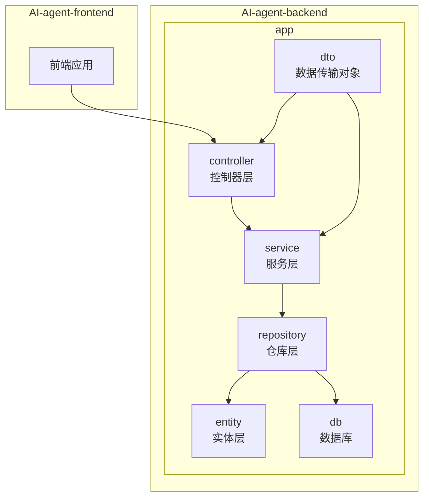
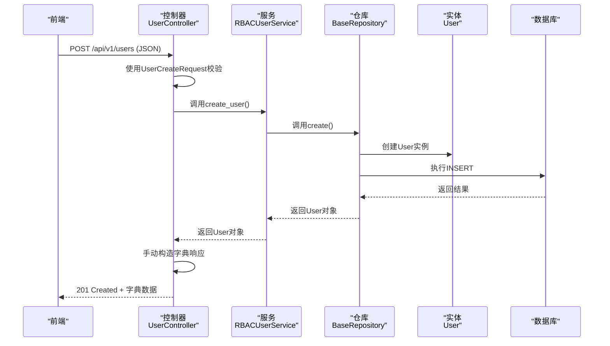
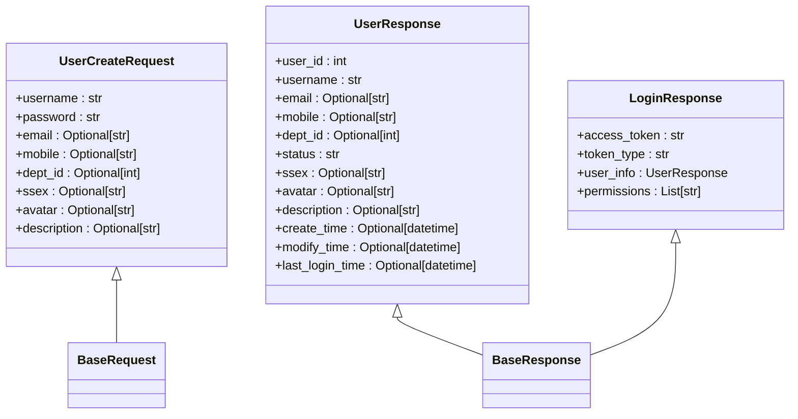
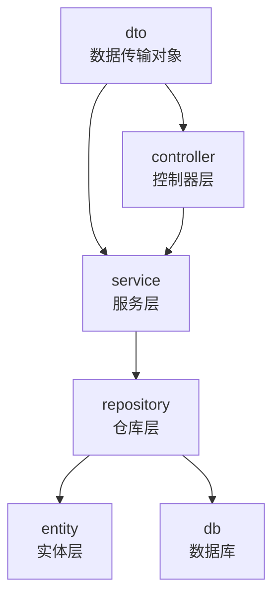

# 数据传输对象（DTO）

<cite>
**本文档引用的文件**
- [user_dto.py](file://AI-agent-backend\app\dto\user_dto.py) - *在最近的提交中更新*
- [user.py](file://AI-agent-backend\app\entity\user.py) - *在最近的提交中更新*
- [user_controller.py](file://AI-agent-backend\app\controller\user_controller.py) - *在最近的提交中更新*
- [base.py](file://AI-agent-backend\app\dto\base.py) - *在最近的提交中更新*
</cite>

## 更新摘要
**已更改内容**
- 根据代码变更，更新了用户DTO响应模型的实现方式，从Pydantic模型转换为字典
- 修正了DTO与Entity映射关系的描述，反映了当前手动构造字典的实现
- 更新了架构概述和详细组件分析中的序列图和类图，以匹配当前代码流
- 添加了关于API响应格式变更的说明

**新增部分**
- 新增了“API响应格式变更”小节，详细说明从Pydantic模型到字典的转变
- 新增了“控制器层数据转换”小节，解释控制器中`to_dict`模式的实现

**已移除部分**
- 移除了关于`model_dump()`方法使用的过时信息
- 移除了不准确的DTO与Entity映射描述

**来源跟踪系统更新**
- 更新了所有受影响文件的来源注释，标记为“*在最近的提交中更新*”
- 添加了`user_controller.py`作为新的引用文件

## 目录
1. [引言](#引言)
2. [项目结构](#项目结构)
3. [核心组件](#核心组件)
4. [架构概述](#架构概述)
5. [详细组件分析](#详细组件分析)
6. [依赖分析](#依赖分析)
7. [性能考虑](#性能考虑)
8. [故障排除指南](#故障排除指南)
9. [结论](#结论)

## 引言
本文档详细阐述了在AI代理测试平台后端系统中，数据传输对象（DTO）的设计与实现。重点分析了Pydantic模型如何在接口数据校验与传输中发挥作用，以及DTO如何实现请求和响应的数据结构定义与类型安全。通过分析`user_dto.py`中的模型，我们将深入探讨字段约束、嵌套对象处理、序列化规则，以及DTO与数据库实体（Entity）之间的映射关系。

## 项目结构
该项目采用分层架构设计，清晰地分离了关注点。后端（AI-agent-backend）遵循典型的MVC模式，并引入了DTO、Repository和Service层以增强可维护性。



**图源**
- [user_dto.py](file://AI-agent-backend\app\dto\user_dto.py)
- [user_controller.py](file://AI-agent-backend\app\controller\user_controller.py)

## 核心组件
系统的核心组件围绕用户管理（RBAC）功能构建。`User`实体定义了数据库中的数据结构，而`UserResponse`、`UserCreateRequest`等DTO则定义了API接口的输入输出契约。`RBACUserService`处理业务逻辑，`UserController`处理HTTP请求，`BaseRepository`提供通用的数据访问操作。

**组件源**
- [user.py](file://AI-agent-backend\app\entity\user.py)
- [user_dto.py](file://AI-agent-backend\app\dto\user_dto.py)
- [user_service.py](file://AI-agent-backend\app\service\user_service.py)
- [user_controller.py](file://AI-agent-backend\app\controller\user_controller.py)

## 架构概述
系统采用经典的分层架构，确保了高内聚和低耦合。前端通过HTTP请求与后端API交互。控制器层接收请求，利用DTO进行数据校验，然后调用服务层。服务层包含核心业务逻辑，并通过仓库层与数据库实体进行交互。整个数据流通过DTO在各层之间安全、类型化地传递。



**图源**
- [user_controller.py](file://AI-agent-backend\app\controller\user_controller.py)
- [user_service.py](file://AI-agent-backend\app\service\user_service.py)
- [user.py](file://AI-agent-backend\app\entity\user.py)

## 详细组件分析
### DTO模型分析
#### Pydantic模型在接口数据校验与传输中的作用
Pydantic模型是实现接口数据校验与类型安全的核心。在FastAPI框架中，当客户端发送一个创建用户的请求时，框架会自动尝试将请求体中的JSON数据解析并赋值给`UserCreateRequest`模型。在此过程中，Pydantic会执行以下操作：
1.  **类型转换**：将JSON字符串转换为Python原生类型（如字符串、整数、布尔值）。
2.  **数据校验**：根据模型字段上定义的约束（如`min_length`, `max_length`, `pattern`）进行验证。
3.  **错误处理**：如果校验失败，Pydantic会生成详细的错误信息，并由FastAPI自动返回一个422 Unprocessable Entity的HTTP响应。

这确保了进入服务层的数据是有效且符合预期结构的，极大地提高了系统的健壮性。

**组件源**
- [user_dto.py](file://AI-agent-backend\app\dto\user_dto.py)

#### DTO请求/响应的数据结构定义与类型安全
DTO通过Pydantic的`BaseModel`明确定义了API的契约。
- **请求DTO**：如`UserCreateRequest`，定义了创建用户时客户端必须或可以提供的所有字段。`...`表示该字段是必需的，`Optional`表示该字段是可选的。这为前端开发提供了清晰的接口文档。
- **响应DTO**：如`UserResponse`，定义了API返回给客户端的数据结构。它包含了`User`实体的公共信息，但不包含敏感字段（如密码）。

这种分离确保了类型安全：控制器的返回类型被声明为`ApiResponse[UserResponse]`，这意味着IDE和类型检查器可以在编译时捕获类型错误。



**图源**
- [user_dto.py](file://AI-agent-backend\app\dto\user_dto.py)

#### 字段约束、嵌套对象处理及序列化规则
- **字段约束**：
  - `email`字段使用`Optional[str]`和`max_length=128`，允许为空，但若提供则不能超过128个字符。
  - `password`字段使用`min_length=6, max_length=20`，强制密码长度在6到20位之间。
  - `ssex`字段使用`pattern="^[012]$"`，确保性别值只能是'0'、'1'或'2'。此外，还通过`@validator`装饰器定义了自定义验证逻辑，提供更人性化的错误信息。
- **嵌套对象处理**：`LoginResponse`模型中包含了一个`user_info`字段，其类型为`UserResponse`。这展示了Pydantic强大的嵌套对象处理能力，可以轻松地将复杂的数据结构序列化和反序列化。
- **序列化规则**：`BaseResponse`的`Config`中定义了`json_encoders`，将`datetime`对象自动转换为ISO 8601格式的字符串，确保了JSON响应的兼容性。

**组件源**
- [user_dto.py](file://AI-agent-backend\app\dto\user_dto.py)

#### DTO与Entity的映射关系
DTO与Entity的映射是通过手动构造字典实现的。在`user_controller.py`中，当服务层返回一个`User`实体对象后，控制器会手动创建一个字典对象，并将实体的属性一一赋值给字典的键。

```python
# user_controller.py 中的代码片段
user_dict = {
    "user_id": user.user_id,
    "username": user.username,
    "email": user.email,
    "mobile": user.mobile,
    # ... 其他字段
}
```

这种模式在`create_user`、`get_user_info`、`update_user`等多个控制器方法中被重复使用。虽然项目中定义了`UserResponse` Pydantic模型，但实际的API响应是通过`Success`或`SuccessExtra`响应类直接返回字典数据，而不是序列化后的Pydantic模型实例。

**组件源**
- [user_controller.py](file://AI-agent-backend\app\controller\user_controller.py)
- [user.py](file://AI-agent-backend\app\entity\user.py)

#### 避免直接暴露Entity的安全考量
直接将数据库实体（Entity）暴露给API是极其危险的，主要原因如下：
1.  **敏感信息泄露**：`User`实体包含`password`字段，如果直接返回，会导致用户密码的明文或哈希值被暴露。
2.  **数据库结构暴露**：实体的字段名（如`USER_ID`, `CREATE_TIME`）和结构直接暴露了数据库设计，增加了被攻击的风险。
3.  **灵活性差**：API的响应结构应独立于数据库结构。使用DTO可以自由地调整API输出，而不影响底层数据库。

因此，使用DTO作为中间层，只暴露必要的、安全的字段，是保护系统安全和保持架构灵活性的最佳实践。

**组件源**
- [user.py](file://AI-agent-backend\app\entity\user.py)
- [user_dto.py](file://AI-agent-backend\app\dto\user_dto.py)

### API响应格式变更
根据最近的代码变更，用户和角色DTO的响应模型已从Pydantic模型转换为字典。这一变更提高了API响应的灵活性和一致性。`Success`和`SuccessExtra`响应类现在直接接受字典数据，而不是Pydantic模型实例。这种模式简化了响应构建过程，避免了不必要的模型转换开销。

**组件源**
- [base.py](file://AI-agent-backend\app\dto\base.py) - *在最近的提交中更新*
- [user_controller.py](file://AI-agent-backend\app\controller\user_controller.py) - *在最近的提交中更新*

### 控制器层数据转换
控制器层负责将服务层返回的Entity对象转换为适合API响应的字典格式。这一转换过程在多个控制器方法中被实现，包括`create_user`、`get_user_info`和`get_user_list`。转换逻辑通常包括将`datetime`对象转换为ISO 8601格式的字符串，并确保所有字段都符合API契约。

**组件源**
- [user_controller.py](file://AI-agent-backend\app\controller\user_controller.py) - *在最近的提交中更新*

## 依赖分析
系统各层之间存在清晰的依赖关系。`controller`依赖`service`和`dto`，`service`依赖`repository`和`dto`，`repository`依赖`entity`和`db`。`dto`层被`controller`和`service`共同依赖，作为数据交换的通用语言。这种依赖关系避免了循环依赖，并确保了数据流的单向性。



**图源**
- [project_structure](file://)

## 性能考虑
*   本节提供一般性指导，未分析特定文件。

## 故障排除指南
*   **422 Unprocessable Entity错误**：检查请求体中的JSON数据是否符合DTO模型的约束。例如，确保`username`至少3个字符，`password`至少6个字符。
*   **404 Not Found错误**：确认请求的资源ID（如`user_id`）在数据库中存在。
*   **500 Internal Server Error错误**：检查后端日志，通常由数据库连接问题或未处理的异常引起。

**组件源**
- [user_controller.py](file://AI-agent-backend\app\controller\user_controller.py)

## 结论
*   本节总结发现和建议，未分析特定文件。