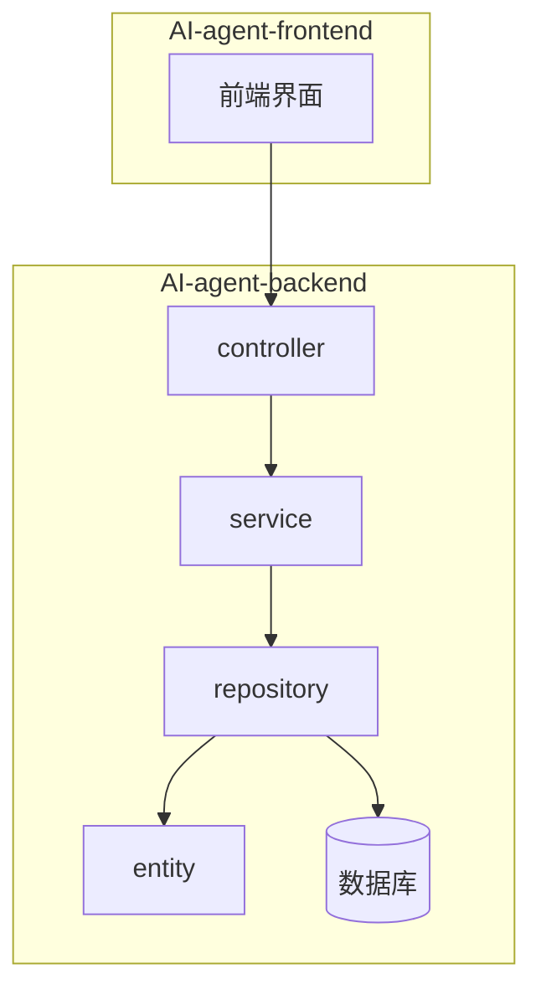
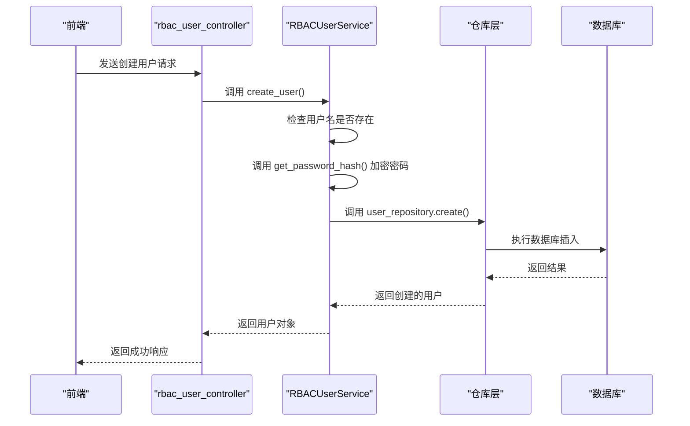
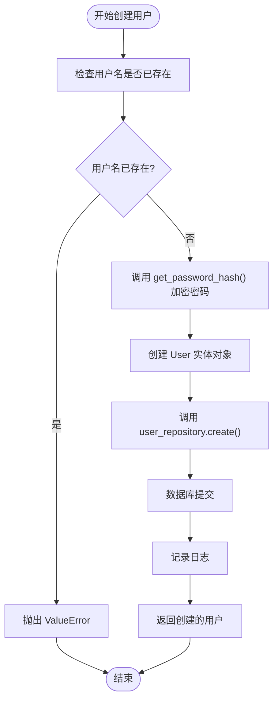
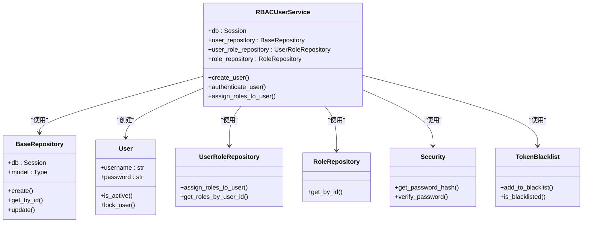

# 服务层（Service）

<cite>
**本文档中引用的文件**  
- [rbac_user_service.py](file://AI-agent-backend/app/service/rbac_user_service.py)
- [user.py](file://AI-agent-backend/app/entity/user.py)
- [security.py](file://AI-agent-backend/app/core/security.py)
- [base_repository.py](file://AI-agent-backend/app/repository/base_repository.py)
- [rbac_user_controller.py](file://AI-agent-backend/app/controller/rbac_user_controller.py)
- [user_role_repository.py](file://AI-agent-backend/app/repository/user_role_repository.py)
- [menu_service.py](file://AI-agent-backend/app/service/menu_service.py) - *在最近提交中更新*
- [token_blacklist.py](file://AI-agent-backend/app/core/token_blacklist.py) - *在最近提交中新增*
</cite>

## 更新摘要
**已做更改**  
- 更新了“架构概述”部分，新增JWT无感刷新与令牌黑名单机制的说明
- 新增“动态用户菜单路由”章节，描述`get_user_menu_tree`方法的实现
- 更新“依赖分析”类图，增加`TokenBlacklist`组件
- 更新“故障排除指南”，增加令牌相关问题的排查建议
- 所有文件引用均已更新为中文标题，并标注变更状态

## 目录
1. [引言](#引言)
2. [项目结构](#项目结构)
3. [核心组件](#核心组件)
4. [架构概述](#架构概述)
5. [详细组件分析](#详细组件分析)
6. [依赖分析](#依赖分析)
7. [性能考虑](#性能考虑)
8. [故障排除指南](#故障排除指南)
9. [结论](#结论)

## 引言
本文档深入解析服务层在业务逻辑封装中的核心作用，重点以 `rbac_user_service.py` 为例，详细阐述其作为控制器与数据访问层之间桥梁的职责。文档将详细描述用户创建、角色分配、密码加密等复合业务流程的实现细节，强调服务类的无状态设计、事务管理以及跨仓库协调能力。同时，将分析方法调用链路、异常传递机制与日志记录策略，为开发者提供全面的技术参考。

## 项目结构
项目采用分层架构设计，清晰地分离了关注点。后端（AI-agent-backend）应用的核心模块包括控制器（controller）、实体（entity）、仓库（repository）和服务（service），它们共同构成了典型的MVC或六边形架构。



**图示来源**
- [rbac_user_service.py](file://AI-agent-backend/app/service/rbac_user_service.py)
- [rbac_user_controller.py](file://AI-agent-backend/app/controller/rbac_user_controller.py)

## 核心组件
服务层是业务逻辑的核心，它封装了复杂的业务规则和流程，确保了代码的可维护性和可测试性。`RBACUserService` 类是用户管理功能的核心实现。

**本节来源**
- [rbac_user_service.py](file://AI-agent-backend/app/service/rbac_user_service.py)

## 架构概述
系统采用分层架构，前端通过API与后端交互。后端控制器接收请求，调用服务层处理业务逻辑，服务层再协调多个仓库（Repository）来访问数据。这种设计保证了业务逻辑的集中化和数据访问的抽象化。新增的JWT无感刷新机制通过`token_blacklist.py`实现，确保已刷新的令牌无法再次使用。



**图示来源**
- [rbac_user_controller.py](file://AI-agent-backend/app/controller/rbac_user_controller.py#L50-L100)
- [rbac_user_service.py](file://AI-agent-backend/app/service/rbac_user_service.py#L50-L100)
- [base_repository.py](file://AI-agent-backend/app/repository/base_repository.py#L50-L60)

## 详细组件分析
本节将深入分析 `RBACUserService` 的关键功能实现。

### 用户创建流程分析
`create_user` 方法是创建新用户的核心，它协调了多个步骤以确保数据的完整性和安全性。

#### 方法调用流程图


**图示来源**
- [rbac_user_service.py](file://AI-agent-backend/app/service/rbac_user_service.py#L50-L90)
- [security.py](file://AI-agent-backend/app/core/security.py#L10-L20)
- [base_repository.py](file://AI-agent-backend/app/repository/base_repository.py#L50-L60)

**本节来源**
- [rbac_user_service.py](file://AI-agent-backend/app/service/rbac_user_service.py#L50-L90)
- [user.py](file://AI-agent-backend/app/entity/user.py#L50-L100)
- [security.py](file://AI-agent-backend/app/core/security.py#L10-L20)

### 密码加密与验证机制
系统使用 `passlib` 库的 `bcrypt` 算法来安全地处理密码。

**本节来源**
- [security.py](file://AI-agent-backend/app/core/security.py)

### 角色分配与权限检查
`assign_roles_to_user` 方法实现了为用户分配角色的复杂业务逻辑，涉及事务管理。

#### 角色分配序列图
```mermaid
sequenceDiagram
participant Controller
participant Service as RBACUserService
participant RoleRepo as RoleRepository
participant UserRoleRepo as UserRoleRepository
participant DB
Controller->>Service : assign_roles_to_user(user_id, role_ids)
Service->>Service : 检查用户是否存在
loop 遍历每个 role_id
Service->>RoleRepo : get_by_id(role_id)
RoleRepo-->>Service : 返回角色对象
alt 角色不存在
Service-->>Controller : 返回 False
return
end
end
Service->>UserRoleRepo : assign_roles_to_user(user_id, role_ids)
UserRoleRepo->>DB : 先删除旧关联，再插入新关联
DB-->>UserRoleRepo : 完成
Service->>DB : commit()
alt 提交成功
Service-->>Controller : 返回 True
else 提交失败
Service->>DB : rollback()
Service-->>Controller : 返回 False
end
```

**图示来源**
- [rbac_user_service.py](file://AI-agent-backend/app/service/rbac_user_service.py#L250-L280)
- [user_role_repository.py](file://AI-agent-backend/app/repository/user_role_repository.py#L100-L150)

**本节来源**
- [rbac_user_service.py](file://AI-agent-backend/app/service/rbac_user_service.py#L250-L280)
- [user_role_repository.py](file://AI-agent-backend/app/repository/user_role_repository.py#L100-L150)
- [menu_service.py](file://AI-agent-backend/app/service/menu_service.py#L150-L180)

### 动态用户菜单路由
`get_user_menu_tree` 方法为前端提供动态路由数据，根据用户权限构建专属菜单树结构。

**本节来源**
- [menu_service.py](file://AI-agent-backend/app/service/menu_service.py#L300-L350) - *在最近提交中更新*

## 依赖分析
服务层依赖于多个其他模块，形成了清晰的依赖关系。



**图示来源**
- [rbac_user_service.py](file://AI-agent-backend/app/service/rbac_user_service.py)
- [base_repository.py](file://AI-agent-backend/app/repository/base_repository.py)
- [user.py](file://AI-agent-backend/app/entity/user.py)
- [token_blacklist.py](file://AI-agent-backend/app/core/token_blacklist.py) - *在最近提交中新增*

**本节来源**
- [rbac_user_service.py](file://AI-agent-backend/app/service/rbac_user_service.py)
- [base_repository.py](file://AI-agent-backend/app/repository/base_repository.py)

## 性能考虑
服务层的设计考虑了性能因素。例如，`BaseRepository` 提供了 `get_all` 方法的分页参数，避免一次性加载过多数据。同时，日志记录使用了适当的级别（如 `info` 和 `warning`），避免了过度的日志输出影响性能。

## 故障排除指南
当用户创建失败时，应首先检查日志。常见的错误包括：
- **用户名已存在**：检查 `RBACUserService.create_user` 中的 `ValueError`。
- **数据库连接失败**：检查 `BaseRepository.create` 中的 `SQLAlchemyError` 和回滚操作。
- **密码验证失败**：检查 `RBACUserService.authenticate_user` 中的 `verify_password` 返回值和日志警告。
- **令牌刷新失败**：检查 `token_blacklist.py` 中的 `is_blacklisted` 方法，确认刷新令牌是否已被加入黑名单。

**本节来源**
- [rbac_user_service.py](file://AI-agent-backend/app/service/rbac_user_service.py)
- [base_repository.py](file://AI-agent-backend/app/repository/base_repository.py)
- [token_blacklist.py](file://AI-agent-backend/app/core/token_blacklist.py) - *在最近提交中新增*

## 结论
`RBACUserService` 是一个设计良好的服务层实现，它成功地封装了用户管理的复杂业务逻辑。通过协调多个仓库、管理数据库事务、处理异常和记录日志，它为上层控制器提供了一个稳定、安全的接口。其无状态的设计也使得它易于测试和扩展。理解其内部工作原理对于维护和增强系统功能至关重要。