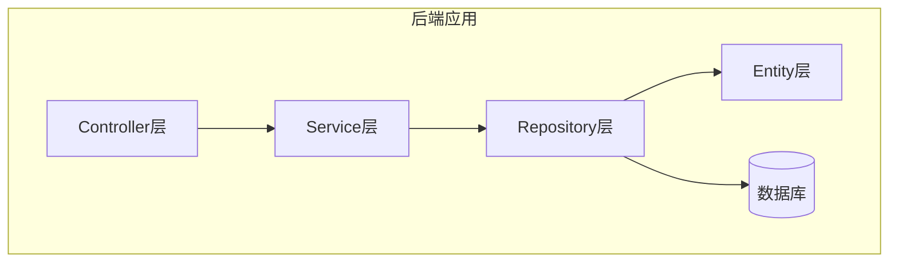
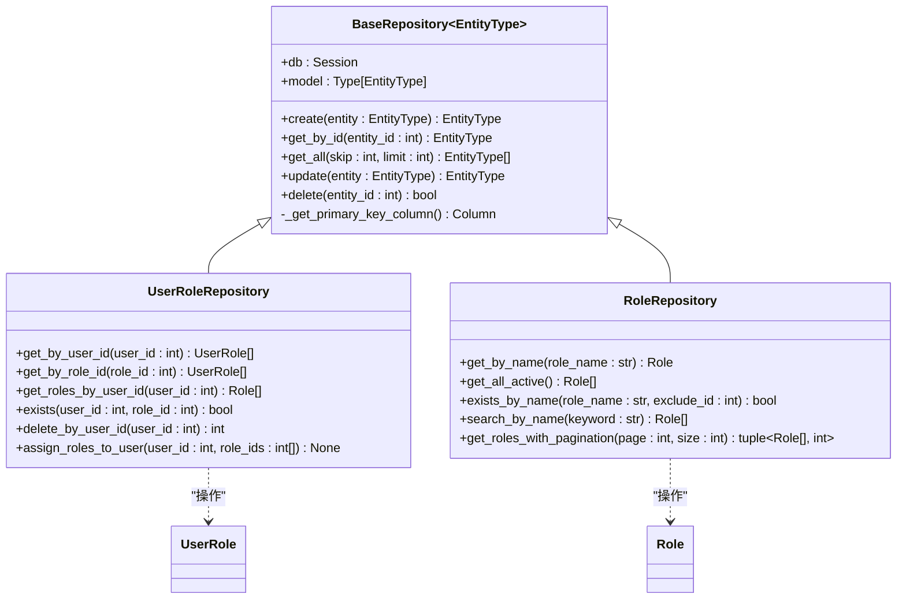
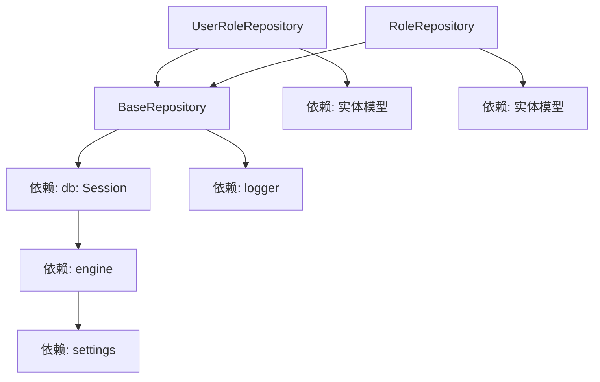

# 仓库层数据访问实现

<cite>
**本文档引用的文件**  
- [base_repository.py](file://AI-agent-backend\app\repository\base_repository.py)
- [user_role_repository.py](file://AI-agent-backend\app\repository\user_role_repository.py)
- [role_repository.py](file://AI-agent-backend\app\repository\role_repository.py)
- [session.py](file://AI-agent-backend\app\db\session.py)
- [role.py](file://AI-agent-backend\app\entity\role.py)
- [user.py](file://AI-agent-backend\app\entity\user.py)
- [user_role.py](file://AI-agent-backend\app\entity\user_role.py)
</cite>

## 目录

1. [引言](#引言)  
2. [项目结构](#项目结构)  
3. [核心组件](#核心组件)  
4. [架构概览](#架构概览)  
5. [详细组件分析](#详细组件分析)  
6. [依赖分析](#依赖分析)  
7. [性能考量](#性能考量)  
8. [故障排查指南](#故障排查指南)  
9. [结论](#结论)

## 引言

本项目为一个基于RBAC（基于角色的访问控制）权限系统的后端服务，采用分层架构设计，其中`repository`层负责数据访问逻辑的封装。本文档系统阐述`repository`层的设计模式与实现方法，重点分析以`BaseRepository`为基类的通用CRUD操作封装机制，以及具体实现类如何扩展基础功能并实现自定义查询。同时，文档将解释数据库会话的获取方式、事务管理机制，并探讨查询优化技巧，特别是如何防止N+1查询问题。

## 项目结构

项目采用典型的分层架构，`repository`层位于`app/repository`目录下，与`entity`（实体层）、`service`（业务层）和`controller`（控制层）协同工作。`repository`层的核心是`BaseRepository`基类，它为所有实体提供通用的数据访问方法。



**图示来源**  
- [base_repository.py](file://AI-agent-backend\app\repository\base_repository.py)
- [user_role_repository.py](file://AI-agent-backend\app\repository\user_role_repository.py)

## 核心组件

`repository`层的核心组件包括`BaseRepository`基类和多个具体实现类，如`UserRoleRepository`和`RoleRepository`。`BaseRepository`通过泛型编程和依赖注入，实现了对任意实体的通用CRUD操作封装。具体实现类则继承基类，并根据业务需求扩展自定义查询方法。

**组件来源**  
- [base_repository.py](file://AI-agent-backend\app\repository\base_repository.py#L1-L225)
- [role_repository.py](file://AI-agent-backend\app\repository\role_repository.py#L1-L100)

## 架构概览

系统采用经典的分层架构，`repository`层作为数据访问的统一入口，隔离了上层业务逻辑与底层数据库的直接耦合。`BaseRepository`基类定义了`create`、`get_by_id`、`update`、`delete`等标准方法，确保了数据访问接口的一致性。



**图示来源**  
- [base_repository.py](file://AI-agent-backend\app\repository\base_repository.py#L1-L225)
- [user_role_repository.py](file://AI-agent-backend\app\repository\user_role_repository.py#L1-L162)
- [role_repository.py](file://AI-agent-backend\app\repository\role_repository.py#L1-L100)

## 详细组件分析

### BaseRepository 基类分析

`BaseRepository`是所有具体`repository`的基类，它采用泛型`EntityType`来适配不同的实体模型。通过在构造函数中注入`Session`和`model`，实现了对任意实体的通用操作。

#### 通用CRUD操作封装

`BaseRepository`封装了以下核心方法：
- **create**: 添加新实体，自动提交事务并刷新对象以获取数据库生成的ID。
- **get_by_id**: 根据主键ID查询实体，内部通过`_get_primary_key_column`动态获取主键字段。
- **update**: 更新实体，调用`commit`和`refresh`同步数据库变更。
- **delete**: 先通过`get_by_id`查询实体，再执行删除操作。
- **异常处理**: 所有数据库操作都包裹在`try-except`块中，捕获`SQLAlchemyError`并执行`rollback`回滚事务，同时记录错误日志。

```python
def create(self, entity: EntityType) -> EntityType:
    try:
        self.db.add(entity)
        self.db.commit()
        self.db.refresh(entity)
        return entity
    except SQLAlchemyError as e:
        self.db.rollback()
        logger.error(f"Error creating {self.model.__name__}: {str(e)}")
        raise
```

**图示来源**  
- [base_repository.py](file://AI-agent-backend\app\repository\base_repository.py#L51-L91)

### UserRoleRepository 实现分析

`UserRoleRepository`继承自`BaseRepository[UserRole]`，专门用于处理用户角色关联表`t_user_role`的数据访问。

#### 扩展基础功能与自定义查询

该类在继承通用CRUD的基础上，实现了多个自定义查询方法：
- **get_roles_by_user_id**: 使用`join`查询，直接获取指定用户的所有角色信息，避免了在业务层进行多次查询。
- **exists**: 重载了基类的`exists`方法，根据`user_id`和`role_id`两个字段检查关联是否存在。
- **assign_roles_to_user**: 实现了“先删除后添加”的原子性操作，用于为用户重新分配角色集合。

```python
def get_roles_by_user_id(self, user_id: int) -> List[Role]:
    return self.db.query(Role).join(
        UserRole, Role.ROLE_ID == UserRole.ROLE_ID
    ).filter(UserRole.USER_ID == user_id).all()
```

**图示来源**  
- [user_role_repository.py](file://AI-agent-backend\app\repository\user_role_repository.py#L1-L162)

### RoleRepository 实现分析

`RoleRepository`继承自`BaseRepository[Role]`，用于处理角色实体的数据访问。

#### 特定查询逻辑实现

该类实现了针对角色业务的特定查询：
- **get_by_name**: 根据角色名称精确查询。
- **search_by_name**: 使用`LIKE`操作符进行模糊搜索。
- **get_roles_with_pagination**: 实现分页查询，返回数据列表和总记录数，便于前端分页展示。

```python
def get_roles_with_pagination(self, page: int = 1, size: int = 10) -> tuple[List[Role], int]:
    offset = (page - 1) * size
    total = self.db.query(Role).count()
    roles = self.db.query(Role).offset(offset).limit(size).all()
    return roles, total
```

**图示来源**  
- [role_repository.py](file://AI-agent-backend\app\repository\role_repository.py#L1-L100)

## 依赖分析

`repository`层的正常运行依赖于多个核心组件。



**图示来源**  
- [base_repository.py](file://AI-agent-backend\app\repository\base_repository.py)
- [session.py](file://AI-agent-backend\app\db\session.py)

## 性能考量

### 数据库会话与事务管理

数据库会话通过`db.session`获取，具体实现位于`app/db/session.py`中的`get_db()`函数。该函数是一个生成器，用于FastAPI的依赖注入，确保每个请求都有独立的数据库会话。

- **会话获取**: `get_db()`创建`SessionLocal()`实例。
- **事务边界**: 事务的边界由调用者（通常是`service`层）控制。`BaseRepository`的方法在执行`commit`时提交事务，如果发生异常则`rollback`。
- **异常回滚**: 所有`BaseRepository`的写操作都包含异常处理，一旦捕获`SQLAlchemyError`，立即执行`db.rollback()`，保证数据一致性。

```python
def get_db() -> Session:
    db = SessionLocal()
    try:
        yield db
    except Exception as e:
        db.rollback()
        raise
    finally:
        db.close()
```

**组件来源**  
- [session.py](file://AI-agent-backend\app\db\session.py#L70-L90)

### 查询优化与N+1问题

虽然在当前代码库中未直接发现`selectinload`的使用，但根据实体间的关联关系，N+1查询问题是一个潜在的性能瓶颈。

#### 实体关联关系分析

- **User** 与 **Role**: 通过`UserRole`关联表实现多对多关系。`User`实体有`user_roles`关系，`Role`实体也有`user_roles`关系。
- **Role** 与 **Menu**: 通过`RoleMenu`关联表实现多对多关系。

#### N+1问题示例

假设需要查询一个用户及其所有角色信息：
```python
user = user_repo.get_by_id(1)
for user_role in user.user_roles: # 这会触发一次查询
    print(user_role.role.role_name) # 这里每访问一个role，都会触发一次新的SQL查询
```
上述代码会先执行1次查询获取用户，然后为每个角色关联执行1次查询来加载角色信息，总共执行`1 + N`次查询，即N+1问题。

#### 防止N+1问题的方案

应使用SQLAlchemy的预加载（Eager Loading）策略，如`selectinload`，在初始查询时就将关联数据一并加载：
```python
from sqlalchemy.orm import selectinload

# 在查询用户时，预加载其角色和角色详情
user = db.query(User).options(
    selectinload(User.user_roles).selectinload(UserRole.role)
).filter(User.user_id == 1).first()
```
这样，整个操作只会生成2条SQL语句（一条查用户和关联，一条查角色），极大地提升了性能。

**组件来源**  
- [user.py](file://AI-agent-backend\app\entity\user.py#L1-L215)
- [role.py](file://AI-agent-backend\app\entity\role.py#L1-L90)
- [user_role.py](file://AI-agent-backend\app\entity\user_role.py#L1-L61)

## 故障排查指南

- **数据库连接失败**: 检查`app/core/config.py`中的`DATABASE_URL`配置是否正确。
- **事务未提交**: 确保在`service`层调用了`repository`的`create`或`update`方法后，没有发生未捕获的异常导致`rollback`。
- **N+1查询导致性能低下**: 使用数据库查询日志监控，如果发现对同一张表的重复查询，应考虑使用`selectinload`进行优化。
- **实体关联数据为空**: 检查是否在查询时正确使用了`options`来加载关联关系。

**组件来源**  
- [base_repository.py](file://AI-agent-backend\app\repository\base_repository.py)
- [session.py](file://AI-agent-backend\app\db\session.py)

## 结论

`repository`层通过`BaseRepository`基类实现了高度复用的通用CRUD操作，降低了代码冗余。具体实现类如`UserRoleRepository`和`RoleRepository`通过继承和扩展，提供了丰富的自定义查询能力，满足了复杂的业务需求。数据库会话通过依赖注入安全地传递，事务管理清晰明确。尽管当前代码未显式使用`selectinload`，但基于实体间的多对多关系，强烈建议在需要加载关联数据的场景中采用预加载策略，以防止N+1查询问题，保障系统性能。