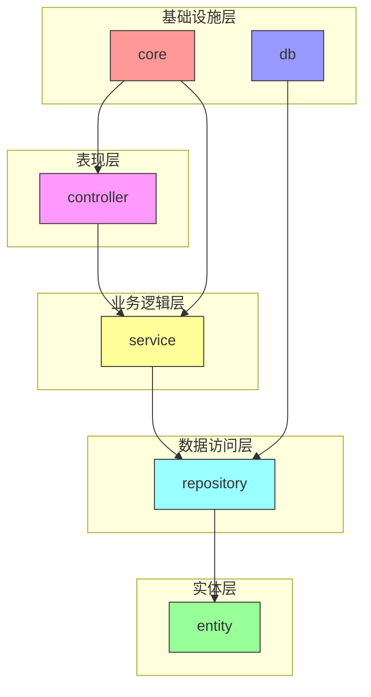
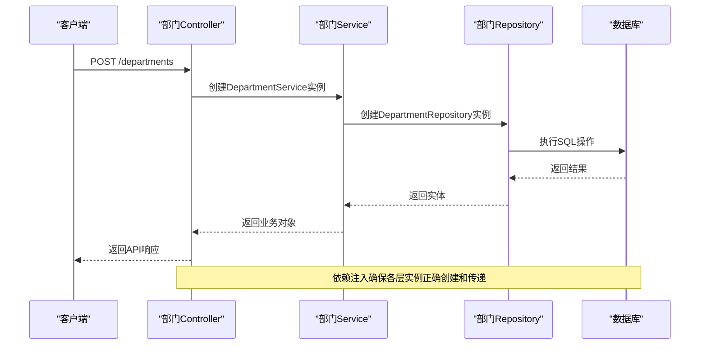
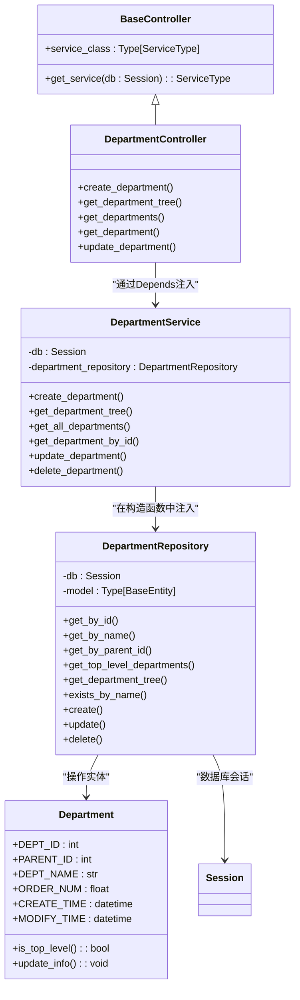
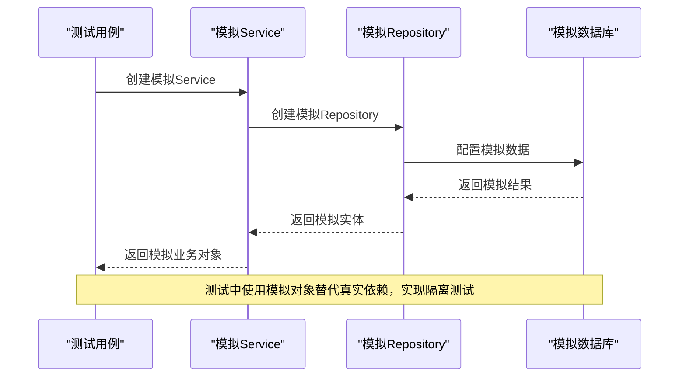
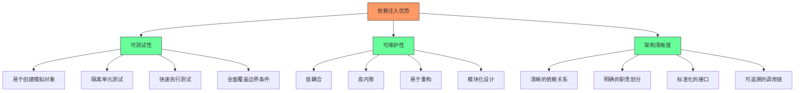

# 依赖注入与分层解耦

<cite>
**本文档引用的文件**  
- [main.py](file://AI-agent-backend/main.py)
- [session.py](file://AI-agent-backend/app/db/session.py)
- [base.py](file://AI-agent-backend/app/controller/base.py)
- [department_controller.py](file://AI-agent-backend/app/controller/department_controller.py)
- [department_service.py](file://AI-agent-backend/app/service/department_service.py)
- [department_repository.py](file://AI-agent-backend/app/repository/department_repository.py)
- [test_base.py](file://AI-agent-backend/app/tests/test_base.py)
</cite>

## 目录
1. [项目结构分析](#项目结构分析)
2. [依赖注入机制总览](#依赖注入机制总览)
3. [全局依赖配置](#全局依赖配置)
4. [分层架构与依赖注入链](#分层架构与依赖注入链)
5. [数据库会话生命周期管理](#数据库会话生命周期管理)
6. [服务层与仓库层依赖注入](#服务层与仓库层依赖注入)
7. [新控制器中注入JobService示例](#新控制器中注入jobservice示例)
8. [测试环境下的依赖替换](#测试环境下的依赖替换)
9. [依赖注入的优势分析](#依赖注入的优势分析)

## 项目结构分析

项目采用企业级五层架构设计，清晰地分离了关注点：



**图示来源**  
- [main.py](file://AI-agent-backend/main.py)
- [department_controller.py](file://AI-agent-backend/app/controller/department_controller.py)
- [department_service.py](file://AI-agent-backend/app/service/department_service.py)
- [department_repository.py](file://AI-agent-backend/app/repository/department_repository.py)

**本节来源**  
- [main.py](file://AI-agent-backend/main.py)
- [project_structure](file://workspace_path)

## 依赖注入机制总览

本项目基于FastAPI的依赖注入系统实现了完整的分层解耦。依赖注入贯穿整个应用架构，从HTTP请求入口到数据持久化层，形成了清晰的依赖链。



**图示来源**  
- [department_controller.py](file://AI-agent-backend/app/controller/department_controller.py)
- [department_service.py](file://AI-agent-backend/app/service/department_service.py)
- [department_repository.py](file://AI-agent-backend/app/repository/department_repository.py)

**本节来源**  
- [main.py](file://AI-agent-backend/main.py)
- [department_controller.py](file://AI-agent-backend/app/controller/department_controller.py)

## 全局依赖配置

在`main.py`中，通过FastAPI的依赖注入系统配置了全局依赖，实现了跨控制器的共享功能。

```python
# AI-agent-backend/main.py
app = FastAPI(
    title=settings.APP_NAME,
    version=settings.APP_VERSION,
    lifespan=lifespan
)

# 配置CORS中间件
app.add_middleware(
    CORSMiddleware,
    allow_origins=settings.ALLOWED_ORIGINS,
    allow_methods=settings.ALLOWED_METHODS,
    allow_headers=settings.ALLOWED_HEADERS,
)

# 注册路由
app.include_router(role_router, prefix=settings.API_V1_PREFIX)
app.include_router(menu_router, prefix=settings.API_V1_PREFIX)
app.include_router(department_router, prefix=settings.API_V1_PREFIX)
app.include_router(rbac_user_router, prefix=settings.API_V1_PREFIX)
```

全局依赖配置的关键特点：
- **应用生命周期管理**：通过`lifespan`上下文管理器，在应用启动时创建数据库表，在关闭时执行清理
- **跨域资源共享(CORS)**：通过中间件配置全局CORS策略
- **统一异常处理**：定义了全局异常处理器，处理自定义API异常、请求验证异常和通用异常
- **健康检查端点**：提供`/health`端点用于系统监控

**本节来源**  
- [main.py](file://AI-agent-backend/main.py#L1-L200)

## 分层架构与依赖注入链

项目采用标准的分层架构，各层之间通过依赖注入实现松耦合。以部门管理功能为例，展示了完整的依赖注入链。



**图示来源**  
- [base.py](file://AI-agent-backend/app/controller/base.py)
- [department_controller.py](file://AI-agent-backend/app/controller/department_controller.py)
- [department_service.py](file://AI-agent-backend/app/service/department_service.py)
- [department_repository.py](file://AI-agent-backend/app/repository/department_repository.py)
- [entity/department.py](file://AI-agent-backend/app/entity/department.py)

**本节来源**  
- [department_controller.py](file://AI-agent-backend/app/controller/department_controller.py)
- [department_service.py](file://AI-agent-backend/app/service/department_service.py)

## 数据库会话生命周期管理

数据库会话通过`get_db`依赖项实现请求级别的生命周期管理，确保每个HTTP请求拥有独立的数据库会话。

```python
# AI-agent-backend/app/db/session.py
def get_db() -> Session:
    """
    获取数据库会话
    用于FastAPI依赖注入
    
    Yields:
        数据库会话对象
    """
    db = SessionLocal()
    try:
        yield db
    except Exception as e:
        logger.error(f"Database session error: {str(e)}")
        db.rollback()
        raise
    finally:
        db.close()
```

数据库会话管理的关键特性：
- **请求作用域**：每个HTTP请求获取一个独立的数据库会话，请求结束后自动关闭
- **异常安全**：使用try-except-finally确保会话在异常情况下也能正确关闭
- **事务管理**：在异常时自动回滚事务，保证数据一致性
- **资源释放**：finally块确保会话连接被释放，防止连接泄漏

在控制器中通过`Depends(get_db)`注入数据库会话：

```python
# AI-agent-backend/app/controller/department_controller.py
@router.post("/", response_model=ApiResponse[DepartmentResponse])
async def create_department(
    request: DepartmentCreateRequest,
    db: Session = Depends(get_db)
):
    department_service = DepartmentService(db)
    # ... 业务逻辑
```

**本节来源**  
- [session.py](file://AI-agent-backend/app/db/session.py#L40-L60)
- [department_controller.py](file://AI-agent-backend/app/controller/department_controller.py#L30-L40)

## 服务层与仓库层依赖注入

服务层通过构造函数注入仓库层实例，实现了业务逻辑与数据访问的分离。

```python
# AI-agent-backend/app/service/department_service.py
class DepartmentService:
    """
    部门Service类
    提供部门相关的业务逻辑处理
    """

    def __init__(self, db: Session):
        """
        初始化部门Service
        
        Args:
            db: 数据库会话
        """
        self.db = db
        self.department_repository = DepartmentRepository(db)
```

仓库层继承自`BaseRepository`，实现了通用的数据访问操作：

```python
# AI-agent-backend/app/repository/department_repository.py
class DepartmentRepository(BaseRepository[Department]):
    """
    部门Repository类
    提供部门相关的数据库操作方法
    """

    def __init__(self, db: Session):
        """
        初始化部门Repository
        
        Args:
            db: 数据库会话
        """
        super().__init__(db, Department)
```

这种设计模式的优势：
- **单一职责**：服务层专注于业务逻辑，仓库层专注于数据访问
- **可复用性**：`BaseRepository`提供了通用的CRUD操作，减少重复代码
- **可测试性**：可以独立测试服务层逻辑，无需依赖真实数据库
- **可维护性**：数据访问逻辑集中管理，便于优化和调试

**本节来源**  
- [department_service.py](file://AI-agent-backend/app/service/department_service.py#L20-L30)
- [department_repository.py](file://AI-agent-backend/app/repository/department_repository.py#L15-L25)

## 新控制器中注入JobService示例

当需要创建新的控制器并注入`JobService`时，可以遵循以下模式：

```python
# AI-agent-backend/app/controller/job_controller.py
"""
任务Controller
处理任务相关的HTTP请求
"""

from fastapi import APIRouter, Depends, HTTPException, status
from sqlalchemy.orm import Session
from typing import List

from app.core.logger import get_logger
from app.db.session import get_db
from app.dto.base import ApiResponse
from app.dto.job_dto import (
    JobCreateRequest,
    JobUpdateRequest,
    JobResponse,
    JobListResponse
)
from app.service.job_service import JobService

logger = get_logger(__name__)

# 创建路由器
router = APIRouter(prefix="/jobs", tags=["任务管理"])

@router.post("/", response_model=ApiResponse[JobResponse], summary="创建任务")
async def create_job(
    request: JobCreateRequest,
    db: Session = Depends(get_db)
):
    """
    创建新任务
    
    - **job_name**: 任务名称
    - **job_type**: 任务类型
    - **cron_expression**: 定时表达式
    """
    try:
        job_service = JobService(db)
        job = job_service.create_job(
            job_name=request.job_name,
            job_type=request.job_type,
            cron_expression=request.cron_expression,
            parameters=request.parameters
        )
        
        # 转换为响应格式
        job_response = JobResponse(
            job_id=job.JOB_ID,
            job_name=job.JOB_NAME,
            job_type=job.JOB_TYPE,
            cron_expression=job.CRON_EXPRESSION,
            status=job.STATUS,
            create_time=job.CREATE_TIME,
            modify_time=job.MODIFY_TIME
        )
        
        logger.info(f"Job created successfully: {job.JOB_NAME}")
        return ApiResponse.success_response(data=job_response, message="任务创建成功")
        
    except ValueError as e:
        logger.warning(f"Job creation failed: {str(e)}")
        raise HTTPException(
            status_code=status.HTTP_400_BAD_REQUEST,
            detail=str(e)
        )
    except Exception as e:
        logger.error(f"Unexpected error creating job: {str(e)}")
        raise HTTPException(
            status_code=status.HTTP_500_INTERNAL_SERVER_ERROR,
            detail="创建任务失败"
        )

@router.get("/", response_model=ApiResponse[JobListResponse], summary="获取任务列表")
async def get_jobs(
    db: Session = Depends(get_db)
):
    """
    获取所有任务列表
    """
    try:
        job_service = JobService(db)
        jobs = job_service.get_all_jobs()
        
        # 转换为响应格式
        job_responses = [
            JobResponse(
                job_id=job.JOB_ID,
                job_name=job.JOB_NAME,
                job_type=job.JOB_TYPE,
                cron_expression=job.CRON_EXPRESSION,
                status=job.STATUS,
                create_time=job.CREATE_TIME,
                modify_time=job.MODIFY_TIME
            )
            for job in jobs
        ]
        
        job_list_response = JobListResponse(jobs=job_responses)
        
        return ApiResponse.success_response(data=job_list_response, message="获取任务列表成功")
        
    except Exception as e:
        logger.error(f"Error getting jobs: {str(e)}")
        raise HTTPException(
            status_code=status.HTTP_500_INTERNAL_SERVER_ERROR,
            detail="获取任务列表失败"
        )
```

关键实现要点：
1. **导入依赖**：导入必要的模块，包括`JobService`和相关的DTO类
2. **创建路由器**：使用`APIRouter`创建新的路由前缀
3. **注入数据库会话**：在每个路由函数中使用`Depends(get_db)`注入数据库会话
4. **创建服务实例**：在路由函数中创建`JobService`实例，传入数据库会话
5. **处理业务逻辑**：调用服务方法执行业务逻辑
6. **转换响应格式**：将服务返回的实体转换为DTO响应格式
7. **异常处理**：捕获并处理可能出现的异常

**本节来源**  
- [department_controller.py](file://AI-agent-backend/app/controller/department_controller.py)
- [department_service.py](file://AI-agent-backend/app/service/department_service.py)

## 测试环境下的依赖替换

在测试环境中，通过模拟对象（Mock）替换真实依赖，实现单元测试的隔离性。

```python
# AI-agent-backend/app/tests/test_base.py
class MockTestCase(BaseTestCase):
    """
    模拟测试基类
    提供模拟对象的创建和管理
    """
    
    def create_mock_repository(self, entity_class):
        """
        创建模拟Repository
        
        Args:
            entity_class: 实体类
            
        Returns:
            模拟Repository对象
        """
        from unittest.mock import Mock
        
        mock_repo = Mock()
        mock_repo.model = entity_class
        
        return mock_repo
    
    def create_mock_service(self, repository):
        """
        创建模拟Service
        
        Args:
            repository: Repository对象
            
        Returns:
            模拟Service对象
        """
        from unittest.mock import Mock
        
        mock_service = Mock()
        mock_service.repository = repository
        
        return mock_service
```

测试中依赖替换的实现方式：



**图示来源**  
- [test_base.py](file://AI-agent-backend/app/tests/test_base.py#L270-L330)

**本节来源**  
- [test_base.py](file://AI-agent-backend/app/tests/test_base.py#L270-L330)

具体测试示例：

```python
# 在测试中使用模拟对象
def test_create_department_success(self, db_session: Session):
    """测试创建部门成功"""
    # 创建模拟Repository
    mock_repo = self.create_mock_repository(Department)
    mock_repo.exists_by_name.return_value = False
    
    # 创建模拟Service
    dept_service = DepartmentService(db_session)
    # 替换真实的repository为模拟对象
    dept_service.department_repository = mock_repo
    
    # 执行测试
    dept = dept_service.create_department(
        parent_id=0,
        dept_name="技术部",
        order_num=1
    )
    
    # 验证结果
    assert dept is not None
    assert dept.DEPT_NAME == "技术部"
    # 验证repository方法被正确调用
    mock_repo.exists_by_name.assert_called_once_with("技术部")
    mock_repo.create.assert_called_once()
```

测试环境下依赖替换的优势：
- **隔离性**：测试不依赖外部系统（如数据库、网络服务）
- **速度**：模拟对象操作比真实I/O快得多
- **可预测性**：可以精确控制模拟对象的行为和返回值
- **全面性**：可以测试各种边界条件和异常情况
- **可重复性**：测试结果不受外部环境影响

## 依赖注入的优势分析

依赖注入机制为项目带来了显著的优势，主要体现在可测试性、可维护性和架构清晰度三个方面。



**图示来源**  
- [main.py](file://AI-agent-backend/main.py)
- [department_controller.py](file://AI-agent-backend/app/controller/department_controller.py)
- [test_base.py](file://AI-agent-backend/app/tests/test_base.py)

**本节来源**  
- [main.py](file://AI-agent-backend/main.py)
- [department_controller.py](file://AI-agent-backend/app/controller/department_controller.py)
- [test_base.py](file://AI-agent-backend/app/tests/test_base.py)

### 可测试性提升

依赖注入使得单元测试更加简单和高效：
- **模拟依赖**：可以轻松创建模拟对象替换真实依赖
- **隔离测试**：每个组件可以独立测试，不受其他组件影响
- **快速执行**：避免了数据库I/O等耗时操作，测试执行速度大幅提升
- **全面覆盖**：可以测试各种异常情况和边界条件

### 可维护性增强

依赖注入提高了代码的可维护性：
- **低耦合**：组件之间通过接口交互，降低相互依赖
- **高内聚**：每个组件专注于单一职责
- **易于重构**：可以独立修改组件实现而不影响其他组件
- **模块化**：组件可以独立开发、测试和部署

### 架构清晰度

依赖注入使架构更加清晰：
- **显式依赖**：所有依赖关系都明确声明，易于理解
- **标准化**：统一的依赖注入模式，降低学习成本
- **可追溯**：依赖链清晰可见，便于调试和问题定位
- **可扩展**：新组件可以轻松集成到现有架构中

综上所述，依赖注入机制不仅实现了各层之间的解耦，还显著提升了代码的可测试性和可维护性，是构建高质量企业级应用的关键技术。