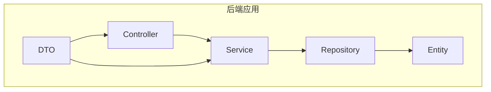
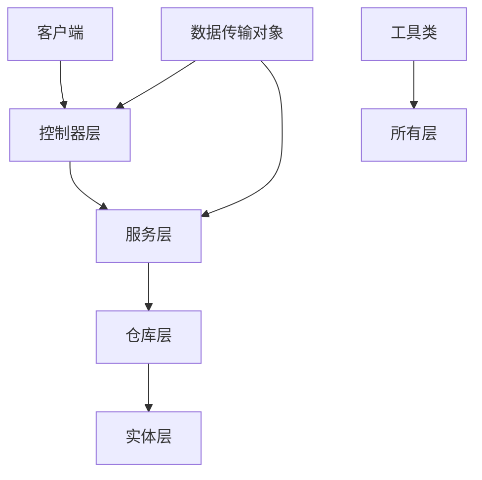
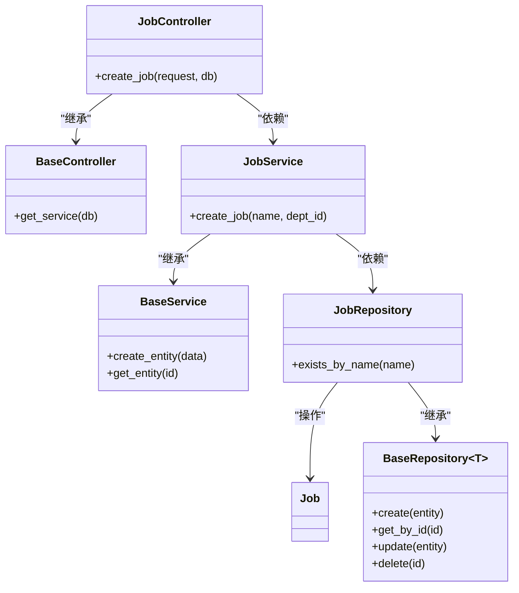
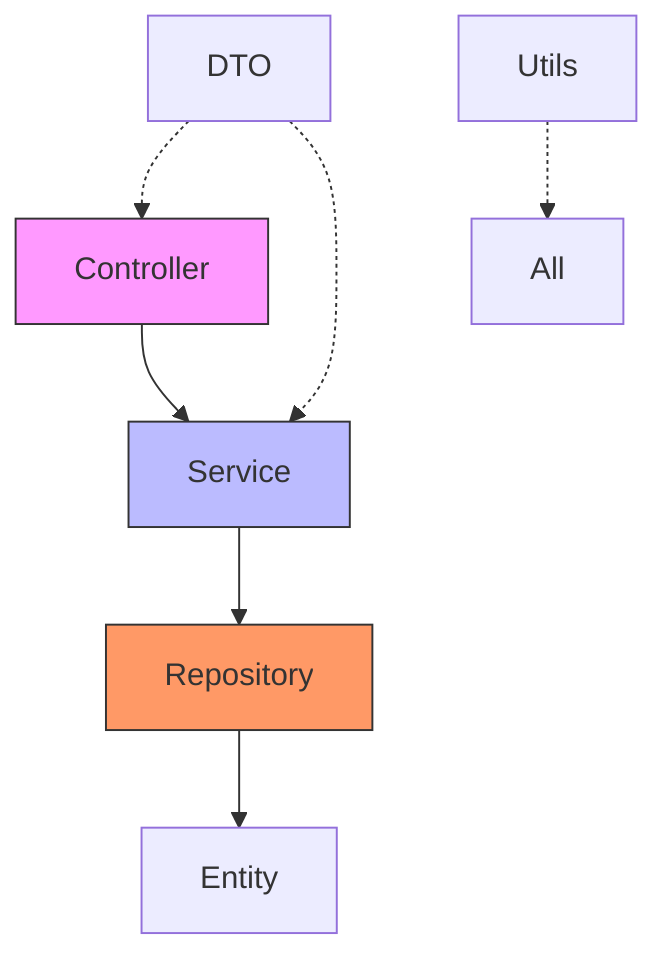

# 后端组件开发流程

<cite>
**本文档引用的文件**  
- [main.py](file://AI-agent-backend/main.py)
- [department_controller.py](file://AI-agent-backend/app/controller/department_controller.py)
- [department_service.py](file://AI-agent-backend/app/service/department_service.py)
- [department_repository.py](file://AI-agent-backend/app/repository/department_repository.py)
- [department.py](file://AI-agent-backend/app/entity/department.py)
- [department_dto.py](file://AI-agent-backend/app/dto/department_dto.py)
- [base.py](file://AI-agent-backend/app/controller/base.py)
- [base.py](file://AI-agent-backend/app/service/base.py)
- [base.py](file://AI-agent-backend/app/repository/base.py)
- [base.py](file://AI-agent-backend/app/entity/base.py)
- [base.py](file://AI-agent-backend/app/dto/base.py)
</cite>

## 目录

1. [引言](#引言)  
2. [项目结构](#项目结构)  
3. [核心组件](#核心组件)  
4. [架构概览](#架构概览)  
5. [详细组件分析](#详细组件分析)  
6. [依赖分析](#依赖分析)  
7. [性能考量](#性能考量)  
8. [故障排除指南](#故障排除指南)  
9. [结论](#结论)

## 引言

本文档旨在详细指导如何在现有的五层后端架构中扩展新功能，以“岗位管理”模块为例，完整演示从实体定义、数据传输对象（DTO）、数据访问层（Repository）、业务逻辑层（Service）到控制器层（Controller）的开发流程。文档将重点说明各层之间的依赖注入机制、基类继承复用、Pydantic模型验证、异常处理与日志记录等最佳实践。

## 项目结构

本项目采用典型的五层分层架构，各层职责清晰，便于维护和扩展。以下是核心目录结构：



**图示来源**  
- [main.py](file://AI-agent-backend/main.py#L1-L43)
- [department_controller.py](file://AI-agent-backend/app/controller/department_controller.py#L1-L325)

## 核心组件

系统采用FastAPI作为Web框架，结合SQLAlchemy进行ORM操作，实现清晰的分层架构。各层通过依赖注入（Depends）解耦，确保高内聚、低耦合。

**本节来源**  
- [main.py](file://AI-agent-backend/main.py#L1-L43)
- [base.py](file://AI-agent-backend/app/controller/base.py#L1-L52)

## 架构概览

系统采用企业级五层架构，各层职责如下：



**图示来源**  
- [main.py](file://AI-agent-backend/main.py#L1-L43)
- [department_controller.py](file://AI-agent-backend/app/controller/department_controller.py#L1-L325)

## 详细组件分析

### 岗位管理模块扩展流程

以添加“岗位管理”模块为例，演示完整开发流程。

#### 1. 实体层（Entity）

定义`Job`实体类，继承自`BaseEntity`，映射数据库表`t_job`。

```python
class Job(BaseEntity):
    __tablename__ = "t_job"
    
    job_id = Column(Integer, primary_key=True, comment="岗位ID")
    job_name = Column(String(100), nullable=False, comment="岗位名称")
    dept_id = Column(Integer, ForeignKey("t_dept.dept_id"), comment="所属部门")
    
    # 关联关系
    department = relationship("Department", back_populates="jobs")
```

**说明**：  
- 继承`BaseEntity`可复用软删除、钩子方法等通用功能  
- 使用`Column`定义字段，支持数据库映射  
- `relationship`定义与部门的关联

**本节来源**  
- [department.py](file://AI-agent-backend/app/entity/department.py#L14-L101)
- [base.py](file://AI-agent-backend/app/entity/base.py#L21-L148)

#### 2. 数据传输对象（DTO）

定义请求和响应DTO，使用Pydantic进行数据验证。

```python
class JobCreateRequest(BaseModel):
    job_name: str = Field(..., min_length=1, max_length=100, description="岗位名称")
    dept_id: int = Field(..., gt=0, description="部门ID")

class JobResponse(BaseModel):
    job_id: int
    job_name: str
    dept_id: int
    create_time: Optional[datetime]
```

**说明**：  
- `BaseModel`提供自动数据验证和序列化  
- `Field`用于字段约束和文档描述  
- 响应DTO与实体字段保持一致

**本节来源**  
- [department_dto.py](file://AI-agent-backend/app/dto/department_dto.py)
- [base.py](file://AI-agent-backend/app/dto/base.py)

#### 3. 仓库层（Repository）

实现`JobRepository`，继承`BaseRepository`，复用通用CRUD方法。

```python
class JobRepository(BaseRepository[Job]):
    def __init__(self, db: Session):
        super().__init__(db, Job)
    
    def exists_by_name(self, job_name: str, exclude_id: int = None) -> bool:
        query = self.db.query(Job).filter(Job.job_name == job_name)
        if exclude_id:
            query = query.filter(Job.job_id != exclude_id)
        return query.first() is not None
```

**说明**：  
- 泛型`BaseRepository[Job]`确保类型安全  
- 继承基类获得`create`、`get_by_id`等通用方法  
- 可扩展自定义查询方法

**本节来源**  
- [department_repository.py](file://AI-agent-backend/app/repository/department_repository.py#L14-L147)
- [base.py](file://AI-agent-backend/app/repository/base.py)

#### 4. 服务层（Service）

实现`JobService`，封装业务逻辑。

```python
class JobService:
    def __init__(self, db: Session):
        self.db = db
        self.job_repository = JobRepository(db)
    
    def create_job(self, job_name: str, dept_id: int) -> Job:
        if self.job_repository.exists_by_name(job_name):
            raise ValueError(f"岗位名称 '{job_name}' 已存在")
        
        job = Job(job_name=job_name, dept_id=dept_id)
        return self.job_repository.create(job)
```

**说明**：  
- 依赖注入`Session`和`Repository`  
- 实现业务规则验证  
- 调用仓库层完成数据操作

**本节来源**  
- [department_service.py](file://AI-agent-backend/app/service/department_service.py#L17-L253)
- [base.py](file://AI-agent-backend/app/service/base.py)

#### 5. 控制器层（Controller）

创建`JobController`，暴露REST API接口。

```python
@router.post("/jobs", response_model=ApiResponse[JobResponse])
async def create_job(
    request: JobCreateRequest,
    db: Session = Depends(get_db)
):
    try:
        job_service = JobService(db)
        job = job_service.create_job(request.job_name, request.dept_id)
        
        response = JobResponse(
            job_id=job.job_id,
            job_name=job.job_name,
            dept_id=job.dept_id,
            create_time=job.create_time
        )
        return ApiResponse.success_response(data=response)
    except ValueError as e:
        raise HTTPException(status_code=400, detail=str(e))
    except Exception as e:
        logger.error(f"创建岗位失败: {str(e)}")
        raise HTTPException(status_code=500, detail="创建岗位失败")
```

**说明**：  
- 使用`Depends(get_db)`注入数据库会话  
- `response_model`自动序列化响应  
- 全面的异常处理和日志记录

**本节来源**  
- [department_controller.py](file://AI-agent-backend/app/controller/department_controller.py#L1-L325)
- [base.py](file://AI-agent-backend/app/controller/base.py#L1-L52)

### 依赖注入与继承机制



**图示来源**  
- [base.py](file://AI-agent-backend/app/controller/base.py#L1-L52)
- [base.py](file://AI-agent-backend/app/service/base.py)
- [base.py](file://AI-agent-backend/app/repository/base.py)

## 依赖分析

系统各层之间通过明确的依赖关系解耦：



**图示来源**  
- [main.py](file://AI-agent-backend/main.py#L1-L43)
- [department_controller.py](file://AI-agent-backend/app/controller/department_controller.py#L1-L325)

## 性能考量

- **数据库连接**：使用连接池管理数据库会话  
- **缓存**：可通过`utils.memory_cache`或`redis_client`实现数据缓存  
- **查询优化**：仓库层支持自定义查询方法，避免N+1问题  
- **异步处理**：FastAPI支持异步API，提高并发性能

## 故障排除指南

常见问题及解决方案：

1. **依赖注入失败**  
   - 检查`Depends()`参数是否正确  
   - 确保依赖项已正确注册

2. **数据库操作异常**  
   - 查看日志`core.logger`中的错误信息  
   - 检查实体字段映射是否正确

3. **数据验证失败**  
   - 检查DTO字段约束  
   - 确认请求数据格式

4. **接口返回500错误**  
   - 检查异常处理逻辑  
   - 确保所有异常都被捕获并转换为HTTP异常

**本节来源**  
- [utils.exceptions.py](file://AI-agent-backend/app/utils/exceptions.py)
- [core.logger.py](file://AI-agent-backend/app/core/logger.py)

## 结论

通过遵循五层架构规范，可以高效、规范地扩展新功能。关键要点包括：
- 各层职责分离，便于维护
- 基类继承复用通用功能
- 依赖注入实现解耦
- Pydantic保障数据安全
- 全面的异常处理和日志记录

新模块开发应严格遵循此模式，确保代码质量和系统稳定性。