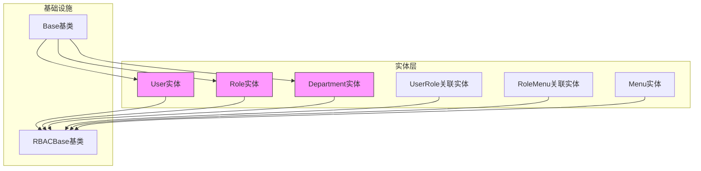
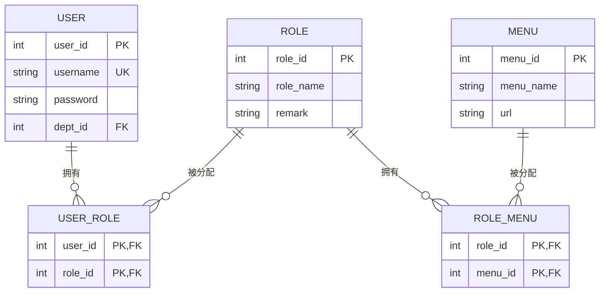

# 实体层设计与实现

<cite>
**本文档引用的文件**  
- [base.py](file://AI-agent-backend/app/db/base.py)
- [rbac_base.py](file://AI-agent-backend/app/entity/rbac_base.py)
- [user.py](file://AI-agent-backend/app/entity/user.py)
- [role.py](file://AI-agent-backend/app/entity/role.py)
- [department.py](file://AI-agent-backend/app/entity/department.py)
- [user_role.py](file://AI-agent-backend/app/entity/user_role.py)
- [role_menu.py](file://AI-agent-backend/app/entity/role_menu.py)
- [menu.py](file://AI-agent-backend/app/entity/menu.py)
</cite>

## 目录
1. [引言](#引言)  
2. [实体层架构概览](#实体层架构概览)  
3. [基类定义与继承机制](#基类定义与继承机制)  
4. [核心实体模型详解](#核心实体模型详解)  
5. [关系映射与多对多设计](#关系映射与多对多设计)  
6. [时间戳与自动管理机制](#时间戳与自动管理机制)  
7. [表名与主键命名规范](#表名与主键命名规范)  
8. [新实体创建示例：Job](#新实体创建示例：job)  
9. [Alembic迁移机制集成](#alembic迁移机制集成)  
10. [总结](#总结)

## 引言

在本系统中，实体层（Entity Layer）是数据持久化的基石，负责将数据库表结构映射为Python对象。通过SQLAlchemy ORM框架，实体类不仅定义了字段、约束和索引，还建立了对象间的关系，支持复杂的业务逻辑操作。本文档以`User`、`Department`、`Role`等核心实体为例，深入解析实体层的设计原则、实现方式及最佳实践，并结合Alembic迁移工具说明模型变更的处理流程。

## 实体层架构概览

实体层位于`AI-agent-backend/app/entity/`目录下，采用模块化设计，每个实体对应一个独立的Python文件。所有实体均继承自统一的基类，确保共性字段和行为的一致性。实体层与Repository、Service、Controller各层协同工作，构成完整的数据访问链路。



**图示来源**  
- [rbac_base.py](file://AI-agent-backend/app/entity/rbac_base.py)
- [user.py](file://AI-agent-backend/app/entity/user.py)
- [role.py](file://AI-agent-backend/app/entity/role.py)
- [department.py](file://AI-agent-backend/app/entity/department.py)

## 基类定义与继承机制

### Base基类

`Base`类定义于`app/db/base.py`，作为通用ORM基类，提供基础字段和工具方法：

```python
@as_declarative()
class Base:
    __allow_unmapped__ = True

    @declared_attr
    def __tablename__(cls) -> str:
        return cls.__name__.lower()

    id = Column(Integer, primary_key=True, index=True, comment="主键ID")
    created_at = Column(DateTime, default=datetime.utcnow, comment="创建时间")
    updated_at = Column(DateTime, default=datetime.utcnow, onupdate=datetime.utcnow, comment="更新时间")
    created_by = Column(String(50), comment="创建者")
    updated_by = Column(String(50), comment="更新者")
    is_deleted = Column(Integer, default=0, comment="是否删除(0:未删除,1:已删除)")

    def to_dict(self) -> dict:
        return {c.name: getattr(self, c.name) for c in self.__table__.columns}
```

该基类通过`@as_declarative()`装饰器启用SQLAlchemy声明性语法，`__tablename__`使用`@declared_attr`动态生成，规则为类名小写。

### RBACBase基类

`RBACBase`定义于`app/entity/rbac_base.py`，专为RBAC（基于角色的访问控制）相关实体设计：

```python
from sqlalchemy.orm import declarative_base
RBACBase = declarative_base()
```

此基类不包含任何字段，仅作为声明性基类的容器，用于隔离RBAC实体的元数据管理。`User`、`Role`、`Department`等实体继承`RBACBase`，而其他通用实体可选择继承`Base`。

**本节来源**  
- [base.py](file://AI-agent-backend/app/db/base.py#L12-L46)
- [rbac_base.py](file://AI-agent-backend/app/entity/rbac_base.py#L9)

## 核心实体模型详解

### User实体

`User`类定义于`app/entity/user.py`，映射`t_user`表，包含用户基本信息与行为方法：

```python
class User(RBACBase):
    __tablename__ = "users"

    user_id = Column(Integer, primary_key=True, comment="用户ID")
    username = Column(String(50), nullable=False, unique=True, index=True, comment="用户名")
    password = Column(String(128), nullable=False, comment="密码")
    dept_id = Column(Integer, ForeignKey('t_dept.dept_id'), nullable=True, comment="部门ID")
    # ... 其他字段

    # 关系
    user_roles = relationship("UserRole", back_populates="user")
    department = relationship("Department", back_populates="users")
```

关键特性：
- 主键为`user_id`而非通用`id`，体现业务语义
- `username`设置唯一约束与索引，保障数据完整性
- `dept_id`外键关联`Department`，形成组织归属关系

### Role实体

`Role`类定义于`app/entity/role.py`，映射`t_role`表：

```python
class Role(RBACBase):
    __tablename__ = "t_role"

    role_id = Column(Integer, primary_key=True, comment="角色ID")
    role_name = Column(String(10), nullable=False, comment="角色名称")
    remark = Column(String(100), nullable=True, comment="角色描述")

    # 关系
    user_roles = relationship("UserRole", back_populates="role")
    role_menus = relationship("RoleMenu", back_populates="role")
```

角色实体聚焦权限定义，通过`role_menus`关联菜单权限。

### Department实体

`Department`类定义于`app/entity/department.py`，映射`t_dept`表：

```python
class Department(RBACBase):
    __tablename__ = "t_dept"

    dept_id = Column(Integer, primary_key=True, comment="部门ID")
    parent_id = Column(Integer, nullable=False, comment="上级部门ID")
    dept_name = Column(String(100), nullable=False, comment="部门名称")
    order_num = Column(DOUBLE(20), nullable=True, comment="排序")

    # 关系
    users = relationship("User", back_populates="department")
```

部门支持树形结构（`parent_id`），用于实现数据权限层级控制。

**本节来源**  
- [user.py](file://AI-agent-backend/app/entity/user.py#L1-L215)
- [role.py](file://AI-agent-backend/app/entity/role.py#L1-L90)
- [department.py](file://AI-agent-backend/app/entity/department.py#L1-L102)

## 关系映射与多对多设计

系统通过关联表实现多对多关系，符合数据库第三范式。

### 用户-角色关系

通过`UserRole`实体建立`User`与`Role`的多对多关系：

```python
class UserRole(RBACBase):
    __tablename__ = "t_user_role"

    user_id = Column(Integer, ForeignKey('users.user_id'), primary_key=True)
    role_id = Column(Integer, ForeignKey('t_role.role_id'), primary_key=True)

    user = relationship("User", back_populates="user_roles")
    role = relationship("Role", back_populates="user_roles")
```

复合主键`(user_id, role_id)`确保唯一性，`back_populates`双向绑定便于对象导航。

### 角色-菜单关系

通过`RoleMenu`实体建立`Role`与`Menu`的多对多关系：

```python
class RoleMenu(RBACBase):
    __tablename__ = "t_role_menu"

    role_id = Column(Integer, ForeignKey('t_role.role_id'), primary_key=True)
    menu_id = Column(Integer, ForeignKey('t_menu.menu_id'), primary_key=True)

    role = relationship("Role", back_populates="role_menus")
    menu = relationship("Menu", back_populates="role_menus")
```

此设计支持灵活的权限分配，一个角色可拥有多个菜单权限。



**图示来源**  
- [user_role.py](file://AI-agent-backend/app/entity/user_role.py)
- [role_menu.py](file://AI-agent-backend/app/entity/role_menu.py)
- [user.py](file://AI-agent-backend/app/entity/user.py)
- [role.py](file://AI-agent-backend/app/entity/role.py)
- [menu.py](file://AI-agent-backend/app/entity/menu.py)

## 时间戳与自动管理机制

实体类通过SQLAlchemy的`default`和`onupdate`参数实现时间字段的自动管理：

```python
create_time = Column(DateTime, nullable=False, default=datetime.utcnow)
modify_time = Column(DateTime, nullable=True, onupdate=datetime.utcnow)
```

- `create_time`：记录创建时间，插入时自动设置为当前UTC时间
- `modify_time`：记录最后修改时间，每次更新时自动刷新

此机制避免了手动设置时间戳的繁琐，确保数据一致性。

**本节来源**  
- [user.py](file://AI-agent-backend/app/entity/user.py#L66-L112)
- [role.py](file://AI-agent-backend/app/entity/role.py#L30-L40)
- [department.py](file://AI-agent-backend/app/entity/department.py#L38-L82)

## 表名与主键命名规范

| 实体类 | 数据库表名 | 主键字段 | 命名依据 |
|--------|------------|----------|----------|
| User | users | user_id | 业务语义优先 |
| Role | t_role | role_id | 保持与旧系统一致 |
| Department | t_dept | dept_id | 缩写一致性 |
| UserRole | t_user_role | (user_id, role_id) | 复合主键 |

表名命名策略：
- 通用实体：类名小写（如`users`）
- RBAC实体：前缀`t_`保持与遗留系统兼容

主键设计：
- 单一主键：`{entity}_id`格式，明确业务含义
- 联合主键：用于关联表，提升查询性能

**本节来源**  
- [user.py](file://AI-agent-backend/app/entity/user.py#L25)
- [role.py](file://AI-agent-backend/app/entity/role.py#L22)
- [department.py](file://AI-agent-backend/app/entity/department.py#L22)

## 新实体创建示例：Job

以下为创建`Job`实体的完整代码示例：

```python
# app/entity/job.py
from datetime import datetime
from sqlalchemy import Column, Integer, String, DateTime, ForeignKey
from sqlalchemy.orm import relationship
from .rbac_base import RBACBase

class Job(RBACBase):
    """
    职位实体 - 对应t_job表
    """
    __tablename__ = "t_job"
    __allow_unmapped__ = True

    # 职位ID - 主键
    job_id = Column(Integer, primary_key=True, comment="职位ID")
    
    # 职位名称 - 唯一约束
    job_name = Column(String(50), nullable=False, unique=True, index=True, comment="职位名称")
    
    # 所属部门 - 外键
    dept_id = Column(Integer, ForeignKey('t_dept.dept_id'), nullable=False, comment="部门ID")
    
    # 排序号
    order_num = Column(Integer, nullable=True, comment="排序号")
    
    # 创建时间
    create_time = Column(DateTime, nullable=False, default=datetime.utcnow, comment="创建时间")
    
    # 更新时间
    modify_time = Column(DateTime, nullable=True, onupdate=datetime.utcnow, comment="修改时间")

    # 索引
    __table_args__ = (
        Index('idx_job_dept', 'dept_id', 'order_num'),
    )

    # 关系
    users = relationship("User", back_populates="job")

    def __init__(self, job_name: str, dept_id: int, order_num: int = None):
        self.job_name = job_name
        self.dept_id = dept_id
        self.order_num = order_num
        self.create_time = datetime.utcnow()

    def to_dict(self) -> dict:
        return {
            "job_id": self.job_id,
            "job_name": self.job_name,
            "dept_id": self.dept_id,
            "order_num": self.order_num,
            "create_time": self.create_time.isoformat() if self.create_time else None,
            "modify_time": self.modify_time.isoformat() if self.modify_time else None
        }

    def __repr__(self):
        return f"<Job(job_id={self.job_id}, job_name='{self.job_name}')>"
```

关键步骤：
1. 继承`RBACBase`
2. 定义`__tablename__`
3. 声明字段与约束
4. 设置索引优化查询
5. 建立对象关系
6. 实现`to_dict`方法

## Alembic迁移机制集成

当实体模型变更时，使用Alembic生成数据库迁移脚本：

```bash
# 生成迁移脚本
alembic revision --autogenerate -m "add job table"

# 应用迁移
alembic upgrade head
```

流程说明：
1. 修改实体类（如添加字段）
2. Alembic对比模型与数据库状态
3. 自动生成`upgrade()`和`downgrade()`函数
4. 手动审查并调整SQL语句
5. 执行升级，同步数据库结构

此机制保障了数据库变更的可追溯性与安全性。

**本节来源**  
- [alembic.ini](file://AI-agent-backend/alembic.ini)
- [env.py](file://AI-agent-backend/alembic/env.py)

## 总结

实体层通过继承`Base`和`RBACBase`基类，实现了字段、关系、时间戳的统一管理。采用语义化主键与规范化的表名策略，增强了代码可读性。通过关联表设计多对多关系，支持复杂的权限控制。结合Alembic迁移工具，确保了数据库结构演进的安全可控。新实体的创建遵循标准化模板，便于团队协作与维护。