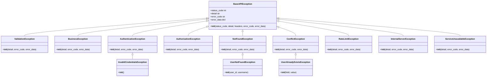

# 异常处理与日志记录

<cite>
**本文档引用的文件**
- [exceptions.py](file://AI-agent-backend\app\utils\exceptions.py)
- [logger.py](file://AI-agent-backend\app\core\logger.py)
- [logging.py](file://AI-agent-backend\app\middleware\logging.py)
- [rbac_user_service.py](file://AI-agent-backend\app\service\rbac_user_service.py)
- [rbac_user_controller.py](file://AI-agent-backend\app\controller\rbac_user_controller.py)
</cite>

## 目录
1. [异常处理体系](#异常处理体系)
2. [日志记录实践](#日志记录实践)
3. [异常处理与日志集成示例](#异常处理与日志集成示例)

## 异常处理体系

本项目采用分层的异常处理机制，通过自定义异常类、服务层抛出异常和控制器层捕获异常的方式，实现统一的错误处理和HTTP响应转换。

### 自定义异常定义

在 `app/utils/exceptions.py` 文件中定义了完整的异常体系，基于FastAPI的HTTPException构建了分层的异常类结构。



**图示来源**
- [exceptions.py](file://AI-agent-backend\app\utils\exceptions.py#L15-L230)

**本节来源**
- [exceptions.py](file://AI-agent-backend\app\utils\exceptions.py#L1-L330)

#### 异常体系设计

异常体系采用基类继承模式，`BaseAPIException` 作为所有自定义异常的基类，继承自FastAPI的HTTPException。这种设计提供了统一的异常处理接口和扩展能力。

```python
class BaseAPIException(HTTPException):
    """
    API异常基类
    """
    def __init__(
        self,
        status_code: int,
        detail: str,
        headers: Optional[Dict[str, Any]] = None,
        error_code: Optional[str] = None,
        error_data: Optional[Dict[str, Any]] = None
    ):
        super().__init__(status_code=status_code, detail=detail, headers=headers)
        self.error_code = error_code
        self.error_data = error_data or {}
```

基类扩展了以下关键属性：
- **error_code**: 机器可读的错误代码，用于前端错误处理
- **error_data**: 附加的错误数据，用于传递上下文信息
- **error_code**: 错误代码，便于错误追踪和分类

#### 特定业务异常

系统定义了多种特定业务异常，如 `UserNotFoundException`，用于精确表示业务场景中的错误情况。

```python
class UserNotFoundException(NotFoundException):
    """用户不存在异常"""
    def __init__(self, user_id: Optional[int] = None, username: Optional[str] = None):
        if user_id:
            detail = f"User with id {user_id} not found"
        elif username:
            detail = f"User with username '{username}' not found"
        else:
            detail = "User not found"
        
        super().__init__(
            detail=detail,
            error_code="USER_NOT_FOUND",
            error_data={"user_id": user_id, "username": username}
        )
```

该异常的特点：
- 继承自 `NotFoundException`，自动获得404状态码
- 根据输入参数动态生成详细的错误消息
- 通过 `error_data` 传递具体的用户标识信息
- 使用标准化的 `error_code` 便于前端识别和处理

### 服务层异常抛出

在服务层中，当业务逻辑遇到错误情况时，会抛出相应的自定义异常。以用户服务为例：


**图示来源**
- [rbac_user_service.py](file://AI-agent-backend\app\service\rbac_user_service.py#L42-L89)
- [rbac_user_controller.py](file://AI-agent-backend\app\controller\rbac_user_controller.py#L45-L83)

**本节来源**
- [rbac_user_service.py](file://AI-agent-backend\app\service\rbac_user_service.py#L42-L89)

在 `RBACUserService.create_user` 方法中，当检测到用户名已存在时，抛出ValueError异常：

```python
def create_user(self, username: str, password: str, email: str = None, ...):
    # 检查用户名是否已存在
    existing_user = self.db.query(User).filter(User.USERNAME == username).first()
    if existing_user:
        raise ValueError(f"用户名 '{username}' 已存在")
    
    # 创建用户
    user = User(...)
    created_user = self.user_repository.create(user)
    return created_user
```

虽然这里抛出的是ValueError，但在实际应用中，更推荐直接抛出自定义的业务异常，如 `UserAlreadyExistsException`，以提供更丰富的错误信息。

### 控制器层异常处理

控制器层负责捕获服务层抛出的异常，并将其转换为适当的HTTP错误响应。以用户创建接口为例：


**图示来源**
- [rbac_user_controller.py](file://AI-agent-backend\app\controller\rbac_user_controller.py#L45-L83)
- [logger.py](file://AI-agent-backend\app\core\logger.py#L54-L97)

**本节来源**
- [rbac_user_controller.py](file://AI-agent-backend\app\controller\rbac_user_controller.py#L45-L83)

在 `rbac_user_controller.py` 中，通过try-catch块捕获异常并转换为HTTP响应：

```python
@router.post("/", response_model=ApiResponse[UserResponse], summary="创建用户")
async def create_user(request: UserCreateRequest, db: Session = Depends(get_db)):
    try:
        user_service = RBACUserService(db)
        user = user_service.create_user(
            username=request.username,
            password=request.password,
            email=request.email,
            mobile=request.mobile,
            dept_id=request.dept_id,
            ssex=request.ssex,
            avatar=request.avatar,
            description=request.description
        )
        
        # 转换为响应格式
        user_response = UserResponse(...)
        logger.info(f"User created successfully: {user.USERNAME}")
        return ApiResponse.success_response(data=user_response, message="用户创建成功")
        
    except ValueError as e:
        logger.warning(f"User creation failed: {str(e)}")
        raise HTTPException(
            status_code=status.HTTP_400_BAD_REQUEST,
            detail=str(e)
        )
    except Exception as e:
        logger.error(f"Unexpected error creating user: {str(e)}")
        raise HTTPException(
            status_code=status.HTTP_500_INTERNAL_SERVER_ERROR,
            detail="创建用户失败"
        )
```

异常处理流程包括：
1. **try块**: 执行正常的业务逻辑
2. **except ValueError**: 捕获特定的业务异常，记录警告日志，返回400错误
3. **except Exception**: 捕获未预期的异常，记录错误日志，返回500错误
4. **日志记录**: 在异常发生时记录相应的日志信息

## 日志记录实践

本项目采用loguru库进行日志管理，提供了灵活的日志配置和记录功能。

### 日志配置

在 `app/core/logger.py` 中定义了日志配置，包括控制台和文件两种输出方式。

```python
def setup_logging():
    """
    设置日志配置
    """
    # 移除默认的日志处理器
    logger.remove()
    
    # 确保日志目录存在
    log_dir = Path(settings.LOG_FILE).parent
    log_dir.mkdir(parents=True, exist_ok=True)
    
    # 控制台日志格式
    console_format = (
        "<green>{time:YYYY-MM-DD HH:mm:ss}</green> | "
        "<level>{level: <8}</level> | "
        "<cyan>{name}</cyan>:<cyan>{function}</cyan>:<cyan>{line}</cyan> | "
        "<level>{message}</level>"
    )
    
    # 文件日志格式
    file_format = (
        "{time:YYYY-MM-DD HH:mm:ss} | "
        "{level: <8} | "
        "{name}:{function}:{line} | "
        "{message}"
    )
    
    # 添加控制台处理器
    logger.add(
        sys.stdout,
        format=console_format,
        level=settings.LOG_LEVEL,
        colorize=True,
        backtrace=True,
        diagnose=True
    )
    
    # 添加文件处理器
    logger.add(
        settings.LOG_FILE,
        format=file_format,
        level=settings.LOG_LEVEL,
        rotation=settings.LOG_ROTATION,
        retention=settings.LOG_RETENTION,
        compression="zip",
        backtrace=True,
        diagnose=True,
        encoding="utf-8"
    )
    
    # 添加错误日志文件处理器
    error_log_file = str(Path(settings.LOG_FILE).parent / "error.log")
    logger.add(
        error_log_file,
        format=file_format,
        level="ERROR",
        rotation=settings.LOG_ROTATION,
        retention=settings.LOG_RETENTION,
        compression="zip",
        backtrace=True,
        diagnose=True,
        encoding="utf-8"
    )
```

**本节来源**
- [logger.py](file://AI-agent-backend\app\core\logger.py#L15-L97)

日志配置特点：
- **多处理器**: 同时输出到控制台和文件
- **分级输出**: 错误日志单独输出到error.log文件
- **彩色输出**: 控制台日志使用颜色区分不同级别
- **自动轮转**: 根据配置自动轮转日志文件
- **压缩归档**: 旧日志文件自动压缩保存

### 日志记录器使用

通过 `get_logger()` 函数获取日志记录器实例，支持命名和上下文绑定。

```python
def get_logger(name: str = None):
    """
    获取日志记录器
    
    Args:
        name: 日志记录器名称
        
    Returns:
        日志记录器实例
    """
    if name:
        return logger.bind(name=name)
    return logger
```

在各模块中使用日志记录器：

```python
logger = get_logger(__name__)

# 记录不同级别的日志
logger.debug("调试信息")
logger.info("操作成功")
logger.warning("潜在问题")
logger.error("错误发生")
logger.critical("严重错误")
```

### 日志中间件

`app/middleware/logging.py` 实现了请求生命周期日志记录中间件，自动记录每个HTTP请求的详细信息。


**图示来源**
- [logging.py](file://AI-agent-backend\app\middleware\logging.py#L15-L275)
- [rbac_user_controller.py](file://AI-agent-backend\app\controller\rbac_user_controller.py#L45-L83)

**本节来源**
- [logging.py](file://AI-agent-backend\app\middleware\logging.py#L15-L275)

日志中间件的主要功能：
- **请求记录**: 记录请求方法、URL、客户端IP、请求头等信息
- **响应记录**: 记录响应状态码、处理时间、响应头等信息
- **性能监控**: 计算并记录请求处理时间
- **敏感信息过滤**: 自动过滤Authorization、password等敏感字段
- **异常捕获**: 在请求处理过程中捕获未处理的异常

中间件实现的关键方法：

```python
async def dispatch(self, request: Request, call_next: Callable) -> Response:
    # 记录请求开始时间
    start_time = time.time()
    
    # 提取请求信息
    request_info = await self._extract_request_info(request)
    
    # 记录请求日志
    if self.log_requests:
        self._log_request(request_info)
    
    # 处理请求
    try:
        response = await call_next(request)
    except Exception as e:
        # 记录异常
        process_time = time.time() - start_time
        logger.error(
            f"Request failed: {request.method} {request.url}",
            extra={
                "request_info": request_info,
                "error": str(e),
                "process_time": process_time
            }
        )
        raise
    
    # 计算处理时间
    process_time = time.time() - start_time
    
    # 提取响应信息
    response_info = self._extract_response_info(response, process_time)
    
    # 记录响应日志
    if self.log_responses:
        self._log_response(request_info, response_info)
    
    # 添加响应头
    response.headers["X-Process-Time"] = str(process_time)
    
    return response
```

## 异常处理与日志集成示例

虽然项目中没有直接的JobService示例，但可以通过用户服务的实现来展示异常处理和日志记录的完整集成模式。

### 业务异常处理完整流程

以用户登录功能为例，展示从异常抛出到日志记录的完整流程：


**图示来源**
- [rbac_user_controller.py](file://AI-agent-backend\app\controller\rbac_user_controller.py#L120-L160)
- [rbac_user_service.py](file://AI-agent-backend\app\service\rbac_user_service.py#L120-L160)
- [logger.py](file://AI-agent-backend\app\core\logger.py#L54-L97)

**本节来源**
- [rbac_user_controller.py](file://AI-agent-backend\app\controller\rbac_user_controller.py#L120-L160)

#### 服务层异常抛出示例

在 `RBACUserService.authenticate_user` 方法中，根据不同的验证结果抛出相应的异常：

```python
def authenticate_user(self, username: str, password: str) -> Optional[User]:
    user = self.get_user_by_username(username)
    if not user:
        logger.warning(f"User not found: {username}")
        return None
    
    if not user.is_active():
        logger.warning(f"User is locked: {username}")
        return None
    
    if not verify_password(password, user.PASSWORD):
        logger.warning(f"Invalid password for user: {username}")
        return None
    
    # 更新最后登录时间
    user.update_last_login()
    self.user_repository.update(user)
    
    logger.info(f"User authenticated successfully: {username}")
    return user
```

#### 控制器层异常处理示例

在 `rbac_user_controller.py` 的登录接口中，处理服务层返回的结果并生成相应的响应：

```python
@router.post("/login", response_model=ApiResponse[LoginResponse], summary="用户登录")
async def login(request: LoginRequest, db: Session = Depends(get_db)):
    try:
        user_service = RBACUserService(db)
        user = user_service.authenticate_user(request.username, request.password)
        
        if not user:
            raise HTTPException(
                status_code=status.HTTP_401_UNAUTHORIZED,
                detail="用户名或密码错误"
            )
        
        # 生成访问令牌
        access_token = create_access_token(data={"sub": str(user.USER_ID)})
        
        # 获取用户权限
        permissions = user_service.get_user_permissions(user.USER_ID)
        
        # 构建用户信息
        user_info = UserResponse(...)
        
        login_response = LoginResponse(
            access_token=access_token,
            token_type="bearer",
            user_info=user_info,
            permissions=permissions
        )
        
        logger.info(f"User logged in successfully: {user.USERNAME}")
        return ApiResponse.success_response(data=login_response, message="登录成功")
        
    except HTTPException:
        raise
    except Exception as e:
        logger.error(f"Unexpected error during login: {str(e)}")
        raise HTTPException(
            status_code=status.HTTP_500_INTERNAL_SERVER_ERROR,
            detail="登录失败"
        )
```

### 错误信息安全性与可追溯性

系统通过以下机制确保错误信息的安全性和可追溯性：

1. **错误信息分级**:
   - 对用户友好的错误消息（如"用户名或密码错误"）
   - 详细的内部错误日志（包含完整上下文）

2. **敏感信息过滤**:
   - 日志中间件自动过滤Authorization、password等敏感字段
   - 请求体中的敏感信息被标记为"***FILTERED***"

3. **错误代码系统**:
   - 使用标准化的error_code（如"USER_NOT_FOUND"）
   - 便于前端根据错误代码进行特定处理

4. **完整的日志上下文**:
   - 记录请求的完整信息（方法、URL、IP、User-Agent等）
   - 记录处理时间和响应状态
   - 包含异常堆栈信息（通过backtrace=True）

5. **异常数据分离**:
   - error_data字段用于传递非敏感的上下文信息
   - 避免在错误消息中暴露敏感数据

这种设计既保证了用户友好的错误提示，又提供了足够的信息供开发人员进行问题排查，同时确保了系统的安全性。