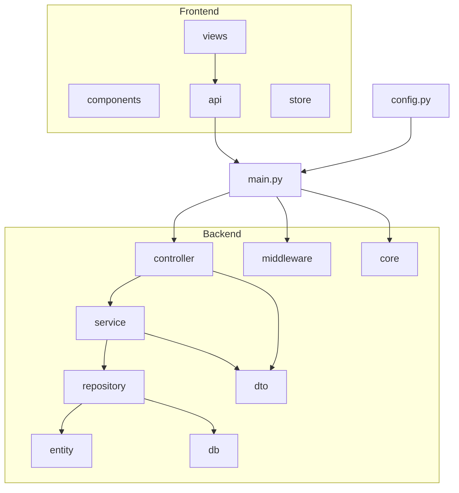
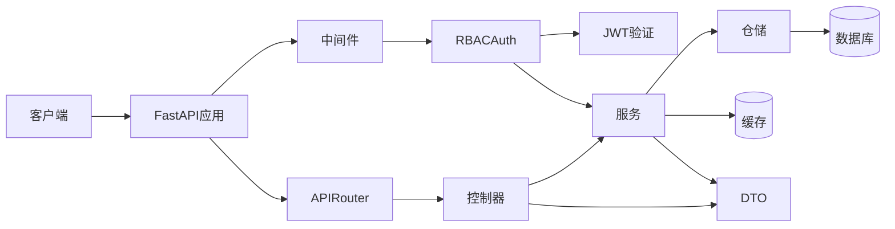
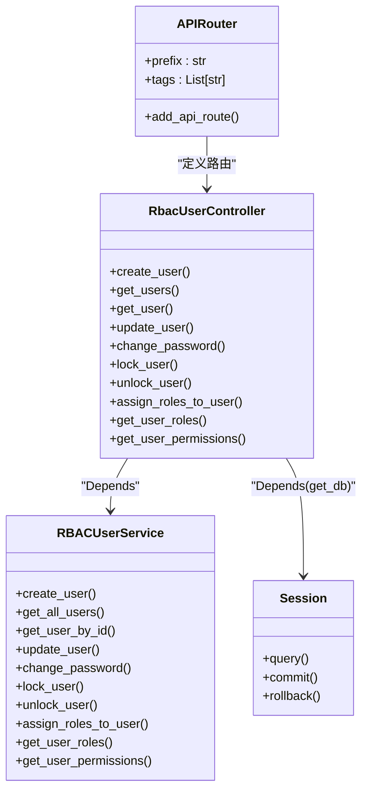
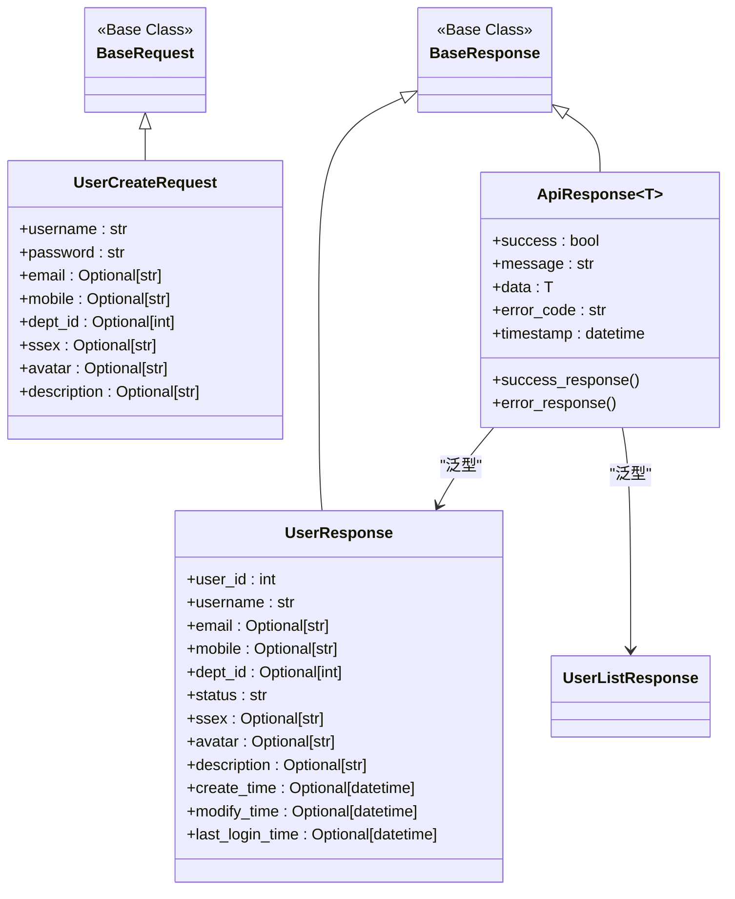
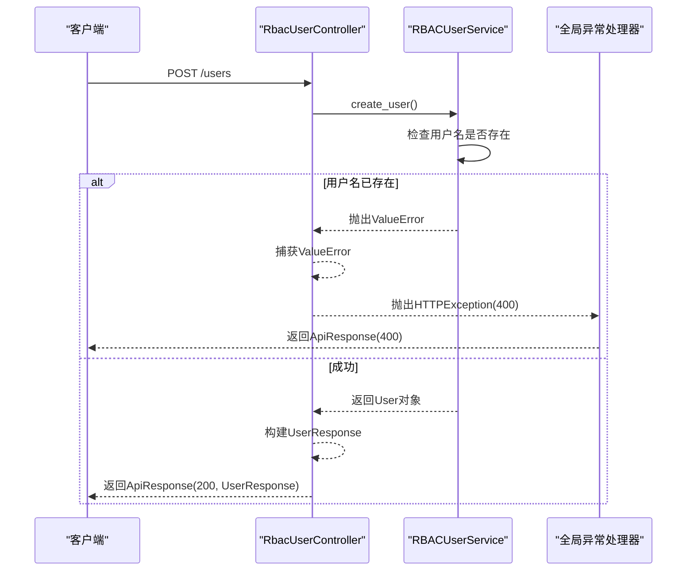
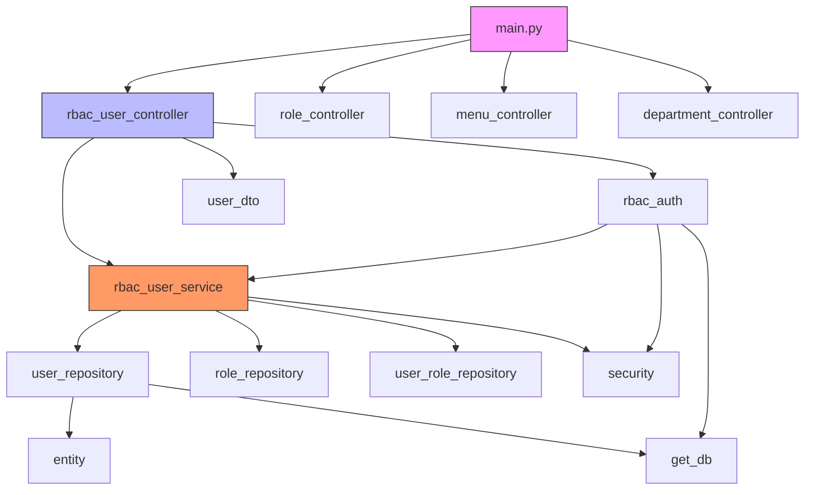

# 控制器层REST API暴露

<cite>
**本文档引用的文件**  
- [rbac_user_controller.py](file://AI-agent-backend\app\controller\rbac_user_controller.py)
- [user_dto.py](file://AI-agent-backend\app\dto\user_dto.py)
- [rbac_user_service.py](file://AI-agent-backend\app\service\rbac_user_service.py)
- [main.py](file://AI-agent-backend\main.py)
- [config.py](file://AI-agent-backend\app\core\config.py)
- [rbac_auth.py](file://AI-agent-backend\app\middleware\rbac_auth.py)
- [base.py](file://AI-agent-backend\app\dto\base.py)
</cite>

## 目录
1. [引言](#引言)
2. [项目结构](#项目结构)
3. [核心组件](#核心组件)
4. [架构概览](#架构概览)
5. [详细组件分析](#详细组件分析)
6. [依赖分析](#依赖分析)
7. [性能考虑](#性能考虑)
8. [故障排除指南](#故障排除指南)
9. [结论](#结论)

## 引言
本文档全面指导控制器层如何暴露RESTful API接口，以`RbacUserController`为例，详细说明如何使用FastAPI的`APIRouter`定义路由，通过`Depends`注入服务依赖。文档涵盖HTTP方法（GET、POST、PUT、DELETE）对应的处理函数实现，路径参数、查询参数和请求体（使用DTO）的接收方式，以及标准化响应的返回机制。同时，深入解析异常处理中间件集成与权限校验装饰器（如`@require_permission`）的使用。尽管文档目标提及`JobController`，但项目中未找到相关实现，因此以用户管理模块为完整示例。最后，说明API文档自动生成机制。

## 项目结构
项目采用企业级五层架构，清晰分离关注点。后端位于`AI-agent-backend`目录，核心模块包括`controller`（控制器）、`service`（服务）、`repository`（仓储）、`entity`（实体）和`dto`（数据传输对象）。`main.py`为应用入口，`config.py`集中管理配置。前端位于`AI-agent-frontend`，使用Vue3技术栈。



**图示来源**
- [main.py](file://AI-agent-backend\main.py)
- [project_structure](file://)

## 核心组件
控制器层是API的入口，负责接收HTTP请求、调用服务层处理业务逻辑，并返回标准化响应。`RbacUserController`是典型示例，它使用`APIRouter`定义路由，通过`Depends`注入数据库会话和权限校验逻辑。服务层（`RBACUserService`）封装了核心业务，如用户创建、认证和权限检查。数据传输对象（DTO）确保了请求和响应数据的类型安全与结构一致性。

**组件来源**
- [rbac_user_controller.py](file://AI-agent-backend\app\controller\rbac_user_controller.py)
- [rbac_user_service.py](file://AI-agent-backend\app\service\rbac_user_service.py)
- [user_dto.py](file://AI-agent-backend\app\dto\user_dto.py)

## 架构概览
系统采用FastAPI作为Web框架，实现了清晰的分层架构。`main.py`初始化FastAPI应用，注册路由、配置CORS中间件和全局异常处理器。控制器层暴露API端点，服务层处理业务逻辑，仓储层与数据库交互。`rbac_auth.py`提供基于JWT的RBAC权限认证，`config.py`通过Pydantic Settings管理所有配置。



**图示来源**
- [main.py](file://AI-agent-backend\main.py)
- [rbac_auth.py](file://AI-agent-backend\app\middleware\rbac_auth.py)
- [rbac_user_controller.py](file://AI-agent-backend\app\controller\rbac_user_controller.py)

## 详细组件分析
### RbacUserController分析
`RbacUserController`展示了如何使用`APIRouter`定义RESTful API。每个路由装饰器（如`@router.post`）都指定了路径、响应模型和摘要。函数参数清晰地定义了输入来源：路径参数（`user_id: int`）、查询参数（在DTO中定义）和请求体（`request: UserCreateRequest`）。

#### API路由与依赖注入


**图示来源**
- [rbac_user_controller.py](file://AI-agent-backend\app\controller\rbac_user_controller.py)
- [rbac_user_service.py](file://AI-agent-backend\app\service\rbac_user_service.py)

#### HTTP方法处理函数
以下详细解释各HTTP方法的处理函数：

**POST /users - 创建用户**
```python
@router.post("/", response_model=ApiResponse[UserResponse], summary="创建用户")
async def create_user(
    request: UserCreateRequest,
    db: Session = Depends(get_db)
):
    ...
```
此端点接收`UserCreateRequest`类型的请求体，包含用户名、密码等信息。通过`Depends(get_db)`注入数据库会话。服务层创建用户后，返回`ApiResponse`包装的`UserResponse`。

**GET /users - 获取用户列表**
```python
@router.get("/", response_model=ApiResponse[UserListResponse], summary="获取用户列表")
async def get_users(db: Session = Depends(get_db)):
    ...
```
此端点无路径或查询参数（简化版），调用服务层获取所有用户，并返回包含用户列表的`UserListResponse`。

**GET /users/{user_id} - 获取用户详情**
```python
@router.get("/{user_id}", response_model=ApiResponse[UserResponse], summary="获取用户详情")
async def get_user(user_id: int, db: Session = Depends(get_db)):
    ...
```
此端点接收路径参数`user_id`，用于查询特定用户。

**PUT /users/{user_id} - 更新用户**
```python
@router.put("/{user_id}", response_model=ApiResponse[UserResponse], summary="更新用户")
async def update_user(
    user_id: int,
    request: UserUpdateRequest,
    db: Session = Depends(get_db)
):
    ...
```
此端点结合路径参数`user_id`和请求体`UserUpdateRequest`来更新用户信息。

**DELETE方法说明**
尽管`rbac_user_controller.py`中未实现`DELETE`端点，但根据REST规范，应实现`DELETE /users/{user_id}`来删除用户。实现方式类似`update_user`，使用`@router.delete`装饰器。

**其他操作**
控制器还实现了密码修改、用户锁定/解锁、角色分配等专用端点，展示了如何为复杂操作设计API。

**组件来源**
- [rbac_user_controller.py](file://AI-agent-backend\app\controller\rbac_user_controller.py)

#### 数据传输对象（DTO）
DTO确保了API接口的健壮性。`UserCreateRequest`和`UserUpdateRequest`继承自`BaseRequest`，利用Pydantic进行数据验证。



**图示来源**
- [user_dto.py](file://AI-agent-backend\app\dto\user_dto.py)
- [base.py](file://AI-agent-backend\app\dto\base.py)

#### 异常处理与标准化响应
控制器通过`try-except`块捕获异常，并抛出`HTTPException`。全局异常处理器在`main.py`中定义，确保所有错误都返回统一的`ApiResponse`格式。



**图示来源**
- [rbac_user_controller.py](file://AI-agent-backend\app\controller\rbac_user_controller.py)
- [main.py](file://AI-agent-backend\main.py)

#### 权限校验装饰器
`rbac_auth.py`中的`require_permission`装饰器是权限控制的核心。它是一个依赖函数，通过`Depends`注入，自动执行权限检查。

```python
def require_permission(permission: str):
    async def permission_checker(current_user=Depends(get_current_user), db: Session = Depends(get_db)):
        # 检查current_user是否拥有permission
        if not has_permission:
            raise HTTPException(403)
        return current_user
    return permission_checker

# 在控制器中使用
@router.get("/users", dependencies=[Depends(require_permission("user:view"))])
async def get_users(...):
    ...
```
`get_current_user`首先验证JWT令牌并获取当前用户，然后`permission_checker`调用`RBACUserService`检查该用户是否拥有指定权限。

**组件来源**
- [rbac_auth.py](file://AI-agent-backend\app\middleware\rbac_auth.py)

### JobController实现说明
根据文档目标，`JobController`应实现`POST /jobs`和`GET /jobs/{id}`等端点。其设计模式与`RbacUserController`完全一致：
1.  **定义路由器**: `router = APIRouter(prefix="/jobs", tags=["任务管理"])`
2.  **注入服务**: 通过`Depends`注入`JobService`。
3.  **实现端点**:
    *   `POST /jobs`: 接收`JobCreateRequest`，调用`job_service.create_job()`，返回`ApiResponse[JobResponse]`。
    *   `GET /jobs/{id}`: 接收路径参数`job_id`，调用`job_service.get_job_by_id(job_id)`，返回`ApiResponse[JobResponse]`。
4.  **权限校验**: 使用`@require_permission("job:create")`等装饰器。
然而，在项目代码库中，未能找到`JobController`或相关的`job_dto.py`、`job_service.py`文件，因此该部分仅为概念性说明。

## 依赖分析
项目依赖关系清晰，遵循依赖倒置原则。高层模块（Controller）依赖于抽象（Service接口），而非具体实现。`main.py`是最高层，依赖所有控制器。控制器依赖服务和DTO。服务依赖仓储和数据库会话。`rbac_auth`依赖`RBACUserService`进行权限检查，形成了一个闭环。



**图示来源**
- [main.py](file://AI-agent-backend\main.py)
- [rbac_user_controller.py](file://AI-agent-backend\app\controller\rbac_user_controller.py)
- [rbac_user_service.py](file://AI-agent-backend\app\service\rbac_user_service.py)

## 性能考虑
*   **数据库会话**: `get_db`依赖确保每个请求都有独立的数据库会话，并在请求结束时正确关闭。
*   **日志记录**: `logging`中间件记录请求，有助于性能监控和问题排查。
*   **缓存**: 配置中启用了Redis，可用于缓存用户权限等频繁读取的数据，减少数据库压力。
*   **速率限制**: 配置中定义了速率限制，防止API被滥用。

## 故障排除指南
*   **404 Not Found**: 检查路由路径和HTTP方法是否正确。确认`main.py`中已注册相应路由器。
*   **400 Bad Request**: 检查请求体JSON格式和字段是否符合DTO定义。查看日志中的验证错误详情。
*   **401 Unauthorized**: 检查JWT令牌是否有效、是否过期。确认`Authorization`头格式为`Bearer <token>`。
*   **403 Forbidden**: 当前用户缺少执行操作所需的权限。检查`require_permission`装饰器的权限标识是否正确。
*   **500 Internal Server Error**: 查看服务器日志，定位异常堆栈信息。常见于数据库连接失败或业务逻辑错误。
*   **CORS错误**: 检查`config.py`中的`ALLOWED_ORIGINS`配置，确保前端域名在允许列表中。

## 结论
本项目通过FastAPI的`APIRouter`、依赖注入（`Depends`）、Pydantic模型（DTO）和全局异常处理，实现了高效、安全且易于维护的RESTful API。`RbacUserController`是这一模式的完美体现。权限校验通过`rbac_auth.py`中的装饰器实现，确保了系统的安全性。尽管`JobController`未在代码中实现，但其设计应遵循相同的架构原则。API文档（Swagger UI）由FastAPI自动生成，位于`/docs`路径，极大地提升了开发效率和用户体验。