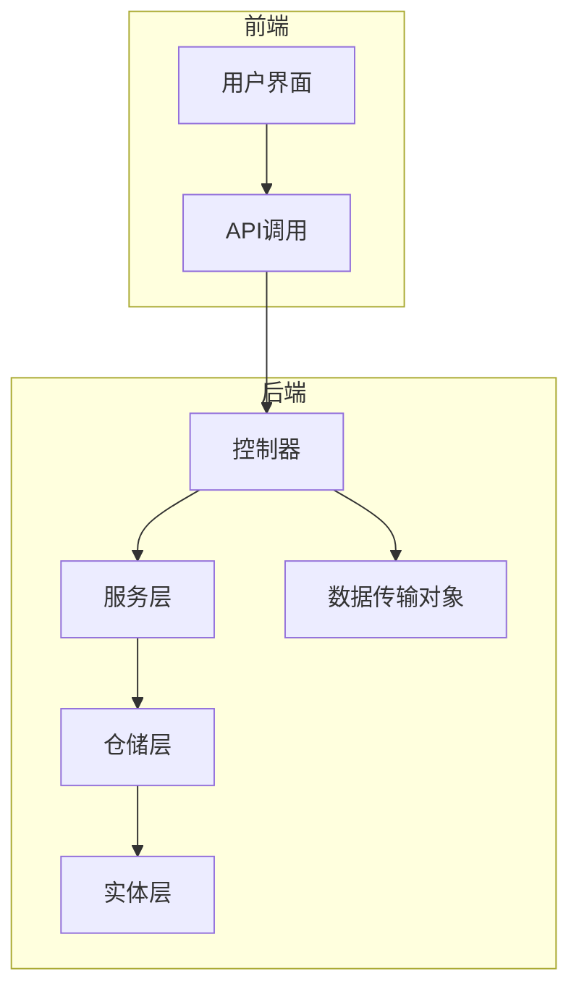
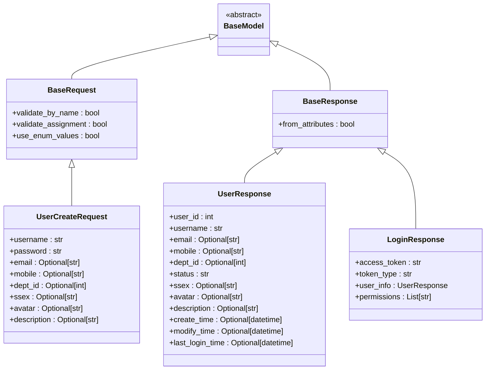
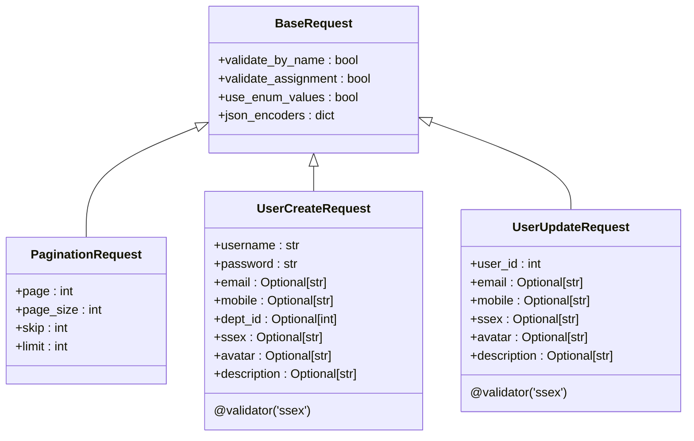
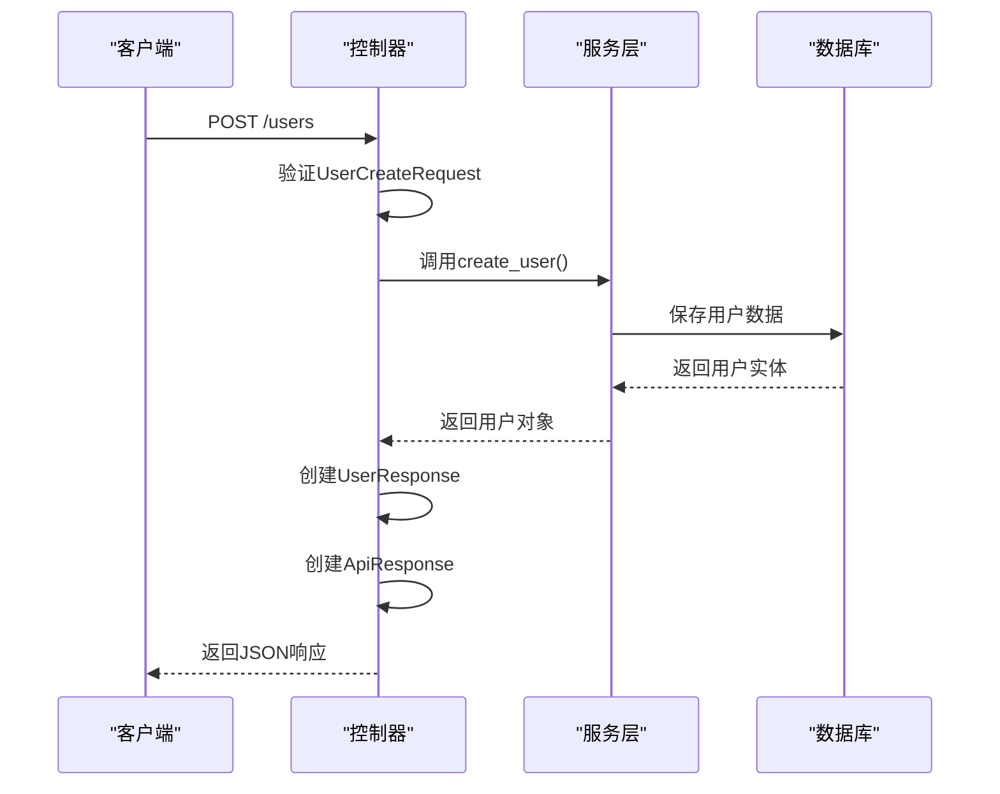
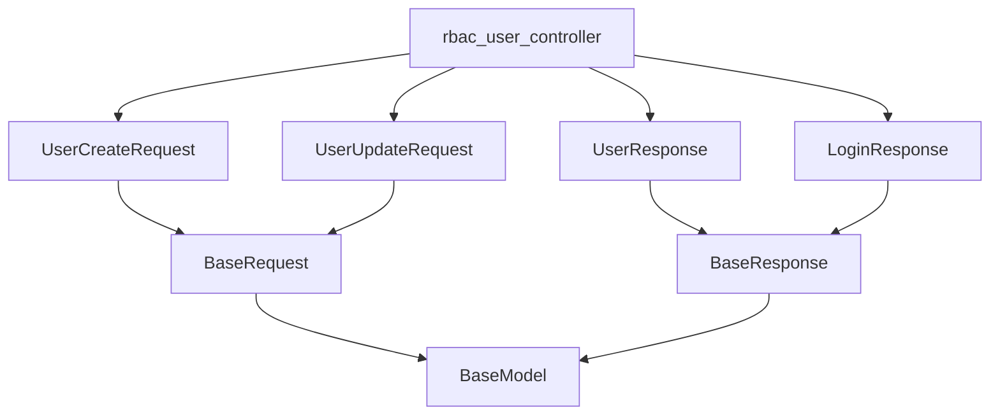

# 数据传输对象与请求验证

<cite>
**本文档中引用的文件**
- [user_dto.py](file://AI-agent-backend\app\dto\user_dto.py)
- [base.py](file://d:\AI-agent-backend\app\dto\base.py)
- [rbac_user_controller.py](file://AI-agent-backend\app\controller\rbac_user_controller.py)
</cite>

## 目录
1. [引言](#引言)
2. [项目结构](#项目结构)
3. [核心组件](#核心组件)
4. [架构概述](#架构概述)
5. [详细组件分析](#详细组件分析)
6. [依赖分析](#依赖分析)
7. [性能考虑](#性能考虑)
8. [故障排除指南](#故障排除指南)
9. [结论](#结论)

## 引言
本文档深入讲解了数据传输对象（DTO）层的设计原则与Pydantic模型的应用。通过分析用户管理模块中的DTO类，详细说明了如何使用Pydantic进行请求验证、响应序列化以及在控制器中处理业务逻辑。文档涵盖了字段类型定义、默认值设置、验证规则（如邮箱格式、密码复杂度）、OpenAPI文档示例提供方法以及Field字段约束的使用。

## 项目结构
项目采用分层架构设计，主要分为DTO、Controller、Service和Entity等层次。DTO层位于`app/dto`目录下，负责定义数据传输对象，实现请求参数验证和响应数据结构化。



**图示来源**
- [user_dto.py](file://AI-agent-backend\app\dto\user_dto.py)
- [rbac_user_controller.py](file://AI-agent-backend\app\controller\rbac_user_controller.py)

**本节来源**
- [user_dto.py](file://AI-agent-backend\app\dto\user_dto.py)
- [rbac_user_controller.py](file://AI-agent-backend\app\controller\rbac_user_controller.py)

## 核心组件
核心组件包括DTO基类、用户相关DTO类以及控制器中的使用方式。DTO层使用Pydantic BaseModel作为基础，实现了类型安全的数据验证和序列化。

**本节来源**
- [base.py](file://d:\AI-agent-backend\app\dto\base.py)
- [user_dto.py](file://AI-agent-backend\app\dto\user_dto.py)

## 架构概述
系统采用典型的分层架构，DTO层作为控制器与服务层之间的数据契约，确保了接口的稳定性和数据的一致性。Pydantic模型提供了自动化的数据验证、序列化和OpenAPI文档生成功能。



**图示来源**
- [base.py](file://d:\AI-agent-backend\app\dto\base.py)
- [user_dto.py](file://AI-agent-backend\app\dto\user_dto.py)

## 详细组件分析
### DTO设计原则与Pydantic应用
#### 对象继承关系分析
DTO层的设计遵循了继承和复用的原则，通过基类定义通用配置，具体DTO类继承并扩展这些配置。



**图示来源**
- [base.py](file://d:\AI-agent-backend\app\dto\base.py)
- [user_dto.py](file://AI-agent-backend\app\dto\user_dto.py)

**本节来源**
- [base.py](file://d:\AI-agent-backend\app\dto\base.py)
- [user_dto.py](file://AI-agent-backend\app\dto\user_dto.py)

#### 字段定义与验证规则
Pydantic的Field函数用于定义字段的约束条件，包括最小长度、最大长度、正则表达式模式等。

```python
class UserCreateRequest(BaseRequest):
    """创建用户请求DTO"""
    username: str = Field(..., min_length=3, max_length=50, description="用户名")
    password: str = Field(..., min_length=6, max_length=20, description="密码")
    email: Optional[str] = Field(None, max_length=128, description="邮箱")
    mobile: Optional[str] = Field(None, max_length=20, description="联系电话")
    dept_id: Optional[int] = Field(None, description="部门ID")
    ssex: Optional[str] = Field(None, pattern="^[012]$", description="性别：0男 1女 2保密")
```

上述代码展示了如何使用Field定义字段的各种约束：
- `...` 表示必填字段
- `min_length` 和 `max_length` 限制字符串长度
- `pattern` 使用正则表达式进行格式验证
- `description` 提供字段描述，用于生成API文档

此外，还使用了自定义验证器@validator来实现更复杂的业务规则验证：

```python
@validator('ssex')
def validate_ssex(cls, v):
    if v is not None and v not in ['0', '1', '2']:
        raise ValueError('性别必须是 0(男)、1(女) 或 2(保密)')
    return v
```

#### OpenAPI文档示例
通过Config类中的json_schema_extra属性，可以为API文档提供示例数据：

```python
class ProfileResponse(BaseResponse):
    """当前用户信息响应DTO"""
    user_info: UserResponse = Field(..., description="用户信息")
    permissions: List[str] = Field(..., description="用户权限列表")
    menus: List[dict] = Field(..., description="用户菜单列表")

    class Config:
        json_schema_extra = {
            "example": {
                "username": "admin",
                "password": "123456"
            }
        }
```

这种做法有助于前端开发人员理解API的使用方式，提高开发效率。

#### 控制器中的DTO使用
在控制器中，DTO被用作请求体的类型注解，FastAPI会自动进行数据验证：

```python
@router.post("/", response_model=ApiResponse[UserResponse], summary="创建用户")
async def create_user(
    request: UserCreateRequest,
    db: Session = Depends(get_db)
):
    """
    创建新用户
    """
    try:
        user_service = RBACUserService(db)
        user = user_service.create_user(
            username=request.username,
            password=request.password,
            email=request.email,
            mobile=request.mobile,
            dept_id=request.dept_id,
            ssex=request.ssex,
            avatar=request.avatar,
            description=request.description
        )
        
        # 转换为响应格式
        user_response = UserResponse(
            user_id=user.USER_ID,
            username=user.USERNAME,
            email=user.EMAIL,
            mobile=user.MOBILE,
            dept_id=user.DEPT_ID,
            status=user.STATUS,
            ssex=user.SSEX,
            avatar=user.AVATAR,
            description=user.DESCRIPTION,
            create_time=user.CREATE_TIME,
            modify_time=user.MODIFY_TIME,
            last_login_time=user.LAST_LOGIN_TIME
        )
        
        logger.info(f"User created successfully: {user.USERNAME}")
        return ApiResponse.success_response(data=user_response, message="用户创建成功")
        
    except ValueError as e:
        logger.warning(f"User creation failed: {str(e)}")
        raise HTTPException(
            status_code=status.HTTP_400_BAD_REQUEST,
            detail=str(e)
        )
```

此代码展示了DTO在实际应用中的完整流程：
1. 使用DTO作为请求参数类型，自动验证输入数据
2. 将验证后的数据传递给服务层处理
3. 将服务层返回的实体转换为响应DTO
4. 使用ApiResponse包装响应数据，提供统一的API响应格式



**图示来源**
- [rbac_user_controller.py](file://AI-agent-backend\app\controller\rbac_user_controller.py)
- [user_dto.py](file://AI-agent-backend\app\dto\user_dto.py)

**本节来源**
- [user_dto.py](file://AI-agent-backend\app\dto\user_dto.py)
- [rbac_user_controller.py](file://AI-agent-backend\app\controller\rbac_user_controller.py)

### 职位管理DTO示例
尽管项目中未找到JobCreateDTO和JobUpdateDTO的具体实现，但可以根据现有模式创建相应的DTO类：

```python
class JobCreateRequest(BaseRequest):
    """创建职位请求DTO"""
    title: str = Field(..., min_length=2, max_length=100, description="职位名称")
    description: Optional[str] = Field(None, max_length=500, description="职位描述")
    department_id: int = Field(..., gt=0, description="所属部门ID")
    required_skills: List[str] = Field(default_factory=list, description="所需技能")
    salary_range_min: Optional[float] = Field(None, ge=0, description="最低薪资")
    salary_range_max: Optional[float] = Field(None, ge=0, description="最高薪资")
    job_type: str = Field(..., pattern="^(full_time|part_time|contract|internship)$", description="职位类型")
    work_location: str = Field(..., min_length=2, max_length=100, description="工作地点")
    experience_required: int = Field(default=0, ge=0, le=50, description="要求工作经验(年)")
    
    @validator('salary_range_max')
    def validate_salary_range(cls, v, values):
        min_salary = values.get('salary_range_min')
        if min_salary is not None and v is not None and v < min_salary:
            raise ValueError('最高薪资不能低于最低薪资')
        return v
    
    @validator('job_type')
    def validate_job_type(cls, v):
        valid_types = ['full_time', 'part_time', 'contract', 'internship']
        if v not in valid_types:
            raise ValueError(f'职位类型必须是 {", ".join(valid_types)} 之一')
        return v

class JobUpdateRequest(BaseRequest):
    """更新职位信息请求DTO"""
    job_id: int = Field(..., gt=0, description="职位ID")
    title: Optional[str] = Field(None, min_length=2, max_length=100, description="职位名称")
    description: Optional[str] = Field(None, max_length=500, description="职位描述")
    department_id: Optional[int] = Field(None, gt=0, description="所属部门ID")
    required_skills: Optional[List[str]] = Field(None, description="所需技能")
    salary_range_min: Optional[float] = Field(None, ge=0, description="最低薪资")
    salary_range_max: Optional[float] = Field(None, ge=0, description="最高薪资")
    job_type: Optional[str] = Field(None, pattern="^(full_time|part_time|contract|internship)$", description="职位类型")
    work_location: Optional[str] = Field(None, min_length=2, max_length=100, description="工作地点")
    experience_required: Optional[int] = Field(None, ge=0, le=50, description="要求工作经验(年)")
    status: Optional[str] = Field(None, pattern="^(active|inactive|filled)$", description="职位状态")
    
    @validator('salary_range_max')
    def validate_salary_range(cls, v, values):
        min_salary = values.get('salary_range_min')
        if min_salary is not None and v is not None and v < min_salary:
            raise ValueError('最高薪资不能低于最低薪资')
        return v
    
    @validator('job_type')
    def validate_job_type(cls, v):
        if v is not None:
            valid_types = ['full_time', 'part_time', 'contract', 'internship']
            if v not in valid_types:
                raise ValueError(f'职位类型必须是 {", ".join(valid_types)} 之一')
        return v

class JobResponse(BaseResponse):
    """职位响应DTO"""
    job_id: int = Field(..., description="职位ID")
    title: str = Field(..., description="职位名称")
    description: Optional[str] = Field(None, description="职位描述")
    department_id: int = Field(..., description="所属部门ID")
    required_skills: List[str] = Field(default_factory=list, description="所需技能")
    salary_range_min: Optional[float] = Field(None, description="最低薪资")
    salary_range_max: Optional[float] = Field(None, description="最高薪资")
    job_type: str = Field(..., description="职位类型")
    work_location: str = Field(..., description="工作地点")
    experience_required: int = Field(..., description="要求工作经验(年)")
    status: str = Field(..., description="职位状态")
    create_time: datetime = Field(..., description="创建时间")
    modify_time: Optional[datetime] = Field(None, description="修改时间")
    
    class Config:
        json_schema_extra = {
            "example": {
                "job_id": 1,
                "title": "Python开发工程师",
                "description": "负责后端服务开发与维护",
                "department_id": 1,
                "required_skills": ["Python", "FastAPI", "SQLAlchemy"],
                "salary_range_min": 15000,
                "salary_range_max": 25000,
                "job_type": "full_time",
                "work_location": "北京市",
                "experience_required": 3,
                "status": "active",
                "create_time": "2025-01-01T00:00:00",
                "modify_time": "2025-01-01T00:00:00"
            }
        }
```

这些示例展示了如何根据项目中的设计模式创建新的DTO类，保持代码风格的一致性。

## 依赖分析
DTO层与其他组件之间存在明确的依赖关系，确保了代码的可维护性和可测试性。



**图示来源**
- [base.py](file://d:\AI-agent-backend\app\dto\base.py)
- [user_dto.py](file://AI-agent-backend\app\dto\user_dto.py)
- [rbac_user_controller.py](file://AI-agent-backend\app\controller\rbac_user_controller.py)

**本节来源**
- [base.py](file://d:\AI-agent-backend\app\dto\base.py)
- [user_dto.py](file://AI-agent-backend\app\dto\user_dto.py)

## 性能考虑
虽然DTO层的主要职责是数据验证和序列化，但也需要考虑性能影响：
- Pydantic的验证过程会带来一定的性能开销，但在大多数场景下可以接受
- 使用Optional类型和默认值可以减少不必要的数据传输
- 复杂的自定义验证器可能会影响请求处理速度，应尽量保持验证逻辑简单高效
- 对于高频接口，可以考虑缓存验证结果或使用更轻量级的验证方案

## 故障排除指南
### 常见问题及解决方案
1. **数据验证失败**
   - 检查请求数据是否符合DTO定义的约束条件
   - 确认必填字段是否已提供
   - 验证字符串长度、数值范围等限制是否满足

2. **类型转换错误**
   - 确保JSON数据类型与DTO字段类型匹配
   - 注意日期时间格式是否符合ISO 8601标准
   - 检查枚举值是否在允许范围内

3. **自定义验证器不生效**
   - 确认@validator装饰器的使用是否正确
   - 检查验证方法的参数和返回值
   - 确保异常信息清晰明确，便于调试

4. **API文档示例不显示**
   - 检查json_schema_extra配置是否正确
   - 确认FastAPI版本是否支持该特性
   - 验证示例数据是否符合DTO结构

**本节来源**
- [user_dto.py](file://AI-agent-backend\app\dto\user_dto.py)
- [rbac_user_controller.py](file://AI-agent-backend\app\controller\rbac_user_controller.py)

## 结论
DTO层的设计和Pydantic的应用为项目提供了类型安全的数据验证和序列化机制。通过继承BaseModel，定义清晰的字段约束和验证规则，不仅提高了代码的可读性和可维护性，还增强了API的稳定性和安全性。虽然项目中未实现职位管理相关的DTO，但现有的设计模式为未来功能扩展提供了良好的基础。建议在开发新功能时遵循相同的DTO设计原则，保持代码风格的一致性。