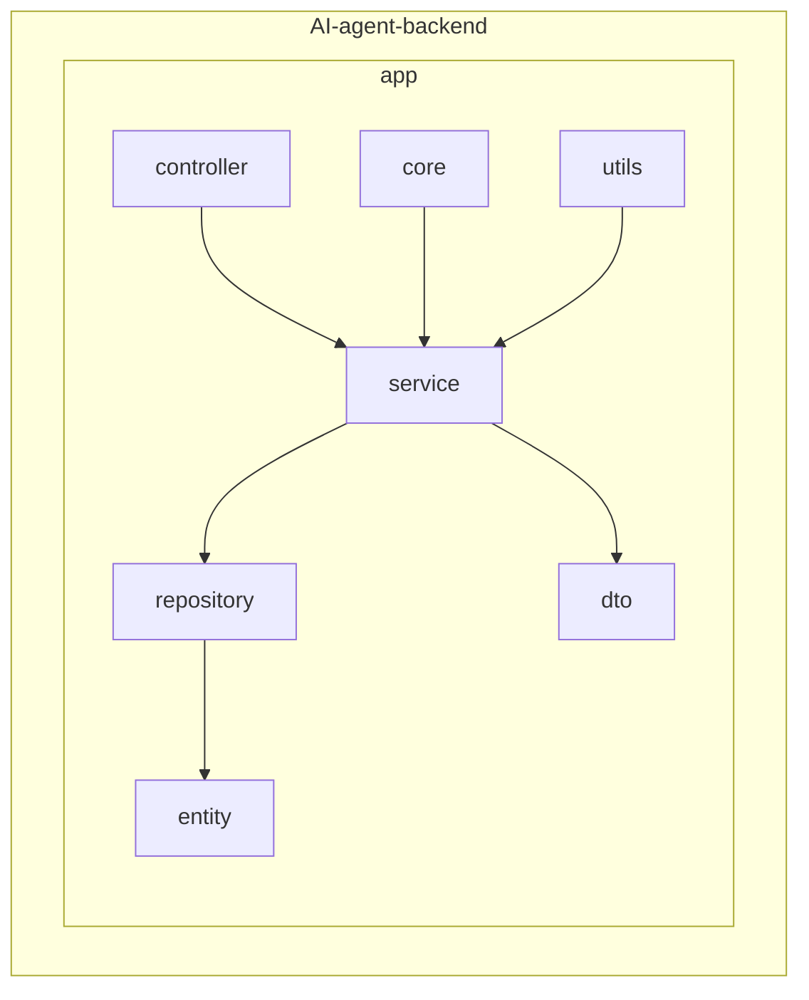
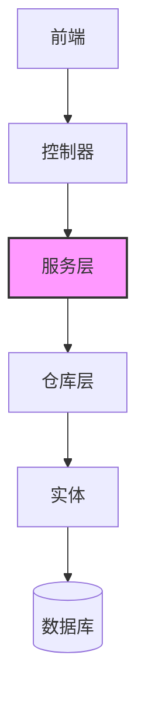
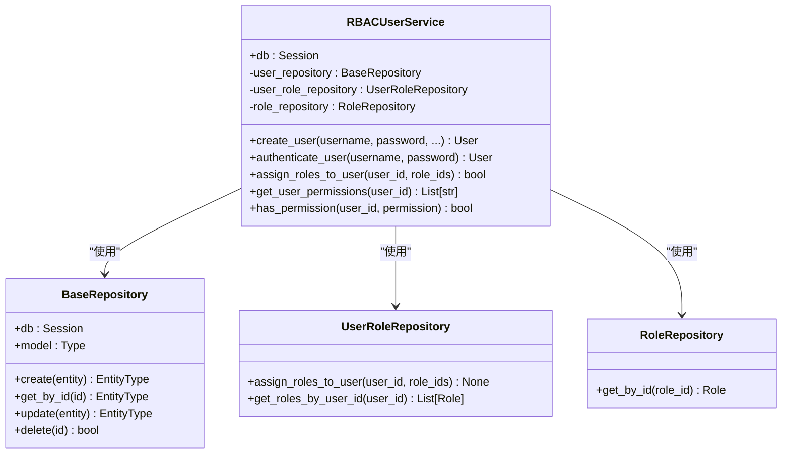
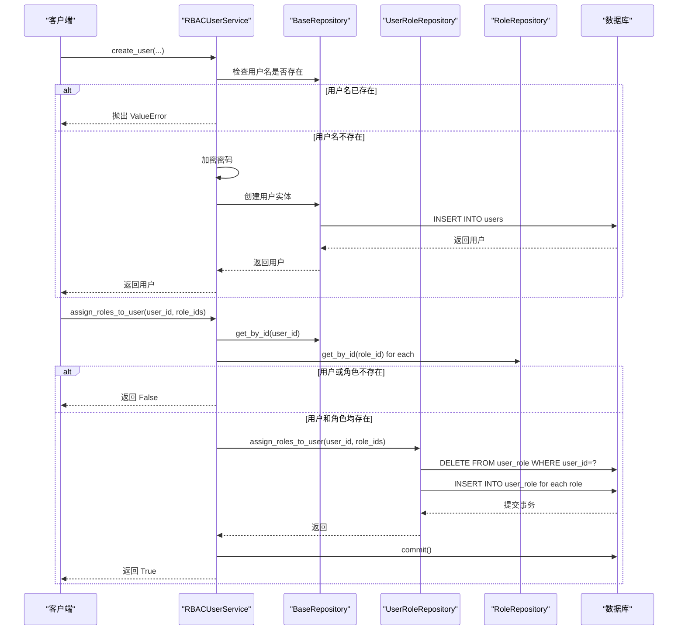
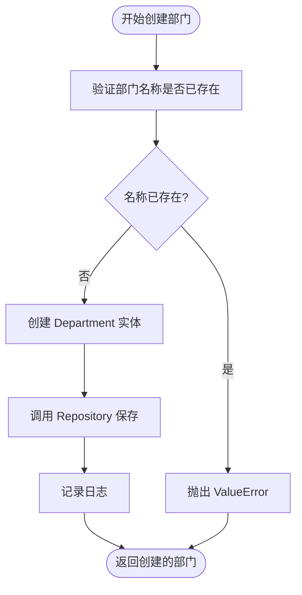
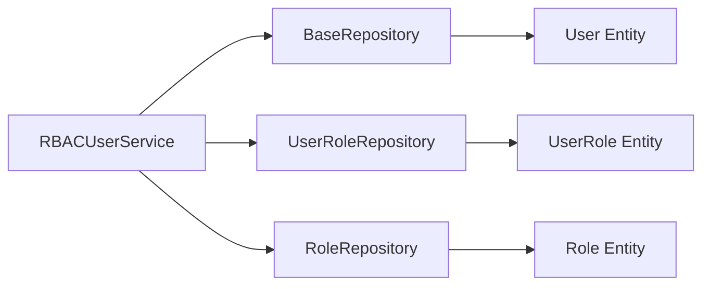

# 服务层业务逻辑封装

<cite>
**本文档引用的文件**  
- [rbac_user_service.py](file://AI-agent-backend\app\service\rbac_user_service.py)
- [department_service.py](file://AI-agent-backend\app\service\department_service.py)
- [menu_service.py](file://AI-agent-backend\app\service\menu_service.py)
- [role_service.py](file://AI-agent-backend\app\service\role_service.py)
- [user.py](file://AI-agent-backend\app\entity\user.py)
- [role.py](file://AI-agent-backend\app\entity\role.py)
- [user_role_repository.py](file://AI-agent-backend\app\repository\user_role_repository.py)
- [role_menu_repository.py](file://AI-agent-backend\app\repository\role_menu_repository.py)
- [logger.py](file://AI-agent-backend\app\core\logger.py)
- [exceptions.py](file://AI-agent-backend\app\utils\exceptions.py)
</cite>

## 目录
1. [引言](#引言)
2. [项目结构](#项目结构)
3. [核心组件](#核心组件)
4. [架构概述](#架构概述)
5. [详细组件分析](#详细组件分析)
6. [依赖分析](#依赖分析)
7. [性能考虑](#性能考虑)
8. [故障排除指南](#故障排除指南)
9. [结论](#结论)

## 引言
本文档详细阐述了服务层在业务逻辑处理中的核心作用，重点以 `RbacUserService` 为例，说明其如何协调多个 Repository 完成复杂操作（如创建用户并分配角色），实现事务性业务流程。文档还讲解了服务类如何通过依赖注入获取 Repository 实例，遵循单一职责原则划分服务功能，强调异常处理策略和日志记录实践。尽管文档目标中提到了 `JobService`，但经全面搜索，项目中并未实现该服务，因此本部分将基于现有服务（如 `DepartmentService`）展示复合逻辑的最佳实践。

## 项目结构
项目采用分层架构设计，后端代码位于 `AI-agent-backend/app` 目录下，主要分为 controller、core、db、dto、entity、middleware、repository、service 和 utils 等模块。这种结构清晰地分离了关注点，其中 `service` 层是业务逻辑的核心。

**图源**
- [rbac_user_service.py](file://AI-agent-backend\app\service\rbac_user_service.py)
- [department_service.py](file://AI-agent-backend\app\service\department_service.py)

## 核心组件
服务层的核心组件包括 `RBACUserService`、`DepartmentService`、`MenuService` 和 `RoleService`。这些服务类封装了特定领域的业务逻辑，通过调用 Repository 层与数据库交互，并确保操作的原子性和一致性。

**组件源**
- [rbac_user_service.py](file://AI-agent-backend\app\service\rbac_user_service.py#L21-L346)
- [department_service.py](file://AI-agent-backend\app\service\department_service.py#L21-L254)

## 架构概述
系统采用经典的分层架构，从前端到后端依次为：前端（Vue.js） -> 控制器（Controller） -> 服务（Service） -> 仓库（Repository） -> 实体（Entity） -> 数据库。服务层位于架构的中心，负责协调各层之间的交互，是业务规则的执行者。

**图源**
- [rbac_user_service.py](file://AI-agent-backend\app\service\rbac_user_service.py)
- [user_role_repository.py](file://AI-agent-backend\app\repository\user_role_repository.py)

## 详细组件分析
本节将深入分析 `RbacUserService` 和 `DepartmentService` 的实现细节，展示服务层如何处理复杂业务。

### RbacUserService 分析
`RbacUserService` 是 RBAC（基于角色的访问控制）系统的核心，负责用户生命周期管理、角色分配和权限校验。

#### 类图

**图源**
- [rbac_user_service.py](file://AI-agent-backend\app\service\rbac_user_service.py#L21-L346)
- [user_role_repository.py](file://AI-agent-backend\app\repository\user_role_repository.py#L20-L162)

#### 创建用户并分配角色的流程
`RbacUserService` 通过 `create_user` 和 `assign_roles_to_user` 方法实现创建用户并分配角色的复合操作。此操作虽未在单个方法中完成，但可通过服务间调用组合实现。

**图源**
- [rbac_user_service.py](file://AI-agent-backend\app\service\rbac_user_service.py#L55-L100)
- [user_role_repository.py](file://AI-agent-backend\app\repository\user_role_repository.py#L100-L130)

**组件源**
- [rbac_user_service.py](file://AI-agent-backend\app\service\rbac_user_service.py#L21-L346)
- [user_role_repository.py](file://AI-agent-backend\app\repository\user_role_repository.py#L20-L162)

### DepartmentService 分析
`DepartmentService` 展示了如何实现岗位创建、关联部门等复合逻辑，是 `JobService` 功能的替代示例。

#### 创建部门并关联的流程
`DepartmentService` 的 `create_department` 方法展示了如何创建一个部门实体。

**图源**
- [department_service.py](file://AI-agent-backend\app\service\department_service.py#L45-L70)

**组件源**
- [department_service.py](file://AI-agent-backend\app\service\department_service.py#L21-L254)

## 依赖分析
服务层通过依赖注入获取 Repository 实例，实现了松耦合。例如，`RBACUserService` 在初始化时接收一个 `Session` 对象，并用它创建 `BaseRepository`、`UserRoleRepository` 和 `RoleRepository` 的实例。这种设计使得服务类不直接依赖于具体的数据库会话，便于单元测试和维护。

**图源**
- [rbac_user_service.py](file://AI-agent-backend\app\service\rbac_user_service.py#L34-L40)
- [base_repository.py](file://AI-agent-backend\app\repository\base_repository.py)

**依赖源**
- [rbac_user_service.py](file://AI-agent-backend\app\service\rbac_user_service.py#L34-L40)
- [base.py](file://AI-agent-backend\app\service\base.py#L37-L76)

## 性能考虑
服务层通过以下方式优化性能：
1.  **缓存**：`MenuService` 使用 Redis 缓存用户权限，避免重复查询数据库。
2.  **批量操作**：`UserRoleRepository` 在 `assign_roles_to_user` 中使用批量删除和插入，减少数据库交互次数。
3.  **索引**：实体类中对 `username` 等字段定义了唯一索引，加速查询。

## 故障排除指南
当服务层出现异常时，应首先检查日志。系统使用 `loguru` 记录详细的日志信息，包括时间、级别、模块和消息。常见的异常处理策略包括：
-   **业务异常**：如用户名已存在，抛出 `ValueError` 或自定义的 `BusinessException`。
-   **数据验证异常**：使用 `ValidationException`。
-   **数据库异常**：在 Repository 层捕获 `SQLAlchemyError` 并回滚事务。
-   **权限异常**：使用 `AuthorizationException`。

**故障排除源**
- [logger.py](file://AI-agent-backend\app\core\logger.py#L0-L98)
- [exceptions.py](file://AI-agent-backend\app\utils\exceptions.py#L0-L329)

## 结论
服务层是业务逻辑的中枢，它通过协调多个 Repository 来完成复杂的、事务性的操作。`RbacUserService` 的实现展示了如何通过依赖注入、异常处理和日志记录来构建健壮的服务。虽然 `JobService` 未在项目中实现，但 `DepartmentService` 和 `RoleService` 提供了类似的复合逻辑处理范例。遵循单一职责原则，每个服务专注于一个业务领域，确保了代码的可维护性和可测试性。