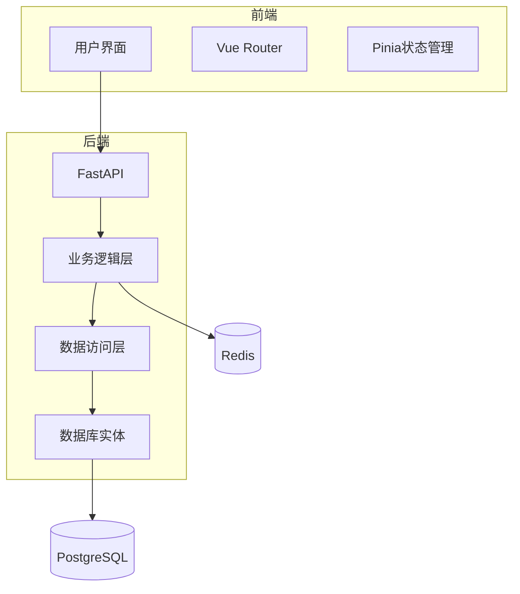
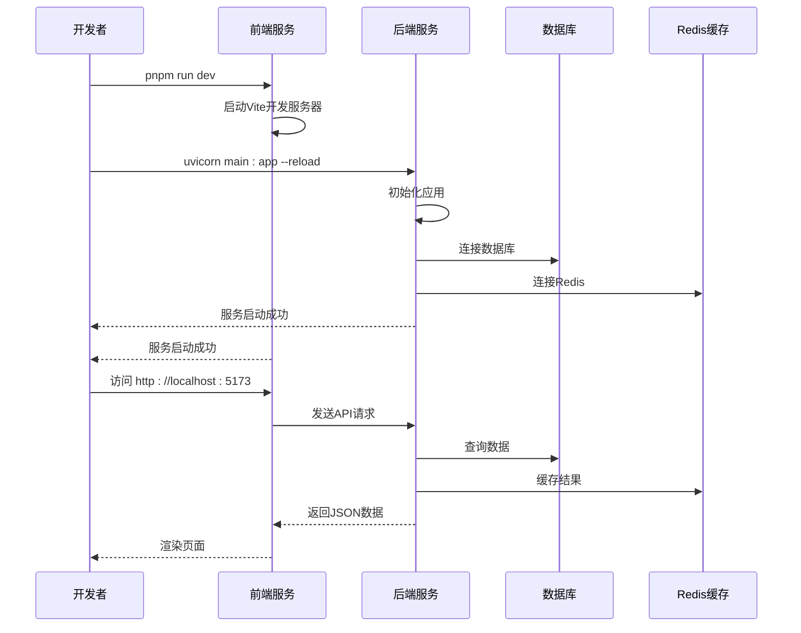

# 快速入门

<cite>
**本文档中引用的文件**  
- [README.md](file://README.md)
- [AI-agent-backend/README.md](file://AI-agent-backend/README.md)
- [AI-agent-frontend/README.md](file://AI-agent-frontend/README.md)
- [pyproject.toml](file://pyproject.toml)
- [AI-agent-backend/docker-compose.yml](file://AI-agent-backend/docker-compose.yml)
- [AI-agent-backend/docker-compose.dev.yml](file://AI-agent-backend/docker-compose.dev.yml)
- [AI-agent-backend/main.py](file://AI-agent-backend/main.py)
- [AI-agent-backend/scripts/init_db.py](file://AI-agent-backend/scripts/init_db.py)
- [AI-agent-backend/scripts/run_migrations.py](file://AI-agent-backend/scripts/run_migrations.py)
- [AI-agent-backend/scripts/switch_database.py](file://AI-agent-backend/scripts/switch_database.py)
- [AI-agent-backend/app/core/config.py](file://AI-agent-backend/app/core/config.py)
- [AI-agent-backend/.env.example](file://AI-agent-backend/.env.example)
- [AI-agent-frontend/package.json](file://AI-agent-frontend/package.json)
</cite>

## 更新摘要
**已做更改**  
- 更新了“配置环境变量”部分，以反映对数据库配置的增强，支持SQLite和PostgreSQL
- 新增“数据库切换”部分，介绍如何使用`switch_database.py`脚本在不同数据库之间切换
- 更新了“初始化数据库”部分，以与最新的数据库配置方式保持一致
- 更新了相关文件的引用，包括新增的`switch_database.py`脚本

## 目录
1. [简介](#简介)
2. [项目结构](#项目结构)
3. [环境准备](#环境准备)
4. [克隆仓库](#克隆仓库)
5. [安装依赖](#安装依赖)
6. [配置环境变量](#配置环境变量)
7. [启动数据库服务](#启动数据库服务)
8. [初始化数据库](#初始化数据库)
9. [数据库切换](#数据库切换)
10. [启动前后端服务](#启动前后端服务)
11. [常见问题排查](#常见问题排查)

## 简介

本指南旨在帮助开发者快速在本地环境中搭建并运行AI代理测试平台。该平台由基于FastAPI的后端服务和基于Vue 3的前端服务组成，采用现代化的技术栈和清晰的分层架构。通过本指南，您将学习如何从零开始配置开发环境、安装依赖、启动数据库、初始化数据表结构，并最终成功运行整个系统。

**Section sources**
- [README.md](file://README.md)
- [AI-agent-backend/README.md](file://AI-agent-backend/README.md)

## 项目结构

AI代理测试平台采用前后端分离的架构，主要由两个核心模块组成：

```

├── AI-agent-backend          # 后端服务（FastAPI）
│   ├── app                   # 应用核心代码
│   ├── scripts               # 脚本文件（数据库初始化等）
│   ├── docker-compose.yml    # 生产环境Docker编排
│   ├── docker-compose.dev.yml # 开发环境Docker编排
│   ├── main.py               # 应用入口
│   └── ...
├── AI-agent-frontend         # 前端服务（Vue 3 + Vite）
│   ├── src                   # 前端源代码
│   ├── package.json          # Node.js依赖配置
│   └── ...
├── pyproject.toml            # Python项目元数据
└── README.md                 # 项目根文档
```

后端采用五层架构设计（Controller、DTO、Service、Repository、Entity），确保代码的可维护性和可扩展性。前端使用Vue 3组合式API和TypeScript，提供现代化的用户界面。



**Diagram sources**
- [AI-agent-backend/README.md](file://AI-agent-backend/README.md)
- [AI-agent-frontend/README.md](file://AI-agent-frontend/README.md)

## 环境准备

在开始之前，请确保您的开发环境已安装以下软件：

- **Python 3.11+**：用于运行后端服务
- **Node.js 18+**：用于运行前端服务
- **pnpm**：Node.js包管理器（推荐）
- **Docker**：用于容器化数据库服务
- **Docker Compose**：用于编排多个容器服务

您可以通过以下命令验证安装：

```bash
# 检查Python版本
python --version

# 检查Node.js版本
node --version

# 检查pnpm版本（若未安装，可通过npm install -g pnpm安装）
pnpm --version

# 检查Docker版本
docker --version

# 检查Docker Compose版本
docker-compose --version
```

**Section sources**
- [AI-agent-backend/README.md](file://AI-agent-backend/README.md)

## 克隆仓库

首先，将项目仓库克隆到本地：

```bash
# 克隆项目（请替换为实际的仓库URL）
git clone <repository-url>
cd AI-agent-testing-platform
```

克隆完成后，您将在本地看到完整的项目目录结构。

## 安装依赖

### 安装后端依赖

进入后端目录并创建Python虚拟环境：

```bash
cd AI-agent-backend

# 创建虚拟环境
python -m venv venv

# 激活虚拟环境
# Windows
venv\Scripts\activate
# Linux/Mac
source venv/bin/activate

# 安装Python依赖
pip install -r requirements.txt
# 或根据pyproject.toml安装
pip install -e .
```

### 安装前端依赖

进入前端目录并安装Node.js依赖：

```bash
cd AI-agent-frontend

# 使用pnpm安装依赖（推荐）
pnpm install

# 或使用npm
npm install
```

**Section sources**
- [pyproject.toml](file://pyproject.toml)
- [AI-agent-frontend/package.json](file://AI-agent-frontend/package.json)

## 配置环境变量

后端服务需要通过环境变量进行配置。复制示例文件并进行修改：

```bash
cd AI-agent-backend

# 复制环境变量示例文件
cp .env.example .env

# 编辑环境变量文件
# Windows
notepad .env
# Linux/Mac
vim .env
```

根据您的环境修改`.env`文件中的关键配置：

```env
# 应用配置
APP_NAME=AI-Agent-Backend
APP_VERSION=1.0.0
DEBUG=True
ENVIRONMENT=development

# 服务器配置
HOST=0.0.0.0
PORT=8000
RELOAD=True

# 数据库配置（支持SQLite和PostgreSQL）
DATABASE_TYPE=sqlite
DATABASE_ECHO=False

# SQLite 配置（当 DATABASE_TYPE=sqlite 时使用）
SQLITE_FILE=./ai_agent.db

# PostgreSQL 配置（当 DATABASE_TYPE=postgresql 时使用）
POSTGRES_HOST=localhost
POSTGRES_PORT=5432
POSTGRES_USER=postgres
POSTGRES_PASSWORD=password
POSTGRES_DB=ai_agent_db

# Redis配置
REDIS_URL=redis://localhost:6379/0

# JWT配置
SECRET_KEY=your-super-secret-key-change-this-in-production

# CORS配置
ALLOWED_ORIGINS=["http://localhost:5173", "http://localhost:8000"]
```

**Section sources**
- [AI-agent-backend/.env.example](file://AI-agent-backend/.env.example)
- [AI-agent-backend/app/core/config.py](file://AI-agent-backend/app/core/config.py)

## 启动数据库服务

本项目提供Docker Compose配置文件来简化数据库服务的启动。在开发环境中，我们使用开发专用的配置文件：

```bash
cd AI-agent-backend

# 启动开发环境服务（包含Redis和Adminer）
docker-compose -f docker-compose.dev.yml up -d

# 查看服务状态
docker-compose -f docker-compose.dev.yml ps
```

此命令将启动以下服务：
- **redis**：Redis缓存服务，运行在6379端口
- **adminer**：数据库管理工具，可通过http://localhost:8080访问

**Section sources**
- [AI-agent-backend/docker-compose.dev.yml](file://AI-agent-backend/docker-compose.dev.yml)

## 初始化数据库

数据库初始化有两种方式：使用初始化脚本或使用Alembic迁移。

### 方法一：使用初始化脚本（推荐用于首次启动）

```bash
cd AI-agent-backend

# 运行数据库初始化脚本
python scripts/init_db.py

# 如需重置数据库（删除并重新创建）
python scripts/init_db.py --reset
```

此脚本会：
1. 根据当前环境变量配置创建数据库表
2. 创建初始的RBAC（基于角色的访问控制）数据
3. 创建超级用户（用户名：admin，密码：123456）

### 方法二：使用Alembic迁移

```bash
# 创建初始迁移
python scripts/run_migrations.py init

# 应用所有迁移
python scripts/run_migrations.py upgrade
```

**Section sources**
- [AI-agent-backend/scripts/init_db.py](file://AI-agent-backend/scripts/init_db.py)
- [AI-agent-backend/scripts/run_migrations.py](file://AI-agent-backend/scripts/run_migrations.py)

## 数据库切换

项目支持在SQLite和PostgreSQL之间切换数据库，通过`switch_database.py`脚本实现。

### 查看当前数据库配置

```bash
cd AI-agent-backend
python scripts/switch_database.py show
```

### 切换到SQLite（开发环境）

```bash
# 切换到SQLite，使用默认数据库文件
python scripts/switch_database.py sqlite

# 指定数据库文件路径
python scripts/switch_database.py sqlite --file ./dev.db
```

### 切换到PostgreSQL（生产环境）

```bash
python scripts/switch_database.py postgresql \
  --host localhost \
  --port 5432 \
  --user postgres \
  --password your_password \
  --database ai_agent_db
```

切换数据库后，请重新运行数据库初始化脚本，并重启应用服务。

**Section sources**
- [AI-agent-backend/scripts/switch_database.py](file://AI-agent-backend/scripts/switch_database.py)
- [AI-agent-backend/app/core/config.py](file://AI-agent-backend/app/core/config.py)

## 启动前后端服务

### 启动后端服务

```bash
cd AI-agent-backend

# 确保虚拟环境已激活
# Windows
venv\Scripts\activate
# Linux/Mac
source venv/bin/activate

# 启动FastAPI服务
uvicorn main:app --reload --host 0.0.0.0 --port 8000
```

服务启动后，您可以通过以下地址访问：
- API文档（Swagger UI）：http://localhost:8000/docs
- API文档（ReDoc）：http://localhost:8000/redoc
- 健康检查：http://localhost:8000/health

### 启动前端服务

```bash
cd AI-agent-frontend

# 启动开发服务器
pnpm run dev

# 或使用npm
npm run dev
```

前端服务默认运行在5173端口，访问http://localhost:5173即可看到应用界面。



**Diagram sources**
- [AI-agent-backend/main.py](file://AI-agent-backend/main.py)
- [AI-agent-frontend/package.json](file://AI-agent-frontend/package.json)

## 常见问题排查

### 端口冲突

**问题**：`OSError: [Errno 98] Address already in use`  
**解决方案**：
1. 检查端口占用：`netstat -ano | findstr :8000`（Windows）或 `lsof -i :8000`（Linux/Mac）
2. 终止占用进程：`taskkill /PID <PID> /F`（Windows）或 `kill -9 <PID>`（Linux/Mac）
3. 修改配置文件中的端口号

### 依赖缺失

**问题**：`ModuleNotFoundError: No module named 'fastapi'`  
**解决方案**：
1. 确认虚拟环境已激活
2. 重新安装依赖：`pip install -r requirements.txt`
3. 检查Python路径是否正确

### 数据库连接失败

**问题**：`Connection refused`  
**解决方案**：
1. 确认Docker服务已启动
2. 检查`docker-compose`服务状态：`docker-compose -f docker-compose.dev.yml ps`
3. 验证数据库URL配置是否正确
4. 尝试重启数据库容器

### 前后端通信问题

**问题**：前端请求后端API失败  
**解决方案**：
1. 检查CORS配置，确保`ALLOWED_ORIGINS`包含前端地址
2. 确认后端服务正在运行
3. 检查网络连接和防火墙设置
4. 查看浏览器开发者工具中的网络请求详情

**Section sources**
- [AI-agent-backend/README.md](file://AI-agent-backend/README.md)
- [AI-agent-backend/app/core/config.py](file://AI-agent-backend/app/core/config.py)