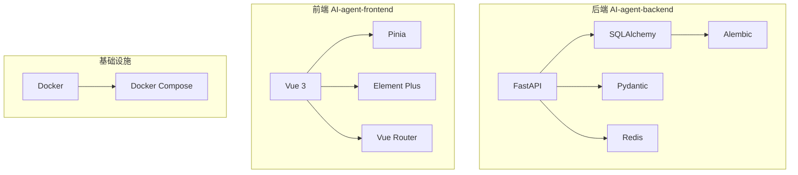
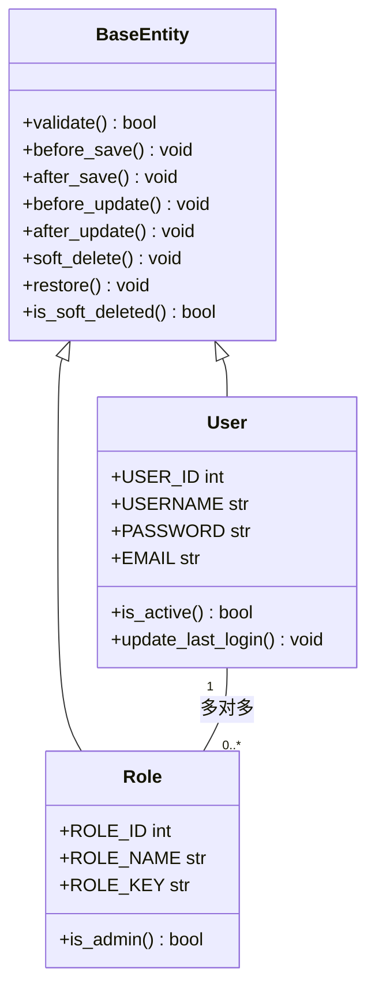
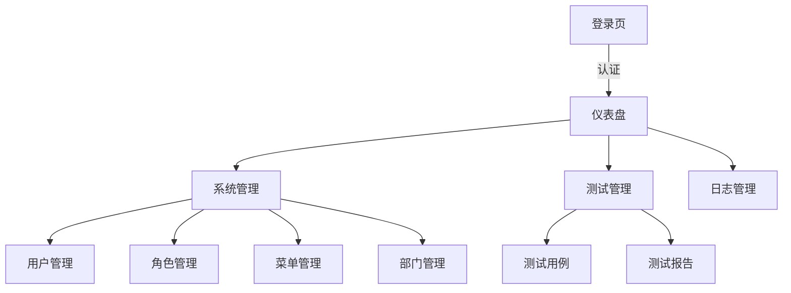
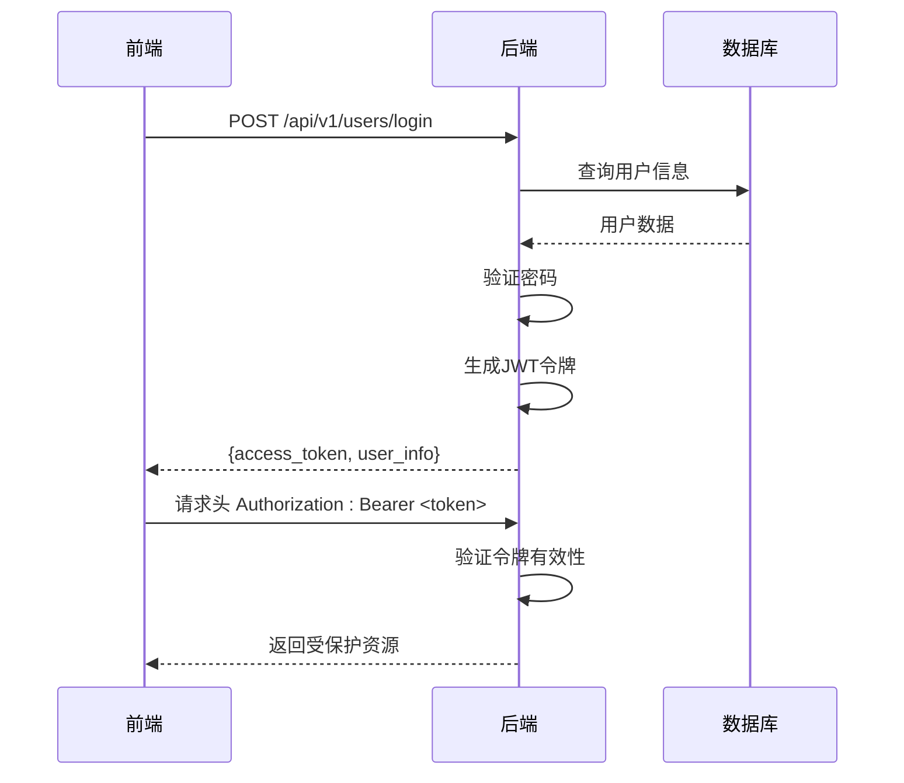
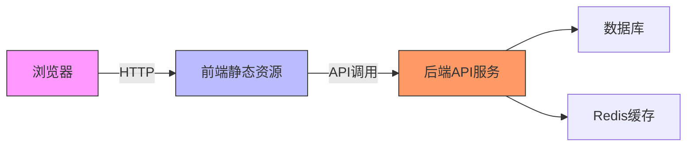
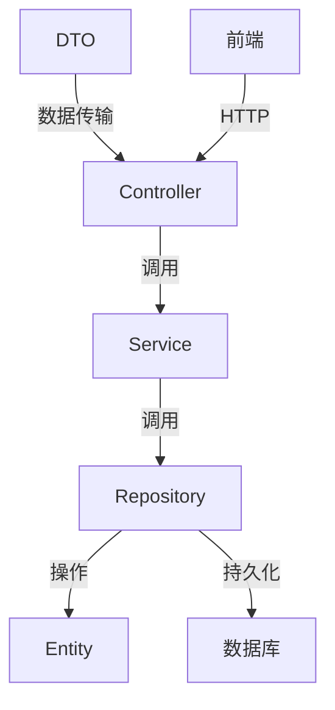
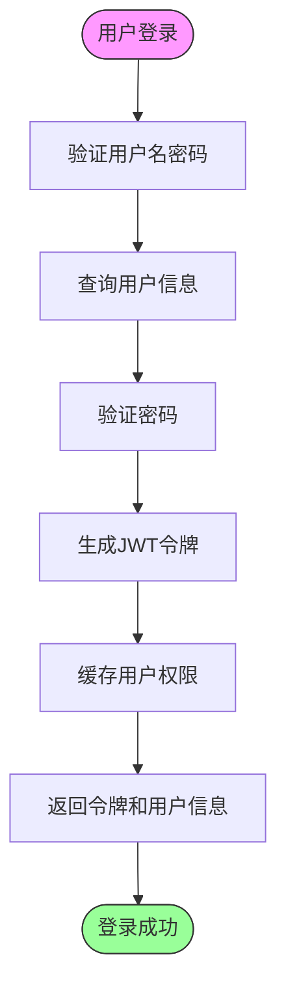

# 技术栈

<cite>
**本文档中引用的文件**  
- [main.py](file://AI-agent-backend/main.py)
- [config.py](file://AI-agent-backend/app/core/config.py)
- [security.py](file://AI-agent-backend/app/core/security.py)
- [auth.py](file://AI-agent-backend/app/middleware/auth.py)
- [session.py](file://AI-agent-backend/app/db/session.py)
- [base.py](file://AI-agent-backend/app/entity/base.py)
- [base.py](file://AI-agent-backend/app/dto/base.py)
- [rbac_user_controller.py](file://AI-agent-backend/app/controller/rbac_user_controller.py)
- [rbac_user_service.py](file://AI-agent-backend/app/service/rbac_user_service.py)
- [base_repository.py](file://AI-agent-backend/app/repository/base_repository.py)
- [redis_client.py](file://AI-agent-backend/app/utils/redis_client.py)
- [package.json](file://AI-agent-frontend/package.json)
- [main.ts](file://AI-agent-frontend/src/main.ts)
- [store.ts](file://AI-agent-frontend/src/store/store.ts)
- [index.ts](file://AI-agent-frontend/src/router/index.ts)
- [Dockerfile](file://AI-agent-backend/Dockerfile)
- [docker-compose.yml](file://AI-agent-backend/docker-compose.yml)
- [alembic.ini](file://AI-agent-backend/alembic.ini)
</cite>

## 目录
1. [项目结构概述](#项目结构概述)
2. [后端技术栈分析](#后端技术栈分析)
3. [前端技术栈分析](#前端技术栈分析)
4. [基础设施工具](#基础设施工具)
5. [关键技术集成](#关键技术集成)
6. [架构与数据流](#架构与数据流)

## 项目结构概述

本项目采用前后端分离架构，包含两个主要模块：`AI-agent-backend`（后端）和`AI-agent-frontend`（前端）。后端基于Python生态构建，采用五层架构模式（Controller、Service、Repository、Entity、DTO），前端基于Vue 3生态系统构建，使用Pinia进行状态管理。



**图示来源**
- [main.py](file://AI-agent-backend/main.py)
- [package.json](file://AI-agent-frontend/package.json)

## 后端技术栈分析

### FastAPI - 高性能API框架

FastAPI作为本项目的核心后端框架，用于构建高性能的RESTful API服务。其主要优势包括：

- **自动文档生成**：集成Swagger UI和ReDoc
- **类型提示支持**：基于Python类型提示实现数据验证
- **异步支持**：原生支持async/await语法

在`main.py`中，FastAPI应用通过以下方式初始化：

```python
app = FastAPI(
    title=settings.APP_NAME,
    version=settings.APP_VERSION,
    lifespan=lifespan
)
```

**关键特性**：
- 使用`lifespan`管理应用生命周期
- 集成CORS中间件处理跨域请求
- 提供健康检查端点`/health`

**节来源**
- [main.py](file://AI-agent-backend/main.py#L50-L100)

### SQLAlchemy - 数据库ORM框架

SQLAlchemy作为对象关系映射（ORM）工具，负责与数据库交互。项目采用分层设计，通过Repository模式封装数据访问逻辑。

数据库会话配置位于`app/db/session.py`：

```python
engine = create_engine(
    settings.database_url_sync,
    echo=settings.DATABASE_ECHO,
    pool_pre_ping=True,
    pool_recycle=3600
)
```

**实体基类设计**：
- `BaseEntity`提供通用方法如`soft_delete()`、`before_update()`等
- 支持软删除和生命周期钩子



**图示来源**
- [base.py](file://AI-agent-backend/app/entity/base.py)
- [user.py](file://AI-agent-backend/app/entity/user.py)
- [role.py](file://AI-agent-backend/app/entity/role.py)

**节来源**
- [session.py](file://AI-agent-backend/app/db/session.py)
- [base.py](file://AI-agent-backend/app/entity/base.py)

### Pydantic - 数据验证与DTO

Pydantic用于定义数据传输对象（DTO）和请求/响应模型，确保数据类型安全和验证。

DTO基类设计特点：
- `BaseRequest`和`BaseResponse`提供统一基类
- 支持泛型`ApiResponse[T]`实现类型安全响应
- 内置分页模型`PaginationRequest`和`PaginationResponse`

```python
class ApiResponse(BaseResponse, Generic[T]):
    success: bool
    message: str
    data: Optional[T]
    error_code: Optional[str]
    timestamp: datetime
```

**节来源**
- [base.py](file://AI-agent-backend/app/dto/base.py)

### Redis - 缓存与会话管理

Redis用于缓存数据和会话管理，提高系统性能。项目实现了缓存客户端的优雅降级机制。

`CacheClient`特性：
- 优先使用Redis，连接失败时自动降级到内存缓存
- 支持JSON和Pickle序列化
- 提供统一的set/get/delete接口

```python
def __init__(self):
    if settings.REDIS_ENABLED:
        try:
            self.client = redis.Redis(...)
            self.is_redis = True
        except Exception:
            self.client = MemoryCache()  # 自动降级
    else:
        self.client = MemoryCache()
```

**节来源**
- [redis_client.py](file://AI-agent-backend/app/utils/redis_client.py)

## 前端技术栈分析

### Vue 3 - 响应式前端框架

Vue 3作为现代前端框架，提供响应式数据绑定和组件化开发模式。项目采用Composition API和TypeScript进行开发。

主入口`main.ts`初始化流程：
```typescript
const app = createApp(App)
app.use(router)
app.use(pinia)
app.use(ElementPlus, { locale: zhCn })
app.mount('#app')
```

**节来源**
- [main.ts](file://AI-agent-frontend/src/main.ts)

### Pinia - 状态管理

Pinia作为Vuex的替代方案，提供更简洁的状态管理。项目集成`pinia-plugin-persistedstate`实现状态持久化。

```typescript
import { createPinia } from 'pinia'
import piniaPluginPersistedstate from 'pinia-plugin-persistedstate'

const pinia = createPinia()
pinia.use(piniaPluginPersistedstate)
```

**节来源**
- [store.ts](file://AI-agent-frontend/src/store/store.ts)

### Element Plus - UI组件库

Element Plus提供丰富的UI组件，包括表格、表单、对话框等，加速前端开发。

### Vue Router - 路由管理

Vue Router处理前端路由，支持路由守卫和动态路由加载。



**节来源**
- [index.ts](file://AI-agent-frontend/src/router/index.ts)

## 基础设施工具

### Docker - 容器化部署

Docker用于容器化应用，确保环境一致性。`Dockerfile`定义了Python运行环境：

```dockerfile
FROM python:3.9-slim
WORKDIR /app
COPY requirements.txt .
RUN pip install -r requirements.txt
COPY . .
CMD ["uvicorn", "main:app", "--host", "0.0.0.0", "--port", "8001"]
```

### Docker Compose - 服务编排

Docker Compose管理多容器应用，定义后端、数据库和Redis服务。

```yaml
version: '3.8'
services:
  backend:
    build: .
    ports:
      - "8001:8001"
    depends_on:
      - db
      - redis
  db:
    image: postgres:13
  redis:
    image: redis:7
```

**节来源**
- [Dockerfile](file://AI-agent-backend/Dockerfile)
- [docker-compose.yml](file://AI-agent-backend/docker-compose.yml)

### Alembic - 数据库迁移

Alembic管理数据库模式变更，支持版本控制和迁移脚本。

```ini
[alembic]
script_location = alembic
sqlalchemy.url = sqlite:///./ai_agent.db
```

**节来源**
- [alembic.ini](file://AI-agent-backend/alembic.ini)

## 关键技术集成

### JWT认证流程

项目采用JWT（JSON Web Token）实现无状态认证，流程如下：



**核心组件**：
- `security.py`：实现`create_access_token`、`verify_token`等函数
- `auth.py`：中间件处理JWT验证
- `require_authentication`：依赖注入装饰器

**节来源**
- [security.py](file://AI-agent-backend/app/core/security.py)
- [auth.py](file://AI-agent-backend/app/middleware/auth.py)

### 前后端分离部署模式

项目采用标准的前后端分离架构：



**通信协议**：
- RESTful API设计
- JSON数据格式
- Bearer Token认证

## 架构与数据流

### 分层架构设计

项目采用企业级五层架构：



**各层职责**：
- **Controller**：处理HTTP请求，参数验证
- **Service**：实现业务逻辑，事务管理
- **Repository**：数据访问，CRUD操作
- **Entity**：领域模型，数据库映射
- **DTO**：数据传输，前后端交互

**节来源**
- [rbac_user_controller.py](file://AI-agent-backend/app/controller/rbac_user_controller.py)
- [rbac_user_service.py](file://AI-agent-backend/app/service/rbac_user_service.py)
- [base_repository.py](file://AI-agent-backend/app/repository/base_repository.py)

### 数据流示例 - 用户登录



**代码实现路径**：
1. `rbac_user_controller.py`：接收登录请求
2. `rbac_user_service.py`：调用`authenticate_user`
3. `security.py`：生成JWT令牌
4. `redis_client.py`：缓存用户权限

**节来源**
- [rbac_user_controller.py](file://AI-agent-backend/app/controller/rbac_user_controller.py)
- [rbac_user_service.py](file://AI-agent-backend/app/service/rbac_user_service.py)