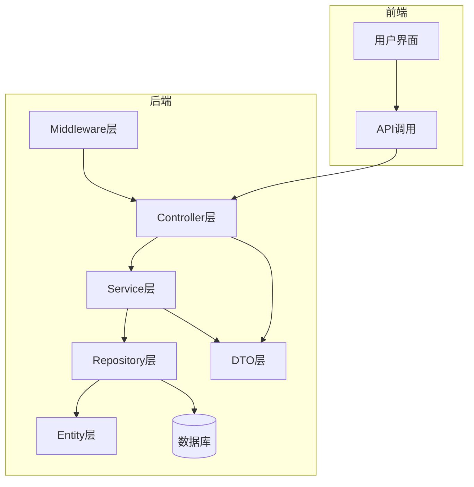
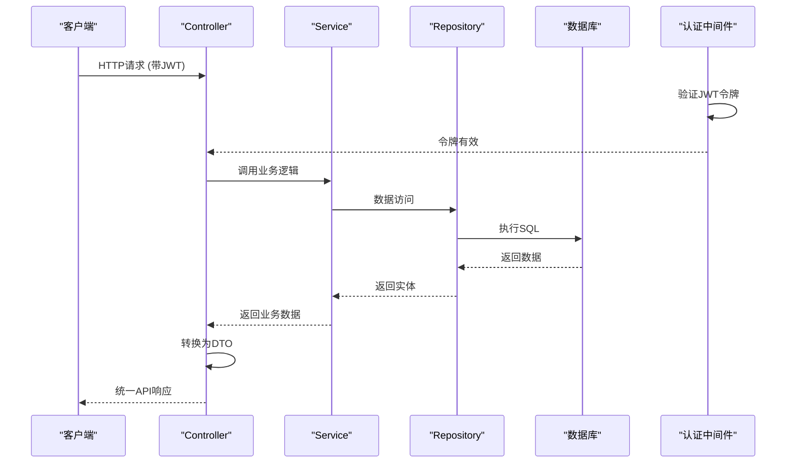
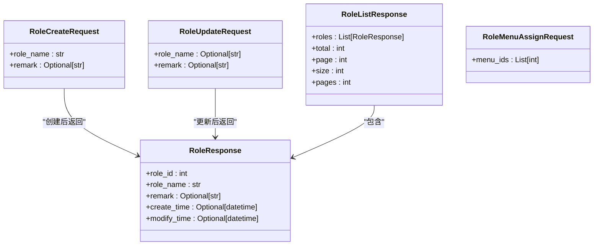
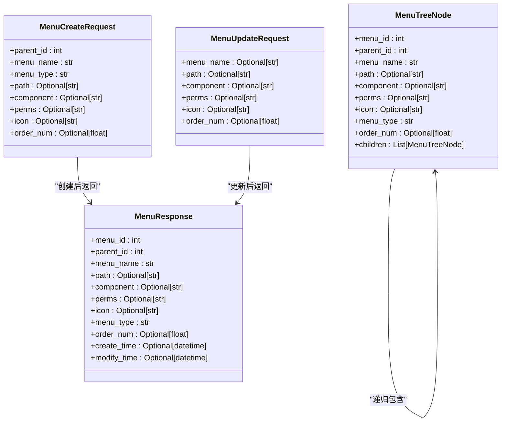
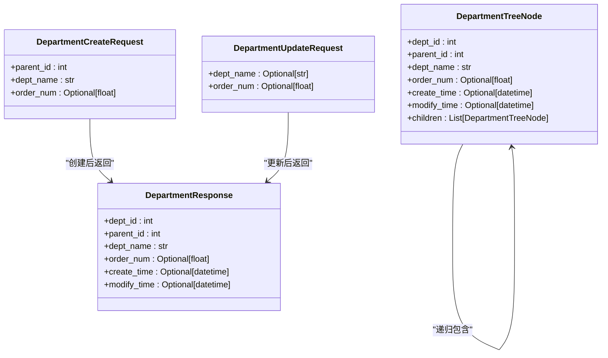
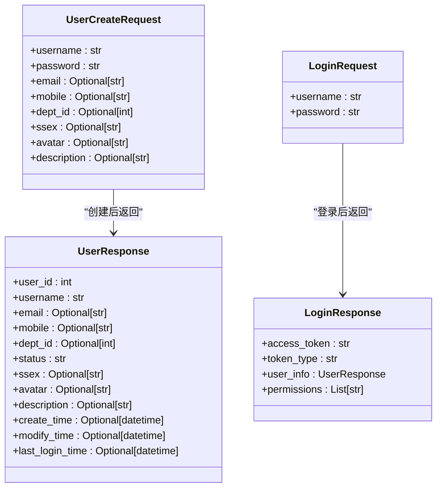
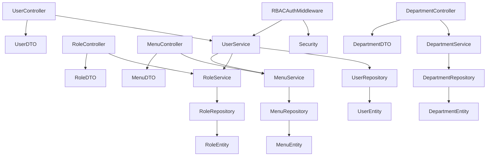

# API参考文档

<cite>
**本文档中引用的文件**   
- [main.py](file://AI-agent-backend/main.py)
- [role_controller.py](file://AI-agent-backend/app/controller/role_controller.py)
- [menu_controller.py](file://AI-agent-backend/app/controller/menu_controller.py)
- [department_controller.py](file://AI-agent-backend/app/controller/department_controller.py)
- [rbac_user_controller.py](file://AI-agent-backend/app/controller/rbac_user_controller.py)
- [user_controller_new.py](file://AI-agent-backend/app/controller/user_controller_new.py)
- [role_dto.py](file://AI-agent-backend/app/dto/role_dto.py)
- [menu_dto.py](file://AI-agent-backend/app/dto/menu_dto.py)
- [department_dto.py](file://AI-agent-backend/app/dto/department_dto.py)
- [user_dto.py](file://AI-agent-backend/app/dto/user_dto.py)
- [base.py](file://AI-agent-backend/app/dto/base.py)
- [security.py](file://AI-agent-backend/app/core/security.py)
- [rbac_auth.py](file://AI-agent-backend/app/middleware/rbac_auth.py)
- [config.py](file://AI-agent-backend/app/core/config.py)
</cite>

## 目录
1. [简介](#简介)
2. [项目结构](#项目结构)
3. [核心组件](#核心组件)
4. [架构概述](#架构概述)
5. [详细组件分析](#详细组件分析)
6. [依赖分析](#依赖分析)
7. [性能考虑](#性能考虑)
8. [故障排除指南](#故障排除指南)
9. [结论](#结论)

## 简介
本API参考文档为AI智能代理测试平台的后端服务提供完整的RESTful接口说明。文档覆盖了用户、角色、菜单和部门四大核心模块的公开接口端点，详细描述了每个控制器提供的HTTP方法、URL路径、请求参数、响应结构、认证与权限要求。所有接口均采用统一的响应格式，基于JWT进行身份认证，并通过RBAC（基于角色的访问控制）实现细粒度的权限管理。文档还包含了错误码体系、分页规则和调用示例，旨在为开发者提供清晰、全面的集成指导。

## 项目结构
AI智能代理测试平台采用分层架构设计，后端基于FastAPI框架构建，遵循企业级五层架构模式。项目主要分为`AI-agent-backend`和`AI-agent-frontend`两个目录，分别对应后端服务和前端应用。

后端项目结构清晰，各层职责分明：
- **controller层**：位于`app/controller`，处理HTTP请求和响应，是API的入口。
- **service层**：位于`app/service`，封装核心业务逻辑。
- **repository层**：位于`app/repository`，负责数据访问和持久化。
- **entity层**：位于`app/entity`，定义数据库实体模型。
- **dto层**：位于`app/dto`，定义数据传输对象，用于API请求和响应。
- **core层**：位于`app/core`，包含配置、安全、日志等核心功能。
- **middleware层**：位于`app/middleware`，实现认证、CORS、日志等中间件。

前端项目采用Vue3 + TypeScript技术栈，通过`src/api`模块与后端API进行交互。



**图示来源**
- [main.py](file://AI-agent-backend/main.py)
- [role_controller.py](file://AI-agent-backend/app/controller/role_controller.py)

## 核心组件
本系统的核心组件围绕用户、角色、菜单和部门四大实体构建，形成了一个完整的RBAC（基于角色的访问控制）权限管理体系。

- **用户(User)**：系统的基本操作主体，拥有用户名、密码、邮箱、部门等属性，并通过角色获得权限。
- **角色(Role)**：权限的集合，可以分配给一个或多个用户。每个角色可以被赋予不同的菜单访问权限。
- **菜单(Menu)**：系统的功能入口，可以是页面或按钮。菜单与权限标识（perms）关联，用于前端展示和后端权限校验。
- **部门(Department)**：组织架构单元，用于对用户进行分组管理。

这些组件通过`user_role`和`role_menu`两张关联表建立多对多关系，实现了灵活的权限分配。API设计遵循RESTful原则，每个资源都有独立的端点进行管理。

**组件来源**
- [role_controller.py](file://AI-agent-backend/app/controller/role_controller.py#L1-L327)
- [menu_controller.py](file://AI-agent-backend/app/controller/menu_controller.py#L1-L330)
- [department_controller.py](file://AI-agent-backend/app/controller/department_controller.py#L1-L326)
- [rbac_user_controller.py](file://AI-agent-backend/app/controller/rbac_user_controller.py#L1-L531)

## 架构概述
系统采用典型的分层微服务架构，前端通过HTTP/HTTPS协议与后端API进行通信。后端服务以FastAPI为核心，通过定义的路由器（Router）将请求分发到相应的控制器（Controller）。控制器负责解析请求、调用服务层（Service）处理业务逻辑，并将结果通过DTO（数据传输对象）转换为标准的API响应格式返回给客户端。

认证与授权通过JWT（JSON Web Token）和中间件实现。用户登录成功后获取访问令牌（Access Token），后续请求需在`Authorization`头中携带此令牌。`rbac_auth.py`中间件负责验证令牌的有效性，并根据用户的角色和权限决定是否允许访问特定资源。



**图示来源**
- [main.py](file://AI-agent-backend/main.py#L1-L43)
- [rbac_auth.py](file://AI-agent-backend/app/middleware/rbac_auth.py#L1-L305)
- [role_controller.py](file://AI-agent-backend/app/controller/role_controller.py#L1-L327)

## 详细组件分析
本节将对系统中的关键控制器进行详细分析，包括其提供的API端点、请求/响应结构、认证与权限要求。

### 角色管理分析
角色管理模块提供了对角色的增删改查和权限分配功能。

#### 角色控制器API端点


**图示来源**
- [role_dto.py](file://AI-agent-backend/app/dto/role_dto.py#L1-L130)
- [role_controller.py](file://AI-agent-backend/app/controller/role_controller.py#L1-L327)

##### 创建角色
- **HTTP方法**: `POST`
- **URL路径**: `/roles`
- **认证要求**: JWT令牌
- **权限要求**: `role:add`
- **请求参数 (Body)**:
  - `role_name` (string, 必填): 角色名称，最大10个字符。
  - `remark` (string, 可选): 角色描述，最大100个字符。
- **响应结构**: `ApiResponse[RoleResponse]`
- **示例请求**:
```json
{
  "role_name": "测试员",
  "remark": "负责执行测试用例"
}
```
- **示例响应**:
```json
{
  "success": true,
  "message": "角色创建成功",
  "data": {
    "role_id": 2,
    "role_name": "测试员",
    "remark": "负责执行测试用例",
    "create_time": "2025-01-01T00:00:00",
    "modify_time": "2025-01-01T00:00:00"
  },
  "timestamp": "2025-01-01T00:00:00Z"
}
```
- **curl命令**:
```bash
curl -X POST "http://localhost:8001/roles" \
  -H "Authorization: Bearer <your_jwt_token>" \
  -H "Content-Type: application/json" \
  -d '{"role_name": "测试员", "remark": "负责执行测试用例"}'
```

##### 获取角色列表
- **HTTP方法**: `GET`
- **URL路径**: `/roles`
- **认证要求**: JWT令牌
- **权限要求**: `role:view`
- **请求参数 (Query)**:
  - `page` (integer, 可选, 默认1): 页码，从1开始。
  - `size` (integer, 可选, 默认10, 范围1-100): 每页大小。
- **响应结构**: `ApiResponse[RoleListResponse]`
- **示例响应**:
```json
{
  "success": true,
  "message": "获取角色列表成功",
  "data": {
    "roles": [
      {
        "role_id": 1,
        "role_name": "管理员",
        "remark": "系统管理员角色",
        "create_time": "2025-01-01T00:00:00",
        "modify_time": "2025-01-01T00:00:00"
      }
    ],
    "total": 1,
    "page": 1,
    "size": 10,
    "pages": 1
  },
  "timestamp": "2025-01-01T00:00:00Z"
}
```

##### 获取角色详情
- **HTTP方法**: `GET`
- **URL路径**: `/roles/{role_id}`
- **认证要求**: JWT令牌
- **权限要求**: `role:view`
- **请求参数 (路径)**:
  - `role_id` (integer, 必填): 角色ID。
- **响应结构**: `ApiResponse[RoleResponse]`

##### 更新角色
- **HTTP方法**: `PUT`
- **URL路径**: `/roles/{role_id}`
- **认证要求**: JWT令牌
- **权限要求**: `role:update`
- **请求参数 (路径)**:
  - `role_id` (integer, 必填): 角色ID。
- **请求参数 (Body)**:
  - `role_name` (string, 可选): 新的角色名称。
  - `remark` (string, 可选): 新的角色描述。
- **响应结构**: `ApiResponse[RoleResponse]`

### 菜单管理分析
菜单管理模块负责系统的导航菜单和功能按钮的配置。

#### 菜单控制器API端点


**图示来源**
- [menu_dto.py](file://AI-agent-backend/app/dto/menu_dto.py#L1-L196)
- [menu_controller.py](file://AI-agent-backend/app/controller/menu_controller.py#L1-L330)

##### 创建菜单
- **HTTP方法**: `POST`
- **URL路径**: `/menus`
- **认证要求**: JWT令牌
- **权限要求**: `menu:add`
- **请求参数 (Body)**:
  - `parent_id` (integer, 必填): 上级菜单ID，0表示顶级菜单。
  - `menu_name` (string, 必填): 菜单或按钮名称。
  - `menu_type` (string, 必填): 类型，'0'表示菜单，'1'表示按钮。
  - `path` (string, 可选): 路由路径。
  - `component` (string, 可选): 路由组件。
  - `perms` (string, 可选): 权限标识，用于后端权限校验。
  - `icon` (string, 可选): 图标。
  - `order_num` (number, 可选): 排序号。
- **响应结构**: `ApiResponse[MenuResponse]`

##### 获取菜单树
- **HTTP方法**: `GET`
- **URL路径**: `/menus/tree`
- **认证要求**: JWT令牌
- **权限要求**: `menu:view`
- **响应结构**: `ApiResponse[List[MenuTreeNode]]`
- **说明**: 返回完整的菜单树形结构，用于前端动态生成导航菜单。

### 部门管理分析
部门管理模块用于维护组织架构。

#### 部门控制器API端点


**图示来源**
- [department_dto.py](file://AI-agent-backend/app/dto/department_dto.py#L1-L169)
- [department_controller.py](file://AI-agent-backend/app/controller/department_controller.py#L1-L326)

##### 创建部门
- **HTTP方法**: `POST`
- **URL路径**: `/departments`
- **认证要求**: JWT令牌
- **权限要求**: `dept:add`
- **请求参数 (Body)**:
  - `parent_id` (integer, 必填): 上级部门ID，0表示顶级部门。
  - `dept_name` (string, 必填): 部门名称。
  - `order_num` (number, 可选): 排序号。
- **响应结构**: `ApiResponse[DepartmentResponse]`

##### 获取部门树
- **HTTP方法**: `GET`
- **URL路径**: `/departments/tree`
- **认证要求**: JWT令牌
- **权限要求**: `dept:view`
- **响应结构**: `ApiResponse[List[DepartmentTreeNode]]`
- **说明**: 返回完整的部门树形结构。

### 用户管理分析
用户管理模块是系统的核心，包含用户生命周期管理和认证授权功能。

#### 用户控制器API端点


**图示来源**
- [user_dto.py](file://AI-agent-backend/app/dto/user_dto.py#L1-L221)
- [rbac_user_controller.py](file://AI-agent-backend/app/controller/rbac_user_controller.py#L1-L531)

##### 创建用户
- **HTTP方法**: `POST`
- **URL路径**: `/users`
- **认证要求**: JWT令牌
- **权限要求**: `user:add`
- **请求参数 (Body)**:
  - `username` (string, 必填): 用户名，3-50个字符。
  - `password` (string, 必填): 密码，6-20个字符。
  - `email` (string, 可选): 邮箱。
  - `mobile` (string, 可选): 手机号。
  - `dept_id` (integer, 可选): 部门ID。
  - `ssex` (string, 可选): 性别，'0'男，'1'女，'2'保密。
  - `avatar` (string, 可选): 头像。
  - `description` (string, 可选): 描述。
- **响应结构**: `ApiResponse[UserResponse]`

##### 用户登录
- **HTTP方法**: `POST`
- **URL路径**: `/users/login`
- **认证要求**: 无（此为认证起点）
- **权限要求**: 无
- **请求参数 (Body)**:
  - `username` (string, 必填): 用户名。
  - `password` (string, 必填): 密码。
- **响应结构**: `ApiResponse[LoginResponse]`
- **说明**: 登录成功后返回JWT访问令牌和用户信息。
- **示例响应**:
```json
{
  "success": true,
  "message": "登录成功",
  "data": {
    "access_token": "eyJhbGciOiJIUzI1NiIsInR5cCI6IkpXVCJ9...",
    "token_type": "bearer",
    "user_info": {
      "user_id": 1,
      "username": "admin",
      "email": "admin@example.com",
      "status": "1"
    },
    "permissions": ["user:view", "user:add", "role:view", "menu:view"]
  },
  "timestamp": "2025-01-01T00:00:00Z"
}
```

## 依赖分析
系统内部组件之间存在清晰的依赖关系，遵循了依赖倒置原则。



**图示来源**
- [rbac_user_controller.py](file://AI-agent-backend/app/controller/rbac_user_controller.py)
- [rbac_user_service.py](file://AI-agent-backend/app/service/rbac_user_service.py)
- [rbac_auth.py](file://AI-agent-backend/app/middleware/rbac_auth.py)

## 性能考虑
- **数据库**: 使用SQLAlchemy ORM，建议在生产环境中使用PostgreSQL或MySQL以获得更好的性能和并发支持。已配置`DATABASE_ECHO=False`以避免在生产环境中打印SQL日志。
- **缓存**: 系统支持Redis缓存（`REDIS_ENABLED=True`），可用于缓存频繁访问的数据，如菜单树、用户权限等，以减轻数据库压力。
- **JWT**: 访问令牌（Access Token）有效期为30分钟（`ACCESS_TOKEN_EXPIRE_MINUTES=30`），刷新令牌（Refresh Token）有效期为7天。这种设计平衡了安全性和用户体验。
- **分页**: 所有列表接口均支持分页，避免一次性加载大量数据。默认每页大小为20条，最大100条。
- **速率限制**: 系统启用了速率限制（`RATE_LIMIT_ENABLED=True`），默认每60秒最多100次请求，防止API被滥用。

## 故障排除指南
当API调用出现问题时，可参考以下常见错误码进行排查：

| 错误码 | HTTP状态码 | 含义 | 可能原因 |
| :--- | :--- | :--- | :--- |
| 400 | 400 Bad Request | 请求参数错误 | 提交的数据格式不正确或缺少必填字段 |
| 401 | 401 Unauthorized | 未授权 | JWT令牌缺失、格式错误或已过期 |
| 403 | 403 Forbidden | 权限不足 | 当前用户角色没有访问该资源的权限 |
| 404 | 404 Not Found | 资源不存在 | 请求的URL路径错误或指定的ID不存在 |
| 500 | 500 Internal Server Error | 服务器内部错误 | 服务器端代码出现未捕获的异常 |

**日志**: 所有错误和关键操作都会被记录到日志文件（`logs/app.log`）中，可通过查看日志获取更详细的错误信息。

**组件来源**
- [security.py](file://AI-agent-backend/app/core/security.py#L1-L314)
- [base.py](file://AI-agent-backend/app/dto/base.py#L1-L308)
- [rbac_auth.py](file://AI-agent-backend/app/middleware/rbac_auth.py#L1-L305)

## 结论
本API参考文档全面介绍了AI智能代理测试平台的后端RESTful API。系统采用现代化的分层架构和RBAC权限模型，提供了稳定、安全、易用的接口。开发者在集成时应重点关注JWT认证流程、统一的响应格式和权限控制机制。通过合理使用分页和缓存，可以有效提升系统性能和用户体验。