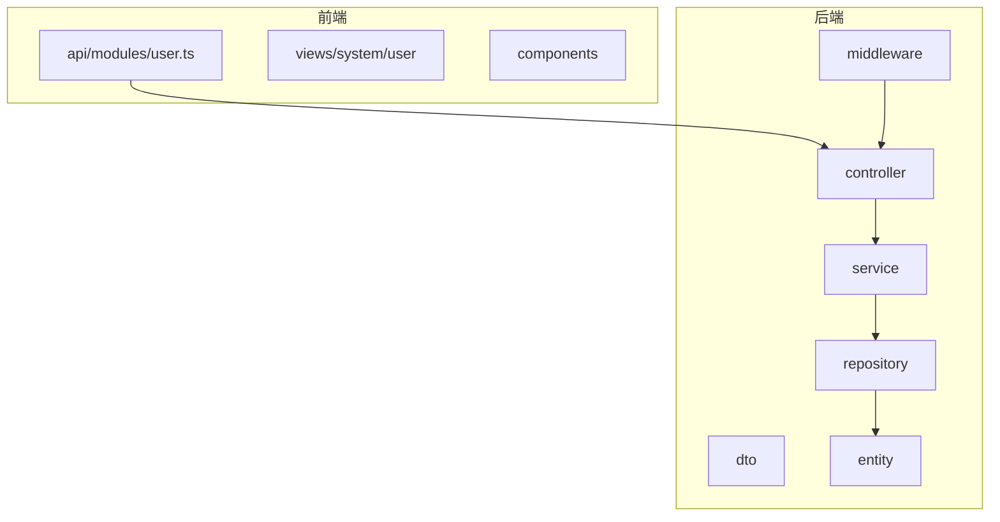
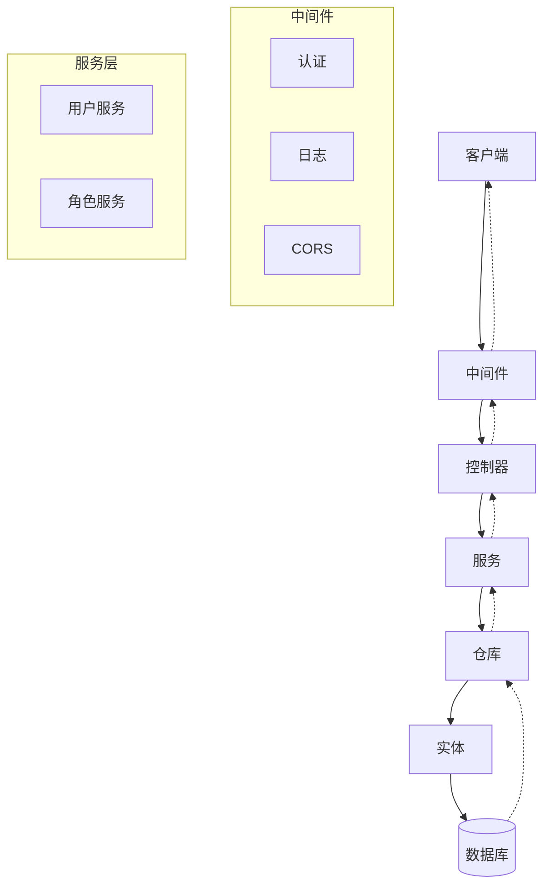
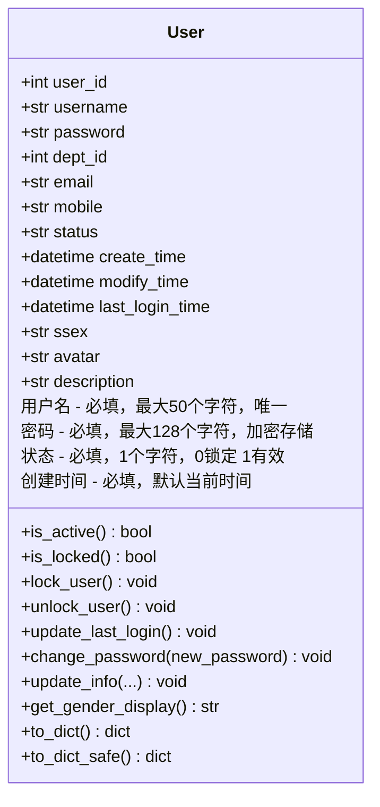
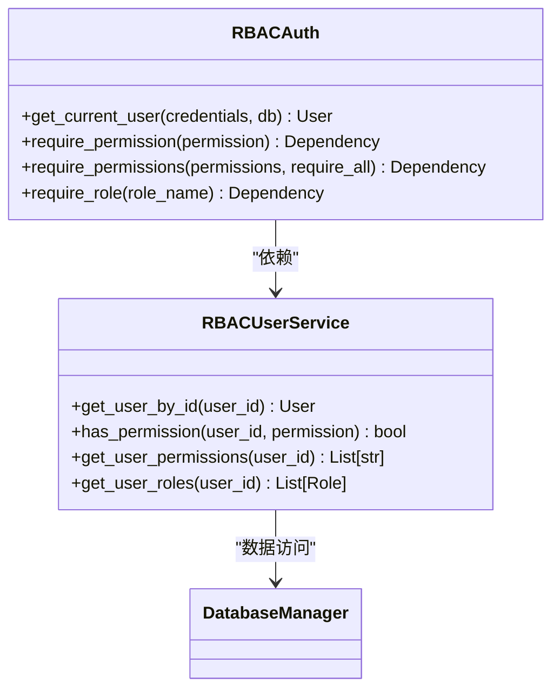
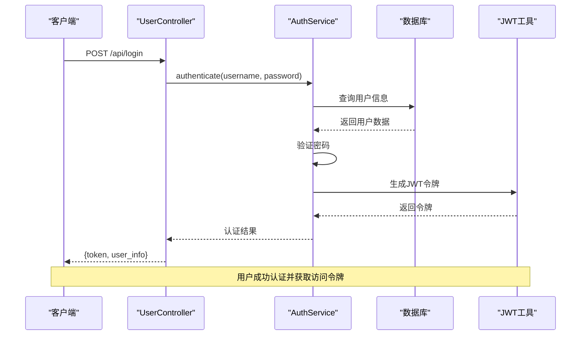
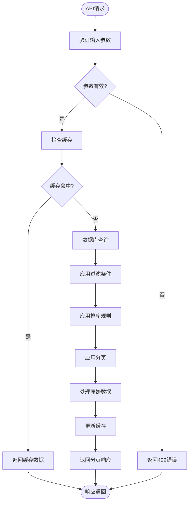
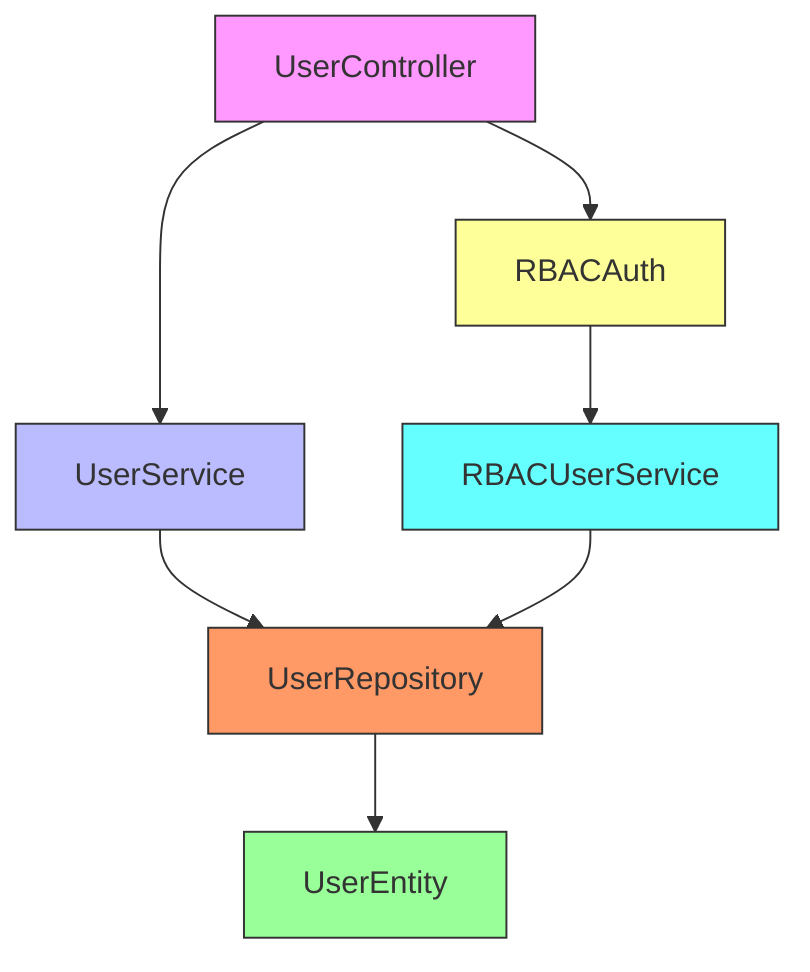
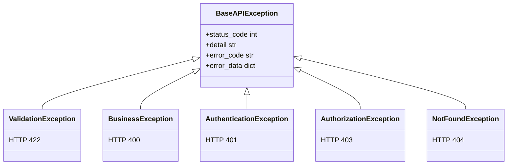

# 用户管理API

<cite>
**本文档引用的文件**   
- [rbac_auth.py](file://AI-agent-backend/app/middleware/rbac_auth.py)
- [user.py](file://AI-agent-backend/app/entity/user.py)
- [base.py](file://AI-agent-backend/app/dto/base.py)
- [main.py](file://AI-agent-backend/main.py)
- [exceptions.py](file://AI-agent-backend/app/utils/exceptions.py)
- [logger.py](file://AI-agent-backend/app/core/logger.py)
- [logging.py](file://AI-agent-backend/app/middleware/logging.py)
- [RBAC_GUIDE.md](file://AI-agent-backend/docs/RBAC_GUIDE.md)
- [user.ts](file://AI-agent-frontend/src/api/modules/user.ts)
</cite>

## 目录
1. [简介](#简介)
2. [项目结构](#项目结构)
3. [核心组件](#核心组件)
4. [架构概述](#架构概述)
5. [详细组件分析](#详细组件分析)
6. [依赖分析](#依赖分析)
7. [性能考虑](#性能考虑)
8. [故障排除指南](#故障排除指南)
9. [结论](#结论)

## 简介
本文档详细描述了用户管理模块的RESTful API，涵盖用户增删改查、登录认证、权限分配等核心功能。系统采用基于角色的访问控制（RBAC）模型，通过JWT实现安全认证。API设计遵循分层架构，包含控制器、服务、数据访问等组件，确保高内聚低耦合。前端通过Vue3 + Element Plus实现，后端采用FastAPI框架，支持完整的CRUD操作、分页查询、搜索过滤和权限控制。

## 项目结构
用户管理功能分布在后端和前端两个主要模块中。后端采用分层架构，包括控制器、服务、数据传输对象（DTO）、实体、仓库等组件。前端通过模块化方式组织API调用，使用TypeScript定义类型接口。

**Diagram sources**
- [project_structure](file://README.md)

## 核心组件

用户管理模块的核心组件包括用户实体、RBAC权限中间件、DTO数据传输对象和异常处理机制。用户实体定义了数据库表结构和业务方法，RBAC中间件实现JWT认证和权限检查，DTO确保请求响应数据的类型安全，异常处理提供统一的错误响应格式。

**Section sources**
- [user.py](file://AI-agent-backend/app/entity/user.py)
- [rbac_auth.py](file://AI-agent-backend/app/middleware/rbac_auth.py)
- [base.py](file://AI-agent-backend/app/dto/base.py)
- [exceptions.py](file://AI-agent-backend/app/utils/exceptions.py)

## 架构概述

系统采用典型的分层架构，从前端到后端形成清晰的数据流。HTTP请求经过中间件处理（日志记录、CORS、认证），由控制器接收并调用服务层，服务层通过仓库访问数据库实体，最终返回响应。

**Diagram sources**
- [main.py](file://AI-agent-backend/main.py#L1-L100)
- [middleware](file://AI-agent-backend/app/middleware/)

## 详细组件分析

### 用户实体分析
用户实体类定义了`t_user`表的映射关系，包含用户基本信息、状态管理方法和数据转换功能。

**Diagram sources**
- [user.py](file://AI-agent-backend/app/entity/user.py#L16-L215)

**Section sources**
- [user.py](file://AI-agent-backend/app/entity/user.py#L16-L215)

### RBAC权限中间件分析
RBAC权限中间件提供JWT认证和细粒度权限控制，支持基于权限、角色的访问控制。

**Diagram sources**
- [rbac_auth.py](file://AI-agent-backend/app/middleware/rbac_auth.py#L1-L305)
- [rbac_user_service.py](file://AI-agent-backend/app/service/rbac_user_service.py)

### API认证流程分析
用户登录认证流程涉及令牌生成、验证和权限检查，确保系统安全。

**Diagram sources**
- [rbac_auth.py](file://AI-agent-backend/app/middleware/rbac_auth.py#L1-L305)
- [security.py](file://AI-agent-backend/app/core/security.py)

### 分页与搜索功能分析
系统支持分页查询和搜索过滤，提高大数据量下的用户体验。

**Diagram sources**
- [base.py](file://AI-agent-backend/app/dto/base.py#L52-L96)
- [base.py](file://AI-agent-backend/app/service/base.py#L87-L127)

## 依赖分析

系统组件之间存在明确的依赖关系，遵循依赖倒置原则，通过接口注入降低耦合度。

**Diagram sources**
- [rbac_user_controller.py](file://AI-agent-backend/app/controller/rbac_user_controller.py)
- [rbac_user_service.py](file://AI-agent-backend/app/service/rbac_user_service.py)
- [user.py](file://AI-agent-backend/app/entity/user.py)

**Section sources**
- [rbac_user_controller.py](file://AI-agent-backend/app/controller/rbac_user_controller.py)
- [rbac_user_service.py](file://AI-agent-backend/app/service/rbac_user_service.py)

## 性能考虑
系统在性能方面进行了多项优化，包括日志异步处理、数据库查询优化和缓存机制。日志使用loguru库，支持异步写入和文件轮转，避免阻塞主线程。数据库操作通过SQLAlchemy ORM实现，支持连接池和事务管理。对于频繁访问的数据，可集成Redis缓存，减少数据库压力。

## 故障排除指南

### 常见错误及解决方案
1. **401未授权错误**：检查JWT令牌是否有效、是否过期
2. **403权限不足**：确认用户角色是否具有所需权限
3. **422参数验证错误**：检查请求体JSON格式和字段约束
4. **500服务器错误**：查看服务端日志定位具体异常

### 异常处理机制
系统采用统一的异常处理策略，通过自定义异常类和全局异常处理器提供一致的错误响应。

**Diagram sources**
- [exceptions.py](file://AI-agent-backend/app/utils/exceptions.py#L0-L52)
- [main.py](file://AI-agent-backend/main.py#L82-L124)

**Section sources**
- [exceptions.py](file://AI-agent-backend/app/utils/exceptions.py#L0-L52)
- [main.py](file://AI-agent-backend/main.py#L82-L124)

## 结论
用户管理API设计完善，功能全面，支持完整的用户生命周期管理。系统采用现代化的技术栈，具有良好的可扩展性和安全性。通过RBAC权限模型和JWT认证，确保了系统的安全访问。分页、搜索、排序等特性提升了用户体验。建议在生产环境中启用Redis缓存以进一步提升性能，并定期审查权限配置确保最小权限原则。