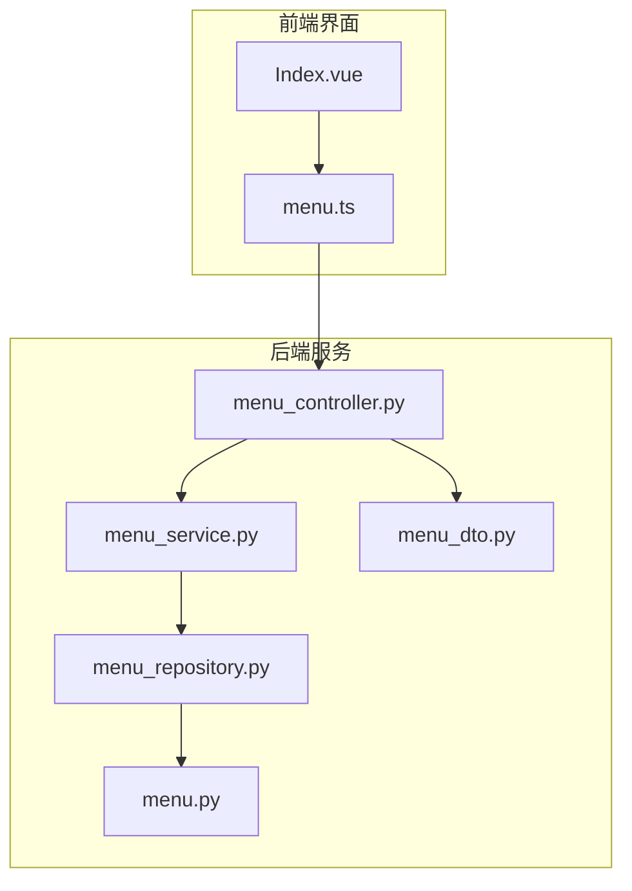
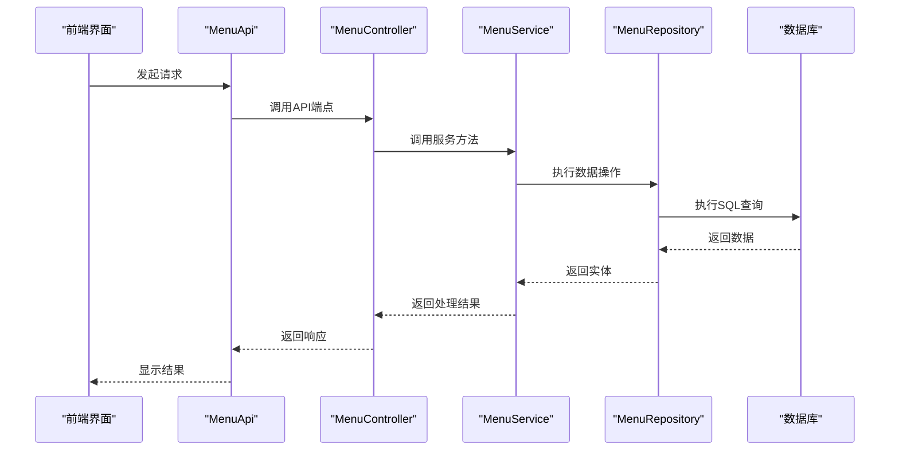
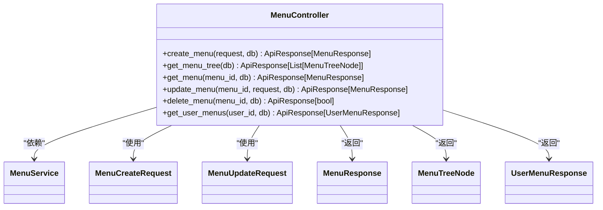
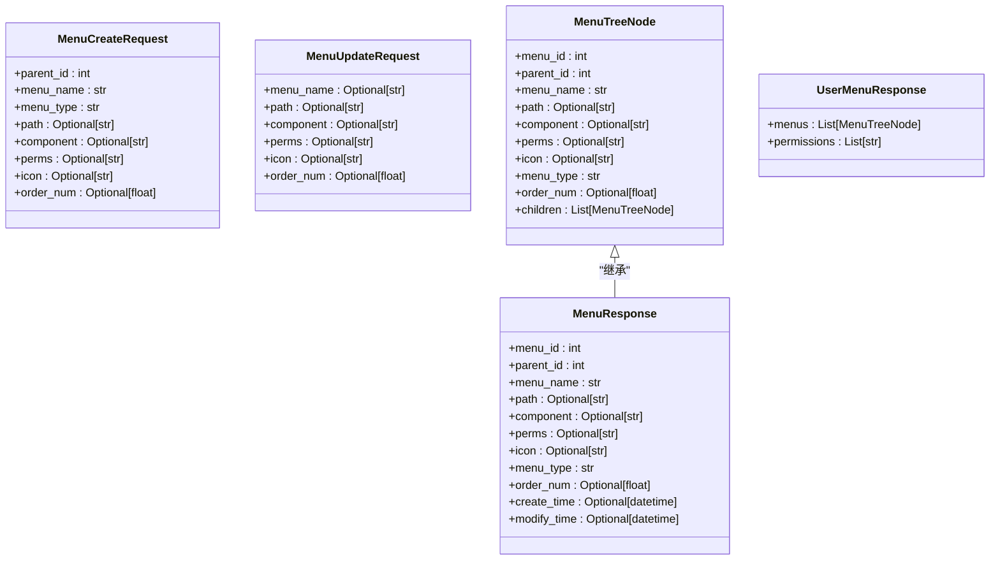
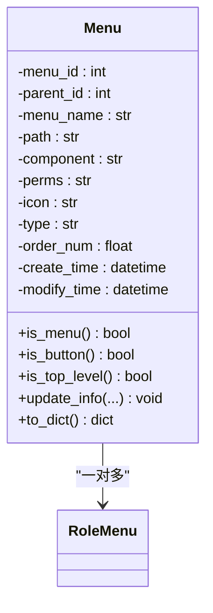
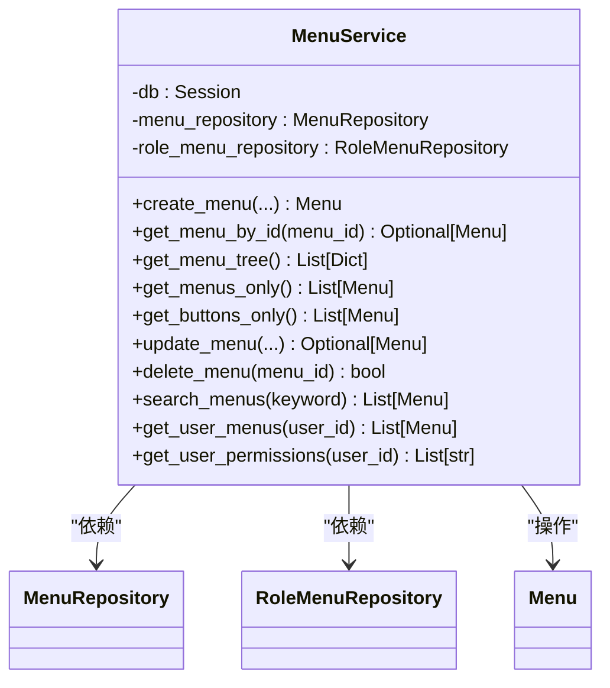
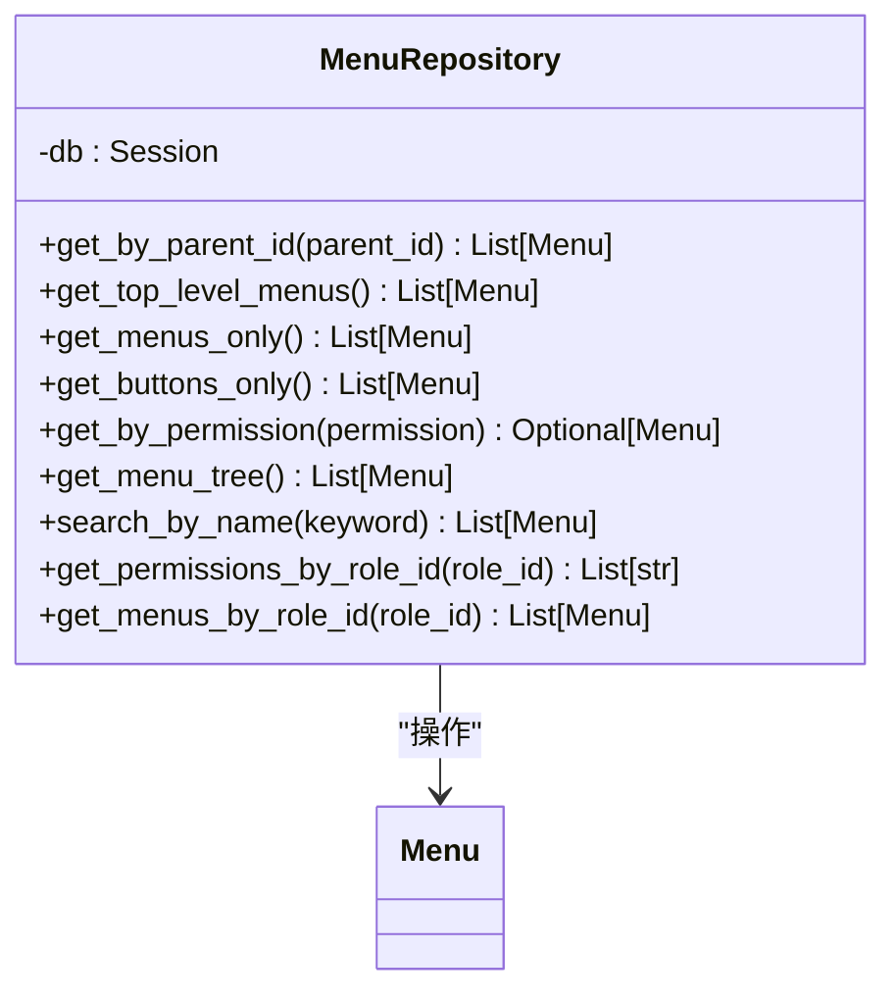
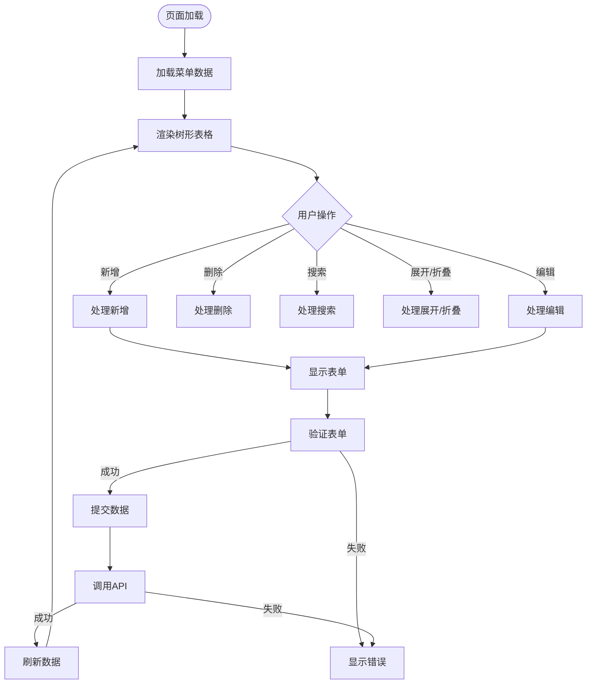
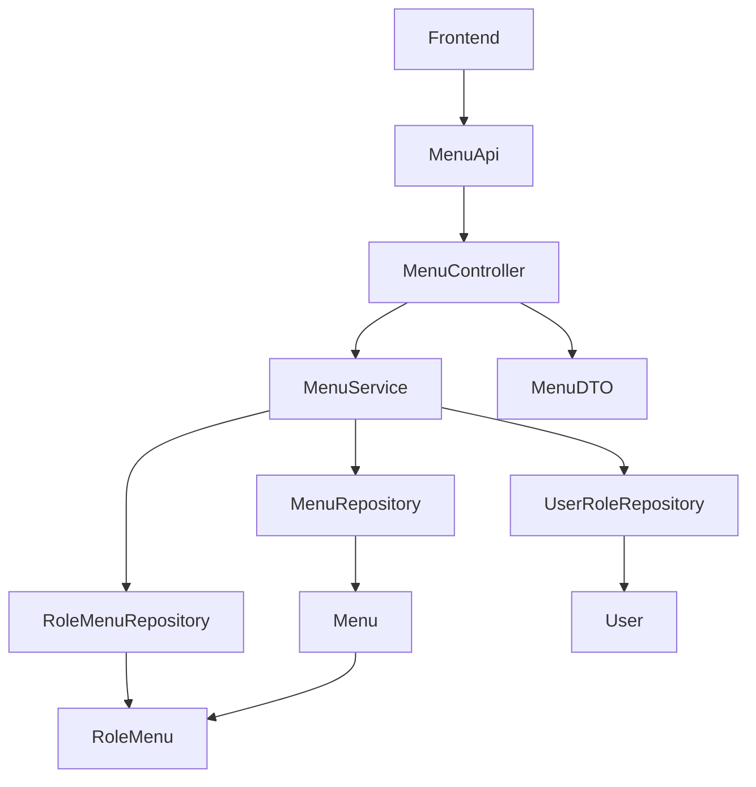

# 菜单管理API

<cite>
**本文档引用的文件**  
- [menu_controller.py](file://AI-agent-backend\app\controller\menu_controller.py)
- [menu_dto.py](file://AI-agent-backend\app\dto\menu_dto.py)
- [menu.py](file://AI-agent-backend\app\entity\menu.py)
- [menu_service.py](file://AI-agent-backend\app\service\menu_service.py)
- [menu_repository.py](file://AI-agent-backend\app\repository\menu_repository.py)
- [menu.ts](file://AI-agent-frontend\src\api\modules\menu.ts)
- [Index.vue](file://AI-agent-frontend\src\views\system\menu\Index.vue)
</cite>

## 目录
1. [简介](#简介)
2. [项目结构](#项目结构)
3. [核心组件](#核心组件)
4. [架构概览](#架构概览)
5. [详细组件分析](#详细组件分析)
6. [依赖分析](#依赖分析)
7. [性能考虑](#性能考虑)
8. [故障排除指南](#故障排除指南)
9. [结论](#结论)

## 简介
本API文档详细说明了菜单管理模块的实现，涵盖菜单项的增删改查、树形结构构建、权限标识维护等功能。该模块是RBAC权限系统的核心组成部分，支持动态菜单渲染和细粒度权限控制。通过`/api/menus`和`/api/menus/tree`等端点，系统能够灵活管理多层级菜单结构，并与前端组件进行映射。文档将深入解析API设计、数据结构、权限校验逻辑以及前后端集成方式。

## 项目结构
菜单管理功能分布在后端服务和前端界面两个主要部分。后端采用分层架构，包括控制器、服务、数据访问层和实体模型；前端则通过Vue组件实现可视化操作界面。



**图示来源**  
- [menu_controller.py](file://AI-agent-backend\app\controller\menu_controller.py)
- [menu_service.py](file://AI-agent-backend\app\service\menu_service.py)
- [menu_repository.py](file://AI-agent-backend\app\repository\menu_repository.py)
- [menu.py](file://AI-agent-backend\app\entity\menu.py)
- [menu_dto.py](file://AI-agent-backend\app\dto\menu_dto.py)
- [menu.ts](file://AI-agent-frontend\src\api\modules\menu.ts)
- [Index.vue](file://AI-agent-frontend\src\views\system\menu\Index.vue)

## 核心组件
菜单管理模块的核心组件包括：`MenuController`处理HTTP请求，`MenuService`实现业务逻辑，`MenuRepository`负责数据访问，`Menu`实体定义数据模型，以及`MenuDTO`定义数据传输结构。前端通过`MenuApi`类调用后端API，并在`Index.vue`中实现用户界面。

**组件来源**  
- [menu_controller.py](file://AI-agent-backend\app\controller\menu_controller.py)
- [menu_service.py](file://AI-agent-backend\app\service\menu_service.py)
- [menu_repository.py](file://AI-agent-backend\app\repository\menu_repository.py)
- [menu.py](file://AI-agent-backend\app\entity\menu.py)
- [menu_dto.py](file://AI-agent-backend\app\dto\menu_dto.py)

## 架构概览
系统采用典型的分层架构，从前端界面到数据库的完整调用链路清晰。用户在前端界面操作后，通过API调用后端控制器，经由服务层处理业务逻辑，最终通过数据访问层与数据库交互。



**图示来源**  
- [menu_controller.py](file://AI-agent-backend\app\controller\menu_controller.py)
- [menu_service.py](file://AI-agent-backend\app\service\menu_service.py)
- [menu_repository.py](file://AI-agent-backend\app\repository\menu_repository.py)
- [menu.py](file://AI-agent-backend\app\entity\menu.py)
- [menu.ts](file://AI-agent-frontend\src\api\modules\menu.ts)

## 详细组件分析

### 菜单控制器分析
`MenuController`类定义了所有菜单相关的API端点，使用FastAPI框架实现RESTful接口。每个端点都配有详细的文档说明和异常处理机制。



**图示来源**  
- [menu_controller.py](file://AI-agent-backend\app\controller\menu_controller.py)
- [menu_dto.py](file://AI-agent-backend\app\dto\menu_dto.py)
- [menu_service.py](file://AI-agent-backend\app\service\menu_service.py)

### 菜单数据传输对象分析
`MenuDTO`模块定义了所有API交互所需的数据结构，包括请求和响应对象。使用Pydantic进行数据验证和序列化。



**图示来源**  
- [menu_dto.py](file://AI-agent-backend\app\dto\menu_dto.py)

### 菜单实体分析
`Menu`实体类映射数据库表`t_menu`，定义了菜单的所有属性和业务方法。通过SQLAlchemy实现ORM映射。



**图示来源**  
- [menu.py](file://AI-agent-backend\app\entity\menu.py)

### 菜单服务分析
`MenuService`类实现了菜单管理的核心业务逻辑，包括菜单树构建、权限检查和级联删除等复杂操作。



**图示来源**  
- [menu_service.py](file://AI-agent-backend\app\service\menu_service.py)
- [menu_repository.py](file://AI-agent-backend\app\repository\menu_repository.py)

### 菜单仓库分析
`MenuRepository`类封装了所有数据库操作，提供类型安全的数据访问接口。



**图示来源**  
- [menu_repository.py](file://AI-agent-backend\app\repository\menu_repository.py)
- [menu.py](file://AI-agent-backend\app\entity\menu.py)

### 前端API分析
前端`MenuApi`类封装了所有后端API调用，提供类型安全的接口。

```mermaid
classDiagram
class MenuApi {
+getMenuList() Promise<ApiResponse<MenuInfo[]>>
+getMenuTree() Promise<ApiResponse<MenuTreeNode[]>>
+getMenuById(menuId) Promise<ApiResponse<MenuInfo>>
+createMenu(data) Promise<ApiResponse<MenuInfo>>
+updateMenu(menuId, data) Promise<ApiResponse<MenuInfo>>
+deleteMenu(menuId) Promise<ApiResponse<boolean>>
+getUserMenuTree(userId) Promise<ApiResponse<MenuTreeNode[]>>
+getRoleMenuTree(roleId) Promise<ApiResponse<MenuTreeNode[]>>
+updateMenuOrder(menuId, orderNum) Promise<ApiResponse<boolean>>
+batchUpdateMenuOrder(orders) Promise<ApiResponse<boolean>>
+checkMenuName(menuName, parentId, excludeMenuId) Promise<ApiResponse<boolean>>
+checkPerms(perms, excludeMenuId) Promise<ApiResponse<boolean>>
+getMenuStats() Promise<ApiResponse<{total, menu_count, button_count, max_level}>>
}
MenuApi --> http : "依赖"
```

**图示来源**  
- [menu.ts](file://AI-agent-frontend\src\api\modules\menu.ts)

### 前端界面分析
`Index.vue`组件实现了菜单管理的完整用户界面，包括树形表格、表单对话框和操作按钮。



**图示来源**  
- [Index.vue](file://AI-agent-frontend\src\views\system\menu\Index.vue)

## 依赖分析
菜单管理模块与其他系统组件存在明确的依赖关系，确保了系统的模块化和可维护性。



**图示来源**  
- [menu_controller.py](file://AI-agent-backend\app\controller\menu_controller.py)
- [menu_service.py](file://AI-agent-backend\app\service\menu_service.py)
- [menu_repository.py](file://AI-agent-backend\app\repository\menu_repository.py)
- [menu.py](file://AI-agent-backend\app\entity\menu.py)
- [menu.ts](file://AI-agent-frontend\src\api\modules\menu.ts)

## 性能考虑
为提高系统性能，建议采取以下优化措施：
- 使用Redis缓存用户权限数据，避免频繁数据库查询
- 对菜单树结构进行客户端缓存，减少重复请求
- 在数据库的`menu_name`和`perms`字段上创建索引，加速搜索操作
- 实现分页查询，避免一次性加载过多数据
- 使用批量操作接口更新菜单排序，减少网络往返次数

## 故障排除指南
### 常见错误及解决方案
1. **循环引用检测失败**：在创建菜单时，确保`parent_id`不指向自身或其子菜单
2. **权限校验失败**：检查用户是否具有`menu:read`或`menu:write`权限
3. **删除失败**：确认菜单没有子菜单或角色关联
4. **图标不显示**：验证图标名称是否正确且Element Plus支持
5. **路由不生效**：检查`path`和`component`字段是否正确配置

### 调试建议
- 查看后端日志文件获取详细错误信息
- 使用浏览器开发者工具检查API请求和响应
- 验证数据库中`t_menu`表的数据完整性
- 检查Redis缓存中的权限数据是否正确

**组件来源**  
- [menu_controller.py](file://AI-agent-backend\app\controller\menu_controller.py)
- [menu_service.py](file://AI-agent-backend\app\service\menu_service.py)
- [menu_repository.py](file://AI-agent-backend\app\repository\menu_repository.py)

## 结论
菜单管理API提供了一套完整的解决方案，用于管理系统的导航结构和权限控制。通过清晰的分层架构和类型安全的接口设计，系统实现了高内聚、低耦合的特性。前后端的紧密集成确保了用户体验的一致性，而RBAC权限系统的集成则提供了细粒度的访问控制。建议在实际使用中遵循最佳实践，充分利用缓存和索引优化性能，并定期审查权限配置以确保系统安全。