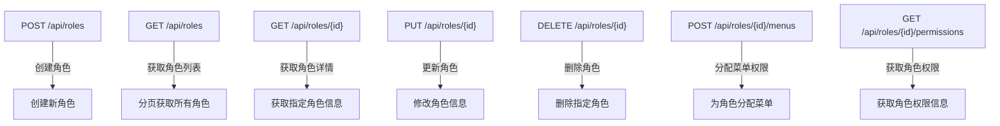
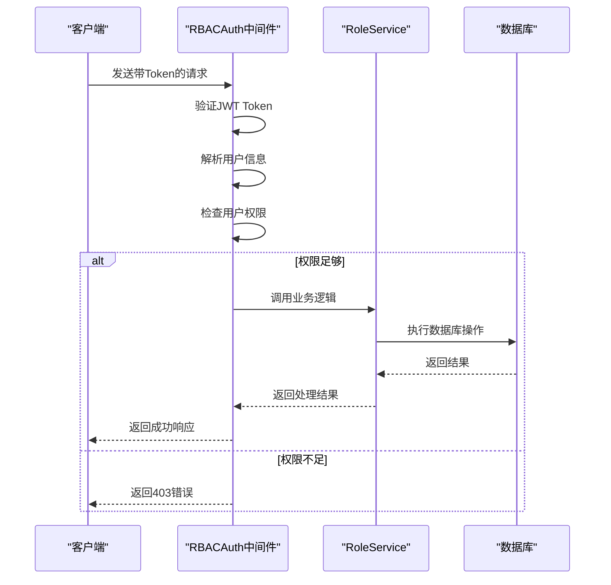
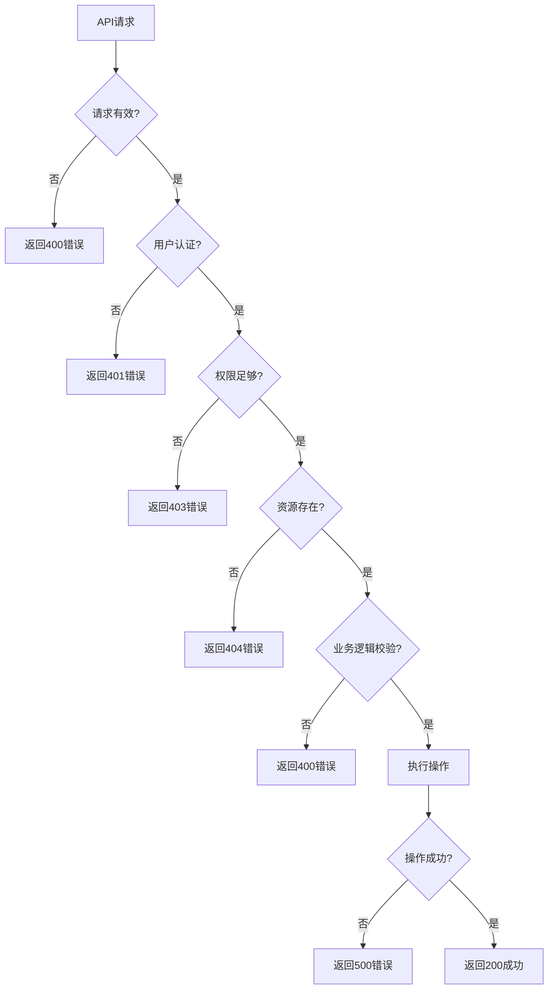

# 角色管理API

<cite>
**本文档引用的文件**   
- [role_controller.py](file://AI-agent-backend\app\controller\role_controller.py)
- [role_dto.py](file://AI-agent-backend\app\dto\role_dto.py)
- [role_service.py](file://AI-agent-backend\app\service\role_service.py)
- [role_repository.py](file://AI-agent-backend\app\repository\role_repository.py)
- [rbac_auth.py](file://AI-agent-backend\app\middleware\rbac_auth.py)
- [role.py](file://AI-agent-backend\app\entity\role.py)
- [role_menu.py](file://AI-agent-backend\app\entity\role_menu.py)
- [menu.py](file://AI-agent-backend\app\entity\menu.py)
- [base.py](file://AI-agent-backend\app\dto\base.py)
</cite>

## 目录
1. [角色管理API](#角色管理api)
2. [核心功能概述](#核心功能概述)
3. [API端点详情](#api端点详情)
4. [数据传输对象（DTO）](#数据传输对象dto)
5. [权限校验机制](#权限校验机制)
6. [错误码与解决方案](#错误码与解决方案)
7. [使用示例](#使用示例)
8. [前端调用注意事项](#前端调用注意事项)

## 核心功能概述

角色管理模块提供了一套完整的角色生命周期管理功能，包括角色的创建、查询、更新、删除以及权限分配。该模块基于RBAC（基于角色的访问控制）模型设计，实现了细粒度的权限控制。系统通过角色与菜单的多对多关系来管理权限，每个角色可以被分配多个菜单权限，而每个菜单也可以被多个角色共享。

角色实体（Role）与菜单实体（Menu）通过中间表`role_menus`建立关联关系，实现了灵活的权限分配机制。所有API端点均遵循RESTful设计原则，使用标准的HTTP方法（GET/POST/PUT/DELETE）进行操作，并返回统一的响应格式。

**本节来源**
- [role_controller.py](file://AI-agent-backend\app\controller\role_controller.py#L1-L327)
- [role.py](file://AI-agent-backend\app\entity\role.py#L1-L91)
- [role_menu.py](file://AI-agent-backend\app\entity\role_menu.py#L1-L62)

## API端点详情

角色管理API提供了一系列端点来操作角色资源。所有端点均以`/api/roles`为前缀，遵循RESTful设计原则。



**图示来源**
- [role_controller.py](file://AI-agent-backend\app\controller\role_controller.py#L28-L327)

### 创建角色

**端点**: `POST /api/roles`  
**权限要求**: 需要`role:write`权限  
**功能**: 创建一个新的角色。

**请求体参数**:
- **role_name**: 角色名称（必填，字符串，长度1-10）
- **remark**: 角色描述（可选，字符串，最大长度100）

**成功响应**: HTTP 200，返回创建的角色信息。

### 获取角色列表

**端点**: `GET /api/roles`  
**权限要求**: 需要`role:view`权限  
**功能**: 分页获取角色列表。

**查询参数**:
- **page**: 页码（可选，默认1，最小值1）
- **size**: 每页大小（可选，默认10，范围1-100）

**成功响应**: HTTP 200，返回角色列表及分页元数据。

### 获取角色详情

**端点**: `GET /api/roles/{id}`  
**权限要求**: 需要`role:view`权限  
**功能**: 根据ID获取单个角色的详细信息。

**路径参数**:
- **id**: 角色ID（整数）

**成功响应**: HTTP 200，返回指定角色的完整信息。

### 更新角色

**端点**: `PUT /api/roles/{id}`  
**权限要求**: 需要`role:write`权限  
**功能**: 更新现有角色的信息。

**路径参数**:
- **id**: 角色ID（整数）

**请求体参数**:
- **role_name**: 新的角色名称（可选，字符串，长度1-10）
- **remark**: 新的角色描述（可选，字符串，最大长度100）

**成功响应**: HTTP 200，返回更新后的角色信息。

### 删除角色

**端点**: `DELETE /api/roles/{id}`  
**权限要求**: 需要`role:write`权限  
**功能**: 删除指定的角色。

**路径参数**:
- **id**: 角色ID（整数）

**成功响应**: HTTP 200，返回删除成功的确认信息。

### 分配菜单权限

**端点**: `POST /api/roles/{id}/menus`  
**权限要求**: 需要`role:write`权限  
**功能**: 为角色分配菜单权限。

**路径参数**:
- **id**: 角色ID（整数）

**请求体参数**:
- **menu_ids**: 菜单ID列表（必填，整数数组）

**成功响应**: HTTP 200，返回权限分配成功的确认信息。

### 获取角色权限

**端点**: `GET /api/roles/{id}/permissions`  
**权限要求**: 需要`role:view`权限  
**功能**: 获取角色的权限信息，包括权限标识和菜单ID。

**路径参数**:
- **id**: 角色ID（整数）

**成功响应**: HTTP 200，返回角色的权限详情。

**本节来源**
- [role_controller.py](file://AI-agent-backend\app\controller\role_controller.py#L28-L327)

## 数据传输对象（DTO）

数据传输对象（DTO）定义了API的输入和输出结构，确保前后端之间的数据交换格式一致。

```mermaid
classDiagram
class RoleCreateRequest {
+role_name : str
+remark : Optional[str]
}
class RoleUpdateRequest {
+role_name : Optional[str]
+remark : Optional[str]
}
class RoleResponse {
+role_id : int
+role_name : str
+remark : Optional[str]
+create_time : Optional[datetime]
+modify_time : Optional[datetime]
}
class RoleListResponse {
+roles : List[RoleResponse]
+total : int
+page : int
+size : int
+pages : int
}
class RoleMenuAssignRequest {
+menu_ids : List[int]
}
class RolePermissionResponse {
+role_id : int
+role_name : str
+permissions : List[str]
+menu_ids : List[int]
}
class ApiResponse~T~ {
+success : bool
+message : str
+data : Optional[T]
+error_code : Optional[str]
+timestamp : datetime
}
ApiResponse <|-- ApiResponse[RoleResponse]
ApiResponse <|-- ApiResponse[RoleListResponse]
ApiResponse <|-- ApiResponse[bool]
ApiResponse <|-- ApiResponse[RolePermissionResponse]
RoleCreateRequest <|-- RoleUpdateRequest
```

**图示来源**
- [role_dto.py](file://AI-agent-backend\app\dto\role_dto.py#L1-L130)
- [base.py](file://AI-agent-backend\app\dto\base.py#L1-L308)

### 请求DTO

**RoleCreateRequest**: 用于创建角色的请求对象。
- **role_name**: 角色名称，必填，长度1-10个字符
- **remark**: 角色描述，可选，最大100个字符

**RoleUpdateRequest**: 用于更新角色的请求对象。
- **role_name**: 角色名称，可选，长度1-10个字符
- **remark**: 角色描述，可选，最大100个字符

**RoleMenuAssignRequest**: 用于分配菜单权限的请求对象。
- **menu_ids**: 菜单ID列表，必填

### 响应DTO

**RoleResponse**: 角色信息响应对象。
- **role_id**: 角色ID
- **role_name**: 角色名称
- **remark**: 角色描述
- **create_time**: 创建时间
- **modify_time**: 修改时间

**RoleListResponse**: 角色列表响应对象。
- **roles**: 角色对象列表
- **total**: 总数量
- **page**: 当前页码
- **size**: 每页大小
- **pages**: 总页数

**RolePermissionResponse**: 角色权限响应对象。
- **role_id**: 角色ID
- **role_name**: 角色名称
- **permissions**: 权限标识列表
- **menu_ids**: 菜单ID列表

**ApiResponse**: 统一的API响应包装对象，使用泛型支持不同类型的数据。
- **success**: 操作是否成功
- **message**: 响应消息
- **data**: 响应数据（可选）
- **error_code**: 错误代码（可选）
- **timestamp**: 响应时间戳

**本节来源**
- [role_dto.py](file://AI-agent-backend\app\dto\role_dto.py#L1-L130)

## 权限校验机制

系统采用基于角色的访问控制（RBAC）模型，通过中间件实现细粒度的权限校验。只有具备相应权限的用户才能执行特定操作。



**图示来源**
- [rbac_auth.py](file://AI-agent-backend\app\middleware\rbac_auth.py#L1-L305)
- [role_controller.py](file://AI-agent-backend\app\controller\role_controller.py#L28-L327)

### 权限要求

- **角色创建、更新、删除、分配权限**: 需要`role:write`权限
- **角色查询**: 需要`role:view`权限

系统通过`require_permission`装饰器实现权限校验。例如，在角色控制器中，写操作需要`role:write`权限，而读操作需要`role:view`权限。

### 认证流程

1. 客户端在请求头中携带JWT Token
2. RBACAuth中间件验证Token的有效性
3. 解析Token中的用户信息
4. 检查用户是否具有执行该操作所需的权限
5. 如果权限足够，继续执行业务逻辑；否则返回403错误

### 业务逻辑校验

除了权限校验外，系统还在业务逻辑层进行了额外的验证：
- 创建角色时检查角色名称是否已存在
- 更新角色时检查新名称是否与其他角色冲突
- 删除角色前检查是否有用户关联该角色
- 分配菜单权限前检查角色是否存在

**本节来源**
- [rbac_auth.py](file://AI-agent-backend\app\middleware\rbac_auth.py#L1-L305)
- [role_service.py](file://AI-agent-backend\app\service\role_service.py#L1-L243)

## 错误码与解决方案

系统定义了标准化的错误响应格式，便于前端处理和用户理解。



**图示来源**
- [role_controller.py](file://AI-agent-backend\app\controller\role_controller.py#L1-L327)
- [role_service.py](file://AI-agent-backend\app\service\role_service.py#L1-L243)

### 常见错误码

**400 Bad Request (参数无效)**
- **原因**: 请求参数不符合验证规则
- **示例**: 
  - 角色名称为空或超过10个字符
  - 菜单ID列表为空
- **解决方案**: 检查请求体中的参数是否符合DTO定义的约束

**401 Unauthorized (未授权)**
- **原因**: JWT Token无效或缺失
- **解决方案**: 用户需要重新登录获取新的Token

**403 Forbidden (权限不足)**
- **原因**: 用户没有执行该操作所需的权限
- **解决方案**: 联系管理员为用户分配相应的权限

**404 Not Found (资源不存在)**
- **原因**: 请求的资源不存在
- **示例**: 
  - 尝试更新或删除不存在的角色
  - 为不存在的角色分配权限
- **解决方案**: 确认资源ID是否正确，或先创建资源

**409 Conflict (角色名冲突)**
- **原因**: 创建或更新角色时，角色名称已存在
- **解决方案**: 使用不同的角色名称

**500 Internal Server Error (服务器内部错误)**
- **原因**: 服务器在处理请求时发生未预期的错误
- **解决方案**: 检查服务器日志，联系开发人员

**本节来源**
- [role_controller.py](file://AI-agent-backend\app\controller\role_controller.py#L1-L327)

## 使用示例

### JSON请求示例

**创建角色**:
```json
{
  "role_name": "测试角色",
  "remark": "用于测试的系统角色"
}
```

**分配菜单权限**:
```json
{
  "menu_ids": [1, 2, 3, 4, 5]
}
```

**标准响应格式**:
```json
{
  "success": true,
  "message": "操作成功",
  "data": {
    "role_id": 1,
    "role_name": "管理员",
    "remark": "系统管理员角色",
    "create_time": "2025-01-01T00:00:00",
    "modify_time": "2025-01-01T00:00:00"
  },
  "error_code": null,
  "timestamp": "2025-01-01T00:00:00"
}
```

**分页响应示例**:
```json
{
  "success": true,
  "message": "获取角色列表成功",
  "data": {
    "roles": [
      {
        "role_id": 1,
        "role_name": "管理员",
        "remark": "系统管理员角色",
        "create_time": "2025-01-01T00:00:00",
        "modify_time": "2025-01-01T00:00:00"
      }
    ],
    "total": 1,
    "page": 1,
    "size": 10,
    "pages": 1
  },
  "error_code": null,
  "timestamp": "2025-01-01T00:00:00"
}
```

### curl命令示例

**创建角色**:
```bash
curl -X POST "http://localhost:8000/api/roles" \
  -H "Authorization: Bearer <your_token>" \
  -H "Content-Type: application/json" \
  -d '{
    "role_name": "新角色",
    "remark": "这是一个新创建的角色"
  }'
```

**获取角色列表**:
```bash
curl -X GET "http://localhost:8000/api/roles?page=1&size=10" \
  -H "Authorization: Bearer <your_token>"
```

**为角色分配菜单权限**:
```bash
curl -X POST "http://localhost:8000/api/roles/1/menus" \
  -H "Authorization: Bearer <your_token>" \
  -H "Content-Type: application/json" \
  -d '{
    "menu_ids": [1, 2, 3, 4, 5]
  }'
```

**本节来源**
- [role_dto.py](file://AI-agent-backend\app\dto\role_dto.py#L1-L130)
- [role_controller.py](file://AI-agent-backend\app\controller\role_controller.py#L1-L327)

## 前端调用注意事项

在前端调用角色管理API时，需要注意以下几点：

1. **认证信息**: 所有请求必须在`Authorization`头中携带有效的JWT Token
2. **错误处理**: 应该妥善处理各种HTTP错误码，向用户展示友好的错误信息
3. **数据验证**: 在发送请求前，前端应进行基本的数据验证，减少无效请求
4. **加载状态**: 在执行异步操作时，应显示加载状态，提升用户体验
5. **权限控制**: 根据用户权限动态显示或隐藏操作按钮
6. **分页处理**: 正确处理分页参数，实现无限滚动或分页导航
7. **缓存策略**: 对于不经常变化的数据（如角色列表），可以考虑使用缓存
8. **批量操作**: 对于大量数据的操作，考虑使用批量接口以提高效率

**本节来源**
- [role_controller.py](file://AI-agent-backend\app\controller\role_controller.py#L1-L327)
- [role_dto.py](file://AI-agent-backend\app\dto\role_dto.py#L1-L130)