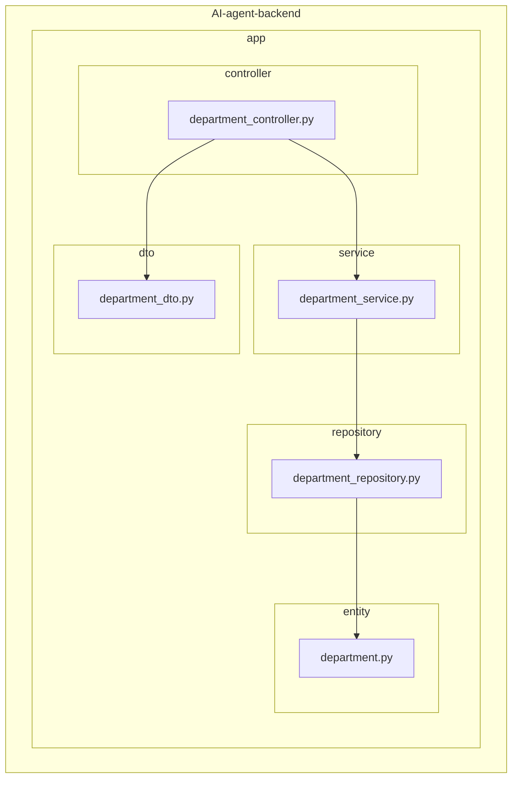
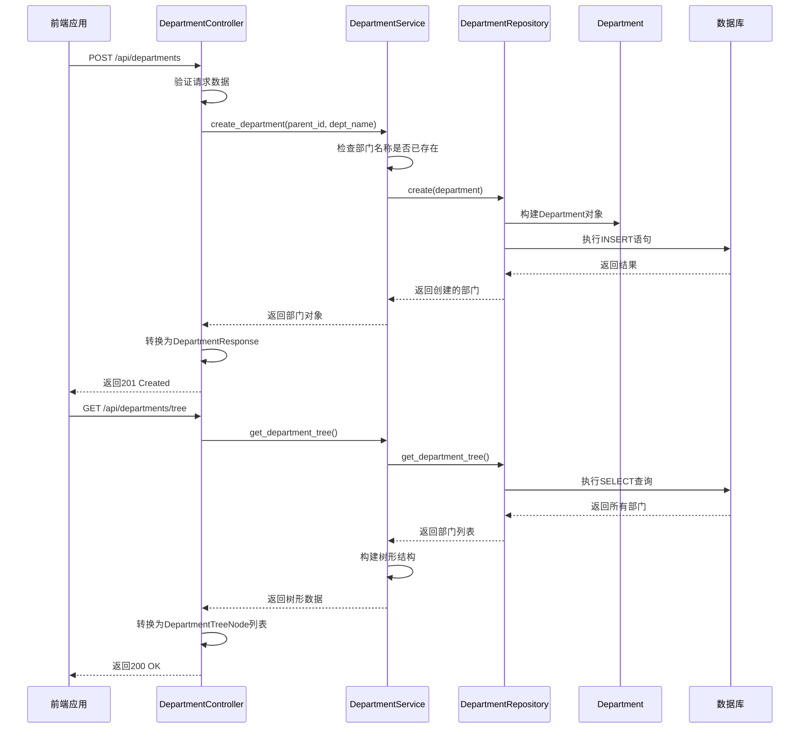
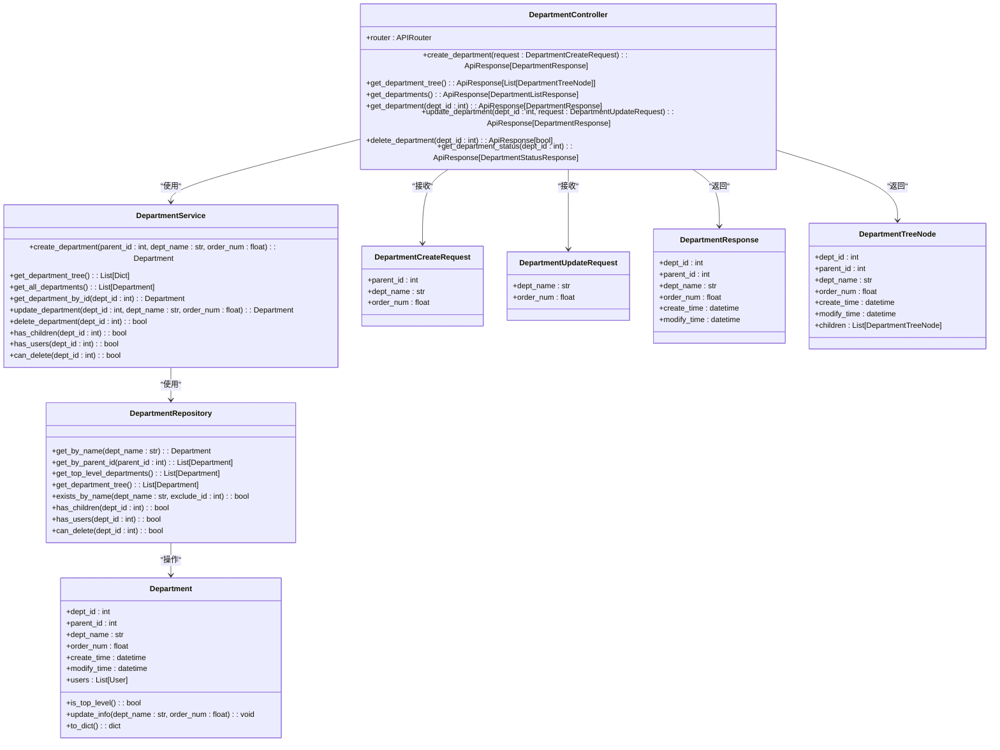
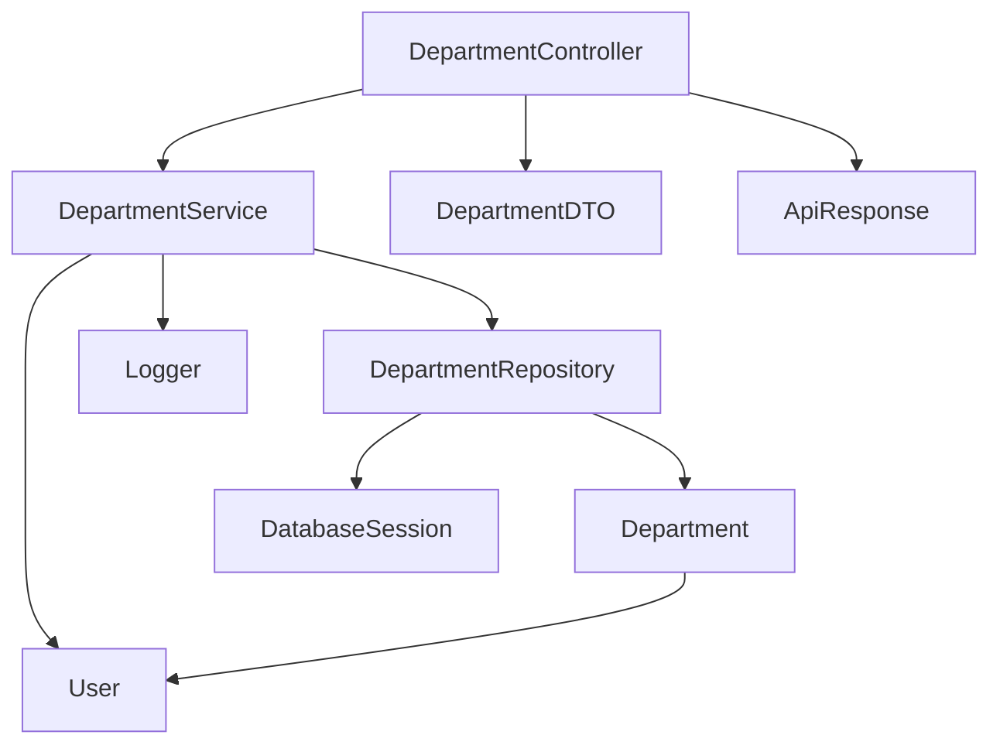

# 部门管理API

<cite>
**本文档引用的文件**  
- [department_controller.py](file://AI-agent-backend/app/controller/department_controller.py#L0-L325)
- [department_service.py](file://AI-agent-backend/app/service/department_service.py#L17-L253)
- [department_repository.py](file://AI-agent-backend/app/repository/department_repository.py#L0-L148)
- [department.py](file://AI-agent-backend/app/entity/department.py#L0-L102)
- [department_dto.py](file://AI-agent-backend/app/dto/department_dto.py#L0-L168)
</cite>

## 目录
1. [简介](#简介)
2. [项目结构](#项目结构)
3. [核心组件](#核心组件)
4. [架构概览](#架构概览)
5. [详细组件分析](#详细组件分析)
6. [依赖分析](#依赖分析)
7. [性能考虑](#性能考虑)
8. [故障排除指南](#故障排除指南)
9. [结论](#结论)

## 简介
本API参考文档详细说明了部门管理模块的功能，涵盖部门的创建、编辑、删除、层级查询等操作。文档基于后端代码库实现，提供完整的端点路径、请求参数、响应结构、权限控制及错误处理机制。系统采用RBAC（基于角色的访问控制）模型，确保只有HR或管理员等授权用户才能执行敏感操作。通过`parent_id`字段实现多级嵌套的树形组织架构，并支持分页查询与完整树形结构获取两种模式，满足不同前端展示需求。

## 项目结构
部门管理功能位于后端应用的`app`目录下，遵循典型的分层架构设计。控制器（Controller）处理HTTP请求，服务（Service）封装业务逻辑，数据访问层（Repository）负责数据库操作，实体（Entity）映射数据库表，DTO（Data Transfer Object）定义数据传输格式。

**图示来源**
- [department_controller.py](file://AI-agent-backend/app/controller/department_controller.py#L0-L325)
- [department_service.py](file://AI-agent-backend/app/service/department_service.py#L17-L253)
- [department_repository.py](file://AI-agent-backend/app/repository/department_repository.py#L0-L148)
- [department.py](file://AI-agent-backend/app/entity/department.py#L0-L102)
- [department_dto.py](file://AI-agent-backend/app/dto/department_dto.py#L0-L168)

**本节来源**
- [department_controller.py](file://AI-agent-backend/app/controller/department_controller.py#L0-L325)
- [department_service.py](file://AI-agent-backend/app/service/department_service.py#L17-L253)

## 核心组件
部门管理模块的核心组件包括`DepartmentController`、`DepartmentService`、`DepartmentRepository`和`Department`实体。`DepartmentController`暴露RESTful API端点，接收和响应HTTP请求。`DepartmentService`实现核心业务逻辑，如创建、更新、删除和查询部门，并进行业务规则验证。`DepartmentRepository`提供对`Department`实体的数据库访问方法。`Department`实体映射到数据库的`t_dept`表，定义了部门的字段和关联关系。

**本节来源**
- [department_controller.py](file://AI-agent-backend/app/controller/department_controller.py#L0-L325)
- [department_service.py](file://AI-agent-backend/app/service/department_service.py#L17-L253)
- [department_repository.py](file://AI-agent-backend/app/repository/department_repository.py#L0-L148)
- [department.py](file://AI-agent-backend/app/entity/department.py#L0-L102)

## 架构概览
该模块采用经典的MVC（Model-View-Controller）变体——分层架构。API请求首先由`DepartmentController`接收，然后调用`DepartmentService`执行业务逻辑。`DepartmentService`通过`DepartmentRepository`与数据库交互，操作`Department`实体。数据在传输过程中使用`DepartmentDTO`进行格式化，确保前后端数据结构清晰、一致。

**图示来源**
- [department_controller.py](file://AI-agent-backend/app/controller/department_controller.py#L0-L325)
- [department_service.py](file://AI-agent-backend/app/service/department_service.py#L17-L253)
- [department_repository.py](file://AI-agent-backend/app/repository/department_repository.py#L0-L148)
- [department.py](file://AI-agent-backend/app/entity/department.py#L0-L102)

## 详细组件分析

### 部门控制器分析
`DepartmentController`是部门管理API的入口，定义了所有HTTP端点。它使用FastAPI框架，通过`@router`装饰器声明路由。每个端点都指定了路径、HTTP方法、响应模型和简要说明。

#### 主要端点
- **`POST /api/departments`**: 创建新部门。请求体为`DepartmentCreateRequest`，包含`parent_id`、`dept_name`和可选的`order_num`。
- **`GET /api/departments/tree`**: 获取完整的部门树结构。返回一个嵌套的JSON数组，便于前端递归渲染树形控件。
- **`GET /api/departments`**: 获取所有部门的扁平列表。适用于需要简单列表展示的场景。
- **`GET /api/departments/{dept_id}`**: 根据ID获取单个部门的详细信息。
- **`PUT /api/departments/{dept_id}`**: 更新指定部门的信息。
- **`DELETE /api/departments/{dept_id}`**: 删除指定部门。
- **`GET /api/departments/{dept_id}/status`**: 获取部门的状态信息，包括是否有子部门、是否有用户、是否可删除。

控制器通过`Depends(get_db)`注入数据库会话，并实例化`DepartmentService`来处理业务逻辑。它还实现了统一的错误处理，将`ValueError`等业务异常转换为HTTP 400错误，其他异常转换为HTTP 500错误。

**图示来源**
- [department_controller.py](file://AI-agent-backend/app/controller/department_controller.py#L0-L325)
- [department_service.py](file://AI-agent-backend/app/service/department_service.py#L17-L253)
- [department_repository.py](file://AI-agent-backend/app/repository/department_repository.py#L0-L148)
- [department.py](file://AI-agent-backend/app/entity/department.py#L0-L102)
- [department_dto.py](file://AI-agent-backend/app/dto/department_dto.py#L0-L168)

**本节来源**
- [department_controller.py](file://AI-agent-backend/app/controller/department_controller.py#L0-L325)

### 部门服务分析
`DepartmentService`是业务逻辑的核心，确保所有操作都符合业务规则。

#### 关键业务逻辑
- **创建部门 (`create_department`)**: 在创建前，会调用`exists_by_name`检查部门名称是否已存在，防止重复。如果名称已存在，则抛出`ValueError`。
- **获取部门树 (`get_department_tree`)**: 从仓库获取所有部门后，服务层在内存中构建树形结构。它首先将所有部门放入一个字典，然后遍历字典，根据`parent_id`将子部门添加到父部门的`children`列表中。
- **更新部门 (`update_department`)**: 在更新名称时，会检查新名称是否与其他部门冲突（排除自身ID），确保名称的唯一性。
- **删除部门 (`delete_department`)**: 这是业务逻辑最复杂的部分。在删除前，会调用`can_delete`方法检查部门是否为空。该方法依赖于`has_children`和`has_users`两个检查。如果部门有子部门或关联用户，则抛出`ValueError`，阻止删除操作。

服务层还提供了`has_children`、`has_users`和`can_delete`等辅助方法，这些方法被`delete_department`和`get_department_status`端点所使用。

**本节来源**
- [department_service.py](file://AI-agent-backend/app/service/department_service.py#L17-L253)

### 部门数据访问层分析
`DepartmentRepository`继承自`BaseRepository`，提供了对`Department`实体的CRUD操作。它直接与数据库交互，执行SQL查询。

#### 关键数据访问方法
- **`get_department_tree()`**: 执行一个简单的`SELECT * FROM t_dept ORDER BY order_num`查询，获取所有部门。树形结构的构建由上层服务完成。
- **`exists_by_name()`**: 执行`SELECT`查询，检查是否存在同名部门。`exclude_id`参数用于在更新操作时排除当前部门自身。
- **`has_children()`**: 查询`PARENT_ID`等于指定`dept_id`的记录是否存在。
- **`has_users()`**: 通过`JOIN`查询或直接查询`User`表，检查是否存在`DEPT_ID`等于指定`dept_id`的用户。

**本节来源**
- [department_repository.py](file://AI-agent-backend/app/repository/department_repository.py#L0-L148)

### 部门实体与DTO分析
`Department`实体定义了`t_dept`表的映射，包含`dept_id`、`parent_id`、`dept_name`、`order_num`、`create_time`和`modify_time`等字段。`users`关系属性表明一个部门可以有多个用户。

`DepartmentDTO`定义了数据传输的契约：
- **`DepartmentCreateRequest`**: 定义了创建部门所需的输入参数。
- **`DepartmentUpdateRequest`**: 定义了更新部门所需的可选参数。
- **`DepartmentResponse`**: 定义了单个部门的输出格式。
- **`DepartmentTreeNode`**: 定义了树形节点的输出格式，其`children`字段为`DepartmentTreeNode`类型的列表，支持无限层级嵌套。

**本节来源**
- [department.py](file://AI-agent-backend/app/entity/department.py#L0-L102)
- [department_dto.py](file://AI-agent-backend/app/dto/department_dto.py#L0-L168)

## 依赖分析
部门管理模块依赖于多个内部和外部组件。

**图示来源**
- [department_controller.py](file://AI-agent-backend/app/controller/department_controller.py#L0-L325)
- [department_service.py](file://AI-agent-backend/app/service/department_service.py#L17-L253)
- [department_repository.py](file://AI-agent-backend/app/repository/department_repository.py#L0-L148)
- [department.py](file://AI-agent-backend/app/entity/department.py#L0-L102)
- [department_dto.py](file://AI-agent-backend/app/dto/department_dto.py#L0-L168)

**本节来源**
- [department_controller.py](file://AI-agent-backend/app/controller/department_controller.py#L0-L325)
- [department_service.py](file://AI-agent-backend/app/service/department_service.py#L17-L253)
- [department_repository.py](file://AI-agent-backend/app/repository/department_repository.py#L0-L148)
- [department.py](file://AI-agent-backend/app/entity/department.py#L0-L102)

## 性能考虑
- **树形查询**: `GET /api/departments/tree`端点会一次性加载所有部门到内存中构建树。对于部门数量庞大的系统，这可能导致内存消耗过高。建议在部门数量超过一定阈值时，改用分页或懒加载（按需加载子节点）的方式。
- **关联查询**: `has_users`方法需要查询`User`表。如果用户数量巨大，此查询可能较慢。可以考虑在`Department`表中增加一个`user_count`字段，并在用户变动时维护该计数，从而将查询转换为简单的字段判断。
- **缓存**: 对于不常变动的部门树，可以考虑使用Redis等缓存机制，将树形结构缓存一段时间，减少数据库查询压力。

## 故障排除指南
- **创建部门失败 (400 Bad Request)**: 错误信息为“部门名称 'XXX' 已存在”。解决方案：检查请求中的`dept_name`是否与现有部门重复。
- **更新部门失败 (400 Bad Request)**: 错误信息为“部门名称 'XXX' 已存在”。解决方案：确保更新的名称未被其他部门使用。
- **删除部门失败 (400 Bad Request)**: 错误信息为“部门仍有子部门，无法删除”或“部门仍有用户，无法删除”。解决方案：先删除或移动所有子部门和关联用户，再尝试删除。
- **获取部门失败 (404 Not Found)**: 错误信息为“部门不存在”。解决方案：检查URL中的`dept_id`是否正确。
- **服务器内部错误 (500 Internal Server Error)**: 表示服务器在处理请求时发生未预期的错误。应检查后端日志以获取详细错误信息。

## 结论
部门管理API提供了一套完整的组织架构管理功能。其设计清晰，分层合理，通过`parent_id`实现了灵活的树形结构。权限控制和数据验证确保了数据的完整性和安全性。前端在展示时，可根据需求选择使用`/api/departments`获取扁平列表进行简单展示，或使用`/api/departments/tree`获取完整树形结构进行复杂的组织架构图渲染。对于性能敏感的场景，建议对树形查询和关联查询进行优化。