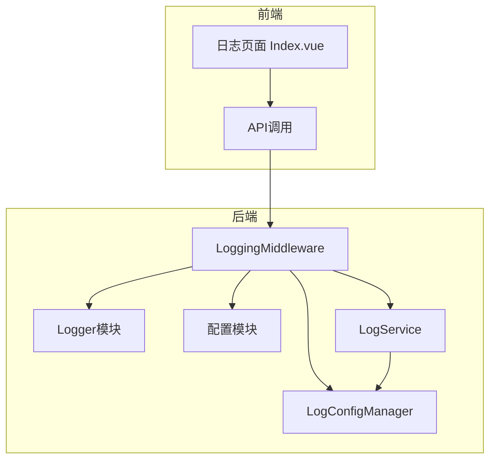
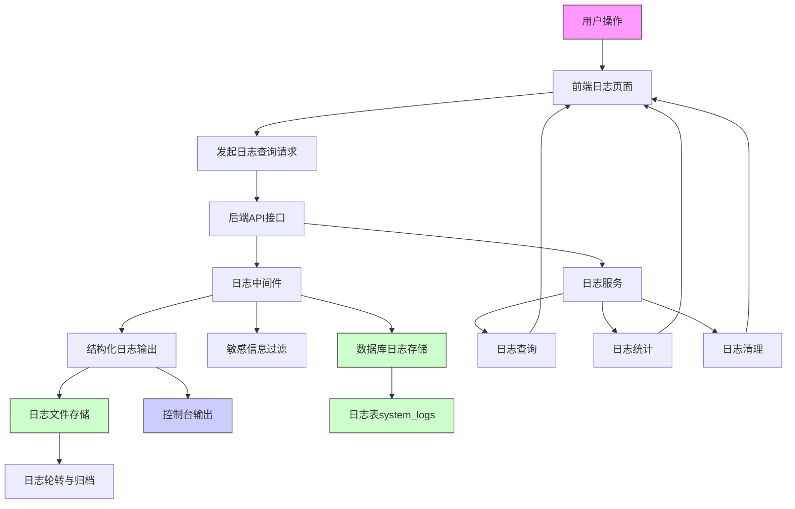
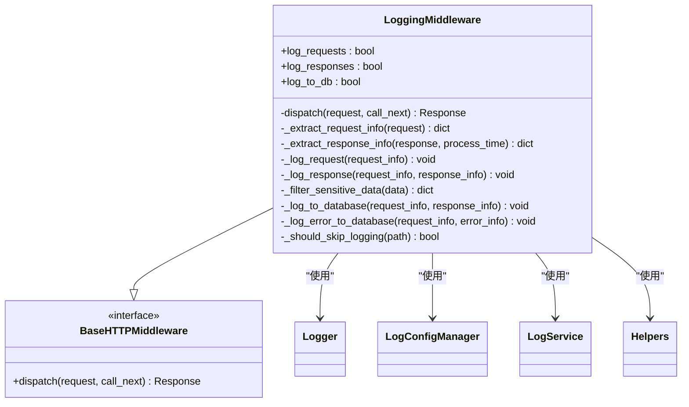
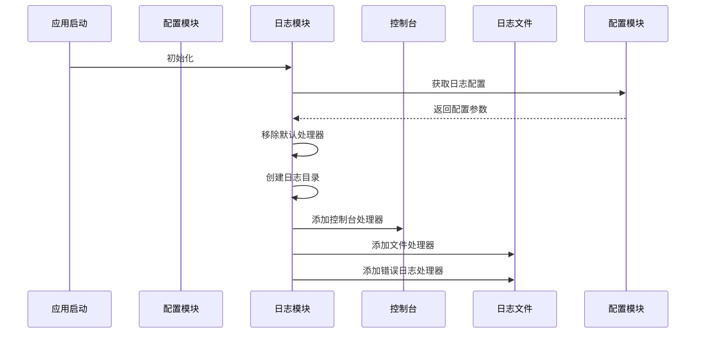
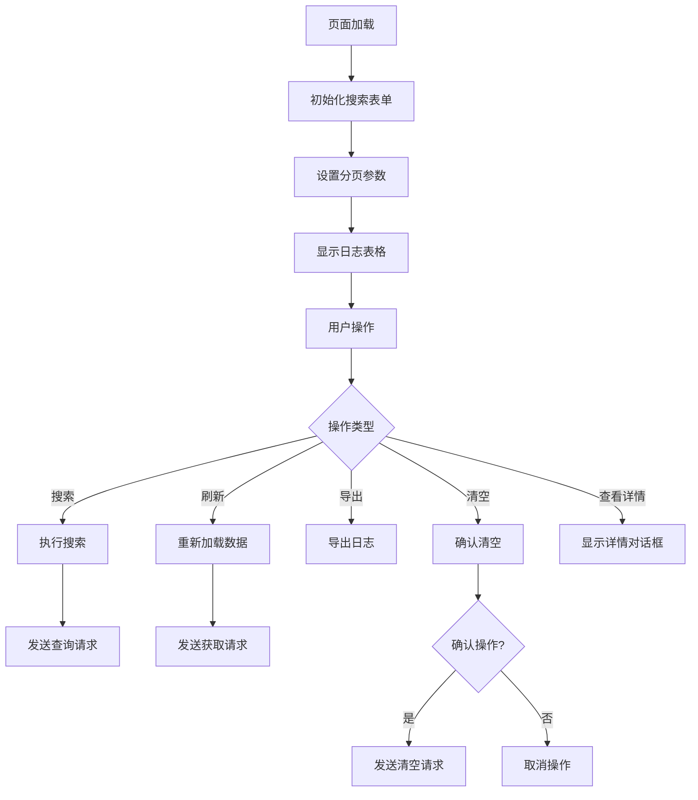
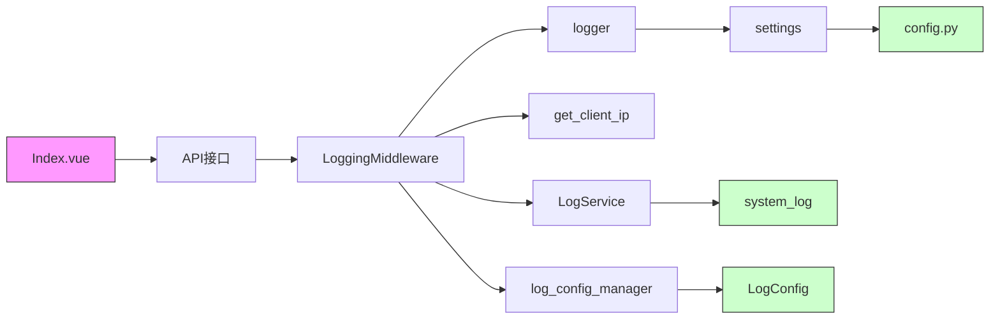

# 日志管理

<cite>
**本文档引用文件**  
- [logging.py](file://AI-agent-backend/app/middleware/logging.py) - *更新了日志中间件，支持双写和实时统计*
- [logger.py](file://AI-agent-backend/app/core/logger.py) - *日志模块保持不变*
- [config.py](file://AI-agent-backend/app/core/config.py) - *基础配置保持不变*
- [log_config.py](file://AI-agent-backend/app/core/log_config.py) - *新增日志配置管理器*
- [log_service.py](file://AI-agent-backend/app/service/log_service.py) - *新增日志服务类*
- [log_dto.py](file://AI-agent-backend/app/dto/log_dto.py) - *新增日志数据传输对象*
- [system_log.py](file://AI-agent-backend/app/entity/system_log.py) - *新增系统日志实体*
- [Index.vue](file://AI-agent-frontend/src/views/logs/Index.vue) - *前端日志页面保持不变*
</cite>

## 更新摘要
**变更内容**   
- 更新了日志中间件，支持文件和数据库双写
- 新增日志配置管理器，支持动态配置
- 新增日志服务类，提供日志查询、统计和清理功能
- 新增日志数据传输对象和系统日志实体
- 更新了架构概述和详细组件分析以反映最新设计
- 增加了新的依赖关系图

## 目录
1. [项目结构](#项目结构)
2. [核心组件](#核心组件)
3. [架构概述](#架构概述)
4. [详细组件分析](#详细组件分析)
5. [依赖分析](#依赖分析)
6. [性能考虑](#性能考虑)
7. [故障排除指南](#故障排除指南)

## 项目结构
项目采用前后端分离架构，日志功能涉及后端中间件、服务层与前端展示页面的协同工作。

**图示来源**  
- [Index.vue](file://AI-agent-frontend/src/views/logs/Index.vue)
- [logging.py](file://AI-agent-backend/app/middleware/logging.py)
- [logger.py](file://AI-agent-backend/app/core/logger.py)
- [config.py](file://AI-agent-backend/app/core/config.py)
- [log_service.py](file://AI-agent-backend/app/service/log_service.py)
- [log_config.py](file://AI-agent-backend/app/core/log_config.py)

**本节来源**  
- [Index.vue](file://AI-agent-frontend/src/views/logs/Index.vue)
- [logging.py](file://AI-agent-backend/app/middleware/logging.py)

## 核心组件
系统日志管理由后端日志中间件、自定义日志模块、日志服务、日志配置管理器和前端日志展示页面五部分构成。后端通过中间件自动记录请求/响应日志，使用loguru库输出结构化日志到文件和控制台，同时支持记录到数据库。前端通过日志页面提供查询、筛选、统计和展示功能。

**本节来源**  
- [logging.py](file://AI-agent-backend/app/middleware/logging.py#L1-L30)
- [logger.py](file://AI-agent-backend/app/core/logger.py#L1-L20)
- [log_service.py](file://AI-agent-backend/app/service/log_service.py#L1-L20)
- [log_config.py](file://AI-agent-backend/app/core/log_config.py#L1-L20)
- [Index.vue](file://AI-agent-frontend/src/views/logs/Index.vue#L1-L50)

## 架构概述
系统采用分层日志架构，从前端展示到后端采集形成完整闭环。

**图示来源**  
- [logging.py](file://AI-agent-backend/app/middleware/logging.py#L1-L50)
- [logger.py](file://AI-agent-backend/app/core/logger.py#L1-L50)
- [log_service.py](file://AI-agent-backend/app/service/log_service.py#L1-L50)
- [log_config.py](file://AI-agent-backend/app/core/log_config.py#L1-L50)
- [system_log.py](file://AI-agent-backend/app/entity/system_log.py#L1-L50)
- [Index.vue](file://AI-agent-frontend/src/views/logs/Index.vue#L1-L100)

## 详细组件分析

### 后端日志中间件分析
日志中间件负责采集HTTP请求和响应的详细信息，是日志系统的核心组件。

**图示来源**  
- [logging.py](file://AI-agent-backend/app/middleware/logging.py#L30-L275)

**本节来源**  
- [logging.py](file://AI-agent-backend/app/middleware/logging.py#L30-L275)

### 后端日志模块分析
自定义日志模块基于loguru库构建，提供结构化日志输出功能。

**图示来源**  
- [logger.py](file://AI-agent-backend/app/core/logger.py#L50-L98)
- [config.py](file://AI-agent-backend/app/core/config.py#L100-L150)

**本节来源**  
- [logger.py](file://AI-agent-backend/app/core/logger.py#L50-L98)

### 前端日志页面分析
前端日志页面提供用户友好的日志查询和展示界面。

**图示来源**  
- [Index.vue](file://AI-agent-frontend/src/views/logs/Index.vue#L1-L337)

**本节来源**  
- [Index.vue](file://AI-agent-frontend/src/views/logs/Index.vue#L1-L337)

## 依赖分析
日志系统各组件间存在明确的依赖关系。

**图示来源**  
- [Index.vue](file://AI-agent-frontend/src/views/logs/Index.vue)
- [logging.py](file://AI-agent-backend/app/middleware/logging.py)
- [logger.py](file://AI-agent-backend/app/core/logger.py)
- [config.py](file://AI-agent-backend/app/core/config.py)
- [log_service.py](file://AI-agent-backend/app/service/log_service.py)
- [log_config.py](file://AI-agent-backend/app/core/log_config.py)
- [system_log.py](file://AI-agent-backend/app/entity/system_log.py)

**本节来源**  
- [logging.py](file://AI-agent-backend/app/middleware/logging.py#L1-L50)
- [logger.py](file://AI-agent-backend/app/core/logger.py#L1-L50)
- [config.py](file://AI-agent-backend/app/core/config.py#L1-L50)
- [log_service.py](file://AI-agent-backend/app/service/log_service.py#L1-L50)
- [log_config.py](file://AI-agent-backend/app/core/log_config.py#L1-L50)

## 性能考虑
日志系统在设计时考虑了性能影响，通过多种机制减少性能开销。

- **请求体大小限制**：仅记录1KB以内的请求体，避免大对象影响性能
- **异步处理**：日志记录采用异步方式，不阻塞主请求流程
- **条件记录**：可配置是否记录请求和响应日志
- **格式优化**：使用高效的日志格式化方法
- **批量写入**：日志文件采用批量写入策略
- **智能存储策略**：根据日志级别决定存储位置（文件、数据库或两者）

## 故障排除指南

### 常见问题及解决方案

**问题1：日志文件未生成**
- 检查`logs`目录是否存在且有写入权限
- 确认`LOG_FILE`配置路径正确
- 查看应用启动日志是否有错误信息

**问题2：敏感信息未过滤**
- 确认`_filter_sensitive_data`方法被正确调用
- 检查敏感字段列表是否完整
- 验证请求头和请求体的过滤逻辑

**问题3：日志级别不生效**
- 检查`LOG_LEVEL`配置值是否正确
- 确认`settings`实例已正确加载
- 验证日志处理器的级别设置

**问题4：前端无法显示日志**
- 检查后端API接口是否正常
- 验证网络请求是否成功
- 确认响应数据格式符合前端预期

### 日志排查技巧
1. **使用时间范围筛选**：缩小排查范围，快速定位问题时段
2. **按级别过滤**：优先查看ERROR和WARNING级别日志
3. **结合IP地址**：追踪特定客户端的请求行为
4. **查看完整详情**：利用详情对话框查看完整的请求/响应信息
5. **关注处理时间**：识别响应缓慢的接口
6. **利用统计功能**：通过日志统计快速了解系统运行状况

**本节来源**  
- [logging.py](file://AI-agent-backend/app/middleware/logging.py#L200-L241)
- [logger.py](file://AI-agent-backend/app/core/logger.py#L50-L98)
- [Index.vue](file://AI-agent-frontend/src/views/logs/Index.vue#L200-L300)
- [config.py](file://AI-agent-backend/app/core/config.py#L80-L100)
- [log_service.py](file://AI-agent-backend/app/service/log_service.py#L100-L200)