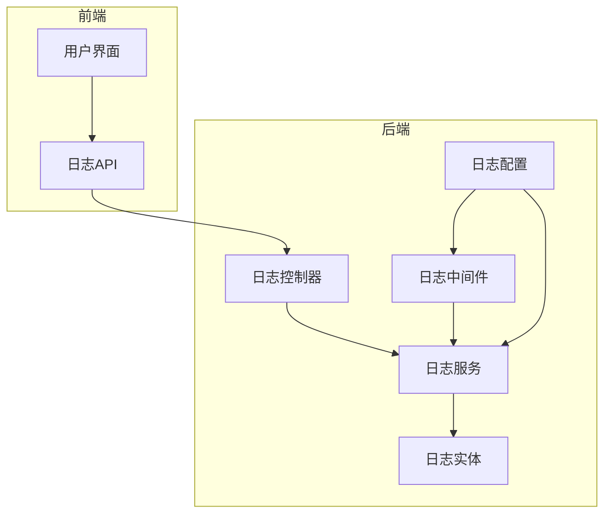
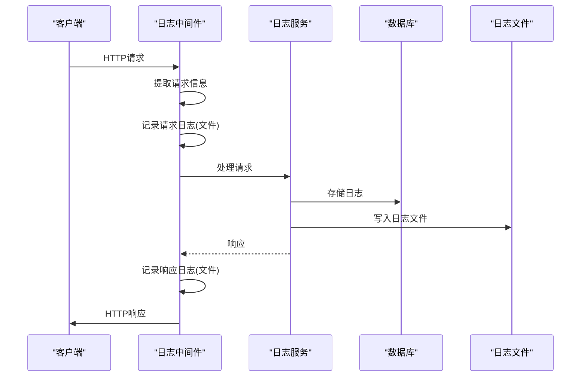
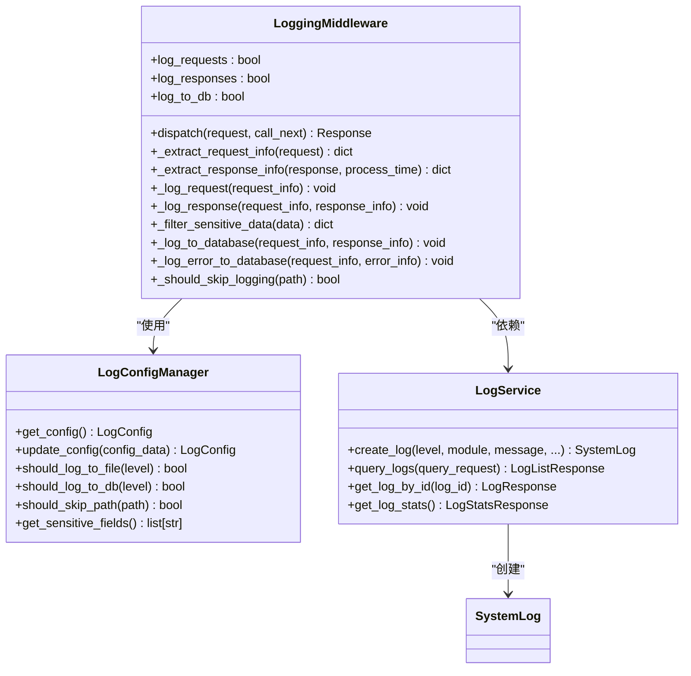
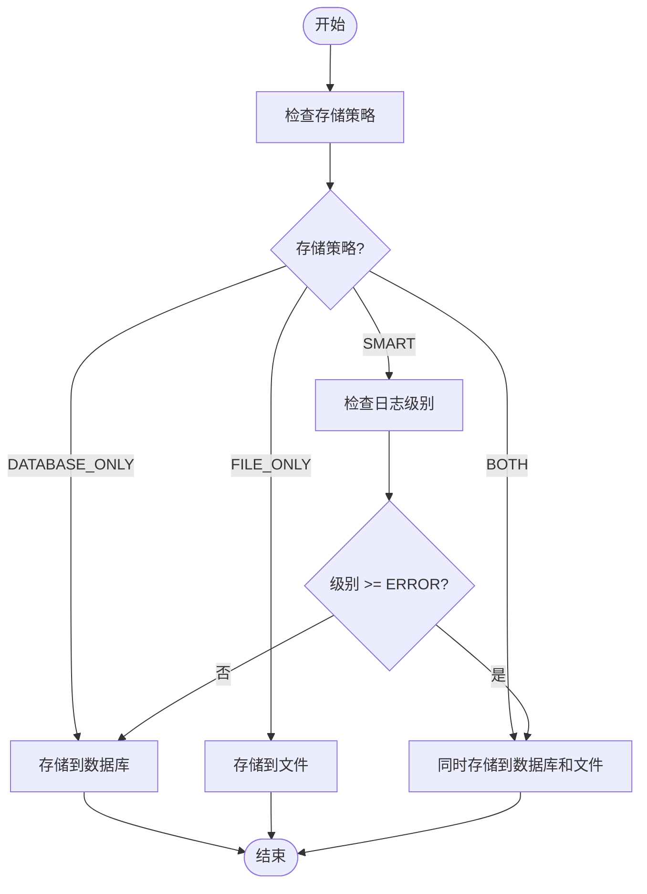
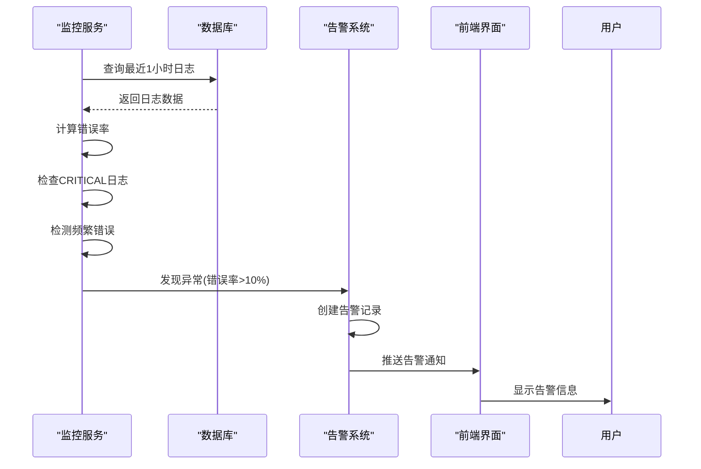
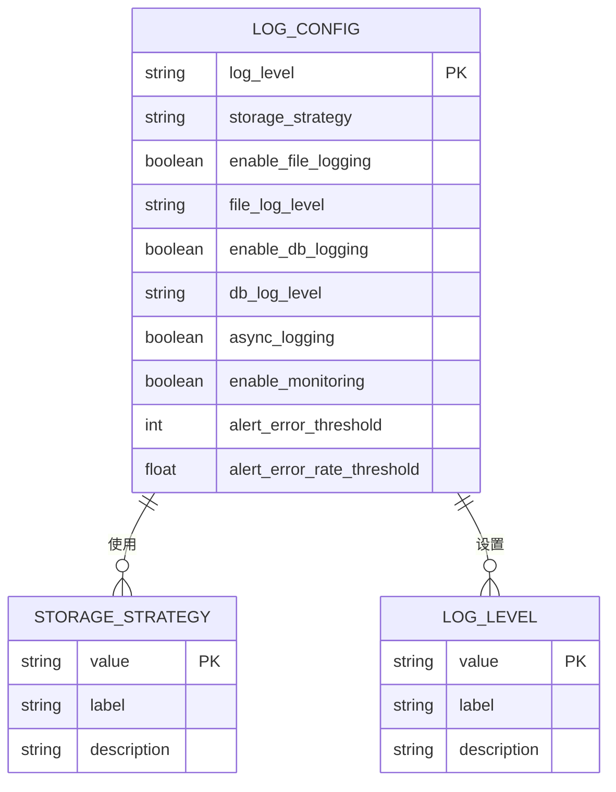
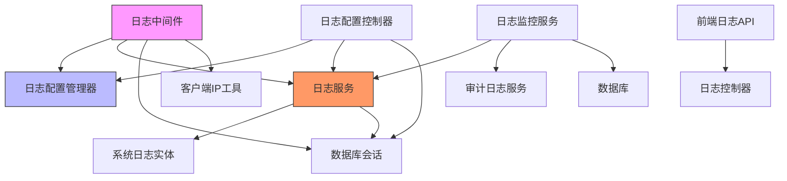

# 日志管理功能

<cite>
**本文档引用的文件**
- [logging.py](file://AI-agent-backend/app/middleware/logging.py)
- [log_config.py](file://AI-agent-backend/app/core/log_config.py)
- [log_service.py](file://AI-agent-backend/app/service/log_service.py)
- [log_config_controller.py](file://AI-agent-backend/app/controller/log_config_controller.py)
- [log_monitor_service.py](file://AI-agent-backend/app/service/log_monitor_service.py)
- [logs.ts](file://AI-agent-frontend/src/api/modules/logs.ts)
- [log-monitor.ts](file://AI-agent-frontend/src/api/modules/log-monitor.ts)
- [system_log.py](file://AI-agent-backend/app/entity/system_log.py)
</cite>

## 目录
1. [简介](#简介)
2. [项目结构](#项目结构)
3. [核心组件](#核心组件)
4. [架构概述](#架构概述)
5. [详细组件分析](#详细组件分析)
6. [依赖分析](#依赖分析)
7. [性能考虑](#性能考虑)
8. [故障排除指南](#故障排除指南)
9. [结论](#结论)

## 简介
日志管理功能是AI代理测试平台的核心监控系统，提供全面的日志记录、存储、分析和告警能力。该系统通过中间件自动捕获HTTP请求和响应，支持灵活的存储策略，并提供实时统计和智能告警机制，帮助开发和运维团队监控系统健康状况。

## 项目结构
日志管理功能分布在后端和前端两个主要部分。后端实现日志记录、存储和分析逻辑，前端提供可视化界面和用户交互。

**图示来源**
- [logging.py](file://AI-agent-backend/app/middleware/logging.py#L1-L406)
- [log_service.py](file://AI-agent-backend/app/service/log_service.py#L1-L54)
- [system_log.py](file://AI-agent-backend/app/entity/system_log.py#L1-L117)
- [log_config_controller.py](file://AI-agent-backend/app/controller/log_config_controller.py#L1-L287)
- [log-config.py](file://AI-agent-backend/app/core/log_config.py#L1-L249)
- [logs.ts](file://AI-agent-frontend/src/api/modules/logs.ts#L1-L78)
- [log-monitor.ts](file://AI-agent-frontend/src/api/modules/log-monitor.ts#L1-L144)

**本节来源**
- [AI-agent-backend/app/middleware/logging.py](file://AI-agent-backend/app/middleware/logging.py)
- [AI-agent-backend/app/service/log_service.py](file://AI-agent-backend/app/service/log_service.py)
- [AI-agent-backend/app/entity/system_log.py](file://AI-agent-backend/app/entity/system_log.py)
- [AI-agent-backend/app/controller/log_config_controller.py](file://AI-agent-backend/app/controller/log_config_controller.py)
- [AI-agent-backend/app/core/log_config.py](file://AI-agent-backend/app/core/log_config.py)
- [AI-agent-frontend/src/api/modules/logs.ts](file://AI-agent-frontend/src/api/modules/logs.ts)
- [AI-agent-frontend/src/api/modules/log-monitor.ts](file://AI-agent-frontend/src/api/modules/log-monitor.ts)

## 核心组件
日志管理功能的核心组件包括日志中间件、双写存储机制、实时统计服务、告警机制和配置管理系统。这些组件协同工作，确保日志数据的完整性、可用性和可分析性。

**本节来源**
- [logging.py](file://AI-agent-backend/app/middleware/logging.py#L1-L406)
- [log_service.py](file://AI-agent-backend/app/service/log_service.py#L1-L54)
- [log_config.py](file://AI-agent-backend/app/core/log_config.py#L1-L249)

## 架构概述
日志管理系统的架构采用分层设计，从请求捕获到数据存储再到分析展示，形成完整的日志处理流水线。

**图示来源**
- [logging.py](file://AI-agent-backend/app/middleware/logging.py#L1-L406)
- [log_service.py](file://AI-agent-backend/app/service/log_service.py#L1-L54)
- [system_log.py](file://AI-agent-backend/app/entity/system_log.py#L1-L117)

## 详细组件分析

### 日志中间件分析
日志中间件是日志管理系统的入口点，负责捕获所有HTTP请求和响应的详细信息。

**图示来源**
- [logging.py](file://AI-agent-backend/app/middleware/logging.py#L1-L406)
- [log_config.py](file://AI-agent-backend/app/core/log_config.py#L1-L249)
- [log_service.py](file://AI-agent-backend/app/service/log_service.py#L1-L54)
- [system_log.py](file://AI-agent-backend/app/entity/system_log.py#L1-L117)

**本节来源**
- [logging.py](file://AI-agent-backend/app/middleware/logging.py#L1-L406)

### 双重存储机制分析
双重存储机制确保日志数据既可持久化存储于数据库中，又可写入文件系统，提供数据冗余和灵活性。

**图示来源**
- [logging.py](file://AI-agent-backend/app/middleware/logging.py#L1-L406)
- [log_config.py](file://AI-agent-backend/app/core/log_config.py#L1-L249)

**本节来源**
- [log_config.py](file://AI-agent-backend/app/core/log_config.py#L1-L249)
- [logging.py](file://AI-agent-backend/app/middleware/logging.py#L1-L406)

### 实时统计与告警分析
实时统计与告警系统持续监控日志数据流，检测异常模式并触发相应告警。

**图示来源**
- [log_monitor_service.py](file://AI-agent-backend/app/service/log_monitor_service.py#L1-L397)
- [log-service.py](file://AI-agent-backend/app/service/log_service.py#L1-L54)
- [log-monitor.ts](file://AI-agent-frontend/src/api/modules/log-monitor.ts#L1-L144)

**本节来源**
- [log_monitor_service.py](file://AI-agent-backend/app/service/log_monitor_service.py#L1-L397)

### 配置管理分析
配置管理系统提供动态调整日志行为的能力，无需重启应用即可修改日志设置。

**图示来源**
- [log_config_controller.py](file://AI-agent-backend/app/controller/log_config_controller.py#L1-L287)
- [log_config.py](file://AI-agent-backend/app/core/log_config.py#L1-L249)

**本节来源**
- [log_config_controller.py](file://AI-agent-backend/app/controller/log_config_controller.py#L1-L287)
- [log_config.py](file://AI-agent-backend/app/core/log_config.py#L1-L249)

## 依赖分析
日志管理功能依赖于多个核心组件和服务，形成复杂的依赖网络。

**图示来源**
- [logging.py](file://AI-agent-backend/app/middleware/logging.py#L1-L406)
- [log_config.py](file://AI-agent-backend/app/core/log_config.py#L1-L249)
- [log_service.py](file://AI-agent-backend/app/service/log_service.py#L1-L54)
- [log_monitor_service.py](file://AI-agent-backend/app/service/log_monitor_service.py#L1-L397)
- [log_config_controller.py](file://AI-agent-backend/app/controller/log_config_controller.py#L1-L287)
- [logs.ts](file://AI-agent-frontend/src/api/modules/logs.ts#L1-L78)

**本节来源**
- [logging.py](file://AI-agent-backend/app/middleware/logging.py#L1-L406)
- [log_config.py](file://AI-agent-backend/app/core/log_config.py#L1-L249)
- [log_service.py](file://AI-agent-backend/app/service/log_service.py#L1-L54)
- [log_monitor_service.py](file://AI-agent-backend/app/service/log_monitor_service.py#L1-L397)
- [log_config_controller.py](file://AI-agent-backend/app/controller/log_config_controller.py#L1-L287)

## 性能考虑
日志管理功能在设计时充分考虑了性能影响，采用异步日志记录、智能存储策略和批量处理等优化技术，确保在高负载下仍能保持系统稳定性。

## 故障排除指南
当遇到日志管理功能问题时，可参考以下常见问题及解决方案：

**本节来源**
- [logging.py](file://AI-agent-backend/app/middleware/logging.py#L1-L406)
- [log_service.py](file://AI-agent-backend/app/service/log_service.py#L1-L54)
- [log_config.py](file://AI-agent-backend/app/core/log_config.py#L1-L249)

## 结论
日志管理功能为AI代理测试平台提供了强大而灵活的日志处理能力。通过中间件自动捕获、双重存储保障、实时监控和智能告警，系统能够有效支持开发调试、运维监控和安全审计等多种场景需求。