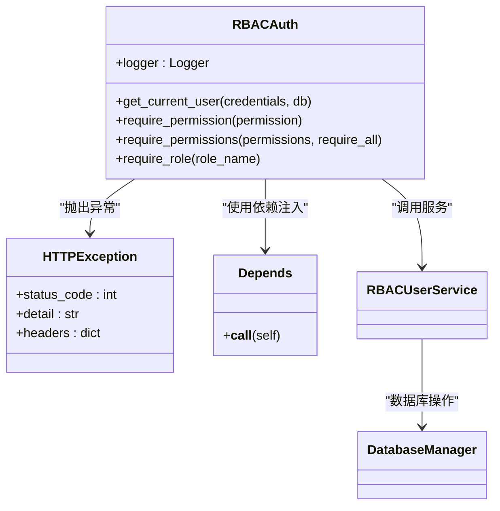
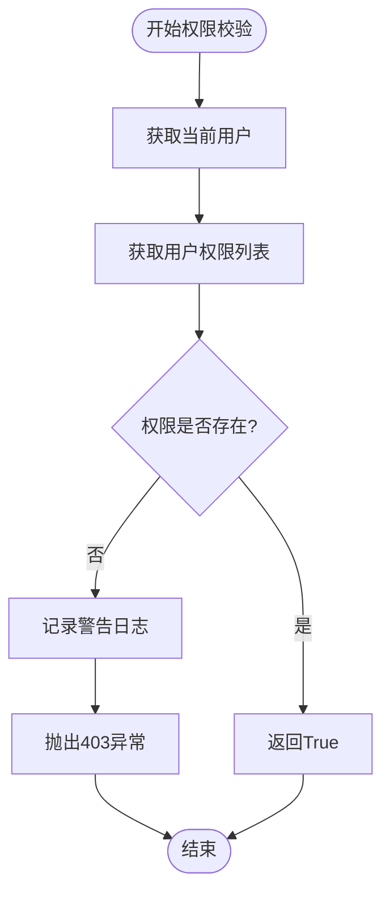
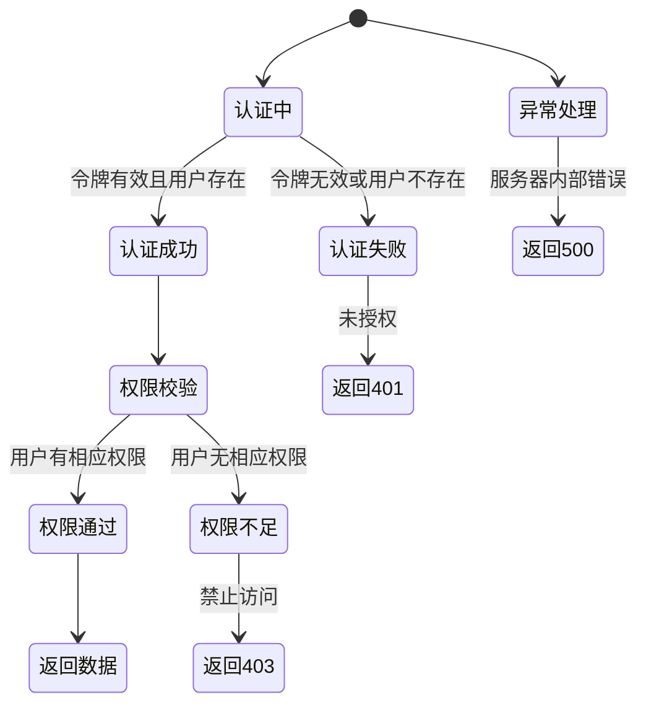

# 权限验证流程

<cite>
**本文档引用的文件**
- [auth.py](file://AI-agent-backend\app\middleware\auth.py) - *重构了用户认证流程，支持refresh_token和审计日志*
- [token_blacklist.py](file://AI-agent-backend\app\core\token_blacklist.py) - *新增令牌黑名单服务*
- [user_controller.py](file://AI-agent-backend\app\controller\user_controller.py) - *新增refresh-token端点*
- [security.py](file://AI-agent-backend\app\core\security.py) - *更新了令牌生成逻辑*
- [user_dto.py](file://AI-agent-backend\app\dto\user_dto.py) - *更新了登录响应DTO*
- [RBAC_GUIDE.md](file://AI-agent-backend\docs\RBAC_GUIDE.md)
</cite>

## 更新摘要
**变更内容**
- 更新了JWT令牌生成与权限写入部分，增加了refresh_token的处理
- 新增了令牌黑名单机制和无感刷新功能
- 更新了RBAC权限验证中间件分析，增加了黑名单检查和审计日志功能
- 更新了异常处理机制，增加了令牌失效的处理
- 更新了常见错误排查清单，增加了refresh_token相关问题

## 目录
1. [权限验证流程概述](#权限验证流程概述)
2. [JWT令牌生成与权限写入](#jwt令牌生成与权限写入)
3. [RBAC权限验证中间件分析](#rbac权限验证中间件分析)
4. [权限校验逻辑实现细节](#权限校验逻辑实现细节)
5. [异常处理机制](#异常处理机制)
6. [日志定位与调试方法](#日志定位与调试方法)
7. [常见错误排查清单](#常见错误排查清单)

## 权限验证流程概述

本系统采用基于角色的访问控制（RBAC）模型，通过JWT令牌实现无状态的权限验证。整个流程从用户登录开始，系统生成包含用户权限信息的JWT令牌，后续每次请求都通过中间件进行权限校验。

权限验证流程主要涉及以下几个核心组件：
- **JWT令牌管理**：负责令牌的生成、验证和刷新
- **RBAC权限验证中间件**：在每次请求时执行权限校验
- **用户服务**：提供用户信息和权限查询功能
- **菜单服务**：管理菜单和权限标识的映射关系

该流程确保了系统的安全性，只有拥有相应权限的用户才能访问特定的API接口。

**Section sources**
- [auth.py](file://AI-agent-backend\app\middleware\auth.py#L1-L50)
- [security.py](file://AI-agent-backend\app\core\security.py#L1-L50)

## JWT令牌生成与权限写入

### 令牌生成流程

系统使用`security.py`文件中的`create_token_pair`函数生成访问令牌和刷新令牌。当用户成功登录后，系统会创建一对令牌，其中访问令牌包含用户的权限信息。

```python
def create_token_pair(user_id: int, additional_data: Optional[Dict[str, Any]] = None) -> Dict[str, str]:
    """
    创建令牌对（访问令牌和刷新令牌）
    
    Args:
        user_id: 用户ID
        additional_data: 额外的数据
        
    Returns:
        包含访问令牌和刷新令牌的字典
    """
    token_data = {"sub": user_id}
    
    if additional_data:
        token_data.update(additional_data)
    
    access_token = create_access_token(token_data)
    refresh_token = create_refresh_token({"sub": user_id})  # 刷新令牌只包含用户ID
    
    return {
        "access_token": access_token,
        "refresh_token": refresh_token,
        "token_type": "bearer"
    }
```

### 权限信息写入

权限信息在登录成功时通过`LoginResponse` DTO返回给前端。`user_dto.py`文件定义了登录响应的数据结构，现在包含了`refresh_token`字段：

```python
class LoginResponse(BaseModel):
    """
    登录响应DTO
    """
    access_token: str = Field(..., description="访问令牌")
    token_type: str = Field(default="bearer", description="令牌类型")
    refresh_token: Optional[str] = Field(None, description="刷新令牌")
    user_info: UserResponse = Field(..., description="用户信息")
    permissions: List[str] = Field(..., description="用户权限列表")
```

前端在收到登录响应后，会将令牌对存储在本地。当访问令牌即将过期时，前端可以使用刷新令牌获取新的访问令牌，实现无感刷新。

### 令牌刷新机制

系统新增了`/refresh-token`端点，用于使用刷新令牌获取新的访问令牌。`user_controller.py`文件中实现了该功能：

```python
@router.post("/refresh-token", summary="刷新访问令牌")
async def refresh_token_endpoint(
    request: dict,
    db: Session = Depends(get_db)
):
    """
    使用refresh_token换取新的access_token。
    请求体：{ "refresh_token": "..." }
    """
    try:
        refresh_token = request.get("refresh_token")
        if not refresh_token:
            raise HTTPException(status_code=status.HTTP_400_BAD_REQUEST, detail="缺少refresh_token")

        # 黑名单检查
        if is_blacklisted(refresh_token):
            raise HTTPException(status_code=status.HTTP_401_UNAUTHORIZED, detail="刷新令牌已失效")

        # 验证并提取用户
        payload = verify_token(refresh_token, token_type="refresh")
        if not payload:
            raise HTTPException(status_code=status.HTTP_401_UNAUTHORIZED, detail="刷新令牌无效或已过期")
        user_id = payload.get("sub")
        if not user_id:
            raise HTTPException(status_code=status.HTTP_401_UNAUTHORIZED, detail="刷新令牌无效")

        # 作废旧refresh_token
        add_to_blacklist(refresh_token)

        # 颁发新的访问令牌和刷新令牌
        new_access = create_access_token({"sub": user_id})
        new_refresh = create_refresh_token({"sub": user_id})

        return Success(code=200, msg="令牌刷新成功", data={
            "access_token": new_access,
            "token_type": "bearer",
            "refresh_token": new_refresh
        })
    except HTTPException:
        raise
    except Exception as e:
        logger.error(f"Unexpected error during token refresh: {str(e)}")
        raise HTTPException(status_code=status.HTTP_500_INTERNAL_SERVER_ERROR, detail="刷新令牌失败")
```

**Diagram sources**
- [security.py](file://AI-agent-backend\app\core\security.py#L184-L199)
- [user_dto.py](file://AI-agent-backend\app\dto\user_dto.py#L300-L320)
- [user_controller.py](file://AI-agent-backend\app\controller\user_controller.py#L200-L250)

**Section sources**
- [security.py](file://AI-agent-backend\app\core\security.py#L184-L199)
- [user_dto.py](file://AI-agent-backend\app\dto\user_dto.py#L300-L320)
- [user_controller.py](file://AI-agent-backend\app\controller\user_controller.py#L200-L250)

## RBAC权限验证中间件分析

### 中间件核心类

`auth.py`文件中的`RBACAuth`类是权限验证的核心，它提供了用户认证和权限校验的功能。该类通过依赖注入的方式与FastAPI框架集成。

```python
class RBACAuth:
    """
    RBAC权限验证类
    提供用户认证和权限验证功能
    """

    def __init__(self):
        self.logger = get_logger(self.__class__.__name__)
```

### 用户认证流程

`get_current_user`方法负责用户认证，它会验证JWT令牌的有效性，并从数据库中获取用户信息。现在增加了对令牌黑名单的检查：

```python
async def get_current_user(
    self,
    credentials: HTTPAuthorizationCredentials = Depends(security),
    db: Session = Depends(get_db)
):
    """
    获取当前用户
    
    Args:
        credentials: HTTP认证凭据
        db: 数据库会话
        
    Returns:
        当前用户对象
        
    Raises:
        HTTPException: 认证失败
    """
    try:
        # 检查黑名单
        if is_blacklisted(credentials.credentials):
            raise HTTPException(
                status_code=status.HTTP_401_UNAUTHORIZED,
                detail="token已失效",
                headers={"WWW-Authenticate": "Bearer"},
            )

        # 验证令牌
        payload = verify_token(credentials.credentials)
        if not payload:
            raise HTTPException(
                status_code=status.HTTP_401_UNAUTHORIZED,
                detail="无效的token",
                headers={"WWW-Authenticate": "Bearer"},
            )
        
        # 获取用户ID
        user_id = payload.get("sub")
        if not user_id:
            raise HTTPException(
                status_code=status.HTTP_401_UNAUTHORIZED,
                detail="令牌中缺少用户信息",
                headers={"WWW-Authenticate": "Bearer"},
            )
        
        # 获取用户信息
        user_service = RBACUserService(db)
        user = user_service.get_user_by_id(int(user_id))
        
        if not user:
            raise HTTPException(
                status_code=status.HTTP_401_UNAUTHORIZED,
                detail="用户不存在",
                headers={"WWW-Authenticate": "Bearer"},
            )
        
        if not user.is_active():
            raise HTTPException(
                status_code=status.HTTP_401_UNAUTHORIZED,
                detail="用户已被锁定",
                headers={"WWW-Authenticate": "Bearer"},
            )
        
        self.logger.debug(f"User authenticated: {user.USERNAME}")
        return user
        
    except HTTPException:
        raise
    except Exception as e:
        self.logger.error(f"Authentication error: {str(e)}")
        raise HTTPException(
            status_code=status.HTTP_401_UNAUTHORIZED,
            detail="认证失败",
            headers={"WWW-Authenticate": "Bearer"},
        )
```

### 权限验证装饰器

RBACAuth类提供了多个装饰器方法，用于在API路由上声明权限要求：

- `require_permission`: 验证单个权限
- `require_permissions`: 验证多个权限（可选择是否需要全部权限）
- `require_role`: 验证用户角色



**Diagram sources**
- [auth.py](file://AI-agent-backend\app\middleware\auth.py#L25-L305)
- [rbac_user_service.py](file://AI-agent-backend\app\service\rbac_user_service.py#L25-L348)

**Section sources**
- [auth.py](file://AI-agent-backend\app\middleware\auth.py#L25-L305)

## 权限校验逻辑实现细节

### 权限获取流程

权限校验的核心逻辑在`rbac_user_service.py`和`menu_service.py`文件中实现。当需要验证用户权限时，系统会执行以下步骤：

1. 通过JWT令牌获取用户ID
2. 查询用户关联的角色
3. 根据角色获取对应的菜单权限
4. 提取权限标识列表

```python
def get_user_permissions(self, user_id: int) -> List[str]:
    """
    获取用户的权限标识列表
    
    Args:
        user_id: 用户ID
        
    Returns:
        权限标识列表
    """
    cache_key = f"user_permissions_{user_id}"
    cached_permissions = cache_client.get(cache_key)
    if cached_permissions is not None:
        logger.debug(f"Returning cached permissions for user {user_id}")
        return cached_permissions

    from app.repository.user_role_repository import UserRoleRepository

    # 获取用户的所有角色
    user_role_repository = UserRoleRepository(self.db)
    roles = user_role_repository.get_roles_by_user_id(user_id)

    # 获取所有角色的权限
    all_permissions = []
    for role in roles:
        permissions = self.role_menu_repository.get_permissions_by_role_id(role.ROLE_ID)
        all_permissions.extend(permissions)

    # 去重
    unique_permissions = list(set(all_permissions))

    # 存入缓存
    cache_client.set(cache_key, unique_permissions, ttl=3600)  # 缓存1小时
    logger.debug(f"Cached new permissions for user {user_id}")

    return unique_permissions
```

### 权限匹配规则

系统使用精确匹配的方式进行权限校验，不支持通配符或正则表达式。权限标识通常是`资源:操作`的格式，如`user:view`、`user:add`等。

```python
def has_permission(self, user_id: int, permission: str) -> bool:
    """
    检查用户是否有指定权限
    
    Args:
        user_id: 用户ID
        permission: 权限标识
        
    Returns:
        是否有权限
    """
    user_permissions = self.get_user_permissions(user_id)
    return permission in user_permissions
```

### 大小写敏感性

权限标识是大小写敏感的。系统约定使用小写字母和冒号的组合，如`user:view`，而不是`User:View`或`USER:VIEW`。



**Diagram sources**
- [menu_service.py](file://AI-agent-backend\app\service\menu_service.py#L254-L284)
- [rbac_user_service.py](file://AI-agent-backend\app\service\rbac_user_service.py#L300-L315)

**Section sources**
- [menu_service.py](file://AI-agent-backend\app\service\menu_service.py#L254-L284)
- [rbac_user_service.py](file://AI-agent-backend\app\service\rbac_user_service.py#L300-L315)

## 异常处理机制

### 权限不足处理

当用户权限不足时，系统会返回HTTP 403状态码，并提供详细的错误信息：

```python
if not has_permission:
    self.logger.warning(f"Permission denied for user {current_user.USERNAME}: {permission}")
    raise HTTPException(
        status_code=status.HTTP_403_FORBIDDEN,
        detail=f"权限不足，需要权限: {permission}"
    )
```

### 认证失败处理

认证失败可能由多种原因引起，系统会根据不同的情况返回相应的错误：

```python
# 令牌已失效（在黑名单中）
raise HTTPException(
    status_code=status.HTTP_401_UNAUTHORIZED,
    detail="token已失效",
    headers={"WWW-Authenticate": "Bearer"},
)

# 无效的访问令牌
raise HTTPException(
    status_code=status.HTTP_401_UNAUTHORIZED,
    detail="无效的token",
    headers={"WWW-Authenticate": "Bearer"},
)

# 令牌中缺少用户信息
raise HTTPException(
    status_code=status.HTTP_401_UNAUTHORIZED,
    detail="令牌中缺少用户信息",
    headers={"WWW-Authenticate": "Bearer"},
)

# 用户不存在
raise HTTPException(
    status_code=status.HTTP_401_UNAUTHORIZED,
    detail="用户不存在",
    headers={"WWW-Authenticate": "Bearer"},
)

# 用户已被锁定
raise HTTPException(
    status_code=status.HTTP_401_UNAUTHORIZED,
    detail="用户已被锁定",
    headers={"WWW-Authenticate": "Bearer"},
)
```

### 服务器内部错误

对于未预期的异常，系统会记录错误日志并返回500状态码：

```python
except Exception as e:
    self.logger.error(f"Permission check error: {str(e)}")
    raise HTTPException(
        status_code=status.HTTP_500_INTERNAL_SERVER_ERROR,
        detail="权限验证失败"
    )
```



**Diagram sources**
- [auth.py](file://AI-agent-backend\app\middleware\auth.py#L49-L84)
- [auth.py](file://AI-agent-backend\app\middleware\auth.py#L123-L157)

**Section sources**
- [auth.py](file://AI-agent-backend\app\middleware\auth.py#L49-L84)
- [auth.py](file://AI-agent-backend\app\middleware\auth.py#L123-L157)

## 日志定位与调试方法

### 日志级别与内容

系统使用不同级别的日志来记录权限验证过程中的各种事件：

- **DEBUG级别**：记录成功的认证和权限校验
- **WARNING级别**：记录权限拒绝和认证失败
- **ERROR级别**：记录未预期的异常

```python
# 认证成功
self.logger.debug(f"User authenticated: {user.USERNAME}")

# 权限通过
self.logger.debug(f"Permission granted for user {current_user.USERNAME}: {permission}")

# 权限不足
self.logger.warning(f"Permission denied for user {current_user.USERNAME}: {permission}")

# 认证错误
self.logger.error(f"Authentication error: {str(e)}")
```

### 日志定位方法

当遇到权限拦截问题时，可以通过以下步骤定位问题：

1. **检查认证日志**：确认用户是否成功通过认证
2. **检查权限日志**：查看权限校验的具体信息
3. **检查异常日志**：查找未预期的错误

```python
# 在auth.py中搜索相关日志
grep -r "User authenticated" AI-agent-backend\app\middleware\auth.py
grep -r "Permission denied" AI-agent-backend\app\middleware\auth.py
grep -r "Authentication error" AI-agent-backend\app\middleware\auth.py
```

### 调试建议

1. **启用详细日志**：在开发环境中将日志级别设置为DEBUG
2. **检查JWT令牌**：使用工具解码JWT令牌，确认其内容正确
3. **验证用户权限**：直接调用`get_user_permissions`方法，检查返回的权限列表
4. **检查缓存**：确认权限缓存是否正常工作
5. **检查令牌黑名单**：确认令牌是否被正确加入黑名单

**Section sources**
- [auth.py](file://AI-agent-backend\app\middleware\auth.py#L123-L157)
- [auth.py](file://AI-agent-backend\app\middleware\auth.py#L254-L292)

## 常见错误排查清单

### 1. 用户无法登录

- **现象**：返回401未授权错误
- **排查步骤**：
  - 检查用户名和密码是否正确
  - 确认用户账户是否被锁定
  - 检查数据库连接是否正常
  - 查看认证日志中的具体错误信息

### 2. 权限校验总是失败

- **现象**：返回403禁止访问错误
- **排查步骤**：
  - 确认用户是否被分配了正确的角色
  - 检查角色是否关联了相应的菜单权限
  - 验证权限标识是否拼写正确（注意大小写）
  - 检查权限缓存是否过期或损坏

### 3. JWT令牌验证失败

- **现象**：返回"无效的token"错误
- **排查步骤**：
  - 确认令牌是否已过期
  - 检查SECRET_KEY配置是否正确
  - 验证令牌的签名算法是否匹配
  - 确认请求头中的Authorization格式是否正确
  - 检查令牌是否在黑名单中

### 4. 权限信息不更新

- **现象**：修改用户权限后，新的权限不生效
- **排查步骤**：
  - 检查权限缓存的TTL设置
  - 确认数据库中的权限数据已正确更新
  - 验证`get_user_permissions`方法是否从缓存中获取数据
  - 考虑手动清除相关缓存

### 5. 角色验证失败

- **现象**：`require_role`装饰器返回403错误
- **排查步骤**：
  - 确认用户是否被分配了指定角色
  - 检查角色名称是否完全匹配（包括空格和特殊字符）
  - 验证角色数据在数据库中是否存在

### 6. 刷新令牌失败

- **现象**：调用`/refresh-token`端点返回401错误
- **排查步骤**：
  - 确认refresh_token是否正确传递
  - 检查refresh_token是否已过期
  - 确认refresh_token是否已被使用过（在黑名单中）
  - 验证refresh_token的签名和算法是否正确

**Section sources**
- [RBAC_GUIDE.md](file://AI-agent-backend\docs\RBAC_GUIDE.md#L170-L213)
- [auth.py](file://AI-agent-backend\app\middleware\auth.py#L123-L157)
- [user_controller.py](file://AI-agent-backend\app\controller\user_controller.py#L200-L250)