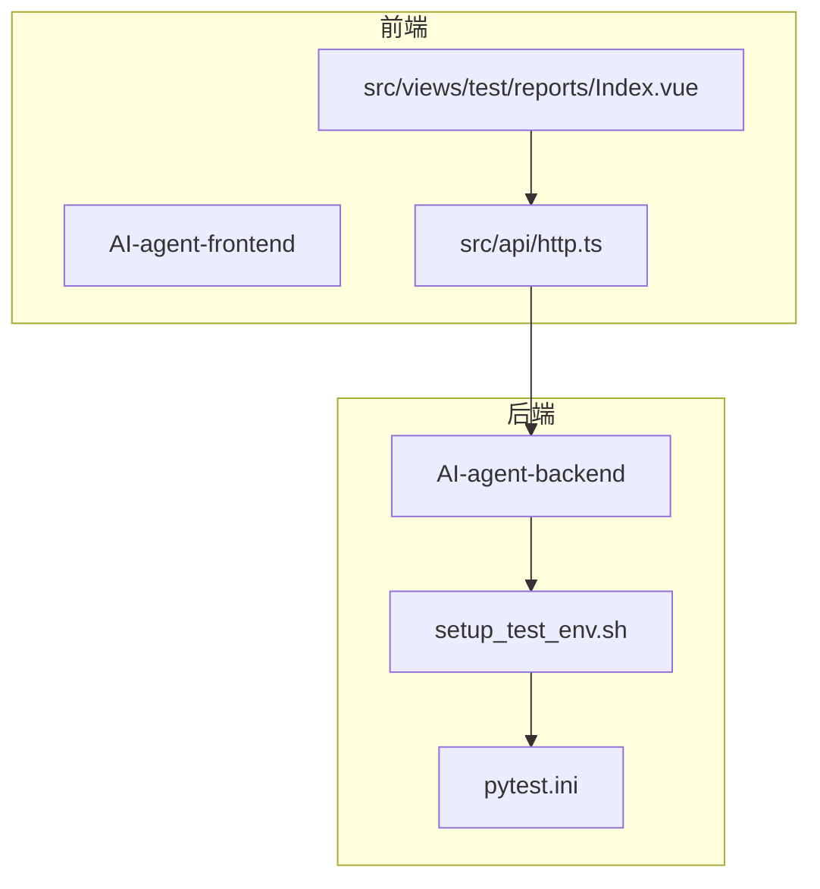
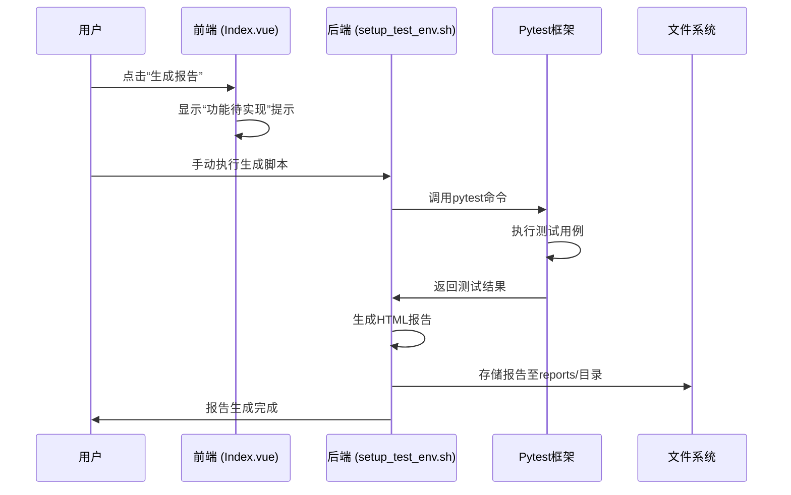
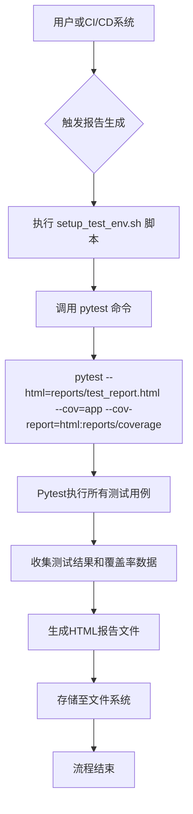
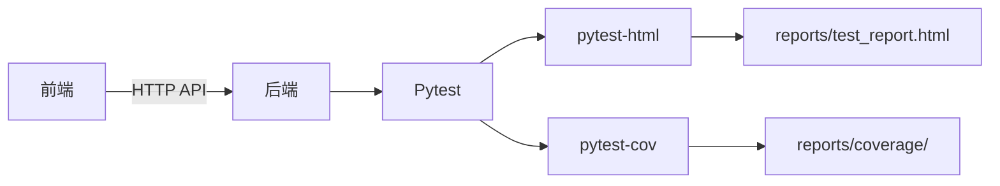

# 测试报告生成

<cite>
**本文档引用的文件**  
- [Index.vue](file://AI-agent-frontend\src\views\test\reports\Index.vue)
- [setup_test_env.sh](file://AI-agent-backend\setup_test_env.sh)
- [http.ts](file://AI-agent-frontend\src\api\http.ts)
- [pytest.ini](file://AI-agent-backend\setup_test_env.sh)
</cite>

## 目录
1. [简介](#简介)
2. [项目结构](#项目结构)
3. [核心组件](#核心组件)
4. [架构概览](#架构概览)
5. [详细组件分析](#详细组件分析)
6. [依赖分析](#依赖分析)
7. [性能考虑](#性能考虑)
8. [故障排除指南](#故障排除指南)
9. [结论](#结论)

## 简介
本文档系统化地描述了AI代理测试平台中测试报告生成功能的技术实现。该功能涵盖测试执行后结果的收集、可视化展示与历史记录查询。前端通过Element Plus组件库实现报告列表的分页、筛选与操作功能，后端则通过自动化测试框架生成HTML格式的测试报告并存储于文件系统。文档详细说明了前后端交互逻辑、数据结构设计、报告生成流程及存储策略，并提供典型使用场景与优化建议。

## 项目结构
测试报告功能涉及前后端多个模块。前端页面位于`AI-agent-frontend/src/views/test/reports/`目录下，主要由`Index.vue`构成。后端报告生成逻辑通过Shell脚本调用Pytest框架实现，相关配置位于项目根目录的`setup_test_env.sh`脚本中。



**图示来源**  
- [Index.vue](file://AI-agent-frontend\src\views\test\reports\Index.vue)
- [setup_test_env.sh](file://AI-agent-backend\setup_test_env.sh)

**本节来源**  
- [Index.vue](file://AI-agent-frontend\src\views\test\reports\Index.vue)
- [setup_test_env.sh](file://AI-agent-backend\setup_test_env.sh)

## 核心组件
测试报告功能的核心组件包括前端的报告管理页面（`Index.vue`）和后端的自动化报告生成脚本（`setup_test_env.sh`）。前端负责展示报告列表、状态、通过率等信息，并提供生成、查看、导出、删除等操作入口。后端通过Pytest框架执行测试用例，并利用`pytest-html`插件生成包含测试结果和覆盖率信息的HTML报告。

**本节来源**  
- [Index.vue](file://AI-agent-frontend\src\views\test\reports\Index.vue)
- [setup_test_env.sh](file://AI-agent-backend\setup_test_env.sh)

## 架构概览
整个测试报告生成流程采用前后端分离架构。前端用户通过界面触发“生成报告”操作（当前为占位功能），后端通过预设的Shell脚本批量执行Pytest测试套件。测试框架自动生成HTML格式的测试报告和HTML格式的代码覆盖率报告，并统一存储在`reports/`目录下。



**图示来源**  
- [Index.vue](file://AI-agent-frontend\src\views\test\reports\Index.vue)
- [setup_test_env.sh](file://AI-agent-backend\setup_test_env.sh)

## 详细组件分析

### 前端报告管理页面分析
前端`Index.vue`文件实现了测试报告的列表展示与交互功能，主要使用Element Plus的`el-table`和`el-pagination`组件。

#### 报告列表与可视化展示
页面使用`el-table`组件展示报告数据，关键列包括：
- **通过率**: 使用`el-progress`进度条组件可视化展示，通过`getPassRateStatus`函数根据数值返回`success`、`warning`或`exception`状态。
- **状态**: 使用`el-tag`标签组件展示，通过`getStatusType`函数将“已完成”、“生成中”、“失败”等文本映射为`success`、`info`、`danger`等视觉类型。

```vue
<el-table-column prop="passRate" label="通过率">
  <template #default="scope">
    <el-progress :percentage="scope.row.passRate" :status="getPassRateStatus(scope.row.passRate)" />
  </template>
</el-table-column>
<el-table-column prop="status" label="状态">
  <template #default="scope">
    <el-tag :type="getStatusType(scope.row.status)">{{ scope.row.status }}</el-tag>
  </template>
</el-table-column>
```

#### 分页与筛选实现逻辑
分页功能由`el-pagination`组件实现，通过`v-model:current-page`和`v-model:page-size`双向绑定`currentPage`和`pageSize`响应式变量。`@size-change`和`@current-change`事件触发`handleSizeChange`和`handleCurrentChange`方法，用于处理每页条数和当前页码的变化，逻辑上应触发重新加载数据。

```vue
<el-pagination
  v-model:current-page="currentPage"
  v-model:page-size="pageSize"
  :page-sizes="[10, 20, 50, 100]"
  layout="total, sizes, prev, pager, next, jumper"
  :total="total"
  @size-change="handleSizeChange"
  @current-change="handleCurrentChange"
/>
```

#### 操作功能实现
页面提供了查看、导出、删除等操作按钮，通过Element Plus的`ElMessage`和`ElMessageBox`组件提供用户反馈。
- **生成报告**: `handleGenerateReport`方法目前仅显示“功能待实现”的提示信息。
- **查看**: `handleView`方法显示查看报告的提示。
- **删除**: `handleDelete`方法弹出确认对话框，用户确认后显示删除成功消息。

```typescript
const handleDelete = (row: any) => {
  ElMessageBox.confirm(`确定要删除报告 "${row.name}" 吗?`, '提示', {
    confirmButtonText: '确定',
    cancelButtonText: '取消',
    type: 'warning'
  }).then(() => {
    ElMessage.success(`删除报告: ${row.name}`)
  }).catch(() => {
    ElMessage.info('已取消删除')
  })
}
```

**图示来源**  
- [Index.vue](file://AI-agent-frontend\src\views\test\reports\Index.vue)

**本节来源**  
- [Index.vue](file://AI-agent-frontend\src\views\test\reports\Index.vue)

### 后端报告生成逻辑分析
后端的报告生成逻辑主要在`setup_test_env.sh`脚本的`generate_reports`函数中定义，通过调用Pytest命令行工具实现。

#### 报告数据结构与统计聚合
后端并未在数据库中定义专门的“测试报告”实体模型，而是直接利用Pytest框架的原生能力。报告的核心数据结构由Pytest自动生成，主要包括：
- **测试结果**: 包含每个测试用例的执行状态（通过/失败）、执行时间、错误堆栈等。
- **通过率**: 由Pytest自动计算并展示在HTML报告中。
- **代码覆盖率**: 通过`--cov`参数生成，以HTML格式展示各文件的行覆盖率。

#### 异步任务与生成流程
报告生成流程本质上是一个批处理任务，其流程图如下：



**图示来源**  
- [setup_test_env.sh](file://AI-agent-backend\setup_test_env.sh)

#### API响应示例
由于前端的API调用尚未实现，以下是根据`http.ts`中定义的通用响应格式推测的API响应示例：
```json
{
  "success": true,
  "data": {
    "id": 1,
    "name": "登录功能测试报告",
    "testCase": "login_test",
    "passRate": 100,
    "status": "已完成",
    "createTime": "2025-08-20 10:30:00"
  },
  "message": "获取成功",
  "timestamp": "2025-08-20T10:30:00Z"
}
```

#### 报告文件存储策略
报告文件采用**文件系统存储**策略，而非数据库存储。所有报告均生成在项目根目录下的`reports/`文件夹中。
- **测试报告**: 存储路径为`reports/test_report.html`。
- **覆盖率报告**: 存储路径为`reports/coverage/index.html`。
此策略简单高效，适用于由自动化测试框架直接生成的静态报告文件。

**本节来源**  
- [setup_test_env.sh](file://AI-agent-backend\setup_test_env.sh)
- [pytest.ini](file://AI-agent-backend\setup_test_env.sh)

## 依赖分析
测试报告功能依赖于以下关键技术和工具：
- **前端**: Vue 3, TypeScript, Element Plus UI库, Axios HTTP客户端。
- **后端**: Python, Pytest测试框架, pytest-html插件, pytest-cov插件。
- **通信**: 前后端通过HTTP API进行交互，遵循`ApiResponse`约定的响应格式。



**图示来源**  
- [http.ts](file://AI-agent-frontend\src\api\http.ts)
- [setup_test_env.sh](file://AI-agent-backend\setup_test_env.sh)

**本节来源**  
- [http.ts](file://AI-agent-frontend\src\api\http.ts)
- [setup_test_env.sh](file://AI-agent-backend\setup_test_env.sh)

## 性能考虑
目前的实现存在以下性能优化点：
1. **前端数据加载**: `Index.vue`中的数据为静态模拟数据。在真实场景下，应实现分页API，避免一次性加载所有报告数据。
2. **高频查询缓存**: 对于报告列表等高频查询接口，可利用后端的`memory_cache.py`或`redis_client.py`进行结果缓存，减少数据库或文件系统的I/O压力。
3. **异步报告生成**: 当前的`generate_reports`是同步脚本。在完整实现中，应设计为异步任务（如Celery），避免长时间运行阻塞API。

## 故障排除指南
- **问题**: 前端点击“生成报告”无反应。
  - **原因**: 该功能尚未实现，仅为占位符。
  - **解决方案**: 需要后端提供生成报告的API，并在前端调用。
- **问题**: 执行`setup_test_env.sh`后未生成报告。
  - **原因**: 可能缺少`pytest-html`或`pytest-cov`依赖。
  - **解决方案**: 检查`install_dependencies`函数是否成功安装了这些包。
- **问题**: 报告文件生成路径错误。
  - **原因**: `pytest.ini`文件中的路径配置不正确。
  - **解决方案**: 确认`pytest.ini`中的`--html`和`--cov-report`参数指向正确的`reports/`目录。

**本节来源**  
- [Index.vue](file://AI-agent-frontend\src\views\test\reports\Index.vue)
- [setup_test_env.sh](file://AI-agent-backend\setup_test_env.sh)

## 结论
当前的测试报告功能在前端已具备良好的UI展示和交互设计，但核心的API连接和后端服务尚未完全集成。后端依赖于成熟的Pytest生态，通过Shell脚本驱动，能够有效生成HTML格式的测试和覆盖率报告。建议下一步开发工作聚焦于：
1. 在后端创建专门的测试报告API控制器和数据模型（可选）。
2. 实现前端`handleGenerateReport`等方法，调用后端API。
3. 将Shell脚本中的报告生成逻辑封装为后端服务，支持通过API触发。
4. 考虑引入异步任务队列处理耗时的报告生成过程。