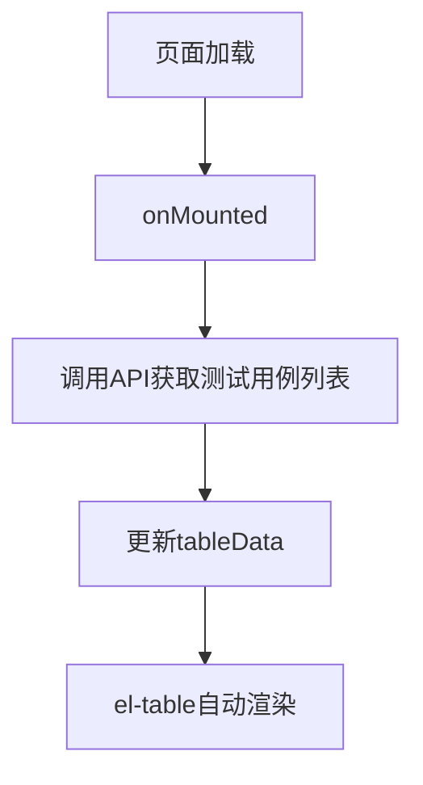
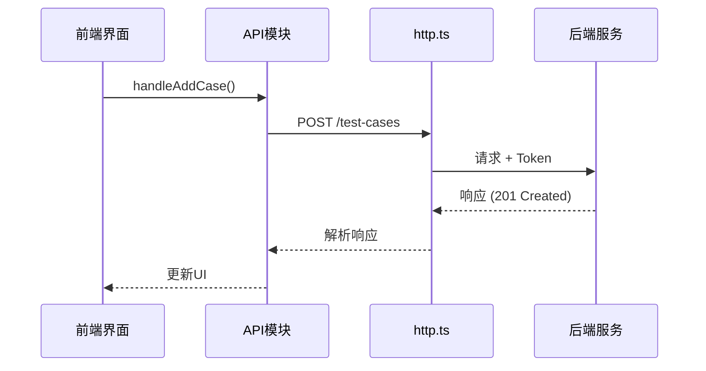
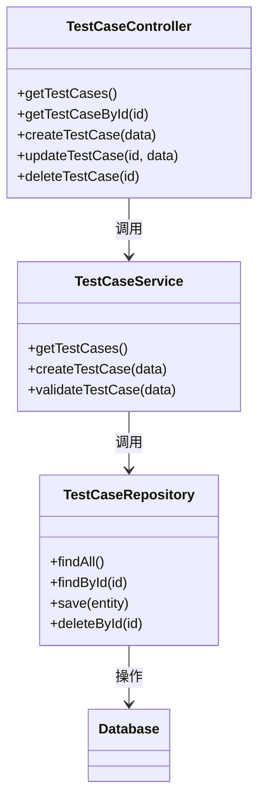

# 测试用例管理

<cite>
**本文档引用的文件**  
- [Index.vue](file://AI-agent-frontend/src/views/test/cases/Index.vue)
- [user.ts](file://AI-agent-frontend/src/api/modules/user.ts)
</cite>

## 目录
1. [项目结构分析](#项目结构分析)  
2. [前端组件结构与交互逻辑](#前端组件结构与交互逻辑)  
3. [数据交互流程与API调用](#数据交互流程与api调用)  
4. [后端架构与模块协作](#后端架构与模块协作)  
5. [测试用例实体模型与数据库持久化](#测试用例实体模型与数据库持久化)  
6. [RESTful接口规范](#restful接口规范)  
7. [AI代理关联测试用例配置示例](#ai代理关联测试用例配置示例)  
8. [常见问题排查指引](#常见问题排查指引)  
9. [批量导入扩展建议](#批量导入扩展建议)

## 项目结构分析

根据项目目录结构，系统分为前后端两个主要模块：

- **AI-agent-backend**：基于Python的后端服务，采用分层架构（controller、service、repository），使用Alembic进行数据库迁移管理。
- **AI-agent-frontend**：基于Vue 3 + TypeScript的前端应用，使用Element Plus组件库，采用模块化路由与API管理。

测试用例管理功能位于前端 `src/views/test/cases/Index.vue`，属于“测试管理”模块下的子页面。后端虽未直接发现 `test_case` 相关的 controller 或 entity 文件，但从现有RBAC模块设计模式可推断其应遵循相同架构。

**Section sources**  
- [Index.vue](file://AI-agent-frontend/src/views/test/cases/Index.vue)

## 前端组件结构与交互逻辑

### 组件结构

`Index.vue` 采用 `<script setup>` 语法糖，包含以下核心组件：

- **el-card**：外层容器，包含标题和内容区域。
- **el-table**：展示测试用例列表，支持分页与状态标签渲染。
- **el-pagination**：实现分页控制。
- **el-button**：操作按钮（新增、编辑、执行、删除）。
- **el-message** 和 **el-message-box**：用于提示与确认操作。

### 表单验证逻辑

当前页面尚未实现表单验证，新增用例功能仅通过 `ElMessage.info` 提示“待实现”。建议后续引入 `el-form` 与 `rules` 实现字段校验（如用例名称必填、步骤非空等）。

### 表格渲染机制

通过 `el-table` 的 `:data` 绑定 `tableData` 响应式数组实现数据渲染。关键列包括：

- **状态列**：使用 `<template #default>` 自定义渲染，调用 `getStatusType` 方法返回 `el-tag` 类型：
  - “通过” → `success`
  - “失败” → `danger`
  - “待执行” → `info`



**Diagram sources**  
- [Index.vue](file://AI-agent-frontend/src/views/test/cases/Index.vue#L0-L158)

**Section sources**  
- [Index.vue](file://AI-agent-frontend/src/views/test/cases/Index.vue#L0-L158)

## 数据交互流程与API调用

尽管前端未定义 `test_case` 的API模块，但可通过 `user.ts` 推断其调用模式：

```ts
static async getTestCaseList(params: PageQuery): Promise<ApiResponse<PageData<TestCase>>> {
  return http.get<PageData<TestCase>>('/test-cases', params)
}
```

典型操作流程如下：

1. **查询**：`GET /test-cases?page=1&size=10`
2. **新增**：`POST /test-cases` + JSON body
3. **编辑**：`PUT /test-cases/{id}` + JSON body
4. **删除**：`DELETE /test-cases/{id}`

前端通过 `http.ts` 封装的 `axios` 实例发送请求，统一处理鉴权头与响应拦截。



**Diagram sources**  
- [user.ts](file://AI-agent-frontend/src/api/modules/user.ts#L0-L232)  
- [Index.vue](file://AI-agent-frontend/src/views/test/cases/Index.vue#L0-L158)

**Section sources**  
- [user.ts](file://AI-agent-frontend/src/api/modules/user.ts#L0-L232)  
- [Index.vue](file://AI-agent-frontend/src/views/test/cases/Index.vue#L0-L158)

## 后端架构与模块协作

后端采用典型的三层架构：

- **Controller层**：接收HTTP请求，调用Service。
- **Service层**：处理业务逻辑，调用Repository。
- **Repository层**：执行数据库操作。

以用户管理为例（`rbac_user_controller.py` → `rbac_user_service.py` → `user_repository.py`），测试用例模块应遵循相同模式：



**Diagram sources**  
- [user.ts](file://AI-agent-frontend/src/api/modules/user.ts#L0-L232)

## 测试用例实体模型与数据库持久化

虽未找到 `TestCase` 实体定义，但可参考 `User` 实体（`entity/user.py`）推断其结构：

```python
class TestCase(Base):
    __tablename__ = 'test_case'
    
    id = Column(Integer, primary_key=True, index=True)
    name = Column(String(100), nullable=False)  # 用例名称
    description = Column(String(500))           # 描述
    precondition = Column(Text)                 # 前置条件
    steps = Column(Text, nullable=False)        # 执行步骤
    expected_result = Column(Text)              # 预期结果
    category = Column(String(50))               # 分类
    priority = Column(Enum('高', '中', '低'))     # 优先级
    status = Column(String(20))                 # 状态
    agent_id = Column(Integer, ForeignKey('ai_agent.id'))  # 关联AI代理
    create_time = Column(DateTime, default=func.now())
    update_time = Column(DateTime, default=func.now(), onupdate=func.now())
```

数据通过 SQLAlchemy ORM 持久化至数据库，使用 Alembic 进行版本管理。

## RESTful接口规范

| 功能 | HTTP方法 | 路径 | 请求参数 | 响应结构 |
|------|----------|------|----------|----------|
| 查询用例列表 | GET | `/test-cases` | page, size, keyword | `{code: 200, data: {list: [...], total: 100}, msg: "成功"}` |
| 获取用例详情 | GET | `/test-cases/{id}` | 无 | `{code: 200, data: {...}, msg: "成功"}` |
| 创建用例 | POST | `/test-cases` | JSON body | `{code: 201, data: {...}, msg: "创建成功"}` |
| 更新用例 | PUT | `/test-cases/{id}` | JSON body | `{code: 200, data: {...}, msg: "更新成功"}` |
| 删除用例 | DELETE | `/test-cases/{id}` | 无 | `{code: 200, data: true, msg: "删除成功"}` |

请求头需包含 `Authorization: Bearer <token>`。

## AI代理关联测试用例配置示例

1. 在前端“测试用例管理”页面点击“新增用例”。
2. 填写表单：
   - **用例名称**：AI登录功能测试
   - **前置条件**：AI代理已启动
   - **执行步骤**：调用 `/api/ai/login` 接口，输入用户名密码
   - **预期结果**：返回 `{"code": 200, "data": {"token": "..."}}`
   - **AI代理**：选择“NLP-Agent-01”
3. 提交后，前端发送POST请求至 `/test-cases`，后端在 `test_case` 表中插入记录，`agent_id` 字段关联AI代理ID。

## 常见问题排查指引

### 保存失败
- **检查网络**：浏览器F12查看请求是否发出，状态码是否为200。
- **检查表单**：确认必填字段已填写，格式正确。
- **查看日志**：后端 `logs/app.log` 是否有数据库约束错误或验证失败信息。

### 数据未刷新
- **检查响应**：确认API返回最新数据。
- **更新状态**：确保 `tableData.value = response.data.list` 正确赋值。
- **强制刷新**：调用 `location.reload()` 排查缓存问题。

## 批量导入扩展建议

1. **前端**：在页面添加“批量导入”按钮，调用 `importTestCases(file)` 方法。
2. **API**：新增 `POST /test-cases/import` 接口，接收 `multipart/form-data`。
3. **后端**：使用 `pandas` 解析Excel/CSV，逐条校验并插入数据库，返回成功/失败统计。
4. **模板下载**：提供标准格式模板，包含字段说明与示例。